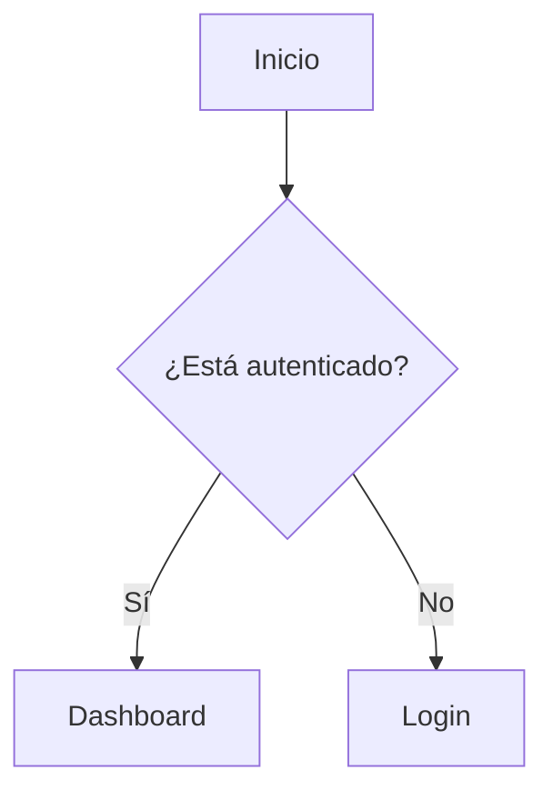
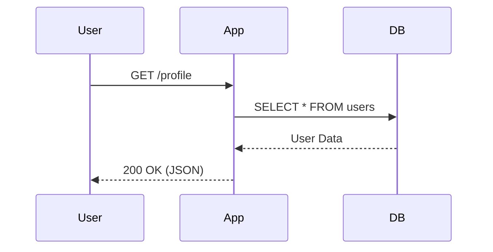
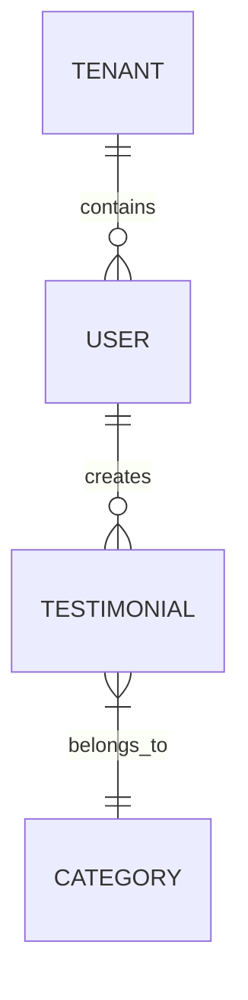

# Guía Rápida de Mermaid.js

## 1. Diagrama de Flujo (Flowchart)

```mermaid
graph TD
    A[Inicio] --> B{¿Está autenticado?}
    B -- Sí --> C[Dashboard]
    B -- No --> D[Login]
```

## 2. Diagrama de Secuencia

```mermaid
sequenceDiagram
    participant User
    participant App
    participant DB
    User->>App: GET /profile
    App->>DB: SELECT * FROM users
    DB-->>App: User Data
    App-->>User: 200 OK (JSON)
```

## 3. Diagrama Entidad-Relación (ER)

```mermaid
erDiagram
    TENANT ||--o{ USER : contains
    USER ||--o{ TESTIMONIAL : creates
    TESTIMONIAL }|--|| CATEGORY : belongs_to
```
