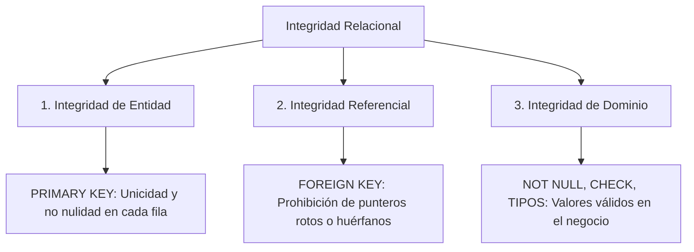

# SKL-DB-SQL-001: Senior Relational Database Design, SQL & Persistence Engineering

```text
====================================================================================================
ESPECIFICACIÓN TÉCNICA DE HABILIDAD: SKL-DB-SQL-001
Senior Relational Database Design, SQL & Persistence Engineering — Versión 1.1.0
Estándares: ISO/IEC 9075 (SQL Standard) | IEEE 29148 | ISO/IEC 25010 | ACID | Agile DoD
Baseline Técnico: PostgreSQL 16+ (Motor Principal), MySQL 8+, SQL Server 2022, SQLite 3, Oracle 23ai
Host Application: NestJS 11, TypeScript 5.8+, Prisma ORM 6.5+, Next.js 15
Responsable: Facundo Nicolás González
Dominio: Bases de Datos Relacionales / SQL / Backend / Data Engineering
====================================================================================================
```

---

## 1. Ficha de Identificación del Skill

| Atributo | Definición Técnica |
| :--- | :--- |
| **Código de Habilidad** | `SKL-DB-SQL-001` |
| **Nombre de Habilidad** | Senior Relational Database Design, SQL & Persistence Engineering |
| **Versión** | `1.1.0` |
| **Nivel Objetivo** | Intermedio $\longrightarrow$ Avanzado / Profesional / Senior |
| **Habilidad Principal** | Diseño, modelado, implementación, optimización y evolución de bases de datos relacionales SQL |
| **Objetivo de Dominio** | Capacitar al practicante para transformar reglas de negocio en esquemas relacionales consistentes, normalizados, eficientes, trazables y mantenibles |
| **Áreas Principales** | Modelado ER, SQL Estándar, DDL/DML/DQL/TCL/DCL, Relaciones, Constraints, Normalización (1NF a 3NF), Índices, Transacciones ACID, Concurrencia (MVCC), Migraciones y Optimización con EXPLAIN |
| **Motores Objetivo** | **PostgreSQL (Primario)**, MySQL, MariaDB, Microsoft SQL Server, SQLite y Oracle Database |
| **Tipo de Proyecto** | Backend, APIs REST/GraphQL, SaaS Multi-tenant, Sistemas Transaccionales, E-commerce, Data Engineering |
| **Complejidad** | Media / Alta |
| **Paradigma** | Modelo Relacional Formal + Integridad Declarativa + Transacciones ACID |
| **Prioridad Arquitectónica**| **Correctitud → Integridad → Mantenibilidad → Rendimiento → Optimización Específica** |

---

## 2. Descripción y Filosofía de Diseño

Esta habilidad se enfoca en diseñar bases de datos relacionales partiendo rigurosamente del **dominio del negocio y sus invariantes esenciales**, evitando tratar la base de datos como un mero "almacén tonto de objetos JSON" o un apéndice pasivo de un ORM.

SQL es un **lenguaje declarativo basado en la teoría de conjuntos y la lógica de predicados**. Aunque cada motor introduce dialectos y optimizaciones físicas particulares, los principios relacionales son universales.

---

### 2.1. Integridad por Diseño (Declarative Integrity)

> [!IMPORTANT]
> **Las reglas fundamentales del negocio deben expresarse mediante mecanismos nativos y declarativos de la base de datos siempre que sea técnicamente viable.**

```text
PRIMARY KEY  ──► Unicidad e identidad de la fila
FOREIGN KEY  ──► Consistencia en el grafo de relaciones
UNIQUE       ──► Unicidad en claves candidatas y de negocio
NOT NULL     ──► Obligatoriedad y ausencia de estados ambiguos
CHECK        ──► Restricciones de dominio y rangos válidos
DATA TYPES   ──► Precisión semántica y matemática exacta
TRANSACTIONS ──► Atomicidad y consistencia en mutaciones concurrentes
```

Una aplicación web o un ORM **nunca debe ser la única barrera de defensa** para impedir estados corruptos. Los bugs de software, scripts manuales, fallos de red y migraciones concurrentes pueden eludir las validaciones de la aplicación. Los constraints relacionales garantizan que el propio SGBD rechace categóricamente cualquier dato que viole las reglas del esquema.

---

### 2.2. Modelar Primero el Dominio

Antes de ejecutar `CREATE TABLE` o escribir modelos en Prisma, el ingeniero **MUST** identificar con precisión:

```text
Entidades del Negocio (Organización, Testimonio, Usuario, Campaña)
      ↓
Atributos Semánticos (Email, Calificación, Contenido, Fechas)
      ↓
Relaciones y Cardinalidades (1:1, 1:N, N:M, Autorreferenciales)
      ↓
Opcionalidad (¿Puede existir un pedido sin cliente? ¿Un testimonio sin autor?)
      ↓
Identificadores Naturales vs Técnicos (Slug vs UUIDv7)
      ↓
Invariantes Inquebrantables (Rating entre 1 y 5, Precios no negativos)
      ↓
Ciclos de Vida y Políticas de Borrado (CASCADE vs RESTRICT)
      ↓
Patrones de Acceso y Volumetría Prevista (Read-heavy vs Write-heavy)
```

La estructura física SQL debe ser la consecuencia directa del modelo conceptual, jamás al revés.

---

### 2.3. Normalizar Antes de Desnormalizar

Por defecto, todo esquema relacional debe nacer **correctamente normalizado al menos hasta Tercera Forma Normal (3NF)**.

> [!CAUTION]
> **Queda terminantemente prohibido desnormalizar una tabla basándose en la premisa amateur de que *"los JOINs son lentos"*.**

La desnormalización solo es admisible cuando exista una necesidad comprobada mediante métricas reales de:
1. Conservación de **snapshots históricos inmutables** (ej. congelar el precio unitario en una línea de pedido o el nombre del autor en un testimonio al momento de crearlo).
2. Workloads analíticos de agregación intensiva (OLAP / BI).
3. Cuellos de botella críticos medidos y verificados con `EXPLAIN ANALYZE`.

---

### 2.4. Correctitud Antes que Optimización Prematura

El orden de trabajo inmutable de la ingeniería de persistencia es:

$$\mathbf{Dominio} \longrightarrow \mathbf{Modelo\ ER} \longrightarrow \mathbf{Modelo\ L\acute{o}gico} \longrightarrow \mathbf{Constraints} \longrightarrow \mathbf{3NF} \longrightarrow \mathbf{Consultas} \longrightarrow \mathbf{EXPLAIN} \longrightarrow \mathbf{\acute{I}ndices} \longrightarrow \mathbf{F\acute{i}sica}$$

---

### 2.5. El Esquema como una API Persistente

Una base de datos de producción es la capa de software más longeva de una empresa. Sobrevive a frameworks web, librerías cliente, cambios de lenguaje y reestructuraciones de equipo.

**Directrices de Longevidad:**
- Nombres explícitos, predecibles y consistentes en minúsculas (`snake_case`).
- Constraints con nombres descriptivos (`pk_*`, `fk_*`, `uq_*`, `ck_*`).
- Cero dependencia en comportamientos implícitos o defaults no declarados.
- Todo cambio estructural se realiza mediante **migraciones versionadas y reproducibles**.
- Compatibilidad hacia atrás garantizada durante despliegues mediante el patrón *Expand-Contract*.

---

## 3. Fundamentos del Modelo Relacional

| Concepto | Definición Formal | Manifestación Física en SQL |
| :--- | :--- | :--- |
| **Entidad** | Objeto o concepto del mundo real relevante para el dominio. | Tabla de Entidades (`customers`, `testimonials`). |
| **Tabla / Relación** | Conjunto no ordenado de tuplas que comparten atributos. | `CREATE TABLE ...` con nombre en plural. |
| **Fila / Tupla** | Instancia individual concreta de una relación. | Un registro retornado por `SELECT` o insertado con `INSERT`. |
| **Columna / Atributo**| Propiedad atómica tipada que describe a la entidad. | Campo con tipo de dato específico y restricciones. |
| **Primary Key (PK)** | Atributo o conjunto mínimo que identifica unívocamente a cada fila. | `CONSTRAINT pk_name PRIMARY KEY (id)`. |
| **Foreign Key (FK)** | Atributo cuyos valores deben coincidir con la PK de otra relación. | `CONSTRAINT fk_name FOREIGN KEY (col) REFERENCES ...`. |
| **Candidate Key** | Cualquier atributo o superclave mínima con potencial de ser PK. | Columnas con restricción `UNIQUE NOT NULL`. |
| **Natural Key** | Identificador con significado intrínseco proveniente del negocio. | Código ISO de país (`AR`, `US`), CUIT, ISBN. |
| **Surrogate Key** | Identificador artificial creado por el sistema sin significado de negocio. | Entero auto-incremental (`IDENTITY`), UUIDv4, UUIDv7. |
| **Constraint** | Regla lógica declarativa que restringe los estados válidos de la base. | `NOT NULL`, `UNIQUE`, `CHECK`, `PRIMARY KEY`, `FOREIGN KEY`. |
| **Cardinalidad** | Cantidad máxima de instancias que pueden relacionarse ($1:1$, $1:N$, $N:M$). | Definición de claves foráneas y tablas asociativas. |
| **Opcionalidad** | Participación mínima en la relación ($0$ opcional vs $1$ obligatorio). | `NULL` (opcional) vs `NOT NULL` (obligatorio). |
| **Semántica de NULL**| Representa ausencia de valor, desconocido o no aplicable. **No es cero ni vacío**. | Requiere lógica trivaluada (`IS NULL`, `IS NOT NULL`, `COALESCE`). |

---

## 4. Relaciones entre Tablas y su Implementación SQL

```text
┌─────────────────────────────────────────────────────────────┐
│ 1:1  ──► Uno a Uno (PK compartida o FK con UNIQUE)          │
├─────────────────────────────────────────────────────────────┤
│ 1:N  ──► Uno a Muchos (FK en el lado N)                     │
├─────────────────────────────────────────────────────────────┤
│ N:M  ──► Muchos a Muchos (Entidad asociativa intermedia)    │
├─────────────────────────────────────────────────────────────┤
│ 1:N  ──► Autorreferencial (FK apuntando a la misma tabla)   │
└─────────────────────────────────────────────────────────────┘
```

---

### 4.1. Relación Uno a Uno — 1:1

Cada fila de la tabla A se relaciona con a lo sumo una fila de la tabla B, y viceversa.

```text
users 1 ────────── 1 user_profiles
```

#### Implementación Recomendada (PK Compartida como FK):
```sql
CREATE TABLE users (
    id BIGINT GENERATED ALWAYS AS IDENTITY,
    email VARCHAR(320) NOT NULL,
    created_at TIMESTAMP WITH TIME ZONE DEFAULT CURRENT_TIMESTAMP NOT NULL,

    CONSTRAINT pk_users PRIMARY KEY (id),
    CONSTRAINT uq_users_email UNIQUE (email)
);

CREATE TABLE user_profiles (
    user_id BIGINT NOT NULL,
    first_name VARCHAR(100) NOT NULL,
    last_name VARCHAR(100) NOT NULL,
    avatar_url TEXT,

    -- user_id es simultáneamente Primary Key y Foreign Key
    CONSTRAINT pk_user_profiles PRIMARY KEY (user_id),
    CONSTRAINT fk_user_profiles_users FOREIGN KEY (user_id)
        REFERENCES users (id)
        ON DELETE CASCADE
);
```

**Ventajas Arquitectónicas:**
- Un usuario jamás puede poseer más de un perfil (la PK lo impide físicamente a nivel de índice B-Tree).
- No requiere índices secundarios adicionales para garantizar la unicidad de la relación.

**Cuándo Usar 1:1:**
- Separación de responsabilidades y aislamiento de datos de seguridad.
- Sub-agregados opcionales con ciclos de vida independientes.
- Datos pesados poco consultados (evitando inflar el tamaño de la página de disco de la tabla principal).

---

### 4.2. Relación Uno a Muchos — 1:N

Es la relación más común del modelo relacional. La regla de oro es:

$$\mathbf{La\ Foreign\ Key\ se\ ubica\ SIEMPRE\ en\ el\ lado\ N\ de\ la\ relaci\acute{o}n}$$

```text
organizations 1 ────────── N testimonials
```

```sql
CREATE TABLE organizations (
    id BIGINT GENERATED ALWAYS AS IDENTITY,
    name VARCHAR(150) NOT NULL,
    slug VARCHAR(100) NOT NULL,

    CONSTRAINT pk_organizations PRIMARY KEY (id),
    CONSTRAINT uq_organizations_slug UNIQUE (slug)
);

CREATE TABLE testimonials (
    id BIGINT GENERATED ALWAYS AS IDENTITY,
    organization_id BIGINT NOT NULL, -- Lado N
    author_name VARCHAR(150) NOT NULL,
    content TEXT NOT NULL,
    status VARCHAR(30) DEFAULT 'PENDING' NOT NULL,
    created_at TIMESTAMP WITH TIME ZONE DEFAULT CURRENT_TIMESTAMP NOT NULL,

    CONSTRAINT pk_testimonials PRIMARY KEY (id),
    CONSTRAINT fk_testimonials_organizations FOREIGN KEY (organization_id)
        REFERENCES organizations (id)
        ON DELETE RESTRICT,
    CONSTRAINT ck_testimonials_status CHECK (
        status IN ('PENDING', 'APPROVED', 'REJECTED', 'FLAGGED')
    )
);

-- Obligatorio en PostgreSQL: crear índice sobre la FK
CREATE INDEX idx_testimonials_organization_id ON testimonials (organization_id);
```

---

### 4.3. Relación Muchos a Muchos — N:M

Una relación $N:M$ **NUNCA** debe resolverse guardando listas de IDs separadas por coma en una columna de texto. Se resuelve introduciendo una **entidad asociativa intermedia**:

```text
testimonials N ────────── enrollments / tags ────────── M tags
```

```sql
CREATE TABLE tags (
    id BIGINT GENERATED ALWAYS AS IDENTITY,
    name VARCHAR(50) NOT NULL,

    CONSTRAINT pk_tags PRIMARY KEY (id),
    CONSTRAINT uq_tags_name UNIQUE (name)
);

CREATE TABLE testimonial_tags (
    testimonial_id BIGINT NOT NULL,
    tag_id BIGINT NOT NULL,
    assigned_at TIMESTAMP WITH TIME ZONE DEFAULT CURRENT_TIMESTAMP NOT NULL,

    -- Clave primaria compuesta que erradica asignaciones duplicadas
    CONSTRAINT pk_testimonial_tags PRIMARY KEY (testimonial_id, tag_id),
    
    CONSTRAINT fk_testimonial_tags_testimonial FOREIGN KEY (testimonial_id)
        REFERENCES testimonials (id)
        ON DELETE CASCADE,

    CONSTRAINT fk_testimonial_tags_tag FOREIGN KEY (tag_id)
        REFERENCES tags (id)
        ON DELETE RESTRICT
);

-- Índice reverso indispensable para búsquedas por tag
CREATE INDEX idx_testimonial_tags_tag_id ON testimonial_tags (tag_id);
```

---

### 4.4. La Entidad Asociativa como Concepto Real de Negocio

La tabla intermedia no es una "simple tabla puente"; con frecuencia modela un concepto nuclear del dominio (ej. `order_items`, `subscriptions`, `contract_memberships`) y posee atributos propios:
- `quantity`, `unit_price`, `discount`, `created_at`.
- Puede tener su propia surrogate key `id BIGINT PRIMARY KEY` si participa como padre de otras relaciones.

---

### 4.5. Relaciones Autorreferenciales (Jerarquías)

Una tabla puede referenciarse a sí misma para representar árboles, taxonomías o respuestas anidadas:

```sql
CREATE TABLE categories (
    id BIGINT GENERATED ALWAYS AS IDENTITY,
    parent_id BIGINT, -- Opcional: NULL para categorías raíz
    name VARCHAR(120) NOT NULL,

    CONSTRAINT pk_categories PRIMARY KEY (id),
    CONSTRAINT fk_categories_parent FOREIGN KEY (parent_id)
        REFERENCES categories (id)
        ON DELETE RESTRICT
);

CREATE INDEX idx_categories_parent_id ON categories (parent_id);
```

---

## 5. Cardinalidad y Opcionalidad (Participación Mínima)

Determinar la opcionalidad es vital para modelar la realidad del negocio:

```text
ORGANIZATION 1 ───────── 0..N TESTIMONIAL
Un testimonio DEBE tener una organización obligatoria (organization_id NOT NULL).
Una organización PUEDE no tener testimonios aún (0..N).

EMPLOYEE 1 ───────────── 0..1 MANAGER
Un empleado PUEDE no tener un manager asignado (manager_id NULL).
```

---

## 6. Claves e Identidad

### 6.1. Clave Primaria (Primary Key)
Toda tabla de entidades **MUST** poseer una clave primaria única y no nula:
- En PostgreSQL moderno: `id BIGINT GENERATED ALWAYS AS IDENTITY PRIMARY KEY` o `UUIDv7`.
- En MySQL: `id BIGINT UNSIGNED AUTO_INCREMENT PRIMARY KEY`.

---

### 6.2. Natural Key vs Surrogate Key

```text
┌─────────────────────────────────────────────────────────────┐
│ Natural Key: Identificador proveniente del negocio          │
│ (cuit, isbn, country_code, sku, email).                     │
├─────────────────────────────────────────────────────────────┤
│ Surrogate Key: Identificador técnico generado por el sistema│
│ (bigint identity, uuidv7). Libre de significado semántico.  │
└─────────────────────────────────────────────────────────────┘
```

**Regla de Oro:**
> La presencia de una Surrogate Key (`id`) **NO EXIME** de proteger las Natural Keys mediante restricciones `UNIQUE`.

```sql
-- ❌ ANTIPATRÓN: Se crea un id y se olvidan de impedir emails duplicados
CREATE TABLE users ( id BIGINT PRIMARY KEY, email VARCHAR(320) );

-- ✅ PATRÓN SENIOR: Identidad técnica desacoplada con invariante de negocio protegida
CREATE TABLE users (
    id BIGINT GENERATED ALWAYS AS IDENTITY PRIMARY KEY,
    email VARCHAR(320) NOT NULL,
    CONSTRAINT uq_users_email UNIQUE (email)
);
```

---

## 7. Las Tres Dimensiones de la Integridad de Datos



### Ejemplos de Integridad de Dominio con `CHECK`:
```sql
-- Validación de rango numérico
CONSTRAINT ck_testimonials_rating CHECK (rating >= 1 AND rating <= 5)

-- Validación de coherencia temporal
CONSTRAINT ck_campaigns_dates CHECK (ends_at > starts_at)

-- Validación de longitud de slug
CONSTRAINT ck_organizations_slug_length CHECK (char_length(slug) >= 3)
```

---

## 8. Acciones Referenciales: Estrategias `ON DELETE` / `ON UPDATE`

| Acción Referencial | Comportamiento | Cuándo Utilizar |
| :--- | :--- | :--- |
| **`CASCADE`** | Al borrar el padre, se eliminan automáticamente todos sus hijos. | Vida dependiente: borrar un pedido borra sus líneas (`order_items`). |
| **`RESTRICT / NO ACTION`** | Impide el borrado del padre si existen filas hijas asociadas. | Entidades independientes: borrar un cliente no debe borrar facturas emitidas. |
| **`SET NULL`** | Al borrar el padre, la FK del hijo pasa a valer `NULL`. | Relaciones opcionales: borrar un manager deja `manager_id = NULL`. |

> [!CAUTION]
> **No uses `ON DELETE CASCADE` de forma indiscriminada en todo el esquema.** Un borrado accidental en una tabla raíz podría desencadenar la destrucción en cadena de cientos de miles de registros históricos de auditoría.

---

## 9. Teoría y Práctica de Normalización Relacional

La normalización es el proceso de organizar las columnas y tablas para **minimizar la redundancia de datos y prevenir anomalías de inserción, actualización y borrado**.

---

### 9.1. Primera Forma Normal (1NF): Atomicidad
- Cada columna debe contener un **único valor atómico** (indivisible dentro del contexto del sistema).
- No deben existir grupos repetitivos ni columnas serializadas con listas de valores.

```text
❌ ANTIPATRÓN VIOLANDO 1NF:
users: id=1, phones="3794123456, 3794987654"

✅ MODELO CORRECTO EN 1NF:
user_phones: user_id=1, phone="3794123456"
             user_id=1, phone="3794987654"
```

---

### 9.2. Segunda Forma Normal (2NF): Dependencia Funcional Completa
- Debe estar en 1NF.
- Todos los atributos que no forman parte de la clave candidata deben **depender funcionalmente de la totalidad de la clave primaria**, no de una parte de ella (aplica especialmente en claves primarias compuestas).

```text
❌ VIOLANDO 2NF (en order_items con PK compuesta order_id, product_id):
order_id, product_id, product_name, quantity, unit_price
(product_name depende únicamente de product_id, no de order_id).

✅ MODELO EN 2NF:
products: id, name, current_price
order_items: order_id, product_id, quantity, unit_price
```

---

### 9.3. Tercera Forma Normal (3NF): Eliminación de Dependencias Transitivas
- Debe estar en 2NF.
- **Ningún atributo no clave debe depender de otro atributo no clave**. Los atributos no clave deben depender directa y exclusivamente de la clave primaria.

```text
❌ VIOLANDO 3NF:
orders: order_id (PK), customer_id (FK), customer_name, customer_city
(customer_name y customer_city dependen de customer_id, no de order_id).

✅ MODELO EN 3NF:
customers: id (PK), name, city
orders: id (PK), customer_id (FK), created_at
```

---

### 9.4. Desnormalización Controlada y Justificada

La desnormalización solo es válida cuando responde a un requerimiento formal:

```sql
CREATE TABLE order_items (
    order_id BIGINT NOT NULL,
    product_id BIGINT NOT NULL,
    quantity INTEGER NOT NULL,
    -- Desnormalización requerida: el precio pagado es un snapshot inmutable
    unit_price NUMERIC(12,2) NOT NULL,

    CONSTRAINT pk_order_items PRIMARY KEY (order_id, product_id),
    CONSTRAINT fk_order_items_orders FOREIGN KEY (order_id) REFERENCES orders (id),
    CONSTRAINT fk_order_items_products FOREIGN KEY (product_id) REFERENCES products (id)
);
```
Aunque `products` tenga una columna `current_price`, duplicar `unit_price` en `order_items` es indispensable para que los aumentos futuros de precio no alteren fraudulentamente las facturas emitidas en el pasado.

---

## 10. Tipos de Datos y Precisión Matemática

> [!CAUTION]
> **Prohibido utilizar `FLOAT` o `DOUBLE` para almacenar dinero, monedas o saldos contables.**
> Los tipos de coma flotante binarios introducen errores de redondeo por representación física IEEE 754 (ej. `0.1 + 0.2 = 0.30000000000000004`). Utilizar siempre `DECIMAL(precision, scale)` o `NUMERIC(precision, scale)`.

```sql
-- Moneda con precisión de 2 decimales hasta 999.999.999,99
price NUMERIC(12, 2) NOT NULL

-- Fechas y Tiempos: almacenar siempre huso horario
created_at TIMESTAMP WITH TIME ZONE DEFAULT CURRENT_TIMESTAMP NOT NULL

-- Booleanos nativos
is_active BOOLEAN DEFAULT TRUE NOT NULL

-- Texto con longitud acotada vs texto libre
slug VARCHAR(100) NOT NULL
content TEXT NOT NULL
```

---

## 11. Estrategia y Arquitectura de Índices

Un índice es una estructura de datos secundaria (típicamente un B-Tree) que acelera la búsqueda a costa de:
1. **Consumo de almacenamiento en disco y memoria RAM**.
2. **Degradación de rendimiento en operaciones `INSERT`, `UPDATE` y `DELETE`** (el motor debe actualizar el heap de la tabla y todos los árboles de índices asociados en cada escritura).

```text
┌─────────────────────────────────────────────────────────────┐
│ Buenos Candidatos para Índices:                             │
│ - Columnas filtradas frecuentemente en cláusulas WHERE.    │
│ - Columnas utilizadas en condiciones de JOIN (Foreign Keys).│
│ - Columnas utilizadas en ORDER BY y GROUP BY recurrentes.   │
│ - Alta cardinalidad y selectividad (ej. UUID, email, slug). │
├─────────────────────────────────────────────────────────────┤
│ Malos Candidatos para Índices:                              │
│ - Columnas de muy baja cardinalidad (ej. booleano is_active)│
│ - Tablas de menos de 100 filas (Sequential Scan es más veloz)│
│ - Columnas que sufren mutaciones a cada segundo sin lectura.│
└─────────────────────────────────────────────────────────────┘
```

---

### 11.1. Índices de Foreign Keys en PostgreSQL

> [!IMPORTANT]
> **PostgreSQL NO crea índices automáticos sobre las columnas Foreign Key** (a diferencia de MySQL/InnoDB).

Si se define una tabla `testimonials (organization_id BIGINT REFERENCES organizations(id))`, se **MUST** ejecutar explícitamente:
```sql
CREATE INDEX idx_testimonials_organization_id ON testimonials (organization_id);
```
Omitir este índice provocará que cada `JOIN` y cada verificación de borrado referencial (`ON DELETE RESTRICT`) ejecute un **Sequential Scan** sobre millones de filas.

---

### 11.2. Índices Compuestos y la Importancia Crítica del Orden

En un índice compuesto sobre múltiples columnas:

$$\mathbf{INDEX(A, B)} \ne \mathbf{INDEX(B, A)}$$

Un índice B-Tree sobre `(tenant_id, status, created_at DESC)`:
- Optimiza consultas con: `WHERE tenant_id = 1`
- Optimiza consultas con: `WHERE tenant_id = 1 AND status = 'APPROVED'`
- Optimiza consultas con: `WHERE tenant_id = 1 AND status = 'APPROVED' ORDER BY created_at DESC`
- **NO OPTIMIZA** consultas que solo filtren por: `WHERE status = 'APPROVED'` (falta el prefijo principal `tenant_id`).

---

## 12. Transacciones ACID y Control de Concurrencia

Una transacción es una unidad lógica de trabajo indivisible que satisface las cuatro propiedades **ACID**:

```text
A — Atomicity:   O se ejecutan todas las operaciones con éxito, o ninguna tiene efecto.
C — Consistency: La transacción lleva a la base de datos de un estado válido a otro válido.
I — Isolation:   Las transacciones concurrentes no interfieren de forma destructiva entre sí.
D — Durability:  Una vez confirmado el commit, los cambios sobreviven a fallos del servidor.
```

```sql
BEGIN;

UPDATE accounts
SET balance = balance - 100.00
WHERE id = 1 AND balance >= 100.00;

UPDATE accounts
SET balance = balance + 100.00
WHERE id = 2;

-- Si todo es correcto:
COMMIT;

-- Ante cualquier error de ejecución:
ROLLBACK;
```

---

## 13. Fenómenos de Concurrencia y Niveles de Aislamiento SQL

| Nivel de Aislamiento | Dirty Read | Non-Repeatable Read | Phantom Read | Serialization Anomaly |
| :--- | :---: | :---: | :---: | :---: |
| **`READ UNCOMMITTED`** | **Permitido** | Permitido | Permitido | Permitido |
| **`READ COMMITTED` (Default PG)** | No | **Permitido** | Permitido | Permitido |
| **`REPEATABLE READ`** | No | No | No (en PG MVCC) | **Permitido** |
| **`SERIALIZABLE`** | No | No | No | No |

- **Dirty Read**: Leer datos no confirmados (*uncommitted*) por otra transacción que luego hace `ROLLBACK`.
- **Non-Repeatable Read**: Leer la misma fila dos veces en la misma transacción y obtener valores diferentes porque otra transacción modificó y confirmó la fila en el medio.
- **Phantom Read**: Ejecutar dos veces una consulta de rango y encontrar nuevas filas insertadas por otra transacción en el medio.

**Regla de Oro en Producción:**
No aumentes ciegamente el nivel a `SERIALIZABLE`. Genera overhead computacional masivo y aborta transacciones por conflictos de serialización. Utiliza bloqueos explícitos pesimistas (`SELECT ... FOR UPDATE`) o verificación optimista (`version column`) para casos puntuales de contención concurrente.

---

## 14. Categorías del Lenguaje SQL

```text
DDL (Data Definition Language)   ──► CREATE, ALTER, DROP, TRUNCATE
DML (Data Manipulation Language) ──► INSERT, UPDATE, DELETE
DQL (Data Query Language)        ──► SELECT
TCL (Transaction Control Lang.)  ──► BEGIN, COMMIT, ROLLBACK, SAVEPOINT
DCL (Data Control Language)      ──► GRANT, REVOKE
```

---

## 15. Consultas Relacionales Avanzadas (Pensamiento en Conjuntos)

El SQL profesional rechaza el pensamiento iterativo fila por fila (*Row-by-row procedural loops* / N+1) y adopta el **pensamiento basado en conjuntos**:

```sql
-- Uso de Common Table Expressions (CTE) y Window Functions
WITH MonthlyMetrics AS (
    SELECT 
        organization_id,
        DATE_TRUNC('month', created_at) AS review_month,
        COUNT(id) AS monthly_count,
        AVG(rating) AS monthly_avg_rating,
        ROW_NUMBER() OVER (
            PARTITION BY organization_id 
            ORDER BY DATE_TRUNC('month', created_at) DESC
        ) AS recency_rank
    FROM testimonials
    WHERE status = 'APPROVED'
    GROUP BY organization_id, DATE_TRUNC('month', created_at)
)
SELECT 
    o.name AS organization_name,
    m.review_month,
    m.monthly_count,
    ROUND(m.monthly_avg_rating, 2) AS avg_rating
FROM MonthlyMetrics m
JOIN organizations o ON o.id = m.organization_id
WHERE m.recency_rank = 1; -- Solo el mes más reciente
```

---

## 16. Taxonomía de Operaciones `JOIN`

```text
INNER JOIN:      Retorna únicamente las tuplas con coincidencia exacta en ambos conjuntos.
LEFT JOIN:       Retorna todas las tuplas de la izquierda; si no hay match, inyecta NULLs.
FULL OUTER JOIN: Retorna todas las tuplas de ambos conjuntos, completando con NULLs.
CROSS JOIN:      Producto cartesiano estricto (A × B). Usar solo deliberadamente.
```

---

## 17. Modelo de Seguridad y Segregación de Roles

> [!CAUTION]
> **La aplicación web NUNCA debe conectarse a PostgreSQL utilizando el superusuario `postgres` o `root`.**

```sql
-- 1. Rol exclusivo para migraciones y CI/CD (Permisos DDL)
CREATE ROLE migration_role WITH LOGIN PASSWORD 'strong_migration_pwd';
GRANT ALL PRIVILEGES ON DATABASE testimonial_db TO migration_role;

-- 2. Rol para el backend de NestJS en producción (Permisos DML estrictos)
CREATE ROLE app_user WITH LOGIN PASSWORD 'strong_app_pwd';
GRANT CONNECT ON DATABASE testimonial_db TO app_user;
GRANT USAGE ON SCHEMA public TO app_user;
GRANT SELECT, INSERT, UPDATE, DELETE ON ALL TABLES IN SCHEMA public TO app_user;
GRANT USAGE, SELECT ON ALL SEQUENCES IN SCHEMA public TO app_user;

-- Revocar permisos destructivos para la app
REVOKE CREATE, DROP, TRUNCATE ON SCHEMA public FROM app_user;

-- 3. Rol de solo lectura para BI / Analytics
CREATE ROLE readonly_analytics WITH LOGIN PASSWORD 'strong_ro_pwd';
GRANT CONNECT ON DATABASE testimonial_db TO readonly_analytics;
GRANT USAGE ON SCHEMA public TO readonly_analytics;
GRANT SELECT ON ALL TABLES IN SCHEMA public TO readonly_analytics;
```

---

## 18. Migraciones de Esquema Versionadas y Reproducibles

Todo cambio estructural de la base de datos debe gestionarse como código:
1. Almacenado en el repositorio Git (`apps/api/prisma/migrations/*` o archivos SQL secuenciales).
2. Ejecutado automáticamente en el pipeline de CI/CD.
3. Desplegado sin tiempo de inactividad utilizando la estrategia **Expand-Contract**:
   - **Fase Expand**: Agregar nueva columna como opcional (`NULL`).
   - **Fase Migrate**: El código de la aplicación escribe en ambas columnas o solo en la nueva.
   - **Fase Contract**: Eliminar la columna vieja tras confirmar estabilidad.

---

## 19. Requerimientos Funcionales (RF)

- **[RF-01] Modelado Conceptual**: Identificar entidades, atributos, relaciones y cardinalidades antes de escribir DDL.
- **[RF-02] Modelo Relacional**: Convertir el modelo conceptual en tablas normalizadas.
- **[RF-03] Identidad**: Definir una estrategia unívoca de clave primaria en cada entidad.
- **[RF-04] Relaciones Formales**: Implementar 1:1, 1:N, N:M y autorreferenciales mediante PK, FK y restricciones de unicidad.
- **[RF-05] Integridad Declarativa**: Blindar invariantes mediante `NOT NULL`, `UNIQUE`, `CHECK` y tipos de datos precisos.
- **[RF-06] Normalización**: Diseñar esquemas OLTP en 3NF antes de considerar cualquier desnormalización.
- **[RF-07] Indexación Justificada**: Respaldar cada índice con patrones de consulta reales y análisis con `EXPLAIN`.
- **[RF-08] Transaccionalidad**: Envolver mutaciones multi-step dentro de transacciones atómicas ACID.
- **[RF-09] Migraciones Versionadas**: Gestionar el ciclo de vida del esquema mediante scripts secuenciales testeados.
- **[RF-10] Selección Justificada del Motor**: Justificar la elección del SGBD según requerimientos del workload.

---

## 20. Requerimientos No Funcionales (RNF)

- **[RNF-01] Integridad Cero Huérfanos**: Cero inconsistencias o referencias rotas en el grafo de relaciones.
- **[RNF-02] Rendimiento y Latencia**: Consultas OLTP críticas ejecutadas en $< 20$ ms y validadas con planes de ejecución.
- **[RNF-03] Escalabilidad de Esquema**: Soporte del crecimiento de volumen proyectado a 3 años sin requerir rediseños traumáticos.
- **[RNF-04] Seguridad de Acceso**: Mínimo privilegio estricto; aplicación aislada de privilegios administrativos.
- **[RNF-05] Mantenibilidad Autocontenida**: El esquema debe ser comprensible y autodocumentado sin depender del código fuente.
- **[RNF-06] Trazabilidad y Auditoría**: Todo cambio estructural debe vincularse a un commit y número de migración en Git.
- **[RNF-07] Recuperabilidad (Disaster Recovery)**: Estrategia de backups periódicos con Point-In-Time-Recovery (PITR) probado.
- **[RNF-08] Portabilidad**: Dependencias de extensiones específicas (ej. UUID-OSSP, PostGIS) explícitamente documentadas.

---

## 21. Criterios de Aceptación — Definition of Done (DoD)

```text
[ ] 1. Todas las tablas de entidades poseen una Primary Key claramente definida.
[ ] 2. Todas las relaciones estructurales están respaldadas por Foreign Keys formales.
[ ] 3. No existen relaciones N:M almacenadas como cadenas de texto o CSVs.
[ ] 4. Opcionalidad mapeada rigurosamente mediante NULL / NOT NULL.
[ ] 5. Claves candidatas y reglas de negocio protegidas mediante restricciones UNIQUE.
[ ] 6. Restricciones de dominio y rangos numéricos/temporales gobernados por CHECK.
[ ] 7. Acciones ON DELETE y ON UPDATE evaluadas conscientemente para cada relación.
[ ] 8. El esquema OLTP fue validado formalmente en 3NF.
[ ] 9. Toda desnormalización cuenta con documentación justificativa y estrategia de auditoría.
[ ] 10. Monedas y dinero modelados exclusivamente con NUMERIC / DECIMAL (cero FLOAT).
[ ] 11. Mutaciones complejas multi-step envueltas en transacciones ACID con manejo de rollback.
[ ] 12. Se crearon índices explícitos sobre todas las columnas Foreign Key.
[ ] 13. Las consultas críticas del backend fueron inspeccionadas con EXPLAIN ANALYZE.
[ ] 14. Todos los cambios estructurales se ejecutan mediante migraciones versionadas en el repo.
[ ] 15. El usuario de la aplicación web carece de permisos de superusuario o DDL en producción.
```

---

## 22. Metodología de Práctica en 6 Fases: Caso Completo

```sql
-- Caso de Estudio: Plataforma de Testimonios y Campañas en PostgreSQL

-- FASE 1 & 2: Descubrimiento y Esquema Base
CREATE TABLE organizations (
    id BIGINT GENERATED ALWAYS AS IDENTITY,
    name VARCHAR(150) NOT NULL,
    slug VARCHAR(100) NOT NULL,
    created_at TIMESTAMP WITH TIME ZONE DEFAULT CURRENT_TIMESTAMP NOT NULL,

    CONSTRAINT pk_organizations PRIMARY KEY (id),
    CONSTRAINT uq_organizations_slug UNIQUE (slug)
);

CREATE TABLE campaigns (
    id BIGINT GENERATED ALWAYS AS IDENTITY,
    organization_id BIGINT NOT NULL,
    title VARCHAR(150) NOT NULL,
    target_count INTEGER DEFAULT 100 NOT NULL,
    starts_at TIMESTAMP WITH TIME ZONE NOT NULL,
    ends_at TIMESTAMP WITH TIME ZONE NOT NULL,

    CONSTRAINT pk_campaigns PRIMARY KEY (id),
    CONSTRAINT fk_campaigns_organization FOREIGN KEY (organization_id)
        REFERENCES organizations (id)
        ON DELETE CASCADE,
    CONSTRAINT ck_campaigns_dates CHECK (ends_at > starts_at),
    CONSTRAINT ck_campaigns_target CHECK (target_count > 0)
);

CREATE TABLE testimonials (
    id BIGINT GENERATED ALWAYS AS IDENTITY,
    organization_id BIGINT NOT NULL,
    campaign_id BIGINT, -- Opcional: un testimonio puede llegar fuera de campaña
    author_name VARCHAR(120) NOT NULL,
    author_email VARCHAR(320) NOT NULL,
    rating SMALLINT NOT NULL,
    content TEXT NOT NULL,
    status VARCHAR(30) DEFAULT 'PENDING' NOT NULL,
    created_at TIMESTAMP WITH TIME ZONE DEFAULT CURRENT_TIMESTAMP NOT NULL,

    CONSTRAINT pk_testimonials PRIMARY KEY (id),
    CONSTRAINT fk_testimonials_organization FOREIGN KEY (organization_id)
        REFERENCES organizations (id)
        ON DELETE RESTRICT,
    CONSTRAINT fk_testimonials_campaign FOREIGN KEY (campaign_id)
        REFERENCES campaigns (id)
        ON DELETE SET NULL,
    CONSTRAINT ck_testimonials_rating CHECK (rating BETWEEN 1 AND 5),
    CONSTRAINT ck_testimonials_status CHECK (
        status IN ('PENDING', 'APPROVED', 'REJECTED', 'FLAGGED')
    )
);

-- FASE 3: Entidad Asociativa N:M para Tags
CREATE TABLE tags (
    id BIGINT GENERATED ALWAYS AS IDENTITY,
    name VARCHAR(50) NOT NULL,
    CONSTRAINT pk_tags PRIMARY KEY (id),
    CONSTRAINT uq_tags_name UNIQUE (name)
);

CREATE TABLE testimonial_tags (
    testimonial_id BIGINT NOT NULL,
    tag_id BIGINT NOT NULL,
    CONSTRAINT pk_testimonial_tags PRIMARY KEY (testimonial_id, tag_id),
    CONSTRAINT fk_testimonial_tags_testimonial FOREIGN KEY (testimonial_id)
        REFERENCES testimonials (id) ON DELETE CASCADE,
    CONSTRAINT fk_testimonial_tags_tag FOREIGN KEY (tag_id)
        REFERENCES tags (id) ON DELETE RESTRICT
);

-- FASE 4: Índices de Acceso y Foreign Keys
CREATE INDEX idx_campaigns_organization_id ON campaigns (organization_id);
CREATE INDEX idx_testimonials_organization_id ON testimonials (organization_id);
CREATE INDEX idx_testimonials_campaign_id ON testimonials (campaign_id);
CREATE INDEX idx_testimonial_tags_tag_id ON testimonial_tags (tag_id);

-- Índice compuesto para el patrón de filtrado del dashboard
CREATE INDEX idx_testimonials_dashboard_query 
ON testimonials (organization_id, status, created_at DESC);
```

---

## 23. Guía Comparativa y Selección Profesional de Motores SQL

```text
┌────────────────────────┬─────────────────────────────────────────────────────────────┐
│ Motor SGBD             │ Perfil Técnico y Escenario de Oro                           │
├────────────────────────┼─────────────────────────────────────────────────────────────┤
│ **PostgreSQL**         │ Estándar oro para SaaS modernos, APIs, Fintech y GIS.       │
│                        │ Máxima conformidad con SQL estándar, tipos JSONB avanzados, │
│                        │ índices GIN/BRIN/GiST y extensibilidad ilimitada (PostGIS). │
├────────────────────────┼─────────────────────────────────────────────────────────────┤
│ **MySQL / MariaDB**    │ Excelente para aplicaciones web LAMP tradicionales, CMS     │
│                        │ (WordPress) y stacks con infraestructura preexistente.      │
│                        │ Motor InnoDB con soporte de transacciones y FKs obligatorias│
├────────────────────────┼─────────────────────────────────────────────────────────────┤
│ **Microsoft SQL Server**│ Elección corporativa predilecta para el ecosistema .NET,   │
│                        │ Azure, Power BI y arquitecturas empresariales con Active Dir│
├────────────────────────┼─────────────────────────────────────────────────────────────┤
│ **SQLite**             │ Base de datos relacional embebida y sin servidor. Inmejorable│
│                        │ para aplicaciones móviles (iOS/Android), desktop, testing,  │
│                        │ herramientas CLI y almacenamiento local de dispositivo.     │
├────────────────────────┼─────────────────────────────────────────────────────────────┤
│ **Oracle Database**    │ Gigante empresarial para banca, telecomunicaciones y misión │
│                        │ crítica profunda con dependencias extensivas de PL/SQL.     │
└────────────────────────┴─────────────────────────────────────────────────────────────┘
```

---

## 24. Diferenciación Crítica: SQL Estándar vs Lenguajes Procedurales

> [!WARNING]
> **No confundas el estándar SQL con las extensiones procedurales propietarias de los proveedores.**

```text
SQL Estándar (ISO/IEC 9075): Lenguaje declarativo basado en conjuntos.
│
├── Oracle Database    ──► PL/SQL  (Procedural Language / SQL)
├── Microsoft SQL Server──► T-SQL   (Transact-SQL)
└── PostgreSQL          ──► PL/pgSQL (Procedural Language / PostgreSQL)
```

PL/SQL no es una base de datos ni un motor; es el lenguaje procedural propietario de Oracle. Escribir código que dependa de extensiones procedurales disminuye la portabilidad del sistema y traslada lógica de aplicación a la base de datos.

---

## 25. Matriz Comparativa de Capacidades de Motores

| Criterio de Selección | PostgreSQL | MySQL / MariaDB | SQL Server | SQLite | Oracle |
| :--- | :---: | :---: | :---: | :---: | :---: |
| **Backend Generalista / SaaS** | ★★★★★ | ★★★★☆ | ★★★★★ | ★★☆☆☆ | ★★★★★ |
| **Open Source / Sin Licenciamiento**| ★★★★★ | ★★★★★ | ★★☆☆☆ | ★★★★★ | ★☆☆☆☆ |
| **Embebido / Móvil / Local** | ★☆☆☆☆ | ★☆☆☆☆ | ★☆☆☆☆ | ★★★★★ | ★☆☆☆☆ |
| **Alta Concurrencia de Servidor** | ★★★★★ | ★★★★☆ | ★★★★★ | ★★☆☆☆ | ★★★★★ |
| **Conformidad SQL Estándar** | ★★★★★ | ★★★☆☆ | ★★★★☆ | ★★★☆☆ | ★★★★★ |
| **Capacidades Geoespaciales** | ★★★★★ (PostGIS)| ★★★☆☆ | ★★★★☆ | ★★☆☆☆ | ★★★★★ |
| **Ecosistema Microsoft (.NET/Azure)**| ★★★☆☆ | ★★☆☆☆ | ★★★★★ | ★★☆☆☆ | ★★★☆☆ |

---

## 26. Checklist para Elegir un Motor de Base de Datos

Antes de seleccionar un SGBD para un nuevo proyecto, responder:
1. **Arquitectura**: ¿La base será un proceso embebido en una app móvil (SQLite) o un servidor distribuido concurrente (PostgreSQL)?
2. **Naturaleza de los Datos**: ¿Predominan datos relacionales con requerimientos de JSON semiestructurado (PostgreSQL JSONB)?
3. **Consistencia Transaccional**: ¿La consistencia financiera y el aislamiento ACID son innegociables?
4. **Experiencia Operativa del Equipo**: ¿El equipo cuenta con experiencia administrando réplicas y backups en este motor?
5. **Costo de Licencias**: ¿Existe presupuesto para licenciamiento por core (SQL Server / Oracle) o se requiere open-source (PostgreSQL)?

---

## 27. Checklist de Diseño de Relaciones

Para cada relación entre dos tablas, auditar:
- [ ] ¿La entidad A puede existir sin B? ¿B puede existir sin A?
- [ ] ¿Cuál es la cardinalidad máxima ($1:1$, $1:N$, $N:M$)?
- [ ] ¿La Foreign Key está ubicada correctamente en el lado N?
- [ ] ¿La columna de la FK debe ser `NOT NULL` (obligatoria) o admite `NULL` (opcional)?
- [ ] ¿La relación posee atributos propios que justifiquen una entidad asociativa rica?
- [ ] ¿Cuál es la acción referencial correcta (`ON DELETE RESTRICT` vs `CASCADE`)?
- [ ] ¿Existe un índice B-Tree creado explícitamente sobre la columna de la FK?

---

## 28. Checklist de Revisión de Esquema (Schema Review)

- [ ] Todas las tablas de entidades poseen Primary Key única.
- [ ] Nombres coherentes en `snake_case`, descriptivos y en plural.
- [ ] Invariantes de dominio protegidas mediante `CHECK` y `UNIQUE`.
- [ ] Datos numéricos financieros utilizando `NUMERIC(12, 2)` (cero `FLOAT`).
- [ ] Timestamps almacenados con zona horaria (`TIMESTAMP WITH TIME ZONE`).
- [ ] El esquema cumple 1NF, 2NF y 3NF.
- [ ] Desnormalizaciones justificadas formalmente por escrito.
- [ ] Consultas críticas verificadas con `EXPLAIN`.

---

## 29. Catálogo de 15 Antipatrones Técnicos

```text
⚠️ [Antipatrón 01] — Tabla sin Primary Key: Dificulta la identificación, replicación y actualizaciones.
⚠️ [Antipatrón 02] — Relaciones solo en código: orders.customer_id sin FK real permite registros huérfanos.
⚠️ [Antipatrón 03] — N:M almacenada como CSV: course_ids = "1,7,14,18" destruye el modelo relacional.
⚠️ [Antipatrón 04] — JSON como sustituto del modelado: Meter todo en un campo jsonb por pereza de crear tablas.
⚠️ [Antipatrón 05] — VARCHAR universal: Usar texto para fechas, números y booleanos elimina la semántica.
⚠️ [Antipatrón 06] — FLOAT para dinero: Los errores de redondeo binarios provocan descuadres contables.
⚠️ [Antipatrón 07] — CASCADE global: Borrar un usuario elimina inadvertidamente 5 años de facturación legal.
⚠️ [Antipatrón 08] — NULL ambiguo: Usar NULL para significar "no aplica", "desconocido" o "borrado" indistintamente.
⚠️ [Antipatrón 09] — Índice en cada columna: Degrada las escrituras e infla el almacenamiento en disco.
⚠️ [Antipatrón 10] — Optimización a ciegas: Crear índices complejos basándose en intuición sin mirar EXPLAIN.
⚠️ [Antipatrón 11] — Desnormalización prematura: Duplicar datos antes de comprobar un cuello de botella real.
⚠️ [Antipatrón 12] — Mutaciones manuales en producción: Entrar por SSH a tirar ALTER TABLE sin migración en Git.
⚠️ [Antipatrón 13] — Aplicación conectada como superusuario: Conectar la API como postgres amplifica exploits SQLi.
⚠️ [Antipatrón 14] — Transacciones gigantes: Mantener una transacción abierta mientras se hace un fetch HTTP externo.
⚠️ [Antipatrón 15] — Elegir motor por moda: Elegir una base de datos sin analizar el workload ni la operativa del equipo.
```

---

## 30. Evaluación y KPIs Técnicos del Esquema

| Métrica de Calidad de Esquema | Meta Senior | Método de Control |
| :--- | :--- | :--- |
| **Tablas de entidades con Primary Key** | **100%** | Auditoría DDL / Linter |
| **Relaciones estructurales con Foreign Key formal**| **100%** | System Catalogs Check |
| **Registros huérfanos en la base de datos** | **0** | Consultas de Integridad |
| **Invariantes críticas protegidas por constraints**| **100%** | Schema Review |
| **Relaciones N:M modeladas con entidad asociativa** | **100%** | Modelo Lógico Review |
| **Cambios estructurales gestionados por migraciones**| **100%** | Git History / CI Pipeline |
| **Consultas críticas validadas con EXPLAIN ANALYZE**| **100%** | Query Performance Logs |
| **Desnormalizaciones sin documentación formal** | **0** | Architecture Review |
| **Aplicación conectada con privilegios administrativos**| **0** | Role Auditing |

---

## 31. Niveles de Dominio de la Habilidad

```text
┌─────────────────────────────────────────────────────────────┐
│ Nivel 1 — Fundamentos:                                       │
│ Tables, PK, FK, 1:1, 1:N, N:M, SELECT, INSERT, UPDATE, JOIN │
├─────────────────────────────────────────────────────────────┤
│ Nivel 2 — Profesional:                                       │
│ Normalización 3NF, Constraints (CHECK), Índices B-Tree,     │
│ Transacciones ACID, CTEs, Window Functions, Migraciones     │
├─────────────────────────────────────────────────────────────┤
│ Nivel 3 — Avanzado:                                          │
│ MVCC Internals, Isolation Levels, Locking Pesimista/Optimist│
│ Deadlocks, EXPLAIN ANALYZE, Particionamiento, PITR Backups  │
├─────────────────────────────────────────────────────────────┤
│ Nivel 4 — Arquitectura de Persistencia:                      │
│ Selección justificada de motores (PostgreSQL vs otros),     │
│ Trade-offs OLTP vs OLAP, Zero-Downtime Schema Evolution,    │
│ Réplicas de Lectura, Alta Disponibilidad y Resiliencia Total│
└─────────────────────────────────────────────────────────────┘
```

---

## 32. Regla de Oro del Skill

```text
====================================================================================================
Una base de datos relacional profesional NUNCA se diseña pensando:
«¿Qué tablas necesito crear para mi código?»
Se diseña preguntando con rigurosidad:
1. ¿Qué entidades existen en el mundo real?
2. ¿Qué reglas e invariantes NUNCA pueden romperse?
3. ¿Cómo se relacionan y cuál es su opcionalidad?
4. ¿Qué identifica unívocamente a cada entidad?
5. ¿Qué debe ocurrir ante concurrencia de escrituras?
6. ¿Qué consultas necesita realmente resolver el sistema?
7. ¿Cómo evolucionará este esquema a lo largo de los próximos 5 años?
====================================================================================================
```

---

## 33. Recursos Adicionales

- **Estándares Formales**: ISO/IEC 9075:2023 (Information technology — Database languages — SQL).
- **PostgreSQL Official Documentation**: Data Integrity, Constraints, Indexes, MVCC and Transaction Isolation.
- **MySQL Reference Manual**: The InnoDB Storage Engine and Foreign Key Constraints.
- **Microsoft Learn**: SQL Server Transaction Locking and Row Versioning Guide.
- **SQLite Documentation**: Foreign Key Support and Query Optimizer.

---

## 34. Definition of Mastery

La habilidad se considera **plenamente dominada** cuando el ingeniero recibe un dominio de negocio completamente nuevo y puede, **sin depender de un ORM ni de herramientas automáticas**:
1. Diseñar el modelo entidad-relación identificando cardinalidades y opcionalidades reales.
2. Traducirlo a un esquema SQL relacional normalizado rigurosamente en Tercera Forma Normal (3NF).
3. Declarar de forma nativa todas las restricciones de integridad (`PRIMARY KEY`, `FOREIGN KEY`, `UNIQUE`, `CHECK`).
4. Justificar cualquier desnormalización mediante métricas de rendimiento y requerimientos históricos.
5. Seleccionar los tipos de datos con precisión exacta (números decimales exactos, fechas con zona horaria).
6. Diseñar transacciones atómicas que garanticen consistencia sin bloqueos prolongados.
7. Construir consultas avanzadas basadas en conjuntos utilizando CTEs y Window Functions.
8. Optimizar el plan de ejecución analizando `EXPLAIN ANALYZE` y deduciendo los índices compuestos necesarios.
9. Proyectar migraciones sin tiempo de inactividad utilizando el patrón *Expand-Contract*.
10. Garantizar que la integridad de los datos permanezca intacta **incluso si el código de la aplicación colapsa por completo**.
