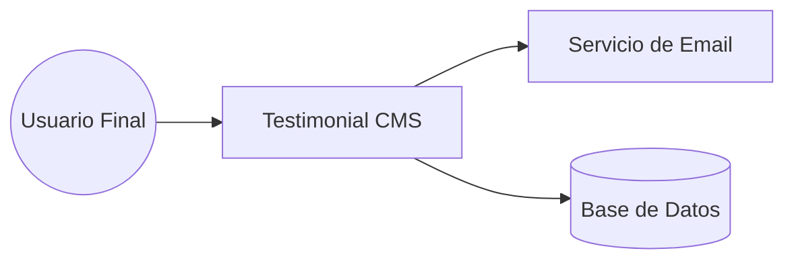
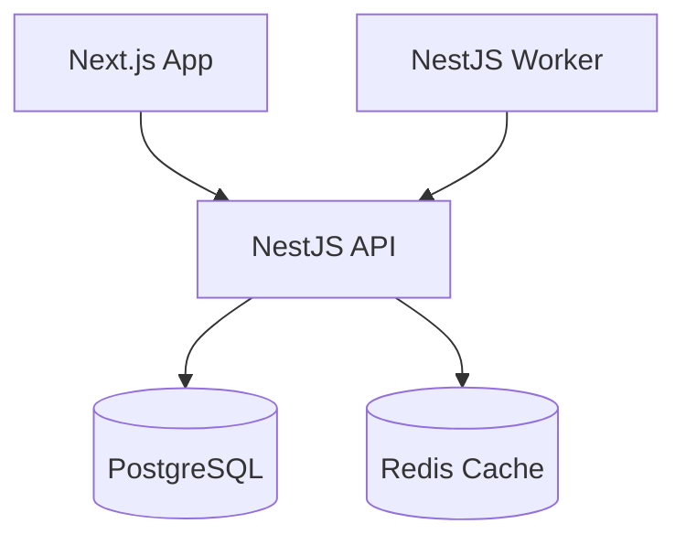

# Guía del Modelo C4 (Contexto, Contenedores, Componentes y Código)

El modelo C4 permite documentar la arquitectura de software de forma jerárquica.

## Nivel 1: Diagrama de Contexto
Muestra el sistema en relación con los usuarios y otros sistemas.

## Nivel 2: Diagrama de Contenedores
Muestra las aplicaciones (web, móvil, api) y almacenes de datos que componen el sistema.

## Nivel 3: Diagrama de Componentes
Desglosa un contenedor en sus componentes internos (módulos, controladores, servicios).

## Nivel 4: Código (Opcional)
Detalles de implementación (Diagramas de clase UML).
