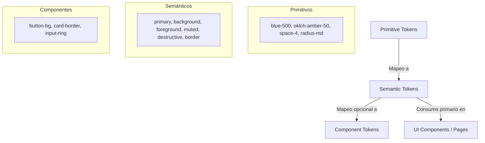

# SKL-FE-TW-001: Senior Tailwind CSS Architecture & Design System Engineering

```text
====================================================================================================
ESPECIFICACIÓN TÉCNICA DE HABILIDAD: SKL-FE-TW-001
Senior Tailwind CSS Architecture & Design System Engineering — Versión 2.0.0
Estándares: CSS / WCAG 2.2 / SOLID / DRY / KISS / YAGNI / Component-Driven Development / Agile DoD
Baseline Técnico: Tailwind CSS v4+ (con soporte de compatibilidad y migración desde v3)
Framework Host: Next.js 15.5+ App Router, React 18.3 / React 19, TypeScript 5.8+, Radix UI Primitives
Responsable: Facundo Nicolás González
Dominio: Tailwind CSS / CSS / Frontend Architecture / Design Systems / Component Engineering
====================================================================================================
```

---

## 1. Ficha de Identificación

| Atributo | Definición Técnica |
| :--- | :--- |
| **Código de Habilidad** | `SKL-FE-TW-001` |
| **Nombre de Habilidad** | Senior Tailwind CSS Architecture & Design System Engineering |
| **Versión** | `2.0.0` |
| **Nivel** | Senior / Production Engineering |
| **Habilidad Principal** | Diseño e implementación profesional de sistemas visuales escalables mediante Tailwind CSS |
| **Objetivo de Dominio** | Utilizar Tailwind como lenguaje de composición visual y API de design system, preservando modularidad, consistencia, accesibilidad y bajo acoplamiento |
| **Framework Principal** | **Tailwind CSS v4+** (con puente de interoperabilidad con v3) |
| **Paradigma** | Utility-First / Component-Driven Development |
| **Configuración Principal**| CSS-first mediante `@theme`, `@source`, `@utility` y `@custom-variant` |
| **Abstracción Principal** | Componentes del framework (React/Next.js) antes que componentes CSS artificiales |
| **Design System** | Theme Variables + Semantic Tokens + Component Variants |
| **Variantes Complejas** | `class-variance-authority` (CVA) u abstracción equivalente tipada |
| **Composición de Clases** | `clsx` / `twJoin` / `tailwind-merge` según necesidad real de resolución de colisiones |
| **Estrategia Responsive** | Mobile/Content-first + Container Queries (`@container`) + Responsive Variants |
| **Accesibilidad** | WCAG 2.2 AA + HTML Semántico + ARIA/State Variants (`aria-*`, `data-*`, `focus-visible`) |
| **Prioridad Rectora** | **Correctitud → Accesibilidad → Consistencia → Cohesión → Reutilización → Simplicidad** |
| **Complejidad** | Alta |

---

## 2. Filosofía de Diseño

Tailwind CSS **NO** debe entenderse como:
- *"Una simple colección de clases auxiliares para no salir del HTML"*, ni como
- *"CSS en línea (inline styles) disfrazado de clases atómicas"*.

Tailwind debe concebirse como una **API de composición visual fuertemente tipada y restringida por un sistema de diseño**.

```text
Design Tokens (Valores base de diseño)
      ↓
Tailwind Theme (@theme en CSS)
      ↓
Utilities (Vocabulario de composición)
      ↓
Component Variants (CVA / Contratos visuales)
      ↓
UI Components (Primitives accesibles: Button, Card, Dialog)
      ↓
Features / Pages (Vistas de negocio en Next.js)
```

El objetivo de Tailwind no es simplemente "escribir menos CSS" en cantidad de líneas. El objetivo arquitectónico de primer orden es erradicar los problemas históricos del CSS tradicional:
- **Sobrecarga de nombrado (*Naming Fatigue*)**: Dejar de inventar nombres de clases artificiales para cada elemento (`.sidebar-inner-wrapper-list-item-title`).
- **Cascada global incontrolable**: Eliminar efectos secundarios donde modificar un estilo en una vista rompe inadvertidamente otra pantalla.
- **Fuga de estilos (*Style Leakage*)**: Garantizar que las reglas visuales no se propaguen fuera de su contexto.
- **Acoplamiento contextual**: Permitir que un componente sea reubicado en cualquier parte del árbol sin depender del selector ancestro.
- **Decisiones de diseño duplicadas**: Restringir las elecciones del desarrollador a escalas coherentes de espaciado, color, tipografía y sombras.

---

### 2.1. Principio Rector

> [!IMPORTANT]
> **No abstraigas en CSS aquello que puede expresarse mejor como un componente, variante o primitive del framework.**

Si en una base de código aparece repetidamente el siguiente patrón visual:

```html
class="rounded-md bg-primary px-4 py-2 font-medium text-primary-foreground shadow-sm transition-colors hover:bg-primary/90"
```

La primera pregunta del ingeniero Senior **NUNCA** debe ser:
```css
/* ❌ REFLEJO INCORRECTO: Abstraer en CSS global */
.btn-primary {
  @apply rounded-md bg-primary px-4 py-2 font-medium text-primary-foreground shadow-sm transition-colors hover:bg-primary/90;
}
```

La primera pregunta **DEBE** ser:
> *"¿Esto representa un componente `<Button variant="primary">` en React?"*

La abstracción primaria en aplicaciones modernas basadas en componentes reside en la **capa de componentes del framework**, no en la hoja de estilos global.

---

### 2.2. Utility-First ≠ Utility-Only

Tailwind no es un dogma de exclusión. Un sistema visual maduro combina armoniosamente:
- Utilities atómicas como mecanismo predeterminado.
- Abstracción de componentes de software (React/Next.js) cuando emerge repetición semántica.
- Variables CSS para valores puramente dinámicos en tiempo de ejecución.
- Custom utilities (`@utility`) para primitivas transversales que Tailwind no provee de fábrica.
- CSS nativo para selectores altamente especializados o integración con CMS/Markdown externo.

$$\text{Utilities by default} \longrightarrow \text{Component abstraction on semantic repetition} \longrightarrow \text{Custom CSS when utilities reduce clarity}$$

---

## 3. Principios Arquitectónicos

Toda implementación de Tailwind en el proyecto debe respetar rigurosamente los siguientes principios:

```text
High Cohesion (Alta Cohesión Visual)
Low Coupling (Bajo Acoplamiento de Contexto)
Explicit Variants (Variantes Visuales Tipadas)
Semantic Tokens (Tokens Orientados a Intención)
Static Class Detectability (Cero Interpolación de Strings)
Predictable Overrides (Precedencia Clara con cn())
Accessible States (Estados ARIA y Foco Integrados)
Limited Arbitrary Values (Valores Arbitrarios Excepcionales)
Minimal Global CSS (Cero Clases de Negocio en CSS Global)
```

---

### 3.1. Responsabilidad Única (SRP) en Componentes de UI

Un componente visual debe encapsular una única responsabilidad estilística y estructural clara:

```tsx
// ✅ PATRÓN SENIOR: Composición granular con SRP
<Card>
  <CardHeader>
    <CardTitle>Métricas de Reseñas</CardTitle>
    <CardDescription>Resumen de testimonios aprobados en el último mes.</CardDescription>
  </CardHeader>
  <CardContent>
    <TestimonialMetricsChart />
  </CardContent>
  <CardFooter className="flex justify-end gap-2">
    <Button variant="outline">Exportar</Button>
    <Button>Crear Campaña</Button>
  </CardFooter>
</Card>

// ❌ ANTIPATRÓN: Componente monolítico con responsabilidades visuales acumuladas
<DashboardCardWithHeaderAndChartAndActionsAndModal />
```

---

### 3.2. La Ley del Layout Externo: El Layout Externo Pertenece al Padre

> [!CAUTION]
> **Un componente reutilizable NUNCA debe definir sus propios márgenes exteriores ni su posicionamiento en la página.**

```tsx
// ❌ ANTIPATRÓN: El componente asume su ubicación espacial externa
export function Button({ children }: { children: React.ReactNode }) {
  return (
    <button className="mt-8 ml-4 rounded-md bg-primary px-4 py-2 text-white">
      {children}
    </button>
  );
}

// ✅ PATRÓN SENIOR: El componente define su apariencia interna y delega el espaciado al padre
export function Button({ className, variant, size, ...props }: ButtonProps) {
  return (
    <button
      className={cn(buttonVariants({ variant, size }), className)}
      {...props}
    />
  );
}

// El contenedor padre controla la relación y espaciado entre hermanos:
<div className="mt-8 flex justify-end gap-4">
  <Button variant="outline">Cancelar</Button>
  <Button>Guardar Cambios</Button>
</div>
```

```text
┌─────────────────────────────────────────────────────────────┐
│ Contenedor Padre: Controla layout externo (flex, grid, gap) │
│   ┌─────────────────────────────────────────────────────┐   │
│   │ Componente Hijo: Controla apariencia interna        │   │
│   │ (padding, background, border, typography, states)   │   │
│   └─────────────────────────────────────────────────────┘   │
└─────────────────────────────────────────────────────────────┘
```

---

### 3.3. Principio Open/Closed mediante Variantes Explícitas

Un componente debe estar abierto a la extensión visual pero cerrado a la modificación caótica de su código interno. Esto se logra mediante **APIs de variantes explícitas**:

```tsx
// ❌ ANTIPATRÓN: Props booleanas descontroladas o clases dispersas ad-hoc
<Button red small compact dashboard />
<Button className="bg-red-600 hover:bg-red-700 text-white text-xs px-2 py-1" />

// ✅ PATRÓN SENIOR: Variantes semánticas tipadas y predecibles
<Button variant="destructive" size="sm" />
```

---

## 4. Context Discovery y Matriz de Entorno

Antes de tomar decisiones estructurales sobre la capa visual, se debe auditar la matriz de contexto del proyecto:

```text
TAILWIND_VERSION=      Tailwind CSS v4+ (o v3.4 con preparación para v4)
FRAMEWORK=             Next.js 15 App Router + React 18/19
PROJECT_TYPE=          Fullstack Monorepo (@testimonial-cms)
TEAM_SIZE=             Senior / Cross-functional
DESIGN_SYSTEM=         Custom Editorial/Brutalist Tokens + Radix UI Primitives
THEMING=               Dark Mode / Light Mode vía CSS Variables
MULTI_BRAND=           Agnóstico por componente, mapeable por tokens
COMPONENT_LIBRARY=     Headless (Radix UI) + Custom Styled Primitives
SSR_OR_SPA=            SSR Server Components + Client Islands
MONOREPO=              pnpm workspaces (apps/web, apps/api, packages/*)
BROWSER_TARGET=        Modern Browsers (ES2022+, Container Queries, OKLCH, :has())
ACCESSIBILITY_TARGET=  WCAG 2.2 AA (Focus visible, contrast 4.5:1, touch targets)
```

---

## 5. Tailwind v4 — Arquitectura CSS-First

En Tailwind CSS v4, el modelo mental evoluciona hacia una **arquitectura basada en CSS nativo**:
- El archivo de configuración JavaScript (`tailwind.config.js` / `tailwind.config.ts`) deja de ser el núcleo obligatorio del sistema.
- La configuración se define directamente en la hoja de estilos principal mediante directivas CSS de nueva generación: `@import "tailwindcss";`, `@theme`, `@source`, `@utility` y `@custom-variant`.
- Los archivos de configuración JS heredados (`tailwind.config.js`) se mantienen únicamente por compatibilidad hacia atrás y deben cargarse explícitamente mediante la directiva `@config "./tailwind.config.js";`.

```css
/* apps/web/src/styles/globals.css (Tailwind v4 CSS Entry) */
@import "tailwindcss";

@theme {
  --color-brand-primary: oklch(0.62 0.22 35);
  --color-brand-secondary: oklch(0.92 0.04 85);
  --font-display: var(--font-inter), sans-serif;
  --radius-sharp: 0rem;
}
```

---

## 6. `@theme` — Definición de Design Tokens

Tailwind v4 utiliza el bloque `@theme` para declarar variables que cumplen una doble función:
1. Son variables CSS accesibles en el navegador.
2. **Generan automáticamente utilidades y variantes en el compilador de Tailwind**.

```css
@import "tailwindcss";

@theme {
  /* Genera: bg-brand-primary, text-brand-primary, border-brand-primary */
  --color-brand-primary: oklch(0.62 0.22 35);
  
  /* Genera: font-display */
  --font-display: "Outfit", sans-serif;

  /* Genera: rounded-card */
  --radius-card: 0.75rem;

  /* Genera: 3xl:grid-cols-4 */
  --breakpoint-3xl: 120rem;
}
```

---

## 7. `@theme` vs `:root`: Responsabilidades Ortogonales

> [!IMPORTANT]
> **No confundir una Theme Variable de `@theme` con una variable CSS estándar de `:root`.**

```text
┌─────────────────────────────────────────────────────────────┐
│ @theme { --color-primary: ...; }                            │
│ Propósito: Registra el token en el compilador de Tailwind.  │
│ Resultado: Genera utilities bg-primary, text-primary, etc.  │
├─────────────────────────────────────────────────────────────┤
│ :root { --sidebar-dynamic-width: 18rem; }                   │
│ Propósito: Variable CSS nativa para lógica de runtime.       │
│ Resultado: No genera utilities atómicas automáticas.        │
└─────────────────────────────────────────────────────────────┘
```

**Regla de Oro**:
- Si el valor debe generar utilidades de composición en el markup $\to$ **`@theme`**.
- Si el valor es una variable calculada en runtime o un estado local de layout $\to$ **`:root` o scope de componente**.

---

## 8. Jerarquía de Design Tokens

El sistema de diseño debe estructurarse en tres niveles conceptuales desacoplados:



---

### 8.1. Tokens Primitivos (*Primitive Tokens*)
Describen valores físicos puros sin contexto de uso:
```css
--color-slate-900: #0f172a;
--color-terracotta-500: oklch(0.62 0.22 35);
--space-4: 1rem;
--radius-none: 0px;
```

---

### 8.2. Tokens Semánticos (*Semantic Tokens*)
Describen la **intención de diseño y el rol funcional**:
```css
--color-primary: var(--color-terracotta-500);
--color-background: var(--color-slate-50);
--color-foreground: var(--color-slate-900);
--color-destructive: oklch(0.57 0.24 27);
--color-muted: oklch(0.92 0.02 85);
--color-border: oklch(0.85 0.01 85);
```
Los componentes de la aplicación deben depender en un **95% de los casos de tokens semánticos**.

---

### 8.3. Tokens de Componente (*Component Tokens*)
Reservados para sistemas de diseño de gran escala con requerimientos multi-marca profundos:
```css
--button-primary-bg: var(--color-primary);
--input-focus-ring: var(--color-primary);
```
> [!NOTE]
> No crear tokens de componente de forma prematura. Comenzar con tokens semánticos y elevar a tokens de componente únicamente cuando surja una necesidad real de desacoplamiento por componente.

---

## 9. Semántica de Intención antes que Color Físico

> [!CAUTION]
> Queda prohibido diseñar APIs de componentes que utilicen colores físicos en sus variantes:

```tsx
// ❌ ANTIPATRÓN: Acopla la API del componente a un color concreto
<Button color="blue" />
<Badge color="green" />
<Alert color="red" />

// ✅ PATRÓN SENIOR: Expresa la intención semántica del negocio
<Button variant="primary" />
<Badge variant="success" />
<Alert variant="destructive" />
```

Si el día de mañana el producto cambia su identidad corporativa de azul a terracota, una API basada en `color="blue"` requerirá refactorizar cientos de archivos o creará la contradicción absurda de tener un `<Button color="blue">` que renderiza color terracota.

---

## 10. Tailwind como API del Design System

Un código de frontend maduro en `@testimonial-cms/web` debe exhibir composiciones basadas en el vocabulario semántico del sistema:

```tsx
<div className="rounded-xl border border-border bg-card p-6 text-card-foreground shadow-sm">
  <h2 className="text-xl font-bold tracking-tight text-foreground">
    Testimonios Aprobados
  </h2>
  <p className="mt-2 text-sm text-muted-foreground">
    Gestioná los comentarios que aparecerán en tu muro público.
  </p>
  <button className="mt-4 rounded-md bg-primary px-4 py-2 text-sm font-medium text-primary-foreground hover:bg-primary/90 focus-visible:outline-none focus-visible:ring-2 focus-visible:ring-ring">
    Nuevo Testimonio
  </button>
</div>
```

Esta disciplina garantiza que el soporte para **Dark Mode, temas personalizados y rediseños visuales globales** funcione instantáneamente sin alterar el JSX.

---

## 11. Gobernanza de Valores Arbitrarios (*Arbitrary Values*)

Tailwind permite el uso de corchetes para inyectar valores específicos cuando sea indispensable (`w-[347px]`, `top-[117px]`, `bg-[#316ff6]`). El compilador de v4 genera la utilidad bajo demanda. Los valores arbitrarios **no son un pecado por definición**, pero deben gobernarse con criterio.

---

### 11.1. Valores Arbitrarios Válidos
Aceptables en escenarios únicos y aislados:
- Posicionamiento geométrico milimétrico impuesto por un asset gráfico de terceros (`top-[118px]`).
- Integración con APIs de mapas, canvas o layouts de terceros.
- Máscaras SVG únicas en landing pages (`mask-[url('/shape.svg')]`).

---

### 11.2. Valores Arbitrarios Sospechosos (Señales de Refactor)
Si un valor como `bg-[#e05d38]` o `w-[320px]` se repite en 5 o más archivos diferentes:
- **Diagnóstico**: Delata la omisión de un token de diseño o una utilidad de layout no formalizada.
- **Acción Obligatoria**: Elevar el valor a una theme variable en el archivo de estilos (`--color-primary: oklch(...)` o `--spacing-card: 20rem`).

---

## 12. Principio YAGNI en la Definición del Theme

> [!WARNING]
> No configures de antemano una paleta masiva de 50 tonos de color, 30 sombras, 20 radios y 15 breakpoints "por si alguna vez hacen falta".

El archivo de configuración o el bloque `@theme` debe crecer de forma incremental impulsado por las necesidades reales del producto. Un theme sobredimensionado introduce ruido mental, debilita la consistencia visual y ralentiza la adopción del equipo.

---

## 13. Detección Automática de Fuentes (*Source Detection*)

Tailwind CSS v4 cuenta con un motor nativo de alto rendimiento escrito en Rust (Oxide) que escanea automáticamente los archivos del proyecto sin requerir la antigua propiedad `content: [...]` de `tailwind.config.js`.
- Detecta automáticamente archivos HTML, JSX, TSX, Vue, Svelte.
- Ignora de forma predeterminada carpetas pesadas como `node_modules`, archivos binarios y rutas listadas en `.gitignore`.

---

## 14. La Directiva `@source`

Cuando el proyecto consume componentes ubicados fuera del escaneo automático estándar (librerías compartidas en `node_modules` o paquetes internos de un monorepo), se debe declarar explícitamente su ruta mediante `@source`:

```css
@import "tailwindcss";

/* Escaneo explícito de un paquete UI compartido en el monorepo */
@source "../../../packages/ui/src";

/* Escaneo de una librería externa que expone clases Tailwind */
@source "../node_modules/@company/shared-widgets";
```

---

## 15. Detección en Arquitecturas Monorepo

En un monorepo gestionado con pnpm / Turborepo:
1. Declarar `@source` apuntando a los paquetes compartidos de UI.
2. Alternativamente, especificar la raíz de escaneo en la importación:
   ```css
   @import "tailwindcss" source("../src");
   ```
3. **Prohibición**: No resolver problemas de detección de clases creando *safelists* masivas artificiales de miles de líneas.

---

## 16. La Regla Crítica de las Clases Dinámicas

> [!CAUTION]
> **Tailwind analiza los archivos fuente como texto plano mediante expresiones regulares estáticas. NO ejecuta código JavaScript ni evalúa expresiones en runtime.**

Por este motivo, la construcción de clases mediante interpolación de cadenas está **TERMINANTEMENTE PROHIBIDA**:

```tsx
// ❌ ANTIPATRÓN CATASTRÓFICO: Tailwind NO detecta ni genera estas clases
function Badge({ color }: { color: 'blue' | 'green' | 'red' }) {
  return <span className={`bg-${color}-500 text-white`}>Status</span>;
}
```

Al compilar para producción, las clases `bg-blue-500`, `bg-green-500` y `bg-red-500` no existirán en el archivo CSS compilado, resultando en un componente sin estilos visibles.

---

## 17. Mapeo a Diccionarios de Clases Completas

La solución técnica obligatoria consiste en mapear props a cadenas completas e inmutables:

```tsx
// ✅ PATRÓN SENIOR: Detección estática garantizada y Type Safety pleno
const statusVariants: Record<'success' | 'warning' | 'error', string> = {
  success: 'bg-emerald-500/10 text-emerald-600 border-emerald-500/20',
  warning: 'bg-amber-500/10 text-amber-600 border-amber-500/20',
  error: 'bg-rose-500/10 text-rose-600 border-rose-500/20',
};

export function StatusBadge({ status }: { status: 'success' | 'warning' | 'error' }) {
  return (
    <span className={cn('inline-flex items-center rounded-full border px-2.5 py-0.5 text-xs font-semibold', statusVariants[status])}>
      {status}
    </span>
  );
}
```

---

## 18. Clase Dinámica vs Valor Dinámico de Runtime

Cuando un valor numérico cambia de forma continua e impredecible en tiempo de ejecución (ej. porcentaje de una barra de progreso o coordenadas de arrastre), no se debe generar una clase Tailwind arbitraria. Se debe utilizar una **variable CSS en línea**:

```tsx
// ✅ PATRÓN SENIOR: CSS Variable de runtime consumida por utilidad Tailwind
export function ProgressBar({ progress }: { progress: number }) {
  return (
    <div className="h-2 w-full overflow-hidden rounded-full bg-muted">
      <div
        style={{ '--progress-width': `${Math.min(100, Math.max(0, progress))}%` } as React.CSSProperties}
        className="h-full bg-primary transition-all duration-300 w-[var(--progress-width)]"
        role="progressbar"
        aria-valuenow={progress}
        aria-valuemin={0}
        aria-valuemax={100}
      />
    </div>
  );
}
```

---

## 19. Componentes de Framework antes que `@apply`

El uso excesivo de `@apply` neutraliza las mayores virtudes de Tailwind:
- Reintroduce la carga cognitiva de inventar nombres de clases BEM.
- Separa las reglas visuales del marcado JSX donde se aplican.
- Aumenta el tamaño final del archivo CSS al duplicar declaraciones de propiedades en múltiples clases personalizadas.

```tsx
// ❌ ANTIPATRÓN: Crear clases CSS artificiales con @apply en React
// styles.css: .card-container { @apply p-6 bg-card border rounded-xl shadow-sm; }
<div className="card-container">...</div>

// ✅ PATRÓN SENIOR: Componente funcional reutilizable
export function Card({ className, ...props }: React.HTMLAttributes<HTMLDivElement>) {
  return (
    <div
      className={cn('rounded-xl border border-border bg-card p-6 text-card-foreground shadow-sm', className)}
      {...props}
    />
  );
}
```

---

## 20. El Uso Legítimo de `@apply`

La directiva `@apply` es legítima y recomendable únicamente en escenarios donde el desarrollador **no tiene control directo sobre el marcado HTML**:
1. Estilizado de contenido generado por un CMS o motor de Markdown (prose / rich text).
2. Reglas globales de reseteo para elementos HTML nativos en `@layer base`.
3. Integración con componentes de librerías externas cerradas que inyectan su propio HTML.

---

### 20.1. Proscripción de "@apply como Recreación de Bootstrap"

> [!CAUTION]
> Queda estrictamente prohibido estructurar una aplicación moderna definiendo clases globales `.btn`, `.btn-primary`, `.card`, `.badge`, `.alert` íntegramente mediante `@apply` cuando la aplicación ya dispone de React o Next.js como arquitectura de componentes.

---

## 21. Custom Utilities mediante `@utility` en Tailwind v4

En Tailwind v4, las utilidades personalizadas que trascienden a un único componente se registran en CSS mediante la directiva `@utility`:

```css
@import "tailwindcss";

@utility content-auto {
  content-visibility: auto;
}

@utility scrollbar-none {
  scrollbar-width: none;
  &::-webkit-scrollbar {
    display: none;
  }
}
```

Las utilidades registradas con `@utility` se integran de forma automática con todo el sistema de variantes de Tailwind:
```html
<div class="scrollbar-none hover:scrollbar-none md:content-auto">
```

---

## 22. Cuándo Crear una Custom Utility

Crear una `@utility` únicamente cuando se cumplan las siguientes condiciones:
1. Es una propiedad o comportamiento de bajo nivel estrictamente **reutilizable en múltiples features**.
2. Posee un **único propósito composicional**.
3. Tailwind no la proporciona nativamente en su core.

---

## 23. Prohibición de "Utilities de Negocio" en CSS

> [!CAUTION]
> **Nunca crees utilidades en CSS que representen conceptos de negocio o pantallas particulares.**

```css
/* ❌ ANTIPATRÓN GRAVE: Lógica de negocio en la capa de utilidades CSS */
@utility checkout-summary-card-special { ... }
@utility admin-user-profile-header-box { ... }
```
Estos conceptos pertenecen exclusivamente a la **capa de componentes de React** en `src/features/*`.

---

## 24. La Función Auxiliar `cn()`

En el ecosistema React/Next.js del proyecto, la composición de clases se centraliza a través del helper estándar `cn()`:

```typescript
// apps/web/src/lib/cn.ts
import { clsx, type ClassValue } from 'clsx';
import { twMerge } from 'tailwind-merge';

export function cn(...inputs: ClassValue[]): string {
  return twMerge(clsx(inputs));
}
```

---

## 25. Diferencia Fundamental entre `clsx` y `tailwind-merge`

- **`clsx`**: Concatena cadenas de clases de forma condicional, evaluando booleanos, arrays u objetos. **No sabe nada sobre CSS ni Tailwind**. Si recibe `clsx("p-4", "p-8")`, produce la cadena `"p-4 p-8"`.
- **`tailwind-merge`**: Comprende la semántica interna de Tailwind. Reconoce que tanto `p-4` como `p-8` modifican la misma propiedad física (`padding`). Resuelve el conflicto eliminando la regla anterior y preservando la última: `twMerge("p-4", "p-8")` $\to$ `"p-8"`.

---

## 26. No Usar `twMerge` Ciegamente en Todo Escenario

La resolución semántica de conflictos de `tailwind-merge` tiene un costo de procesamiento en tiempo de ejecución (parseo y comparación de diccionarios de clases).
- Si un componente define clases **estrictamente internas** y no expone una prop `className` para sobreescritura externa, utilizar simplemente **`clsx`** o **`twJoin`**.
- Reservar `tailwind-merge` (mediante `cn()`) para la frontera pública de componentes donde el consumidor puede enviar un `className` que debe sobreescribir estilos base.

---

## 27. `className` como Escape Hatch Controlado

Un componente reutilizable de UI **MAY** exponer la prop `className?: string` para facilitar composición contextual externa. Sin embargo:
- `className` **no debe sustituir a las variantes semánticas**.
- Si una modificación visual representa un estado o variante reutilizable del sistema, debe incorporarse como una variante formal en CVA.

---

## 28. Arquitectura de Variantes con CVA (`class-variance-authority`)

Para componentes con múltiples dimensiones visuales combinatorias, CVA es el estándar arquitectónico del proyecto:

```tsx
// apps/web/src/components/ui/button.tsx
import * as React from 'react';
import { cva, type VariantProps } from 'class-variance-authority';
import { cn } from '@/lib/cn';

export const buttonVariants = cva(
  // Clases base inmutables
  'inline-flex items-center justify-center whitespace-nowrap rounded-md text-sm font-medium transition-colors focus-visible:outline-none focus-visible:ring-2 focus-visible:ring-ring focus-visible:ring-offset-2 disabled:pointer-events-none disabled:opacity-50',
  {
    variants: {
      variant: {
        primary: 'bg-primary text-primary-foreground hover:bg-primary/90 shadow-sm',
        secondary: 'bg-secondary text-secondary-foreground hover:bg-secondary/80',
        destructive: 'bg-destructive text-destructive-foreground hover:bg-destructive/90 shadow-sm',
        outline: 'border border-input bg-background hover:bg-accent hover:text-accent-foreground',
        ghost: 'hover:bg-accent hover:text-accent-foreground',
        link: 'text-primary underline-offset-4 hover:underline',
      },
      size: {
        sm: 'h-8 rounded-md px-3 text-xs',
        md: 'h-10 px-4 py-2',
        lg: 'h-12 rounded-md px-8 text-base',
        icon: 'h-10 w-10 p-0',
      },
    },
    defaultVariants: {
      variant: 'primary',
      size: 'md',
    },
  }
);

export interface ButtonProps
  extends React.ButtonHTMLAttributes<HTMLButtonElement>,
    VariantProps<typeof buttonVariants> {
  asChild?: boolean;
}

export const Button = React.forwardRef<HTMLButtonElement, ButtonProps>(
  ({ className, variant, size, ...props }, ref) => {
    return (
      <button
        ref={ref}
        className={cn(buttonVariants({ variant, size }), className)}
        {...props}
      />
    );
  }
);
Button.displayName = 'Button';
```

---

## 29. CVA no es Obligatorio: Aplicar Principio KISS

> [!NOTE]
> No crees una definición de CVA para un componente que solo tiene una apariencia visual o una alternancia booleana trivial.

```tsx
// ✅ PATRÓN SENIOR (KISS): Sin sobreingeniería de CVA innecesaria
export function Container({ className, children, ...props }: React.HTMLAttributes<HTMLDivElement>) {
  return (
    <div className={cn('mx-auto w-full max-w-7xl px-4 sm:px-6 lg:px-8', className)} {...props}>
      {children}
    </div>
  );
}
```

---

## 30. Cuándo Usar CVA

Adoptar CVA obligatoriamente cuando converjan al menos dos de las siguientes condiciones:
1. Múltiples dimensiones ortogonales de estilo (`variant`, `size`, `tone`).
2. Existencia de variantes compuestas (*Compound Variants*).
3. Requerimiento de tipado estricto en TypeScript exportado mediante `VariantProps`.
4. Necesidad de valores predeterminados explícitos (*defaultVariants*).

---

## 31. Variantes Compuestas (*Compound Variants*)

Cuando una combinación específica de variantes requiere un estilo particular (ej. si `variant === 'outline'` y `size === 'sm'`, el grosor del borde debe ser más delgado):

```typescript
export const badgeVariants = cva('inline-flex items-center rounded-full font-semibold', {
  variants: {
    variant: { solid: 'bg-primary text-white', outline: 'border text-foreground' },
    size: { sm: 'text-xs px-2 py-0.5', lg: 'text-sm px-3 py-1' }
  },
  compoundVariants: [
    {
      variant: 'outline',
      size: 'sm',
      class: 'border-[0.5px]', // Regla específica solo para esta combinación exacta
    },
  ],
});
```

Esto elimina la proliferación de condicionales dispersos y frágiles en el cuerpo del componente.

---

## 32. Taxonomía de Primitives de UI

Los componentes base de la aplicación residen en `src/components/ui/*`:
- `Button`, `Input`, `Textarea`, `Select`, `Checkbox`, `RadioGroup`
- `Card`, `Badge`, `Avatar`, `Separator`
- `Dialog`, `Tooltip`, `DropdownMenu`, `Tabs`, `Accordion`

**Regla de Pureza**: Los primitives expresan su contrato visual, estados interactivos y accesibilidad, pero **tienen cero conocimiento sobre las entidades del negocio**.

---

## 33. Componentes de Feature (*Feature Components*)

Los componentes de feature residen en `src/features/*` o subdirectorios de página y **componen los primitives del sistema de diseño**:
- `TestimonialCard` $\longrightarrow$ compone `Card`, `Avatar`, `Badge`.
- `SubmitTestimonialForm` $\longrightarrow$ compone `Input`, `Textarea`, `Button`.
- `CampaignStatusBadge` $\longrightarrow$ compone `Badge`.

---

## 34. Primitivas de Layout (*Layout Primitives*)

Crear componentes reutilizables de layout cuando exista un patrón composicional con nombre semántico recurrente:
- `<Stack>` (Flexbox vertical con gap consistente).
- `<Cluster>` (Flexbox horizontal con wrapping).
- `<Container>` (Centrado con max-width y paddings laterales por breakpoint).
- `<SidebarLayout>` (Estructura de dos columnas colapsables).

> [!WARNING]
> No envuelvas cada simple `div` con `flex gap-4` dentro de un componente artificial `<FlexGapFour>`. Eso reintroduce abstracción accidental sin valor.

---

## 35. Responsabilidad de Espaciado entre Hermanos

El contenedor padre conoce la relación espacial entre sus elementos hijos. Los hijos son agnósticos a sus hermanos:

```tsx
// ✅ PATRÓN SENIOR: El padre gobierna la separación con gap
<div className="flex flex-col gap-4">
  <TestimonialItem />
  <TestimonialItem />
  <TestimonialItem />
</div>

// ❌ ANTIPATRÓN: Cada hijo empuja al siguiente con margen inferior fijo
<TestimonialItem className="mb-4" />
<TestimonialItem className="mb-4" />
```

---

## 36. Estrategia Responsive Mobile-First

Tailwind opera bajo un modelo **Mobile-First basado en `min-width`**:
- Las utilidades sin prefijo aplican desde la pantalla más pequeña (0px en adelante).
- Los prefijos `sm:`, `md:`, `lg:`, `xl:`, `2xl:` aplican restricciones a partir de ese ancho hacia arriba.

```html
<!-- Comienza en 1 columna, pasa a 2 en tablet y a 4 en desktop -->
<div class="grid grid-cols-1 md:grid-cols-2 lg:grid-cols-4 gap-6">
```

---

## 37. El Mobile-First No Debe Ser un Dogma Ciego

Diseñar con la regla:
$$\text{Estilo base} \longrightarrow \text{Menor restricción} \longrightarrow \text{Sobreescrituras donde el layout se quiebre}$$

No fuerces la creación de interfaces artificialmente segmentadas por "dispositivo móvil / tablet / desktop" si el contenido puede resolver su fluidez de forma nativa mediante **layout intrínseco** (`grid-template-columns: repeat(auto-fit, minmax(280px, 1fr))`).

---

## 38. Breakpoints Derivados del Contenido, No de Dispositivos

> [!IMPORTANT]
> Un breakpoint debe introducirse cuando **el diseño deja de funcionar estéticamente o en legibilidad**, no porque coincida con el ancho exacto del iPhone 16 o del iPad Pro.

No crees breakpoints arbitrarios como `min-w-[843px]` para satisfacer un modelo de teléfono específico del mercado.

---

## 39. Breakpoints Personalizados en Tailwind v4

En v4, los breakpoints se declaran de forma limpia dentro del bloque `@theme`:

```css
@import "tailwindcss";

@theme {
  --breakpoint-xs: 30rem;    /* 480px */
  --breakpoint-3xl: 120rem;  /* 1920px */
}
```

Mantener unidades consistentes (`rem`) con los breakpoints predeterminados para asegurar que el orden de precedencia de la cascada sea exacto.

---

## 40. Container Queries (`@container`)

Las Container Queries permiten que un componente responda **al ancho del contenedor que lo aloja**, en lugar del tamaño global de la ventana del navegador (*viewport*).

```tsx
// apps/web/src/components/ui/testimonial-card.tsx
export function TestimonialCard({ testimonial }: { testimonial: Testimonial }) {
  return (
    // Declara este elemento como un contenedor de consulta
    <div className="@container w-full">
      {/* Si el contenedor mide < 400px es vertical; si mide >= 400px (@md) es horizontal */}
      <article className="flex flex-col @md:flex-row items-center gap-4 rounded-xl border p-6">
        
        <div className="flex-1 text-center @md:text-left">
          <h3 className="font-bold text-base @lg:text-lg">{testimonial.authorName}</h3>
          <p className="text-sm text-muted-foreground mt-1">{testimonial.content}</p>
        </div>
      </article>
    </div>
  );
}
```

---

## 41. Viewport Query vs Container Query

```text
┌─────────────────────────────────────────────────────────────┐
│ Media Queries (md:, lg:):                                   │
│ Para decisiones globales de macro-layout de página          │
│ (Navbar principal, visibilidad de sidebar, grid de rutas).  │
├─────────────────────────────────────────────────────────────┤
│ Container Queries (@md:, @lg:):                             │
│ Para componentes autónomos y reutilizables                  │
│ (Cards, widgets de dashboard, tablas empotrables en modales)│
└─────────────────────────────────────────────────────────────┘
```

---

## 42. La Regla Responsive Senior

$$\mathbf{Intrinsic\ Layout} \longrightarrow \mathbf{Container\ Query\ (@container)} \longrightarrow \mathbf{Viewport\ Breakpoint\ (md:)}$$

---

## 43. Variantes de Grupo (`group`)

Utilizar `group` cuando el estilo visual de un elemento hijo debe reaccionar ante el estado de interacción (hover, focus, active) de un elemento ancestro:

```html
<article class="group rounded-xl border p-6 transition-colors hover:border-primary">
  <h3 class="text-foreground transition-colors group-hover:text-primary">
    Título del Testimonio
  </h3>
  <span class="text-xs text-muted-foreground transition-transform group-hover:translate-x-1">
    Leer más →
  </span>
</article>
```

---

## 44. Grupos Nombrados (*Named Groups*)

En estructuras complejas o tarjetas anidadas, utilizar grupos nombrados (`group/{name}`) para erradicar cualquier ambigüedad:

```html
<div class="group/card rounded-lg border p-4">
  <button class="group/btn flex items-center gap-2">
    <!-- Reacciona únicamente al hover del botón, no de toda la tarjeta -->
    <span class="group-hover/btn:underline">Aprobar</span>
    <!-- Reacciona al hover de la tarjeta completa -->
    <span class="opacity-0 group-hover/card:opacity-100">Info</span>
  </button>
</div>
```

---

## 45. Variantes de Hermano (*`peer`*)

Utilizar `peer` cuando un elemento debe reaccionar al estado de un hermano directo que lo precede en el DOM:

```html
<div class="relative">
  <input 
    type="email" 
    required 
    id="email" 
    class="peer rounded-md border p-2 text-sm focus:border-primary" 
    placeholder=" " 
  />
  <label 
    for="email" 
    class="absolute left-2 top-2 text-xs transition-all peer-placeholder-shown:top-2 peer-placeholder-shown:text-sm peer-focus:top-[-10px] peer-focus:text-xs"
  >
    Correo corporativo
  </label>
</div>
```
*Regla de Hermandad*: Por física del selector de CSS (`~`), el elemento marcado con `peer` debe preceder físicamente al elemento que consume `peer-*`.

---

## 46. Selectores de Descendientes con `has-*`

El pseudo-selector `:has()` permite que un contenedor estilice sus propiedades en base al estado de sus descendientes, **eliminando la necesidad de estados en React (`useState`) puramente cosméticos**:

```html
<!-- Si el checkbox interno está marcado, el label completo cambia de borde y fondo -->
<label class="flex items-center gap-3 rounded-lg border p-4 transition-colors has-checked:border-primary has-checked:bg-primary/5 cursor-pointer">
  <input type="checkbox" class="h-4 w-4 rounded border-primary text-primary" />
  <span class="text-sm font-medium">Incluir testimonio en la página de inicio</span>
</label>
```

---

## 47. Variantes de Estado ARIA

Priorizar las variantes semánticas nativas de ARIA antes que inventar clases o duplicar estados:

```html
<!-- ✅ CORRECTO: El estilo reacciona directamente al contrato de accesibilidad -->
<button
  type="button"
  aria-expanded={isOpen}
  class="rounded-md p-2 aria-expanded:bg-muted aria-expanded:text-primary"
>
  Opciones
</button>
```

---

## 48. Variantes de Atributos de Datos (`data-*`)

Indispensables al integrar librerías headless (como Radix UI), las cuales comunican el estado de apertura, selección o orientación mediante atributos `data-*`:

```tsx
<DropdownMenu.Content
  className="z-50 min-w-[8rem] rounded-md border bg-popover p-1 shadow-md data-[state=open]:animate-in data-[state=closed]:animate-out data-[state=closed]:fade-out-0 data-[state=open]:fade-in-0 data-[side=bottom]:slide-in-from-top-2"
>
  ...
</DropdownMenu.Content>
```

---

## 49. Estados CSS antes que JavaScript Visual

> [!CAUTION]
> **No escribas lógica en React con `onMouseEnter={() => setHover(true)}` para alternar colores o visibilidad.**

Todo cambio estético derivado de interacciones de puntero, foco o estados de formulario debe resolverse mediante utilidades y variantes CSS (`hover:`, `focus-visible:`, `group-hover:`, `peer-checked:`, `has-focus:`).

---

## 50. Registro de Variantes Personalizadas con `@custom-variant`

Tailwind v4 permite crear variantes de estado especializadas directamente en CSS:

```css
@import "tailwindcss";

/* Registra la variante theme-midnight: */
@custom-variant theme-midnight (&:where([data-theme="midnight"] *));

/* Registra la variante data-active: */
@custom-variant active-item (&[data-active="true"]);
```

---

## 51. Dark Mode Desacoplado

En lugar de depender exclusivamente de la preferencia del sistema operativo (`prefers-color-scheme`), registrar la variante de modo oscuro por clase/atributo:

```css
@import "tailwindcss";

@custom-variant dark (&:where(.dark, .dark *));
```

---

## 52. Theming mediante Tokens: No usar `dark:` en Todo

> [!IMPORTANT]
> **Evitar que cada componente del sistema deba escribir `bg-white dark:bg-neutral-900 text-black dark:text-white`.**

El modo oscuro debe resolverse a nivel de **tokens de diseño**. Los componentes simplemente consumen `bg-background` y `text-foreground`. El cambio de tema modifica el valor de las variables CSS correspondientes en `globals.css`:

```css
/* apps/web/src/styles/globals.css */
@theme {
  --color-background: var(--app-bg);
  --color-foreground: var(--app-fg);
}

:root {
  --app-bg: oklch(0.98 0.01 85);
  --app-fg: oklch(0.15 0.02 85);
}

.dark {
  --app-bg: oklch(0.12 0.02 85);
  --app-fg: oklch(0.95 0.01 85);
}
```

---

## 53. Arquitectura Multi-Brand

Para soportar múltiples marcas dentro del mismo monorepo:
1. Diseñar componentes 100% agnósticos a marcas (`Brand-Agnostic`).
2. Mapear cada marca a una hoja de estilos de tokens independiente (`theme-brand-a.css`, `theme-brand-b.css`).
3. Cero condicionales tipo `brand === "nike" ? "bg-red-500" : "bg-blue-500"` dentro de los componentes.

---

## 54. Accesibilidad (WCAG 2.2 AA) en Componentes Tailwind

El uso de Tailwind debe acompañar las directrices de accesibilidad:
- Indicadores de foco visual evidentes.
- Contrastes cromáticos adecuados ($\ge 4.5:1$ en texto normal).
- Estados de deshabilitado con supresión de eventos de puntero.
- Respeto a preferencias de movimiento.
- Dimensiones mínimas de objetivos táctiles ($24\times 24$ px / $44\times 44$ px).

---

## 55. Gobernanza de Foco: Erradicación de `outline-none` sin Reemplazo

> [!CAUTION]
> **Nunca utilices `outline-none` de forma aislada.**

Todo elemento interactivo debe exponer un anillo de foco visible de alto contraste activado mediante `focus-visible`:

```html
class="focus-visible:outline-none focus-visible:ring-2 focus-visible:ring-ring focus-visible:ring-offset-2 focus-visible:ring-offset-background"
```

---

## 56. Estados Disabled Completos

Un componente deshabilitado debe declarar tanto su semántica HTML como su apariencia visual:

```html
<button
  type="button"
  disabled
  class="disabled:pointer-events-none disabled:opacity-50"
>
  Confirmar
</button>
```

---

## 57. Respeto a Movimiento Reducido (*Reduced Motion*)

Para usuarios con trastornos vestibulares, deshabilitar animaciones no esenciales:

```html
<div class="transition-transform duration-300 motion-reduce:transition-none hover:scale-105">
  Tarjeta Interactiva
</div>
```

---

## 58. El Color No Es Semántica Suficiente

Nunca representes estados de éxito o error exclusivamente a través de clases de color de Tailwind (`text-emerald-500` vs `text-rose-500`). Acompañar siempre de **texto descriptivo, iconos con `aria-hidden="true"` y atributos semánticos** (`aria-invalid="true"`, `role="alert"`).

---

## 59. Variantes Arbitrarias y Selectores Complejos

Tailwind permite selectores arbitrarios:
```html
<div class="[&_.testimonial-content]:text-muted-foreground [&:nth-child(2)]:bg-accent">
```

### 59.1. Detección de Abstracción Pendiente
Si el selector `[&_[data-slot=icon]]:h-4` se repite en 10 componentes distintos, debe abstraerse en una `@utility` o formalizarse dentro del componente base.

---

## 60. Cadenas Largas de Clases (*Long Class Strings*)

Una cadena extensa de utilidades en JSX:
```tsx
<div className="flex items-center justify-between gap-4 rounded-xl border border-border bg-card p-6 text-card-foreground shadow-sm hover:shadow-md transition-shadow">
```
**NO constituye un problema arquitectónico**. Hace explícito el diseño local de la interfaz, facilita la lectura sin saltar de archivo y previene la dispersión en hojas CSS externas.

---

## 61. Abstraer Solo ante Repetición Semántica Real

No crees un componente ni una clase CSS únicamente porque *"la línea de JSX quedó larga"*. Abstraé cuando identifiques un **concepto de interfaz reutilizable con un contrato de variantes estable**.

---

## 62. Orden Determinístico de Clases

Para mantener una base de código limpia y libre de debates de estilo, el orden de las utilidades debe seguir una jerarquía lógica:

```text
1. Layout / Display (flex, grid, block, hidden)
2. Posicionamiento (relative, absolute, inset-0, z-10)
3. Dimensiones / Box Model (w-full, max-w-md, h-10)
4. Espaciado (p-4, px-6, m-2, gap-4)
5. Tipografía (text-sm, font-bold, tracking-wide, leading-none)
6. Fondos y Bordes (bg-card, text-foreground, border, rounded-xl)
7. Efectos / Sombras (shadow-sm, opacity-90)
8. Transiciones / Animaciones (transition-colors, duration-200)
9. Estados Interactivos (hover:*, focus-visible:*, active:*, disabled:*)
10. Variantes Responsive / Container (@md:*, md:*, lg:*)
```

---

## 63. Formateo Automatizado con Prettier

El ordenamiento de clases **MUST** delegarse en herramientas automáticas. Se adopta oficialmente `prettier-plugin-tailwindcss`:
- Cero debates en Pull Requests.
- Diffings limpios y consistentes en Git.
- Ordenamiento automático al guardar el archivo en el editor.

---

## 64. Prohibición de Concatenación Manual de Strings

```tsx
// ❌ ANTIPATRÓN OBSOLETO: String concatenation manual
className={"base-btn " + (active ? "is-active " : "") + (disabled ? "is-disabled" : "")}

// ✅ PATRÓN SENIOR: Composición limpia y segura con cn()
className={cn("base-btn", active && "is-active", disabled && "is-disabled")}
```

---

## 65. Precedencia de `className` en Componentes Reutilizables

Cuando un componente acepta `className` para permitir personalizaciones contextuales, dicho argumento **MUST colocarse al final** dentro de la llamada a `cn()`:

```tsx
className={cn(buttonVariants({ variant, size }), className)}
```
Esto asegura que `tailwind-merge` resuelva cualquier conflicto otorgándole prioridad al consumidor externo.

---

## 66. Protección de Invariantes Críticas de Diseño

Si un componente del design system posee invariantes que jamás deben romperse (ej. un modal de confirmación legal cuyo padding nunca debe alterarse), **no expongas una prop `className` abierta**. Limita la personalización a las variantes oficiales tipadas en CVA.

---

## 67. Limitaciones Técnicas de `tailwind-merge`

`tailwind-merge` es una librería extraordinaria pero tiene fronteras claras:
- Resuelve conflictos entre utilidades conocidas del catálogo estándar de Tailwind.
- No resuelve conflictos entre propiedades CSS arbitrarias no indexadas (`[color:red]` vs `[color:blue]`).
- Si se introducen utilidades personalizadas profundas, se debe configurar `extendTailwindMerge`.

---

## 68. Extensión de `tailwind-merge` para Convenciones Propias

Si se crean utilidades personalizadas de tamaño o color con sintaxis propietaria, extender la configuración:

```typescript
import { extendTailwindMerge } from 'tailwind-merge';

export const customTwMerge = extendTailwindMerge({
  extend: {
    classGroups: {
      'font-size': [{ text: ['editorial-headline', 'editorial-sub'] }],
    },
  },
});
```

---

## 69. Gobernanza del CSS Global

El archivo de estilos globales (`globals.css`) debe restringirse a:
1. Importación principal de Tailwind (`@import "tailwindcss";`).
2. Definición del Theme (`@theme`).
3. Declaración de fuentes tipográficas (`@font-face` o importaciones).
4. Variables CSS de runtime (`:root`, `.dark`).
5. Custom Utilities transversales (`@utility`).
6. Estilos base de reseteo (`@layer base`).

> [!CAUTION]
> **Prohibido mover clases de componentes específicos a `globals.css` solo para acortar el JSX.**

---

## 70. Estructura de Carpetas Recomendada en `@testimonial-cms/web`

```text
apps/web/src/
├── app/
│   ├── layout.tsx
│   ├── page.tsx
│   └── globals.css           <-- Punto de entrada CSS-first de Tailwind v4
├── components/
│   ├── ui/                   <-- Primitives del Design System (Radix + CVA)
│   │   ├── button.tsx
│   │   ├── card.tsx
│   │   ├── badge.tsx
│   │   ├── dialog.tsx
│   │   └── input.tsx
│   └── layout/               <-- Primitives de Layout
│       ├── container.tsx
│       ├── stack.tsx
│       └── sidebar.tsx
├── features/                 <-- Componentes de Dominio de Negocio
│   ├── testimonials/
│   │   ├── testimonial-card.tsx
│   │   └── testimonial-wall.tsx
│   └── campaigns/
├── lib/
│   └── cn.ts                 <-- Utilidad unificada de composición clsx + twMerge
└── styles/
    └── tokens.css            <-- Tokens de diseño compartidos si aplica
```

---

## 71. Punto de Entrada de Tailwind v4 con Theming Desacoplado

```css
/* apps/web/src/app/globals.css */
@import "tailwindcss";

@theme {
  --color-background: var(--background);
  --color-foreground: var(--foreground);
  --color-primary: var(--primary);
  --color-primary-foreground: var(--primary-foreground);
  --color-card: var(--card);
  --color-card-foreground: var(--card-foreground);
  --color-muted: var(--muted);
  --color-muted-foreground: var(--muted-foreground);
  --color-destructive: var(--destructive);
  --color-border: var(--border);
  --color-ring: var(--ring);

  --radius-none: 0rem;
  --radius-sm: 0.125rem;
  --radius-md: 0.25rem;
  --radius-lg: 0.5rem;
  --radius-xl: 0.75rem;

  --font-sans: "Inter", -apple-system, sans-serif;
}

:root {
  --background: oklch(0.98 0.01 85);
  --foreground: oklch(0.15 0.02 85);
  --primary: oklch(0.62 0.22 35);
  --primary-foreground: oklch(0.98 0.01 85);
  --card: oklch(1 0 0);
  --card-foreground: oklch(0.15 0.02 85);
  --muted: oklch(0.92 0.02 85);
  --muted-foreground: oklch(0.45 0.02 85);
  --destructive: oklch(0.57 0.24 27);
  --border: oklch(0.85 0.01 85);
  --ring: oklch(0.62 0.22 35);
}

.dark {
  --background: oklch(0.12 0.02 85);
  --foreground: oklch(0.95 0.01 85);
  --primary: oklch(0.62 0.22 35);
  --primary-foreground: oklch(0.98 0.01 85);
  --card: oklch(0.16 0.02 85);
  --card-foreground: oklch(0.95 0.01 85);
  --muted: oklch(0.22 0.02 85);
  --muted-foreground: oklch(0.65 0.02 85);
  --destructive: oklch(0.57 0.24 27);
  --border: oklch(0.25 0.02 85);
  --ring: oklch(0.62 0.22 35);
}
```

---

## 72. Tema Compartido en Monorepo

En entornos con múltiples aplicaciones (`apps/web`, `apps/admin`), el bloque `@theme` y los tokens pueden residir en un paquete compartido `packages/design-tokens/theme.css` e importarse directamente en cada app:

```css
@import "tailwindcss";
@import "@company/design-tokens/theme.css";
```

---

## 73. Paquete Independiente de Componentes de UI

Cuando la organización crece, los primitives se extraen a `packages/ui`:
- `packages/tokens`: variables CSS puras.
- `packages/ui`: componentes React (`Button`, `Card`, `Dialog`) exportando sus tipos y estilos.

---

## 74. Rendimiento en SSR / SSG con CVA

CVA genera strings de clases puras de forma síncrona y determinística. **Cero impacto en hidratación y cero tiempo de ejecución en cliente** para el cómputo de estilos estáticos. La resolución ocurre en el servidor durante el render de React Server Components (RSC).

---

## 75. Integración Fluida con Headless Components (Radix UI)

La conjunción de Tailwind y Radix UI constituye el estándar del proyecto:
- **Radix**: Se encarga de la accesibilidad, gestión de foco, navegación por teclado y contratos WAI-ARIA.
- **Tailwind**: Se encarga de la capa estética visual, consumiendo los atributos `data-*` que Radix expone.

---

## 76. UI Gobernado por Estados `data-*`

Evitar almacenar flags booleanos redundantes en React cuando Radix ya los provee:

```tsx
<Accordion.Item
  value={item.id}
  className="border-b border-border data-[state=open]:bg-muted/50 transition-colors"
>
  ...
</Accordion.Item>
```

---

## 77. Gobernanza de Transiciones y Animaciones

Preferir transiciones acotadas sobre propiedades optimizadas para aceleración por GPU:
- `transform`
- `opacity`
- `color` / `background-color`

---

## 78. Proscripción de `transition-all` Indiscriminado

> [!CAUTION]
> **No utilices `transition-all` por reflejo.**

`transition-all` fuerza al navegador a evaluar e interpolar todas las propiedades computadas del elemento (incluyendo `width`, `height`, `padding`, `margin`), provocando continuos **Reflows (Layout Shifts)** y degradando el rendimiento visual. Utilizar siempre:
- `transition-colors`
- `transition-opacity`
- `transition-transform`

---

## 79. Auditoría Real de Rendimiento

El compilador de Tailwind v4 en Rust genera un archivo CSS minúsculo conteniendo únicamente las clases efectivamente detectadas en el código fuente. La auditoría Senior de rendimiento no evalúa cuántas clases se escribieron en el JSX, sino:
- Tamaño del bundle CSS generado en producción.
- Complejidad del DOM y ausencia de Reflows costosos.
- Inexistencia de fuentes o assets pesados no optimizados.

---

## 80. No Minificar JSX a Costa de la Legibilidad

> [!WARNING]
> No colapses 8 utilidades claras de Tailwind en una clase CSS opaca `.mi-caja` simplemente para que el archivo `.tsx` tenga menos caracteres.

El código fuente existe para que los ingenieros lo lean y comprendan; el bundler se encarga de minificar y comprimir con Brotli/Gzip para producción.

---

## 81. Layout de Imágenes Responsivas

Acompañar utilidades visuales como `object-cover` o `aspect-video` con los atributos nativos de optimización de imágenes (`next/image`, `width`, `height`, `sizes`) para garantizar que la carga de recursos sea impecable.

---

## 82. Tablas Semánticas en Tailwind

No reemplaces tablas complejas de datos por estructuras de `div` y `flex` simplemente porque "era más fácil estilizarlas". Preserva los elementos semánticos `<table>`, `<thead>`, `<tbody>`, `<tr>`, `<th>`, `<td>` y utilízalos con utilidades de Tailwind:

```html
<table class="w-full text-left text-sm border-collapse">
  <thead class="border-b bg-muted/50 text-muted-foreground">
    <tr>
      <th class="p-4 font-medium">Autor</th>
      <th class="p-4 font-medium">Empresa</th>
      <th class="p-4 font-medium">Estado</th>
    </tr>
  </thead>
  <tbody class="divide-y divide-border">
    <tr class="hover:bg-muted/30 transition-colors">
      <td class="p-4">Martín Gómez</td>
      <td class="p-4">Acme Corp</td>
      <td class="p-4"><StatusBadge status="success" /></td>
    </tr>
  </tbody>
</table>
```

---

## 83. Semántica HTML Primero

Preferir siempre elementos nativos (`<button>`, `<nav>`, `<main>`, `<label>`) antes que recrear controles con `<div class="...">`. Tailwind debe enriquecer la semántica, jamás deteriorarla.

---

## 84. Visibilidad Responsiva Responsable

No ocultes contenido informativo crítico en dispositivos móviles (`hidden md:block`) únicamente por falta de espacio. La estrategia responsive debe reorganizar la información, ajustar tipografías o colapsar en acordeones, pero no mutilar datos clave del usuario.

---

## 85. Escala Arquitectónica de `z-index`

Erradicar el uso de valores caóticos como `z-[999999]`. Definir una escala semántica en el design system:

```css
@theme {
  --z-base: 0;
  --z-dropdown: 50;
  --z-sticky: 100;
  --z-overlay: 200;
  --z-modal: 300;
  --z-toast: 400;
}
```

---

## 86. Valores Arbitrarios de `z-index`

La aparición repetida de `z-[999]` en una base de código es el síntoma inequívoco de la **ausencia de una estrategia de apilamiento (*Stacking Context*)**.

---

## 87. Adaptación — Landing Pages Públicas
- Priorizar utilidades inline directas.
- Mínima abstracción innecesaria.
- Enfoque extremo en performance de Core Web Vitals (LCP/CLS).
- Uso intensivo de tokens de diseño semánticos.

---

## 88. Adaptación — Plataformas SaaS
- Primitives de UI robustos y testeados con CVA.
- Centralización estricta de variables de tema (Theming & Dark Mode).
- Container Queries para componentes modulares.
- Accesibilidad WCAG 2.2 AA exhaustiva.

---

## 89. Adaptación — Dashboards Densos
- Dominio de Grids y Flexbox para layouts complejos.
- Variantes de densidad (`density="compact" | "normal"`).
- Estrategia rigurosa de tablas semánticas y control de overflow en paneles deslizantes.

---

## 90. Adaptación — Design Systems Corporativos
- Formalización estricta de tokens primitivos y semánticos.
- CVA para todas las primitivas visuales.
- Tipado TypeScript absoluto.
- Pruebas de regresión visual (Playwright / Storybook).

---

## 91. Adaptación — Multi-Brand
- Componentes 100% libres de nombres o colores de marca fija.
- Swapping de temas mediante inyección de variables CSS en el elemento raíz.

---

## 92. Adaptación — Monorepos
- Centralización de `@theme` en paquetes compartidos.
- Declaración de directivas `@source` en las apps consumidoras.
- Detección estática garantizada sin duplicación de configuración.

---

## 93. Adaptación — Contenido de CMS / Rich Text
- Empleo de `@apply` o del plugin `@tailwindcss/typography` (`prose prose-neutral dark:prose-invert`) para estilizar HTML no controlado proveniente de editores WYSIWYG.

---

## 94. Catálogo de 40 Antipatrones Técnicos

```text
⚠️ TW-01: Tratar Tailwind como Bootstrap renombrado.
⚠️ TW-02: Recrear .btn, .card, .alert globales con @apply para toda la app.
⚠️ TW-03: Crear una nueva clase CSS solo porque la cadena de clases parece larga.
⚠️ TW-04: Abstraer en componentes antes de detectar repetición semántica real.
⚠️ TW-05: Duplicar componentes para cada variación de color (BlueButton, RedButton).
⚠️ TW-06: Construir nombres de clases dinámicamente mediante interpolación de strings (`bg-${c}-500`).
⚠️ TW-07: Configurar safelists masivas para parchar interpolaciones dinámicas rotas.
⚠️ TW-08: Hardcodear valores hexadecimales permanentemente en lugar de registrarlos en el theme.
⚠️ TW-09: Convertir prematuramente cualquier valor arbitrario aislado en un token de diseño.
⚠️ TW-10: Tolerar valores arbitrarios recurrentes sin elevarlos a tokens formales.
⚠️ TW-11: Mantener mentalidad rígida de tailwind.config.js v3 en proyectos nuevos de v4.
⚠️ TW-12: Introducir configuraciones complejas en JavaScript sin necesidad real en v4.
⚠️ TW-13: Olvidar declarar la directiva @source al consumir componentes de monorepos o node_modules.
⚠️ TW-14: Iterar arrays dinámicos de clases en runtime que el compilador no puede detectar.
⚠️ TW-15: Usar twMerge por reflejo para concatenar strings simples sin riesgo de conflicto.
⚠️ TW-16: Asumir que tailwind-merge es un parser CSS omnisciente que resuelve cualquier colisión arbitraria.
⚠️ TW-17: Implementar CVA para componentes de una única variante estética fija.
⚠️ TW-18: Anidar ternarios gigantescos de clases dispersas dentro del JSX.
⚠️ TW-19: Utilizar className externo como sustituto de una variante formal del design system.
⚠️ TW-20: Diseñar componentes reutilizables con márgenes exteriores (m-*) fijos.
⚠️ TW-21: Utilizar clases group anidadas sin nombres unívocos provocando colisiones.
⚠️ TW-22: Utilizar JavaScript para resolver estados de hover o visibilidad que CSS resuelve de forma nativa.
⚠️ TW-23: Duplicar atributos aria-* y data-* con clases booleanas personalizadas redundantes.
⚠️ TW-24: Usar outline-none sin un reemplazo visible de foco de alto contraste.
⚠️ TW-25: Omitir estados disabled, focus-visible o loading en componentes de entrada.
⚠️ TW-26: Duplicar manualmente clases dark:* en cada elemento en vez de resolverlo por tokens.
⚠️ TW-27: Definir breakpoints basados en dispositivos específicos en lugar del contenido.
⚠️ TW-28: Ignorar Container Queries en componentes que se ubican en múltiples anchos de layout.
⚠️ TW-29: Usar transition-all indiscriminadamente provocando layout reflows.
⚠️ TW-30: Inyectar z-[999999] por falta de una escala arquitectónica de z-index.
⚠️ TW-31: Reemplazar HTML semántico con <div> solo porque es más fácil de estilizar.
⚠️ TW-32: Envolver cada flex o grid elemental dentro de un componente artificial de layout.
⚠️ TW-33: Carecer de convenciones estandarizadas de variantes en el equipo.
⚠️ TW-34: Permitir que cada programador invente nombres distintos para la misma intención visual.
⚠️ TW-35: Crear un theme sobredimensionado con docenas de tokens que nadie utiliza.
⚠️ TW-36: Instalar plugins de NPM pesados cuando @utility o CSS nativo resuelven el problema.
⚠️ TW-37: Mezclar estilos de feature de negocio dentro de primitives de UI globales.
⚠️ TW-38: Evaluar la calidad de un código contando la cantidad de clases en una etiqueta.
⚠️ TW-39: No probar componentes con textos largos, traducciones o casos extremos de contenido.
⚠️ TW-40: Utilizar Tailwind sin comprender los fundamentos de la plataforma CSS.
```

---

## 95. Definition of Done (DoD) de Tailwind CSS

Una vista, componente o refactor se considera listo para producción únicamente cuando satisface los siguientes criterios verificables:

```text
Configuración & Theme
[ ] Baseline de Tailwind v4 CSS-first respetado (o compatibilidad documentada).
[ ] Tokens de diseño semánticos centralizados (@theme / globals.css).
[ ] Dark mode gobernado por tokens, sin duplicación de dark:* en cada elemento.
[ ] Ausencia de configuraciones JS innecesarias.

Detección Estática & Pureza
[ ] Cero clases dinámicas construidas con interpolación de strings (`bg-${var}`).
[ ] Mapeo de props a diccionarios estáticos de clases completas.
[ ] Rutas de monorepo o paquetes externos registradas mediante @source.
[ ] Cero safelists artificiales no justificadas.

Arquitectura de Componentes
[ ] El layout externo pertenece exclusivamente al contenedor padre (cero márgenes fijos).
[ ] Componentes reutilizables con API de variantes claras (CVA cuando aplica).
[ ] Precedencia de className como escape hatch controlado al final de cn().
[ ] Responsabilidad única visual (SRP) respetada.

Responsive & Layout
[ ] Estrategia Mobile-first aplicada con min-width.
[ ] Breakpoints derivados de la necesidad del contenido.
[ ] Container queries (@container) evaluadas y aplicadas en componentes modulares.
[ ] Cero overflow horizontal no intencionado.

Accesibilidad & Estados
[ ] Indicador visual de foco de alto contraste mediante focus-visible:ring-*.
[ ] Cero outline-none sin reemplazo.
[ ] Estados disabled con disabled:pointer-events-none y semántica HTML.
[ ] Variantes ARIA (aria-expanded:, etc.) utilizadas para estados accesibles.
[ ] Animaciones sujetas a motion-reduce:*.
[ ] Contraste de color validado cumpliendo WCAG 2.2 AA (4.5:1 / 3:1).

Calidad de Código
[ ] Prettier plugin para Tailwind configurado y ejecutado.
[ ] Cero @apply masivo recreando frameworks antiguos.
[ ] Cero transition-all indiscriminado.
[ ] Escala de z-index predecible sin z-[999999].
```

---

## 96. KPIs Técnicos del Sistema Visual

| Métrica Técnica | Umbral Aceptable (SLA) | Meta Senior (Target) | Mecanismo de Verificación |
| :--- | :--- | :--- | :--- |
| **Clases dinámicas no detectables** | **0** | **0** | Linter estático / CI Build |
| **Componentes con layout externo rígido** | **0** | **0** | Code Review / Component Audit |
| **Tokens hardcodeados como arbitrary values** | $\le 2$ por app | **0** | Grep / Token Governance |
| **Uso de `@apply` como sistema de componentes** | **0** | **0** | CSS Architecture Check |
| **Ternarios gigantes de clases en JSX** | $\le 3$ por app | **0** | Refactor a CVA / Diccionarios |
| **Controles interactivos sin foco visible** | **0** | **0** | Automated A11Y / Manual Tab Test |
| **Regresiones visuales críticas** | **0** | **0** | Playwright Visual Testing |
| **Safelists masivas sin justificación** | **0** | **0** | Tailwind Config Audit |
| **Componentes de UI probados en temas claro/oscuro** | **100%** | **100%** | QA Matrix Testing |
| **Componentes críticos con variantes tipadas** | **100%** | **100%** | TypeScript Strict Compilation |

---

## 97. Evaluación Práctica: 5 Escenarios Maestros

### Escenario A — Button Polimórfico y Tipado con CVA
Construir un primitive `Button` que soporte variantes (`primary`, `secondary`, `destructive`, `outline`, `ghost`, `link`), tamaños (`sm`, `md`, `lg`, `icon`), estados accesibles (`disabled`, `focus-visible`), slot polimórfico con Radix `Slot` (`asChild`) y composición de clases sin duplicaciones mediante `cn()`.

### Escenario B — Sistema de Theming Desacoplado
Diseñar un sistema de tokens en `globals.css` donde alternar entre tema claro y oscuro no requiera modificar una sola clase en los componentes `Card`, `Badge` o `Button`, delegando la reactividad en las variables CSS semánticas asociadas al `@theme`.

### Escenario C — Dynamic Status Badge sin Interpolación
Dado un tipo `type TestimonialStatus = 'pending' | 'approved' | 'rejected' | 'spam'`, construir un componente `<TestimonialStatusBadge status={status} />` que garantice la detección estática de clases en tiempo de compilación sin utilizar interpolaciones `bg-${color}-500`.

### Escenario D — Card Reutilizable con Container Queries
Implementar `<TestimonialCard />` utilizando `@container` de modo que la misma tarjeta se adapte automáticamente:
- A 1 columna vertical en una barra lateral de 280px.
- A 2 columnas horizontales en una grilla de 450px.
- A un diseño editorial expandido con tipografía grande en un área destacada de 800px.

### Escenario E — Arquitectura Monorepo con `@source`
Configurar un monorepo donde `apps/web` consume primitivas de UI desde `packages/ui`, declarando la directiva `@source` correspondiente en su entrada de estilos sin necesidad de duplicar el bloque `@theme` ni crear safelists.

---

## 98. Cheat Sheet: Las 30 Reglas de Oro

1. Tailwind no reemplaza a CSS; es una API para componerlo con disciplina.
2. En Tailwind v4 pensá CSS-first (`@import "tailwindcss";`, `@theme`, `@utility`).
3. Usá `@theme` para tokens que deben generar utilidades en el compilador.
4. Usá `:root` para variables CSS locales de runtime que no requieren utilidades.
5. Cero interpolación de nombres de clases (`bg-${color}-500`); mapeá a clases completas.
6. Usá `@source` para registrar paquetes de monorepo o dependencias externas.
7. No crees safelists masivas por reflejo para parchar clases dinámicas rotas.
8. Abstraé primero en componentes de React/Next.js, no en clases `.btn` con `@apply`.
9. `@apply` es una herramienta excepcional para HTML no controlado (CMS, Markdown), no el modelo principal.
10. Usá `@utility` para primitivas CSS de bajo nivel verdaderamente transversales.
11. Los valores arbitrarios son legítimos para restricciones geométricas únicas y aisladas.
12. Valores arbitrarios recurrentes son tokens de diseño esperando ser formalizados.
13. Nombrá tus tokens por intención semántica (`primary`, `destructive`), jamás por color físico (`blue`, `red`).
14. El contenedor padre controla el layout externo (`flex`, `grid`, `gap`); el componente controla su interior.
15. `clsx` concatena strings; `tailwind-merge` resuelve conflictos semánticos de propiedades.
16. No necesitás `twMerge` si las clases son puramente internas y no admiten sobreescritura.
17. Usá CVA cuando exista combinatoria real de variantes ortogonales tipadas.
18. No uses CVA para un componente de apariencia única o un booleano simple (KISS).
19. Preferí variantes nativas de CSS/ARIA/Data antes que escribir lógica de JavaScript visual.
20. Usá `group` y grupos nombrados (`group/card`) para coordinar interacciones padre-hijo sin ambigüedad.
21. Usá `peer` para reaccionar al estado de un hermano anterior en el DOM.
22. Usá `has-*` para estilizar contenedores basados en el estado de sus descendientes.
23. Responsive no significa tres dispositivos; significa fluidez basada en el contenido.
24. Adoptá Container Queries (`@container`) para componentes verdaderamente reutilizables.
25. El modo oscuro debe resolverse a nivel de tokens semánticos, no con `dark:` en cada línea.
26. Nunca utilices `outline-none` sin proveer un anillo de foco visible de reemplazo (`focus-visible:ring-2`).
27. No uses `transition-all` indiscriminadamente; preferí `transition-colors` o `transition-transform`.
28. No evalúes la calidad de tu código por la longitud de la cadena de clases en el JSX.
29. Automatizá el ordenamiento de clases con `prettier-plugin-tailwindcss`.
30. La mejor arquitectura Tailwind es la que hace explícito el diseño sin esconderlo innecesariamente.

---

## 99. Árbol de Decisión Algorítmico

```text
¿Necesito estilizar un elemento?
│
├── ¿Existe una utilidad nativa de Tailwind?
│      ├── SÍ ──► [ Usar Utilidad Nativa ]
│      └── NO
│
├── ¿Es un valor geométrico o visual estrictamente único y aislado?
│      └── SÍ ──► [ Arbitrary Value: top-[117px] ]
│
├── ¿Es una decisión de diseño que se repite en múltiples lugares?
│      └── SÍ ──► [ @theme Token: --color-primary ]
│
├── ¿Es una primitiva CSS de bajo nivel reutilizable sin lógica de negocio?
│      └── SÍ ──► [ @utility: @utility scrollbar-none { ... } ]
│
├── ¿Es una estructura de interfaz con significado semántico?
│      └── SÍ ──► [ Componente de React: <Card />, <Button /> ]
│
├── ¿El componente posee múltiples intenciones visuales, tamaños o tonos?
│      └── SÍ ──► [ Variantes Tipadas con CVA ]
│
├── ¿El estilo depende del estado de un ancestro?
│      └── SÍ ──► [ group o group/{name} ]
│
├── ¿El estilo depende de un elemento hermano anterior?
│      └── SÍ ──► [ peer ]
│
├── ¿El estilo depende del estado de sus propios descendientes?
│      └── SÍ ──► [ has-* (:has()) ]
│
├── ¿El estilo depende del espacio disponible en su contenedor directo?
│      └── SÍ ──► [ Container Queries: @container, @md:* ]
│
├── ¿El estilo depende de un estado accesible o de una librería headless?
│      └── SÍ ──► [ aria-* o data-* (Radix UI) ]
│
└── ¿Las utilidades vuelven la solución incomprensible o el markup es externo (CMS)?
       └── SÍ ──► [ Custom CSS / @apply en scope controlado ]
```

---

## 100. Árbol de Abstracción Progresiva

```text
[ 1. Utility Atómica ]
      │
      │ Se repite el mismo valor arbitrario
      ▼
[ 2. Theme Token (@theme) ]
      │
      │ Se repite una primitiva CSS de bajo nivel
      ▼
[ 3. Custom Utility (@utility) ]
      │
      │ Se repite una unidad semántica de interfaz
      ▼
[ 4. Componente de UI (React / Next.js) ]
      │
      │ Surgen múltiples contratos estéticos ortogonales
      ▼
[ 5. Sistema de Variantes Tipadas (CVA) ]
      │
      │ Reutilización transversal entre proyectos
      ▼
[ 6. Design System Formal (packages/ui + tokens) ]
```

> [!IMPORTANT]
> **No saltes directamente desde la utilidad atómica hacia un Design System completo sin atravesar los estadios intermedios de necesidad real.**

---

## 101. Resultado Esperado

Una base de código concebida, desarrollada o auditada bajo el estándar **SKL-FE-TW-001** exhibirá de forma verificable las siguientes propiedades:

- **Utility-First**: Maximiza la colocación de reglas visuales en el componente sin dispersión de hojas de estilo.
- **Orientada a Componentes**: Utiliza la arquitectura de React como la abstracción primaria de encapsulamiento.
- **Gobernada por Tokens**: Todos los colores, espaciados y tipografías derivan de un tema semántico centralizado.
- **Consciente de CSS**: Respeta y explota la cascada, el modelo de caja y las nuevas especificaciones de la plataforma web.
- **Estáticamente Detectable**: Cero errores en producción por clases omitidas en la compilación.
- **Type-Safe**: Variantes de componentes estrictamente tipadas mediante CVA y TypeScript.
- **Altamente Cohesionada**: El layout externo pertenece al padre y la apariencia interna al componente.
- **Amigable con el Contenedor**: Adopta Container Queries para componentes modulares y elásticos.
- **Accesible por Defecto**: Foco visible garantizado, contrastes validados y soporte integral para estados ARIA.
- **Fácilmente Mantenible**: Refactors seguros y cambios de tema instantáneos sin fricción.

---

## 102. Recursos Adicionales y Regla Final

### Documentación Oficial de Referencia
- **Tailwind CSS v4 Docs**: Theme Variables, Detecting Classes in Sources, Adding Custom Styles, Responsive Design, Container Queries, Dark Mode, Custom Variants.
- **Class Composition Tools**: `clsx`, `tailwind-merge`, `class-variance-authority` (CVA).
- **Headless UI Primitives**: Radix UI Primitives, WAI-ARIA Authoring Practices.
- **Code Quality Tools**: `prettier-plugin-tailwindcss`.

---

### La Regla Final de Maestría

```text
====================================================================================================
La maestría Senior en Tailwind CSS no consiste en memorizar más nombres de utilidades.
Consiste en saber con exactitud matemática:
- qué debe permanecer como una simple utilidad,
- qué debe convertirse en un token de diseño,
- qué amerita una variante tipada con CVA,
- qué pertenece a la responsabilidad de un componente,
- y qué debe resolverse directamente con CSS nativo.
====================================================================================================
```
