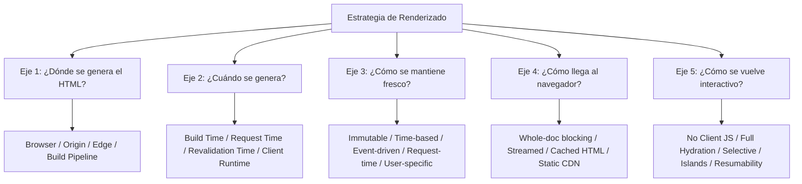
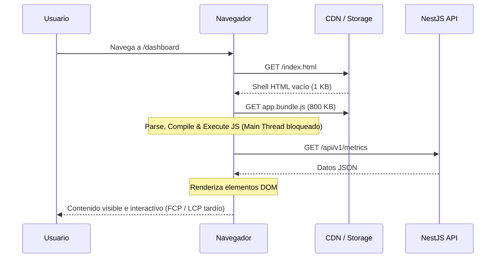
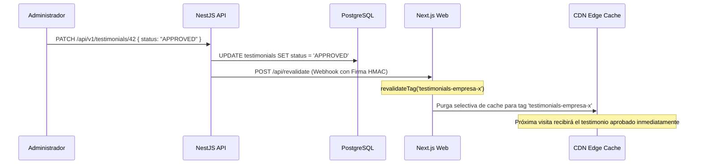
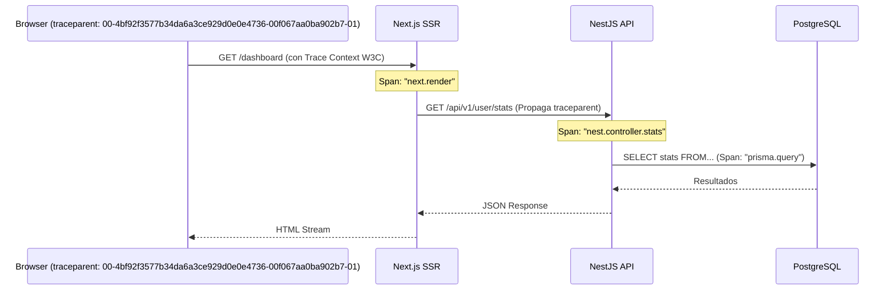

# SKL-FE-ARCH-002: Senior Web Rendering Architecture & Performance Engineering

```text
====================================================================================================
ESPECIFICACIÓN TÉCNICA DE HABILIDAD: SKL-FE-ARCH-002
Senior Web Rendering Architecture & Performance Engineering — Versión 2.0.0
Estándares: ISO/IEC 26514 | IEEE 29148 | W3C Web Platform | Core Web Vitals | WCAG 2.2 | Agile DoD
Baseline Técnico: Next.js 15.5+ App Router, React 18.3 / React 19, Node.js 22 LTS, NestJS 11, PostgreSQL
Responsable: Facundo Nicolás González
Dominio: Frontend Architecture / Web Rendering / Performance / CDN / Browser Runtime
====================================================================================================
```

---

## 1. Ficha de Identificación

| Atributo | Definición Técnica |
| :--- | :--- |
| **Código de Habilidad** | `SKL-FE-ARCH-002` |
| **Nombre de Habilidad** | Senior Web Rendering Architecture & Performance Engineering |
| **Versión** | `2.0.0` |
| **Nivel** | Senior / Staff / Production Engineering |
| **Habilidad Principal** | Diseño, optimización y gobernanza de arquitecturas modernas de renderizado web |
| **Objetivo de Dominio** | Elegir y combinar estrategias de generación, entrega, caché e interactividad según UX, frescura, SEO, costo computacional y escalabilidad operativa |
| **Estrategias Principales**| CSR / SSR / SSG / ISR / Streaming SSR / Hybrid Rendering |
| **Interactividad** | No-JS / Full Hydration / Selective Hydration / Islands / Resumability / Server Components |
| **Entrega** | Origin Server / CDN / Edge Runtime / Progressive Streaming |
| **Observabilidad** | RUM + Core Web Vitals (p75) + Server-Timing + Distributed Tracing |
| **Complejidad** | Alta |
| **Prioridad Rectora** | **UX → Correctitud → Performance → Resiliencia → SEO → Costos → Simplicidad** |

---

## 2. Filosofía de Diseño

No existe una estrategia universal de renderizado. En la ingeniería de frontend moderna, asumir dogmas absolutos constituye una deficiencia arquitectónica grave.

La decisión correcta emerge del análisis de una función multivariable:

$$\text{Strategy} = f(\text{volatility}, \text{personalization}, \text{SEO}, \text{interactivity}, \text{device}, \text{network}, \text{cost}, \text{cacheability})$$

```text
content volatility
+
personalization
+
SEO / indexability
+
interactivity
+
device capabilities
+
network quality
+
server cost
+
cacheability
```

La Skill **MUST** evitar de forma tajante decisiones dogmáticas del tipo:
- *"Todo debe ser SSR porque mejora el SEO."*
- *"Todo debe ser CSR porque nuestra app es una SPA."*
- *"Todo debe ser estático (SSG) porque es lo más rápido y seguro."*

Toda decisión de renderizado debe justificarse ruta por ruta, y subárbol por subárbol, analizando las características concretas del dominio de datos y la interacción del usuario.

---

## 3. Modelo Mental Moderno (Los 5 Ejes Independientes)

En lugar de simplificar el espacio de diseño a la taxonomía rígida tradicional (`CSR`, `SSR`, `SSG`, `ISR`), el ingeniero Senior debe desacoplar el problema en cinco dimensiones ortogonales:



---

## 4. Eje 1 — Lugar de Renderizado

El cómputo que genera el marcado HTML puede residir en múltiples capas físicas o lógicas:

1. **Browser (Client Runtime)**: Generación DOM mediante JavaScript en la máquina del usuario.
2. **Origin Server (Node.js / Express / NestJS / Fastify)**: Cómputo centralizado con acceso local a redes internas, VPC y bases de datos con pools persistentes.
3. **Edge Runtime (Vercel Edge, Cloudflare Workers, Deno Deploy)**: Entorno liviano V8 aislado distribuido geográficamente cerca del usuario final.
4. **Build Pipeline (CI/CD, GitHub Actions)**: Cómputo en tiempo de compilación/empaquetado previo al despliegue.
5. **CDN Regeneration Layer**: Nodos de caché perimetrales con capacidad de invocar funciones serverless en background para actualizar cachés.

```text
CRITERIOS DE SELECCIÓN:
- Data Locality: ¿Dónde reside la fuente de la verdad (PostgreSQL, APIs)?
- Compute Cost: Costo por millón de ejecuciones vs servidor dedicado.
- Network Latency: Latencia usuario-edge vs latencia edge-database.
- Runtime Requirements: Soporte de APIs completas de Node.js (crypto, fs, net) vs Web Standards APIs.
- Cacheability: Capacidad de amortizar el cómputo entre múltiples usuarios.
```

---

## 5. Eje 2 — Momento de Generación

Define la fase temporal en la cual los datos se combinan con las plantillas para producir HTML:

```text
Build Time           Request Time          Revalidation Time      Client Runtime
    │                     │                        │                     │
    ▼                     ▼                        ▼                     ▼
[CI/CD Build]       [User Ingress]           [Cache Stale / Tag]    [Browser Mount]
HTML inmutable      HTML dinámico            Regeneración async     DOM generado en
generado antes      generado al instante     en background          cliente vía JS
```

Estas decisiones determinan de forma directa:
- **Frescura de la información**.
- **Time To First Byte (TTFB)**.
- **Costo computacional del servidor**.
- **Cache Hit Ratio (CHR)**.

---

## 6. Eje 3 — Frescura

No todos los datos de un sistema tienen la misma tasa de cambio ni la misma criticidad temporal. Los datos deben clasificarse según su espectro de volatilidad:

- **Immutable**: Términos y condiciones versionados, changelogs históricos, políticas de privacidad.
- **Time-based freshness**: Artículos de blog, catálogo de productos estándar (toleran obsolescencia de minutos/horas).
- **Event-based freshness**: Muro de testimonios públicos (actualizados cuando un webhook de NestJS notifica aprobación), inventario de e-commerce.
- **Request-time freshness**: Feed de actividad en tiempo real, búsqueda con filtros interactivos combinados.
- **User-specific freshness**: Perfil de usuario, configuraciones de cuenta, permisos y roles RBAC (no compartibles).

> [!IMPORTANT]
> No todos los datos requieren "tiempo real". Exigir tiempo real para datos que cambian semanalmente introduce complejidad accidental, invalida capas de caché y encarece la infraestructura innecesariamente.

---

## 7. Eje 4 — Forma de Entrega

El mecanismo de transferencia del documento HTML desde el emisor hacia el navegador define la experiencia de carga inicial:

1. **Whole-document blocking**: El servidor espera a que toda la página (incluidas las consultas más lentas) esté resuelta antes de enviar el primer byte.
2. **Streamed document (Streaming SSR)**: El servidor envía inmediatamente el shell estructural de la página y luego transmite fragmentos HTML conforme las promesas asíncronas se resuelven en el backend.
3. **Cached HTML (Origin/Edge)**: Entrega instantánea de un documento precalculado desde memoria o almacenamiento perimetral.
4. **CDN Edge Cache**: Documentos distribuidos en cientos de puntos de presencia (PoPs) mundiales.
5. **Static File Storage**: Objetos servidos directamente desde storage estático (S3, Cloud Storage, R2) a través de CDN.

> [!NOTE]
> Streaming no es una estrategia de generación de datos distinta; es una **estrategia de entrega progresiva** por la red.

---

## 8. Eje 5 — Interactividad

Una vez que el documento HTML llega al navegador, la estrategia de interactividad dicta cómo cobra vida la UI:

```text
1. No Client Runtime: HTML puro + CSS + formularios HTML nativos (cero JS en cliente).
2. Full Hydration: El cliente descarga todo el árbol de componentes y lo recorre completo para asociar listeners.
3. Selective Hydration: React hidrata primero los subárboles con los que el usuario interactúa (vía Suspense).
4. Partial Hydration: Solo ciertas secciones predefinidas reciben JS, el resto del DOM permanece estático.
5. Islands Architecture: Islas interactivas aisladas embebidas en un océano de HTML inerte (Astro).
6. Resumability: Serialización de estado de ejecución en HTML que permite continuar la ejecución sin rehidratar (Qwik).
7. Client Rendering: La UI se genera y actualiza exclusivamente en cliente tras montar el root.
```

Estas técnicas resuelven el costo de ejecución en el browser, un problema completamente ortogonal a si el HTML se generó en build o en servidor.

---

## 9. Client-Side Rendering — CSR

### Mecánica Operativa
En CSR, el documento entregado por el servidor es un cascarón HTML mínimo (shell). La construcción de la interfaz y la resolución de datos ocurren enteramente en el motor JavaScript del navegador.

```text
Browser requests document
    ↓
Server returns minimal HTML shell (e.g. <div id="root"></div> + <script>)
    ↓
Download JavaScript bundles
    ↓
Parse & Compile JavaScript
    ↓
Execute application framework
    ↓
Fetch data from APIs (NestJS)
    ↓
Render UI elements into DOM
```

web.dev advierte rigurosamente que grandes cantidades de JavaScript en CSR degradan la capacidad de respuesta y agotan el presupuesto térmico y de batería en dispositivos móviles de gama baja y media.

---

## 10. CSR — Ventajas

El modelo CSR es idóneo para:
- Aplicaciones privadas autenticadas y dashboards analíticos complejos.
- Herramientas internas de gestión (backoffices).
- Aplicaciones que requieren capacidades offline robustas (PWAs con Service Workers y persistencia IndexedDB).
- Workflows de Single Page Applications (SPAs) donde la sesión de trabajo dura horas y las transiciones de vista deben ser instantáneas sin requests de documento.

**Beneficios Arquitectónicos:**
- Hosting estático trivial y económico (S3 + CDN).
- Infraestructura de backend puramente desacoplada (APIs RESTful o GraphQL sin servidores de renderizado).
- Zero server compute en la capa de frontend.
- Navegación posterior libre de re-cargas completas de documento.

---

## 11. CSR — Desventajas

El navegador debe ejecutar una cadena secuencial bloqueante antes de desplegar contenido útil al usuario:



Como indica la documentación de React, un nodo raíz inicialmente vacío deja al usuario frente a una pantalla en blanco o un spinner genérico hasta que el bundle termine de transferirse, compilarse y ejecutarse.

---

## 12. CSR y SEO

> [!WARNING]
> No incurrir en la falacia absolutista: `CSR = imposible de indexar`.

Los motores de búsqueda modernos (especialmente Googlebot) cuentan con entornos WRS (Web Rendering Service) basados en Chromium capaces de ejecutar JavaScript y renderizar SPAs. Sin embargo:
1. **Render Queue Delay**: El rastreo e indexación de páginas basadas en JavaScript se encola en una fase secundaria que puede demorar horas, días o semanas en comparación con el HTML estático.
2. **Social Crawlers**: Rastreadores de redes sociales y mensajería (Twitter/X, Facebook, WhatsApp, LinkedIn, Slack) **no ejecutan JavaScript**. Páginas que requieren previsualización con Open Graph (`og:image`, `og:title`) fallarán estrepitosamente si dependen de CSR.
3. Para catálogos públicos, sitios de comercio y contenido institucional, el pre-renderizado (SSG/SSR) es una necesidad funcional.

---

## 13. Server-Side Rendering — SSR

### Mecánica Operativa
SSR genera el marcado HTML completo para cada navegación directamente en el servidor ante la recepción del request HTTP:

```text
Request HTTP (con cookies/headers)
    ↓
Server ejecuta lógica de ruta
    ↓
Data Fetching directo a base de datos o API interna
    ↓
Renderizado del árbol de componentes a HTML string o stream
    ↓
Response HTTP con HTML completo y estado serializado
    ↓
Browser pinta HTML inmediato (FCP rápido)
    ↓
Descarga JS + Hydration para enlazar interactividad
```

web.dev define SSR como la generación de HTML en servidor en vez de delegarlo en JavaScript cliente, lo que acelera drásticamente la entrega inicial de contenido, aunque introduce un costo de cómputo por cada petición.

---

## 14. SSR — Ventajas

Estrategia adecuada para:
- Páginas con contenido altamente personalizado dependiente del usuario en sesión.
- Páginas públicas cuyo contenido cambia a cada segundo y no tolera obsolescencia de caché.
- Respuestas condicionadas por cabeceras específicas de la petición (`User-Agent`, geolocalización IP, cookies de autenticación).
- Sistemas donde se requiere soporte pleno de streaming progresivo y SEO garantizado.

**Beneficios:**
- Primer contenido útil entregado de forma temprana en el primer chunk.
- Indexabilidad garantizada para cualquier crawler o bot.
- Menor dependencia de la potencia de cómputo del dispositivo móvil para el primer render.

---

## 15. SSR — Desventajas

Cada request individual incurre en una cadena de costos:
- Consumo de CPU y memoria en servidores Node.js al serializar y renderizar árboles React.
- Dependencia directa de la latencia de red entre el servidor de frontend y las APIs o bases de datos de origen.
- Elevación del Time To First Byte (TTFB) si las consultas bloquean la respuesta.
- Aumento sustancial de los costos de infraestructura y escalamiento horizontal.
- Mayor superficie de fallas en cascada: un colapso en la base de datos puede tirar abajo el servidor de renderizado web.

---

## 16. SSR no garantiza rendimiento

> [!CAUTION]
> La premisa `SSR = Sitio Web Rápido` es una ilusión técnica peligrosa.

Una cadena secuencial mal diseñada destruye la experiencia de usuario:

```text
Browser Request
    ↓
Next.js SSR Server (espera bloqueante)
    ↓
NestJS API (espera bloqueante)
    ↓
PostgreSQL DB (query lenta sin índice, 2.5s)
    ↓
API serializa JSON masivo
    ↓
Next.js procesa componentes pesados
    ↓
Response HTML (TTFB = 3.2 segundos)
```

Un TTFB degradado de 3 segundos arruina el First Contentful Paint (FCP) y el Largest Contentful Paint (LCP), entregando una experiencia infinitamente peor que una página estática o una SPA bien optimizada.

---

## 17. SSR + Caché

Antes de recalcular el HTML completo en cada petición HTTP, la arquitectura **MUST** contemplar estrategias de caching multicapa:

```text
┌─────────────────────────────────────────────────────────────┐
│ 1. CDN / Edge Cache: Caché del documento HTML completo      │
├─────────────────────────────────────────────────────────────┤
│ 2. Full Route Cache: Caché de la ruta en el servidor de app │
├─────────────────────────────────────────────────────────────┤
│ 3. Fragment Cache: Caché de subárboles de componentes       │
├─────────────────────────────────────────────────────────────┤
│ 4. Data Cache: Caché de resultados de peticiones fetch/DB   │
└─────────────────────────────────────────────────────────────┘
```

SSR y Caching no son conceptos opuestos. Un SSR optimizado sirve la gran mayoría de sus peticiones a partir de capas de caché de datos o fragmentos previamente resueltos.

---

## 18. Static Site Generation — SSG

### Mecánica Operativa
SSG produce el documento HTML y los assets estáticos durante la etapa de compilación (`build time`), mucho antes de que se reciba cualquier petición de usuario:

```text
CI/CD Build Pipeline
    ↓
Fetch de datos globales del CMS / DB
    ↓
Renderizado estático a archivos HTML en disco
    ↓
Distribución de artefactos a almacenamiento y CDN Edge PoPs
    ↓
User Request → Servido inmediatamente desde CDN (Hit ultra-rápido)
```

---

## 19. SSG — Ventajas

Estrategia predilecta para:
- Documentación técnica y bases de conocimiento.
- Sitios web de marketing y landing pages institucionales.
- Blogs y artículos de prensa.
- Páginas de políticas legales y contenido evergreen que rara vez cambia.

**Beneficios Operacionales:**
- **Máxima cacheabilidad**: Cache Hit Ratio cercano al 100% en CDN.
- **Zero runtime compute**: Cero servidores requeridos en tiempo de ejecución.
- **Mínima superficie de ataque en runtime**: No hay código de servidor ejecutándose por petición.
- **Resiliencia extrema**: La CDN continúa sirviendo archivos estáticos aunque las bases de datos colapsen.

---

## 20. SSG — Seguridad Real

> [!IMPORTANT]
> Nunca afirmar: `SSG = 100% Seguro` como axioma absoluto.

Si bien SSG elimina la ejecución de código dinámico en el servidor de cara a la petición del usuario, introduce vectores de seguridad que deben gobernarse con rigor:
1. **Supply Chain Attacks**: Dependencias comprometidas en el build pipeline (npm / lockfiles).
2. **Filtración de Secretos en Build**: Variables de entorno privadas inyectadas involuntariamente en bundles estáticos de cliente (`NEXT_PUBLIC_*`).
3. **CMS Poisoning / XSS Almacenado**: Datos maliciosos almacenados en el CMS o base de datos que se compilan estáticamente en el HTML sin sanitización adecuada.
4. **Misconfiguración de CDN**: Headers de seguridad ausentes (`Content-Security-Policy`, `X-Content-Type-Options`).
5. **Third-Party Script Vulnerabilities**: Scripts de analítica o chat inyectados en el HTML cliente que comprometen la sesión del usuario.

---

## 21. SSG — Limitaciones

SSG resulta inadecuado o inviable cuando:
- El contenido cambia de forma continua (ej. subastas en vivo, cotizaciones financieras).
- La vista requiere datos específicos del usuario autenticado en la primera pintura.
- La cardinalidad de URLs es astronómica, provocando el fenómeno de *Build Explosion*.
- El tiempo necesario para recompilar el sitio excede los límites operacionales aceptables del equipo.

---

## 22. Build Explosion

Si una plataforma contiene **1.000.000 de URLs** (por ejemplo, perfiles públicos de testimonios o catálogos globales de e-commerce):
- Compilar cada página a 10 ms por página requeriría casi **3 horas de build continuo** en CI/CD.
- Si una build falla en la página 950.000, todo el pipeline se aborta o despliega artefactos corruptos.

**Estrategias de Mitigación Senior:**
1. **Pre-renderizado Parcial**: Generar en build únicamente el top 1% de las páginas más visitadas (ej. 10.000 páginas críticas).
2. **On-Demand Generation (Fallback)**: Generar el restante 99% bajo demanda ante la primera visita de un usuario (`fallback: 'blocking'` o ISR dinámico).
3. **Incremental Regeneration**: Actualizar únicamente las páginas que han mutado, sin reconstruir el sitio completo.

---

## 23. Incremental Static Regeneration — ISR

ISR fusiona las ventajas de la distribución estática por CDN con la flexibilidad de la regeneración controlada en segundo plano:

```text
Build inicial o Primera Visita
    ↓
Generación y almacenamiento del HTML estático en CDN Cache
    ↓
Petición subsiguiente dentro del período de validez → Servido desde CDN Cache (Hit)
    ↓
Petición subsiguiente tras expirar validez → Servido contenido "Stale" inmediatamente
    ↓
El servidor regenera en background la nueva versión en segundo plano
    ↓
Siguiente petición → Servido contenido fresco recién generado
```

---

## 24. ISR no es "SSR rápido"

Es un error conceptual categorizar a ISR como "SSR acelerado". ISR es fundamentalmente:

$$\text{ISR} = \text{Cached Static Rendering} + \text{Background Regeneration Strategy}$$

A diferencia de SSR (donde cada petición evalúa lógica de renderizado en servidor), en ISR el 99.9% de los requests reciben un archivo HTML pre-renderizado directamente desde la caché. El servidor de origen solo trabaja de forma asíncrona cuando se cumplen las condiciones de invalidación.

---

## 25. Estrategias de Revalidación

Existen dos modalidades principales para gobernar la regeneración:

### A. Revalidación Basada en Tiempo (Time-based / Polling)
El recurso define un intervalo tras el cual se considera obsoleto:
```typescript
// Next.js 15: Revalidación cada 60 segundos
export const revalidate = 60;
```
Apropiado cuando no se dispone de un mecanismo para conocer cuándo ocurren los cambios en la fuente de datos.

### B. Revalidación Guiada por Eventos (On-Demand / Webhook)
El sistema regenera el recurso inmediatamente cuando ocurre una mutación de negocio en el backend:
```typescript
// En Next.js 15: Invalidación precisa por Tag o Ruta
import { revalidateTag, revalidatePath } from 'next/cache';

export async function handleTestimonialApproved(slug: string) {
  'use server';
  revalidateTag(`testimonials-${slug}`);
  revalidatePath(`/p/${slug}`);
}
```

---

## 26. Event-Driven Revalidation

El enfoque guiado por eventos es estrictamente superior cuando el sistema emite eventos de dominio:



Este modelo erradica el polling ciego (`poll every 60s`) y garantiza frescura instantánea con costo computacional mínimo.

---

## 27. Stale-While-Revalidate (SWR)

El patrón conceptual `stale-while-revalidate` (RFC 5861) establece que el cliente o la CDN pueden entregar una copia en caché que ya ha superado su tiempo de frescura nominal (*stale*), mientras de forma concurrente y no bloqueante se despacha una solicitud al origen para obtener la versión fresca y actualizar la caché para futuras peticiones.

> [!NOTE]
> No debe confundirse el patrón arquitectónico HTTP `stale-while-revalidate` con la librería cliente de data fetching `@vercel/swr`. El concepto aplica a nivel de cabeceras HTTP de red y capas de almacenamiento intermedias.

---

## 28. Staleness Budget

Toda estrategia de caché **MUST** contar con un presupuesto explícito de obsolescencia tolerada (*Staleness Budget*). El arquitecto debe responder:
> *"¿Cuánto tiempo puede permanecer desactualizado este dato específico sin provocar daños económicos, operativos o de confianza?"*

### Matriz de Tolerancia al Desfase de Datos
```text
┌───────────────────────────┬─────────────────────────┬──────────────────────────────┐
│ Tipo de Contenido         │ Staleness Budget        │ Estrategia de Renderizado    │
├───────────────────────────┼─────────────────────────┼──────────────────────────────┤
│ Artículo de Blog / Prensa │ Horas / Días            │ SSG / ISR (time-based)       │
│ Descripción de Producto   │ Horas                   │ ISR (event-driven)           │
│ Muro de Testimonios       │ Minutos (o instantáneo) │ ISR (tag-based revalidation) │
│ Stock de Inventario       │ 5 - 15 Segundos         │ Cached SSR con SWR agresivo  │
│ Saldo Bancario / Checkout │ 0 Segundos (Zero Tol.)  │ Dynamic SSR / Request-time   │
│ Permisos y Roles (RBAC)   │ 0 Segundos (Zero Tol.)  │ Dynamic SSR / No-store       │
└───────────────────────────┴─────────────────────────┴──────────────────────────────┘
```

---

## 29. Hybrid Rendering en el Proyecto

En una arquitectura de nivel de producción, no se elige una única estrategia para toda la aplicación. Se implementa un **modelo híbrido por ruta**, perfectamente mapeado a los módulos del proyecto:

```text
Ruta en @testimonial-cms/web       Estrategia Primaria       Mecanismo Técnico
───────────────────────────────────────────────────────────────────────────────────────────
/                                  SSG                       Static export en CDN
/p/[slug]  (Muro público)          ISR (Event-driven)        revalidateTag('testimonials-[slug]')
/t/[id]    (Testimonio individual) ISR (Event-driven)        revalidateTag('testimonial-[id]')
/submit/[formSlug]                 Hybrid (Static + Island)  Shell estático + Formulario CSR
/(dashboard)/* (CMS privado)       Dynamic SSR + Streaming   Cookies session + Suspense
/embed/wall.js                     Static Asset CDN          Micro-bundle < 15 KB gzipped
```

---

## 30. Rendering por Ruta y por Subárbol

La decisión de renderizado no se detiene en el nivel de ruta. Frameworks modernos basados en React Server Components (RSC) permiten segmentar la estrategia a nivel de **subárbol de componentes**:

```text
Page: /(dashboard)/testimonials
├── Layout (SSR compartido, cacheable a nivel de shell)
├── Header (SSR con datos de usuario autenticado)
├── MetricsOverview (Streaming SSR con Suspense boundary lento)
│     └── Fallback: <MetricsSkeleton />
└── TestimonialsTable (Streaming SSR con Suspense)
      ├── TableRows (Server Component puro, zero JS transferido)
      └── ActionsCell (Client Component interactivo: modal de aprobación, eliminación)
```

---

## 31. Streaming SSR

### Mecánica Operativa
Streaming SSR rompe el paradigma monolítico de esperar a que toda la página termine de renderizarse para comenzar a transmitir bytes. Utiliza las APIs de streams del runtime (`renderToPipeableStream` en Node.js o `renderToReadableStream` en Web Streams) para emitir el HTML en bloques continuos a través de una conexión HTTP mantenida abierta con `Transfer-Encoding: chunked`.

```text
Browser solicita /dashboard
    ↓
Server envía inmediatamente cabeceras y shell HTML visible (Layout, Nav, Skeletons)
    ↓
Browser pinta el Shell (FCP ultra-rápido)
    ↓
Consulta lenta a base de datos finaliza en el servidor
    ↓
Server emite siguiente chunk HTML con el contenido real + script inline de reemplazo
    ↓
React reemplaza el Skeleton por el contenido final en el DOM sin recargar la página
```

---

## 32. Objetivo del Streaming

El objetivo cardinal del streaming es **eliminar los cuellos de botella bloqueantes**:

```text
ANTIPATRÓN BLOQUEANTE (Sin Streaming):
[Shell (10ms)] + [User Nav (15ms)] + [Slow Analytics DB Query (1800ms)]
Total TTFB = 1825 ms (El usuario mira una pantalla en blanco durante casi 2 segundos).

PATRÓN RESILIENTE (Con Streaming SSR):
1. Envío de Shell + User Nav inmediatamente (TTFB = 25 ms).
2. El usuario visualiza la interfaz estructurada y puede navegar.
3. El bloque de analítica lenta llega en un chunk posterior a los 1825 ms y se inserta en su lugar.
```

Next.js implementa este estándar de forma nativa mediante `<Suspense fallback={<ComponentSkeleton />}>` y archivos reservados `loading.tsx`.

---

## 33. Streaming ≠ Menor Tiempo Total

> [!IMPORTANT]
> Streaming no acelera la duración matemática total de las consultas en el servidor.

Si una consulta a la base de datos demora 2.5 segundos, el documento completo terminará de transmitirse exactamente en 2.5 segundos. Sin embargo, el streaming transforma radicalmente la **performance percibida**:
- Reduce el Time To First Byte (TTFB) de la respuesta inicial.
- Acelera el First Contentful Paint (FCP).
- Permite la interacción temprana con componentes ya hidratados antes de que la página completa haya terminado de cargar.

---

## 34. Suspense Boundaries

La delimitación de fronteras de Suspense (`<Suspense>`) debe responder a la arquitectura de experiencia de usuario (UX) y no colocarse indiscriminadamente alrededor de cada componente atómico:

```tsx
// ❌ ANTIPATRÓN: Suspense granular excesivo (genera "Visual Popping" y CLS severo)
<Suspense fallback={<Spinner />}>
  <Avatar />
</Suspense>
<Suspense fallback={<Spinner />}>
  <UserName />
</Suspense>
<Suspense fallback={<Spinner />}>
  <Badge />
</Suspense>

// ✅ PATRÓN SENIOR: Suspense boundary cohesionado por unidad de experiencia
<Suspense fallback={<UserProfileSkeleton />}>
  <UserProfileCard userId={id} />
</Suspense>
```

Demasiadas fronteras de suspense aisladas producen una cascada caótica de elementos apareciendo a destiempo (*loading noise*), perjudicando la estabilidad visual.

---

## 35. Skeleton Design y Prevención de CLS

Los componentes de Skeleton **MUST** respetar rigurosamente la geometría final del contenido que van a sustituir:
- Misma altura (`height` o `min-height`).
- Mismo ancho (`width`).
- Idénticos márgenes, paddings y `aspect-ratio`.

```tsx
// Implementación en @testimonial-cms/web usando Tailwind y Radix UI
export function TestimonialCardSkeleton() {
  return (
    <div className="w-full rounded-xl border border-border p-6 shadow-sm">
      <div className="flex items-center space-x-4">
        {/* Avatar circular con dimensiones idénticas a la imagen real (48x48) */}
        <div className="h-12 w-12 shrink-0 animate-pulse rounded-full bg-muted" />
        <div className="space-y-2 flex-1">
          {/* Reserva geométrica para nombre y rol */}
          <div className="h-4 w-1/3 animate-pulse rounded bg-muted" />
          <div className="h-3 w-1/4 animate-pulse rounded bg-muted" />
        </div>
      </div>
      {/* Reserva geométrica para el cuerpo del testimonio (3 líneas) */}
      <div className="mt-4 space-y-2">
        <div className="h-4 w-full animate-pulse rounded bg-muted" />
        <div className="h-4 w-5/6 animate-pulse rounded bg-muted" />
        <div className="h-4 w-2/3 animate-pulse rounded bg-muted" />
      </div>
    </div>
  );
}
```

Sustituir contenido por skeletons que no replican las dimensiones reales es la causa principal de degradación del **Cumulative Layout Shift (CLS)** durante la carga.

---

## 36. Hydration

La hidratación es el proceso mediante el cual React en el cliente inspecciona el DOM HTML generado previamente en el servidor, recrea el árbol interno de componentes en memoria y asocia los manejadores de eventos correspondientes (`onClick`, `onChange`, etc.) sin recrear los nodos DOM desde cero (`hydrateRoot()`).

---

## 37. Costo de Hydration (El "Valle de la Muerte" Interactivo)

El renderizado del lado del servidor resuelve la visibilidad del contenido, pero puede inducir una trampa de usabilidad si no se gobierna el costo de hidratación:

```text
SSR entrega HTML rápido
    ↓
El usuario ve el botón "Aprobar Testimonio" (Visualmente listo)
    ↓
El navegador descarga 2.5 MB de bundles JavaScript
    ↓
El Main Thread se bloquea al 100% parseando y ejecutando React (Valle de la Muerte)
    ↓
El usuario hace clic en el botón... Y NADA SUCEDE.
    ↓
El usuario presiona múltiples veces con frustración (Falla de INP)
    ↓
Finaliza la hidratación: los clicks acumulados se disparan desordenadamente.
```

Optimizar el tiempo de renderizado en el servidor sin auditar el costo computacional de hidratación en el cliente es una práctica amateur e incompleta.

---

## 38. Hydration Mismatch

Un **Hydration Mismatch** ocurre cuando el árbol HTML producido por el servidor no coincide con exactitud matemática con el primer render producido por el cliente en el navegador.

React clasifica los mismatches como **bugs críticos de software** que deben ser corregidos. En caso de discrepancia, React se ve obligado a descartar el subárbol DOM del servidor y re-renderizarlo enteramente en el cliente, destruyendo la performance y provocando parpadeos visuales (*layout flashes*).

---

## 39. Causas Comunes de Mismatch

```text
1. Temporales / No-determinismo: Date.now(), new Date(), Math.random() evaluados en render.
2. Localización e Idioma: Formateo de fechas (Intl.DateTimeFormat) con zonas horarias distintas 
   entre el servidor (UTC) y el navegador del cliente (GMT-3).
3. Ramas basadas en window: if (typeof window !== 'undefined') que alteran el JSX renderizado.
4. Anidamiento HTML Inválido:
   - <p> conteniendo <div>
   - <a> conteniendo <a>
   - <table> sin <tbody> explícito
   El browser repara el HTML automáticamente en el DOM y React detecta la discrepancia.
5. Inconsistencia de Datos: Datos mutados en la base de datos en el instante exacto entre el 
   render del servidor y la ejecución en el cliente sin rehidratación del payload inicial.
```

---

## 40. Prohibición de Ocultar Mismatches

> [!CAUTION]
> Queda estrictamente prohibido utilizar `suppressHydrationWarning={true}` como solución arquitectónica generalizada.

`suppressHydrationWarning` es un escape hatch restringido exclusivamente a elementos aislados con variaciones inevitables por diseño (como timestamps con segundos en vivo o extensiones de terceros que inyectan atributos en `<body>`). Ocultar advertencias de hidratación de forma sistemática enmascara fugas de memoria, bugs de estado y degradaciones de rendimiento.

---

## 41. Partial / Selective Hydration

React 18 y 19 permiten hidratación selectiva coordinada con Suspense:
- Si una página contiene tres widgets dentro de fronteras de `<Suspense>`, React no necesita esperar a que todos descarguen su código para comenzar a hidratar.
- Si el usuario interactúa (hace clic o foco) sobre el tercer widget mientras el primero se está hidratando, React **re-prioriza la cola de hidratación** e hidrata inmediatamente el componente que demandó la atención del usuario.

---

## 42. Islands Architecture

La Arquitectura de Islas (popularizada por Astro) propone un modelo donde el documento HTML es un océano de marcado 100% estático libre de JavaScript cliente, dentro del cual flotan pequeñas "islas" interactivas aisladas e independientes.

```text
DOCUMENTO HTML ESTÁTICO (Zero JavaScript)
├── Static Header & Branding
├── Static Testimonial Wall Grid (HTML puro sin React en cliente)
│     ├── Static Testimonial Card 1
│     ├── Static Testimonial Card 2
│     └── Static Testimonial Card 3
├── 🏝️ ISLA INTERACTIVA: Search & Filter Widget (<script> hidratado en cliente)
└── 🏝️ ISLA INTERACTIVA: Submit Modal Button (<script> hidratado on-demand)
```

---

## 43. Cuándo Usar Islands

La arquitectura de islas es especialmente efectiva en:
- Muros públicos de testimonios y directorios de reseñas (`/p/[slug]`).
- Sitios de documentación y blogs técnicos.
- Portales de comercio electrónico orientados a catálogo.
- Plataformas de medios donde el 90% de la experiencia es consumo de lectura y solo un 10% requiere widgets interactivos (búsqueda, carrito, modal de autenticación).

---

## 44. Islands — Ventajas

- **Reducción masiva de JS**: El navegador descarga únicamente los kilobytes necesarios para las islas interactivas, eliminando megabytes de framework inerte.
- **Hidratación independiente**: Cada isla se hidrata de forma aislada sin compartir un ciclo de renderizado bloqueante global.
- **Cero bloqueo en carga inicial**: El contenido principal es legible e interactivo mediante enlaces y formularios nativos desde el milisegundo cero.

---

## 45. Islands — Desventajas

- **Complejidad de coordinación**: Compartir estado global reactivo entre islas aisladas requiere eventos personalizados (`CustomEvent`), librerías ligeras externas (como Nanostores) o storage del navegador.
- **Inadecuado para aplicaciones holísticas**: En entornos donde casi cada elemento de la pantalla comparte estado reactivo bidireccional (como un editor de video, Figma o un panel contable interactivo denso), la fragmentación en islas introduce una carga cognitiva desmedida.

---

## 46. Resumability

Popularizado por frameworks como Qwik, **Resumability** no es una variante de la hidratación parcial. Es un paradigma alternativo:
- El servidor ejecuta la aplicación y serializa en el propio HTML no solo el marcado, sino el estado completo de la ejecución y los punteros a los event handlers diferidos.
- Al llegar al navegador, el cliente **no ejecuta código JavaScript inicial** para reconciliar el árbol. La ejecución se "reanuda" perezosamente (*lazy resumption*) en el milisegundo exacto en que el usuario dispara un evento físico sobre un elemento específico.

---

## 47. No Exigir Resumability Dogmáticamente

La adopción de Resumability exige una arquitectura y un conjunto de herramientas especializados (sintaxis específicas con closures serializables como `$`).
La Skill **no exigirá Resumability** como requisito obligatorio para considerar una arquitectura como "Senior". El arquitecto Senior evaluará el costo de hidratación y adoptará la técnica más apropiada según el stack tecnológico del proyecto.

---

## 48. React Server Components (RSC)

Los React Server Components representan un cambio fundamental en el modelo mental de React:
- **Server Components (por defecto en Next.js App Router)**: Se ejecutan **únicamente en el servidor**. Nunca se envían sus dependencias ni su código fuente al navegador. Pueden acceder directamente a bases de datos, sistemas de archivos o microservicios sin exponer secretos.
- **Client Components (`'use client'`)**: Componentes que se pre-renderizan en el servidor para generar HTML inicial y se hidratan en el navegador para habilitar interactividad, estados locales (`useState`), efectos (`useEffect`) y event listeners.

```tsx
// apps/web/src/app/(dashboard)/testimonials/page.tsx (Server Component)
import { db } from '@/lib/db';
import { TestimonialTable } from './components/testimonial-table'; // Client Component

export default async function TestimonialsPage() {
  // Acceso directo a base de datos sin API intermedia ni fugas de dependencias
  const testimonials = await db.testimonial.findMany({
    orderBy: { createdAt: 'desc' },
  });

  return (
    <main className="p-8">
      <h1 className="text-2xl font-bold">Gestión de Testimonios</h1>
      {/* Pasaje de datos serializables hacia la isla de cliente */}
      <TestimonialTable initialData={testimonials} />
    </main>
  );
}
```

---

## 49. Critical Rendering Path (CRP)

El navegador debe atravesar una secuencia física inmutable para presentar la primera imagen de la interfaz:

```text
1. Parseo HTML → Construcción del DOM (Document Object Model)
2. Parseo CSS  → Construcción del CSSOM (CSS Object Model)
3. DOM + CSSOM → Construcción del Render Tree
4. Layout (Reflow): Cálculo geométrico exacto de coordenadas y dimensiones
5. Paint: Pintado de píxeles en capas de rasterizado
6. Composite: Combinación de capas en la GPU para emisión a pantalla
```

web.dev sintetiza la optimización del CRP en tres pilares:
1. Minimizar la cantidad de recursos críticos bloqueantes (CSS y JS síncronos).
2. Minimizar la longitud de la cadena crítica (round-trips de red necesarios).
3. Minimizar la cantidad de bytes críticos transferidos.

---

## 50. Prioridad del HTML Crítico

El contenido situado *above-the-fold* (visible sin hacer scroll en el viewport del usuario) **SHOULD** evitar depender de:
- Bundles masivos de JavaScript para dibujarse.
- Peticiones secuenciales a APIs cliente en cascada (*waterfalls*).
- Hojas de estilo CSS descubiertas tardíamente vía `@import`.
- Fuentes web pesadas sin fallback métrico ajustado.
- Scripts de terceros bloqueantes en el `<head>`.

---

## 51. Resource Discovery

Optimizar el momento en que el navegador se entera de la existencia de recursos críticos mediante Resource Hints aplicados con rigurosa justificación:

```html
<!-- Preconexión temprana a orígenes de red indispensables -->
<link rel="preconnect" href="https://fonts.gstatic.com" crossorigin />

<!-- Descubrimiento anticipado de recursos críticos con alta prioridad -->
<link 
  rel="preload" 
  href="/fonts/inter-var.woff2" 
  as="font" 
  type="font/woff2" 
  crossorigin 
/>

<!-- Imagen hero crítica con fetchpriority="high" -->

```

> [!WARNING]
> Usar `preload` indiscriminadamente satura el ancho de banda del canal de red y retrasa la descarga del CSS y HTML crítico. Preloadear únicamente el activo que determina directamente el LCP.

---

## 52. Presupuestos de JavaScript (JavaScript Budget)

La Skill rechaza la imposición universal de una regla rígida como *"el bundle inicial debe pesar menos de 100 KB"* sin considerar la naturaleza del software. El impacto real del código JavaScript no depende únicamente del tamaño de transferencia, sino del tiempo de descompresión, parseo, compilación y ejecución en el procesador del dispositivo.

---

## 53. Presupuestos Segmentados por Tipo de Carga

Los límites presupuestarios deben fijarse en función del perfil funcional de cada ruta del producto:

```text
┌───────────────────────────────┬───────────────────┬──────────────────────────────────────────┐
│ Tipo de Ruta                  │ Presupuesto JS    │ Racional Técnico                         │
├───────────────────────────────┼───────────────────┼──────────────────────────────────────────┤
│ Marketing / Landing (/)       │ < 50 KB (gzipped) │ Máxima conversión, LCP/INP móvil óptimo  │
│ Muro Público (/p/[slug])      │ < 70 KB (gzipped) │ Consumo masivo en redes y móviles lentos │
│ Formulario (/submit/[slug])   │ < 100 KB (gzipped)│ Carga liviana con soporte de media       │
│ Dashboard CMS (/(dashboard))  │ < 250 KB (gzipped)│ Sesión de trabajo densa, tablas, charts  │
│ Editor Multimedia Avanzado    │ < 600 KB (gzipped)│ Lógica compleja de procesamiento en web  │
└───────────────────────────────┴───────────────────┴──────────────────────────────────────────┘
```

---

## 54. La Asimetría de Costo de JavaScript

> [!IMPORTANT]
> Un archivo JavaScript de 100 KB **NO** equivale operacionalmente a una imagen JPEG de 100 KB.

```text
100 KB JPEG:
Descarga por red → Decodificación básica en hilo secundario → GPU pinta imagen.
Costo en Main Thread: ~2 a 5 ms.

100 KB JavaScript:
Descarga por red → Descompresión → Lexer / Tokenizer → AST Parse → Bytecode Compilation 
→ Ejecución en Main Thread → Creación de objetos en memoria heap → Presión sobre Garbage Collector.
Costo en Main Thread (móvil gama media): ~150 a 400 ms de bloqueo puro.
```

Por este motivo, el presupuesto de JavaScript debe auditarse con un orden de magnitud superior de severidad respecto a cualquier otro asset estático.

---

## 55. Code Splitting

Separar el grafo de dependencias de la aplicación para que el usuario descargue únicamente el código correspondiente a la vista y funcionalidad actual:
- **Por Ruta**: Resuelto nativamente por Next.js App Router dividiendo cada subdirectorio de ruta en chunks independientes.
- **Por Interacción / Componente Pesado**: Utilizando imports dinámicos para diferir componentes que no se requieren de inmediato (modales pesados, librerías de gráficos).

```tsx
import dynamic from 'next/dynamic';

// El código de Recharts (200 KB) solo se descarga si el usuario expande la sección analítica
const AnalyticsChart = dynamic(
  () => import('./analytics-chart').then((mod) => mod.AnalyticsChart),
  { 
    loading: () => <div className="h-64 animate-pulse rounded bg-muted" />,
    ssr: false // No ejecutar en servidor si depende exclusivamente de Canvas/SVG cliente
  }
);
```

---

## 56. Lazy Loading Responsable

El lazy loading debe aplicarse a:
- Imágenes y videos situados por debajo del pliegue (*below-the-fold*).
- Modales, diálogos y drawers de configuración que requieren una acción explícita del usuario para abrirse.
- Componentes secundarios de analítica, widgets de feedback y comentarios.

> [!CAUTION]
> **Nunca aplicar lazy loading a la imagen principal o elemento de texto que determina el Largest Contentful Paint (LCP)**. Hacer lazy load del LCP retrasa artificialmente el inicio de la descarga y destruye la métrica.

---

## 57. Tree Shaking Real

No confiar ciegamente en que el bundler (Webpack / Turbopack) eliminará código muerto de librerías mal diseñadas:
- Preferir importaciones modulares directas frente a importaciones tipo barril (*barrel files*) masivas que impidan el análisis estático.
- Auditar paquetes usando herramientas como `@next/bundle-analyzer`.
- Reemplazar librerías pesadas por alternativas modernas con cero dependencias transitivas (ej. preferir `date-fns` con tree-shaking o APIs nativas `Intl` frente a `moment.js`).

---

## 58. Gobernanza de Third-Party Scripts

Los scripts de terceros (Google Tag Manager, Meta Pixel, Hotjar, Crisp Chat, Google Analytics) representan el mayor factor de degradación de Core Web Vitals en producción.

**Estrategia de Mitigación Obligatoria:**
1. Cargar scripts de analítica con estrategia `lazyOnload` o `afterInteractive` mediante el componente `next/script`.
2. Aislar herramientas pesadas de rastreo fuera del Main Thread utilizando web workers (mediante soluciones como Partytown).
3. Establecer un inventario estricto de scripts de terceros con dueños responsables y fechas de revisión semestral.

```tsx
import Script from 'next/script';

export function ThirdPartyAnalytics() {
  return (
    <Script
      src="https://www.googletagmanager.com/gtag/js?id=G-XXXXX"
      strategy="afterInteractive"
    />
  );
}
```

---

## 59. Core Web Vitals (Edición Vigente 2026)

Las tres métricas oficiales de rendimiento de la plataforma web establecidas por Google son:

| Métrica | Nombre | Qué evalúa | Umbral "Good" (Percentil 75) |
| :--- | :--- | :--- | :--- |
| **LCP** | Largest Contentful Paint | Velocidad de carga del contenido visual primario | $\le \mathbf{2.5\text{ s}}$ |
| **INP** | Interaction to Next Paint | Capacidad de respuesta y fluidez ante interacciones | $\le \mathbf{200\text{ ms}}$ |
| **CLS** | Cumulative Layout Shift | Estabilidad visual durante todo el ciclo de vida | $\le \mathbf{0.1}$ |

> [!IMPORTANT]
> **First Input Delay (FID) ha sido oficialmente deprecado** y sustituido por **INP**. La Skill prohíbe el uso de FID como indicador principal de interactividad.

---

## 60. LCP — Largest Contentful Paint

Mide el tiempo transcurrido desde que el usuario inicia la navegación hasta que se renderiza en pantalla el elemento visual de mayor tamaño visible en el viewport (bloque de texto, imagen de portada, video póster).

**Objetivo contractual**: $\mathbf{p75 \le 2.5\text{ segundos}}$.

**Palancas Principales de Optimización:**
1. Acelerar el TTFB del documento HTML (CDN caching / Streaming).
2. Eliminar bloqueos de CSS y JavaScript en el camino crítico.
3. Preloadear la imagen candidata a LCP con `fetchpriority="high"`.
4. Utilizar compresión moderna (AVIF / WebP) y redimensionamiento dinámico responsive (`next/image`).

---

## 61. INP — Interaction to Next Paint

Evalúa la latencia de todas las interacciones físicas (clics, taps en pantalla táctil, pulsaciones de teclado) realizadas por el usuario a lo largo de su visita, reportando el peor percentil de retardo hasta que el navegador presenta el siguiente frame actualizado.

**Objetivo contractual**: $\mathbf{p75 \le 200\text{ milisegundos}}$.

**Palancas Principales de Optimización:**
1. Dividir tareas largas (*Long Tasks* $> 50$ ms) en microtareas mediante `scheduler.yield()` o `setTimeout(0)`.
2. Desacoplar actualizaciones de UI no urgentes usando `startTransition` / `useTransition`.
3. Evitar layout thrashing (lecturas y escrituras DOM intercaladas síncronas).
4. Reducir la complejidad y tamaño del bundle JavaScript ejecutado durante eventos.

```tsx
import { useState, useTransition } from 'react';

export function TestimonialFilterIsland({ onFilter }: { onFilter: (q: string) => void }) {
  const [query, setQuery] = useState('');
  const [isPending, startTransition] = useTransition();

  const handleChange = (e: React.ChangeEvent<HTMLInputElement>) => {
    const nextVal = e.target.value;
    // Actualización inmediata del input (prioridad alta: evita retraso en INP)
    setQuery(nextVal);

    // Filtrado pesado diferido como transición no bloqueante
    startTransition(() => {
      onFilter(nextVal);
    });
  };

  return (
    <div className="relative">
      <input 
        type="text" 
        value={query} 
        onChange={handleChange} 
        placeholder="Buscar testimonios..." 
        className="w-full border rounded p-2"
      />
      {isPending && <span className="absolute right-2 top-2 text-xs text-muted">Filtrando...</span>}
    </div>
  );
}
```

---

## 62. CLS — Cumulative Layout Shift

Mide la suma total de todas las puntuaciones de cambio de diseño inesperado ocurridas en la página durante toda la sesión.

**Objetivo contractual**: $\mathbf{p75 \le 0.1}$.

**Palancas Principales de Optimización:**
1. Declarar siempre atributos explícitos `width` y `height` o propiedad CSS `aspect-ratio` en todas las imágenes y videos.
2. Reservar espacio físico anticipado para banners, widgets dinámicos y anuncios.
3. Emplear `font-display: swap` combinado con fuentes de respaldo coincidentes en métricas (`size-adjust`) para erradicar el shift en el intercambio tipográfico.
4. Jamás insertar contenido nuevo por encima de contenido ya existente, salvo en respuesta directa a una interacción iniciada por el usuario.

---

## 63. TTFB — Time to First Byte

El TTFB mide el tiempo que transcurre entre la solicitud inicial de red del navegador y la recepción del primer byte de respuesta HTTP.

**Rol Arquitectónico:**
- **No es un Core Web Vital**, sino una **métrica diagnóstica fundamental**.
- Si el TTFB es deficiente ($> 1.5$ s), resulta matemáticamente imposible obtener un buen LCP y FCP.
- Guía general de web.dev: $\mathbf{TTFB \le 800\text{ ms}}$ como referencia de salud general para documentos dinámicos.

---

## 64. Rechazo al Dogma "TTFB < 200ms Obligatorio"

> [!NOTE]
> La versión histórica exigía `TTFB < 200 ms` como requisito inflexible.

En la ingeniería de producción moderna, pretender un TTFB inferior a 200 ms para contenido dinámico transaccional global que ejecuta autorización de sesión en bases de datos relacionales sin edge compute cercano es físicamente inviable y operacionalmente absurdo.
La Skill adoptará **SLOs de TTFB contextualizados por producto y segmentación geográfica**, priorizando el streaming de chunks tempranos antes que el bloqueo total por alcanzar un número sintético.

---

## 65. FCP — First Contentful Paint

Mide el momento en que se renderiza el primer fragmento de contenido DOM (texto, imagen no blanca o canvas) en la pantalla. Sirve como feedback primario de que el sistema ha respondido a la acción de navegación. No debe optimizarse de forma aislada a expensas de empeorar el LCP o INP.

---

## 66. TBT — Total Blocking Time

Mide el tiempo total acumulado entre el FCP y el momento en que la página es completamente interactiva (Time to Interactive), durante el cual el hilo principal del navegador estuvo bloqueado por tareas que superaron los 50 milisegundos.
- **Métrica de Laboratorio**: TBT no es medible en usuarios reales (en campo se mide INP).
- **Excelente proxy sintético**: Optimizar y reducir TBT en Lighthouse correlaciona directamente con la obtención de un INP saludable en producción.

---

## 67. Datos de Laboratorio vs Datos de Campo (Lab vs Field)

| Dimensión | Laboratorio (Lab Data) | Campo (Field Data / RUM) |
| :--- | :--- | :--- |
| **Entorno** | Máquinas virtuales sintéticas y emuladores estandarizados | Dispositivos reales de usuarios con CPUs saturadas y térmicas variables |
| **Conectividad** | Perfiles de red fijos (ej. Fast 4G, 10 Mbps) | Redes móviles oscilantes, Wi-Fi saturado, pérdidas de paquetes |
| **Interacciones** | Pruebas mecánicas automatizadas (sin comportamiento humano real) | Clicks, scrolls erráticos, zoom, navegación multificha real |
| **Herramientas** | Lighthouse, WebPageTest, Chrome DevTools | Chrome User Experience Report (CrUX), OpenTelemetry RUM, web-vitals.js |
| **Propósito** | Detección temprana de regresiones y debugging en CI/CD | Criterio de verdad absoluto para evaluar la experiencia real de usuario |

---

## 68. Herramientas de Laboratorio

- **Lighthouse**: Auditorías sintéticas rápidas en desarrollo y checks en CI.
- **WebPageTest**: Análisis visual cuadro a cuadro (*waterfall diagrams*), pruebas en dispositivos físicos reales en múltiples locaciones globales.
- **Chrome DevTools Performance Panel**: Perfilado milimétrico del call tree, flame charts del main thread y rastreo de Long Tasks.

---

## 69. Gobernanza mediante Field Data (RUM)

Los Core Web Vitals **MUST** evaluarse y auditarse primariamente mediante datos reales de usuarios (**Real User Monitoring - RUM**):
- Segmentación por percentil 75 (p75).
- Desglose por tipo de dispositivo (Desktop vs Mobile).
- Segmentación por región geográfica y condiciones de red.
- Correlación con lanzamientos y versiones de software en CI/CD.

---

## 70. El Mito del "SEO se reduce a SSR"

> [!WARNING]
> Un sitio renderizado en el servidor puede tener un SEO catastrófico si su arquitectura de información es deficiente.

El posicionamiento orgánico depende de una jerarquía integral:
- Semántica HTML correcta (`<header>`, `<nav>`, `<main>`, `<article>`, jerarquía estricta `<h1>`-`<h6>`).
- Metadata estructurada y etiquetas Open Graph dinámicas.
- Marcado JSON-LD para Schema.org (ej. `Review`, `AggregateRating`, `Organization`).
- URLs canónicas consistentes y gestión adecuada de redirecciones y códigos de estado HTTP (200, 301, 404).
- Enlazado interno limpio e indexabilidad técnica de sitemaps XML.
- Core Web Vitals (factor oficial de Page Experience de Google).

El SSR garantiza que los crawlers reciban el HTML sin demoras, pero **no sustituye la calidad del contenido ni la ingeniería semántica**.

---

## 71. Prohibición de "Lighthouse SEO Score > 95" como Contrato Absoluto

La auditoría de SEO de Lighthouse comprueba comprobaciones técnicas básicas (existencia de `<meta name="viewport">`, etiquetas `<title>`, texto legible). Alcanzar 100 en Lighthouse SEO no implica que la página rankeará en los primeros resultados de búsqueda de Google ni garantiza indexación exitosa de términos de negocio. La Skill utilizará métricas de visibilidad en search consoles e indexabilidad real en lugar de scores sintéticos triviales.

---

## 72. Edge Rendering

Edge Rendering consiste en ejecutar funciones de renderizado dentro de la red distribuida de una CDN, en puntos geográficos físicamente próximos al usuario.

```text
Usuario en San Pablo
    ↓  (Latencia de red: 15 ms)
Edge Node en San Pablo (Ejecuta middleware / micro-render)
    ↓
Retorna respuesta inmediata desde caché local o lógica liviana
```

---

## 73. El Peligro Oculto de la Falta de Localidad de Datos

> [!CAUTION]
> Edge Rendering puede ser significativamente más lento que un servidor tradicional si se viola el principio de **Data Locality**.

```text
ESCENARIO CRÍTICO DE LATENCIA DISPERSA:
Usuario en Buenos Aires
    ↓ (20 ms)
Edge Compute en Buenos Aires
    ↓ (180 ms transatlántico)
PostgreSQL Database en Frankfurt (AWS eu-central-1)
    ↓ (Query 1: Verifica sesión)
Edge Compute en Buenos Aires
    ↓ (180 ms transatlántico)
PostgreSQL Database en Frankfurt
    ↓ (Query 2: Carga testimonios)
Edge Compute en Buenos Aires
    ↓
HTML Response

Resultado: 4 round-trips transatlánticos = ¡Más de 750 ms perdidos solo en física de red!
```

Si los datos primarios residen centralizados en una base de datos relacional, situar el cómputo en el mismo datacenter que la base de datos (Origin SSR) ofrece menor latencia total que ejecutar el cómputo en el Edge sin base de datos distribuida.

---

## 74. Cuándo Usar Edge Compute

El Edge Runtime es óptimo para:
- Georuteo e internacionalización instantánea (redirecciones basadas en cabeceras de país/idioma).
- A/B Testing y experimentación a nivel de cabeceras sin parpadeo de layout.
- Autenticación liviana perimetral (validación de firmas criptográficas JWT sin consultar DB).
- Composición de APIs cacheadas y transformaciones regionales de contenido estático.

---

## 75. Cuándo Evitar Edge Compute

Evitar el Edge Runtime cuando:
- La lógica requiere dependencias nativas completas del ecosistema Node.js (ej. módulos C++, `canvas`, librerías pesadas de procesamiento de PDF/video).
- La conexión a la base de datos requiere pools de conexiones persistentes TCP con alta densidad de queries transaccionales complejas.
- El tiempo de cómputo por petición supera las cuotas estrictas de los runtimes serverless perimetrales (ej. límites de CPU de 50 ms en Cloudflare Workers / Vercel Edge).

---

## 76. Infraestructura CDN (Content Delivery Network)

Todo contenido que sea compartible entre múltiples usuarios o cuya tasa de cambio lo permita **MUST** servirse desde capas perimetrales de CDN antes de invocar cómputo dinámico en el origen:

```text
Browser Request
    ↓
CDN Edge PoP (¿Hit en Cache?)
    ├── SÍ (95% de los casos) ──► Retorna HTML / Asset en 20 ms
    └── NO  (Miss / Expired)  ──► Reenvía petición al servidor Origin (Next.js / NestJS)
```

---

## 77. Diseño Explicito de Cabeceras Cache-Control

Las directivas HTTP de caché deben configurarse con absoluta precisión semántica:

```http
# 1. Assets estáticos inmutables con hash en el nombre (bundles JS, CSS compilado, fuentes)
Cache-Control: public, max-age=31536000, immutable

# 2. Páginas públicas con ISR / SWR (cacheable en CDN y stale permitido)
Cache-Control: public, s-maxage=60, stale-while-revalidate=86400

# 3. Páginas de Dashboard autenticadas con datos sensibles y privados
Cache-Control: private, no-cache, no-store, must-revalidate

# 4. APIs con respuestas que no deben ser almacenadas en ningún intermediario
Cache-Control: no-store
```

---

## 78. Aislamiento Estricto de Datos Privados

> [!CAUTION]
> Peligro Crítico de Seguridad: Cachear contenido privado o personalizado en una CDN pública constituye un incidente grave de filtración de datos (Data Leak / PII).

**Reglas de Prevención:**
1. Respuestas que contengan datos de usuario autenticado **NUNCA** deben emitir directivas `Cache-Control: public`.
2. Emplear la directiva `Cache-Control: private` para restringir el almacenamiento exclusivamente al navegador del usuario individual.
3. Configurar cabeceras `Vary: Cookie, Authorization` para garantizar que la CDN no sirva la respuesta de un usuario a otro ante peticiones coincidentes en la URL.

---

## 79. Diseño de Cache Keys

Una Cache Key define la identidad única bajo la cual un objeto se almacena en la caché de la CDN o del servidor:

```text
Cache Key Básica:
URL (Protocol + Host + Path + QueryString)

Cache Key Multidimensional:
Host + Path + QueryString + Accept-Encoding + (Locale / Cookie de Idioma)
```

**Principios de Diseño:**
- **Suficiencia**: Debe incorporar cualquier dimensión que altere el HTML retornado (idioma, variante A/B).
- **Parquedad**: No incluir dimensiones innecesarias (como parámetros de tracking irrelevantes `utm_source`, `fbclid`) que fragmentan la caché y destruyen el Cache Hit Ratio (CHR). Normalizar las URLs antes de evaluar la llave.

---

## 80. Invalidación Quirúrgica de Caché

La invalidación de caché debe ser:
1. **Targeted (Quirúrgica)**: Purgar únicamente el recurso mutado (`revalidateTag('testimonial-123')`).
2. **Traceable (Trazable)**: Cada purga debe registrar logs con el ID de evento, usuario causante y timestamp.
3. **Observable (Monitoreable)**: Registrar la tasa de aciertos y fallos de caché tras cada invalidación.

> Prohibido utilizar `purge-all` (*purgar todo el sitio*) ante modificaciones de entidades individuales.

---

## 81. Política de Falla de APIs Durante el Build

Cuando un servicio upstream (NestJS API o base de datos) falla o no responde durante el build estático en CI/CD:

```text
¿Cómo debe comportarse el build pipeline?
```

La respuesta depende de la naturaleza del contenido:
- **Contenido Crítico / Financiero / Legal**: **Fail Build**. Es inaceptable desplegar un sitio con páginas de precios o términos vacías o corruptas. El build debe fallar con código de error no-cero e interrumpir el despliegue.
- **Contenido No Crítico (ej. Blog o testimonios secundarios)**: Emplear snapshots cacheados del build previo o degradar a generación on-demand en runtime.

---

## 82. Políticas de Falla de Despliegue (Build Failure Policies)

```text
┌────────────────────────────┬───────────────────────┬───────────────────────────────────────────┐
│ Naturaleza del Contenido   │ Acción ante Falla     │ Racional Operativo                        │
├────────────────────────────┼───────────────────────┼───────────────────────────────────────────┤
│ Checkout / Precios / Auth  │ ABORT BUILD (Hard)    │ Previene fraude o cobros erróneos         │
│ Documentación / Catálogo   │ RETAIN PREVIOUS DEPLOY│ Mantiene continuidad de servicio          │
│ Feed Social / Testimonios  │ FALLBACK / ON-DEMAND  │ La página carga el shell y difiere la API │
└────────────────────────────┴───────────────────────┴───────────────────────────────────────────┘
```

---

## 83. Graceful Degradation Real

> [!WARNING]
> La premisa `Si falla SSR → Caer automáticamente a CSR` es un antipatrón peligroso.

Si el renderizado en servidor falló porque la base de datos PostgreSQL de producción colapsó o la API de NestJS está arrojando errores 500:
- Forzar un fallback a CSR hará que miles de navegadores cliente bombardeen inmediatamente a la misma API caída con peticiones síncronas cliente.
- Este fenómeno produce un efecto avalancha (*Thundering Herd*) que garantiza que el backend nunca pueda recuperarse.

---

## 84. Diseño de Fallbacks por Dominio de Falla

Los mecanismos de degradación deben diseñarse aislando los límites de falla de cada subsistema:

```tsx
// Ejemplo de degradación controlada en Server Component
export async function TestimonialSection({ slug }: { slug: string }) {
  let testimonials = [];
  try {
    testimonials = await fetchTestimonialsWithTimeout(slug, 2000);
  } catch (error) {
    // Falla no crítica: loguear telemetría y degradar a estado vacío amigable
    logger.warn({ error, slug }, 'API de testimonios no disponible. Renderizando fallback.');
    return (
      <div className="rounded-lg border border-dashed p-6 text-center text-muted">
        Los testimonios no se encuentran disponibles en este momento. Continuá explorando.
      </div>
    );
  }

  return <TestimonialGrid items={testimonials} />;
}
```

---

## 85. Comportamiento de Falla en Streaming SSR

El streaming introduce un desafío operativo crítico:
- Una vez que el servidor emite el primer chunk HTTP con cabecera `HTTP/1.1 200 OK`, **el código de estado HTTP ya no puede ser alterado**.
- Si un componente que se resuelve en un chunk posterior arroja una excepción no controlada:
  1. El servidor no puede emitir un código `500 Internal Server Error`.
  2. El servidor debe emitir el error encapsulado en el stream y activar la frontera de error más cercana en el cliente (`<ErrorBoundary>`), o emitir un script de rescate para cerrar el árbol DOM de forma segura.

---

## 86. Error Boundaries: Alcance y Limitaciones

Los componentes de Error Boundary de React (`componentDidCatch` o librerías como `react-error-boundary`) capturan errores durante:
- El ciclo de renderizado de componentes hijos.
- Métodos de ciclo de vida e hidratación en cliente.

**Lo que un Error Boundary NO puede solucionar:**
- Errores en manejadores de eventos asíncronos (`onClick`).
- Código asíncrono no capturado (promesas sueltas sin await).
- Caídas totales de red o servidores fuera de línea.
- Códigos de error HTTP retornados antes del render.

---

## 87. Seguridad en la Serialización de Hidratación

Cuando el servidor renderiza una página con SSR o RSC, los datos utilizados deben serializarse a JSON para transmitirse al cliente y permitir la rehidratación.

> [!CAUTION]
> Toda la información inyectada en el payload de hidratación viaja en **texto plano** al navegador y es accesible mediante las herramientas de desarrollo (*DevTools*).

**Reglas de Oro de Seguridad:**
1. **Principio de Mínimo Privilegio de Datos**: Filtrar y proyectar los objetos antes de pasarlos a componentes de cliente. Jamás pasar objetos completos de Prisma/Base de datos.
2. **Prohibición de Datos Sensibles**: Cero tokens de acceso, hashes de contraseña (`passwordHash`), API keys privadas o flags internos de autorización en props de componentes cliente.
3. Utilizar la directiva `import 'server-only'` en módulos de acceso a datos para impedir físicamente que se empaqueten en código de cliente.

---

## 88. Serialización Segura y Prevención de XSS

Inyectar datos del servidor dentro de etiquetas `<script>` en el HTML sin el debido escape genera vulnerabilidades críticas de Cross-Site Scripting (XSS):

```html
<!-- ❌ VULNERABILIDAD CRÍTICA: Concatenación directa insegura -->
<script>
  window.__INITIAL_DATA__ = <%= JSON.stringify(userData) %>;
</script>
<!-- Si userData contiene strings como "</script><script>maliciousCode()</script>", 
     el parser del navegador cerrará el script prematuramente y ejecutará el exploit. -->

<!-- ✅ PATRÓN SEGURO: Serialización con caracteres HTML escapados -->
<script type="application/json" id="__INITIAL_DATA__">
  {"userName":"Juan\u003c/script\u003e"}
</script>
```

---

## 89. Percepción de Performance (Psychology of Speed)

El rendimiento técnico absoluto (segundos de cronómetro) es solo la mitad del problema. La **velocidad percibida** por el usuario determina la satisfacción y el engagement:
- **Instant Visual Feedback**: Responder inmediatamente a interacciones táctiles o clics (estados de active, loaders de botón en $< 50$ ms).
- **Progressive Content Disclosure**: Mostrar estructura y texto antes de que carguen las imágenes decorativas.
- **Layout Stability**: Evitar saltos de página que desorienten la lectura visual.
- **Continuous Progress**: Utilizar animaciones sutiles de shimmer en skeletons en lugar de spinners estáticos indeterminados.

---

## 90. Performance en Navegaciones Posteriores

Después de la carga inicial de la página (*hard refresh*), la arquitectura debe optimizar las **navegaciones subsecuentes del cliente**:
- Reutilización inteligente de layouts compartidos (Next.js RootLayout no se vuelve a montar).
- Preservación del estado de scroll del usuario.
- Transiciones fluidas asistidas por la API de transiciones de React (`useTransition`).
- Cancelación oportuna de peticiones en vuelo previas cuando el usuario cambia de ruta velozmente.

---

## 91. Prefetching Inteligente

El prefetching permite descargar recursos y datos de una ruta anticipadamente cuando un enlace se vuelve visible en el viewport:
- **Riesgo de Prefetching Excesivo**: Descargar indiscriminadamente todas las rutas de un menú gigante agota el plan de datos y la batería de usuarios móviles en conexiones medidas.
- **Buenas Prácticas**:
  1. En Next.js, utilizar `prefetch={false}` en listas masivas o links secundarios.
  2. Respetar las preferencias del usuario evaluando la cabecera `Save-Data`.
  3. Disparar el prefetching al hacer *hover* o foco sobre el enlace en lugar de por simple visibilidad en viewport cuando la red sea lenta.

---

## 92. Optimización Profesional de Imágenes

Las imágenes constituyen en promedio más del 60% del peso en bytes de una página web y son el determinante más común del **LCP**.

**Reglas de Ingeniería de Imágenes:**
1. Formatos de Nueva Generación: Servir **AVIF** prioritariamente (20% más liviano que WebP), con fallback automático a **WebP** y JPG.
2. Dimensionamiento Adaptativo: Utilizar el atributo `sizes` en `next/image` para que el navegador descargue exactamente la resolución requerida según los breakpoints CSS.
3. Servir imágenes cacheadas a través de un CDN optimizador especializado.
4. Preload explícito para la imagen candidata a LCP (`priority={true}`).

```tsx
import Image from 'next/image';

export function TestimonialAvatar({ src, name }: { src: string; name: string }) {
  return (
    <div className="relative h-12 w-12 overflow-hidden rounded-full">
      <Image
        src={src}
        alt={`Avatar de ${name}`}
        fill
        sizes="(max-width: 768px) 48px, 48px"
        className="object-cover"
        loading="lazy" // Lazy para avatares en listas largas
      />
    </div>
  );
}
```

---

## 93. Erradicación de CLS Inducido por Imágenes

Toda imagen inyectada en el DOM **MUST** contar con espacio reservado antes de que sus bytes finalicen la descarga:
- Usar atributos `width` y `height` nativos en el HTML.
- Usar la clase de Tailwind `aspect-square`, `aspect-video` o estilos en línea `style={{ aspectRatio: '16/9' }}`.
- Mostrar fondos de color base (`bg-muted`) mientras la imagen decodifica.

---

## 94. Estrategia de Carga de Tipografías (Web Fonts)

Las fuentes web mal optimizadas provocan dos anomalías visuales severas:
- **FOIT (Flash of Invisible Text)**: El texto permanece invisible durante segundos mientras la fuente descarga.
- **FOUT (Flash of Unstyled Text)**: El texto aparece en una tipografía genérica y luego cambia bruscamente a la fuente personalizada, alterando las líneas de texto y detonando un **CLS catastrófico**.

**Directrices de Optimización:**
1. **Self-Hosting**: Alojar fuentes en el mismo origen de la aplicación (o vía `next/font`), eliminando round-trips externos a servidores de Google Fonts.
2. **Subsetting**: Incluir únicamente los glifos de los idiomas necesarios (latin-ext).
3. **Formatos Modernos**: Emplear exclusivamente formatos comprimidos `.woff2`.
4. **Metric Overrides**: Utilizar `font-display: swap` combinado con propiedades de compatibilidad métrica (`size-adjust`, `ascent-override`) para que la fuente de fallback ocupe el mismo espacio físico exacto.

---

## 95. Optimización de CSS

El CSS es por definición un **recurso bloqueante del renderizado**. El navegador no dibujará ningún píxel hasta haber construido el CSSOM.

**Prácticas Mandatorias:**
1. Eliminar hojas de estilo globales masivas no utilizadas (auditar con PurgeCSS / Tailwind JIT compiler).
2. Prohibir el uso de `@import` dentro de archivos CSS (fuerza waterfalls secuenciales de red).
3. Asegurar que el Critical CSS requerido para pintar el viewport superior se entregue en el primer chunk de respuesta.

---

## 96. Mejora Progresiva (Progressive Enhancement)

La aplicación **SHOULD** mantener funcionalidad esencial operativa en caso de que JavaScript se retrase, falle o sea bloqueado por extensiones de privacidad:
- Los formularios clave (búsqueda, login, recolección de testimonios) deben construirse sobre elementos HTML semánticos `<form action="..." method="POST">` soportados por Server Actions.
- La navegación principal debe operar con enlaces nativos `<a>` funcionales sin requerir ejecución síncrona de JavaScript.

---

## 97. Performance Budgets en CI/CD

Cada proyecto debe gobernar sus umbrales máximos mediante presupuestos de rendimiento auditados de forma automatizada en el pipeline de integración continua:

```json
{
  "budgets": [
    {
      "resourceType": "script",
      "budget": 200,
      "unit": "KiB"
    },
    {
      "resourceType": "total",
      "budget": 500,
      "unit": "KiB"
    },
    {
      "metric": "largest-contentful-paint",
      "budget": 2500
    },
    {
      "metric": "cumulative-layout-shift",
      "budget": 0.1
    }
  ]
}
```

---

## 98. Prohibición de Presupuestos Universales Arbitrarios

Un dashboard analítico denso con tablas y gráficos no puede estar gobernado por el mismo presupuesto que una landing page comercial. Los presupuestos deben calibrarse de forma particular a partir de:
- El perfil de hardware del usuario objetivo.
- La criticidad de la tasa de conversión en la ruta.
- La frecuencia de uso diario del módulo.

---

## 99. Matriz de Decisión — Client-Side Rendering (CSR)

Elegir CSR predominantemente cuando se cumpla la mayoría de las siguientes condiciones:
- La vista es de acceso **estrictamente privado y autenticado**.
- La indexación por motores de búsqueda (SEO) y previsualización social son **completamente irrelevantes**.
- La interacción rica de usuario predomina sobre el consumo de lectura de contenido.
- La navegación posterior dentro del módulo es extensa y no justifica round-trips de documento.
- Se requieren capacidades avanzadas de soporte offline (Service Workers / PWA).
- El backend está 100% desacoplado en forma de microservicios REST/GraphQL independientes.

---

## 100. Matriz de Decisión — Server-Side Rendering (SSR)

Elegir SSR dinámico cuando:
- El contenido depende estrictamente de cada petición HTTP (cookies de sesión, headers dinámicos).
- Existe personalización profunda en servidor requerida en la primera pintura.
- El contenido cambia en tiempo real y **no tolera staleness** para cachearlo estáticamente.
- Se requiere SEO riguroso en páginas con datos volátiles.
- Se cuenta con infraestructura de servidor capaz de soportar la carga computacional concurrente.

---

## 101. Matriz de Decisión — Static Site Generation (SSG)

Elegir SSG cuando:
- El contenido es público y homogéneo para todos los usuarios.
- La tasa de mutación del contenido es muy baja (días o semanas).
- El contenido puede pre-calcularse de forma determinística durante el pipeline de build.
- Se busca maximizar la tasa de aciertos de caché en CDN (Cache Hit Ratio $\approx 100\%$).
- Se exige el menor costo operativo posible y zero servidores en runtime.

---

## 102. Matriz de Decisión — Incremental Static Regeneration (ISR)

Elegir ISR cuando:
- El contenido es público y compartible entre usuarios.
- La información muta con cierta frecuencia pero **tolera un staleness budget controlado** (minutos/horas).
- El volumen de URLs es muy elevado (miles o millones), haciendo inviable un rebuild total en build time.
- Se dispone de eventos claros (webhooks de CMS o base de datos) para activar revalidaciones bajo demanda basadas en tags.

---

## 103. Matriz de Decisión — Islands Architecture

Considerar la Arquitectura de Islas cuando:
- La página es predominantemente contenido estático de lectura (artículos, perfiles públicos, muros de testimonios).
- Únicamente pequeñas zonas aisladas de la pantalla requieren interactividad con JavaScript (buscador, modal, botón de reacción).
- Se busca una reducción radical del bundle JavaScript descargado por dispositivos móviles.
- Los componentes interactivos no requieren compartir árboles densos de estado global bidireccional.

---

## 104. Matriz de Decisión — Streaming SSR

Implementar Streaming SSR cuando:
- La página contiene una mezcla de datos rápidos (layout, perfil de usuario) y datos lentos (analíticas, reportes pesados).
- Entregar el shell estructural inmediato aporta valor tangible a la experiencia de usuario.
- Existen límites claros de experiencia para colocar fronteras de `<Suspense>` con Skeletons geométricos.
- El framework y la infraestructura de hosting soportan transferencias HTTP con streaming no bufferizado.

---

## 105. Checklist Senior de Selección de Estrategia

Antes de comenzar a escribir código para una nueva ruta o funcionalidad, el ingeniero **MUST** responder con honestidad técnica a las siguientes 22 preguntas:

```text
1.  ¿El contenido es público o privado?
2.  ¿El contenido es idéntico para todos los usuarios o cambia según la sesión?
3.  ¿Con qué frecuencia exacta mutan los datos de origen?
4.  ¿Cuál es el Staleness Budget máximo admisible para este dato sin causar daño al negocio?
5.  ¿La página requiere indexación en Google u otros motores de búsqueda?
6.  ¿La página requiere generación de previsualizaciones Open Graph en redes sociales?
7.  ¿Cuánto código JavaScript necesita realmente el usuario para interactuar con esta pantalla?
8.  ¿En qué momento exacto necesita la interfaz volverse interactiva?
9.  ¿Puede generarse el HTML durante la etapa de build en CI/CD?
10. ¿Cuántas URLs totales existen o existirán en este dominio en el próximo año?
11. ¿Cuánto tiempo y dinero de cómputo cuesta regenerar el conjunto completo de páginas?
12. ¿Dónde residen físicamente los datos (datacenter/región de la base de datos)?
13. ¿Dónde residen geográficamente los usuarios finales que consumen el producto?
14. ¿Puede este documento HTML cachearse en una CDN pública compartida?
15. ¿Puede entregarse la respuesta de forma estática directamente desde el Edge?
16. ¿La infraestructura del producto opera en múltiples regiones geográficas?
17. ¿Aporta valor real a la experiencia de usuario entregar la respuesta mediante Streaming SSR?
18. ¿La interfaz puede modularse limpiamente en fronteras lógicas de Suspense con Skeletons?
19. ¿Cuál es la estrategia concreta de degradación cuando la API de backend falle o se demore?
20. ¿Qué política se aplicará si el build falla debido a un error temporal en el upstream?
21. ¿Cuáles son los presupuestos de Core Web Vitals (LCP, INP, CLS) asignados a esta ruta?
22. ¿Cómo se medirá la experiencia real en producción (RUM y Server-Timing)?
```

---

## 106. Árbol de Decisión Algorítmico

```text
¿El contenido es compartido entre múltiples usuarios?
│
├── SÍ (Contenido Público)
│   │
│   ├── ¿La tasa de cambio es nula o casi nula? (Evergreen)
│   │      └── ¿La cantidad de URLs es moderada (< 5.000)?
│   │             ├── SÍ ──► [ SSG Puro ]
│   │             └── NO ──► [ ISR con fallback on-demand ]
│   │
│   ├── ¿El contenido cambia periódicamente pero tolera un Staleness Budget?
│   │      └── ¿El backend emite eventos claros de mutación (Webhooks)?
│   │             ├── SÍ ──► [ ISR Event-Driven (Tag-based revalidation) ]
│   │             └── NO ──► [ ISR Time-based (s-maxage + SWR) ]
│   │
│   └── ¿El contenido debe estar estrictamente fresco al milisegundo de la petición?
│          └── ¿Existen consultas lentas combinadas con datos rápidos?
│                 ├── SÍ ──► [ Streaming SSR con Suspense ]
│                 └── NO ──► [ Dynamic SSR con Cache de Datos ]
│
└── NO (Contenido Privado / Autenticado)
    │
    ├── ¿El usuario requiere ver HTML estructurado temprano antes de interactuar?
    │      └── ¿Existen componentes asíncronos con tiempos de respuesta dispares?
    │             ├── SÍ ──► [ Dynamic SSR + Streaming con Suspense ]
    │             └── NO ──► [ Dynamic SSR Tradicional (Cache-Control: private) ]
    │
    └── ¿La vista es una herramienta densa de interacción continua (Dashboard/Editor)?
           └── [ CSR / Hybrid con Shell Pre-renderizado e Islas Interactivas ]
```

---

## 107. Observabilidad de Renderizado

Una arquitectura de renderizado en producción **MUST** monitorear de forma continua las siguientes señales operativas:

```text
┌──────────────────────────────┬────────────────────────────────────────────────────────┐
│ Métrica de Telemetría        │ Qué revela sobre el sistema                            │
├──────────────────────────────┼────────────────────────────────────────────────────────┤
│ Time To First Byte (TTFB)    │ Latencia de red, tiempo de cálculo en servidor y DB    │
│ First Contentful Paint (FCP) │ Eficiencia del CRP y entrega de recursos bloqueantes   │
│ Largest Contentful Paint (LCP│ Momento de entrega del valor visual principal          │
│ Interaction to Next Paint(INP│ Saturación del Main Thread y costo de JavaScript       │
│ Cumulative Layout Shift (CLS)│ Inestabilidad geométrica y dimensionamiento visual     │
│ Server Render Duration       │ Tiempo consumido por Node.js renderizando componentes │
│ CDN Cache Hit Ratio (CHR)    │ Porcentaje de peticiones resueltas en el perímetro     │
│ Hydration Duration           │ Tiempo de bloqueo de CPU al enlazar listeners en client│
│ Client JS Error Rate         │ Bugs e incompatibilidades no detectadas en testing     │
└──────────────────────────────┴────────────────────────────────────────────────────────┘
```

---

## 108. Server-Timing API

Utilizar la cabecera estándar HTTP `Server-Timing` para exponer diagnósticos de latencia desde el backend hacia las herramientas de desarrollo y los sistemas de telemetría del navegador:

```http
HTTP/1.1 200 OK
Content-Type: text/html; charset=utf-8
Server-Timing: 
  auth;dur=12;desc="Verificación de Sesión",
  db;dur=45;desc="Query Prisma PostgreSQL",
  render;dur=18;desc="React SSR Component Tree",
  total;dur=75;desc="Procesamiento Total en Origen"
```

Esta información permite al equipo de frontend determinar instantáneamente si una degradación de TTFB proviene de la base de datos, de una API externa o del cómputo de renderizado en Node.js.

---

## 109. Distributed Tracing en SSR

En arquitecturas donde Next.js se comunica con NestJS y PostgreSQL:



Toda la transacción **SHOULD** correlacionarse bajo el mismo Trace ID de OpenTelemetry (estándar W3C Trace Context) para diagnosticar de extremo a extremo las causas de latencia.

---

## 110. Real User Monitoring (RUM)

No validar el rendimiento exclusivamente en el hardware de alta gama de los desarrolladores ni en simulaciones de oficina.
Capturar telemetría continua de usuarios reales utilizando la librería oficial `web-vitals`:

```typescript
// apps/web/src/app/report-web-vitals.ts
import { onLCP, onINP, onCLS, onTTFB } from 'web-vitals';

export function sendToAnalytics(metric: any) {
  const body = JSON.stringify({
    name: metric.name,
    value: metric.value,
    rating: metric.rating, // 'good' | 'needs-improvement' | 'poor'
    delta: metric.delta,
    id: metric.id,
    navigationType: metric.navigationType,
  });

  // navigator.sendBeacon garantiza entrega asíncrona sin bloquear la descarga
  if (navigator.sendBeacon) {
    navigator.sendBeacon('/api/telemetry/vitals', body);
  } else {
    fetch('/api/telemetry/vitals', { body, method: 'POST', keepalive: true });
  }
}

export function registerWebVitals() {
  onLCP(sendToAnalytics);
  onINP(sendToAnalytics);
  onCLS(sendToAnalytics);
  onTTFB(sendToAnalytics);
}
```

---

## 111. Prevención de Regresiones en CI/CD

El pipeline de integración continua debe incorporar compuertas automatizadas de rendimiento:
- Alertas automáticas ante incrementos superiores al 5% en el tamaño de los bundles de JavaScript.
- Auditorías sintéticas mediante Lighthouse CI contra rutas maestras antes de fusionar Pull Requests.
- Verificación de que ninguna ruta nueva carezca de una estrategia explícita de renderizado y caché.

---

## 112. Definition of Done (DoD) de Renderizado en Producción

Una ruta o funcionalidad web se considera lista para producción únicamente cuando cumple los siguientes criterios:

```text
[ ] 1. Estrategia Justificada: Se seleccionó y documentó CSR/SSR/SSG/ISR/Híbrido según los 5 ejes.
[ ] 2. Frescura y Caché: Staleness budget documentado y cabeceras Cache-Control explícitas.
[ ] 3. Aislamiento de Datos: Cero directivas public en respuestas que contengan datos de usuario privado.
[ ] 4. Semántica y SEO: Marcado HTML nativo, etiquetas Open Graph, metadata dinámica y código de estado adecuado.
[ ] 5. Zero Hydration Mismatches: Verificación libre de errores en consola de desarrollo y producción.
[ ] 6. Streaming y Skeletons: Suspense boundaries coherentes y skeletons con reservas geométricas exactas (sin CLS).
[ ] 7. Presupuesto de JavaScript: El peso de los bundles se encuentra dentro del budget asignado a la ruta.
[ ] 8. Core Web Vitals en Campo: LCP p75 ≤ 2.5s, INP p75 ≤ 200ms, CLS p75 ≤ 0.1 en entornos de staging/canary.
[ ] 9. Resiliencia de Upstream: Manejo elegante de fallas de base de datos o APIs sin tirar abajo el servidor.
[ ] 10. Seguridad en Serialización: Cero tokens, contraseñas o datos de infraestructura filtrados en el payload RSC.
[ ] 11. Third-Party Governance: Ningún script de terceros insertado de forma síncrona o bloqueante en el camino crítico.
[ ] 12. Observabilidad Activa: RUM configurado y cabeceras Server-Timing expuestas para diagnóstico.
```

---

## 113. Catálogo de 30 Antipatrones Técnicos

```text
⚠️ RENDER-01: Dogmatismo de Estrategia Única. Imponer una sola estrategia (ej. "todo SSR") para toda la aplicación.
⚠️ RENDER-02: CSR Indiscriminado. Usar CSR para todo bajo el pretexto de que "es una SPA", ignorando SEO y LCP móvil.
⚠️ RENDER-03: SSR Universal para "Mejorar SEO". Forzar SSR en paneles privados donde el SEO es nulo, encareciendo el servidor.
⚠️ RENDER-04: SSG para Datos Altamente Personalizados. Pre-renderizar en build datos de cuentas privadas de usuario.
⚠️ RENDER-05: ISR para Datos Financieros / Cero Staleness. Usar ISR para balances o stocks donde cualquier retraso es crítico.
⚠️ RENDER-06: Confundir SSR con Streaming. Creer que SSR siempre hace streaming, cuando el SSR clásico es totalmente bloqueante.
⚠️ RENDER-07: Confundir ISR con SSR. Tratar a ISR como SSR rápido en lugar de entender que es renderizado estático cacheado.
⚠️ RENDER-08: Confundir Islands con SSG. Asumir que las islas son solo páginas estáticas, ignorando su aislamiento de hidratación.
⚠️ RENDER-09: Confundir Resumability con Hidratación Selectiva. Ignorar que resumability no reconcilia el árbol en cliente.
⚠️ RENDER-10: Asumir que Edge Compute es Siempre más Rápido. Mover cómputo al edge ignorando que la base de datos está a 200 ms.
⚠️ RENDER-11: Ignorar Data Locality. Fragmentar la red con múltiples round-trips transatlánticos entre servidor y base de datos.
⚠️ RENDER-12: Enviar Megabytes de JS tras un SSR Veloz. Crear páginas visualmente listas que permanecen congeladas durante segundos.
⚠️ RENDER-13: Ignorar Hydration Mismatches. Desestimar las alertas rojas de mismatch en consola considerándolas "inofensivas".
⚠️ RENDER-14: Ocultar Mismatches con suppressHydrationWarning. Usar la bandera de React en toda la aplicación para silenciar bugs.
⚠️ RENDER-15: Proliferación Excesiva de Suspense Boundaries. Envolver cada componente atómico produciendo layout popping caótico.
⚠️ RENDER-16: Skeletons que Provocan CLS. Diseñar skeletons con alturas o proporciones distintas al contenido final cargado.
⚠️ RENDER-17: Caché sin Política de Invalidación. Cachear contenido sin tener un mecanismo automatizado o tag para purgarlo.
⚠️ RENDER-18: Caché Pública de Contenido Privado. Emitir Cache-Control: public en rutas con información sensible o de sesión.
⚠️ RENDER-19: Purga Masiva ante Mutaciones Locales. Ejecutar purge-all en la CDN para actualizar un único comentario o testimonio.
⚠️ RENDER-20: Consultas Lentas Bloqueando Todo el Documento. No aislar consultas lentas detrás de streaming o Suspense boundaries.
⚠️ RENDER-21: Presupuesto Universal de Bundle Arbitrario. Exigir < 100 KB para un editor CAD o relajar a 2 MB en una landing page.
⚠️ RENDER-22: Usar First Input Delay (FID) como Métrica Vigente. Evaluar interactividad con FID en lugar de INP en la actualidad.
⚠️ RENDER-23: Tratar el SEO Score de Lighthouse como Ranking de Google. Creer que sacar 100 en Lighthouse garantiza visitas orgánicas.
⚠️ RENDER-24: Imponer TTFB < 200 ms como Estándar Universal. Exigir 200 ms a sistemas dinámicos globales sin evaluar streaming.
⚠️ RENDER-25: Fallback Ciego SSR → CSR ante Caídas de Backend. Tirar a los clientes a pegarle directamente a una API que ya colapsó.
⚠️ RENDER-26: Medir Rendimiento Exclusivamente en Local / Laboratorio. Optimizar basándose en una MacBook Pro M3 en fibra óptica.
⚠️ RENDER-27: Optimizar Únicamente la Primera Navegación. Ignorar por completo la fluidez y el costo de las navegaciones subsecuentes.
⚠️ RENDER-28: Ignorar Scripts de Terceros en el Presupuesto. Permitir que marketing inyecte 30 scripts sin auditar su impacto en el INP.
⚠️ RENDER-29: Prefetching Indiscriminado y Masivo. Descargar anticipadamente 50 rutas saturando el ancho de banda y la batería móvil.
⚠️ RENDER-30: Elegir Framework o Estrategia antes de Entender el Contenido. Decidir la arquitectura antes de analizar la volatilidad de datos.
```

---

## 114. Matriz de KPIs y Métricas de Éxito

| Métrica | Umbral Aceptable (SLA) | Umbral Excelente (Target) | Mecanismo de Medición |
| :--- | :--- | :--- | :--- |
| **LCP (Percentil 75)** | $\le 2.5\text{ s}$ | $\le 1.8\text{ s}$ | RUM (`web-vitals` en producción) |
| **INP (Percentil 75)** | $\le 200\text{ ms}$ | $\le 100\text{ ms}$ | RUM (`web-vitals` en producción) |
| **CLS (Percentil 75)** | $\le 0.1$ | $\le 0.02$ | RUM (`web-vitals` en producción) |
| **TTFB (Origen SSR)** | $\le 800\text{ ms}$ | $\le 300\text{ ms}$ | APM / Server-Timing |
| **Hydration Mismatches** | $\mathbf{0}$ | $\mathbf{0}$ | Error Monitoring (Sentry / Datadog) |
| **Contenido Privado en Caché Pública**| $\mathbf{0}$ | $\mathbf{0}$ | Security Audits / Edge Tests |
| **Rutas sin Estrategia Explícita** | $\mathbf{0}$ | $\mathbf{0}$ | CI Architecture Linter |
| **Third-Party Scripts no Inventariados**| $\mathbf{0}$ | $\mathbf{0}$ | Tag Governance Review |
| **Render Failures no Observables** | $\mathbf{0}$ | $\mathbf{0}$ | OpenTelemetry Traces |
| **Cache Invalidations no Trazables** | $\mathbf{0}$ | $\mathbf{0}$ | CDN Audit Logs |

---

## 115. Metodología Senior en 8 Fases

```text
Fase 1: Clasificación del Contenido
- Identificar si cada ruta y dato es público o privado, compartido o personalizado, estático o volátil.

Fase 2: Definición del Staleness Budget
- Determinar cuánto tiempo puede estar desactualizado cada dato sin impacto negativo en el negocio.

Fase 3: Selección de Estrategia Base
- Mapear la ruta al modelo correspondiente: SSG, ISR, SSR, CSR o Híbrido.

Fase 4: Diseño de Entrega y Caching
- Definir cabeceras Cache-Control, ubicación del cómputo (Origin vs Edge) y activación de Streaming SSR.

Fase 5: Arquitectura de Interactividad
- Determinar si se requiere No-JS, Server Components puros, Islas selectivas o hidratación en cliente.

Fase 6: Asignación de Presupuestos de Rendimiento
- Fijar budgets de JavaScript transferido, tiempo de ejecución, LCP, INP y CLS para la ruta.

Fase 7: Pruebas de Resiliencia y Modos de Falla
- Simular apagado de base de datos, lentitud en APIs upstream, falla de CDN y JavaScript deshabilitado.

Fase 8: Validación en Producción
- Monitorear métricas de campo (RUM) al percentil 75, Server-Timing y ratios de acierto de caché.
```

---

## 116. Cheat Sheet — Las 30 Reglas de Oro

1. No existe una estrategia de renderizado universal.
2. La estrategia se define por ruta y por subárbol, no por dogma de framework.
3. Separá conceptualmente generación, caché, entrega e interactividad.
4. CSR es legítimo para aplicaciones ricas privadas y dashboards de alta densidad interactiva.
5. SSR no garantiza velocidad; un backend lento produce un SSR inaceptable.
6. SSG maximiza la cacheabilidad y minimiza el costo computacional para contenido estático.
7. ISR requiere un Staleness Budget documentado y justificado.
8. Preferí revalidación guiada por eventos (Tags/Webhooks) sobre revalidaciones por tiempo ciego.
9. Streaming SSR mejora la entrega progresiva y el FCP, no necesariamente el tiempo total de backend.
10. Diseñá las fronteras de Suspense según la experiencia del usuario, no alrededor de cada componente.
11. La hidratación tiene un costo computacional severo en procesadores móviles.
12. Un Hydration Mismatch es un bug crítico que debe resolverse en el código, no silenciarse.
13. La arquitectura de islas reduce el código JavaScript cuando la mayor parte de la página es estática.
14. Resumability difiere de la hidratación porque reanuda la ejecución sin reconciliar el DOM inicial.
15. Los React Server Components permiten ejecutar lógica en servidor sin inflar el bundle de cliente.
16. Optimizá el Critical Rendering Path eliminando recursos bloqueantes en el viewport superior.
17. Todo kilobyte de JavaScript debe estar estrictamente justificado por su valor funcional.
18. Definí presupuestos de rendimiento segmentados por el tipo de carga de trabajo.
19. Mantené el LCP en el percentil 75 por debajo de 2.5 segundos.
20. Mantené el INP en el percentil 75 por debajo de 200 milisegundos.
21. Mantené el CLS en el percentil 75 por debajo de 0.1.
22. El TTFB es una métrica diagnóstica esencial, pero no un Core Web Vital contractual.
23. El criterio de verdad definitivo del rendimiento son los datos de campo reales (RUM), no Lighthouse local.
24. Adoptá Edge Rendering únicamente cuando la localidad de cómputo y de datos estén alineadas.
25. Jamás almacenes contenido privado o personalizado en cachés públicas de CDN.
26. Diseñá invalidaciones de caché quirúrgicas y observables basadas en tags o claves precisas.
27. Los fallbacks ante caídas de backend deben degradar la interfaz de forma segura sin disparar avalanchas de tráfico.
28. El posicionamiento SEO no se resuelve mágicamente con SSR si la semántica y los metadatos son deficientes.
29. La percepción psicológica de velocidad es tan relevante como los milisegundos absolutos de reloj.
30. La mejor arquitectura de renderizado es aquella que entrega el contenido correcto con la menor cantidad de trabajo total para el servidor, la red y el navegador.

---

## 117. La Regla Rectora

```text
====================================================================================================
CONTENT
   ↓
FRESHNESS REQUIREMENT (Staleness Budget)
   ↓
GENERATION STRATEGY (Build vs Request vs Event)
   ↓
CACHE STRATEGY (CDN vs Server vs Private)
   ↓
DELIVERY STRATEGY (Streaming vs Whole Document)
   ↓
INTERACTIVITY STRATEGY (RSC vs Islands vs Client)
   ↓
BROWSER WORK (Minimal Main-Thread Execution)
====================================================================================================
```

---

## 118. Resultado Esperado

Toda arquitectura concebida, auditada o implementada bajo el estándar **SKL-FE-ARCH-002** exhibirá de forma verificable las siguientes propiedades:

- **Híbrida**: Combina la estrategia óptima para cada caso de uso sin caer en soluciones dogmáticas homogéneas.
- **Consciente del Contenido**: Cada decisión deriva de la volatilidad y naturaleza intrínseca del dato.
- **Gobernada por Caché**: Maximiza el Cache Hit Ratio en CDN aislando estrictamente la información privada.
- **Eficiente en Hidratación**: Minimiza el trabajo del Main Thread en dispositivos móviles reales.
- **Capaz de Streaming**: Desacopla componentes lentos mediante Suspense y Skeletons que previenen CLS.
- **Perimetralmente Inteligente**: Aprovecha la CDN y el Edge respetando rigurosamente la localidad de los datos.
- **Semánticamente Robusta**: Garantiza indexabilidad óptima y previsualizaciones ricas para motores y crawlers.
- **Resiliente ante Fallas**: Degrada armónicamente ante caídas del backend sin amplificar el colapso.
- **Observable de Extremo a Extremo**: Monitorea Web Vitals reales en campo (p75) y expone diagnósticos con Server-Timing.
- **Gobernada por Presupuestos**: Previene regresiones de rendimiento de forma automatizada en el ciclo de CI/CD.

El fin primordial de la habilidad consiste en **generar cada fragmento de la interfaz en el lugar y momento más eficiente, cachearlo durante el tiempo correcto, entregar primero el contenido de mayor valor y ejecutar en el navegador del usuario única y exclusivamente el JavaScript indispensable**.
