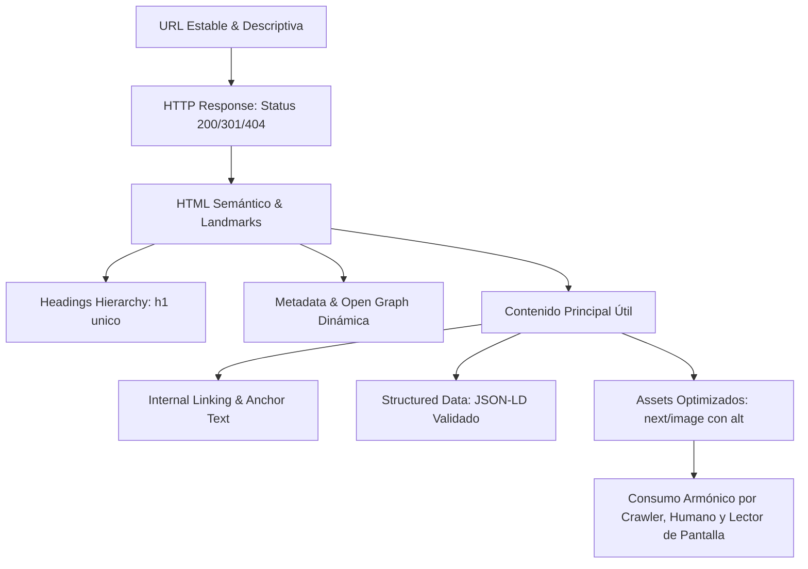
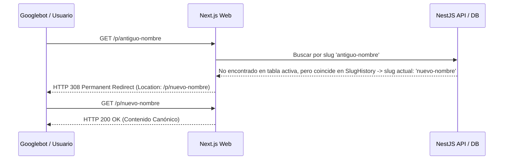

# SKL-WEB-SEO-A11Y-001: Senior SEO, Semantic HTML & Accessibility Engineering

```text
====================================================================================================
ESPECIFICACIÓN TÉCNICA DE HABILIDAD: SKL-WEB-SEO-A11Y-001
Senior SEO, Semantic HTML & Accessibility Engineering — Versión 1.0.0
Estándares: Google Search Essentials | HTML Living Standard | WCAG 2.2 AA | WAI-ARIA | Schema.org | Agile DoD
Baseline Técnico: Next.js 15.5+ App Router, React 18.3 / React 19, TypeScript 5.8+, NestJS 11, Prisma ORM, PostgreSQL
Responsable: Facundo Nicolás González
Dominio: Web / Frontend / SEO / HTML / Accessibility / Information Architecture
====================================================================================================
```

---

## 1. Ficha de Identificación del Skill

| Atributo | Definición Técnica |
| :--- | :--- |
| **Código de Habilidad** | `SKL-WEB-SEO-A11Y-001` |
| **Nombre de Habilidad** | Senior SEO, Semantic HTML & Accessibility Engineering |
| **Versión** | `1.0.0` |
| **Nivel** | Senior / Production Engineering |
| **Habilidad Principal** | Diseño e implementación profesional de HTML semántico, SEO técnico, arquitectura de URLs y accesibilidad web |
| **Objetivo de Dominio** | Construir aplicaciones web rastreables, indexables, comprensibles, accesibles y optimizadas para usuarios humanos, tecnologías asistivas y motores de búsqueda |
| **Áreas Principales** | Semantic HTML / Technical SEO / URL & Slug Architecture / Metadata / Indexing / Structured Data / WCAG |
| **Target de Accesibilidad** | **WCAG 2.2 Nivel AA** |
| **Modelo SEO** | People-First + Technical Correctness + Crawlability + Indexability + Schema Integrity |
| **Observabilidad** | Google Search Console + RUM (Core Web Vitals) + Crawl Monitoring + Automated & Manual A11Y Audits |
| **Complejidad** | Alta |
| **Prioridad Rectora** | **Correctitud → Accesibilidad → Contenido → Indexabilidad → UX → Performance → Search Appearance** |

---

## 2. Descripción y Filosofía de Diseño

El SEO técnico, el HTML semántico y la accesibilidad web no son tres capas periféricas o accesorias que se agregan al final del ciclo de vida del software. En una arquitectura de producción de alto nivel, estas disciplinas convergen en un único estándar indivisible de **calidad de ingeniería de software para la plataforma web**:

```text
SEMANTIC HTML
+
ACCESSIBLE UX (WCAG 2.2 AA)
+
CRAWLABLE ARCHITECTURE
+
USEFUL CONTENT (People-First)
+
CORRECT METADATA & STRUCTURED DATA
```

Google Search Essentials establece con contundencia que las mejores prácticas consisten en ofrecer contenido útil y orientado a personas, palabras descriptivas en lugares estratégicos, enlaces rastreables mediante marcado estándar y una implementación técnica que permita interpretar con exactitud el contenido principal, imágenes, videos y datos estructurados.

---

### 2.1. Regla Rectora

> [!IMPORTANT]
> **Diseñá primero una página comprensible para una persona, estructurada rigurosamente para tecnologías asistivas y técnicamente accesible para los crawlers de búsqueda; después optimizá su apariencia y snippets en los motores de búsqueda.**

El SEO profesional moderno **NO** es la fórmula amateur de:
$$\text{SEO} \ne \text{Keywords repetidas} + \text{Meta tags arbitrarias}$$

El SEO profesional de nivel Senior abarca:

```text
content architecture
+
HTML semantics
+
crawlability
+
indexability
+
canonicalization
+
internal linking
+
URL & slug architecture
+
performance (Core Web Vitals)
+
structured data (Schema.org)
+
search observability (Search Console)
```

---

### 2.2. El SEO Técnico No Garantiza Posiciones Contractuales

> [!WARNING]
> Cumplir rigurosamente con todas las directrices técnicas de SEO:
> $$\text{SEO Técnico Perfecto} \ne \text{Garantía de Ranking en Primer Puesto}$$

Los requisitos técnicos y semánticos hacen que una página sea **elegible para ser rastreada, indexada e interpretada sin fricciones**. Sin embargo, los algoritmos de clasificación de Google evalúan cientos de señales dinámicas (utilidad intrínseca, autoridad, frescura, señales de usuario, contexto del query). Google no garantiza que una página sea indexada ni la posición ordinal en que aparecerá. Diseñamos para la elegibilidad técnica impecable y la satisfacción del usuario real.

---

## 3. Arquitectura Base de una Página Pública

Toda página pública de producción debe procesarse a través de un flujo estructurado y predecible:



---

## 4. HTML Semántico Primero

Los elementos de HTML5 deben seleccionarse en base a su **significado intrínseco y rol funcional**, jamás por su apariencia visual o conveniencia estilística:

- `<header>`: Cabecera introductoria a nivel de página o de artículo/sección.
- `<nav>`: Bloque dedicado a enlaces de navegación principal, secundaria o paginación.
- `<main>`: Contenedor del contenido principal exclusivo y no repetitivo del documento.
- `<article>`: Unidad de contenido autocontenida y reutilizable independientemente.
- `<section>`: Agrupación temática con título identificable.
- `<aside>`: Contenido complementario o tangencialmente relacionado.
- `<footer>`: Pie informativo con autoría, enlaces legales, sitemap o copyright.

> [!CAUTION]
> Queda terminantemente prohibido utilizar `<div class="header">`, `<div class="nav">`, `<div class="main">` o `<div class="article">` cuando existe un elemento semántico nativo disponible en el estándar HTML.

Los elementos semánticos de HTML crean de forma automática **Landmarks ARIA nativos** reconocidos por las APIs de accesibilidad del sistema operativo, permitiendo a los usuarios de lectores de pantalla saltar directamente a regiones estructurales clave.

---

## 5. Landmarks Estructurales

Un documento web debe organizarse mediante regiones clave coherentes y claramente identificadas:

```html
<body class="min-h-screen bg-background text-foreground">
  <!-- Skip link primario para navegación por teclado -->
  <a href="#main-content" class="sr-only focus:not-sr-only focus:fixed focus:top-4 focus:left-4 focus:z-50 focus:rounded-md focus:bg-primary focus:px-4 focus:py-2 focus:text-primary-foreground focus:shadow-lg">
    Saltar al contenido principal
  </a>

  <!-- Landmark: Banner / Cabecera -->
  <header class="sticky top-0 z-40 w-full border-b bg-background/95 backdrop-blur">
    <div class="container flex h-16 items-center justify-between">
      <a href="/" class="flex items-center space-x-2" aria-label="Inicio de TestimonialCMS">
        <span class="font-bold">TestimonialCMS</span>
      </a>

      <!-- Landmark: Navegación Principal -->
      <nav aria-label="Navegación principal" class="hidden md:flex gap-6">
        <a href="/features" class="text-sm font-medium hover:text-primary">Características</a>
        <a href="/pricing" class="text-sm font-medium hover:text-primary">Precios</a>
        <a href="/wall-of-fame" class="text-sm font-medium hover:text-primary">Muro Público</a>
      </nav>
    </div>
  </header>

  <!-- Landmark: Contenido Principal -->
  <main id="main-content" tabindex="-1" class="flex-1 focus:outline-none">
    <!-- Contenido único de la ruta -->
  </main>

  <!-- Landmark: Pie de Página -->
  <footer class="border-t bg-muted/40 py-8">
    <div class="container text-center text-sm text-muted-foreground">
      <p>&copy; 2026 TestimonialCMS. Todos los derechos reservados.</p>
    </div>
  </footer>
</body>
```

---

## 6. `<main>`: El Contenedor Principal

El elemento `<main>` encapsula el contenido que responde directamente a la intención específica de la página:
- Excluye elementos repetitivos entre páginas (barras de navegación global, footers, formularios de búsqueda transversal, avisos de copyright).
- **Regla WAI**: Debe existir **un único elemento `<main>` visible por documento**.
- Se le debe asignar un `id="main-content"` para servir como destino del enlace de salto (*skip link*).

---

## 7. `<article>`: Unidades Autocontenidas

Utilizar `<article>` para contenido que posee sentido completo por sí mismo y que podría distribuirse o sindicarse de forma aislada:
- Muro de testimonios: Cada tarjeta de testimonio individual es un `<article>`.
- Entradas de blog o changelogs técnicos.
- Reseñas de productos (`Review`).
- Publicaciones de foros y comentarios de usuarios.

```tsx
// Componente de Testimonio en @testimonial-cms/web
export function TestimonialCard({ testimonial }: { testimonial: Testimonial }) {
  return (
    <article 
      aria-labelledby={`testimonial-title-${testimonial.id}`}
      className="flex flex-col rounded-xl border bg-card p-6 shadow-sm"
    >
      <header className="flex items-center space-x-4 mb-4">
        
        <div>
          <h3 id={`testimonial-title-${testimonial.id}`} className="font-semibold text-base">
            {testimonial.authorName}
          </h3>
          <p className="text-xs text-muted-foreground">{testimonial.authorRole} en {testimonial.company}</p>
        </div>
      </header>
      <blockquote className="flex-1 text-sm text-foreground/90 italic">
        "{testimonial.content}"
      </blockquote>
      <footer className="mt-4 pt-4 border-t text-xs text-muted-foreground">
        <time dateTime={testimonial.createdAt.toISOString()}>
          {formatDate(testimonial.createdAt)}
        </time>
      </footer>
    </article>
  );
}
```

---

## 8. `<section>`: Agrupaciones Temáticas

Utilizar `<section>` únicamente cuando exista una agrupación temática real que justifique un encabezado explícito:
- **Regla de Oro**: Toda `<section>` **MUST** poseer un encabezado (`<h2>`-`<h6>`) o estar rotulada mediante `aria-labelledby`.
- Si el elemento se introduce exclusivamente con fines de estilizado, padding o grid CSS, utilizar un simple `<div>`.

```html
<section aria-labelledby="metrics-heading" class="py-12">
  <h2 id="metrics-heading" class="text-2xl font-bold tracking-tight mb-6">
    Métricas de Confianza y Conversión
  </h2>
  <!-- Contenido de la sección -->
</section>
```

---

## 9. `<aside>`: Contenido Tangencial o Complementario

El elemento `<aside>` representa contenido relacionado indirectamente con el tema principal:
- Barras laterales (*sidebars*) con enlaces a testimonios relacionados o documentación de ayuda.
- Cajas de llamadas destacadas (*callouts* o avisos contextuales).
- Módulos de suscripción a newsletters o banners promocionales no intrusivos.

> [!NOTE]
> No convertir automáticamente cualquier columna lateral visual en un `<aside>`. Si la columna lateral contiene la navegación principal del dashboard, su marcado semántico es `<nav>`, no `<aside>`.

---

## 10. `<header>` y `<footer>` Contextuales

Los elementos `<header>` y `<footer>` operan a dos niveles en la jerarquía:
1. **A nivel de documento**: Representan el landmark global de cabecera (`banner`) y pie de página (`contentinfo`).
2. **A nivel de componente contextual**: Dentro de un `<article>` o `<section>`, representan la cabecera (autor, fecha) y pie (metadatos, etiquetas) específicos de ese fragmento sin generar landmarks globales duplicados.

---

## 11. Jerarquía Lógica de Encabezados

Los encabezados (`<h1>` a `<h6>`) deben comunicar la **estructura lógica y el mapa mental del documento**, no el tamaño o estilo visual tipográfico:

```text
h1: Título Primario del Recurso (Único por página)
├── h2: Sección Temática A
│   ├── h3: Subsección A.1
│   └── h3: Subsección A.2
│       └── h4: Detalle Específico
├── h2: Sección Temática B
│   ├── h3: Subsección B.1
└── h2: Sección Temática C
```

**Regla WAI**: Evitar saltos arbitrarios hacia abajo (ej. pasar de un `<h2>` directamente a un `<h4>` simplemente para que la tipografía se vea más pequeña).

---

## 12. La Política del Único `<h1>` Principal por Página

La política de ingeniería para el proyecto es:

$$\mathbf{1\text{ Clear Primary } H1 \text{ Per Page}}$$

**Racional Arquitectónico:**
- Aunque la especificación formal de HTML5 permite técnicamente múltiples `<h1>` contenidos en secciones anidadas, MDN y los estándares de accesibilidad recomiendan un único `<h1>` por página.
- Simplifica la interpretación de la intención del documento por parte de lectores de pantalla y crawlers de búsqueda.
- Evita títulos principales contradictorios que confundan la relevancia semántica de la URL.

---

## 13. Los Headings No Son Clases de Estilo

> [!CAUTION]
> **Nunca elijas un elemento `<h4>` o `<h5>` porque "se ve más chico en pantalla".**

La jerarquía del elemento HTML responde a la **estructura documental**. La apariencia visual responde exclusivamente a las clases de diseño de CSS / Tailwind:

```html
<!-- ❌ ANTIPATRÓN: Alterar la semántica para forzar un tamaño visual -->
<h4>Características Avanzadas</h4>

<!-- ✅ PATRÓN SENIOR: Semántica estructural correcta con estilo visual adaptado -->
<h2 class="text-sm font-semibold uppercase tracking-wider text-muted-foreground">
  Características Avanzadas
</h2>
```

---

## 14. Semántica Estricta: Botón (`<button>`) vs Enlace (`<a>`)

La distinción entre enlace y botón es una frontera fundamental de interacción y accesibilidad:

```text
┌───────────────────────────┬─────────────────────────────────────────────────────────┐
│ Tipo de Interacción       │ Elemento Semántico Obligatorio                          │
├───────────────────────────┼─────────────────────────────────────────────────────────┤
│ Navegación (Cambia la URL)│ <a> / <Link href="...">                                 │
│ Acción (Ejecuta un cambio)│ <button type="button | submit | reset">                 │
└───────────────────────────┴─────────────────────────────────────────────────────────┘
```

- **Enlace (`<a>`)**: Posee atributo `href` válido. Admite clic derecho, "abrir en nueva pestaña", copiar dirección de enlace y es rastreable por bots de búsqueda. Responde por teclado con la tecla **Enter**.
- **Botón (`<button>`)**: Dispara mutaciones en el DOM, abre diálogos modales, ejecuta envíos de formularios o filtros interactivos. Responde por teclado con las teclas **Enter** y **Espacio**.

---

## 15. Prohibición Terminante de Controles Simulados con `<div>`

> [!CAUTION]
> Queda estrictamente prohibido implementar controles interactivos mediante `<div onClick>` o `<span onClick>`:

```html
<!-- ❌ VULNERABILIDAD DE ACCESIBILIDAD CRÍTICA -->
<div onclick="submitTestimonial()" role="button">Enviar Testimonio</div>
```

Un `<div>` con `role="button"` no implementa de forma automática:
- Navegabilidad natural por teclado (no es focable a menos que se fuerce con `tabindex`).
- Activación mediante teclas Enter y Espacio.
- Estados de deshabilitado nativos (`disabled`).
- Compatibilidad con APIs de accesibilidad del sistema operativo.

**Regla de Oro**: Utilizar siempre el elemento nativo `<button>`.

---

## 16. Enlace de Salto (*Skip Link*)

Las aplicaciones web que cuentan con menús de navegación extensos **MUST** incorporar un enlace de salto al contenido principal:

```tsx
// apps/web/src/components/layout/skip-link.tsx
export function SkipLink() {
  return (
    <a
      href="#main-content"
      className="sr-only focus:not-sr-only focus:fixed focus:top-4 focus:left-4 focus:z-50 focus:rounded-md focus:bg-primary focus:px-4 focus:py-2 focus:text-primary-foreground focus:shadow-md focus:ring-2 focus:ring-ring focus:outline-none"
    >
      Saltar al contenido principal
    </a>
  );
}
```

Permite a los usuarios que navegan mediante teclado o tecnologías asistivas evitar tener que presionar la tecla Tab 40 veces a través de todo el menú de cabecera antes de llegar al contenido real de la página.

---

## 17. Declaración del Idioma del Documento

El elemento raíz **MUST** declarar el atributo de idioma ISO correspondiente:

```html
<html lang="es">
```

Si dentro de un documento en español se introduce un testimonio o cita en otro idioma (ej. inglés), se debe declarar explícitamente en el elemento contenedor:

```html
<blockquote lang="en" class="italic">
  "This platform completely transformed how we collect social proof."
</blockquote>
```

Esto permite a los lectores de pantalla sintetizar la voz con la pronunciación y acentuación fonética correcta.

---

## 18. Arquitectura de URLs Profesionales

Las URLs públicas constituyen la interfaz externa más duradera de un sistema web. Deben cumplir con las siguientes características:
- **Estables**: Diseñadas para perdurar durante años sin romperse.
- **Descriptivas**: Un usuario o crawler debe deducir el contenido antes de cargar la página.
- **Jerárquicas**: Reflejar la taxonomía lógica de la información cuando aplique.
- **Legibles para Humanos**: Palabras completas y significativas separadas por guiones.

---

## 19. Slugs Semánticos

```text
URL OPACA Y DEFICIENTE:
https://testimonialcms.com/wall?id=98432174&ref=share

URL SEMÁNTICA Y OPTIMIZADA:
https://testimonialcms.com/p/acme-corp
https://testimonialcms.com/p/acme-corp/historias-de-exito
```

El slug semántico aporta contexto directo a los algoritmos de búsqueda y refuerza la confianza del usuario final al compartir el enlace.

---

## 20. Formato Estándar de Slug

La convención mandatoria para la generación de slugs en el proyecto es:

$$\mathbf{lowercase} + \mathbf{hyphen-separated} + \mathbf{unicode-normalized} + \mathbf{stable}$$

```text
BUENO:  /p/seguridad-en-apis-node
MALO:   /p/Seguridad_En_APIs_Node
MALO:   /p/seguridad%20en%20apis%20node
```

> [!IMPORTANT]
> Google Search Essentials recomienda expresamente el uso de guiones medios (`-`) en lugar de guiones bajos (`_`) para separar términos en las URLs.

---

## 21. Slugs Libres de *Keyword Stuffing*

Evitar convertir la URL en una acumulación forzada de palabras clave:

```text
❌ ANTIPATRÓN: /p/testimonios-mejores-testimonios-baratos-resenas-opiniones-comprar
✅ PATRÓN SENIOR: /p/acme-corp
```

---

## 22. Generador Determinístico de Slugs

Implementar una utilidad robusta en `@testimonial-cms/api` para normalizar cadenas arbitrarias a slugs URL-safe:

```typescript
// apps/api/src/common/utils/slugify.util.ts
export function generateSlug(text: string): string {
  return text
    .normalize('NFD')                   // Descompone caracteres acentuados (á -> a + ´)
    .replace(/[\u0300-\u036f]/g, '')   // Remueve diacríticos
    .toLowerCase()                      // Convierte a minúsculas
    .trim()                             // Elimina espacios en los extremos
    .replace(/[^a-z0-9\s-]/g, '')      // Remueve caracteres no alfanuméricos inseguros
    .replace(/[\s_]+/g, '-')           // Convierte espacios y guiones bajos a guiones medios
    .replace(/-+/g, '-')               // Colapsa múltiples guiones consecutivos
    .replace(/^-+|-+$/g, '');          // Remueve guiones al inicio o final
}
```

---

## 23. Resolución de Colisiones de Slugs

Si dos organizaciones o testimonios generan un slug idéntico (ej. `acme-corp`):
1. Verificar existencia previa en base de datos mediante índice único en PostgreSQL.
2. Añadir un sufijo numérico determinístico incremental (`acme-corp-2`, `acme-corp-3`) o incorporar un hash corto inmutable derivado de la clave primaria (`acme-corp-8f2b`).

---

## 24. Desacople Total entre Slug y Primary Key

> [!CAUTION]
> **El slug nunca debe ser la Primary Key de la tabla en base de datos.**

Las entidades deben identificarse internamente mediante un identificador inmutable (`id: UUID` o `CUID`). El `slug` es un atributo de presentación público indexado (`@unique`). Esto garantiza que si una empresa cambia su nombre comercial, el slug puede actualizarse sin romper relaciones de clave foránea ni requerir cascadas complejas en base de datos.

---

## 25. Historial de Slugs (`SlugHistory`) y Persistencia

Para evitar enlaces rotos y preservar el *link equity* acumulado cuando una entidad actualiza su slug, el sistema **MUST** persistir un historial de slugs previos:

```prisma
// apps/api/prisma/schema.prisma
model Organization {
  id          String        @id @default(uuid())
  name        String
  slug        String        @unique
  slugHistory SlugHistory[]
  createdAt   DateTime      @default(now())
  updatedAt   DateTime      @updatedAt
}

model SlugHistory {
  id             String       @id @default(uuid())
  oldSlug        String       @unique
  organizationId String
  organization   Organization @relation(fields: [organizationId], references: [id], onDelete: Cascade)
  createdAt      DateTime     @default(now())
}
```

---

## 26. Redirecciones 301/308 ante Cambios de URL

Cuando un usuario o crawler solicite una URL que contenga un slug histórico:



Google Search Essentials exige implementar redirecciones permanentes durante migraciones de URLs y actualizar los sitemaps de forma concordante.

---

## 27. Case-Sensitivity en URLs y Normalización a Minúsculas

Los servidores web y los motores de búsqueda tratan las URLs con mayúsculas y minúsculas como recursos potencialmente diferentes:
- `/p/Acme-Corp` y `/p/acme-corp` son tratadas como dos URLs independientes por Googlebot.
- **Política de Ingeniería**: Forzar **siempre URLs en minúsculas**. Cualquier petición recibida con caracteres en mayúscula debe redirigirse mediante `301/308` a su versión normalizada en minúsculas en el middleware de borde o Route Handler.

---

## 28. Gobernanza de Query Parameters

Los parámetros de búsqueda son legítimos cuando expresan un estado funcional real de la vista (ej. `/p/acme?page=2&tag=product`). Sin embargo, permitir combinaciones descontroladas de ordenamientos, filtros irrelevantes y parámetros de sesión genera una **explosión de URLs duplicadas** que dilapida el *crawl budget* del sitio.

---

## 29. Aislamiento de Tracking Parameters

Parámetros publicitarios y de analítica (`utm_source`, `utm_medium`, `utm_campaign`, `fbclid`, `gclid`) **NUNCA** deben generar versiones canónicas independientes ni alterar el marcado de indexación. Deben ignorarse al evaluar la canonicalización.

---

## 30. Canonicalización Estricta (`rel="canonical"`)

Para contenido accesible a través de múltiples variantes de URL, la cabecera HTML **MUST** declarar de forma explícita cuál es la versión representativa preferida:

```html
<link rel="canonical" href="https://testimonialcms.com/p/acme-corp" />
```

---

## 31. La Canonicalización es una Señal, No una Orden Absoluta

> [!NOTE]
> Google trata la etiqueta canonical como una **sugerencia de alta prioridad**, no como una instrucción imperativa ineludible.

Si una página declara una URL como canónica, pero:
- Los enlaces internos apuntan a la versión no canónica.
- El sitemap incluye la versión no canónica.
- La URL canónica devuelve un redirect o un error 404.

Google ignorará la etiqueta y seleccionará la URL que considere más consistente. Por ende, **sitemap, enlaces internos, redirecciones y canonicals deben apuntar de forma unívoca a la misma URL exacta**.

---

## 32. Self-Canonical en Páginas Indexables

Toda página pública indexable debe incluir una etiqueta canonical que apunte hacia **sí misma** utilizando su URL limpia absoluta:

```tsx
// apps/web/src/app/p/[slug]/page.tsx
export async function generateMetadata({ params }: { params: { slug: string } }): Promise<Metadata> {
  const { slug } = params;
  return {
    alternates: {
      canonical: `https://testimonialcms.com/p/${slug}`,
    },
  };
}
```

---

## 33. Semántica Rigurosa de Códigos de Estado HTTP

El servidor debe emitir el código de estado HTTP exacto que refleje la condición del recurso:

| Código | Significado Técnico | Caso de Uso en el Proyecto |
| :--- | :--- | :--- |
| **`200 OK`** | Recurso disponible y renderizado exitosamente | Perfil público activo, landing, página institucional |
| **`301 / 308`** | Recurso movido permanentemente | Slug renombrado en `SlugHistory`, migración HTTPS/lowercase |
| **`302 / 307`** | Redirección temporal | Redirección de login condicional, checkout en curso |
| **`404 Not Found`** | Recurso no existente | Empresa o testimonio inexistente en base de datos |
| **`410 Gone`** | Recurso purgado definitivamente sin reemplazo | Cuenta eliminada por el usuario de forma permanente |

---

## 34. Erradicación Absoluta de *Soft 404*

> [!CAUTION]
> El fenómeno **Soft 404** (retornar `HTTP 200 OK` acompañado de una página visual que dice "El testimonio no existe") es un antipatrón crítico de SEO.

Cuando Googlebot recibe un `200 OK`, indexa la página vacía creyendo que es contenido válido, deteriorando la calidad del dominio y malgastando presupuesto de rastreo. En Next.js App Router, ante un recurso no encontrado en base de datos, se debe invocar inmediatamente la función `notFound()`, la cual emite una respuesta con código de estado `404` nativo.

```tsx
import { notFound } from 'next/navigation';

export default async function PublicProfilePage({ params }: { params: { slug: string } }) {
  const org = await fetchOrganizationBySlug(params.slug);
  if (!org) {
    notFound(); // Emite HTTP 404 real
  }
  return <ProfileView organization={org} />;
}
```

---

## 35. Recursos Eliminados: `410 Gone` vs `301 Redirect`

- Si una organización se dio de baja definitivamente y no existe ningún reemplazo equivalente, emitir un código **`410 Gone`** comunica a los motores que deben purgar la URL de su índice de forma acelerada.
- Si la organización simplemente cambió de dominio o nombre, utilizar **`301/308`** hacia la nueva entidad.

---

## 36. Prohibición del Antipatrón "Redirigir todos los 404 a la Home"

> [!WARNING]
> Configurar un catch-all que redirija todas las URLs inexistentes con un `301` hacia la página de inicio (`/`) está estrictamente prohibido.

Google clasifica esta práctica como un intento de encubrimiento de Soft 404s masivos. Destruye la analítica, confunde a los usuarios que buscaban un contenido puntual y perjudica la reputación de rastreo del sitio. Los recursos inexistentes deben responder con un **404 real** y una interfaz amigable con opciones de búsqueda.

---

## 37. Diferenciación Crítica: Crawling vs Indexing

```text
┌───────────────────────────┬─────────────────────────────────────────────────────────┐
│ Fase                      │ Mecánica y Control                                      │
├───────────────────────────┼─────────────────────────────────────────────────────────┤
│ **Crawling (Rastreo)**    │ El bot de búsqueda descubre y descarga el documento     │
│                           │ HTML. Se gobierna mediante robots.txt.                  │
├───────────────────────────┼─────────────────────────────────────────────────────────┤
│ **Indexing (Indexación)** │ El motor analiza, procesa y almacena el contenido en su │
│                           │ base de datos de búsqueda. Se gobierna con meta noindex.│
└───────────────────────────┴─────────────────────────────────────────────────────────┘
```

---

## 38. `robots.txt`: Control de Rastreo, No de Privacidad

> [!IMPORTANT]
> `robots.txt` controla exclusivamente si un crawler tiene permiso para acceder a descargar una URL. **No impide que la URL sea indexada si recibe enlaces externos**.

Google advierte expresamente que `robots.txt` no debe emplearse para mantener páginas fuera del índice de Google Search. Si otra página web enlaza a una URL bloqueada por robots.txt, Google indexará la URL sin visitar su contenido, mostrando un snippet vacío en los resultados de búsqueda.

---

## 39. Exclusión de Indexación con `noindex`

Para garantizar de forma definitiva que una página no aparezca en Google Search:
1. La página **MUST** incluir la directiva:
   ```html
   <meta name="robots" content="noindex, nofollow" />
   ```
   o emitir la cabecera HTTP:
   ```http
   X-Robots-Tag: noindex, nofollow
   ```
2. **Regla Crítica**: La página **NO DEBE** estar bloqueada en `robots.txt`. Si se bloquea en robots.txt, el crawler no podrá descargar el HTML y nunca leerá la directiva `noindex`.

---

## 40. Contenido Privado: Autenticación Real vs `robots.txt`

> [!CAUTION]
> Intentar ocultar dashboards privados, consolas de administración o datos de clientes mediante reglas `Disallow: /admin` en `robots.txt` constituye una vulnerabilidad grave de seguridad por oscuridad.

Cualquier atacante inspecciona `robots.txt` para descubrir las rutas sensibles del sistema. El contenido privado debe estar protegido mediante **autenticación criptográfica, sesiones seguras (`HttpOnly`) y autorización RBAC/ABAC** a nivel perimetral y de aplicación.

---

## 41. Generación Dinámica de `sitemap.xml`

El sitemap debe facilitar el descubrimiento expedito de todas las URLs públicas canónicas.

```typescript
// apps/web/src/app/sitemap.ts
import { MetadataRoute } from 'next';
import { fetchActiveOrganizations } from '@/lib/api';

export default async function sitemap(): Promise<MetadataRoute.Sitemap> {
  const baseUrl = 'https://testimonialcms.com';
  const orgs = await fetchActiveOrganizations();

  const orgUrls = orgs.map((org) => ({
    url: `${baseUrl}/p/${org.slug}`,
    lastModified: org.updatedAt,
    changeFrequency: 'weekly' as const,
    priority: 0.8,
  }));

  return [
    {
      url: baseUrl,
      lastModified: new Date(),
      changeFrequency: 'daily',
      priority: 1.0,
    },
    {
      url: `${baseUrl}/pricing`,
      lastModified: new Date(),
      changeFrequency: 'monthly',
      priority: 0.7,
    },
    ...orgUrls,
  ];
}
```

**Regla de Pureza**: Un sitemap jamás debe contener URLs que devuelvan códigos 404, redirecciones 301/308, directivas `noindex` o variantes no canónicas.

---

## 42. El Sitemap No Reemplaza el Enlazado Interno

Un sitemap facilita el descubrimiento, pero **no sustituye la arquitectura de navegación**. Una URL crítica debe estar interconectada dentro del grafo navegable del sitio mediante enlaces HTML convencionales.

---

## 43. Índices de Sitemaps (*Sitemap Index*)

Para plataformas que superan las **50.000 URLs** o los **50 MB** de peso por archivo XML (límite del protocolo sitemaps.org), se debe implementar un índice de sitemaps:
- `/sitemap-index.xml`
  - `/sitemap-static.xml`
  - `/sitemap-organizations-1.xml`
  - `/sitemap-organizations-2.xml`

---

## 44. Declaración de Sitemap en `robots.txt`

Exponer de forma estandarizada la ubicación del sitemap dentro del archivo `robots.ts`:

```typescript
// apps/web/src/app/robots.ts
import { MetadataRoute } from 'next';

export default function robots(): MetadataRoute.Robots {
  return {
    rules: {
      userAgent: '*',
      allow: '/',
      disallow: ['/api/', '/(dashboard)/', '/auth/'],
    },
    sitemap: 'https://testimonialcms.com/sitemap.xml',
  };
}
```

---

## 45. Arquitectura de Enlazado Interno (*Internal Linking*)

El enlazado interno cumple cuatro funciones capitales:
1. Permite a los rastreadores indexar la profundidad del sitio sin depender de sitemaps estáticos.
2. Comunica la jerarquía de importancia y relevancia contextual de las páginas.
3. Distribuye la autoridad de enlace (*PageRank interno*) hacia las páginas de mayor valor de negocio.
4. Guía a los usuarios hacia rutas de conversión naturales.

---

## 46. Textos de Ancla Descriptivos (*Anchor Text*)

El texto contenido dentro de la etiqueta `<a>` debe describir con precisión el destino del enlace:

```html
<!-- ❌ ANTIPATRÓN: Textos de ancla genéricos e inútiles -->
Para ver cómo funciona nuestro muro de testimonios, <a href="/features/wall">hacé clic acá</a>.

<!-- ✅ PATRÓN SENIOR: Texto de ancla semántico y descriptivo -->
Descubrí cómo configurar nuestro <a href="/features/wall">muro interactivo de testimonios verificados</a>.
```

---

## 47. Navegación 100% Crawlable

La navegación principal y los enlaces clave **MUST** construirse con elementos `<a href="...">` estándar:

```tsx
// ❌ ANTIPATRÓN NO RASTREABLE: Imperative JavaScript navigation
<button onClick={() => router.push('/pricing')}>Ver Planes</button>

// ✅ PATRÓN SENIOR RASTREABLE: Next.js Link nativo
<Link href="/pricing" className="btn-primary">Ver Planes</Link>
```

Los crawlers de búsqueda no ejecutan clics arbitrarios ni simulan eventos de teclado para descubrir a dónde conduce un botón sin `href`.

---

## 48. Migas de Pan Accesibles (*Breadcrumbs*)

Las rutas de navegación estructuradas facilitan la orientación espacial del usuario y alimentan la presentación de migas de pan enriquecidas en las SERPs de Google:

```html
<nav aria-label="Migas de pan" class="py-4">
  <ol class="flex items-center space-x-2 text-sm text-muted-foreground">
    <li><a href="/" class="hover:underline">Inicio</a></li>
    <li aria-hidden="true">/</li>
    <li><a href="/p" class="hover:underline">Empresas</a></li>
    <li aria-hidden="true">/</li>
    <li aria-current="page" class="font-medium text-foreground">Acme Corp</li>
  </ol>
</nav>
```

---

## 49. Optimización de la Etiqueta `<title>`

El título del documento es el factor individual de metadatos más influyente para el CTR y la comprensión del contenido:
- Debe ser **único** en todo el dominio.
- Debe comunicar con claridad el contenido principal y la marca.
- Evitar títulos genéricos ("Inicio", "Página 1") o boilerplate repetitivo.

---

## 50. Desmitificación de la Regla Rígida de los "60 Caracteres"

> [!NOTE]
> La antigua noción de que el `<title>` debe tener como máximo 60 caracteres no es una norma técnica.

Google no impone ningún límite formal de caracteres en la etiqueta `<title>`; el límite en las páginas de resultados (SERP) se basa en un **ancho físico de píxeles** (aproximadamente 600 px). Si un título supera ese ancho, Google lo truncará visualmente o generará un título sintético contextual. La política de ingeniería es escribir títulos **concisos, descriptivos y sin palabras de relleno**, sin mutilar el significado por respetar un límite sintético arbitrario.

---

## 51. Patrones de Formato para `<title>`

```text
Página Institucional:  TestimonialCMS | Plataforma de Social Proof y Reseñas
Muro de Organización:  Acme Corp: Reseñas y Testimonios de Clientes | TestimonialCMS
Entrada de Blog:       Cómo Aumentar la Conversión con Social Proof | Blog TestimonialCMS
```

---

## 52. Relación Armónica entre `<title>` y `<h1>`

El `<title>` de la pestaña del navegador y el encabezado `<h1>` visible deben reflejar **la misma intención temática**, aunque no necesitan ser idénticos palabra por palabra:

```text
<title>: Acme Corp — Reseñas Verificadas y Casos de Éxito | TestimonialCMS
<h1>:    Opiniones y Casos de Éxito de Clientes de Acme Corp
```

---

## 53. Meta Description Útil y Persuasiva

La etiqueta `<meta name="description">` proporciona un resumen conciso que los buscadores pueden utilizar como snippet descriptivo en los resultados:
- Debe redactarse como una invitación clara orientada a la acción.
- Debe resumir con veracidad el valor de la página.
- Debe ser única por URL.

---

## 54. Flexibilidad en la Longitud de la Meta Description

La recomendación histórica de "155 caracteres" es únicamente una heurística editorial orientativa. Los snippets de Google oscilan entre 120 y 320 caracteres según el dispositivo (móvil vs escritorio) y el contexto de la consulta.

---

## 55. Google Puede Reemplazar Dinámicamente la Meta Description

Google genera snippets extrayendo fragmentos del propio contenido visible de la página si considera que dicho texto responde con mayor precisión a la búsqueda específica del usuario. Por tanto, **jamás diseñes una estrategia asumiendo que la meta description es un texto estático garantizado**.

---

## 56. Prohibición de la Etiqueta `<meta name="keywords">`

> [!CAUTION]
> Queda terminantemente prohibido incluir etiquetas `<meta name="keywords">`.

Google desestimó oficialmente las meta keywords como señal de indexación y ranking hace más de una década. Incluirlas delata obsolescencia técnica y expone a competidores las palabras que el equipo intenta posicionar.

---

## 57. Comprensión y Satisfacción de la Intención de Búsqueda (*Search Intent*)

El contenido debe construirse respondiendo a la pregunta fundamental:
> *"¿Qué problema real está intentando resolver el usuario cuando formula esta consulta?"*

- **Informacional**: "Cómo integrar un muro de testimonios en Next.js" (Tutorial/Guía).
- **Transaccional**: "Comprar software de recolección de testimonios" (Página de Precios/Signup).
- **Comercial**: "Mejor alternativa a Testimonial.to" (Comparativa analítica con datos objetivos).
- **Navegacional**: "Login TestimonialCMS" (Página de autenticación).

---

## 58. Contenido Creado para Personas (*People-First Content*)

El sistema debe priorizar contenido original, útil, bien redactado y con valor agregado evidente. Generar cientos de páginas automatizadas con texto genérico y hueco (*thin content*) es castigado por los sistemas de Helpful Content de Google.

---

## 59. Proscripción del *Keyword Stuffing*

Repetir forzadamente términos idénticos degrada la legibilidad humana y activa filtros algorítmicos de spam:

```text
❌ EJEMPLO DEPRECIADO:
"Nuestros testimonios de clientes te permiten mostrar testimonios en tu web de testimonios para que los testimonios mejoren tus testimonios..."
```

---

## 60. Control de Contenido Duplicado Interno

Mitigar activamente las fuentes habituales de duplicidad:
1. Variantes de protocolo (`http://` vs `https://`).
2. Variantes de subdominio (`www.` vs no-www).
3. Rutas con y sin barra final (*trailing slash*).
4. Versiones de impresión o parámetros de ordenamiento.

Todas deben unificarse mediante redirecciones 301/308 permanentes hacia la URL canónica.

---

## 61. Internacionalización (i18n) con URLs Explícitas

Si la plataforma opera en múltiples idiomas, cada idioma debe contar con su propia URL identificable:

```text
/es/p/acme-corp   (Versión en español)
/en/p/acme-corp   (Versión en inglés)
/pt/p/acme-corp   (Versión en portugués)
```

> [!WARNING]
> No alterar el idioma del contenido de una misma URL basándose exclusivamente en cookies o cabeceras `Accept-Language` si se pretende que los motores de búsqueda indexen los distintos idiomas. Los bots no guardan cookies de sesión y rastrean predominantemente desde IPs de EE.UU.

---

## 62. Anotaciones `hreflang`

Para páginas equivalentes en diferentes idiomas o regiones geográficas, declarar etiquetas `hreflang` cruzadas en el `<head>`:

```html
<link rel="alternate" hreflang="es" href="https://testimonialcms.com/es/p/acme" />
<link rel="alternate" hreflang="en" href="https://testimonialcms.com/en/p/acme" />
<link rel="alternate" hreflang="x-default" href="https://testimonialcms.com/en/p/acme" />
```

---

## 63. Datos Estructurados con Schema.org en Formato JSON-LD

El formato estándar y recomendado oficialmente por Google para la representación de datos estructurados es **JSON-LD** (`application/ld+json`).

---

## 64. Especificación JSON-LD para Testimonios y Organizaciones

```tsx
// apps/web/src/components/seo/organization-schema.tsx
export function OrganizationStructuredData({ org }: { org: OrganizationWithReviews }) {
  const schema = {
    '@context': 'https://schema.org',
    '@type': 'Organization',
    name: org.name,
    url: `https://testimonialcms.com/p/${org.slug}`,
    logo: org.logoUrl,
    aggregateRating: org.reviewsCount > 0 ? {
      '@type': 'AggregateRating',
      ratingValue: org.averageRating.toFixed(1),
      reviewCount: org.reviewsCount,
      bestRating: '5',
      worstRating: '1',
    } : undefined,
    review: org.featuredReviews.map((rev) => ({
      '@type': 'Review',
      author: {
        '@type': 'Person',
        name: rev.authorName,
      },
      reviewBody: rev.content,
      reviewRating: {
        '@type': 'Rating',
        ratingValue: rev.rating.toString(),
        bestRating: '5',
        worstRating: '1',
      },
      datePublished: rev.createdAt.toISOString().split('T')[0],
    })),
  };

  return (
    <script
      type="application/ld+json"
      dangerouslySetInnerHTML={{ __html: JSON.stringify(schema) }}
    />
  );
}
```

---

## 65. Integridad Ética Absoluta de Datos Estructurados

> [!CAUTION]
> **Nunca incluyas en el schema JSON-LD calificaciones, autores o testimonios que no aparezcan físicamente visibles en la pantalla para el usuario.**

Inyectar ratings de 5 estrellas falsos o inventar reseñas en el marcado estructurado que no están a la vista del usuario es catalogado como **Structured Data Spam** por Google y resulta en la pérdida total de elegibilidad para resultados enriquecidos (*Rich Results*) y sanciones algorítmicas severas.

---

## 66. Los Datos Estructurados No Garantizan *Rich Results*

Implementar un esquema válido de Schema.org hace a la página **técnicamente elegible** para snippets destacados (estrellas de valoración, preguntas frecuentes, breadcrumbs). Sin embargo, Google decide unilateralmente si mostrará o no los fragmentos en función de la autoridad del sitio, el término de búsqueda y la calidad global de la experiencia.

---

## 67. Validación de Datos Estructurados

Todo marcado JSON-LD debe validarse de forma obligatoria durante el ciclo de desarrollo y QA utilizando:
- **Google Rich Results Test** (herramienta oficial de compatibilidad de Google).
- **Schema.org Validator** (validador sintáctico estricto).

---

## 68. Protocolo Open Graph (OG)

Para garantizar una presentación profesional cuando las URLs se comparten en redes sociales y mensajería (LinkedIn, Twitter/X, Slack, WhatsApp):

```tsx
// apps/web/src/app/p/[slug]/page.tsx
export async function generateMetadata({ params }: { params: { slug: string } }): Promise<Metadata> {
  const org = await fetchOrganization(params.slug);
  return {
    title: `${org.name} | Reseñas y Testimonios Verificados`,
    description: `Conocé qué dicen los clientes sobre ${org.name}. Opiniones reales verificadas.`,
    openGraph: {
      title: `${org.name} | Testimonios de Clientes`,
      description: `Mirá las reseñas y testimonios en video de ${org.name}.`,
      url: `https://testimonialcms.com/p/${org.slug}`,
      siteName: 'TestimonialCMS',
      images: [
        {
          url: org.ogImageUrl || 'https://testimonialcms.com/og-default.png',
          width: 1200,
          height: 630,
          alt: `Muro de testimonios de ${org.name}`,
        },
      ],
      type: 'website',
    },
  };
}
```

---

## 69. Metadatos Específicos para Twitter/X Cards

Complementar Open Graph con directivas de Twitter Cards (`summary_large_image`):

```typescript
twitter: {
  card: 'summary_large_image',
  title: `${org.name} | Testimonios Verificados`,
  description: `Opiniones reales y casos de éxito de ${org.name}.`,
  images: [org.ogImageUrl],
}
```

---

## 70. Imágenes Informativas y Texto Alternativo Equivalente

Toda imagen que transmita un mensaje o información relevante **MUST** incluir un atributo `alt` descriptivo:

```html
<!-- ✅ CORRECTO: Comunica la información exacta contenida en la imagen -->

```

---

## 71. Imágenes Decorativas: `alt=""`

Aquellas imágenes, divisores, patrones de fondo o iconos que no aportan valor informativo nuevo deben marcarse con un atributo `alt` vacío:

```html

```

Esto indica a los lectores de pantalla que deben omitir el elemento sin interrumpir la lectura del usuario.

---

## 72. La Diferencia Crítica entre `alt=""` y Omitir el Atributo `alt`

> [!CAUTION]
> **Tener `alt=""` NO es lo mismo que no tener el atributo `alt`.**

- Con `alt=""`: El lector de pantalla comprende que la imagen es decorativa y la ignora limpiamente.
- Sin atributo `alt` (``): El lector de pantalla asume que la imagen podría ser importante pero carece de descripción, procediendo a leer en voz alta la URL o el nombre del archivo (`"foto punto jota pe ge"`), generando una experiencia frustrante e incomprensible.

---

## 73. El Atributo `alt` No Es un Campo para *Keyword Stuffing*

```text
❌ PÉSIMO: alt="testimonios comprar testimonios software social proof reviews"
✅ EXCELENTE: alt="Fotografía de Martín Gómez, director de producto en Acme Corp."
```

---

## 74. Imágenes Funcionales

Si una imagen actúa como disparador de una acción (dentro de un botón o enlace sin texto visible), su atributo `alt` debe comunicar **la función que ejecuta**, no su aspecto visual:

```html
<!-- ✅ CORRECTO: Comunica la función -->
<a href="/p/acme/export-pdf">
  
</a>
```

---

## 75. Estándar de Accesibilidad: WCAG 2.2 Nivel AA

El proyecto adopta como estándar contractual de cumplimiento obligatorio **WCAG 2.2 Nivel AA**, organizado sobre los cuatro principios universales **POUR**:
1. **Perceivable (Perceptible)**: La información y los componentes de la interfaz deben presentarse a los usuarios de modo que puedan percibirlos mediante sus sentidos disponibles.
2. **Operable (Operable)**: Los componentes y la navegación deben ser utilizables mediante cualquier dispositivo de entrada (teclado, puntero, voz).
3. **Understandable (Comprensible)**: La información y las operaciones de la interfaz deben ser claras y predecibles.
4. **Robust (Robusto)**: El contenido debe poder interpretarse de forma fiable por una amplia variedad de agentes de usuario, incluyendo tecnologías asistivas.

---

## 76. Navegabilidad Completa por Teclado (*Keyboard Accessibility*)

Toda funcionalidad interactiva de la aplicación **MUST** ser operable exclusivamente mediante el teclado:
- **Tab**: Avanzar al siguiente control interactivo focable.
- **Shift + Tab**: Retroceder al control interactivo previo.
- **Enter**: Activar enlaces y botones.
- **Espacio**: Alternar checkboxes, activar botones y desplegar menús.
- **Escape**: Cerrar modales, diálogos, menús desplegables y drawers.
- **Flechas**: Navegar dentro de componentes compuestos (tabs, listas de opciones, radios).

---

## 77. Foco Visible Indispensable (*Focus Visible*)

> [!CAUTION]
> Queda terminantemente prohibido utilizar `outline: none` o `outline: 0` en CSS sin suministrar un indicador visual de foco de reemplazo equivalente y de alto contraste.

```css
/* apps/web/src/styles/globals.css */
*:focus-visible {
  @apply outline-none ring-2 ring-primary ring-offset-2 ring-offset-background;
}
```

---

## 78. Criterio WCAG 2.2: Foco No Oculto (*Focus Not Obscured*)

El nuevo criterio de éxito de WCAG 2.2 establece que cuando un elemento recibe el foco del teclado, **no debe quedar completamente cubierto u oculto** por otros componentes flotantes de la interfaz (como headers fijos con `position: sticky`, barras de cookies o toolbars flotantes):
- Configurar márgenes de desplazamiento adecuados (`scroll-padding-top: 5rem`).
- Asegurar que el viewport ajuste el scroll para que el control enfocado sea visible.

---

## 79. Gestión Activa del Foco (*Focus Management*)

- **Al abrir un Diálogo Modal**: El foco debe trasladarse inmediatamente al interior del diálogo (al primer campo o al botón de cerrar).
- **Trampa de Foco (*Focus Trap*)**: Mientras el modal esté abierto, la tecla Tab no debe escapar hacia el contenido de fondo.
- **Al cerrar el Diálogo**: El foco debe restaurarse de forma automática al elemento exacto que disparó su apertura.

---

## 80. Ratios de Contraste de Color Obligatorios

Garantizar los umbrales mínimos de contraste contra el fondo según WCAG 2.2 AA:
- **Texto Normal ($< 18$ pt / $< 24$ px)**: Ratio mínimo de **`4.5:1`**.
- **Texto Grande ($\ge 18$ pt / $\ge 24$ px o negrita $\ge 14$ pt)**: Ratio mínimo de **`3.1:1`**.
- **Componentes de Interfaz y Gráficos Esenciales**: Ratio mínimo de **`3:1`** contra colores adyacentes.

---

## 81. No Depender Exclusivamente del Color para Transmitir Información

El color jamás debe ser el único medio para comunicar estado, éxito o error:

```html
<!-- ❌ DEFICIENTE: Solo color rojo -->
<p class="text-red-500">El campo es obligatorio.</p>

<!-- ✅ ACCESIBLE: Iconografía semántica, texto explicativo y atributo de error -->
<p id="error-email" class="flex items-center gap-1.5 text-sm text-destructive" role="alert">
  <AlertCircleIcon aria-hidden="true" class="h-4 w-4" />
  <span>El correo electrónico ingresado no es válido.</span>
</p>
```

---

## 82. Tamaño del Objetivo Táctil (*Target Size*)

WCAG 2.2 AA incorpora el criterio **Target Size (Minimum)**: todo objetivo interactivo de puntero o táctil debe tener un área mínima de **`24 × 24` píxeles CSS**, salvo que cuente con espaciado circundante suficiente.
- *Recomendación Senior*: Adoptar un objetivo táctil de **`44 × 44` px** para botones en interfaces móviles y barras de herramientas.

---

## 83. Tolerancia a Zoom de Texto al 200% (*Responsive Zoom*)

La interfaz debe tolerar un incremento de zoom tipográfico del **200%** sin que el texto se trunque, se solape o se pierda funcionalidad:
- Utilizar unidades relativas (`rem` o `em`) para tipografías y contenedores de texto.
- Evitar alturas fijas (`height: 40px`) en contenedores con texto dinámico; utilizar `min-height`.

---

## 84. Accesibilidad en Formularios: Labels Persistentes

Todo control de entrada de formulario **MUST** contar con un elemento `<label>` asociado explícitamente mediante el atributo `htmlFor` / `for`:

```tsx
<div className="space-y-2">
  <label htmlFor="user-email" className="text-sm font-medium text-foreground">
    Correo Electrónico Corporativo <span aria-hidden="true" class="text-destructive">*</span>
  </label>
  <input
    id="user-email"
    name="email"
    type="email"
    required
    aria-required="true"
    className="w-full rounded-md border p-2 text-sm"
  />
</div>
```

---

## 85. El Placeholder No Reemplaza al Label

> [!CAUTION]
> **Nunca utilices un atributo `placeholder` como el único identificador de un campo de formulario.**

El texto del placeholder:
1. Posee un contraste sumamente bajo por defecto.
2. Desaparece tan pronto como el usuario comienza a escribir, eliminando la referencia de qué dato se solicitaba.
3. No es interpretado de forma fiable como nombre accesible por todos los lectores de pantalla.

---

## 86. Declaración de Campos Obligatorios

Indicar visualmente y programáticamente los campos requeridos utilizando el atributo HTML `required` y `aria-required="true"`.

---

## 87. Mensajes de Error Descriptivos y Resolutivos

Un mensaje de error debe comunicar con exactitud:
1. **Qué falló**.
2. **Dónde ocurrió**.
3. **Cómo corregirlo de forma concreta**.

Evitar códigos crípticos o mensajes genéricos como `"Error 422"` o `"Dato inválido"`.

---

## 88. Asociación Accesible entre Control y Error

Conectar el campo inválido con su mensaje de error mediante `aria-invalid` y `aria-describedby`:

```tsx
<input
  id="company-slug"
  name="slug"
  type="text"
  aria-invalid={hasError ? 'true' : 'false'}
  aria-describedby={hasError ? 'slug-error-msg' : 'slug-help-text'}
  className={cn('border rounded p-2', hasError && 'border-destructive ring-1 ring-destructive')}
/>
{hasError ? (
  <p id="slug-error-msg" className="text-xs text-destructive mt-1">
    El slug solo puede contener letras minúsculas, números y guiones.
  </p>
) : (
  <p id="slug-help-text" className="text-xs text-muted-foreground mt-1">
    Esta será la URL de tu muro público: testimonialcms.com/p/tu-empresa
  </p>
)}
```

---

## 89. Resumen de Errores al Inicio del Formulario (*Error Summary*)

En formularios extensos (como el asistente de recolección de testimonios), ante un intento fallido de envío, se debe inyectar un resumen accesible de errores en la parte superior con `role="alert"` y enfocarlo programáticamente.

---

## 90. Principio Fundamental de WAI-ARIA

> [!IMPORTANT]
> **Primera Regla de ARIA**: Si existe un elemento nativo de HTML que proporcione la semántica y el comportamiento requerido, **utilizá el elemento nativo antes de intentar recrearlo con ARIA**.

ARIA existe para complementar y extender la semántica cuando HTML nativo no dispone del control especializado (ej. tabs, comboboxes, acordeones complejos).

---

## 91. ARIA No Agrega Comportamiento

Colocar `role="button"` o `role="tab"` sobre un `<div>` **no añade soporte de teclado, ni foco, ni eventos**. El desarrollador es 100% responsable de implementar toda la lógica de interacción que el rol promete a las tecnologías asistivas.

---

## 92. Sincronización Estricta de Estados ARIA

Los atributos dinámicos como `aria-expanded`, `aria-selected` o `aria-pressed` **MUST** mantenerse sincronizados en tiempo real con el estado de React:

```tsx
<button
  type="button"
  aria-expanded={isOpen}
  aria-controls="mobile-menu"
  onClick={() => setIsOpen(!isOpen)}
  className="p-2"
>
  <span className="sr-only">Menú principal</span>
  <MenuIcon aria-hidden="true" />
</button>
```

---

## 93. Nombre Accesible Obligatorio (*Accessible Name*)

Cualquier botón o control que contenga únicamente un icono visual **MUST** contar con un nombre accesible provisto mediante `aria-label` o un span con clase `sr-only`:

```html
<button type="button" aria-label="Cerrar modal de testimonio">
  <XIcon aria-hidden="true" class="h-4 w-4" />
</button>
```

---

## 94. Anatomía de un Diálogo Modal Accesible (Radix UI)

El modal debe orquestarse sobre primitivas probadas que garanticen:
- `role="dialog"` y `aria-modal="true"`.
- `aria-labelledby` apuntando al título del diálogo.
- `aria-describedby` apuntando a la descripción introductoria.
- Trampa de foco (*focus trap*) activa.
- Cierre inmediato con la tecla **Escape**.
- Restauración del foco al control original de apertura.

```tsx
import * as Dialog from '@radix-ui/react-dialog';

export function AccessibleTestimonialModal({ open, onOpenChange }: ModalProps) {
  return (
    <Dialog.Root open={open} onOpenChange={onOpenChange}>
      <Dialog.Portal>
        <Dialog.Overlay className="fixed inset-0 bg-black/50 backdrop-blur-sm" />
        <Dialog.Content className="fixed left-1/2 top-1/2 -translate-x-1/2 -translate-y-1/2 bg-background p-6 rounded-xl border shadow-xl w-full max-w-lg">
          <Dialog.Title className="text-lg font-bold">
            Dejar un Testimonio
          </Dialog.Title>
          <Dialog.Description className="text-sm text-muted-foreground mt-2">
            Compartí tu experiencia con nosotros. Tu reseña se publicará en nuestro muro.
          </Dialog.Description>
          {/* Formulario accesible */}
          <Dialog.Close asChild>
            <button aria-label="Cerrar ventana" className="absolute top-4 right-4">
              <XIcon aria-hidden="true" />
            </button>
          </Dialog.Close>
        </Dialog.Content>
      </Dialog.Portal>
    </Dialog.Root>
  );
}
```

---

## 95. Regiones en Vivo (*Live Regions*) para Notificaciones Asíncronas

Para comunicar cambios dinámicos en la pantalla sin trasladar el foco del usuario (ej. "Testimonio guardado exitosamente"):

```html
<div aria-live="polite" aria-atomic="true" class="sr-only">
  {statusMessage}
</div>
```

- `aria-live="polite"`: Espera a que el usuario termine su acción actual para anunciar el mensaje (recomendado para el 99% de los casos).
- `aria-live="assertive"`: Interrumpe inmediatamente cualquier lectura en curso (reservado exclusivamente para alertas críticas o fallas del sistema).

---

## 96. Respeto a las Preferencias de Movimiento (*Reduced Motion*)

Respetar la directiva del sistema operativo para usuarios con desórdenes vestibulares o mareo por movimiento:

```css
@media (prefers-reduced-motion: reduce) {
  *, ::before, ::after {
    animation-duration: 0.01ms !important;
    animation-iteration-count: 1 !important;
    transition-duration: 0.01ms !important;
    scroll-behavior: auto !important;
  }
}
```

---

## 97. Accesibilidad Multimedia

Los testimonios en video o audio **SHOULD** proporcionar subtítulos incrustados (*captions* cerrados vía WebVTT) y transcripciones de texto completas accesibles en la misma página para personas con discapacidad auditiva.

---

## 98. Gobernanza de `tabindex`

- `tabindex="0"`: Inserta un elemento normalmente no interactivo en el orden secuencial natural de tabulación del teclado.
- `tabindex="-1"`: Permite enfocar un elemento de forma programática vía JavaScript (`element.focus()`), sin insertarlo en la tabulación secuencial.

> [!CAUTION]
> **Queda prohibido utilizar valores positivos de `tabindex` (`tabindex="1"`, `tabindex="2"`).**
> Forzar índices positivos distorsiona el orden natural del foco, provocando saltos caóticos de teclado.

---

## 99. Coherencia entre el Orden del DOM y el Orden Visual CSS

El orden en el marcado HTML debe coincidir con el orden visual de lectura en pantalla:
- Evitar usar propiedades CSS como `flex-direction: row-reverse`, `column-reverse` o `order: 99` para reorganizar elementos interactivos si esto contradice el orden de lectura secuencial del teclado.

---

## 100. Renderizado de Contenido Público y JavaScript

Aunque los motores de búsqueda modernos ejecutan JavaScript, el contenido público crítico (títulos, descripciones de testimonios, autoría) **MUST** estar presente en el HTML inicial entregado por el servidor (mediante SSG, ISR o SSR). No depender de interacciones del usuario en cliente para que el contenido sea descubierto.

---

## 101. Prohibición de Ocultar Contenido Crítico Detrás de Interacciones Forzadas

Si un crawler necesita hacer clic en botones de "Ver más" o abrir pestañas no renderizadas en el DOM para poder leer el texto fundamental de una reseña, es muy probable que dicho contenido sea ignorado o reciba menor peso en el índice.

---

## 102. Paginación Rastreable y Accesible

Las listas extensas de testimonios deben estructurarse mediante URLs limpias y rastreables:

```html
<nav aria-label="Paginación de testimonios">
  <ul class="flex gap-2">
    <li><a href="/p/acme?page=1" class="p-2">1</a></li>
    <li><a href="/p/acme?page=2" class="p-2" aria-current="page">2</a></li>
    <li><a href="/p/acme?page=3" class="p-2">3</a></li>
  </ul>
</nav>
```

---

## 103. Infinite Scroll Responsable

Si se implementa *Infinite Scroll* en el muro de testimonios:
1. Garantizar una ruta alternativa paginada accesible para buscadores y usuarios sin JavaScript.
2. Asegurar que los usuarios que navegan por teclado puedan acceder a los enlaces del pie de página sin quedar atrapados en una carga infinita que empuja el footer continuamente hacia abajo.

---

## 104. Navegación Facetada y Prevención de Explosión de URLs

Cuando los usuarios aplican filtros simultáneos (categoría, calificación por estrellas, fecha, video vs texto):
- Definir qué combinaciones representan páginas con demanda de búsqueda real para convertirlas en URLs canónicas (ej. `/p/acme/video-testimonials`).
- El resto de filtros dinámicos arbitrarios deben gestionarse mediante `noindex` o consolidarse hacia la URL base mediante `rel="canonical"`.

---

## 105. Canonicalización en URLs Filtradas

```text
URL con múltiples filtros:
https://testimonialcms.com/p/acme?rating=5&sort=recent&format=video

Debe declarar:
<link rel="canonical" href="https://testimonialcms.com/p/acme" />
```

---

## 106. Arquitectura de Información del Sitio (*Site Hierarchy*)

Estructurar el portal en una taxonomía limpia y predecible:

```text
/                                   (Landing principal)
/features                           (Página de producto)
/pricing                            (Planes y precios)
/p/[slug]                           (Muro público de la organización)
/p/[slug]/t/[testimonialId]         (Testimonio individual indexable)
/blog                               (Hub de contenido educativo)
/blog/[articleSlug]                 (Artículo específico)
```

---

## 107. Profundidad de Clics (*Click Depth* $\le 3$)

Las páginas críticas de negocio y los perfiles principales deben ser accesibles a una distancia no mayor a **3 clics** desde la página de inicio. Enterrar recursos detrás de una cadena profunda de 10 clics reduce sustancialmente la frecuencia con que Googlebot los rastreará.

---

## 108. Detección y Erradicación de Páginas Huérfanas

Una **página huérfana** es aquella que existe en el sitemap o en base de datos pero no recibe ningún enlace interno desde ninguna otra página del sitio. Son extremadamente difíciles de descubrir para los motores y suelen ser desindexadas por falta de relevancia interna.

---

## 109. Páginas de Búsqueda Interna (`noindex`)

Las páginas de resultados de búsqueda interna (`/search?q=...`) **MUST** incluir siempre la directiva:

```html
<meta name="robots" content="noindex, follow" />
```

Indexar los resultados de motores de búsqueda internos contraviene las directrices de Google Search Essentials (genera *search result inside search result*).

---

## 110. Prevención de Páginas Huérfanas de Contenido Débil (*Thin Pages*)

Evitar la generación masiva de miles de URLs automatizadas donde solo cambia una palabra (ej. "Testimonios para empresas en Ciudad X", "Testimonios para empresas en Ciudad Y") si el contenido subyacente es idéntico. Estas páginas son clasificadas como spam de entrada (*Doorway Pages*).

---

## 111. Calidad Intrínseca del Contenido

Toda página pública debe responder con integridad técnica y aporte tangible de valor a la consulta del usuario.

---

## 112. Core Web Vitals como Factor de Experiencia Web (SEO)

Las métricas oficiales de **Core Web Vitals (LCP $\le 2.5$s, INP $\le 200$ms, CLS $\le 0.1$)** forman parte del algoritmo de Page Experience de Google. Un sitio accesible y semánticamente perfecto pero con métricas degradadas tendrá una penalización en su experiencia de usuario.

---

## 113. Rendimiento y Carga de HTML

El HTML inicial debe entregarse de forma ágil desde CDN o mediante SSR optimizado, evitando cadenas bloqueantes de scripts que retarden la construcción del DOM.

---

## 114. Optimización de Imágenes para SEO

- Nombres de archivo descriptivos: `testimonial-acme-corp.webp` (no `IMG_948271.jpg`).
- Texto alternativo contextual sin spam de palabras clave.
- Formatos modernos (WebP / AVIF).

---

## 115. Lazy Loading Inteligente: Prohibido en el LCP

- Cargar de forma diferida (`loading="lazy"`) únicamente las imágenes que se encuentran por debajo del pliegue (*below-the-fold*).
- La imagen que determina el **LCP** (foto de portada o logo del perfil) **NUNCA debe tener lazy loading**; debe cargarse con `priority` / `fetchpriority="high"`.

---

## 116. Cohesión de Host Canónico

Configurar el servidor y el enrutador para que responda unívocamente bajo una sola combinación de dominio:
- Redirigir siempre `http://` $\to$ `https://`.
- Redirigir siempre `www.testimonialcms.com` $\to$ `testimonialcms.com` (o viceversa, pero nunca mantener ambas activas en paralelo).

---

## 117. Política Unificada de Barra Final (*Trailing Slash*)

Adoptar una política uniforme en toda la plataforma:
- Opción Estándar: Sin barra final (`/p/acme`).
- Si una petición entra con `/p/acme/`, emitir una redirección permanente `308` hacia `/p/acme` para consolidar el índice.

---

## 118. Gobernanza mediante Google Search Console

Search Console es el canal de comunicación directo oficial con el motor de búsqueda:
- Monitorear el informe de **Indexación de Páginas** para resolver exclusiones indebidas.
- Validar la recepción limpia de los sitemaps XML.
- Inspeccionar URLs con la herramienta de **URL Inspection** para diagnosticar problemas de renderizado en vivo.
- Monitorear el informe de **Resultados Enriquecidos** ante anomalías en esquemas JSON-LD.

---

## 119. Automatización de Pruebas de Accesibilidad

Integrar herramientas automáticas en el pipeline de CI/CD:
- `axe-core` y `@axe-core/playwright`.
- `eslint-plugin-jsx-a11y` con configuración estricta.
- Auditorías automáticas de Lighthouse en GitHub Actions.

> [!WARNING]
> La automatización de accesibilidad solo detecta entre el **30% y el 40%** de los problemas reales. No sustituye la prueba manual funcional.

---

## 120. Protocolo Mandatorio de Testing Manual de Accesibilidad

Todo flujo crítico de la aplicación **MUST** validarse manualmente bajo:
1. **Navegación 100% por Teclado**: Desconectar el mouse y completar la tarea de principio a fin (Tab, Shift+Tab, Enter, Espacio, Escape).
2. **Zoom Tipográfico al 200%**: Comprobar legibilidad y usabilidad sin roturas de layout.
3. **Prueba de Lector de Pantalla**: Smoke test con NVDA (Windows) o VoiceOver (macOS/iOS).
4. **Modo de Alto Contraste**: Validar visibilidad con temas de alto contraste del sistema operativo.
5. **Preferencia de Movimiento Reducido**: Comprobar supresión de animaciones innecesarias.

---

## 121. Automatización de Auditorías de SEO en CI/CD

El pipeline de CI debe verificar de forma automatizada:
- Ausencia de etiquetas `<title>` faltantes o duplicadas.
- Presencia de atributo `alt` en todas las etiquetas `next/image` e ``.
- Existencia de directivas canonicals consistentes.
- Detección de cadenas de redirecciones o enlaces internos rotos.

---

## 122. Auditoría de Rastreo Previa a Producción (*Crawl QA*)

Antes de cualquier lanzamiento masivo, ejecutar un rastreo completo del entorno de staging o pre-producción (utilizando herramientas como Screaming Frog o crawlers internos) para auditar códigos de estado, canonicals, H1s y etiquetas robots.

---

## 123. Aislamiento y Blindaje de Entornos de Staging

> [!CAUTION]
> Los entornos de Staging, Pruebas y Desarrollo **NUNCA** deben ser indexados por buscadores.

**Estrategia de Blindaje:**
1. Proteger el entorno mediante autenticación HTTP Basic o SSO.
2. Inyectar cabecera HTTP `X-Robots-Tag: noindex, nofollow` en todas las respuestas del servidor.
3. Verificar que las variables de entorno de producción no se compartan con staging.

---

## 124. Planificación de Migraciones de URLs

Cualquier cambio de dominio, reestructuración de rutas o migración de slugs requiere un plan formal de migración que impida la pérdida de tráfico orgánico y caídas en picada en visibilidad.

---

## 125. Checklist Senior de Migración de URLs

```text
[ ] 1. Mapeo exhaustivo 1:1 de URLs antiguas hacia nuevas URLs.
[ ] 2. Configuración de redirecciones 301 / 308 permanentes.
[ ] 3. Actualización de todas las etiquetas canonical hacia las nuevas URLs.
[ ] 4. Actualización de todos los enlaces internos de navegación y footers.
[ ] 5. Publicación de nuevo sitemap.xml y envío a Google Search Console.
[ ] 6. Actualización de anotaciones hreflang y Open Graph.
[ ] 7. Monitoreo diario de errores 404 en Search Console y logs del servidor.
```

---

## 126. Definition of Done (DoD) de SEO y Accesibilidad

Una página o componente se considera listo para producción únicamente cuando cumple con los siguientes criterios:

```text
HTML Semántico & Landmarks
[ ] <html lang="es"> configurado correctamente.
[ ] Estructura limpia de landmarks: <header>, <nav>, <main id="main-content">, <footer>.
[ ] Un único <h1> descriptivo por página.
[ ] Jerarquía de encabezados coherente (sin saltos arbitrarios).
[ ] Controles de acción implementados con <button>; navegación con <a href>.
[ ] Skip link funcional visible ante foco de teclado.

Arquitectura de URLs & Redirecciones
[ ] URL semántica, en minúsculas y separada por guiones medios.
[ ] Slug desacoplado de la Primary Key; persistencia en SlugHistory.
[ ] Redirección 301/308 configurada ante mutaciones de slug.
[ ] Etiqueta rel="canonical" autodeclarada con URL absoluta.

Indexación & Metadata
[ ] Código de estado HTTP exacto (200, 301, 404, 410). Erradicación de Soft 404s.
[ ] <title> descriptivo y único.
[ ] <meta name="description"> relevante y orientada a la intención de búsqueda.
[ ] Meta keywords eliminada.
[ ] Robots y sitemap actualizados dinámicamente.
[ ] Metadatos Open Graph y Twitter Cards configurados con imágenes 1200x630.

Datos Estructurados
[ ] JSON-LD válido (Schema.org Organization, Review, AggregateRating).
[ ] Datos estructurados reflejan al 100% el contenido visible.
[ ] Validación exitosa en Google Rich Results Test.

Imágenes & Media
[ ] Imágenes informativas con texto alternativo contextual.
[ ] Imágenes decorativas con alt="" explícito.
[ ] Dimensiones reservadas para erradicar el CLS.
[ ] Imagen candidata a LCP optimizada con priority (sin lazy loading).

Accesibilidad WCAG 2.2 AA
[ ] Navegación completa operable por teclado (Tab, Enter, Espacio, Escape).
[ ] Foco visible de alto contraste (focus-visible) sin outline: none destructivo.
[ ] Foco no oculto por elementos sticky o flotantes.
[ ] Contraste tipográfico cumpliendo 4.5:1 (normal) y 3:1 (grande).
[ ] Target size táctil mínimo de 24x24 px (recomendado 44x44 px).
[ ] Tolerancia a zoom tipográfico al 200% sin solapamientos.
[ ] Formularios con <label> persistentes y errores asociados por aria-describedby.
[ ] Diálogos modales con focus trap, tecla Escape y restauración de foco.
[ ] Animaciones sujetas a prefers-reduced-motion.
```

---

## 127. Catálogo de 30 Antipatrones Técnicos

```text
⚠️ SEO-A11Y-01: Construir interfaces completas con <div> ignorando HTML semántico.
⚠️ SEO-A11Y-02: Seleccionar elementos de heading (h1-h6) por su tamaño tipográfico visual.
⚠️ SEO-A11Y-03: Saltar niveles de encabezados arbitrariamente (ej. h2 pasando a h5).
⚠️ SEO-A11Y-04: Múltiples títulos <h1> principales contradictorios en el mismo documento.
⚠️ SEO-A11Y-05: Implementar controles de acción interactivos con <div onClick>.
⚠️ SEO-A11Y-06: Utilizar <button> para enlaces que deberían ser elementos <a> con href.
⚠️ SEO-A11Y-07: Slugs públicos basados en identificadores opacos e ilegibles (?id=9843).
⚠️ SEO-A11Y-08: Acumulación forzada de palabras clave en la URL (Keyword Stuffing).
⚠️ SEO-A11Y-09: Renombrar o cambiar slugs en base de datos sin redirección 301 permanente.
⚠️ SEO-A11Y-10: Coexistencia de variantes en mayúsculas/minúsculas o www sin canonicalización.
⚠️ SEO-A11Y-11: Redirigir masivamente todos los errores 404 hacia la página de inicio.
⚠️ SEO-A11Y-12: Soft 404: Retornar código HTTP 200 OK con mensaje de "Página no encontrada".
⚠️ SEO-A11Y-13: Utilizar robots.txt para intentar proteger contenido privado o confidencial.
⚠️ SEO-A11Y-14: Bloquear una página con robots.txt impidiendo que Google lea la etiqueta noindex.
⚠️ SEO-A11Y-15: Sitemaps XML contaminados con URLs en 404, redirecciones o directivas noindex.
⚠️ SEO-A11Y-16: Forzar títulos <title> a exactamente 60 caracteres mutilando su significado.
⚠️ SEO-A11Y-17: Imponer descripciones meta de exactamente 155 caracteres como regla rígida.
⚠️ SEO-A11Y-18: Mantener etiquetas <meta name="keywords"> en pleno 2026.
⚠️ SEO-A11Y-19: Utilizar el atributo alt de imágenes como un contenedor de palabras clave.
⚠️ SEO-A11Y-20: Omitir por completo el atributo alt en imágenes decorativas en lugar de usar alt="".
⚠️ SEO-A11Y-21: Sustituir etiquetas <label> de formularios exclusivamente por placeholders.
⚠️ SEO-A11Y-22: Eliminar el contorno de foco visual (outline: none) sin reemplazo accesible.
⚠️ SEO-A11Y-23: Comunicar éxito, error o estado exclusivamente a través del color del texto.
⚠️ SEO-A11Y-24: Emplear valores positivos de tabindex (tabindex="1") para ordenar la navegación.
⚠️ SEO-A11Y-25: Sustituir controles nativos de HTML con roles ARIA sin implementar su soporte.
⚠️ SEO-A11Y-26: Serializar datos estructurados Schema.org falsos o ausentes en la pantalla visible.
⚠️ SEO-A11Y-27: Asumir que la presencia de datos estructurados garantiza Rich Results en Google.
⚠️ SEO-A11Y-28: Navegación facetada con miles de combinaciones de filtros indexadas sin control.
⚠️ SEO-A11Y-29: Thin Pages: Generar miles de páginas de baja calidad para capturar keywords.
⚠️ SEO-A11Y-30: Creer que obtener 100 en Lighthouse SEO equivale a una estrategia completa de ranking.
```

---

## 128. Matriz de KPIs y Tolerancia Cero

| Métrica de Calidad | Umbral Tolerado en Producción | Mecanismo de Auditoría |
| :--- | :--- | :--- |
| **Páginas indexables sin `<title>`** | **0** | Crawl QA / CI Automation |
| **Páginas críticas sin un `<h1>` claro** | **0** | CI Semantic Linter |
| **Conflictos de Canonicalización** | **0** | Google Search Console |
| **Soft 404s conocidos** | **0** | Search Console / APM Logs |
| **Bucles de redirección (Redirect Loops)** | **0** | Health Check Monitoring |
| **Enlaces internos rotos en producción** | **0** | Broken Link Checker |
| **Datos estructurados críticos inválidos** | **0** | Rich Results Test CI Check |
| **Imágenes informativas sin texto alt** | **0** | axe-core / eslint-plugin-jsx-a11y |
| **Controles críticos sin soporte de teclado** | **0** | Manual Testing / Playwright A11Y |
| **Formularios sin `<label>` asociado** | **0** | Automated A11Y Check |
| **Violaciones WCAG 2.2 AA críticas** | **0** | Accessibility Audits |
| **Contenido privado protegido solo por robots** | **0** | Security Review |

---

## 129. Métricas SEO Operativas

Monitorear de forma recurrente en Google Search Console y plataformas analíticas:
- Ratio de URLs indexadas vs URLs excluidas.
- Tasa de errores 404 y cadenas de redirección prolongadas.
- Impresiones orgánicas, clics y evolución de la tasa de clics (CTR).
- Cobertura de resultados enriquecidos y errores de marcado de Schema.org.

---

## 130. Métricas de Accesibilidad

- Tasa de regresiones automáticas en builds de CI/CD (violaciones de axe-core).
- Cantidad de controles interactivos con nombres accesibles ausentes.
- Fallas de contraste en componentes nuevos.
- Reportes de usabilidad asistiva provenientes del feedback de usuarios con discapacidad.

---

## 131. Protocolo Senior: Nueva Página o Ruta

Antes de publicar cualquier nueva vista en el proyecto, responder:
1. ¿Qué intención específica de búsqueda o usuario resuelve esta página?
2. ¿Debe ser indexable por motores de búsqueda o requiere `noindex` / autenticación?
3. ¿Cuál es su URL canónica absoluta?
4. ¿El slug propuesto es descriptivo, limpio y normalizado?
5. ¿Posee un `<title>` único y un único `<h1>` armónico?
6. ¿La meta description aporta valor persuasivo real?
7. ¿Cómo llega un bot o usuario a esta página mediante el enlazado interno?
8. ¿Requiere datos estructurados JSON-LD (ej. `Organization` o `Review`)?
9. ¿Están configurados los metadatos de Open Graph y Twitter Card?
10. ¿Todos los controles son navegables y operables con teclado?
11. ¿El foco es visible y no queda tapado por barras flotantes?
12. ¿Los formularios tienen etiquetas persistentes y errores accesibles?

---

## 132. Protocolo Senior: Cambio o Mutación de Slug

Antes de modificar el slug de una organización o recurso:
1. ¿La URL actual recibe tráfico orgánico o backlinks externos?
2. ¿Se persistió el slug previo en la tabla `SlugHistory` de PostgreSQL?
3. ¿Está activa la redirección permanente `308` desde la URL vieja a la nueva?
4. ¿Se actualizaron todos los enlaces internos que apuntaban al slug viejo?
5. ¿Se actualizó la etiqueta canonical y el sitemap dinámico?
6. ¿Se programó el monitoreo del cambio en Google Search Console?

---

## 133. Protocolo Senior: Creación de Componente UI

Antes de dar por terminado un componente visual interactivo:
1. ¿Existe un elemento HTML nativo que resuelva esta funcionalidad?
2. Si navega, ¿es un enlace `<a>`? Si ejecuta una acción, ¿es un botón `<button>`?
3. ¿Tiene un nombre accesible claro (vía texto visible o `aria-label`)?
4. ¿Es completamente utilizable con teclado (Tab, Enter, Espacio, Escape)?
5. Si usa ARIA, ¿sus atributos de estado (`aria-expanded`) coinciden con el estado de React?
6. ¿El indicador de foco visual es claramente distinguible?
7. ¿El tamaño del objetivo táctil cumple con un mínimo de 24x24 px?
8. ¿El contraste de color cumple con el umbral 4.5:1?
9. ¿La información se transmite mediante texto y no solo a través del color?

---

## 134. Arquitectura de Referencia

```text
                  Search Engine / Usuario Humano / Lector de Pantalla
                                          │
                                          ▼
                                     URL Estable
                                          │
                        ┌─────────────────┴─────────────────┐
                        │                                   │
                Semántica HTTP                         Canonical URL
                 (200 / 301 / 404)                     (Self-Referential)
                        │                                   │
                        └─────────────────┬─────────────────┘
                                          ▼
                                    Semantic HTML
                                          │
                  ┌───────────────────────┼───────────────────────┐
                  │                       │                       │
             SEO Técnico             Accesibilidad           Contenido Útil
                  │                       │                       │
           Metadata Dinámica         WCAG 2.2 AA             Search Intent
           Sitemap XML               Keyboard Only           People-First
           Schema JSON-LD            Focus Visible           Internal Links
           Robots Policy             Forms / Labels          Zero Stuffing
                  │                       │                       │
                  └───────────────────────┼───────────────────────┘
                                          ▼
                              Experiencia de Producción
                                          │
                        ┌─────────────────┴─────────────────┐
                        │                                   │
                  Search Console                        RUM & A11Y
                 (Indexación Real)                   (Auditorías Continuas)
```

---

## 135. Matriz de Decisión de Indexación

| Tipo de Página | Política Inicial de Indexación | Justificación Técnica |
| :--- | :--- | :--- |
| **Landing Page Pública (`/`)** | **`Index, Follow`** | Puerta de entrada comercial de la marca |
| **Muro de Testimonios (`/p/[slug]`)** | **`Index, Follow`** | Social proof público con alto valor orgánico |
| **Testimonio Individual (`/t/[id]`)**| **`Index, Follow`** | Contenido específico indexable con Schema Review |
| **Dashboard Privado (`/(dashboard)`)**| **`Auth + Noindex`** | Acceso restringido por sesión; datos privados |
| **Página de Login / Auth** | **`Noindex, Follow`** | Utilidad transaccional; sin valor de búsqueda |
| **Resultados de Búsqueda Interna**| **`Noindex, Follow`** | Previene spam de indexación y bucles en SERPs |
| **Filtros Facetados Arbitrarios** | **`Canonical a URL base`**| Evita duplicidad y fragmentación de enlaces |
| **Recurso Trasladado Permanentemente**| **`301 / 308 Redirect`**| Preserva link equity y redirige a la URL nueva |
| **Recurso Eliminado Definitivamente** | **`410 Gone / 404`** | Ordena a los motores purgar la URL de su base |

---

## 136. Cheat Sheet: Las 30 Reglas de Oro

1. HTML semántico nativo siempre antes de recurrir a WAI-ARIA.
2. Todo documento debe contar con un único landmark `<main>` claro.
3. Los encabezados comunican estructura lógica, jamás estilos visuales.
4. Mantené un único `<h1>` descriptivo por página pública.
5. El enlace `<a>` navega; el botón `<button>` ejecuta una acción.
6. Erradicá por completo los `<div onClick>` y `<span onClick>`.
7. Diseñá URLs descriptivas, estables, en minúsculas y separadas por guiones medios.
8. Jamás utilices un slug público como Primary Key en base de datos.
9. Ante mutaciones de slug, persistí el historial y aplicá redirecciones 301/308 inmediatas.
10. Declará la etiqueta `rel="canonical"` de forma explícita en todas las páginas indexables.
11. Alineá canonicals, sitemaps y enlaces internos hacia la misma URL exacta.
12. `robots.txt` gobierna el rastreo de bots, no la privacidad ni la seguridad de tus datos.
13. Utilizá la directiva `noindex` para excluir páginas de los resultados de búsqueda.
14. El contenido confidencial se protege con autenticación y sesiones, no con `robots.txt`.
15. Emití códigos de estado HTTP semánticos y erradicá los Soft 404s.
16. Jamás redirijas masivamente los errores 404 hacia la página de inicio.
17. Todo documento importante necesita una etiqueta `<title>` única y descriptiva.
18. Desestimá las reglas rígidas de 60 y 155 caracteres; priorizá la concisión y la intención.
19. Las meta keywords están obsoletas; enfocate en la intención de búsqueda real del usuario.
20. Los datos estructurados Schema.org deben reflejar con fidelidad matemática el contenido visible.
21. Los resultados enriquecidos (*Rich Results*) nunca están contractualmente garantizados.
22. El atributo `alt` describe significado o función, no es un contenedor de keywords.
23. Las imágenes decorativas deben incluir obligatoriamente `alt=""`.
24. Todo flujo crítico de la aplicación debe ser operable al 100% mediante el teclado.
25. Prohibido eliminar el contorno de foco visual (`outline: none`) sin un reemplazo claro.
26. WCAG 2.2 AA es el baseline profesional de calidad de software web.
27. Utilizá etiquetas `<label>` persistentes; los placeholders no reemplazan a los labels.
28. Search Console es una herramienta de observabilidad obligatoria para producción.
29. Las pruebas automatizadas de accesibilidad no sustituyen la validación manual por teclado y lectores de pantalla.
30. El SEO técnico sostenible surge de una arquitectura web comprensible, accesible, rápida y útil para las personas.

---

## 137. La Regla Rectora de Arquitectura

```text
====================================================================================================
USEFUL CONTENT (People-First)
   ↓
SEMANTIC HTML (Native Elements & Landmarks)
   ↓
ACCESSIBLE INTERACTION (WCAG 2.2 AA & Keyboard)
   ↓
STABLE & CLEAN URL ARCHITECTURE (Normalized Slugs)
   ↓
CORRECT HTTP SEMANTICS (200 / 301 / 404 / 410)
   ↓
CRAWLABILITY & CRAWL BUDGET (robots.txt & Sitemaps)
   ↓
INDEXABILITY (noindex Controls & Clean Indexing)
   ↓
CANONICALIZATION (Unified Signals)
   ↓
STRUCTURED DATA & SOCIAL METADATA (JSON-LD & OG)
   ↓
CONTINUOUS SEARCH & A11Y OBSERVABILITY (Search Console & RUM)
====================================================================================================
```

---

## 138. Resultado Esperado

Toda arquitectura web construida, evaluada o mantenida bajo el estándar **SKL-WEB-SEO-A11Y-001** exhibirá de forma verificable las siguientes propiedades de ingeniería:

- **Semántica**: Estructurada sobre elementos nativos de HTML5 que comunican su rol inequívoco a navegadores y tecnologías asistivas.
- **Accesible por Diseño**: Operable al 100% por teclado, con contrastes calibrados, objetivos táctiles generosos y cumplimiento de WCAG 2.2 AA.
- **Amigable con Tecnologías Asistivas**: Landmarks explícitos, etiquetas en formularios y compatibilidad fluida con lectores de pantalla.
- **Rastreable de Forma Óptima**: Arquitectura de enlaces internos coherente y sitemaps dinámicos libres de errores.
- **Indexable por Definición**: Páginas estructuradas para ser comprendidas e indexadas sin depender de hacks frágiles de renderizado.
- **Canónicamente Coherente**: Prevención de duplicidad interna y unificación estricta de señales de indexación.
- **Estable en sus URLs**: Slugs desacoplados de identificadores internos, normalizados y protegidos por historiales de redirección 301/308.
- **Enriquecida con Schema.org**: Marcado JSON-LD ético, validado y sincronizado con los testimonios visibles en pantalla.
- **Centrada en las Personas**: Contenido redactado para resolver la intención de búsqueda real sin artificios de keyword stuffing.
- **Consciente del Rendimiento**: Diseñada respetando los Core Web Vitals y optimizando los recursos de la ruta crítica de renderizado.
- **Internacionalizable**: URLs explícitas y anotaciones hreflang coherentes para audiencias multilingües.
- **Observable de Extremo a Extremo**: Monitoreada mediante Search Console, métricas de campo RUM y compuertas automáticas de accesibilidad.

El fin primordial de la habilidad consiste en **construir una web cuya estructura tenga sentido pleno e inmediato para los usuarios humanos, las tecnologías asistivas y los motores de búsqueda simultáneamente; donde cada URL represente un recurso estable y duradero, cada elemento HTML exprese su función real, cada interacción sea plenamente accesible y la visibilidad en buscadores sea el resultado natural de un producto útil, técnicamente impecable y éticamente construido**.
