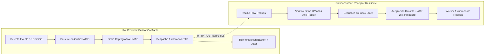
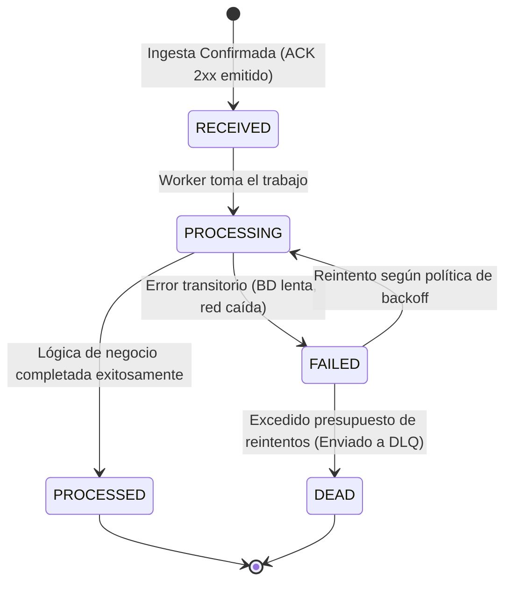

# SKL-WEBHOOK-ARCH-001: Senior Webhook Architecture & Integration Engineering

```text
====================================================================================================
ESPECIFICACIÓN TÉCNICA DE HABILIDAD: SKL-WEBHOOK-ARCH-001
Senior Webhook Architecture & Integration Engineering — Versión 2.0.0
Estándares: ISO/IEC 26514 | IEEE 29148 | OWASP API Security | HMAC-SHA256 | HTTP RFC 9110 | EDA | Agile DoD
Baseline Técnico: NestJS 11, TypeScript 5.8+, Prisma ORM 6.5+, PostgreSQL 16+, BullMQ / Redis, Next.js 15
Roles Cubiertos: Webhook Provider (Emisor) | Webhook Consumer (Receptor)
Responsable: Facundo Nicolás González
Dominio: Backend / Integraciones / Event-Driven Architecture / APIs / Distributed Systems
====================================================================================================
```

---

## 1. Ficha de Identificación del Skill

| Atributo | Definición Técnica |
| :--- | :--- |
| **Código de Habilidad** | `SKL-WEBHOOK-ARCH-001` |
| **Nombre de Habilidad** | Senior Webhook Architecture & Integration Engineering |
| **Versión** | `2.0.0` |
| **Nivel** | Senior / Production Engineering |
| **Habilidad Principal** | Diseño, implementación, seguridad y operación de sistemas de Webhooks de alta confiabilidad |
| **Objetivo de Dominio** | Construir mecanismos confiables de notificación asíncrona entre sistemas distribuidos independientes |
| **Arquitecturas Cubiertas** | Webhook Provider, Webhook Consumer, Queue-Based Delivery, Transactional Outbox, Inbox Pattern |
| **Garantía Asumida** | **At-Least-Once Delivery** (Entrega al menos una vez; cero suposiciones de Exactly-Once en red) |
| **Seguridad** | Firma Criptográfica (HMAC-SHA256 sobre Raw Body) + Anti-Replay + Mitigación SSRF + Secret Rotation |
| **Persistencia** | Transactional Outbox + Delivery Ledger + Inbox Deduplication Store |
| **Resiliencia** | Asynchronous Retries + Exponential Backoff con Full Jitter + Circuit Breaker + Dead Letter Queue (DLQ) |
| **Observabilidad** | Structured Logs (Pino) + Métricas RED/Queue + Distributed Tracing (W3C Trace Context) + Delivery History |
| **Complejidad** | Alta |
| **Prioridad Rectora** | **Integridad → Seguridad → Durabilidad → Idempotencia → Observabilidad → Latencia** |

---

## 2. Descripción y Filosofía de Diseño

Un webhook es un mecanismo arquitectónico:

$$\mathbf{Event\text{-}Driven} + \mathbf{Push\text{-}Based} + \mathbf{HTTP\text{-}Based}$$

mediante el cual un sistema de origen comunica a un sistema de destino que ha ocurrido un evento relevante dentro de su dominio de negocio.

```text
Stripe / GitHub / Tu SaaS
           │
           │ Evento de Dominio (payment_intent.succeeded / testimonial.approved)
           ▼
HTTP POST /api/v1/webhooks
           │
           ▼
Sistema Receptor (Consumer)
```

En la ingeniería de producción senior, un webhook **NUNCA** debe entenderse como un simple *"hacer un `fetch` POST con JSON"*. Un webhook debe concebirse formalmente como:

$$\mathbf{Distributed\ Message\ Delivery\ over\ an\ Unreliable\ Transport\ (HTTP)}$$

---

### 2.1. Principio Rector

> [!IMPORTANT]
> **El envío de un webhook debe asumirse por definición como no confiable, repetible, potencialmente fuera de orden y sujeto a fallos parciales de red y de infraestructura.**

Todo sistema de webhooks de nivel de producción **MUST** diseñarse desde el primer día contemplando:
- Entregas duplicadas legítimas y maliciosas.
- Reintentos continuos tras caídas temporales del receptor.
- Timeouts de conexión, lectura y socket.
- Errores y latencias de red transatlánticas.
- Indisponibilidad total o degradación (*downtime*) del consumidor.
- Entregas desordenadas temporalmente en el transporte HTTP.
- Evolución y versionado de contratos de eventos (esquemas).
- Rotación de secretos criptográficos sin interrumpir el servicio.
- Caídas del proceso durante la ejecución de lógica de negocio.

---

### 2.2. Dos Roles Rigurosamente Desacoplados

La habilidad establece una separación explícita de responsabilidades entre ambos extremos del canal:



---

## 3. Semántica de Entrega: At-Least-Once Delivery

El protocolo de transporte HTTP no ofrece garantías transaccionales bi-direccionales de extremo a extremo. Por ende, la arquitectura asume de forma inmutable:

$$\mathbf{Sem\acute{a}ntica\ de\ Transporte} = \mathbf{At\text{-}Least\text{-}Once\ Delivery}$$

Un evento puede ser entregado una, dos o múltiples veces debido a:
1. Caídas de red justo después de que el Consumer procesó el evento pero antes de que el Provider recibiera el `200 OK`.
2. Timeouts en proxies intermedios o balanceadores de carga.
3. Reintentos manuales disparados desde paneles de soporte o auditoría.

### 3.1. Consecuencia Arquitectónica Obligatoria
El Consumer **MUST** estar diseñado para tolerar la recepción idéntica de:
```text
Event A (Entrega 1)  ──► Procesa y aplica efecto
Event A (Entrega 2)  ──► Reconoce duplicado, retorna 2xx, NO duplica efecto
Event A (Entrega 3)  ──► Reconoce duplicado, retorna 2xx, NO duplica efecto
```
sin producir efectos colaterales desastrosos (como cobrar tres veces al usuario o emitir tres correos de confirmación idénticos).

---

## 4. Exactly-Once es una Propiedad de Negocio, No de Transporte

> [!CAUTION]
> Intentar lograr "Exactly-Once" a nivel del transporte HTTP es una falacia de la computación distribuida (Problema de los Dos Generales).

La entrega puede repetirse múltiples veces por la red, pero el **efecto de negocio debe ocurrir exactamente una vez**:

$$\text{Delivery (Transporte HTTP)} \ne \text{Business Effect (Estado en Base de Datos)}$$

La garantía de *Exactly-Once* se alcanza exclusivamente en la capa de persistencia del Consumer mediante:
- **Idempotencia de transporte**: Deduplicación por clave única de evento (`provider`, `event_id`).
- **Restricciones atómicas de base de datos**: Transacciones ACID con bloqueos o mutaciones condicionales (`status != 'APPROVED'`).

---

## 5. Ordenamiento No Garantizado (*Ordering Semantics*)

Los paquetes HTTP viajan por rutas de red dinámicas y los workers de reintento procesan eventos de forma concurrente. En consecuencia, **el orden de entrega de eventos NUNCA está garantizado**:

```text
LÍNEA TEMPORAL DE OCURRENCIA EN PROVIDER:
t1: subscription.created (evt_1)
t2: subscription.updated (evt_2)
t3: subscription.cancelled (evt_3)

ORDEN REAL RECIBIDO POR CONSUMER:
1. evt_3 llega primero (Cancelación)
2. evt_1 llega segundo (Creación)
3. evt_2 llega tercero (Actualización)
```

Stripe y GitHub documentan expresamente que no garantizan el orden cronológico de las entregas HTTP y recomiendan reconciliar el estado consultando sus APIs cuando el orden sea un factor crítico.

---

### 5.1. Regla de Procesamiento Independiente
El Consumer **SHOULD** estructurar su lógica de negocio para que cada evento sea procesable de forma independiente y aislada siempre que el dominio lo permita.

---

### 5.2. Reconciliación cuando el Orden Importa
Cuando la secuencia temporal sea crítica (ej. saldos de cuenta o máquinas de estado estrictas), el evento **MUST** incluir metadatos de secuenciamiento:

```json
{
  "event_id": "evt_01J83K9",
  "aggregate_id": "sub_94821",
  "aggregate_version": 17,
  "occurred_at": "2026-09-18T04:12:00.000Z"
}
```

El Consumer debe rechazar o encolar temporalmente cualquier evento cuya versión sea inferior a la versión ya persistida en base de datos (`current_version >= incoming_version`).

---

## 6. Diseño del Event Envelope Estándar

Un Provider profesional **MUST** envolver los datos de dominio dentro de un sobre (*Event Envelope*) estandarizado, predecible y fuertemente tipado:

```json
{
  "id": "evt_01HZX89K2P4M9V",
  "type": "testimonial.approved",
  "schema_version": "1.0.0",
  "occurred_at": "2026-09-18T04:15:30.450Z",
  "tenant_id": "org_acme_corp_88",
  "data": {
    "testimonial_id": "test_948217",
    "author_name": "Martín Gómez",
    "author_role": "CTO",
    "company": "Acme Corp",
    "rating": 5,
    "content": "La plataforma escaló nuestra captura de social proof un 300%.",
    "approved_at": "2026-09-18T04:15:29.000Z"
  },
  "correlation_id": "corr_c8a9f3b1-7821-4a8b-9e4f",
  "trace_id": "00-4bf92f3577b34da6a3ce929d0e0e4736-00f067aa0ba902b7-01"
}
```

### 6.1. Campos Obligatorios del Envelope
- `id`: Identificador único y determinístico del evento (prefijo semántico + ULID o UUIDv7).
- `type`: Cadena semántica del tipo de evento en formato `resource.action`.
- `schema_version`: Versión semántica del payload (`1.0.0`).
- `occurred_at`: Timestamp ISO-8601 en UTC del momento exacto en que ocurrió el evento en el origen.
- `data`: Objeto JSON conteniendo la entidad de negocio inmutable.

---

## 7. Identificador Único del Evento (`Event ID`)

Cada evento generado por el Provider **MUST** poseer un identificador globalmente único (ej. `evt_01JXYZ...` o UUIDv7):
- **Invariante Crítica**: El `id` debe permanecer **estrictamente idéntico** a través de todos los reintentos de entrega de ese mismo evento lógico.
- No generar un nuevo `event_id` cada vez que el worker reintenta el envío HTTP. El reintento es una nueva *entrega* (*Delivery Attempt*), no un nuevo *evento*.

---

## 8. Nombrado Semántico de Tipos de Eventos (`Event Type`)

Los eventos deben bautizarse siguiendo la convención estandarizada en minúsculas:

$$\mathbf{resource.action}\quad \text{o}\quad \mathbf{resource.sub_resource.action}$$

```text
BUENO:  testimonial.created
BUENO:  testimonial.approved
BUENO:  subscription.payment_failed
BUENO:  campaign.quota_reached

MALO:   event1
MALO:   dataChanged
MALO:   processWebhook
MALO:   NEW_TESTIMONIAL
```

---

## 9. Versionado de Esquemas de Eventos (*Event Versioning*)

Los contratos de datos de los webhooks evolucionan a lo largo del tiempo. Un Provider maduro gestiona la compatibilidad con rigor:

### 9.1. Cambios Compatibles (Aditivos)
Incorporar nuevos campos al payload es una mutación compatible hacia atrás:
```json
{
  "testimonial_id": "123",
  "content": "Excelente",
  "locale": "es-AR"  // Campo nuevo: los consumidores existentes deben ignorarlo limpiamente
}
```

### 9.2. Cambios Incompatibles (*Breaking Changes*)
Renombrar campos existentes, modificar tipos de datos o alterar la semántica de negocio constituye un cambio incompatible:
- **Obligatorio**: Incrementar la versión mayor (`v1` $\to$ `v2`).
- Mantener la emisión dual concurrente durante un período de migración acordado.
- Permitir que los clientes configuren la versión de esquema soportada por su endpoint en el dashboard de integraciones.

---

## 10. Tolerancia a Campos Desconocidos (*Unknown Fields*)

Los Consumers de webhooks **MUST** aplicar el principio de robustez (Ley de Postel):
- Diseñar parsers (ej. Zod o DTOs con `class-validator`) que no rechacen el payload ante la presencia de claves adicionales que no formen parte de su esquema local (`stripUnknown: true` o `passthrough()`).
- Un consumidor nunca debe colapsar con error 400 simplemente porque el proveedor agregó un campo de metadatos nuevo.

---

## 11. Tratamiento de Eventos Desconocidos o No Suscritos

Si un Consumer recibe una solicitud que cumple con:
1. Firma criptográfica válida.
2. Formato de JSON válido.
3. Pero el `type` del evento no es de su interés o es desconocido.

**Acción Obligatoria del Consumer**:
- Registrar un log informativo (*Audit Log*).
- **Retornar inmediatamente un código `200 OK` o `202 Accepted`**.
- **Prohibido retornar errores 400 o 500** ante eventos no implementados; esto provocaría que el Provider entre en bucles de reintentos inútiles saturando la red.

---

## 12. Arquitectura del Webhook Provider (Emisión Confiable)

El Provider debe estructurarse mediante un pipeline asíncrono y desacoplado:

```text
Operación de Negocio (Ej. Aprobar Testimonio en NestJS)
      │
      ▼
Transacción de Base de Datos (PostgreSQL ACID)
      ├── 1. Actualiza entidad de dominio (Testimonial status = APPROVED)
      └── 2. Inserta registro de evento (OutboxEvent) en la misma transacción
      │
      ▼ [COMMIT]
Desacople Inmediato (Retorna 200 al Administrador)
      │
      ▼
Outbox Poller / CDC Worker (Prisma / Debezium / BullMQ)
      │
      ▼
Delivery Dispatcher (Identifica endpoints suscritos de clientes)
      │
      ▼
Delivery Queue (Redis / BullMQ)
      │
      ▼
Webhook Delivery Worker (Firma HMAC + HTTP POST con Timeout)
      │
      ▼
Endpoint Externo del Cliente (HTTP 2xx exitoso o Reintento con Jitter)
```

---

## 13. Prohibición Terminante de Enviar Webhooks desde el Request Principal

> [!CAUTION]
> **Queda terminantemente prohibido disparar peticiones HTTP de webhooks dentro del ciclo síncrono del controlador principal de la API.**

```typescript
// ❌ ANTIPATRÓN CATASTRÓFICO: Envío síncrono acoplado
@Post(':id/approve')
async approveTestimonial(@Param('id') id: string) {
  const testimonial = await this.db.testimonial.update({ where: { id }, data: { status: 'APPROVED' } });
  
  // Si el webhook del cliente demora 8 segundos o cae en timeout, 
  // el usuario del panel espera 8 segundos bloqueado y el request falla.
  await this.httpService.post('https://customer-crm.com/webhook', testimonial);
  
  return { success: true };
}
```
Este antipatrón acopla el uptime, latencia y disponibilidad de servidores externos desconocidos a la experiencia directa de los usuarios del SaaS.

---

## 14. El Patrón Transactional Outbox

### El Problema de la Doble Escritura (*Dual-Write Problem*)
Si el servidor actualiza la base de datos y luego emite el evento a una cola en dos operaciones separadas:
- Si el proceso colapsa tras el commit en la base de datos pero antes de enviar a la cola: **el testimonio se aprobó pero el webhook nunca se envió**.
- Si el evento se envía a la cola pero el commit de la base de datos falla por conflicto: **se despacha un webhook con datos que no existen en el sistema**.

### 14.1. La Solución Atómica con Prisma y PostgreSQL
Tanto la mutación de negocio como el evento de salida se persisten **dentro del mismo bloque transaccional ACID**:

```typescript
// apps/api/src/modules/testimonials/testimonials.service.ts
import { Injectable } from '@nestjs/common';
import { PrismaService } from '@/common/prisma/prisma.service';
import { ulid } from 'ulid';

@Injectable()
export class TestimonialsService {
  constructor(private readonly prisma: PrismaService) {}

  async approveTestimonial(id: string, tenantId: string) {
    return this.prisma.$transaction(async (tx) => {
      // 1. Mutación de estado de dominio
      const testimonial = await tx.testimonial.update({
        where: { id, tenantId },
        data: { status: 'APPROVED', approvedAt: new Date() },
      });

      // 2. Persistencia atómica en la tabla Outbox
      const eventId = `evt_${ulid()}`;
      await tx.outboxEvent.create({
        data: {
          id: eventId,
          tenantId,
          type: 'testimonial.approved',
          schemaVersion: '1.0.0',
          payload: {
            testimonialId: testimonial.id,
            authorName: testimonial.authorName,
            company: testimonial.company,
            rating: testimonial.rating,
            content: testimonial.content,
            approvedAt: testimonial.approvedAt,
          },
          status: 'PENDING',
        },
      });

      return testimonial;
    });
  }
}
```

---

## 15. Durabilidad del Evento antes del Despacho

Una vez completada la transacción de negocio, el evento existe de forma durable e inmutable en almacenamiento persistente (disco/PostgreSQL).
- **Prohibición**: No confiar la entrega de eventos críticos a primitivas volátiles en memoria como `EventEmitter`, `process.nextTick()`, `setImmediate()` o arrays en RAM. Un reinicio del contenedor o un pod crash de Kubernetes provocaría la pérdida irrecuperable del evento.

---

## 16. Modelo de Datos del Registro de Entregas (*Delivery Record*)

Un Provider profesional debe registrar el historial detallado de cada intento de envío:

```prisma
// apps/api/prisma/schema.prisma
model WebhookEndpoint {
  id               String            @id @default(uuid())
  tenantId         String
  url              String
  secret           String            // Secreto HMAC cifrado
  subscribedEvents String[]          // ej. ["testimonial.approved", "testimonial.created"]
  status           EndpointStatus    @default(ACTIVE) // ACTIVE, SUSPENDED, DISABLED
  consecutiveFails Int               @default(0)
  deliveries       WebhookDelivery[]
  createdAt        DateTime          @default(now())
  updatedAt        DateTime          @updatedAt
}

model OutboxEvent {
  id            String            @id // evt_ULID
  tenantId      String
  type          String
  schemaVersion String            @default("1.0.0")
  payload       Json
  status        OutboxStatus      @default(PENDING) // PENDING, PROCESSING, COMPLETED, FAILED
  deliveries    WebhookDelivery[]
  createdAt     DateTime          @default(now())
}

model WebhookDelivery {
  id             String          @id @default(uuid()) // del_ULID
  eventId        String
  endpointId     String
  attemptCount   Int             @default(1)
  status         DeliveryStatus  // PENDING, SUCCESS, RETRYING, FAILED, DEAD
  statusCode     Int?
  responseBody   String?         // Truncado a 1KB máx, sin secretos
  executionTimeMs Int?
  nextAttemptAt  DateTime?
  lastError      String?
  event          OutboxEvent     @relation(fields: [eventId], references: [id], onDelete: Cascade)
  endpoint       WebhookEndpoint @relation(fields: [endpointId], references: [id], onDelete: Cascade)
  createdAt      DateTime        @default(now())
  deliveredAt    DateTime?

  @@index([endpointId, status])
  @@index([nextAttemptAt])
}
```

---

## 17. Relación Cardinal: Evento vs Entrega (1:N)

> [!IMPORTANT]
> **Un Evento y una Entrega son entidades conceptuales distintas.**

Un único evento de dominio (`testimonial.approved`) puede despacharse simultáneamente hacia múltiples destinos configurados por el cliente (ej. integración con Zapier + endpoint interno del CRM + webhook a Next.js).
- **Evento**: Hecho inmutable que ocurrió en el sistema (1).
- **Entregas**: Múltiples intentos de transferencia HTTP independientes hacia cada endpoint registrado (N).

---

## 18. Arquitectura del Webhook Consumer (Recepción Resiliente)

El pipeline de recepción debe blindar la API del Consumer ante cualquier ataque, ráfaga o desbordamiento:

```text
HTTP POST Request entrante
      │
      ▼
1. Body Size Check (Límite estricto: ej. 256 KB)
      │
      ▼
2. Preservación del Raw Request Body (Buffer de bytes original)
      │
      ▼
3. Verificación de Firma Criptográfica (HMAC-SHA256 con timingSafeEqual)
      │
      ▼
4. Validación Anti-Replay (Timestamp firmado dentro de tolerancia de 5 min)
      │
      ▼
5. Envelope Validation (Zod schema: id, type, data válidos)
      │
      ▼
6. Deduplicación e Ingesta Durable en Tabla Inbox (UNIQUE provider + event_id)
      │
      ├── SÍ ya fue procesado: Retorna 200 OK inmediatamente (Idempotente)
      └── NO existía: Inserta en Inbox y encola en worker de fondo
      │
      ▼
7. Retorno de ACK HTTP Inmediato (HTTP 200 OK o 202 Accepted)
      │
      ▼ [ASÍNCRONO EN WORKER]
8. Procesamiento de la Lógica de Negocio (Idempotencia de Dominio)
```

---

## 19. La Semántica Correcta del ACK HTTP

> [!CAUTION]
> **Nunca respondas `200 OK` antes de haber persistido o encolado el evento de forma durable.**

### 19.1. El Antipatrón de ACK Prematuro
```text
Recepción HTTP ──► Responde 200 OK al Provider ──► Intenta encolar en Redis ──► ¡REDIS COLAPSA!
```
**Resultado Catastrófico**: El evento se perdió para siempre. Como el Provider recibió un `200 OK`, asume que la entrega fue exitosa y **nunca volverá a reintentar**.

### 19.2. El Flujo Correcto de Aceptación Durable
1. Validar autenticidad de la petición (Firma HMAC + Anti-replay).
2. Persistir el evento en la tabla `WebhookInbox` de PostgreSQL o encolarlo con persistencia confirmada en disco.
3. Si la persistencia falló: emitir un código **`500 Internal Server Error`** para indicarle al Provider que debe reintentar más tarde.
4. Si la persistencia tuvo éxito: emitir **`200 OK` o `202 Accepted`**.

---

## 20. Confirmación Rápida (*Fast Acknowledgement*)

Una vez garantizada la aceptación durable en el Inbox, el Consumer **MUST responder de inmediato**.
- Los proveedores imponen timeouts estrictos (Stripe espera respuesta en 5 a 10 segundos; GitHub en 10 segundos).
- Toda tarea pesada (generación de PDFs, sincronización con bases de datos secundarias, envío de emails) debe ejecutarse de forma desacoplada en un worker de fondo.

---

## 21. Desmitificación del Requisito "ACK < 100ms Obligatorio"

El objetivo de responder en menos de 100-200 ms debe tratarse como un **SLO de rendimiento interno del equipo**, no como una ley física del protocolo HTTP. Si la base de datos experimenta latencia momentánea y el ACK toma 450 ms, el protocolo no se rompe siempre que se permanezca holgadamente dentro del timeout contractual del Provider.

---

## 22. Seguridad Criptográfica de la Firma (HMAC-SHA256)

Todo webhook sensible transmitido a través de redes públicas debe autenticarse mediante un código de autenticación de mensajes basado en hash (**HMAC-SHA256**).
- Permite al Consumer verificar matemáticamente dos propiedades:
  1. **Autenticidad**: El mensaje fue emitido exclusivamente por quien posee la clave secreta compartida.
  2. **Integridad**: El payload no fue alterado ni manipulado en tránsito por intermediarios (*Man-in-the-Middle*).

---

## 23. La Regla de Oro: Firma Calculada sobre los Bytes Crudos (*Raw Request Body*)

> [!CAUTION]
> **La firma HMAC MUST calcularse sobre el `Buffer` de bytes crudos original exactamente como viajó por el cable.**

```text
❌ ERROR GRAVE DE IMPLEMENTACIÓN:
Request HTTP
    ↓
express.json() parsea a objeto JS: const body = req.body;
    ↓
JSON.stringify(body) para volver a string
    ↓
HMAC(JSON.stringify(body)) !== Header Signature  (¡FALLA DE VERIFICACIÓN!)
```

`JSON.stringify` no garantiza el orden determinístico de las propiedades, puede alterar espacios en blanco (`\n`, `\t`), formateo numérico o codificación UTF-8. La verificación fallará de forma intermitente e impredecible.

---

## 24. Implementación de Firma y Verificación en Node.js / NestJS

```typescript
// apps/api/src/common/utils/webhook-crypto.util.ts
import crypto from 'node:crypto';

export interface SignatureVerificationResult {
  isValid: boolean;
  reason?: 'TIMESTAMP_EXPIRED' | 'SIGNATURE_MISMATCH' | 'INVALID_FORMAT';
}

export function signWebhookPayload(
  payloadRaw: Buffer | string,
  timestamp: number,
  secret: string,
): string {
  const payloadBuffer = Buffer.isBuffer(payloadRaw) ? payloadRaw : Buffer.from(payloadRaw, 'utf-8');
  const signatureData = Buffer.concat([
    Buffer.from(`${timestamp}.`, 'utf-8'),
    payloadBuffer,
  ]);

  return crypto
    .createHmac('sha256', secret)
    .update(signatureData)
    .digest('hex');
}

export function verifyWebhookSignature(
  payloadRaw: Buffer,
  signatureHeader: string,
  secret: string,
  toleranceSeconds: number = 300, // 5 minutos
): SignatureVerificationResult {
  // Espera formato estándar: "t=1726632762,v1=9a8b7c6d..."
  const elements = signatureHeader.split(',');
  const timestampPart = elements.find((el) => el.startsWith('t='))?.split('=')[1];
  const signaturePart = elements.find((el) => el.startsWith('v1='))?.split('=')[1];

  if (!timestampPart || !signaturePart) {
    return { isValid: false, reason: 'INVALID_FORMAT' };
  }

  const timestamp = parseInt(timestampPart, 10);
  if (isNaN(timestamp)) {
    return { isValid: false, reason: 'INVALID_FORMAT' };
  }

  // Validación Anti-Replay basada en Timestamp
  const now = Math.floor(Date.now() / 1000);
  if (Math.abs(now - timestamp) > toleranceSeconds) {
    return { isValid: false, reason: 'TIMESTAMP_EXPIRED' };
  }

  // Cálculo de firma esperada
  const expectedSignatureHex = signWebhookPayload(payloadRaw, timestamp, secret);
  const expectedBuffer = Buffer.from(expectedSignatureHex, 'hex');
  const receivedBuffer = Buffer.from(signaturePart, 'hex');

  // Validación de longitud antes de constant-time compare
  if (expectedBuffer.length !== receivedBuffer.length) {
    return { isValid: false, reason: 'SIGNATURE_MISMATCH' };
  }

  // Comparación en tiempo constante estricta
  const isMatch = crypto.timingSafeEqual(expectedBuffer, receivedBuffer);
  return {
    isValid: isMatch,
    reason: isMatch ? undefined : 'SIGNATURE_MISMATCH',
  };
}
```

---

## 25. Comparación en Tiempo Constante Obligatoria (`crypto.timingSafeEqual`)

> [!CAUTION]
> **Queda estrictamente prohibido comparar firmas criptográficas utilizando operadores convencionales (`===` o `==`).**

```typescript
// ❌ VULNERABILIDAD CRÍTICA DE ATAQUE DE TIEMPO (Timing Attack)
if (expectedSignature === receivedSignature) { ... }
```
El operador `===` compara caracter por caracter y retorna `false` en el primer byte que no coincida. Un atacante puede medir las variaciones microscópicas de latencia de red para deducir la firma byte por byte. Se **MUST** utilizar `crypto.timingSafeEqual(bufA, bufB)`.

---

## 26. Defensas Anti-Replay

Un atacante que intercepte un webhook legítimo en la red podría reenviarlo repetidamente al Consumer para ejecutar duplicaciones de saldo o spam, aun desconociendo la clave secreta.

**Las dos barreras obligatorias anti-replay son:**
1. **Timestamp firmado con ventana de tolerancia acotada** (rechazo si el mensaje tiene más de 5 minutos).
2. **Unicidad del identificador de evento / entrega en la base de datos** (rechazo si el `event_id` ya fue aceptado).

---

## 27. Material de Firma que Incluye el Timestamp

Para que la validación anti-replay sea inmutable, el timestamp **MUST formar parte de los datos firmados**:

$$\text{Firma} = \text{HMAC-SHA256}(\text{Secret}, \text{Timestamp} + \text{"."} + \text{RawBody})$$

Si un atacante modifica el valor de `t=` en la cabecera HTTP, la firma calculada ya no coincidirá y la petición será abortada.

---

## 28. Ventana de Tolerancia Temporal (*Replay Window*)

Adoptar una ventana estándar de **300 segundos (5 minutos)**. Si la diferencia absoluta entre el reloj local del servidor receptor y el timestamp firmado supera los 5 minutos, la petición se rechaza con código `400 Bad Request`.

---

## 29. Sincronización de Reloj del Sistema (NTP)

Los servidores que producen y consumen webhooks **MUST** tener sincronizados sus relojes de hardware mediante el protocolo **NTP (Network Time Protocol)** o servicios cloud equivalentes (AWS Chrony, Google NTP) para evitar que desviaciones de reloj (*clock drift*) causen falsos positivos en la verificación anti-replay.

---

## 30. Identificadores de Entrega (*Delivery IDs*)

Proveedores como GitHub inyectan cabeceras específicas como `X-GitHub-Delivery: 72d3162e-cc78-11e3-81ab-4c9367dc0958`.
- Una retransmisión por reintento mantiene el mismo identificador de entrega.
- El Consumer puede almacenar este ID como segunda clave de deduplicación contra replays accidentales.

---

## 31. Idempotencia de Transporte: La Tabla Inbox

El Consumer debe mantener una tabla de recepción de eventos en PostgreSQL:

```prisma
// apps/api/prisma/schema.prisma
model WebhookInbox {
  id                  String       @id @default(uuid())
  provider            String       // "stripe", "github", "internal"
  eventId             String       // evt_... proveniente del provider
  eventType           String       // "payment_intent.succeeded"
  payload             Json
  status              InboxStatus  @default(RECEIVED) // RECEIVED, PROCESSING, PROCESSED, FAILED, DEAD
  attemptCount        Int          @default(0)
  lastError           String?
  receivedAt          DateTime     @default(now())
  processedAt         DateTime?

  @@unique([provider, eventId], name: "provider_eventId_unique")
  @@index([status, receivedAt])
}
```

---

## 32. Prevención de Condiciones de Carrera: Prohibido Deduplicar con `SELECT + INSERT`

> [!CAUTION]
> **No intentes deduplicar eventos consultando primero con un `SELECT` para luego hacer un `INSERT`.**

```text
Worker A: SELECT * FROM WebhookInbox WHERE eventId = 'evt_1' -> No encontrado
Worker B: SELECT * FROM WebhookInbox WHERE eventId = 'evt_1' -> No encontrado
Worker A: INSERT INTO WebhookInbox -> OK
Worker B: INSERT INTO WebhookInbox -> ¡Colisión de concurrencia o doble ejecución!
```

**Solución Senior Obligatoria**:
Utilizar inserciones atómicas a nivel de motor relacional respaldadas por el índice `@unique([provider, eventId])`:
```sql
INSERT INTO "WebhookInbox" ("id", "provider", "eventId", "payload", "status")
VALUES ($1, $2, $3, $4, 'RECEIVED')
ON CONFLICT ("provider", "eventId") DO NOTHING;
```
Si el registro ya existía, la consulta retorna 0 filas afectadas de forma atómica y segura, permitiendo abortar la ejecución secundaria sin condiciones de carrera.

---

## 33. Máquina de Estados del Evento en el Inbox



---

## 34. Idempotencia de Negocio

La deduplicación técnica por `event_id` no es suficiente en todos los escenarios. Existen situaciones donde dos eventos con IDs diferentes representan la misma mutación de negocio en el mundo real.

### Ejemplo Crítico en el Proyecto
El moderador aprueba un testimonio desde el dashboard y simultáneamente otro proceso automatizado ejecuta una regla de aprobación:
```sql
-- ✅ MUTACIÓN DE NEGOCIO IDEMPOTENTE:
UPDATE "Testimonial"
SET "status" = 'APPROVED', "approvedAt" = NOW()
WHERE "id" = 'test_123'
  AND "status" != 'APPROVED';
```
Si la fila ya tenía `status = 'APPROVED'`, la consulta no produce ningún efecto secundario ni dispara eventos redundantes.

---

## 35. Semántica Rigurosa de Códigos de Estado HTTP en Webhooks

| Código HTTP | Significado para el Provider | Acción del Provider |
| :--- | :--- | :--- |
| **`200 OK / 202 Accepted`** | Entrega aceptada de forma durable. | **Éxito**. No reintentar más. |
| **`400 Bad Request`** | Formato de JSON corrupto o firma HMAC inválida. | **Falla Terminal**. No reintentar. |
| **`401 / 403 Forbidden`** | Secreto incorrecto o endpoint no autorizado. | **Falla de Configuración**. No reintentar. |
| **`404 Not Found / 410 Gone`**| El endpoint receptor ya no existe. | **Falla Definitiva**. Suspender endpoint. |
| **`408 / 429 Too Many Req`** | Receptor saturado temporalmente. | **Reintentar** aplicando Exponential Backoff. |
| **`500 / 502 / 503 / 504`** | Falla transitoria del servidor receptor. | **Reintentar** según el cronograma de reintentos. |

---

## 36. Política de Reintentos del Provider: Exponential Backoff con Full Jitter

Cuando el endpoint de un cliente falla con un error transitorio (5xx, timeout, 429), el Provider **MUST** reintentar la entrega de forma progresiva.

### 36.1. La Ecuación con Full Jitter
Para evitar que miles de webhooks fallidos se reintenten en el mismo segundo exacto (*Thundering Herd* o avalancha de tráfico):

$$T_{\text{sleep}} = \text{random}(0, \min(T_{\text{max}}, T_{\text{base}} \times 2^{\text{attempt}}))$$

```typescript
// apps/api/src/common/utils/backoff.util.ts
export function calculateBackoffWithJitter(
  attempt: number,
  baseMs: number = 5000,      // 5 segundos
  maxMs: number = 86400000,    // 24 horas
): number {
  const exponentialLimit = Math.min(maxMs, baseMs * Math.pow(2, attempt));
  // Full jitter: distribución uniforme entre 0 y el límite exponencial
  return Math.floor(Math.random() * exponentialLimit);
}
```

```text
Cronograma Típico de Reintentos de un Evento:
Intento 1: Inmediato
Intento 2: entre 0 y 10 segundos
Intento 3: entre 0 y 20 segundos
Intento 4: entre 0 y 40 segundos
Intento 5: entre 0 y 80 segundos
...
Intento 12: hasta 24 horas después
```

---

## 37. Presupuesto de Reintentos (*Retry Budget*)

El Provider no debe reintentar entregas de forma infinita. Se debe definir un límite contractual estricto:
- **Límite de Intentos**: Máximo 10 a 15 intentos de entrega.
- **Límite Temporal**: Máximo 24 a 72 horas de antigüedad del evento.
- Agotado el presupuesto, la entrega se traslada a estado `DEAD` (Dead Letter Queue) y se notifica al usuario.

---

## 38. Gobernanza de Timeouts en el Provider

Toda petición saliente de webhook ejecutada por el Provider **MUST** gobernar dos timeouts independientes:
1. **Connect Timeout**: Máximo **3 segundos** para establecer el socket TCP y el handshake TLS.
2. **Response Timeout**: Máximo **5 a 10 segundos** para recibir las cabeceras de respuesta HTTP del cliente.

> [!CAUTION]
> **Nunca permitas que una conexión HTTP saliente espere indefinidamente.** Los sockets colgados agotan el pool de conexiones del servidor y saturan la memoria del worker.

---

## 39. Colas, Amortiguación de Ráfagas (*Backpressure*) y Concurrencia

El despacho de webhooks debe orquestarse sobre sistemas de colas profesionales (BullMQ respaldado por Redis o tablas transaccionales de PostgreSQL):
- **Absorción de Ráfagas**: Un pico de 50.000 reseñas aprobadas simultáneamente durante una campaña publicitaria debe absorberse en la cola sin degradar el throughput de la base de datos principal.
- **Gobierno de Concurrencia**: Limitar la cantidad de workers concurrentes para no agotar el pool de conexiones de Prisma ni saturar la infraestructura de salida de red.

---

## 40. Dead Letter Queue (DLQ) Operable

Los eventos que no pudieron entregarse tras agotar el presupuesto de reintentos se trasladan a una **Dead Letter Queue (DLQ)**.

Una DLQ de producción **MUST** ser operable por humanos y sistemas:
1. **Inspección**: Ver el payload completo, cabeceras enviadas, errores HTTP recibidos y marcas de tiempo.
2. **Diagnóstico**: Identificar si la causa fue una falla de configuración de red, DNS o caída del cliente.
3. **Reprocesamiento Manual (*Manual Redelivery*)**: Botón en dashboard o comando CLI para reenviar el evento a demanda una vez que el cliente corrigió su servidor.
4. **Descarte Intencional**: Capacidad de purgar mensajes irrecuperables con auditoría registrada.

---

## 41. Mensajes Venenosos (*Poison Messages*)

Un **Poison Message** es un webhook cuyo contenido provoca invariablemente una excepción fatal o crash en el proceso que lo ejecuta (ej. desbordamiento de memoria por un JSON malformado).
- **Regla de Aislamiento**: El worker debe atrapar la excepción no controlada (`try/catch` perimetral), incrementar el contador de intentos y, tras alcanzar el límite, mover el mensaje a la DLQ **sin bloquear el procesamiento del resto de los mensajes saludables de la cola**.

---

## 42. Seguridad en Registro de Endpoints: Mitigación Estricta de SSRF

> [!CAUTION]
> Cuando una plataforma SaaS permite a los usuarios registrar una URL para recibir webhooks, **dicha URL es una entrada de datos 100% no confiable y representa un vector de ataque de Server-Side Request Forgery (SSRF).**

Un atacante podría registrar URLs como:
- `http://169.254.169.254/latest/meta-data/` (Robo de credenciales IAM de AWS).
- `http://127.0.0.1:5432/` (Sondeo de puertos locales de PostgreSQL).
- `http://10.0.0.5:8080/admin/delete-all` (Ataque a microservicios internos en la VPC).

### 42.1. Reglas de Validación de URLs Salientes
1. **HTTPS Obligatorio**: Rechazar cualquier URL que no utilice el esquema seguro `https://` en entornos de producción.
2. **Resolución DNS y Validación de IP (Anti-DNS Rebinding)**: Resolver la IP antes de ejecutar la petición y comprobar que **NO pertenezca a ningún rango privado o reservado**:
   - `127.0.0.0/8` (Loopback).
   - `10.0.0.0/8`, `172.16.0.0/12`, `192.168.0.0/16` (Redes privadas RFC 1918).
   - `169.254.0.0/16` (Link-local y metadata de proveedores Cloud).
   - `::1` y rangos IPv6 locales.
3. **Prohibición de Redirecciones Automáticas**: Configurar el cliente HTTP para **no seguir redirecciones 301/302 automáticamente**. Un endpoint malicioso podría registrar una URL pública segura que responda con un redirect `302` hacia una IP interna de la VPC.

---

## 43. Suspensión Automática de Endpoints Rotos

Si el endpoint de un cliente falla de forma ininterrumpida durante **50 o 100 intentos consecutivos** (retornando persistentemente 404, 500 o connection refused durante días):
- El Provider debe suspender temporalmente el endpoint (`status = SUSPENDED`).
- Dejar de intentar envíos para no malgastar ancho de banda ni saturar la cola.
- Enviar una notificación por correo electrónico al administrador de la cuenta alertando de la suspensión con instrucciones para reactivarlo tras solucionar la falla.

---

## 44. Gestión y Rotación de Secretos Criptográficos

- Cada endpoint de cliente **MUST contar con su propio secreto criptográfico independiente** (`whsec_...` generado con 32 bytes de alta entropía `crypto.randomBytes(32).toString('hex')`).
- **Proscripción**: Nunca utilizar un único secreto global compartido para todos los clientes. Si un cliente expone su secreto en GitHub, no compromete al resto de las organizaciones.
- **Rotación Sin Downtime**: El Provider debe soportar un período de superposición (*Secret Grace Period*) donde el mensaje se firma con el secreto nuevo y el viejo, o el Consumer acepta temporalmente firmas validadas contra cualquiera de las dos claves activas.

---

## 45. Perfil de Integración: Stripe Consumer en NestJS

La integración con Stripe es el caso de uso canónico de webhook consumer de pagos en `@testimonial-cms/api`.

### 45.1. Preservación del Raw Body en NestJS
Para que la verificación de `Stripe-Signature` funcione, NestJS debe configurarse para retener el buffer crudo:

```typescript
// apps/api/src/main.ts
import { NestFactory } from '@nestjs/core';
import { AppModule } from './app.module';

async function bootstrap() {
  const app = await NestFactory.create(AppModule, {
    rawBody: true, // Habilita req.rawBody para verificación de webhooks
  });
  await app.listen(process.env.PORT ?? 3001);
}
bootstrap();
```

### 45.2. Controlador de Webhooks de Stripe en NestJS
```typescript
// apps/api/src/modules/billing/stripe-webhook.controller.ts
import { Controller, Post, Headers, Req, BadRequestException, HttpCode, HttpStatus } from '@nestjs/common';
import { Request } from 'express';
import Stripe from 'stripe';
import { StripeWebhookService } from './stripe-webhook.service';

@Controller('webhooks/stripe')
export class StripeWebhookController {
  private stripe: Stripe;

  constructor(private readonly webhookService: StripeWebhookService) {
    this.stripe = new Stripe(process.env.STRIPE_SECRET_KEY!, { apiVersion: '2024-12-18.acacia' });
  }

  @Post()
  @HttpCode(HttpStatus.OK)
  async handleStripeWebhook(
    @Headers('stripe-signature') signature: string,
    @Req() req: Request & { rawBody?: Buffer },
  ) {
    if (!signature || !req.rawBody) {
      throw new BadRequestException('Falta la firma o el raw body de Stripe');
    }

    let event: Stripe.Event;
    try {
      event = this.stripe.webhooks.constructEvent(
        req.rawBody,
        signature,
        process.env.STRIPE_WEBHOOK_SECRET!,
      );
    } catch (err: any) {
      throw new BadRequestException(`Falla de validación de firma: ${err.message}`);
    }

    // 1. Ingesta durable en Inbox (At-Least-Once + Deduplicación)
    await this.webhookService.ingestEvent(event);

    // 2. Retorno inmediato de ACK 200
    return { received: true };
  }
}
```

---

## 46. Perfil de Integración: GitHub Consumer
Al consumir webhooks de GitHub:
- Validar la cabecera `X-Hub-Signature-256` utilizando HMAC-SHA256 con el secreto configurado en el repositorio.
- Inspeccionar `X-GitHub-Event` para identificar el recurso (`push`, `pull_request`, `installation`).
- Utilizar `X-GitHub-Delivery` como identificador de deduplicación de transporte.

---

## 47. Reconciliación con la Fuente Canónica (*Canonical Source*)

> [!IMPORTANT]
> Un webhook es una **notificación de que algo ocurrió**, no necesariamente la única fuente de la verdad absoluta.

Si un Consumer recibe un evento de pago o cambio de suscripción desordenado o con datos incompletos:
```text
Recibe webhook (payment_intent.succeeded)
    ↓
Extrae identificador del recurso: event.data.object.id ("pi_123")
    ↓
Consulta a la API oficial de Stripe vía SDK: stripe.paymentIntents.retrieve("pi_123")
    ↓
Reconcilia el estado local con la verdad canónica del proveedor
```
Este patrón erradica vulnerabilidades derivadas de entregas desordenadas o payloads desactualizados.

---

## 48. El Frontend NUNCA es la Fuente de la Verdad

> [!CAUTION]
> **Bajo ninguna circunstancia actives una suscripción, apruebes un testimonio o acredites saldo basándote únicamente en que el navegador del usuario fue redirigido a `/checkout/success`.**

El usuario puede cerrar la pestaña, manipular el código JavaScript de cliente, perder la conexión o alterar los parámetros de la URL. La mutación definitiva del estado de negocio debe depender **exclusivamente del webhook verificado servidor-a-servidor**.

---

## 49. Registro Seguro de Payloads (*Payload Logging & Redaction*)

Almacenar los payloads de los webhooks es indispensable para debugging y auditorías, pero **debe cumplir con estándares de privacidad y seguridad**:
- **Redacción Obligatoria**: Jamás almacenar en texto plano números de tarjetas de crédito (PAN/CVV), tokens de autenticación, contraseñas o secretos de API.
- Aplicar funciones de máscara (`"card_number": "**** **** **** 4242"`).
- Establecer políticas de retención de datos en base de datos (purgar payloads históricos después de 30 o 90 días).

---

## 50. Reenvío Manual de Webhooks (*Manual Redelivery*)

Un sistema de webhooks de nivel de producción debe proveer tanto en dashboard como en CLI la capacidad de **reenviar cualquier evento histórico**:
- Permite a los clientes recuperar información tras caídas de sus propios servidores sin intervención del equipo de soporte.
- El evento reenviado debe conservar su `event_id` original para que el Consumer lo reconozca de forma idempotente.

---

## 51. Evento de Prueba (*Send Test Webhook*)

El Provider debe ofrecer a los desarrolladores un mecanismo para disparar un evento sintético de prueba (`type: "webhook.test"`):
- Permite verificar la conectividad de red, la apertura de puertos en firewalls y el correcto cálculo de la firma criptográfica antes de activar el tráfico de producción.

---

## 52. Observabilidad, Métricas y Rastreo Distribuido

Un sistema de webhooks en producción **MUST** instrumentar telemetría en tiempo real:

```text
┌────────────────────────────────┬────────────────────────────────────────────────────────┐
│ Métrica Operativa              │ Indicador de Salud del Sistema                         │
├────────────────────────────────┼────────────────────────────────────────────────────────┤
│ `webhook_delivery_attempts`    │ Volumen total de peticiones de salida disparadas       │
│ `webhook_delivery_success`     │ Rango de entregas aceptadas con 2xx por clientes       │
│ `webhook_delivery_failure`     │ Entregas que retornaron 4xx, 5xx o sufrieron timeout   │
│ `webhook_retry_rate`           │ Porcentaje de eventos que requirieron reintentos       │
│ `webhook_signature_failures`   │ Intentos de entrega con firma inválida (ataques/errores)│
│ `webhook_queue_depth`          │ Cantidad de eventos acumulados esperando ser enviados  │
│ `webhook_oldest_event_age_sec` │ Tiempo transcurrido desde el evento más viejo en cola   │
│ `webhook_dlq_size`             │ Cantidad de eventos que colapsaron definitivamente     │
└────────────────────────────────┴────────────────────────────────────────────────────────┘
```

---

### 52.1. La Métrica Crítica: Antigüedad del Mensaje Más Viejo (*Oldest Message Age*)

> [!WARNING]
> Una cola con 100 mensajes puede parecer saludable. Pero si el mensaje más antiguo de la cola lleva **4 horas esperando procesamiento**, el sistema sufre una degradación severa que exige alertas inmediatas de guardia (PagerDuty).

---

## 53. Correlación de Tracing Distribuido (OpenTelemetry / W3C Trace Context)

El Provider debe inyectar la cabecera estándar `traceparent` en la petición HTTP saliente:
```http
traceparent: 00-4bf92f3577b34da6a3ce929d0e0e4736-00f067aa0ba902b7-01
```
Permite a las plataformas de observabilidad reconstruir el ciclo de vida completo de una transacción a través de las fronteras de red de múltiples sistemas distribuidos.

---

## 54. Definición de Acuerdos de Nivel de Servicio (SLO)

Establecer SLOs realistas adaptados al dominio:
- **Consumer ACK**: El 99.9% de los webhooks entrantes reciben confirmación HTTP en $< 500$ ms.
- **Consumer Processing**: El 99% de los eventos aceptados son procesados por los workers en $< 60$ segundos.
- **Provider Delivery**: El 99.5% de los eventos de salida se entregan en su primer intento en $< 2$ segundos.
- **DLQ Alerting**: Alerta crítica inmediata si la DLQ acumula más de 10 eventos no resueltos.

---

## 55. Capacidad de Recuperación ante Avalanchas (*Bulk Replay Capacity*)

Tras recuperarse de un corte de servicio de 6 horas, el Consumer recibirá una avalancha concentrada de miles de webhooks acumulados por los proveedores.
- La infraestructura de workers debe dimensionarse con capacidad elástica para procesar el tráfico normal más el backlog pendiente, evitando colapsos recurrentes por saturación de CPU o conexiones de base de datos.

---

## 56. Matriz de Pruebas Obligatorias (Testing Checklist)

### A. Pruebas de Seguridad
- [ ] Firma HMAC correcta $\longrightarrow$ 200 OK.
- [ ] Firma HMAC con payload manipulado $\longrightarrow$ 400 Bad Request.
- [ ] Firma calculada con secreto incorrecto $\longrightarrow$ 400 / 401.
- [ ] Timestamp alterado o expirado ($> 5$ min) $\longrightarrow$ 400 Replay Detected.
- [ ] Body superior al límite permitido ($> 256$ KB) $\longrightarrow$ 413 Payload Too Large.
- [ ] Registro de URL privada o metadata en Provider $\longrightarrow$ 400 SSRF Blocked.

### B. Pruebas de Resiliencia y Concurrencia
- [ ] Envío del mismo evento 3 veces concurrentes $\longrightarrow$ un solo efecto de negocio ejecutado.
- [ ] Recepción de eventos desordenados temporalmente $\longrightarrow$ estado final consistente.
- [ ] Worker colapsa a mitad de procesamiento $\longrightarrow$ reintento sin duplicación ni corrupción.
- [ ] Base de datos inaccesible durante la ingesta $\longrightarrow$ Consumer retorna 500 (fuerza retry del provider).
- [ ] Endpoint de destino retorna 503 $\longrightarrow$ Provider reintenta con backoff y jitter.

---

## 57. Catálogo de 30 Antipatrones Técnicos

```text
⚠️ WEBHOOK-01: Ejecutar lógica de negocio pesada de forma síncrona antes de responder el ACK HTTP.
⚠️ WEBHOOK-02: Responder HTTP 200 OK antes de haber persistido o encolado el evento de forma durable.
⚠️ WEBHOOK-03: No verificar la firma criptográfica HMAC de la petición entrante.
⚠️ WEBHOOK-04: Verificar la firma sobre un body JSON re-serializado en lugar de los bytes originales (Raw Body).
⚠️ WEBHOOK-05: Comparar firmas criptográficas mediante operadores de igualdad estándar (===) en lugar de timingSafeEqual.
⚠️ WEBHOOK-06: Omitir la validación anti-replay dejando el endpoint vulnerable a ataques de retransmisión.
⚠️ WEBHOOK-07: Utilizar un único secreto global compartido para todos los clientes en el rol de Provider.
⚠️ WEBHOOK-08: Pasar secretos o tokens de firma dentro de la query string de la URL (?secret=123).
⚠️ WEBHOOK-09: No contar con un protocolo de rotación de secretos sin tiempo de inactividad (Grace Period).
⚠️ WEBHOOK-10: Asumir que el transporte HTTP garantiza entrega Exactly-Once.
⚠️ WEBHOOK-11: Deduplicar eventos en base de datos mediante un SELECT previo sin restricción UNIQUE atómica.
⚠️ WEBHOOK-12: Idempotencia basada exclusivamente en Event ID sin considerar idempotencia de negocio en la entidad.
⚠️ WEBHOOK-13: Asumir que los eventos siempre llegarán en orden cronológico estricto.
⚠️ WEBHOOK-14: Reintentar entregas fallidas de forma inmediata sin aplicar Exponential Backoff.
⚠️ WEBHOOK-15: Reintentar entregas sin aleatoriedad (Jitter), provocando avalanchas de tráfico sobre el receptor.
⚠️ WEBHOOK-16: Reintentar entregas fallidas de forma infinita sin un presupuesto máximo de tiempo o intentos.
⚠️ WEBHOOK-17: Despachar peticiones HTTP sin configurar timeouts estrictos de conexión y socket.
⚠️ WEBHOOK-18: Utilizar EventEmitter en memoria como mecanismo de persistencia para eventos críticos.
⚠️ WEBHOOK-19: Enviar peticiones salientes de webhooks dentro de la transacción del request principal del usuario.
⚠️ WEBHOOK-20: Ejecutar el commit de base de datos y la publicación de webhooks sin el patrón Transactional Outbox.
⚠️ WEBHOOK-21: Carecer de una Dead Letter Queue (DLQ) para aislar eventos fallidos de forma permanente.
⚠️ WEBHOOK-22: Seguir redirecciones HTTP (301/302) ciegamente en peticiones salientes del Provider.
⚠️ WEBHOOK-23: Permitir el registro de URLs arbitrarias en el Provider sin defensas estrictas contra ataques SSRF.
⚠️ WEBHOOK-24: Registrar payloads completos en logs de texto plano sin enmascarar datos personales o de tarjetas (PII/PCI).
⚠️ WEBHOOK-25: Monitorear exclusivamente el código de estado HTTP 2xx e ignorar los fallos en los workers asíncronos.
⚠️ WEBHOOK-26: No medir la antigüedad del mensaje más viejo de la cola (Oldest Message Age).
⚠️ WEBHOOK-27: No proveer mecanismos de reenvío manual (Manual Redelivery) para emergencias operacionales.
⚠️ WEBHOOK-28: Introducir cambios incompatibles en los contratos de eventos sin incrementar la versión del esquema.
⚠️ WEBHOOK-29: Suscribir el endpoint a todos los eventos posibles saturando la infraestructura con tráfico innecesario.
⚠️ WEBHOOK-30: Tratar al navegador o frontend como la fuente de la verdad para actualizar estados financieros o críticos.
```

---

## 58. Matriz de KPIs Técnicos y Tolerancia Cero

| Métrica de Calidad | Meta Contractual | Mecanismo de Control |
| :--- | :--- | :--- |
| **Eventos perdidos tras confirmación de ACK** | **0** | Inbox Persistence / DLQ Audits |
| **Efectos de negocio duplicados** | **0** | Idempotency Constraints |
| **Webhooks entrantes procesados sin verificar firma** | **0** | NestJS Guards Criptográficos |
| **Secretos de webhooks expuestos en repositorios/logs**| **0** | Secret Scanning / CI Linters |
| **Intentos de reintento sin Backoff o Jitter** | **0** | Worker Delivery Policy |
| **Eventos en DLQ sin alerta operativa activa** | **0** | PagerDuty / OpenTelemetry Alerts |
| **Payloads con PII/PCI almacenados sin redacción** | **0** | Security Log Audits |
| **Endpoints salientes vulnerables a SSRF conocidos** | **0** | SSRF Firewall / Egress Proxy |
| **Eventos sin contrato de versión formal** | **0** | Schema Registry / CI Contract Tests |

---

## 59. Metodología de Implementación en 7 Fases para Webhook Consumers

```text
Fase 1: Análisis del Contrato
- Identificar proveedor, tipos de eventos requeridos, cabeceras de firma, semántica de reintentos y tolerancia temporal.

Fase 2: Blindaje del Endpoint HTTP
- Configurar HTTPS estricto, límite de peso del body (256 KB) y middleware para retener el Buffer del Raw Body.

Fase 3: Verificación Criptográfica y Anti-Replay
- Implementar validación HMAC-SHA256 con crypto.timingSafeEqual y verificación de timestamp (máximo 5 minutos).

Fase 4: Ingesta Durable en Inbox (Transport Idempotency)
- Persistir el evento atómicamente en PostgreSQL con restricción UNIQUE(provider, event_id) antes de emitir el ACK.

Fase 5: Retorno de ACK Rápido
- Emitir HTTP 200 OK o 202 Accepted de inmediato tras la confirmación de persistencia durable.

Fase 6: Procesamiento Asíncrono e Idempotencia de Negocio
- Delegar la ejecución de negocio a un worker de fondo, aplicando mutaciones de estado condicionales e independientes del orden.

Fase 7: Observabilidad y Pruebas de Fallo
- Instrumentar logs estructurados con event_id, métricas de ingesta y simular entregas duplicadas y desordenadas.
```

---

## 60. Metodología de Implementación en 7 Fases para Webhook Providers

```text
Fase 1: Modelado de Eventos y Esquemas
- Definir el Event Envelope estándar, prefijo de identificadores (evt_ULID), tipos semánticos y versionado.

Fase 2: Persistencia con Transactional Outbox
- Persistir el evento atómicamente en PostgreSQL dentro de la misma transacción ACID de Prisma de la mutación de dominio.

Fase 3: Seguridad de Registro y Prevención de SSRF
- Validar URLs registradas bloqueando IPs privadas, rangos de loopback, metadata cloud y forzando HTTPS.

Fase 4: Despacho Asíncrono en Colas
- Desacoplar el envío mediante workers (BullMQ) con timeouts estrictos de conexión (3s) y respuesta (5s).

Fase 5: Políticas de Reintento y DLQ
- Implementar Exponential Backoff con Full Jitter, presupuesto máximo de reintentos y desvío a Dead Letter Queue.

Fase 6: Seguridad Criptográfica y Rotación de Secretos
- Generar un secreto criptográfico único por endpoint y firmar sobre timestamp + rawBody con HMAC-SHA256.

Fase 7: Herramientas para Desarrolladores (DX)
- Exponer historial de entregas (Delivery History), botón de reenvío manual (Redeliver) y envío de eventos de prueba.
```

---

## 61. Protocolo Senior: Checklist Previo a Integrar un Webhook (Consumer)

Antes de conectar un nuevo webhook entrante en la plataforma, responder:
1. ¿Quién es el emisor y cómo se valida criptográficamente la autenticidad de la petición?
2. ¿El middleware del framework preserva el `Buffer` del raw request body intacto?
3. ¿La firma incluye un timestamp para protegernos contra ataques de replay?
4. ¿Cuál es el identificador único del evento provisto por el emisor para deduplicación?
5. ¿Qué semántica de reintentos aplica el emisor en caso de que respondamos con error 500?
6. ¿La lógica de negocio puede tolerar la recepción de eventos fuera de orden cronológico?
7. ¿Se persiste el evento en la tabla `WebhookInbox` antes de responder el código HTTP 200?
8. ¿La mutación en base de datos es idempotente a nivel de estado de dominio?
9. ¿Toda la lógica de procesamiento pesado se ejecuta de forma asíncrona fuera del handler HTTP?
10. ¿Los datos sensibles y números de tarjeta quedan enmascarados antes de escribir en los logs?

---

## 62. Protocolo Senior: Checklist Previo a Exponer un Webhook (Provider)

Antes de habilitar la emisión de webhooks hacia sistemas de clientes, responder:
1. ¿Qué evento de dominio estamos comunicando y su esquema está versionado formalmente?
2. ¿El evento se persiste en PostgreSQL mediante el patrón **Transactional Outbox** junto con la mutación de negocio?
3. ¿El envío HTTP está completamente desacoplado del request principal del usuario?
4. ¿Las URLs de los clientes se validan contra un firewall SSRF impidiendo el acceso a IPs de la VPC o metadata cloud?
5. ¿Cada endpoint posee su propio secreto criptográfico de 32 bytes de alta entropía?
6. ¿La petición saliente incluye timeouts de socket estrictos de menos de 5 segundos?
7. ¿El cronograma de reintentos aplica Exponential Backoff con Full Jitter?
8. ¿Se desvían los eventos fallidos a una Dead Letter Queue operable tras agotar los intentos?
9. ¿El endpoint se suspende automáticamente si falla persistentemente durante cientos de intentos consecutivos?
10. ¿El cliente puede inspeccionar su historial de entregas y disparar reenvíos manuales desde su panel?

---

## 63. Cheat Sheet: Las 30 Reglas de Oro de Webhooks

1. Un webhook es mensajería distribuida asíncrona sobre HTTP no confiable.
2. Asumí siempre entrega al menos una vez (*At-Least-Once Delivery*).
3. Diseñá idempotencia de transporte e idempotencia de negocio desde el primer día.
4. Exactly-Once es una propiedad de estado en base de datos, no del transporte de red.
5. Jamás asumas que los eventos llegarán en orden cronológico.
6. Cada evento debe poseer un `id` único que no cambie entre reintentos.
7. Los contratos de eventos deben estar versionados explícitamente (`schema_version`).
8. Calculá la firma HMAC sobre los bytes crudos originales (*Raw Request Body*).
9. Compará firmas criptográficas utilizando exclusivamente `crypto.timingSafeEqual()`.
10. Protegete contra ataques de repetición (*Replay Attacks*) validando el timestamp firmado.
11. Utilizá siempre conexiones cifradas bajo HTTPS.
12. Generá un secreto criptográfico independiente para cada endpoint registrado.
13. Diseñá la rotación de secretos con períodos de gracia superpuestos sin caída de servicio.
14. Aceptá el evento de forma durable en base de datos antes de emitir el código 2xx.
15. Respondé con confirmación rápida (ACK) tan pronto como el evento esté persistido.
16. Procesá toda la lógica de negocio pesada en workers asíncronos fuera del ciclo HTTP.
17. Utilizá colas de mensajes (BullMQ/Redis) para amortiguar ráfagas de tráfico.
18. Los reintentos del emisor deben aplicar Exponential Backoff.
19. Los reintentos deben incorporar Full Jitter para prevenir avalanchas (*Thundering Herd*).
20. Los reintentos deben tener un presupuesto máximo acotado (tiempo e intentos).
21. Utilizá una Dead Letter Queue (DLQ) operable para aislar fallas permanentes.
22. Implementá el patrón Transactional Outbox para garantizar que ningún evento se pierda.
23. Protegé los despachos de webhooks contra ataques de SSRF bloqueando IPs privadas y de metadata.
24. No sigas redirecciones HTTP 301/302 de forma automática en peticiones salientes.
25. Suscribí el endpoint únicamente a los tipos de eventos estrictamente requeridos.
26. Registrá identificadores en los logs estructurados, jamás secretos de firma ni tokens.
27. Monitoreá el éxito de la entrega HTTP de forma separada del éxito del procesamiento en workers.
28. Proporcioná interfaces de reenvío manual (*Manual Redelivery*) para incidentes operativos.
29. Probá de forma automatizada entregas duplicadas, firmas inválidas y eventos desordenados.
30. El navegador o frontend nunca debe considerarse la fuente de la verdad para conciliar estados críticos.

---

## 64. La Regla Rectora de Arquitectura

```text
====================================================================================================
DOMAIN EVENT
   ↓
TRANSACTIONAL OUTBOX (ACID Persistence)
   ↓
ASYNC QUEUE & WORKER
   ↓
HMAC-SHA256 SIGNATURE (Raw Body + Timestamp)
   ↓
SSRF-PROTECTED HTTP DISPATCH (TLS + Strict Timeout)
   ↓
CONSUMER CONSTANT-TIME VERIFICATION (timingSafeEqual)
   ↓
ANTI-REPLAY VALIDATION (Timestamp Tolerance Window)
   ↓
DURABLE INBOX ACCEPTANCE (Unique Provider + Event ID)
   ↓
FAST ACKNOWLEDGEMENT (HTTP 200 / 202)
   ↓
IDEMPOTENT BUSINESS PROCESSING (Worker State Reconciliation)
   ↓
DISTRIBUTED OBSERVABILITY (Tracing + DLQ Alerting)
====================================================================================================
```

---

## 65. Resultado Esperado

Todo sistema de webhooks concebido, desarrollado, integrado o auditado bajo el estándar **SKL-WEBHOOK-ARCH-001** exhibirá de forma demostrable las siguientes propiedades de ingeniería:

- **Criptográficamente Seguro**: Protegido contra falsificación de origen, manipulación de datos en tránsito y ataques de tiempo mediante HMAC-SHA256 y `timingSafeEqual`.
- **Inmune a Replays**: Blindado contra ataques de repetición mediante verificación de timestamps firmados y unicidad de identificadores.
- **Idempotente de Extremo a Extremo**: Diseñado para tolerar entregas múltiples idénticas sin duplicar efectos de negocio en base de datos.
- **Durable por Definición**: Respaldado por el patrón Transactional Outbox en el emisor y el patrón Inbox en el receptor.
- **Resiliente ante Fallos de Red**: Reintentos inteligentes gobernados por Exponential Backoff y Full Jitter sin provocar estampidas de tráfico.
- **Blindado contra SSRF**: Validación perimetral estricta de URLs de destino bloqueando el acceso a redes internas y metadatos cloud.
- **Operacionalmente Diagnosticable**: Dead Letter Queues auditables, historial de entregas detallado y capacidades de reenvío manual.
- **Totalmente Observable**: Telemetría completa con métricas RED, monitoreo de la antigüedad de la cola y correlación de trazas distribuidas OpenTelemetry.

El fin primordial de la habilidad consiste en **garantizar que cualquier notificación crítica de negocio pueda atravesar fallos de red, duplicaciones masivas, indisponibilidad temporal de servidores, reinicios imprevistos y picos extremos de tráfico sin perderse jamás, sin duplicar transacciones y sin comprometer la seguridad ni la integridad del ecosistema**.
