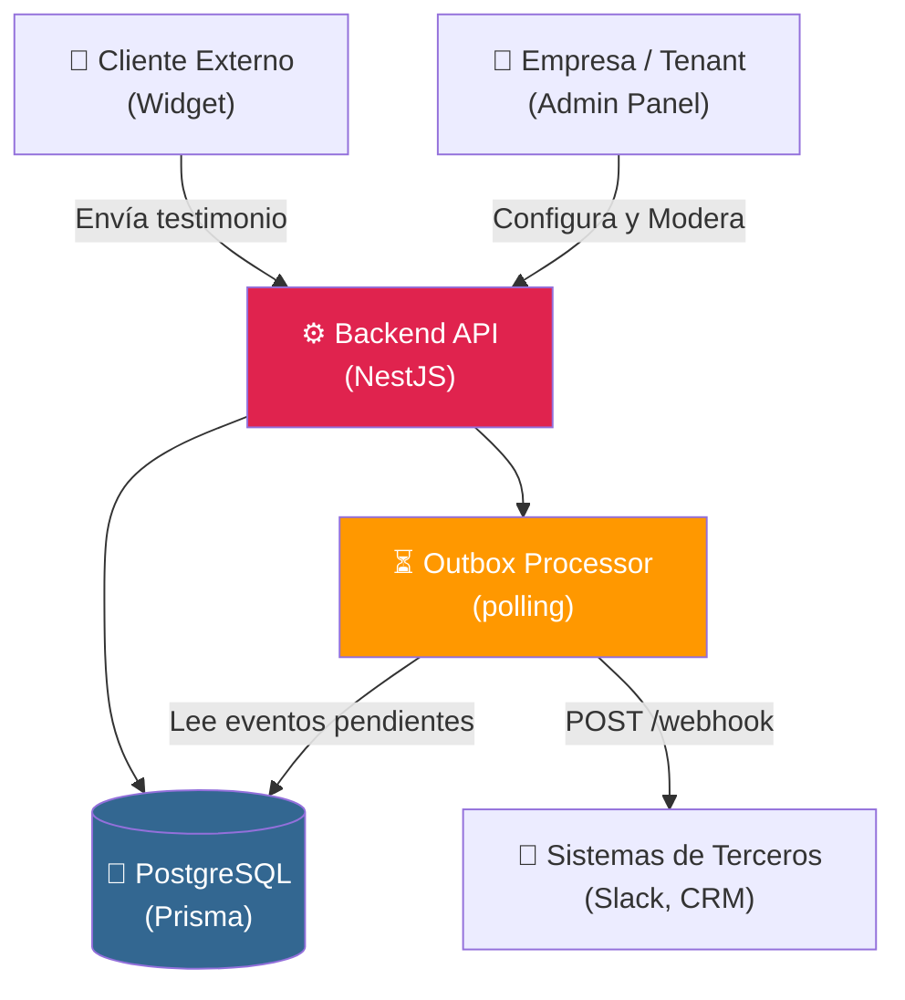

# Testimonial CMS - Social Proof Management Platform

**Proyecto educativo**: Plataforma SaaS multi-tenant para recolectar, moderar, analizar y distribuir testimonios y reseñas de clientes de forma centralizada.

[](https://nodejs.org)
[](https://nestjs.com)
[](https://nextjs.org)
[](https://postgresql.org)
[](https://prisma.io)

## 📚 Documentación

### Contexto para Agentes de IA (SKL-PRO-001)

| Archivo | Audiencia | Propósito |
|---------|-----------|----------|
| [AGENTS.md](AGENTS.md) | 🤖 IA + 👤 Devs | Onboarding canónico: stack, fronteras, reglas operativas |
| [llm.txt](llm.txt) | 🤖 IA | Contexto hiper-denso optimizado para LLMs (bajo consumo de tokens) |
| [docs/plan/](docs/plan/) | 🤖 IA + 👤 Devs | Planes de orquestación HITL activos |
| [docs/modules/](docs/modules/) | 🤖 IA + 👤 Devs | Especificaciones técnicas por módulo |

### Documentación Técnica

| Documento | Audiencia | Descripción |
|-----------|-----------|-------------|
| [docs/](docs/) | 👤 Todos | Directorio principal de toda la documentación |
| [docs/technical/01_architecture.md](docs/technical/01_architecture.md) | 🏗️ Arquitectos | Guía completa de arquitectura y dependencias |
| [docs/adr/](docs/adr/) | 🏗️ Arquitectos | Decisiones arquitectónicas (NestJS, Outbox, Multi-tenant) |
| [docs/domain/diccionario_de_dato.md](docs/domain/diccionario_de_dato.md) | 💾 Data | Estructura de base de datos, relaciones y Diagrama ERD |
| [docs/domain/business_rules.md](docs/domain/business_rules.md) | 📋 Todos | Reglas de negocio e invariantes del dominio |

## 📋 Descripción

### Stack Tecnológico

| Categoría | Tecnología | Versión | Propósito |
|-----------|-----------|---------|-----------|
| **Backend Framework**| NestJS | 11.x | API REST modular por capas |
| **Frontend/Admin** | Next.js + React | 15.x / 18.x | Panel de control e interfaces |
| **Database** | PostgreSQL | 18 | Persistencia relacional y outbox |
| **ORM** | Prisma | 6.5+ | Acceso a datos y migraciones |
| **Outbox** | Polling en la API | cada 3 s | Entrega de webhooks desde PostgreSQL |
| **Redis** | Disponible en Compose | 7 | Reservado para uso futuro |
| **Runtime** | Node.js | 24.21.0 | Entorno de ejecución de servidor |
| **Deployment** | Docker + Compose | - | Containerización |

Testimonial CMS es una plataforma que resuelve el problema de la gestión dispersa de la prueba social. Este proyecto implementa un CMS que:

- ✅ **Centraliza** testimonios escritos y en video en un solo panel de control
- ✅ Soporta arquitectura **Multi-tenant** (Row-Level) aislando los datos de cada cliente
- ✅ Facilita la **distribución ágil** mediante widgets insertables en sitios externos
- ✅ Proporciona integraciones vía **Webhooks** resilientes usando el Patrón Outbox
- ✅ **Modera testimonios** con flujos de aprobación y estados internos
- ✅ Separa controladores, reglas de aplicación y repositorios en módulos de NestJS
- ✅ Expone una **API pública** documentada para desarrolladores
- ✅ Rastrea **Analíticas de visualización** y clicks en los widgets

## 🏗️ Arquitectura


```mermaid
graph TB
    Customer["👤 Cliente Externo<br>(Widget)"] -->|Envía testimonio| API["⚙️ Backend API<br>(NestJS)"]
    Tenant["🏢 Empresa / Tenant<br>(Admin Panel)"] -->|Configura y Modera| API
    
    API --> DB[("💾 PostgreSQL<br>(Prisma)")]
    API --> Worker["⏳ Outbox Processor<br>(polling)"]
    
    Worker -->|Lee eventos pendientes| DB
    Worker -->|POST /webhook| Webhook["🔗 Sistemas de Terceros<br>(Slack, CRM)"]

    style API fill:#E0234E,color:#fff
    style DB fill:#336791,color:#fff
    style Worker fill:#FF9800,color:#fff
```

> 📐 Diagramas detallados y guía de arquitectura en [docs/technical/01_architecture.md](docs/technical/01_architecture.md)

## 🚀 Quick Start

### 1. Requisitos previos

- Node.js 24.21.0
- npm 11.19.0
- Docker & Docker Compose

### 2. Instalación

```bash
# Clonar repositorio
git clone https://github.com/No-Country-simulation/S03-26-Equipo-10-Web-App-Development.git
cd S03-26-Equipo-10-Web-App-Development

# Usar la versión de npm definida por el proyecto
npm install --global npm@11.19.0

# Instalar dependencias del monorepo
npm ci

# Configurar variables de entorno
cp .env.example .env
cp apps/api/.env.example apps/api/.env
cp apps/web/.env.example apps/web/.env.local
```

Definí un `JWT_SECRET` de al menos 32 caracteres en el `.env` raíz para Docker Compose o en `apps/api/.env` para la API local. `NEXT_PUBLIC_API_URL` debe contener una URL HTTP(S) válida antes de iniciar o compilar web; se incorpora al bundle durante el build.

### 3. Inicializar base de datos

```bash
# Levantar PostgreSQL vía Docker Compose
docker compose up -d postgres

# Generar cliente Prisma
npm run db:generate --workspace @testimonial-cms/api

# Aplicar migraciones al esquema de DB
npm run db:migrate --workspace @testimonial-cms/api

# Poblar con datos semilla (Seed)
npm run db:seed --workspace @testimonial-cms/api
```

### 4. Ejecutar aplicación localmente

```bash
# Levantar frontend y backend simultáneamente
npm run dev
```

Abre `http://localhost:3000` para el panel de administración y `http://localhost:4000/api/v1` para la API.

### 5. Desplegar con Docker

Si ya tenés un volumen de PostgreSQL 16, seguí primero la [guía de respaldo y restauración a PostgreSQL 18](docs/operations/04_postgresql_18_compose_upgrade.md). El Compose nuevo usa un volumen distinto y conserva el anterior.

```bash
# Levantar servicios locales
docker compose up -d

# Ver logs
docker compose logs -f
```

### 6. Validar instalación

Ve a `http://localhost:3000/admin/register` para crear tu primer Tenant y usuario administrador. Luego inicia sesión.

## 📁 Estructura del Proyecto

```
testimonial-cms/
├── apps/
│   ├── api/                 # NestJS: módulos, Prisma y migraciones
│   └── web/                 # Next.js: app/ compone rutas; features/ contiene pantallas
├── docs/                    # Documentación extensa
│   ├── adr/                 # Architectural Decision Records
│   ├── technical/           # Documentación técnica
│   ├── product/             # Documentación de producto
│   └── operations/          # Despliegue y observabilidad
├── scripts/                 # Utilidades
├── docker-compose.yml       # Infraestructura local
├── diccionario_de_dato.md   # Diccionario de base de datos
└── package.json             # Monorepo configs
```

## 🔧 Configuración de Integraciones

### Webhooks y Patrón Outbox

El sistema notifica a servicios externos de manera segura:
1. **Configuración**: El tenant registra una URL de webhook.
2. **Procesamiento**: La creación y publicación de testimonios insertan el evento en `outbox_events` dentro de la misma transacción.
3. **Despacho**: El procesador de la API consulta PostgreSQL periódicamente y entrega el evento por HTTP con reintentos.

## 🧪 Testing

### Tests unitarios y de integración

```bash
# Ejecutar todos los tests en los workspaces
npm run test

# Pruebas específicas
npm run test --workspace @testimonial-cms/api
npm run test --workspace @testimonial-cms/web
```

### Test funcional del flujo

Flujo esperado:
1. El formulario público envía POST `/api/v1/public/testimonials/:slug/submit` → se guarda en `pending`.
2. El admin aprueba (`approved`) y luego publica (`published`) el testimonio.
3. El procesador de outbox entrega el webhook configurado.

## 📊 Endpoints de la API

### `POST /api/v1/public/testimonials/:slug/submit`
Recibe un testimonio del formulario público del tenant. La ruta administrativa `POST /api/v1/testimonials` requiere autenticación y crea un borrador.

**Request:**
```json
{
  "content": "Excelente servicio, lo recomiendo al 100%.",
  "authorName": "Cliente de ejemplo",
  "rating": 5
}
```

**Response:**
```json
{
  "success": true,
  "data": {
    "status": "success",
    "id": "550e8400-e29b-41d4-a716-446655440002"
  }
}
```

### `GET /api/v1/health/live` y `GET /api/v1/health/ready`
Liveness comprueba el proceso; readiness verifica la conexión a PostgreSQL.

## 🛡️ Controles y Limitaciones

### Aislamiento lógico multi-tenant
- Las consultas de recursos del tenant filtran por el `tenantId` obtenido de credenciales verificadas.
- PostgreSQL Row-Level Security no está configurado; el aislamiento depende de las consultas y sus pruebas.

### Rate Limiting y Validación
- Límites de peticiones API con Guards de NestJS.
- Entradas validadas con DTOs basados en Zod.

## 🔐 Variables de Entorno

Completá los archivos locales a partir de `.env.example`, `apps/api/.env.example` y `apps/web/.env.example`. La [guía de setup](docs/collaboration/04_setup.md) describe qué archivo usa cada proceso y qué variables son obligatorias.

## 📈 Roadmap

- [x] Arquitectura base Multi-tenant (NestJS + Prisma)
- [x] Esquema relacional y diccionarios
- [x] Módulo Auth y Tenant provisioning
- [x] Patrón Outbox para Webhooks
- [x] Documentación 360 y modelado Mermaid
- [x] Panel de control Frontend (Next.js)
- [ ] Widgets embeddables en React/VanillaJS
- [ ] Analíticas avanzadas de impresiones

## 🤝 Contribuir

Pull requests son bienvenidos. Ejecutá `npm run typecheck`, `npm run lint` y `npm test` antes de abrir uno; consultá la [guía de contribución](docs/collaboration/01_contributing.md).

## 📄 Licencia

MIT License - Proyecto educativo de código abierto

## 👤 Autor

**Equipo 10**

---

⭐ Si este proyecto te fue útil, dale una star en GitHub!
