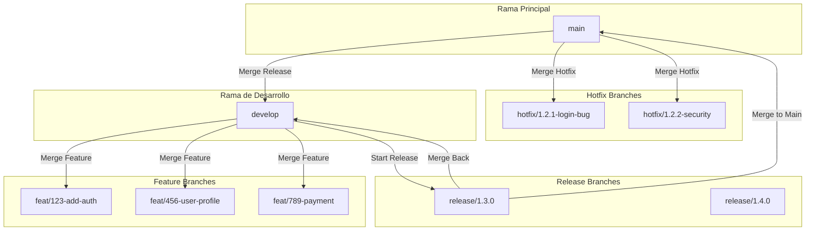
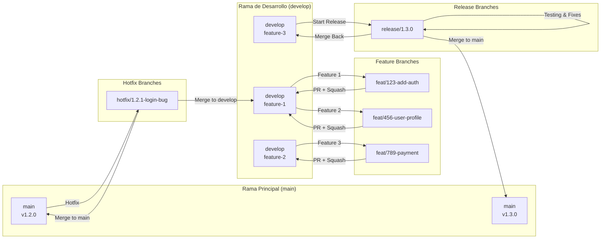
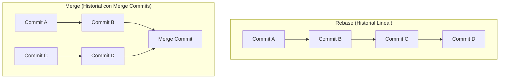
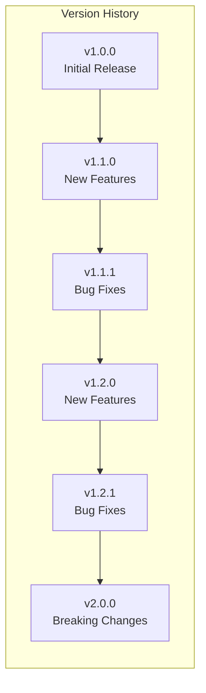
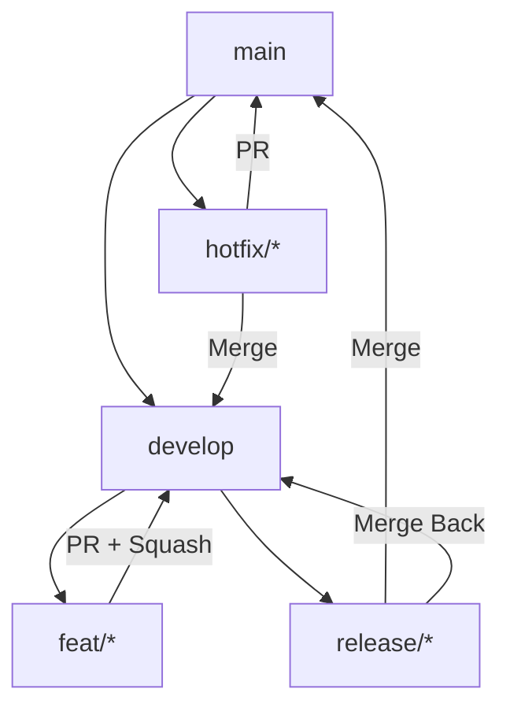

# Flujo de Trabajo de Git para Testimonial CMS

## Tabla de Contenidos

- [Visión General](#visión-general)
- [Convenciones de Nomenclatura](#convenciones-de-nomenclatura)
- [Estrategia de Branching](#estrategia-de-branching)
- [Proceso de Commits](#proceso-de-commits)
- [Pull Requests](#pull-requests)
- [Merge Strategies](#merge-strategies)
- [Rebase vs Merge](#rebase-vs-merge)
- [Resolución de Conflictos](#resolución-de-conflictos)
- [Tags y Versionado](#tags-y-versionado)
- [Git Hooks](#git-hooks)
- [Buenas Prácticas](#buenas-prácticas)
- [Ejemplos Completos](#ejemplos-completos)
- [Troubleshooting](#troubleshooting)
- [Checklist de Calidad](#checklist-de-calidad)

---

## Visión General

### Diagrama de Flujo General



### Estrategia Adoptada: Git Flow Modificado

Utilizamos una versión modificada de **Git Flow** que combina lo mejor de Git Flow y GitHub Flow:

| Característica | Git Flow | GitHub Flow | Nuestra Estrategia |
|----------------|----------|-------------|-------------------|
| **Rama Principal** | `main` | `main` | `main` (protegida) |
| **Rama de Desarrollo** | `develop` | No usa | `develop` (protegida) |
| **Feature Branches** | Sí | Sí | Sí (desde `develop`) |
| **Release Branches** | Sí | No usa | Sí (para releases mayores) |
| **Hotfix Branches** | Sí | Sí | Sí (desde `main`) |
| **Pull Requests** | Opcional | Obligatorio | Obligatorio |
| **Squash Merge** | No | Sí | Sí (para features) |
| **Rebase** | No | Sí | Sí (antes de PR) |

---

## Convenciones de Nomenclatura

### Nombres de Branches

Usamos el siguiente patrón para nombres de branches:

```
<tipo>/<número-issue>-<descripción-corta>

Ejemplos:
- feat/123-add-testimonial-rating
- fix/456-fix-embed-height
- docs/789-update-readme
- refactor/101-extract-scoring-strategy
- test/202-add-unit-tests
- chore/303-update-dependencies
- hotfix/1.2.1-critical-bug
- release/1.3.0
```

#### Tipos de Branches

| Tipo | Descripción | Base | Destino | Ejemplo |
|------|-------------|------|---------|---------|
| **feat** | Nueva funcionalidad | `develop` | `develop` | `feat/123-add-auth` |
| **fix** | Corrección de bug | `develop` | `develop` | `fix/456-login-error` |
| **docs** | Cambios en documentación | `develop` | `develop` | `docs/789-update-readme` |
| **refactor** | Refactorización de código | `develop` | `develop` | `refactor/101-extract-validation` |
| **test** | Agregar/modificar tests | `develop` | `develop` | `test/202-add-unit-tests` |
| **chore** | Tareas de mantenimiento | `develop` | `develop` | `chore/303-update-deps` |
| **hotfix** | Corrección crítica en producción | `main` | `main` y `develop` | `hotfix/1.2.1-login-bug` |
| **release** | Preparación de release | `develop` | `main` y `develop` | `release/1.3.0` |

### Nombres de Commits

Usamos el formato **Conventional Commits**:

```
<tipo>[ámbito opcional]: <descripción corta>

[descripción larga opcional]

[footer(s) opcional]
```

#### Tipos de Commit

| Tipo | Descripción | Ejemplo |
|------|-------------|---------|
| **feat** | Nueva funcionalidad | `feat(api): add endpoint to moderate testimonials` |
| **fix** | Corrección de bug | `fix(embed): resolve iframe height issue` |
| **docs** | Cambios en documentación | `docs(readme): update installation guide` |
| **style** | Formateo, cambios sin efecto en código | `style: format code with prettier` |
| **refactor** | Refactorización de código | `refactor: extract scoring logic to service` |
| **test** | Agregar o modificar tests | `test: add unit tests for scoring service` |
| **chore** | Tareas de mantenimiento | `chore: update dependencies` |
| **perf** | Mejoras de rendimiento | `perf: optimize database queries for testimonials` |
| **ci** | Cambios en CI/CD | `ci: add GitHub Actions workflow` |
| **build** | Cambios en sistema de build | `build: update webpack config` |

#### Ejemplos de Commit Messages

```bash
# ✅ BUENO: Commit message claro y conciso
git commit -m "feat(api): add JWT authentication for API keys"

# ✅ BUENO: Commit message con cuerpo descriptivo
git commit -m "fix(scoring): adjust recency factor calculation

- Use exponential decay with half-life of 30 days
- Add unit tests for recency factor
- Update scoring formula in documentation

Closes #123"

# ✅ BUENO: Commit message con breaking change
git commit -m "refactor(api)!: change response format for testimonials endpoint

BREAKING CHANGE: Response now returns paginated object instead of array
Migration: Update client code to handle new format"

# ❌ MALO: Commit message vago
git commit -m "fix stuff"

# ❌ MALO: Commit message demasiado largo
git commit -m "add the ability to create a new testimonial with a rating and also update the scoring algorithm to include recency and also fix the embed widget and update documentation"
```

---

## Estrategia de Branching

### Diagrama Detallado de Branching



### Roles de Cada Rama

#### `main` (Protegida)

- **Propósito**: Código estable y desplegado en producción
- **Protecciones**:
  - Requiere Pull Request aprobado
  - Requiere tests pasando
  - Requiere aprobación de al menos 2 reviewers
  - No permite push directo
  - Requiere linear history (no merge commits)
- **Merge desde**: Solo `release/*` y `hotfix/*` branches

#### `develop` (Protegida)

- **Propósito**: Integración de nuevas features antes de release
- **Protecciones**:
  - Requiere Pull Request aprobado
  - Requiere tests pasando
  - No permite push directo
- **Merge desde**: `feat/*`, `fix/*`, `hotfix/*` branches

#### `feat/*` (Feature Branches)

- **Propósito**: Desarrollo de nuevas funcionalidades
- **Base**: `develop`
- **Destino**: `develop` (via Pull Request)
- **Duración**: 1-2 semanas máximo
- **Convención**: `feat/<issue-number>-<short-description>`

#### `fix/*` (Bug Fix Branches)

- **Propósito**: Corrección de bugs no críticos
- **Base**: `develop`
- **Destino**: `develop` (via Pull Request)
- **Duración**: 1 semana máximo
- **Convención**: `fix/<issue-number>-<short-description>`

#### `hotfix/*` (Hotfix Branches)

- **Propósito**: Corrección de bugs críticos en producción
- **Base**: `main`
- **Destino**: `main` y `develop` (via Pull Request)
- **Duración**: 1-3 días máximo
- **Convención**: `hotfix/<version>-<short-description>`
- **Nota**: Debe ser mergeado tanto a `main` como a `develop`

#### `release/*` (Release Branches)

- **Propósito**: Preparación y testing de una nueva release
- **Base**: `develop`
- **Destino**: `main` (para release) y `develop` (para merge back)
- **Duración**: 1-2 semanas (solo para releases mayores)
- **Convención**: `release/<version>`
- **Contenido**: Solo bug fixes, no nuevas features

---

## Proceso de Commits

### Configuración Inicial

```bash
# Configurar usuario y email
git config --global user.name "Tu Nombre"
git config --global user.email "tu.email@ejemplo.com"

# Configurar editor preferido
git config --global core.editor "code --wait"  # VS Code
# o
git config --global core.editor "vim"  # Vim

# Configurar merge tool
git config --global merge.tool "vimdiff"

# Habilitar rebase por defecto en pull
git config --global pull.rebase true

# Configurar colores
git config --global color.ui auto
```

### Preparación de Commits

```bash
# Ver cambios no staged
git status

# Ver diferencias detalladas
git diff

# Stage todos los cambios
git add .

# Stage cambios específicos
git add src/services/testimonial.service.ts
git add src/components/TestimonialCard.tsx

# Stage partes específicas de un archivo
git add -p src/services/testimonial.service.ts

# Ver cambios staged
git diff --staged

# Deshacer stage de un archivo
git reset HEAD <archivo>

# Deshacer cambios en working directory
git checkout -- <archivo>
```

### Creación de Commits

```bash
# Commit con mensaje corto
git commit -m "feat(api): add endpoint to moderate testimonials"

# Commit con mensaje largo (abre editor)
git commit

# Commit con todas las modificaciones (sin stage explícito)
git commit -a -m "fix(embed): resolve iframe height issue"

# Amend último commit (agregar cambios olvidados)
git commit --amend

# Amend último commit sin cambiar mensaje
git commit --amend --no-edit
```

### Buenas Prácticas para Commits

1. **Atomic Commits**: Cada commit debe representar un cambio atómico y completo
2. **Mensajes Claros**: Usa el formato Conventional Commits
3. **No Commits WIP**: No hagas commits con código que no funciona
4. **Test Antes de Commit**: Asegúrate de que todos los tests pasan
5. **Lint Antes de Commit**: Usa ESLint/Prettier antes de hacer commit
6. **Rebase Antes de PR**: Mantén tu branch actualizado con la base

---

## Pull Requests

### Proceso de Creación de PR

```bash
# 1. Asegurarte de que tu branch está actualizado
git fetch upstream
git rebase upstream/develop  # o upstream/main para hotfixes

# 2. Resolver conflictos si los hay
git status
git add <archivos-resueltos>
git rebase --continue

# 3. Push tu branch (con --force-with-lease si hiciste rebase)
git push origin feat/123-add-auth --force-with-lease

# 4. Abrir Pull Request en GitHub
# Usa el template proporcionado
```

### Template de Pull Request

```markdown
## Descripción

[Describe brevemente los cambios realizados]

## Tipo de Cambio

- [ ] Bug fix (corrección de bug no-breaking)
- [ ] Nueva funcionalidad (cambio no-breaking)
- [ ] Breaking change (cambio que rompe compatibilidad)
- [ ] Documentación
- [ ] Otro (especificar):

## Checklist

- [ ] Mi código sigue las [guías de contribución](CONTRIBUTING.md)
- [ ] Mi código sigue los [estándares de código](CODING_STANDARDS.md)
- [ ] He escrito tests para mis cambios
- [ ] Todos los tests existentes pasan (`npm test`)
- [ ] He actualizado la documentación si es necesario
- [ ] Mi branch está actualizado con `develop`

## Capturas de Pantalla (si aplica)

[Incluye capturas de pantalla de los cambios visuales]

## Issues Relacionados

Closes #[número-del-issue]

## Notas Adicionales

[Cualquier información adicional relevante]
```

### Proceso de Revisión

1. **Asignación**: Un mantenedor revisará tu PR dentro de 2-3 días laborables
2. **Revisión de Código**: El mantenedor revisará tu código y dejará comentarios
3. **Solicitudes de Cambios**: Si se solicitan cambios, realiza las modificaciones y haz push
4. **Aprobación**: Una vez aprobado, el mantenedor mergeará tu PR
5. **Merge**: Usamos **squash merge** para mantener el historial limpio

### Buenas Prácticas para PRs

- **Mantén PRs pequeños**: Idealmente < 500 líneas de código
- **Un PR por funcionalidad**: No mezcles cambios no relacionados
- **Escribe títulos claros**: El título debe describir qué hace el PR
- **Responde a comentarios rápidamente**: Mantén la conversación activa
- **Sé receptivo al feedback**: Las revisiones son para mejorar la calidad
- **No te tomes el feedback personalmente**: Es sobre el código, no sobre ti

---

## Merge Strategies

### Squash Merge (Recomendado para Features)

```bash
# En GitHub: Usar botón "Squash and Merge"
# Esto combina todos los commits del PR en un solo commit limpio

# Resultado en main:
# feat(api): add endpoint to moderate testimonials
```

**Ventajas**:
- ✅ Historial limpio y legible
- ✅ Cada commit representa una funcionalidad completa
- ✅ Fácil de revertir cambios completos
- ✅ No hay commits de "WIP" o "fix typo" en el historial

**Desventajas**:
- ❌ Se pierde el historial detallado de desarrollo
- ❌ Más difícil para debugging histórico

### Rebase Merge (Para Mantenedores)

```bash
# Rebase manual antes de merge
git checkout main
git pull upstream main
git checkout feat/123-add-auth
git rebase main
git push origin feat/123-add-auth --force-with-lease

# Luego merge con --ff-only
git checkout main
git merge --ff-only feat/123-add-auth
git push upstream main
```

**Ventajas**:
- ✅ Historial lineal sin merge commits
- ✅ Fácil de seguir el flujo de desarrollo
- ✅ Bueno para proyectos con muchos contribuidores

**Desventajas**:
- ❌ Requiere más trabajo manual
- ❌ Puede ser confuso para contribuidores nuevos

### Merge Commit (Para Releases y Hotfixes)

```bash
# Merge commit explícito para releases
git checkout main
git merge --no-ff release/1.3.0 -m "Release v1.3.0"

# Resultado:
# *   Merge branch 'release/1.3.0'
# |\  
# | * feat: add new feature 1
# | * feat: add new feature 2
# |/  
# * Previous commit
```

**Ventajas**:
- ✅ Preserva el contexto de la release
- ✅ Fácil identificar qué cambios entraron en cada release
- ✅ Bueno para releases y hotfixes

**Desventajas**:
- ❌ Historial más complejo con merge commits
- ❌ Más difícil de seguir para cambios pequeños

---

## Rebase vs Merge

### Cuándo Usar Rebase

```bash
# ✅ USAR REBASE cuando:
# - Estás trabajando en una feature branch local
# - Quieres mantener un historial lineal
# - Vas a hacer un PR a una rama protegida

git checkout feat/123-add-auth
git rebase develop
```

**Ventajas**:
- ✅ Historial lineal y limpio
- ✅ Fácil de seguir el flujo de desarrollo
- ✅ Elimina merge commits innecesarios

**Desventajas**:
- ❌ Reescribe el historial (peligroso en branches compartidas)
- ❌ Puede causar conflictos complejos

### Cuándo Usar Merge

```bash
# ✅ USAR MERGE cuando:
# - Estás mergeando una rama protegida (main, develop)
# - Quieres preservar el contexto de desarrollo
# - Estás trabajando en una rama compartida

git checkout develop
git merge feat/123-add-auth
```

**Ventajas**:
- ✅ Preserva el contexto de desarrollo
- ✅ No reescribe el historial
- ✅ Seguro para branches compartidas

**Desventajas**:
- ❌ Historial con merge commits
- ❌ Más difícil de seguir para cambios pequeños

### Diagrama de Comparación



---

## Resolución de Conflictos

### Identificar Conflictos

```bash
# Ver archivos en conflicto
git status

# Ver diferencias en conflicto
git diff

# Ver diferencias staged
git diff --staged
```

### Resolver Conflictos Manualmente

```bash
# Abrir archivo en conflicto
# Buscar marcadores de conflicto:
# <<<<<<< HEAD
# Tu código
# =======
# Código de la otra rama
# >>>>>>> branch-name

# 1. Editar archivo para resolver conflicto
# 2. Eliminar marcadores de conflicto
# 3. Guardar archivo

# Marcar como resuelto
git add <archivo-resuelto>

# Continuar rebase/merge
git rebase --continue
# o
git merge --continue

# Si quieres abortar
git rebase --abort
# o
git merge --abort
```

### Herramientas de Resolución de Conflictos

```bash
# Usar herramienta de merge visual
git mergetool

# Configurar herramienta preferida
git config --global merge.tool vimdiff
git config --global merge.tool meld
git config --global merge.tool kdiff3

# Resolver todos los conflictos automáticamente (cuidado!)
git checkout --ours <archivo>  # Mantener tu versión
git checkout --theirs <archivo>  # Mantener versión de la otra rama
```

### Ejemplo Completo de Resolución de Conflictos

```bash
# 1. Intentar rebase
git rebase develop

# 2. Git muestra conflicto
# CONFLICT (content): Merge conflict in src/services/testimonial.service.ts
# Auto-merging src/services/testimonial.service.ts

# 3. Ver archivos en conflicto
git status
# Unmerged paths:
#   (use "git add <file>..." to mark resolution)
#     both modified:   src/services/testimonial.service.ts

# 4. Abrir archivo y resolver conflicto
# <<<<<<< HEAD
# const getTestimonials = async (tenantId) => {
#   return await prisma.testimonial.findMany({ where: { tenantId } });
# };
# =======
# const getTestimonials = async (tenantId: string): Promise<Testimonial[]> => {
#   return await prisma.testimonial.findMany({ where: { tenantId } });
# };
# >>>>>>> develop

# Después de resolver:
const getTestimonials = async (tenantId: string): Promise<Testimonial[]> => {
  return await prisma.testimonial.findMany({ where: { tenantId } });
};

# 5. Marcar como resuelto
git add src/services/testimonial.service.ts

# 6. Continuar rebase
git rebase --continue

# 7. Verificar que todo está bien
git log --oneline -5
git status
```

---

## Tags y Versionado

### Versionado Semántico (SemVer)

Usamos **Semantic Versioning 2.0.0**:

```
MAJOR.MINOR.PATCH

- MAJOR: Cambios que rompen compatibilidad (breaking changes)
- MINOR: Nuevas funcionalidades (backwards compatible)
- PATCH: Correcciones de bugs (backwards compatible)
```

### Creación de Tags

```bash
# Crear tag anotado (recomendado)
git tag -a v1.2.3 -m "Release v1.2.3 - Add password reset functionality"

# Firmar tag con GPG (opcional pero recomendado)
git tag -s v1.2.3 -m "Release v1.2.3"

# Push tag a remoto
git push origin v1.2.3

# Push todos los tags
git push origin --tags
```

### Estrategia de Tags

| Tipo de Release | Ejemplo | Descripción |
|-----------------|---------|-------------|
| **Major** | `v2.0.0` | Breaking changes, nueva API |
| **Minor** | `v1.3.0` | Nuevas funcionalidades, backwards compatible |
| **Patch** | `v1.2.1` | Correcciones de bugs, backwards compatible |
| **Pre-release** | `v1.3.0-beta.1` | Versión beta para testing |
| **Pre-release** | `v1.3.0-rc.1` | Release candidate |

### Diagrama de Versionado



---

## Git Hooks

### Instalación de Husky

```bash
# Instalar Husky
npm install husky --save-dev

# Inicializar Husky
npx husky install

# Agregar hook de pre-commit
npx husky add .husky/pre-commit "npm run lint && npm test"

# Agregar hook de pre-push
npx husky add .husky/pre-push "npm run test:coverage"
```

### Hooks Comunes

#### `.husky/pre-commit`

```bash
#!/bin/sh
. "$(dirname "$0")/_/husky.sh"

echo "🔍 Running pre-commit checks..."

# Linting
echo "📝 Running linter..."
npm run lint

if [ $? -ne 0 ]; then
  echo "❌ Linting failed. Please fix errors before committing."
  exit 1
fi

# Tests
echo "🧪 Running tests..."
npm test

if [ $? -ne 0 ]; then
  echo "❌ Tests failed. Please fix tests before committing."
  exit 1
fi

# Type checking
echo "🔍 Running type checking..."
npm run type-check

if [ $? -ne 0 ]; then
  echo "❌ Type checking failed. Please fix type errors."
  exit 1
fi

echo "✅ All pre-commit checks passed!"
```

#### `.husky/pre-push`

```bash
#!/bin/sh
. "$(dirname "$0")/_/husky.sh"

echo "🚀 Running pre-push checks..."

# Coverage
echo "📊 Running coverage tests..."
npm run test:coverage

if [ $? -ne 0 ]; then
  echo "❌ Coverage tests failed."
  exit 1
fi

# Build
echo "🏗️  Building project..."
npm run build

if [ $? -ne 0 ]; then
  echo "❌ Build failed."
  exit 1
fi

echo "✅ All pre-push checks passed!"
```

#### `.husky/commit-msg`

```bash
#!/bin/sh
. "$(dirname "$0")/_/husky.sh"

# Validar formato de commit message
npx commitlint --edit $1
```

### Configuración de Commitlint

```javascript
// commitlint.config.js
module.exports = {
  extends: ['@commitlint/config-conventional'],
  rules: {
    'type-enum': [
      2,
      'always',
      [
        'feat',
        'fix',
        'docs',
        'style',
        'refactor',
        'test',
        'chore',
        'perf',
        'ci',
        'build'
      ]
    ],
    'type-case': [2, 'always', 'lower-case'],
    'type-empty': [2, 'never'],
    'subject-empty': [2, 'never'],
    'subject-full-stop': [2, 'never', '.'],
    'header-max-length': [2, 'always', 72]
  }
};
```

---

## Buenas Prácticas

### Do's (Hacer)

- ✅ Usa nombres de branches descriptivos
- ✅ Escribe mensajes de commit claros y concisos
- ✅ Haz commits atómicos (un cambio por commit)
- ✅ Rebase tu branch antes de abrir PR
- ✅ Ejecuta tests y lint antes de hacer commit
- ✅ Usa Pull Requests para todos los cambios
- ✅ Responde rápidamente a feedback en PRs
- ✅ Mantén PRs pequeños y enfocados
- ✅ Usa squash merge para features
- ✅ Documenta cambios importantes en CHANGELOG

### Don'ts (No Hacer)

- ❌ No hagas commits con código que no funciona
- ❌ No uses nombres de branches vagos (`fix1`, `test2`)
- ❌ No hagas push directo a ramas protegidas
- ❌ No ignores los tests fallidos
- ❌ No mezcles cambios no relacionados en un mismo PR
- ❌ No uses merge commits para features
- ❌ No dejes PRs sin revisar por más de 3 días
- ❌ No ignores el feedback de code review
- ❌ No hagas rebase en branches compartidas
- ❌ No olvides actualizar tu fork regularmente

---

## Ejemplos Completos

### Ejemplo 1: Flujo Completo de Feature (Añadir scoring de testimonios)

```bash
# 1. Sincronizar con upstream
git fetch upstream
git checkout develop
git merge upstream/develop

# 2. Crear nueva feature branch
git checkout -b feat/123-add-scoring

# 3. Desarrollar funcionalidad
# ... escribe código, haz commits ...

# Primer commit: añadir servicio de scoring
git add src/services/scoring.service.ts
git add src/strategies/weighted-scoring.strategy.ts
git commit -m "feat(scoring): add weighted scoring strategy

- Implement WeightedScoringStrategy
- Add configurable weights for views, clicks, rating, recency
- Add unit tests for strategy"

# Segundo commit: integrar en API
git add src/controllers/testimonial.controller.ts
git commit -m "feat(api): add sort=top parameter to testimonials endpoint

- Add scoring to query logic
- Return testimonials ordered by score DESC"

# Tercer commit: tests
git add tests/unit/services/scoring.service.spec.ts
git add tests/integration/api/testimonials.api.spec.ts
git commit -m "test: add unit and integration tests for scoring"

# 4. Rebase con develop antes de PR
git fetch upstream
git rebase upstream/develop

# Resolver conflictos si los hay
git add <archivos-resueltos>
git rebase --continue

# 5. Push branch
git push origin feat/123-add-scoring

# 6. Abrir Pull Request en GitHub
# Usa template de PR

# 7. Esperar revisión y hacer cambios si se solicitan
git add <cambios>
git commit -m "fix: adjust recency factor based on review feedback"
git push origin feat/123-add-scoring

# 8. Una vez aprobado, el mantenedor hará squash merge
# Tu branch será eliminada automáticamente
```

### Ejemplo 2: Flujo de Hotfix (Corregir bug en embed)

```bash
# 1. Sincronizar con upstream
git fetch upstream
git checkout main
git merge upstream/main

# 2. Crear hotfix branch desde main
git checkout -b hotfix/1.2.1-embed-height

# 3. Corregir bug
git add public/embed.js
git add src/embed/embed.ts
git commit -m "fix(embed): correct iframe height calculation

- Add ResizeObserver to adapt to content height
- Remove fixed height from embed code
- Add tests for embed component

Closes #456"

# 4. Push hotfix branch
git push origin hotfix/1.2.1-embed-height

# 5. Abrir PR a main
# Esperar aprobación y merge

# 6. Después de merge a main, merge también a develop
git checkout develop
git merge hotfix/1.2.1-embed-height

# 7. Eliminar hotfix branch
git branch -d hotfix/1.2.1-embed-height
git push origin --delete hotfix/1.2.1-embed-height
```

### Ejemplo 3: Flujo de Release (v1.3.0)

```bash
# 1. Crear release branch desde develop
git checkout develop
git pull upstream develop
git checkout -b release/1.3.0

# 2. Actualizar versión en package.json
# "version": "1.3.0"

# 3. Actualizar CHANGELOG.md
# Agregar sección para v1.3.0

# 4. Commit cambios
git add package.json CHANGELOG.md
git commit -m "chore(release): prepare v1.3.0 release"

# 5. Push release branch
git push origin release/1.3.0

# 6. Abrir PR a main para release
# Esperar testing y aprobación

# 7. Merge a main (con merge commit)
git checkout main
git pull upstream main
git merge --no-ff release/1.3.0 -m "Release v1.3.0"

# 8. Crear tag
git tag -a v1.3.0 -m "Release v1.3.0 - Add scoring and embed improvements"
git push upstream main --tags

# 9. Merge back a develop
git checkout develop
git merge release/1.3.0

# 10. Eliminar release branch
git branch -d release/1.3.0
git push origin --delete release/1.3.0
```

---

## Troubleshooting

### Problema 1: "Your branch is behind 'origin/main'"

```bash
# Solución: Rebase tu branch con upstream
git fetch upstream
git rebase upstream/main

# Si hay conflictos, resolverlos y continuar
git add <archivos-resueltos>
git rebase --continue

# Push con --force-with-lease
git push origin tu-branch --force-with-lease
```

### Problema 2: "Merge conflict"

```bash
# Ver archivos en conflicto
git status

# Resolver conflictos manualmente
# Buscar <<<<<<<, =======, >>>>>>>

# Marcar como resuelto
git add <archivo-resuelto>

# Continuar
git rebase --continue
# o
git merge --continue
```

### Problema 3: "Detached HEAD state"

```bash
# Solución 1: Crear branch desde el commit actual
git checkout -b nueva-branch

# Solución 2: Volver a la rama anterior
git checkout main  # o develop

# Solución 3: Si quieres mantener cambios, hacer commit primero
git add .
git commit -m "Save changes before leaving detached HEAD"
git checkout main
```

### Problema 4: "Cannot push because remote contains work you do not have locally"

```bash
# Solución: Pull con rebase
git pull --rebase origin main

# Resolver conflictos si los hay
git add <archivos-resueltos>
git rebase --continue

# Push
git push origin main
```

### Problema 5: "Accidentally committed to main"

```bash
# Solución 1: Revertir commit (si ya fue push)
git revert HEAD
git push origin main

# Solución 2: Reset local (si no fue push)
git reset --hard HEAD~1

# Solución 3: Crear branch y resetear main
git checkout -b feat/correct-branch
git checkout main
git reset --hard origin/main
```

### Problema 6: "Lost commits after rebase"

```bash
# Recuperar commits perdidos
git reflog  # Ver historial de HEAD

# Encontrar commit perdido y crear branch
git checkout -b recovery-branch <commit-hash>

# O cherry-pick commits específicos
git cherry-pick <commit-hash>
```

---

## Checklist de Calidad

Antes de hacer push o abrir PR, verifica:

### ✅ Pre-Commit
- [ ] Código compila sin errores
- [ ] Todos los tests pasan (`npm test`)
- [ ] Linting pasa (`npm run lint`)
- [ ] Type checking pasa (`npm run type-check`)
- [ ] No hay archivos innecesarios en staging
- [ ] Mensaje de commit sigue Conventional Commits
- [ ] Commit es atómico (un cambio por commit)

### ✅ Pre-Push
- [ ] Branch está actualizado con upstream (`git rebase upstream/develop`)
- [ ] Todos los conflictos resueltos
- [ ] Tests pasan en rama actualizada
- [ ] Build funciona (`npm run build`)
- [ ] Coverage no disminuyó significativamente

### ✅ Pre-Pull-Request
- [ ] Branch tiene nombre descriptivo
- [ ] PR tiene título claro y conciso
- [ ] PR incluye descripción detallada
- [ ] PR referencia issue relacionado
- [ ] Checklist del template completado
- [ ] Capturas de pantalla incluidas (si aplica)
- [ ] Documentación actualizada (si aplica)

### ✅ Durante Revisión
- [ ] Responder a comentarios en < 24 horas
- [ ] Hacer cambios solicitados rápidamente
- [ ] No discutir feedback, implementar y preguntar si no está claro
- [ ] Mantener comunicación profesional y constructiva

### ✅ Post-Merge
- [ ] Eliminar branch local y remota
- [ ] Actualizar fork con upstream
- [ ] Verificar que cambios están en main/develop
- [ ] Celebrar! 🎉

---

## 💡 Consejos para un Flujo de Git Efectivo

### ❌ Errores Comunes a Evitar
| Error | Consecuencia | Solución |
|-------|--------------|----------|
| **Commits grandes** | Difícil de revisar, más conflictos | Haz commits pequeños y atómicos |
| **Sin rebase** | Historial desordenado, muchos merge commits | Rebase antes de PR |
| **Push directo a main** | Rompe builds, pierde cambios | Usa PRs siempre |
| **Branches antiguas** | Confusión, código obsoleto | Elimina branches mergeadas |
| **Sin tests** | Bugs no detectados | Ejecuta tests antes de commit |

### ✅ Buenas Prácticas Modernas
1. **Atomic Commits**: Cada commit debe ser una unidad lógica completa.

2. **Squash Merge**: Usa squash merge para mantener el historial limpio.

3. **Rebase Regularmente**: Rebase tu branch con frecuencia para evitar conflictos grandes.

4. **Small PRs**: Mantén PRs pequeños (< 500 líneas) para revisiones más rápidas.

5. **Automate Checks**: Usa Git hooks para automatizar linting y tests.

6. **Clear Messages**: Escribe mensajes de commit claros y descriptivos.

7. **Regular Sync**: Sincroniza tu fork con upstream regularmente.

8. **Delete Merged Branches**: Elimina branches después de merge para mantener limpio.

---

## 📄 Plantilla Resumida para Git Workflow

```markdown
# Git Workflow

## Convenciones

### Nombres de Branches
```
<tipo>/<número-issue>-<descripción>
Ej: feat/123-add-auth
```

### Tipos de Branches
- `feat/` - Nuevas funcionalidades
- `fix/` - Correcciones de bugs
- `hotfix/` - Correcciones críticas
- `release/` - Preparación de releases

### Commit Messages
```
<tipo>[ámbito]: <descripción>

Cuerpo opcional

Footer opcional
```

## Flujo de Trabajo



## Comandos Comunes

```bash
# Setup
git config --global user.name "Tu Nombre"
git config --global user.email "tu@email.com"

# Sincronizar
git fetch upstream
git rebase upstream/develop

# Crear branch
git checkout -b feat/123-descripción

# Commit
git add .
git commit -m "feat(scope): descripción corta"

# Push
git push origin feat/123-descripción

# Rebase
git rebase upstream/develop
git push --force-with-lease
```

## Checklist

- [ ] Código compila
- [ ] Tests pasan
- [ ] Linting pasa
- [ ] Branch actualizado
- [ ] PR con template
```

---

> **Nota final**: Un buen flujo de Git es fundamental para la colaboración efectiva. Revisa y actualiza este documento regularmente basado en feedback del equipo y mejores prácticas emergentes. El flujo debe evolucionar con las necesidades del proyecto.