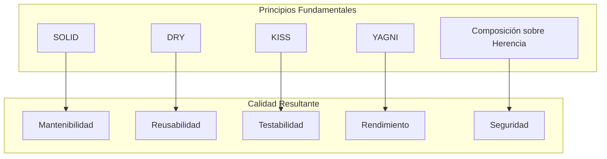
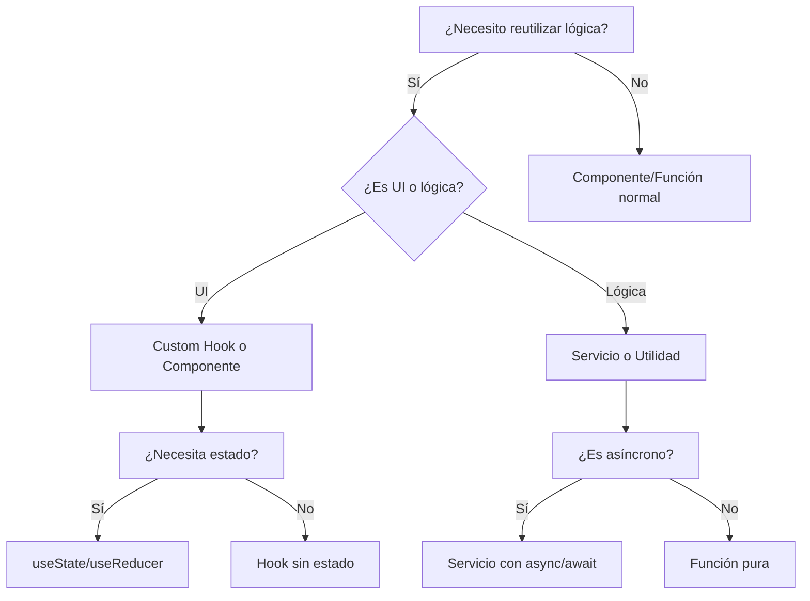

# Estándares de Código

## Tabla de Contenidos

- [Visión General](#visión-general)
- [Principios Fundamentales](#principios-fundamentales)
- [Estándares Generales](#estándares-generales)
  - [Estructura de Proyecto](#estructura-de-proyecto)
  - [Nomenclatura](#nomenclatura)
  - [Comentarios y Documentación](#comentarios-y-documentación)
  - [Manejo de Errores](#manejo-de-errores)
  - [Testing](#testing)
- [Estándares por Lenguaje](#estándares-por-lenguaje)
  - [TypeScript/JavaScript](#typescriptjavascript)
  - [SQL](#sql)
  - [CSS/Tailwind](#csstailwind)
- [Patrones y Anti‑Patrones](#patrones-y-anti-patrones)
- [Herramientas de Aplicación](#herramientas-de-aplicación)
- [Checklist de Calidad](#checklist-de-calidad)
- [Ejemplos Completos](#ejemplos-completos)
- [Referencias](#referencias)

---

## Visión General

### Objetivos de los Estándares

| Objetivo | Descripción | Métrica de Éxito |
|----------|-------------|------------------|
| **Consistencia** | Código uniforme en todo el proyecto | 100% de archivos pasan linter |
| **Mantenibilidad** | Código fácil de entender y modificar | Tiempo de onboarding < 2 semanas |
| **Calidad** | Código libre de bugs y vulnerabilidades | 0 vulnerabilidades críticas |
| **Rendimiento** | Código optimizado y eficiente | p95 < 200ms en endpoints críticos |
| **Accesibilidad** | Código accesible para todos los usuarios | WCAG 2.1 AA cumplido |

### Alcance

| Componente | Aplica | Herramienta de Validación |
|------------|--------|---------------------------|
| **Frontend (React/Next.js)** | ✅ Sí | ESLint, TypeScript, axe-core |
| **Backend (NestJS/Node.js)** | ✅ Sí | ESLint, TypeScript, SonarQube |
| **Base de Datos (PostgreSQL)** | ✅ Sí | SQLFluff, Prisma migrate |
| **Estilos (Tailwind)** | ✅ Sí | Stylelint, Prettier |
| **Tests** | ✅ Sí | Vitest, Playwright |
| **Documentación** | ✅ Sí | markdownlint, Vale |

---

## Principios Fundamentales

### Diagrama de Principios de Diseño



### Explicación de Principios

| Principio | Descripción | Ejemplo en Código |
|-----------|-------------|-------------------|
| **SOLID** | Principios de diseño orientado a objetos | Ver sección [Patrones](#patrones-y-anti-patrones) |
| **DRY** (Don't Repeat Yourself) | Eliminar duplicación de lógica | Extraer funciones comunes (ej. validación de rating) |
| **KISS** (Keep It Simple, Stupid) | Simplicidad sobre complejidad | Prefiero lógica clara a patrones innecesarios |
| **YAGNI** (You Aren't Gonna Need It) | No implementar features prematuras | No añadir webhooks hasta que se necesiten |
| **Composición sobre Herencia** | Composición en lugar de herencia | Usar hooks en lugar de clases base |
| **Fail Fast** | Detectar errores lo antes posible | Validar inputs en el controlador |
| **Defensive Programming** | Asumir que las entradas pueden ser maliciosas | Sanitizar todos los datos antes de procesar |
| **Zero Trust** | No confiar en ninguna entrada externa | Validar tenant_id en cada consulta |

---

## Estándares Generales

### Estructura de Proyecto

```bash
project/
├── apps/
│   ├── api/                          # Backend NestJS
│   │   ├── src/
│   │   │   ├── modules/               # Módulos funcionales
│   │   │   │   ├── testimonials/
│   │   │   │   ├── auth/
│   │   │   │   ├── tenants/
│   │   │   │   └── ...
│   │   │   ├── common/                # Guards, interceptores, filtros
│   │   │   ├── config/                 # Configuración
│   │   │   └── main.ts
│   │   └── test/
│   └── frontend/                       # Next.js
│       ├── app/                         # App Router
│       ├── components/
│       │   ├── ui/                       # Componentes atómicos
│       │   ├── features/                  # Componentes de dominio
│       │   └── layout/                     # Layouts
│       ├── lib/                           # Utilidades, hooks, API client
│       ├── types/                         # Tipos compartidos
│       └── public/
├── packages/                             # Código compartido
│   ├── domain/                            # Entidades, reglas de negocio
│   └── infrastructure/                     # Clientes DB, Redis, etc.
├── tests/                                 # Tests globales
│   ├── unit/
│   ├── integration/
│   └── e2e/
├── scripts/
└── docs/
```

**Reglas de Estructura**:
- ✅ Cada feature debe ser un módulo auto‑contenido (en backend) o carpeta en `features/` (frontend).
- ✅ Componentes reutilizables van en `components/ui/`.
- ✅ Lógica de negocio va en `domain/` o en servicios del módulo.
- ❌ No mezclar lógica de frontend y backend en el mismo archivo.
- ❌ No crear carpetas con más de 10 archivos sin subcarpetas.

### Nomenclatura

#### Convenciones Generales

| Entidad | Convención | Ejemplo Correcto | Ejemplo Incorrecto |
|---------|------------|------------------|---------------------|
| **Archivos** | kebab-case | `testimonial-card.tsx` | `TestimonialCard.tsx`, `testimonialCard.tsx` |
| **Componentes** | PascalCase | `TestimonialCard` | `testimonial_card`, `testimonialCard` |
| **Variables** | camelCase | `authorName` | `AuthorName`, `author_name` |
| **Constantes** | UPPER_SNAKE_CASE | `MAX_RATING` | `maxRating`, `MaxRating` |
| **Funciones** | camelCase | `calculateScore()` | `CalculateScore()`, `calculate-score` |
| **Clases** | PascalCase | `TestimonialService` | `testimonialService`, `testimonial_service` |
| **Interfaces** | PascalCase (prefijo `I` opcional) | `ITestimonial`, `Testimonial` | `testimonialInterface` |
| **Enums** | PascalCase | `TestimonialStatus` | `testimonialStatus`, `TESTIMONIAL_STATUS` |
| **Hooks** | `use` + PascalCase | `useTestimonials` | `use_testimonials`, `TestimonialsHook` |
| **Tests** | `[nombre].spec.ts` | `testimonial.service.spec.ts` | `testimonial.test.ts` |

#### Nomenclatura de Variables

```typescript
// ✅ BUENO
const MAX_RATING = 5;
const isValidContent = validateContent(content);
const calculateAverageScore = (scores: number[]) => { /* ... */ };
const useTenantSettings = () => { /* ... */ };

// ❌ MALO
const m = 5;                    // ¿qué es m?
const check = validate(content); // ¿qué se valida?
const calc = (s: number[]) => {}; // nombres de un solo carácter
const TenantSettingsHook = () => {}; // no sigue convención de hooks
```

#### Nomenclatura de Componentes

```tsx
// ✅ BUENO
export const TestimonialCard: React.FC<TestimonialCardProps> = ({ testimonial }) => { /* ... */ };
export const ScoreBadge: React.FC<ScoreBadgeProps> = ({ score }) => { /* ... */ };
export const ModerationModal: React.FC<ModerationModalProps> = ({ isOpen }) => { /* ... */ };

// ❌ MALO
export const Card = ({ testimonial }) => { /* ... */ };          // demasiado genérico
export const Badge = ({ score }) => { /* ... */ };               // ¿qué representa?
export const Modal = ({ isOpen }) => { /* ... */ };               // igual
```

### Comentarios y Documentación

#### Reglas Generales

- ✅ **Comenta el "por qué", no el "qué"** (el código ya dice qué hace).
- ✅ **Documenta interfaces públicas** con JSDoc.
- ✅ **Actualiza comentarios cuando cambia el código**.
- ❌ **No comentes código muerto**; elimínalo.
- ❌ **No uses comentarios para justificar código malo**; refactoriza.

#### Ejemplos de Comentarios

```typescript
// ✅ BUENO: Explica la decisión
// Usamos decaimiento exponencial para que testimonios antiguos pierdan peso
// con vida media de 30 días.
const recencyFactor = Math.exp(-daysSincePublished / 30) * 100;

/**
 * Calcula el score de un testimonio en función de su engagement.
 * @param testimonial - Testimonio a evaluar
 * @param events - Eventos de analytics (views, clicks)
 * @returns Score calculado
 * @example
 * const score = calculateScore(testimonial, events);
 */
export function calculateScore(testimonial: Testimonial, events: AnalyticsEvent[]): number {
  // ...
}

// ❌ MALO: Comenta el "qué"
// Multiplica views por 0.3
const viewsWeight = views * 0.3;
```

#### Documentación de Componentes React

```tsx
/**
 * Tarjeta que muestra un testimonio en el dashboard.
 * 
 * @component
 * @example
 * <TestimonialCard
 *   testimonial={testimonial}
 *   onApprove={(id) => handleApprove(id)}
 *   onReject={(id) => handleReject(id)}
 * />
 * 
 * @prop {Testimonial} testimonial - Datos del testimonio
 * @prop {(id: string) => void} [onApprove] - Callback al aprobar
 * @prop {(id: string) => void} [onReject] - Callback al rechazar
 */
export const TestimonialCard: React.FC<TestimonialCardProps> = ({
  testimonial,
  onApprove,
  onReject
}) => { /* ... */ };
```

### Manejo de Errores

#### Principios

- ✅ **Nunca ignores errores**; siempre maneja o propaga.
- ✅ **Usa errores tipados** (clases de error específicas).
- ✅ **Proporciona contexto útil**.
- ✅ **No expongas detalles internos** a usuarios finales.
- ❌ **No uses `console.error` para errores críticos**; usa logger estructurado.

#### Ejemplos

```typescript
// ✅ BUENO: Errores tipados
class TestimonialNotFoundError extends Error {
  constructor(id: string) {
    super(`Testimonial with id ${id} not found`);
    this.name = 'TestimonialNotFoundError';
  }
}

class InvalidStatusTransitionError extends Error {
  constructor(from: TestimonialStatus, to: TestimonialStatus) {
    super(`Invalid transition: ${from} -> ${to}`);
    this.name = 'InvalidStatusTransitionError';
  }
}

// ✅ BUENO: Manejo específico
async function approveTestimonial(id: string): Promise<Testimonial> {
  try {
    const testimonial = await repository.findById(id);
    if (!testimonial) throw new TestimonialNotFoundError(id);

    if (testimonial.status !== 'pending') {
      throw new InvalidStatusTransitionError(testimonial.status, 'approved');
    }

    return await repository.update(id, { status: 'approved' });
  } catch (error) {
    if (error instanceof TestimonialNotFoundError || error instanceof InvalidStatusTransitionError) {
      throw error; // errores de negocio esperados
    }
    logger.error('Unexpected error approving testimonial', { error, testimonialId: id });
    throw new DatabaseError('Failed to approve testimonial');
  }
}

// ❌ MALO: Ignorar error
try {
  await deleteTestimonial(id);
} catch (error) {
  // no hacer nada
}
```

### Testing

#### Principios de Testing

| Principio | Descripción | Ejemplo |
|-----------|-------------|---------|
| **FIRST** | Fast, Independent, Repeatable, Self‑validating, Timely | Tests unitarios < 10ms |
| **AAA** | Arrange‑Act‑Assert | Estructura clara |
| **Test One Thing** | Cada test prueba una sola cosa | Un solo `expect` por test |
| **Descriptive Names** | `shouldReturnErrorWhenTestimonialNotFound` | Nombres que describen el comportamiento |
| **No Test Logic** | Evitar bucles y condicionales en tests | Datos fijos en fixtures |

#### Estructura de Tests

```typescript
describe('TestimonialService', () => {
  describe('approve', () => {
    it('should approve a pending testimonial', async () => {
      // Arrange
      const testimonial = { id: '123', status: 'pending' } as Testimonial;
      mockRepo.findById.mockResolvedValue(testimonial);
      mockRepo.update.mockResolvedValue({ ...testimonial, status: 'approved' });

      // Act
      const result = await service.approve('123');

      // Assert
      expect(result.status).toBe('approved');
      expect(mockRepo.update).toHaveBeenCalledWith('123', { status: 'approved' });
    });

    it('should throw InvalidStatusTransitionError if testimonial is not pending', async () => {
      // Arrange
      const testimonial = { id: '123', status: 'published' } as Testimonial;
      mockRepo.findById.mockResolvedValue(testimonial);

      // Act & Assert
      await expect(service.approve('123')).rejects.toThrow(InvalidStatusTransitionError);
    });
  });
});
```

#### Cobertura Mínima Requerida

| Tipo de Test | Cobertura Mínima | Herramienta |
|--------------|------------------|-------------|
| **Statements** | 80% | Vitest/Instanbul |
| **Branches** | 70% | Vitest/Instanbul |
| **Functions** | 80% | Vitest/Instanbul |
| **Lines** | 80% | Vitest/Instanbul |
| **Componentes críticos** | 100% | Custom script |

---

## Estándares por Lenguaje

### TypeScript/JavaScript

#### Configuración de ESLint

```javascript
// .eslintrc.js
module.exports = {
  parser: '@typescript-eslint/parser',
  plugins: ['@typescript-eslint', 'react', 'react-hooks', 'import', 'jsx-a11y', 'sonarjs'],
  extends: [
    'eslint:recommended',
    'plugin:@typescript-eslint/recommended',
    'plugin:react/recommended',
    'plugin:react-hooks/recommended',
    'plugin:import/recommended',
    'plugin:import/typescript',
    'plugin:jsx-a11y/recommended',
    'plugin:sonarjs/recommended',
    'prettier'
  ],
  rules: {
    '@typescript-eslint/explicit-function-return-type': 'warn',
    '@typescript-eslint/explicit-module-boundary-types': 'warn',
    '@typescript-eslint/no-explicit-any': 'error',
    '@typescript-eslint/no-unused-vars': ['error', { argsIgnorePattern: '^_' }],
    'import/order': ['error', {
      groups: ['builtin', 'external', 'internal', 'parent', 'sibling', 'index'],
      'newlines-between': 'always',
      alphabetize: { order: 'asc', caseInsensitive: true }
    }],
    'react/prop-types': 'off', // usamos TypeScript
    'react/react-in-jsx-scope': 'off', // Next.js
    'sonarjs/no-duplicate-string': 'warn'
  },
  settings: {
    react: { version: 'detect' },
    'import/resolver': { typescript: { project: './tsconfig.json' } }
  }
};
```

#### Formato de Código (Prettier)

```json
// .prettierrc
{
  "semi": true,
  "trailingComma": "es5",
  "singleQuote": true,
  "printWidth": 100,
  "tabWidth": 2,
  "useTabs": false,
  "arrowParens": "avoid",
  "endOfLine": "lf"
}
```

#### Ejemplos de Código TypeScript

```typescript
// ✅ BUENO: Tipos explícitos
interface Testimonial {
  readonly id: string;
  readonly tenantId: string;
  authorName: string;
  content: string;
  rating: 1 | 2 | 3 | 4 | 5;
  status: TestimonialStatus;
  score: number;
  createdAt: Date;
  publishedAt?: Date;
}

type TestimonialStatus = 'draft' | 'pending' | 'approved' | 'published' | 'rejected';

export class TestimonialService {
  constructor(private repository: TestimonialRepository) {}

  async getTestimonial(id: string, tenantId: string): Promise<Testimonial> {
    const testimonial = await this.repository.findById(id);
    if (!testimonial || testimonial.tenantId !== tenantId) {
      throw new TestimonialNotFoundError(id);
    }
    return testimonial;
  }

  async updateScore(id: string): Promise<void> {
    const testimonial = await this.getTestimonial(id, tenantId);
    const events = await this.analyticsService.getEvents(id);
    const newScore = this.calculateScore(testimonial, events);
    await this.repository.update(id, { score: newScore });
  }

  private calculateScore(testimonial: Testimonial, events: AnalyticsEvent[]): number {
    // fórmula de scoring
  }
}
```

### SQL

#### Estándares de Escritura SQL

```sql
-- ✅ BUENO: formateado y comentado
-- Obtiene testimonios publicados de un tenant, ordenados por score
SELECT 
    id,
    author_name,
    content,
    rating,
    score,
    published_at
FROM testimonials
WHERE tenant_id = $1
    AND status = 'published'
    AND score > 0
ORDER BY score DESC, published_at DESC
LIMIT $2 OFFSET $3;
```

#### Índices Recomendados

```sql
CREATE INDEX idx_testimonials_tenant_status_score 
ON testimonials(tenant_id, status, score DESC);

CREATE INDEX idx_analytics_testimonial_type 
ON analytics_events(testimonial_id, event_type);
```

#### Anti‑Patrones SQL

```sql
-- ❌ MALO: SELECT *
SELECT * FROM testimonials;

-- ❌ MALO: Sin índices
SELECT * FROM testimonials WHERE tenant_id = $1 AND status = 'published';
```

### CSS/Tailwind

#### Estándares de Estilos

```tsx
// ✅ BUENO: Uso consistente de Tailwind con clsx
import { clsx } from 'clsx';

export const TestimonialCard: React.FC<TestimonialCardProps> = ({ testimonial, isSelected }) => {
  const cardClasses = clsx(
    'border rounded-lg p-4 transition-shadow hover:shadow-md',
    isSelected ? 'border-primary-500 bg-primary-50' : 'border-gray-200',
    testimonial.status === 'published' && 'bg-green-50'
  );

  return (
    <div className={cardClasses}>
      {/* ... */}
    </div>
  );
};
```

#### Archivo de Configuración de Tailwind

```javascript
// tailwind.config.js
module.exports = {
  content: ['./src/**/*.{js,ts,jsx,tsx}'],
  theme: {
    extend: {
      colors: {
        primary: { /* ... */ },
        status: {
          pending: '#f59e0b',
          published: '#10b981',
          rejected: '#ef4444'
        }
      }
    }
  }
};
```

---

## Patrones y Anti‑Patrones

### Diagrama de Decisiones de Patrones



### Patrones Recomendados

| Patrón | Cuándo Usar | Ejemplo |
|--------|-------------|---------|
| **Custom Hooks** | Reutilizar lógica de estado entre componentes | `useTestimonials(filters)` |
| **Compound Components** | Componentes que trabajan juntos | `<Tabs><TabList><Tab><TabPanel>` |
| **Render Props** | Compartir lógica de renderizado | `<DataProvider render={data => <Chart data={data} />}` |
| **Higher‑Order Components** | Añadir funcionalidad a componentes (menos común en Hooks) | `withAuth(Component)` |
| **Context + useReducer** | Estado global complejo | `AuthContext`, `TenantContext` |
| **Factory Functions** | Crear objetos con configuración | `createScoringStrategy(type)` |
| **Strategy Pattern** | Algoritmos intercambiables | `ScoringStrategy` (Weighted, ML, etc.) |
| **Repository Pattern** | Abstraer acceso a datos | `TestimonialRepository` |

### Anti‑Patrones a Evitar

| Anti‑Patrón | Problema | Solución |
|-------------|---------|----------|
| **Prop Drilling** | Pasar props a través de muchos niveles | Usar Context o estado local |
| **Componentes Gigantes** | Difícil de mantener | Dividir en componentes pequeños |
| **Hooks Condicionales** | Rompe reglas de hooks | Llamar hooks siempre en el mismo orden |
| **Estado Derivado** | Estado duplicado | Usar `useMemo` o calcular en el momento |
| **Efectos Excesivos** | Rendimiento pobre | Minimizar `useEffect`, usar callbacks |
| **Any Type** | Pérdida de type safety | Tipar explícitamente |
| **Callbacks en Línea** | Re‑renders innecesarios | Usar `useCallback` |

---

## Herramientas de Aplicación

### Configuración de Herramientas

```json
// package.json (scripts relevantes)
{
  "scripts": {
    "lint": "eslint . --ext .ts,.tsx",
    "format": "prettier --write \"src/**/*.{ts,tsx,css}\"",
    "type-check": "tsc --noEmit",
    "test": "vitest run",
    "test:coverage": "vitest run --coverage",
    "prepare": "husky install"
  },
  "lint-staged": {
    "*.{ts,tsx}": ["eslint --fix", "prettier --write"],
    "*.{css,md}": ["prettier --write"]
  }
}
```

### Git Hooks con Husky

```bash
# .husky/pre-commit
#!/bin/sh
. "$(dirname "$0")/_/husky.sh"
npx lint-staged
npx tsc --noEmit
```

```bash
# .husky/pre-push
#!/bin/sh
. "$(dirname "$0")/_/husky.sh"
npm test
npm run test:coverage -- --thresholds.lines=80 --thresholds.branches=70
```

---

## Checklist de Calidad

Antes de hacer commit, verifica:

### ✅ TypeScript/JavaScript
- [ ] Sin `any` (excepto casos justificados)
- [ ] Tipos explícitos en funciones públicas
- [ ] Interfaces bien definidas
- [ ] Manejo de errores con tipos específicos
- [ ] Sin `console.log` en producción
- [ ] Imports ordenados
- [ ] Sin código comentado o muerto

### ✅ React
- [ ] Componentes funcionales (no clases)
- [ ] Hooks usados correctamente
- [ ] `useCallback` y `useMemo` donde sea necesario
- [ ] Props tipadas
- [ ] Accesibilidad (labels, roles ARIA)
- [ ] Componentes < 200 líneas

### ✅ Estilos
- [ ] Uso consistente de Tailwind
- [ ] Clases agrupadas
- [ ] Responsive

### ✅ SQL
- [ ] Queries formateadas
- [ ] Índices en columnas de filtrado
- [ ] Sin SELECT *
- [ ] Joins explícitos
- [ ] Parámetros parametrizados

### ✅ Testing
- [ ] Tests unitarios para lógica de negocio
- [ ] Tests de integración para endpoints críticos
- [ ] Cobertura mínima cumplida
- [ ] Nombres de tests descriptivos

### ✅ General
- [ ] Código pasa ESLint
- [ ] Formateado con Prettier
- [ ] Type checking sin errores
- [ ] Tests pasan localmente
- [ ] Sin secrets hardcodeados

---

## Ejemplos Completos

### Ejemplo 1: Servicio de Testimonios con Scoring

```typescript
// apps/api/src/modules/testimonials/services/testimonial.service.ts
import { Injectable, NotFoundException } from '@nestjs/common';
import { TestimonialRepository } from '../repositories/testimonial.repository';
import { AnalyticsService } from '../../analytics/services/analytics.service';
import { ScoringStrategyFactory } from './scoring-strategy.factory';
import { Testimonial, TestimonialStatus } from '../entities/testimonial.entity';
import { CreateTestimonialDto } from '../dto/create-testimonial.dto';

@Injectable()
export class TestimonialService {
  constructor(
    private repository: TestimonialRepository,
    private analyticsService: AnalyticsService,
    private scoringFactory: ScoringStrategyFactory
  ) {}

  async create(tenantId: string, dto: CreateTestimonialDto): Promise<Testimonial> {
    // Validación básica
    if (!dto.authorName || !dto.content || dto.rating < 1 || dto.rating > 5) {
      throw new Error('Invalid testimonial data');
    }

    const testimonial = await this.repository.create({
      tenantId,
      ...dto,
      status: 'pending',
      score: 0,
    });

    return testimonial;
  }

  async approve(id: string, tenantId: string): Promise<Testimonial> {
    const testimonial = await this.repository.findOne(id, tenantId);
    if (!testimonial) throw new NotFoundException();

    if (testimonial.status !== 'pending') {
      throw new Error('Only pending testimonials can be approved');
    }

    const updated = await this.repository.update(id, { status: 'approved' });
    return updated;
  }

  async publish(id: string, tenantId: string): Promise<Testimonial> {
    const testimonial = await this.repository.findOne(id, tenantId);
    if (!testimonial) throw new NotFoundException();

    if (testimonial.status !== 'approved') {
      throw new Error('Only approved testimonials can be published');
    }

    const published = await this.repository.update(id, {
      status: 'published',
      publishedAt: new Date(),
    });

    // Calcular score inicial
    await this.recalculateScore(published);

    // Disparar evento para webhooks
    // (usando outbox pattern)

    return published;
  }

  async recalculateScore(testimonial: Testimonial): Promise<void> {
    const events = await this.analyticsService.getEvents(testimonial.id);
    const strategy = this.scoringFactory.getStrategy(testimonial.tenantId);
    const newScore = strategy.calculate(testimonial, events);
    await this.repository.update(testimonial.id, { score: newScore });
  }

  async getTopTestimonials(tenantId: string, limit = 10): Promise<Testimonial[]> {
    return this.repository.findByTenant(tenantId, {
      status: 'published',
      orderBy: { score: 'desc' },
      take: limit,
    });
  }
}
```

---

## Referencias

- [TypeScript Handbook](https://www.typescriptlang.org/docs/handbook/)
- [React Documentation](https://react.dev/)
- [NestJS Documentation](https://docs.nestjs.com/)
- [Tailwind CSS Documentation](https://tailwindcss.com/docs)
- [Prisma Documentation](https://www.prisma.io/docs)
- [Conventional Commits](https://www.conventionalcommits.org/)

---

> **Nota final**: Los estándares de código son un **contrato de calidad** entre desarrolladores. Revisa y actualiza este documento trimestralmente basado en feedback del equipo, nuevas tecnologías y mejores prácticas emergentes. La calidad del código es responsabilidad de todos.