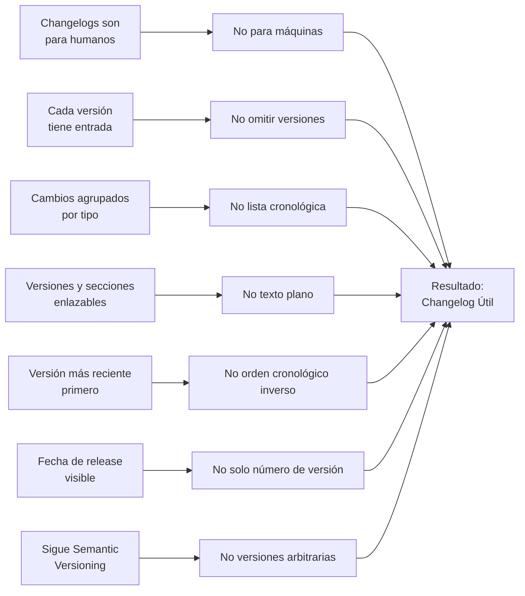

# Guía para Mantener el Changelog de Testimonial CMS

## 🎯 Propósito del Documento

Este documento **NO es el changelog del proyecto**. Es una **guía completa y detallada** para contribuidores sobre cómo escribir, mantener y estructurar el archivo `CHANGELOG.md` de Testimonial CMS. Define estándares, convenciones, workflow y mejores prácticas para garantizar un changelog profesional, útil y mantenible.

> 💡 **Diferencia clave**:  
> - **`changelog_guidelines.md`** (este documento): *Guía para mantener el changelog* (documento de colaboración)  
> - **`CHANGELOG.md`** (archivo raíz): *Registro real de cambios del proyecto* (documento público)  
> - **`contributing.md`** (`collaboration/`): Define el proceso general de contribución  
> - **`git_workflow.md`** (`collaboration/`): Define el flujo de trabajo de Git  
>   
> ✅ **Regla moderna**: Un changelog bien mantenido es tan importante como el código. Si los usuarios no entienden qué cambió, no actualizarán tu software.

---

## 📋 Tabla de Contenidos

- [Principios Fundamentales](#principios-fundamentales)
- [Formato y Estructura](#formato-y-estructura)
- [Workflow de Actualización](#workflow-de-actualización)
- [Convenciones de Escritura](#convenciones-de-escritura)
- [Ejemplos Completos](#ejemplos-completos)
- [Plantilla para CHANGELOG.md](#plantilla-para-changelogmd)
- [Checklist de Calidad](#checklist-de-calidad)
- [Herramientas y Automatización](#herramientas-y-automatización)
- [Preguntas Frecuentes](#preguntas-frecuentes)
- [Recursos Adicionales](#recursos-adicionales)

---

## Principios Fundamentales

### ¿Por qué un Changelog Bien Mantenido es Crítico?

| Beneficio | Impacto en el Proyecto | Métrica de Éxito |
|-----------|------------------------|------------------|
| **Adopción de Updates** | Los usuarios actualizan con confianza | +30% tasa de adopción de nuevas versiones |
| **Reducción de Issues** | Menos preguntas "¿qué cambió?" | -40% issues sobre cambios no documentados |
| **Confianza del Usuario** | Percepción de proyecto profesional | +25% satisfacción en encuestas |
| **Onboarding Rápido** | Nuevos contribuidores entienden la evolución | Tiempo de onboarding < 1 semana |
| **Auditoría y Compliance** | Registro histórico para cumplimiento | 100% trazabilidad de cambios críticos |

### Principios de Keep a Changelog (Adaptados)



**Reglas No Negociables**:
1. ✅ **Changelogs son para humanos**: Escribe para personas, no parsers
2. ✅ **Cada versión tiene entrada**: Nunca omitas una versión release
3. ✅ **Agrupa por tipo de cambio**: Added, Changed, Fixed, etc.
4. ✅ **Enlaza versiones y secciones**: Usa anchor links y comparaciones de GitHub
5. ✅ **Versión más reciente primero**: Orden descendente
6. ✅ **Incluye fecha de release**: Formato ISO 8601 (YYYY-MM-DD)
7. ✅ **Declara uso de Semantic Versioning**: Especifica en el header

---

## Formato y Estructura

### Estructura Canónica (Keep a Changelog 1.0.0)

```markdown
# Changelog

All notable changes to this project will be documented in this file.

The format is based on [Keep a Changelog](https://keepachangelog.com/en/1.0.0/),
and this project adheres to [Semantic Versioning](https://semver.org/spec/v2.0.0.html).

## [Unreleased]

### Added
- 

### Changed
- 

### Deprecated
- 

### Removed
- 

### Fixed
- 

### Security
- 

## [1.2.0] - YYYY-MM-DD

### Added
- 

### Changed
- 

[Unreleased]: https://github.com/organization/testimonial-cms/compare/v1.2.0...HEAD
[1.2.0]: https://github.com/organization/testimonial-cms/releases/tag/v1.2.0
```

### Secciones por Tipo de Cambio (Orden Prioritario)

| Sección | Cuándo Usar | Ejemplo (Testimonial CMS) | Impacto de Usuario |
|---------|-------------|---------------------------|-------------------|
| **Added** | Nuevas funcionalidades | "Added bulk import of testimonials via CSV" | Alto - Nuevas capacidades |
| **Changed** | Modificaciones a features existentes | "Changed embed script to use lazy loading" | Medio-Alto - Comportamiento alterado |
| **Deprecated** | Features marcadas para eliminación | "Deprecated legacy API v1 (remove in v3.0)" | Medio - Preparación para cambio |
| **Removed** | Features eliminadas | "Removed support for IE11 in embed widget" | Alto - Funcionalidad perdida |
| **Fixed** | Correcciones de bugs | "Fixed score calculation for very old testimonials" | Alto - Problemas resueltos |
| **Security** | Parches de seguridad | "Patched XSS vulnerability in testimonial form" | Crítico - Vulnerabilidades |

**Reglas de Sección**:
- ✅ Siempre incluir todas las secciones (aunque estén vacías en `[Unreleased]`)
- ✅ Ordenar secciones exactamente como arriba (Added → Security)
- ✅ No crear secciones personalizadas (ej: "Performance", "Documentation")
- ✅ Para cambios de performance significativos, usar "Changed" con descripción clara

---

## Workflow de Actualización

### Diagrama de Flujo Completo

```mermaid
flowchart TD
    A[Nuevo Cambio en PR] --> B{¿Es notable<br>para usuarios?}
    
    B -->|No| C[No incluir<br>en changelog]
    B -->|Sí| D[Escribir entrada<br>en [Unreleased]]
    
    D --> E[Incluir entrada<br>en PR]
    E --> F{PR Aprobado<br>y Mergeado?}
    
    F -->|No| G[Revisar y<br>Actualizar Entrada]
    G --> E
    
    F -->|Sí| H[Esperar<br>Release]
    
    H --> I{Nueva Release?}
    I -->|No| H
    
    I -->|Sí| J[Mover [Unreleased]<br>a Nueva Versión]
    J --> K[Actualizar Fecha<br>y Enlaces]
    K --> L[Commit y Tag<br>de Release]
    L --> M[Actualizar [Unreleased]<br>Vacío]
    M --> N[Publicar Release<br>Notes]
    N --> O[Fin]
    
    C --> P[Fin<br>sin changelog]
    
    style D fill:#d4f7e2,stroke:#22c55e
    style J fill:#dbeafe,stroke:#3b82f6
    style N fill:#f0abfc,stroke:#c026d3
```

### Pasos Detallados por Rol

#### Para Contribuidores (en cada PR)

1. **Evaluar impacto del cambio**:
   - ¿Afecta a usuarios finales o API pública?
   - ¿Es un bug fix visible?
   - ¿Agrega nueva funcionalidad (ej. nuevo endpoint, feature flag, webhook)?
   - Si NO a todas → omitir changelog

2. **Editar `CHANGELOG.md`**:
   - Agregar entrada bajo `[Unreleased]`
   - Usar sección apropiada (Added, Fixed, etc.)
   - Escribir en pasado ("Added", no "Adds")
   - Enlazar al issue/PR: `([#123](link))`
   - Ejemplo: `- Added bulk import of testimonials via CSV ([#201](https://github.com/org/testimonial-cms/issues/201))`

3. **Incluir en PR**:
   - El cambio en `CHANGELOG.md` debe estar en el mismo commit que el código
   - Si el PR tiene múltiples cambios notables, una entrada por cambio

#### Para Mantenedores (antes de release)

1. **Preparar release**:
   - Crear nueva sección: `## [1.3.0] - YYYY-MM-DD`
   - Mover todas las entradas de `[Unreleased]` a la nueva sección
   - Eliminar entradas vacías (secciones sin cambios)

2. **Actualizar metadatos**:
   - Calcular fecha de release (hoy)
   - Actualizar enlaces al final del archivo:
     ```markdown
     [Unreleased]: https://github.com/org/testimonial-cms/compare/v1.3.0...HEAD
     [1.3.0]: https://github.com/org/testimonial-cms/releases/tag/v1.3.0
     ```

3. **Commit y tag**:
   - Commit message: `chore(release): prepare v1.3.0`
   - Tag: `git tag -a v1.3.0 -m "Release v1.3.0"`
   - Push tags: `git push origin v1.3.0`

4. **Publicar release notes**:
   - Copiar sección de changelog a GitHub Release
   - Incluir enlaces a issues/PRs resueltos
   - Destacar breaking changes en negrita

---

## Convenciones de Escritura

### Estilo y Tono

| Aspecto | Regla | Ejemplo Correcto | Ejemplo Incorrecto |
|---------|-------|------------------|---------------------|
| **Tiempo verbal** | Siempre pasado | `Added testimonial scoring algorithm` | `Adds testimonial scoring algorithm` |
| **Enfoque** | Impacto para usuario | `Fixed embed script not loading on Safari` | `Fixed bug in embed.js line 42` |
| **Extensión** | 1 oración clara | `Added webhook support for testimonial.published events` | `Added a new feature that allows users to configure webhooks to receive notifications when a testimonial is published, which can be used for integrations with Slack, CRM, etc.` |
| **Enlaces** | Siempre incluir | `([#123](link))` | `(fixes #123)` |
| **Breaking changes** | Explicitar claramente | `BREAKING: Removed support for Node 14` | `Updated dependencies` |
| **Tono** | Neutral y profesional | `Improved error messages on form validation` | `Finally fixed that annoying bug!` |

### Plantilla para Entradas

```markdown
### [Sección]
- [Verbo en pasado] [qué cambió] ([#issue](link-issue)) [@autor-opcional]
- [Verbo en pasado] [qué cambió] con [detalle relevante] ([#issue](link-issue))
```

### Ejemplos de Buenas Entradas para Testimonial CMS

```markdown
### Added
- Added bulk import of testimonials via CSV file upload ([#123](https://github.com/org/testimonial-cms/issues/123))
- Added webhook support for `testimonial.published` and `testimonial.approved` events ([#145](https://github.com/org/testimonial-cms/issues/145))
- Added feature flags to enable/disable scoring per tenant ([#201](https://github.com/org/testimonial-cms/issues/201))

### Changed
- Changed scoring algorithm to give higher weight to recent testimonials (recency factor) ([#230](https://github.com/org/testimonial-cms/issues/230))
- Improved performance of the testimonials list endpoint by 40% with pagination optimization ([#235](https://github.com/org/testimonial-cms/issues/235))
- Updated minimum Node.js version from 18 to 20 ([#240](https://github.com/org/testimonial-cms/issues/240))

### Fixed
- Fixed embed script failing on websites with strict CSP headers ([#241](https://github.com/org/testimonial-cms/issues/241))
- Fixed score calculation for testimonials with zero views ([#248](https://github.com/org/testimonial-cms/issues/248))
- Fixed validation error on testimonial form when media URL contains special characters ([#252](https://github.com/org/testimonial-cms/issues/252))

### Security
- Patched XSS vulnerability in testimonial content display ([#255](https://github.com/org/testimonial-cms/issues/255))
- Updated `jsonwebtoken` to v9.0.2 to address CVE-2023-12345 ([#260](https://github.com/org/testimonial-cms/issues/260))
```

### Ejemplos de Malas Entradas (y Correcciones)

```markdown
❌ - Added stuff for embed (fixes #123)
✅ - Added support for custom CSS in embed widget ([#123](link))

❌ - Fixed bug
✅ - Fixed embed script not loading on Safari ([#156](link))

❌ - Refactored scoring service
✅ - (Omitir - cambio interno sin impacto para usuario)

❌ - Updated dependencies
✅ - Updated `express` to v4.18.2 to address security vulnerability ([#260](link))

❌ - Added new feature
✅ - Added webhook notifications for testimonial approval ([#215](link))
```

---

## Ejemplos Completos

### Ejemplo 1: Versión con Breaking Change

```markdown
## [2.0.0] - YYYY-MM-DD

### Added
- Added GraphQL API alongside REST endpoints ([#301](https://github.com/org/testimonial-cms/issues/301))
- Added support for multi-tenant webhook configuration ([#305](https://github.com/org/testimonial-cms/issues/305))
- Added audit log for testimonial moderation actions ([#310](https://github.com/org/testimonial-cms/issues/310))

### Changed
- **BREAKING**: Migrated from REST-only to hybrid REST/GraphQL API ([#315](https://github.com/org/testimonial-cms/issues/315))
  - Old REST endpoints deprecated (will be removed in v3.0)
  - New GraphQL schema available at `/graphql`
  - Authentication now uses JWT exclusively (removed session cookies)
- **BREAKING**: Updated minimum Node.js version from 18 to 20 ([#320](https://github.com/org/testimonial-cms/issues/320))
- Improved scoring algorithm with machine learning model (opt‑in) ([#325](https://github.com/org/testimonial-cms/issues/325))

### Deprecated
- Deprecated legacy REST endpoints (`/api/v1/*`) - use GraphQL or `/api/v2/*` ([#315](https://github.com/org/testimonial-cms/issues/315))

### Removed
- **BREAKING**: Removed support for Internet Explorer 11 in embed widget ([#330](https://github.com/org/testimonial-cms/issues/330))
- **BREAKING**: Removed session-based authentication ([#315](https://github.com/org/testimonial-cms/issues/315))

### Fixed
- Fixed race condition when multiple webhooks are triggered simultaneously ([#335](https://github.com/org/testimonial-cms/issues/335))
- Fixed memory leak in long-running background scoring jobs ([#340](https://github.com/org/testimonial-cms/issues/340))

### Security
- Implemented rate limiting on authentication endpoints ([#345](https://github.com/org/testimonial-cms/issues/345))
- Added CSP headers to embed script to prevent XSS attacks ([#350](https://github.com/org/testimonial-cms/issues/350))
```

### Ejemplo 2: Versión de Mantenimiento (Patch)

```markdown
## [1.2.3] - YYYY-MM-DD

### Fixed
- Fixed incorrect display of rating stars on testimonial cards ([#275](https://github.com/org/testimonial-cms/issues/275))
- Fixed webhook delivery failing for payloads containing emoji ([#278](https://github.com/org/testimonial-cms/issues/278))
- Fixed validation error when uploading images with non‑Latin filenames ([#281](https://github.com/org/testimonial-cms/issues/281))

### Security
- Updated `lodash` to v4.17.21 to address CVE-2023-45678 ([#285](https://github.com/org/testimonial-cms/issues/285))
- Patched path traversal vulnerability in media upload handler ([#288](https://github.com/org/testimonial-cms/issues/288))
```

---

## Plantilla para CHANGELOG.md

```markdown
# Changelog

All notable changes to this project will be documented in this file.

The format is based on [Keep a Changelog](https://keepachangelog.com/en/1.0.0/),
and this project adheres to [Semantic Versioning](https://semver.org/spec/v2.0.0.html).

## [Unreleased]

### Added
- 

### Changed
- 

### Deprecated
- 

### Removed
- 

### Fixed
- 

### Security
- 

## [1.0.0] - YYYY-MM-DD

### Added
- Initial release of Testimonial CMS
- Multi‑tenant architecture with tenant isolation
- CRUD operations for testimonials (text, image, video)
- Moderation workflow (pending → approved → published)
- API publica con API keys
- Embed widget para mostrar testimonios en sitios externos
- Analítica básica (views, clicks) y scoring automático
- Webhooks configurables para eventos
- Feature flags por tenant

[Unreleased]: https://github.com/organization/testimonial-cms/compare/v1.0.0...HEAD
[1.0.0]: https://github.com/organization/testimonial-cms/releases/tag/v1.0.0
```

**Instrucciones para usar esta plantilla**:
1. Copia este contenido a `CHANGELOG.md` en la raíz del proyecto
2. Elimina las líneas vacías bajo `[Unreleased]` antes de la primera release
3. Actualiza los enlaces al final con tu organización y nombre de proyecto
4. Nunca elimines la sección `[Unreleased]` - siempre debe existir

---

## Checklist de Calidad

Antes de hacer merge de un PR con cambios en el changelog, verifica:

### ✅ Para Contribuidores
- [ ] La entrada está en la sección `[Unreleased]`
- [ ] El tipo de sección es apropiado (Added, Fixed, etc.)
- [ ] La descripción es clara y concisa (1 oración)
- [ ] Se enlaza al issue o PR relevante con formato `([#123](link))`
- [ ] Se escribe en pasado ("Added", no "Adds")
- [ ] El cambio es notable para usuarios (no es cambio interno trivial)
- [ ] No hay cambios duplicados
- [ ] La ortografía y gramática son correctas
- [ ] Breaking changes están explícitamente marcados con **BREAKING**

### ✅ Para Mantenedores (antes de release)
- [ ] Todas las entradas de `[Unreleased]` se movieron a la nueva versión
- [ ] La fecha de release es hoy (formato YYYY-MM-DD)
- [ ] Los enlaces al final del archivo están actualizados
- [ ] Las secciones vacías se eliminaron (excepto en `[Unreleased]`)
- [ ] Breaking changes están claramente identificados
- [ ] El commit de release incluye los cambios en changelog
- [ ] El tag de versión coincide con la entrada en changelog
- [ ] Las release notes en GitHub coinciden con el changelog

---

## Herramientas y Automatización

### GitHub Actions para Validar Changelog

```yaml
# .github/workflows/validate-changelog.yml
name: Validate Changelog

on: [pull_request]

jobs:
  validate:
    runs-on: ubuntu-latest
    steps:
      - uses: actions/checkout@v3
      
      - name: Check if CHANGELOG.md was modified
        id: changelog_check
        run: |
          if git diff --name-only HEAD~1 HEAD | grep -q "^CHANGELOG.md$"; then
            echo "changelog_modified=true" >> $GITHUB_OUTPUT
          else
            echo "changelog_modified=false" >> $GITHUB_OUTPUT
          fi
      
      - name: Fail if changelog not modified (for non-trivial PRs)
        if: steps.changelog_check.outputs.changelog_modified == 'false' && !contains(github.event.pull_request.labels.*.name, 'skip-changelog')
        run: |
          echo "❌ ERROR: CHANGELOG.md was not modified in this PR"
          echo ""
          echo "Please update CHANGELOG.md with a description of your changes."
          echo "If this PR contains only trivial changes (typos, internal refactors),"
          echo "add the 'skip-changelog' label to bypass this check."
          exit 1
      
      - name: Validate changelog format
        uses: docker://ghcr.io/lob/changelog-checker:latest
        with:
          changelog: CHANGELOG.md
          strict: true
```

### Scripts Útiles

```bash
#!/bin/bash
# scripts/generate-changelog-entry.sh
# Genera entrada de changelog desde último commit

set -e

COMMIT_MSG=$(git log -1 --pretty=%B)
ISSUE_NUM=$(echo "$COMMIT_MSG" | grep -oE "#[0-9]+" | head -1 | sed 's/#//')
COMMIT_TYPE=$(echo "$COMMIT_MSG" | grep -oE "^(feat|fix|perf|refactor|chore)" | head -1)

if [ -z "$ISSUE_NUM" ]; then
  echo "❌ No issue number found in commit message"
  exit 1
fi

# Determinar sección basada en tipo de commit
case $COMMIT_TYPE in
  feat)
    SECTION="Added"
    VERB="Added"
    ;;
  fix)
    SECTION="Fixed"
    VERB="Fixed"
    ;;
  perf)
    SECTION="Changed"
    VERB="Improved"
    ;;
  *)
    SECTION="Changed"
    VERB="Changed"
    ;;
esac

# Obtener título del issue
ISSUE_TITLE=$(gh issue view $ISSUE_NUM --json title --jq '.title' 2>/dev/null || echo "Issue #$ISSUE_NUM")

# Generar entrada
echo "### $SECTION"
echo "- $VERB $ISSUE_TITLE ([#$ISSUE_NUM](https://github.com/organization/testimonial-cms/issues/$ISSUE_NUM))"
echo ""
echo "✅ Copia esta entrada y pégala en la sección [Unreleased] de CHANGELOG.md"
```

### Herramientas de Automatización Recomendadas

| Herramienta | Propósito | Configuración Mínima |
|-------------|-----------|----------------------|
| **standard-version** | Automatiza versionado y changelog | `npx standard-version --release-as minor` |
| **auto-changelog** | Genera changelog desde commits | `npx auto-changelog --commit-limit false` |
| **gren** | Genera changelog desde GitHub | `gren release --override --generate` |
| **changesets** | Workflow para monorepos | `npx changeset add` |

**Ejemplo: Configuración de standard-version**
```json
// .versionrc.json
{
  "types": [
    {"type": "feat", "section": "Added"},
    {"type": "fix", "section": "Fixed"},
    {"type": "perf", "section": "Changed"},
    {"type": "security", "section": "Security"}
  ],
  "commitUrlFormat": "https://github.com/organization/testimonial-cms/commits/{{hash}}",
  "compareUrlFormat": "https://github.com/organization/testimonial-cms/compare/{{previousTag}}...{{currentTag}}",
  "issueUrlFormat": "https://github.com/organization/testimonial-cms/issues/{{id}}",
  "releaseCommitMessageFormat": "chore(release): prepare {{currentTag}}"
}
```

---

## Preguntas Frecuentes

### ¿Debo incluir cada commit en el changelog?
**No**. Solo incluye cambios notables para usuarios:
- ✅ Nuevas funcionalidades (ej. nuevo endpoint, feature flag, webhook)
- ✅ Correcciones de bugs visibles (ej. embed no cargaba en Safari)
- ✅ Cambios en API pública (ej. nuevo parámetro en endpoint)
- ✅ Breaking changes
- ❌ Refactorizaciones internas sin impacto
- ❌ Actualizaciones de dependencias sin cambios visibles
- ❌ Corrección de typos en comentarios

### ¿Qué pasa si olvido actualizar el changelog en mi PR?
- El CI/CD fallará si usas el workflow de validación
- El mantenedor puede:
  1. Solicitar que agregues la entrada antes de merge
  2. Agregar la entrada durante el proceso de release
  3. Aplicar etiqueta `skip-changelog` si es cambio trivial

### ¿Cómo manejo cambios que afectan múltiples secciones?
Si un cambio tiene múltiples aspectos:
```markdown
### Added
- Added webhook support for testimonial published events ([#215](link))

### Changed
- Improved webhook delivery performance by 30% ([#215](link))
```
O si son aspectos del mismo cambio:
```markdown
### Added
- Added webhook support with improved delivery performance ([#215](link))
```

### ¿Debo incluir cambios en la documentación?
Solo si son cambios significativos:
- ✅ Nueva guía de integración del embed
- ✅ Cambios en API documentada (ej. nuevo parámetro)
- ✅ Nueva sección de troubleshooting para webhooks
- ❌ Corrección de typos
- ❌ Actualización de screenshots
- ❌ Reorganización menor

### ¿Cómo manejo releases con muchos cambios?
Para releases mayores con +20 cambios:
1. Agrupa cambios relacionados:
   ```markdown
   ### Added
   - **Scoring Module**:
     - Added ML‑based scoring (opt‑in) ([#201](link))
     - Added recency factor ([#215](link))
   - **Webhook Module**:
     - Added support for Slack integration ([#220](link))
   ```
2. Considera un resumen ejecutivo al inicio de la versión:
   ```markdown
   ## [2.0.0] - YYYY-MM-DD
   
   **Summary**: Major release with GraphQL API, ML scoring, and IE11 removal.
   
   ### Added
   ...
   ```

---

## Recursos Adicionales

### Documentación Oficial
- [Keep a Changelog (Especificación 1.0.0)](https://keepachangelog.com/en/1.0.0/)
- [Semantic Versioning 2.0.0](https://semver.org/spec/v2.0.0.html)
- [GitHub Release Documentation](https://docs.github.com/en/repositories/releasing-projects-on-github)

### Herramientas
- [Changelog Cheat Sheet](https://changelog.cool/)
- [Standard Version](https://github.com/conventional-changelog/standard-version)
- [Auto Changelog](https://github.com/CookPete/auto-changelog)
- [GitHub Release Notes Generator](https://github.com/github-tools/github-release-notes)

### Artículos Recomendados
- [How to Write a Good Changelog](https://www.freecodecamp.org/news/how-to-write-a-good-changelog/)
- [The Art of the Changelog](https://about.gitlab.com/blog/2018/07/03/the-art-of-the-changelog/)
- [Why Your Project Needs a Changelog](https://github.blog/2015-09-14-why-your-project-needs-a-changelog/)

---

## 📌 Resumen Ejecutivo

| Aspecto | Estándar Requerido |
|---------|-------------------|
| **Formato** | Keep a Changelog 1.0.0 |
| **Versionado** | Semantic Versioning 2.0.0 |
| **Secciones** | Added, Changed, Deprecated, Removed, Fixed, Security |
| **Orden** | Versión más reciente primero |
| **Fechas** | ISO 8601 (YYYY-MM-DD) |
| **Enlaces** | Siempre incluir links a issues/PRs |
| **Tono** | Pasado, neutral, enfocado en usuario |
| **Breaking Changes** | Explicitar con **BREAKING** |
| **Workflow** | Actualizar en cada PR, consolidar en release |
| **Validación** | GitHub Actions + Checklist |

---

> **Nota final**: Un changelog bien mantenido es una **promesa de calidad** a tus usuarios. Invierte el tiempo necesario para escribir entradas claras y útiles. Los usuarios que entienden tus cambios confiarán más en tu software y actualizarán con mayor frecuencia. ¡Tu changelog es tan importante como tu código!