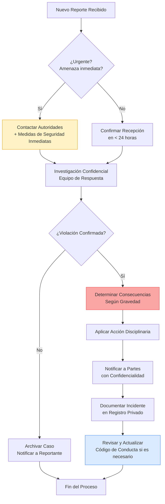

# Código de Conducta del Proyecto Testimonial CMS

## Nuestro Compromiso

En interés de fomentar un entorno abierto y acogedor, nosotros como contribuidores, mantenedores y líderes del proyecto nos comprometemos a hacer de la participación en nuestra comunidad una experiencia libre de acoso para todos, independientemente de la edad, dimensión corporal, discapacidad visible o invisible, etnia, características sexuales, identidad y expresión de género, nivel de experiencia, educación, nivel socioeconómico, nacionalidad, apariencia personal, raza, religión, o identidad y orientación sexual.

Nos comprometemos a actuar e interactuar de maneras que contribuyan a una comunidad abierta, acogedora, diversa, inclusiva y saludable.

## Nuestros Estándares

Ejemplos de comportamientos que contribuyen a crear un ambiente positivo para nuestra comunidad:

- **Demostrar empatía y amabilidad** hacia otras personas
- **Ser respetuoso con diferentes opiniones, puntos de vista y experiencias**
- **Dar y aceptar críticas constructivas con gracia**
- **Asumir responsabilidad y disculparse ante quienes se vean afectados por nuestros errores**, aprendiendo de la experiencia
- **Centrarse en lo que es mejor no solo para nosotros como individuos, sino para la comunidad en general**

Ejemplos de comportamientos inaceptables:

- **El uso de lenguaje o imágenes sexualizados**, y atención o avances sexuales de cualquier tipo
- **Comentarios despectivos** (*trolling*), insultos o comentarios despectivos, y ataques personales o políticos
- **El acoso público o privado**
- **Publicar información privada de otras personas**, como direcciones físicas o electrónicas, sin su permiso explícito
- **Otras conductas que puedan ser razonablemente consideradas como inapropiadas** en un entorno profesional
- **Patrones de exclusión deliberada** de contribuciones válidas sin justificación técnica
- **Uso de poder o autoridad para silenciar críticas legítimas**

## Ámbito de Aplicación

Este Código de Conducta se aplica a todos los espacios del proyecto, incluyendo pero no limitado a:

✅ **Espacios gestionados por el proyecto**:
- Repositorios de código (GitHub) y sus issues/PRs
- Foros de discusión oficiales
- Canales de Discord/Slack oficiales
- Eventos presenciales y virtuales organizados por el proyecto
- Comunicaciones por correo electrónico relacionadas con el proyecto

✅ **Representación pública del proyecto**:
- Cuando un individuo representa oficialmente al proyecto (ej: como mantenedor en conferencias)
- En perfiles públicos que mencionan afiliación al proyecto (ej: "Mantenedor de Testimonial CMS" en redes sociales)

❌ **No aplica a**:
- Interacciones personales no relacionadas con el proyecto
- Comentarios en proyectos no afiliados (a menos que involucren acoso continuo)

## Procedimiento de Reporte

### Cómo Reportar un Incidente

Si presencias o eres víctima de un comportamiento que viola este Código de Conducta:

1. **Para incidentes urgentes o amenazas inmediatas**:
   - Contacta a las autoridades locales: **[Incluir números de emergencia locales según tu país/región]**
   - En eventos presenciales: busca al personal de seguridad del evento

2. **Para reportes no urgentes**:
   - **Email confidencial**: conducta@testimonialcms.com
   - **Formulario anónimo**: https://forms.gle/xxxxxxxxxx (crear un formulario de Google anónimo)
   - **Contacto directo con mantenedores** (solo si te sientes cómodo):
     - Ana García (ana.garcia@testimonialcms.com)
     - Carlos López (carlos.lopez@testimonialcms.com)

3. **Información a incluir en tu reporte**:
   ```markdown
   - Tu nombre (opcional si prefieres anonimato)
   - Fecha y hora aproximada del incidente
   - Descripción detallada de lo ocurrido
   - Personas involucradas (si conoces sus identidades)
   - Capturas de pantalla, enlaces o evidencia relevante
   - Testigos (si los hay)
   - Cualquier otra información que consideres relevante
   ```

### Confidencialidad y Protección

- Todos los reportes se manejan con **máxima confidencialidad**
- Tu identidad **no será revelada** sin tu consentimiento explícito
- Se tomarán medidas para proteger a las personas que reportan de represalias
- Los mantenedores involucrados en el incidente serán recusados del proceso

## Proceso de Aplicación

### Diagrama de Flujo de Respuesta a Incidentes



### Escalas de Consecuencias

| Nivel de Gravedad | Acciones Posibles | Ejemplos |
|-------------------|-------------------|----------|
| **Leve** | - Advertencia privada<br>- Solicitud de disculpa pública<br>- Edición de comentarios | Comentario despectivo aislado, uso inapropiado de lenguaje |
| **Moderada** | - Suspensión temporal (1-4 semanas)<br>- Restricción de privilegios<br>- Supervisión en interacciones | Acoso repetido, publicación de información privada, patrón de exclusión |
| **Grave** | - Suspensión prolongada (1-6 meses)<br>- Remoción de roles de mantenedor<br>- Prohibición de eventos | Amenazas, acoso sistemático, discriminación deliberada |
| **Crítica** | - Prohibición permanente del proyecto<br>- Reporte a autoridades si es ilegal | Amenazas de violencia, acoso sexual, doxxing malicioso |

### Principios del Proceso

- **Imparcialidad**: Los mantenedores involucrados en el incidente serán recusados
- **Proporcionalidad**: Las consecuencias serán proporcionales a la gravedad y contexto
- **Transparencia limitada**: Se informará sobre acciones tomadas sin revelar detalles privados
- **Derecho a apelar**: Cualquier decisión puede ser apelada ante el Comité de Ética (ver sección 7)

## Nuestros Responsables

### Equipo de Respuesta a Incidentes

| Nombre | Rol | Contacto | Disponibilidad |
|--------|-----|----------|----------------|
| **Ana García** | Líder de Comunidad | ana.garcia@testimonialcms.com | Lunes-Viernes 9-18h ART |
| **Carlos López** | Mantenedor Principal | carlos.lopez@testimonialcms.com | Lunes-Viernes 9-18h ART |
| **María Rodríguez** | Representante Externa* | maria.rodriguez@external-ngo.org | 24/7 (solo emergencias) |

*\*Representante externa sin afiliación al proyecto para garantizar imparcialidad*

### Comité de Ética (para apelaciones)

- Dr. Javier Méndez (Universidad Nacional del Nordeste) – Ética y derechos digitales
- Dra. Laura Fernández (Especialista en Derecho Digital)
- [Vacante: Representante de la Comunidad]

## Apelaciones

Si consideras que una decisión tomada bajo este Código de Conducta fue injusta:

1. Envía una apelación por escrito a **apelaciones@testimonialcms.com** dentro de los **14 días** posteriores a la decisión
2. Incluye:
   - Número de caso (si aplica)
   - Razones específicas por las que consideras la decisión injusta
   - Cualquier evidencia adicional relevante
3. El Comité de Ética revisará tu caso y emitirá una decisión final dentro de **30 días**
4. La decisión del Comité de Ética es **final y vinculante**

## Atribución y Licencia

Este Código de Conducta está adaptado del [Contributor Covenant](https://www.contributor-covenant.org), versión 2.1, disponible en [https://www.contributor-covenant.org/version/2/1/code_of_conduct.html](https://www.contributor-covenant.org/version/2/1/code_of_conduct.html).

Las secciones adicionales sobre procedimientos de aplicación, escalas de consecuencias y estructura de gobernanza son propiedad de **Testimonial CMS** y están licenciadas bajo [Creative Commons Attribution 4.0 International](https://creativecommons.org/licenses/by/4.0/).

## 🌍 Traducciones Disponibles

Este Código de Conducta está disponible en los siguientes idiomas:

- 🇪🇸 **Español** (original): [CODE_OF_CONDUCT.md](./CODE_OF_CONDUCT.md)
- 🇬🇧 **English**: [CODE_OF_CONDUCT.en.md](./CODE_OF_CONDUCT.en.md) *(pendiente de traducción)*
- 🇵🇹 **Português**: [CODE_OF_CONDUCT.pt.md](./CODE_OF_CONDUCT.pt.md) *(pendiente de traducción)*

*¿Quieres ayudar a traducir a otro idioma? [Contáctanos](mailto:conducta@testimonialcms.com)*

---

## 📞 Contacto y Soporte

| Propósito | Contacto | Tiempo de Respuesta |
|-----------|----------|---------------------|
| **Reportar incidente** | conducta@testimonialcms.com | < 24 horas |
| **Formulario anónimo** | https://forms.gle/xxxxxxxxxx | < 48 horas |
| **Apelaciones** | apelaciones@testimonialcms.com | < 72 horas |
| **Preguntas generales** | community@testimonialcms.com | < 3 días hábiles |
| **Emergencias (24/7)** | [Incluir número local si aplica] | Inmediato |

---

## 💡 Notas Importantes para Mantenedores

### Implementación Efectiva

1. **Visibilidad**:
   - Enlaza este documento en el README principal
   - Incluye un banner visible en issues/PRs:  
     `⚠️ Al participar, aceptas nuestro [Código de Conducta](CODE_OF_CONDUCT.md)`
   - Menciona el CoC en la plantilla de nuevos issues

2. **Capacitación**:
   - Todos los mantenedores deben completar capacitación anual sobre aplicación del CoC
   - Simulacros de respuesta a incidentes cada 6 meses
   - Documentación interna de casos (anónima) para aprendizaje

3. **Revisión Periódica**:
   - Revisar y actualizar este documento anualmente
   - Solicitar feedback de la comunidad cada 6 meses
   - Alinear con mejores prácticas emergentes (ej: [TODO Group](https://todogroup.org/))

### Ejemplo de Respuesta a Reporte

```markdown
Asunto: Confirmación de Recepción de Reporte #YYYY-001

Hola [Nombre],

Hemos recibido tu reporte sobre un incidente ocurrido el [fecha] en [espacio del proyecto].

Confirmamos que:
✅ Tu reporte ha sido recibido y asignado al Equipo de Respuesta
✅ Tu identidad será mantenida en confidencialidad
✅ Recibirás una actualización dentro de las próximas 24-48 horas

Si necesitas apoyo inmediato, contacta a:
- Línea de ayuda psicológica: +54 11 1234-5678 (24/7, Argentina)
- Centro de apoyo LGBTQ+: [enlace]

Gracias por ayudarnos a mantener nuestra comunidad segura.

Atentamente,
Equipo de Respuesta a Incidentes
Testimonial CMS
```

### Checklist de Implementación para Nuevos Proyectos

Antes de lanzar tu proyecto, verifica:

- [ ] Código de Conducta publicado en raíz del repositorio (`CODE_OF_CONDUCT.md`)
- [ ] Enlace visible en README principal
- [ ] Contactos de reporte configurados y funcionales
- [ ] Formulario anónimo implementado (si aplica)
- [ ] Mantenedores capacitados en procedimientos
- [ ] Plantillas de respuesta preparadas
- [ ] Traducciones disponibles para audiencia objetivo
- [ ] Política de privacidad alineada con CoC
- [ ] Documentación interna de casos creada (acceso restringido)
- [ ] Revisión programada en calendario (anual)

---

## 🌱 Compromiso de Mejora Continua

Nos comprometemos a:

- Revisar este documento **anualmente** con input de la comunidad
- Publicar un **reporte anónimo de transparencia** con estadísticas de incidentes (sin identificar personas)
- Invertir recursos en **capacitación continua** para el Equipo de Respuesta
- Colaborar con otros proyectos de código abierto para **mejorar estándares compartidos**
- Escuchar activamente feedback de grupos históricamente marginados

> "Un Código de Conducta no es solo un documento; es un compromiso vivo con la dignidad humana. Su valor se mide no por su existencia, sino por su aplicación consistente y justa."  
> — Equipo de Testimonial CMS

---

## 📜 Texto para Incluir en README (Opcional pero Recomendado)

```markdown
## 🤝 Código de Conducta

Este proyecto se adhiere a un [Código de Conducta](CODE_OF_CONDUCT.md) diseñado para fomentar una comunidad inclusiva y respetuosa. 

**Esperamos que todos los participantes**:
- Muestren empatía y respeto
- Den y acepten críticas constructivas
- Enfóquense en lo que es mejor para la comunidad

**No toleramos**:
- Acoso de cualquier tipo
- Comentarios despectivos o ataques personales
- Publicación de información privada sin consentimiento

⚠️ **Al contribuir a este proyecto, aceptas cumplir con nuestro [Código de Conducta](CODE_OF_CONDUCT.md).**  
🚨 **Reporta incidentes a: conducta@testimonialcms.com**
```

---

> **Nota final**: Un Código de Conducta efectivo requiere **compromiso genuino de aplicación**. Publicar este documento sin capacidad o voluntad para aplicarlo genera más daño que no tenerlo. Invierte en capacitación, recursos y procesos transparentes. La seguridad de tu comunidad depende de ello.