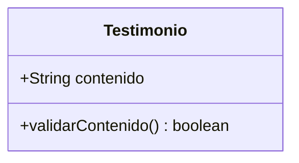
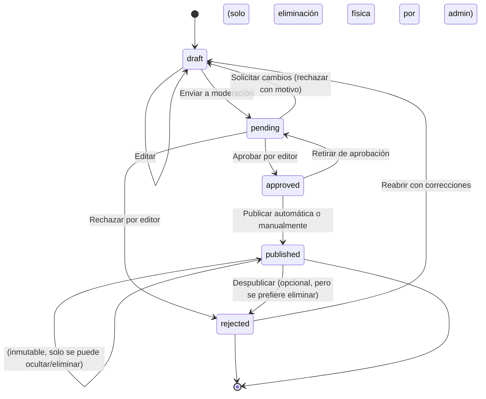
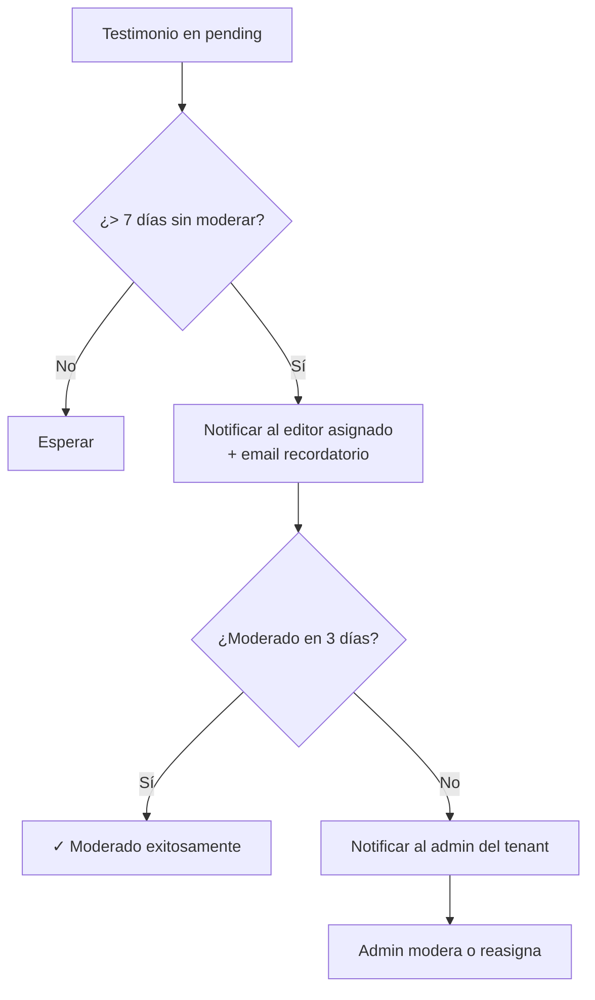
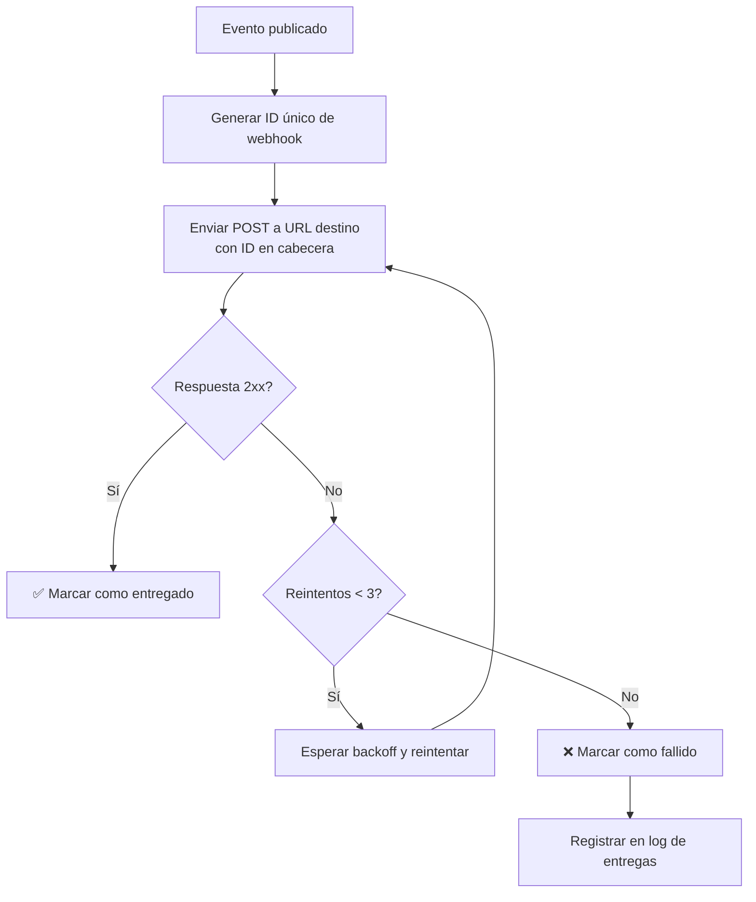
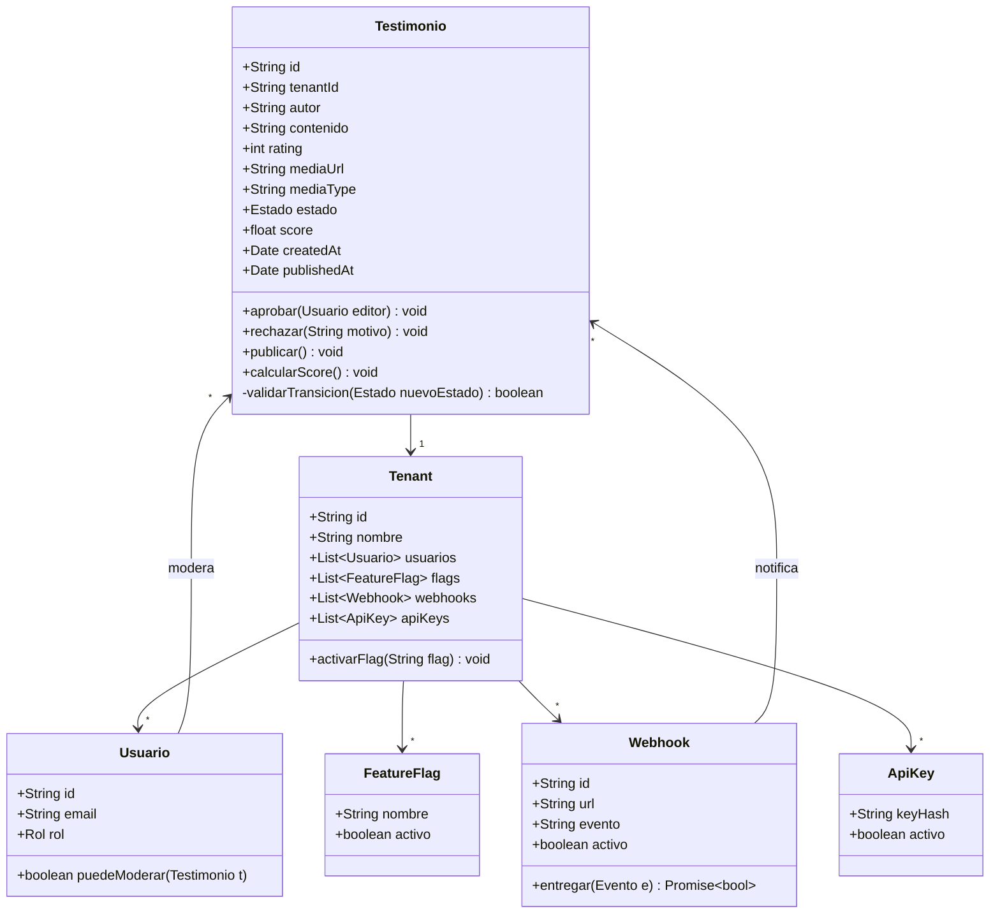

# Reglas de Negocio del Dominio

## 1. Glosario del Dominio (Ubiquitous Language)

| Término | Definición Precisa | Sinónimos Evitados | Contexto de Uso |
|---------|-------------------|-------------------|-----------------|
| **Tenant** | Empresa o institución cliente que utiliza la plataforma para gestionar sus testimonios. Los datos de cada tenant están aislados de los demás. | "Cliente", "Cuenta", "Organización" | Todo el sistema |
| **Testimonio** | Opinión o caso de éxito de un usuario final (autor) sobre un producto o servicio del tenant. Puede incluir texto, imagen o video. | "Reseña", "Review", "Comentario" | Unidad central de negocio |
| **Autor** | Persona que proporciona el testimonio. Puede ser un cliente del tenant. | "Usuario", "Evaluador", "Cliente" | Origen del contenido |
| **Contenido** | Texto principal del testimonio, con una longitud mínima y máxima definida. | "Mensaje", "Texto", "Opinión" | Parte del testimonio |
| **Calificación (Rating)** | Valor numérico de 1 a 5 que expresa el nivel de satisfacción del autor. | "Puntuación", "Estrellas", "Nota" | Métrica de valoración |
| **Estado** | Etapa del ciclo de vida del testimonio: `draft`, `pending`, `approved`, `published`, `rejected`. | "Status", "Fase", "Situación" | Control de workflow |
| **Moderación** | Proceso de revisión por parte de un editor para decidir si un testimonio es apto para publicación. | "Revisión", "Aprobación", "Validación" | Acción de calidad |
| **Editor** | Usuario con permisos para moderar testimonios (crear, editar, aprobar, rechazar). | "Moderador", "Revisor" | Actor del sistema |
| **Admin** | Usuario con permisos totales sobre el tenant, incluyendo gestión de usuarios, API keys, webhooks y feature flags. | "Administrador", "Superusuario" | Actor del sistema |
| **Publicación** | Acción de hacer un testimonio visible públicamente a través de la API o embed. | "Publicar", "Activar", "Mostrar" | Evento clave |
| **Score** | Puntaje numérico calculado automáticamente para ordenar testimonios por relevancia. | "Puntuación de relevancia", "Ranking" | Ordenamiento automático |
| **Webhook** | Notificación HTTP enviada a una URL externa cuando ocurre un evento (ej. `testimonial.published`). | "Callback", "Notificación" | Integración externa |
| **Feature Flag** | Mecanismo para activar o desactivar funcionalidades específicas por tenant sin necesidad de redeploy. | "Toggle", "Switch", "Flag" | Control de despliegue |
| **API Key** | Clave de autenticación para acceder a la API pública en nombre de un tenant. | "Token", "Credencial" | Seguridad de API |

> ⚠️ **Regla crítica**: Nunca usar términos técnicos (ej: "registro", "fila", "entidad") en la definición de reglas de negocio. Siempre usar el lenguaje del dominio.

---

## 2. Categorización de Reglas de Negocio

### 2.1. Reglas de Validación (Validation Rules)

Reglas que determinan si un dato o estado es **válido** según el dominio.

#### 🔴 **BR-VAL-001: Contenido Mínimo del Testimonio**
> **Regla**: Todo testimonio debe tener un contenido de texto con al menos 10 caracteres. No se permiten testimonios vacíos.

**Expresión formal**:
```
contenido ≠ null ∧ contenido.length ≥ 10
```

**Casos de prueba**:
| Entrada | Salida Esperada | Razón |
|---------|-----------------|-------|
| `"Excelente curso, lo recomiendo"` | ✅ Válido | Longitud suficiente |
| `"Bueno"` (5 caracteres) | ❌ Inválido | Menos de 10 caracteres |
| `""` (vacío) | ❌ Inválido | Contenido vacío |
| `null` | ❌ Inválido | Valor nulo |

**Excepciones autorizadas**:
- Ninguna. El contenido mínimo es requerido para garantizar calidad mínima.

**Relación con modelo**:


---

#### 🔴 **BR-VAL-002: Calificación Dentro de Rango**
> **Regla**: La calificación (rating) de un testimonio debe ser un número entero entre 1 y 5 inclusive. No se permiten valores fuera de ese rango.

**Expresión formal**:
```
rating ∈ {1, 2, 3, 4, 5}
```

**Casos de prueba**:
| Entrada | Salida Esperada | Razón |
|---------|-----------------|-------|
| `5` | ✅ Válido | Dentro del rango |
| `3` | ✅ Válido | Dentro del rango |
| `0` | ❌ Inválido | Menor que 1 |
| `6` | ❌ Inválido | Mayor que 5 |
| `null` | ❌ Inválido | Valor nulo |

**Excepciones autorizadas**:
- Ninguna. La calificación es obligatoria y debe ser uno de los valores definidos.

---

#### 🔴 **BR-VAL-003: URL de Video de YouTube Válida**
> **Regla**: Si se proporciona una URL de video, debe ser una URL válida de YouTube y el sistema debe poder extraer metadatos (título, miniatura) a través de la API de YouTube.

**Expresión formal**:
```
videoUrl ≠ null → esUrlYouTubeValida(videoUrl) ∧ puedeObtenerMetadata(videoUrl)
```

**Casos de prueba**:
| Entrada | Salida Esperada | Razón |
|---------|-----------------|-------|
| `"https://www.youtube.com/watch?v=dQw4w9WgXcQ"` | ✅ Válido | URL válida de YouTube |
| `"https://youtu.be/dQw4w9WgXcQ"` | ✅ Válido | URL acortada válida |
| `"https://vimeo.com/123456"` | ❌ Inválido | No es de YouTube |
| `"https://youtube.com/invalid"` | ❌ Inválido | URL mal formada |

**Excepciones autorizadas**:
- Si la API de YouTube no responde, se puede aceptar la URL y almacenarla sin metadatos, pero se marcará para verificación posterior.

---

#### 🔴 **BR-VAL-004: URL de Imagen Subida a Cloudinary**
> **Regla**: Si se adjunta una imagen, debe ser subida a Cloudinary y la URL almacenada debe corresponder a un recurso válido en Cloudinary. No se permiten URLs externas arbitrarias.

**Expresión formal**:
```
imagenUrl ≠ null → dominio = "res.cloudinary.com" ∧ recursoExiste(imagenUrl)
```

**Casos de prueba**:
| Entrada | Salida Esperada | Razón |
|---------|-----------------|-------|
| `"https://res.cloudinary.com/.../image.jpg"` | ✅ Válido | URL de Cloudinary válida |
| `"https://ejemplo.com/imagen.jpg"` | ❌ Inválido | No es de Cloudinary |

**Excepciones autorizadas**:
- Ninguna. Por razones de control y durabilidad, todas las imágenes deben alojarse en Cloudinary.

---

### 2.2. Reglas de Cálculo (Calculation Rules)

Reglas que definen **cómo se computan valores derivados** del dominio.

#### 🔴 **BR-CALC-001: Cálculo del Score de un Testimonio**
> **Regla**: Cada testimonio recibe un score numérico basado en su engagement (views, clicks), calificación y antigüedad. El score se utiliza para ordenar testimonios por relevancia.

**Fórmula**:
```
score = (views * 0.3) + (clicks * 0.5) + (rating * 2) + recencyFactor
donde recencyFactor = exp(-díasDesdePublicación / 30) * 100
```

**Factores**:
| Factor | Peso | Rango Típico |
|--------|------|--------------|
| **Views** | 0.3 por view | 0 - infinito |
| **Clicks** | 0.5 por click | 0 - infinito |
| **Rating** | 2 por punto de rating | 2 - 10 |
| **Recency** | Decaimiento exponencial con constante 30 días | 0 - 100 |

**Ejemplo de cálculo**:
| Testimonio | Views | Clicks | Rating | Días desde publicación | Score | Posición en ranking |
|------------|-------|--------|--------|------------------------|-------|---------------------|
| A | 100 | 10 | 5 | 1 | 100*0.3 + 10*0.5 + 5*2 + exp(-1/30)*100 ≈ 30+5+10+96.7 = 141.7 | 1° |
| B | 50 | 5 | 4 | 30 | 50*0.3 + 5*0.5 + 4*2 + exp(-1)*100 ≈ 15+2.5+8+36.8 = 62.3 | 3° |
| C | 80 | 8 | 5 | 10 | 80*0.3 + 8*0.5 + 5*2 + exp(-10/30)*100 ≈ 24+4+10+71.7 = 109.7 | 2° |

**Decisiones basadas en score**:
- El embed y la API pueden ordenar por `score DESC` cuando se solicita `sort=top`.

---

#### 🔴 **BR-CALC-002: Tiempo Máximo de Entrega de Webhook**
> **Regla**: Un webhook debe ser entregado exitosamente en un plazo máximo de 5 segundos. Si supera ese tiempo, se considera fallido y se reintentará.

**Expresión formal**:
```
tiempoRespuesta ≤ 5000 ms
```

**Acción ante violación**:
- Reintentar con backoff exponencial: 1s, 5s, 30s, 5min, hasta 3 intentos.
- Después de 3 intentos fallidos, marcar como `failed` y registrar en el log de entregas.

---

### 2.3. Reglas de Autorización (Authorization Rules)

Reglas que definen **quiénes pueden realizar qué acciones** en el dominio.

#### 🔴 **BR-AUTH-001: Matriz de Roles y Permisos**

| Operación | Editor | Admin | Visitante (API) |
|-----------|--------|-------|-----------------|
| **Crear testimonio** | ✅ | ✅ | ❌ (solo vía API con key, pero no puede crear, solo leer) |
| **Editar testimonio propio (borrador)** | ✅ | ✅ | ❌ |
| **Moderar (aprobar/rechazar)** | ✅ | ✅ | ❌ |
| **Publicar testimonio** | ✅ (si está aprobado) | ✅ | ❌ |
| **Eliminar testimonio** | ❌ (solo si es propio borrador) | ✅ | ❌ |
| **Gestionar usuarios** | ❌ | ✅ | ❌ |
| **Configurar webhooks** | ❌ | ✅ | ❌ |
| **Gestionar API keys** | ❌ | ✅ | ❌ |
| **Activar feature flags** | ❌ | ✅ | ❌ |
| **Consultar testimonios (GET)** | ✅ | ✅ | ✅ (con API key) |

> **Condiciones específicas**:
- Un editor no puede eliminar un testimonio publicado; solo un admin puede hacerlo (y debe quedar registro).
- Un editor puede editar su propio testimonio en estado `draft`, pero no testimonios de otros editores.

#### 🔴 **BR-AUTH-002: Separación de Duties (SoD) en Moderación**
> **Regla**: El mismo usuario que creó un testimonio no puede moderarlo (aprobarlo o rechazarlo) si el testimonio fue creado por otro usuario. Sin embargo, puede moderar los que él mismo creó si el rol lo permite (esto es aceptable porque el editor es responsable de su contenido). En la práctica, un editor puede moderar cualquier testimonio pendiente, incluyendo los propios, porque se asume que hay confianza. Pero si existiera un rol de "revisor" independiente, se aplicaría la separación. Para nuestro caso, no aplica restricción.

**Nota**: En este sistema, no hay separación estricta; un editor puede moderar sus propios borradores. Si en el futuro se introduce un rol de "revisor" separado, se aplicaría.

---

### 2.4. Reglas de Workflow / Transición de Estados (State Transition Rules)

Reglas que definen **cómo evoluciona el estado** de una entidad a lo largo de su ciclo de vida.

#### 🔴 **BR-WF-001: Máquina de Estados del Testimonio**



**Transiciones permitidas y prohibidas**:

| Estado Actual | Estado Siguiente | ¿Permitido? | Condición Requerida | Actor Autorizado |
|---------------|------------------|-------------|---------------------|------------------|
| **draft** | pending | ✅ Sí | Contenido válido y rating válido | Editor, Admin |
| **draft** | draft | ✅ Sí | Edición | Editor, Admin |
| **pending** | approved | ✅ Sí | Moderación positiva | Editor, Admin |
| **pending** | rejected | ✅ Sí | Moderación negativa (con motivo opcional) | Editor, Admin |
| **pending** | draft | ✅ Sí | Rechazo con solicitud de cambios | Editor, Admin |
| **approved** | published | ✅ Sí | Publicación (puede ser automática si se configura) | Sistema, Editor, Admin |
| **approved** | pending | ✅ Sí | Retirar aprobación (si se detecta error) | Admin |
| **published** | rejected | ⚠️ Condicional | Solo si se requiere despublicar urgentemente (se prefiere eliminar) | Admin |
| **published** | (eliminado) | ✅ Sí | Eliminación lógica (soft delete) | Admin |
| **rejected** | draft | ✅ Sí | Reapertura con correcciones | Editor, Admin |
| **rejected** | [*] | ✅ Sí | Eliminación definitiva (tras período de retención) | Admin |

**Regla crítica de irreversibilidad**:
> Una vez que un testimonio alcanza el estado **published**, no puede volver a `approved` o `pending` sin una acción administrativa explícita (despublicación). La modificación de un testimonio publicado requiere crear una nueva versión (nuevo testimonio) o, en casos excepcionales, que un admin lo despublique, edite y vuelva a publicar, dejando registro.

---

#### 🔴 **BR-WF-002: Tiempo Máximo en Estado Pendiente de Moderación**
> **Regla**: Un testimonio no puede permanecer en estado `pending` por más de 7 días. Pasado ese plazo, se debe notificar al editor responsable y, si persiste, escalar al admin.

**Flujo de escalado**:


**Registro de escalados**:
```json
{
  "testimonio_id": "TST-YYYY-001234",
  "estado": "pending",
  "hora_ingreso": "YYYY-MM-DDT10:00:00Z",
  "escalados": [
    {
      "nivel": 1,
      "hora": "YYYY-MM-DDT10:05:00Z",
      "accion": "NOTIFICACION_EDITOR",
      "destinatario": "editor@cliente.com"
    },
    {
      "nivel": 2,
      "hora": "YYYY-MM-DDT10:10:00Z",
      "accion": "NOTIFICACION_ADMIN",
      "destinatario": "admin@cliente.com"
    }
  ],
  "hora_moderacion_final": "YYYY-MM-DDT09:30:00Z",
  "moderador_final": "admin@cliente.com"
}
```

---

## 3. Reglas Complejas con Combinación de Factores

### 🔴 **BR-COMPLEX-001: Visibilidad de Testimonios Basada en Feature Flags**

> **Regla**: La disponibilidad de ciertas funcionalidades (como webhooks, analítica avanzada, etc.) para un tenant depende del estado de sus feature flags. Si una funcionalidad está desactivada, el sistema debe comportarse como si no existiera (ocultar opciones de UI y rechazar llamadas a endpoints relacionados).

**Fórmula de decisión**:
```
funcionalidadDisponible = flagActivado(tenantId, 'enable_' + funcionalidad)
```

**Ejemplo de aplicación**:
| Tenant | Feature Flag `enable_analytics` | ¿Puede acceder a dashboard de analítica? |
|--------|---------------------------------|-------------------------------------------|
| A | true | ✅ Sí (pestaña visible, endpoints responden) |
| B | false | ❌ No (pestaña oculta, endpoint devuelve 404 o 403) |

**Acción ante violación**:
- Si un usuario intenta acceder a un endpoint de funcionalidad desactivada, debe recibir un error 403 (Forbidden) o 404, con mensaje claro.

---

### 🔴 **BR-COMPLEX-002: Reintentos de Webhooks con Idempotencia**

> **Regla**: Los webhooks deben ser entregados con reintentos automáticos en caso de fallo, pero garantizando idempotencia: el sistema receptor no debe procesar duplicados. Para ello, cada entrega incluye un encabezado `X-Webhook-ID` único.

**Flujo**:


**Requisito de idempotencia**:
- El receptor debe almacenar los IDs de webhook recibidos y descartar duplicados.

---

## 4. Excepciones y Casos Límite Documentados

### 4.1. Excepciones Autorizadas con Justificación

| Regla | Excepción Permitida | Condición de Excepción | Registro Obligatorio |
|-------|---------------------|------------------------|----------------------|
| **BR-VAL-001** (contenido mínimo) | Aceptar contenido de menos de 10 caracteres | Testimonio en video donde el texto es solo un título | Marcar como "video testimonial" y aceptar texto corto |
| **BR-WF-001** (estado publicado) | Editar testimonio publicado sin crear nueva versión | Error tipográfico menor solicitado por el autor | Registrar auditoría de cambio y notificar al admin |

### 4.2. Casos Límite con Comportamiento Definido

| Caso Límite | Comportamiento Esperado | Actor Responsable |
|-------------|------------------------|-------------------|
| **Autor solicita eliminar testimonio publicado** | El admin puede eliminarlo lógicamente (soft delete) y dejar de servirlo en embeds/API en un plazo < 24h. | Admin |
| **Se detecta testimonio falso después de publicado** | El admin puede rechazarlo (cambiar estado a `rejected`) y notificar al cliente. | Admin |
| **La API de YouTube no responde al intentar obtener metadatos** | Se acepta la URL y se guarda, pero se programa un job para reintentar más tarde. | Sistema |
| **Un tenant excede su cuota de webhooks** | Se rechazan nuevas configuraciones de webhook hasta que libere cupo. | Sistema |
| **Un editor intenta aprobar su propio testimonio (sin conflicto)** | Permitido por diseño. | Editor |

---

## 5. Relación con el Modelo de Dominio (DDD)

### 5.1. Entidades y Agregados que Encapsulan Reglas



### 5.2. Servicios de Dominio para Reglas Complejas

| Servicio de Dominio | Responsabilidad | Reglas Encapsuladas |
|---------------------|-----------------|---------------------|
| **ModeradorService** | Orquestar aprobación/rechazo y transiciones de estado | BR-WF-001, BR-AUTH-001 |
| **ScoringService** | Calcular y actualizar scores de testimonios | BR-CALC-001 |
| **WebhookDispatcher** | Gestionar entrega de webhooks con reintentos e idempotencia | BR-CALC-002, BR-COMPLEX-002 |
| **FeatureFlagChecker** | Determinar disponibilidad de funcionalidades por tenant | BR-COMPLEX-001 |

---

## 6. Checklist de Calidad para Reglas de Negocio

### ✅ Claridad y Precisión
- [x] Cada regla está expresada en lenguaje del dominio (no técnico).
- [x] No contiene ambigüedades.
- [x] Incluye expresión formal (pseudo-código o lógica).
- [x] Define comportamiento ante violación.

### ✅ Completitud
- [x] Incluye casos de prueba con datos concretos.
- [x] Documenta excepciones autorizadas con condiciones explícitas.
- [x] Cubre casos límite relevantes.
- [x] Especifica actor responsable.

### ✅ Trazabilidad
- [x] Cada regla tiene identificador único (BR-VAL-001, etc.).
- [x] Relaciona con entidades del modelo de dominio.
- [x] Vincula a user stories o requisitos del PRD (implícitamente).
- [x] Incluye referencia normativa cuando aplica (leyes de protección de datos, etc.).

### ✅ Ejecutabilidad
- [x] La regla puede traducirse a validaciones automatizadas (tests unitarios).
- [x] No depende de implementación técnica específica.
- [x] Es invariante (no cambiará con cada iteración del producto).
- [x] Puede ser auditada posteriormente (registro de decisiones).

---

> **Nota final**: Las reglas de negocio son el **corazón del modelo de dominio**. Si una regla no puede expresarse claramente en lenguaje del negocio, no está lista para ser implementada. Revisa este documento con expertos de dominio antes de cada ciclo de desarrollo — es tu contrato con la realidad del negocio.