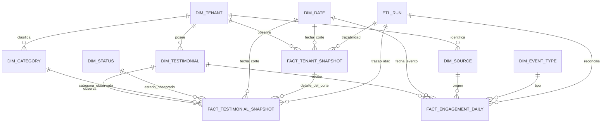

# Diccionario dimensional: Testimonial DW

**Fecha:** 2026-10-09. **Estado:** modelo temporal implementado y probado en PostgreSQL descartable; no aplicado a bases persistentes.

**Motor:** PostgreSQL 18, base `testimonial_dw` en instancia separada.

**Decisión:** [ADR 0004](../adr/0004-warehouse-postgresql-separado.md).

**DDL preparado:** [base 0001](../../apps/api/warehouse/migrations/0001_initial.sql), [expansión 0002](../../apps/api/warehouse/migrations/0002_snapshot_time_expand.sql), [cierre 0003](../../apps/api/warehouse/migrations/0003_snapshot_time_constraints.sql) y [control 0004](../../apps/api/warehouse/migrations/0004_bi_operations.sql), 20 tablas al aplicar la cadena completa entre `staging`, `dw` y `etl`. No acredita migraciones persistentes. El [borrador inicial](../plan/2026-10-08_feat-foto-empresa-bi_warehouse-borrador.sql) conserva el diagnóstico histórico. [Operación ETL](../operations/17_business_intelligence_etl.md) y [migración temporal](../operations/19_bi_snapshot_time_migration.md).

## Entidades, claves y granularidad

Los IDs fuente son UUID de identidades técnicas; no incorporar identidades de autores ni usuarios. Las dimensiones de empresa/testimonio usan esos IDs estables. Categoría, origen y tipo usan claves surrogate `bigint` locales. Toda relación entre recursos propios lleva `tenant_id`. Las dimensiones compartidas de calendario, estado y tipo no representan datos privados de otro tenant.

| Tabla | Clave / granularidad | Campos y significado |
| --- | --- | --- |
| `dw.dim_date` | PK `date_key: date` | Fecha UTC; año, trimestre, mes y día derivados. Insertar las fechas presentes en hechos; completar días vacíos en respuesta, no mediante hechos ficticios. |
| `dw.dim_tenant` | PK `tenant_id: uuid` | `name`, `is_active`, `updated_at`. Nombre actual publicado, no slug ni logo. |
| `dw.dim_testimonial` | PK `(tenant_id, testimonial_id)` | Identidad técnica y `is_present` en la última carga publicada. Preservar dimensión si desaparece del origen para no romper snapshots históricos. |
| `dw.dim_category` | PK `category_key: bigint`; UNIQUE `(tenant_id, category_key)` y UNIQUE NULLS NOT DISTINCT `(tenant_id, source_category_id)` | Nombre actual, `is_present`; una categoría con fuente NULL representa «Sin categoría» por tenant. Dimensiones retiradas se conservan para historia. |
| `dw.dim_status` | PK `status_code: text` | Código estable del catálogo operacional; no asumir coincidencia de IDs autoincrementales entre servidores. |
| `dw.dim_source` | PK `source_key: bigint`; UNIQUE `(tenant_id, source_key)` y `(tenant_id, code)` | Origen técnico de interacción, propio de una empresa. No convertirlo en identidad de visitante. |
| `dw.dim_event_type` | PK `event_type_key: bigint`; UNIQUE `code` | Código de tipo de evento; el panel contabiliza `view`, `click`, `play`. |
| `dw.fact_testimonial_snapshot` | PK `(tenant_id, run_id, testimonial_id)` | Una fila por testimonio observado en un corte exitoso. `snapshot_at: timestamptz(3) NOT NULL` y `snapshot_date_key: date NOT NULL`, FK directa a calendario. Categoría, estado, rating 1–5, score numeric(10,4), creación, publicación opcional y booleanos de imagen/video. |
| `dw.fact_tenant_snapshot` | PK `(tenant_id, run_id)`; UNIQUE `(tenant_id, run_id, snapshot_at, snapshot_date_key)` | Una cabecera por empresa/corte publicado, incluso vacío. `snapshot_at: timestamptz(3)`, `snapshot_date_key: date` FK a calendario, `published_at: timestamptz(3)` terminal y `testimonial_count: bigint >= 0`; todos NOT NULL. FK a tenant y a `(tenant_id, id)` del run. |
| `dw.fact_engagement_daily` | PK `(tenant_id, testimonial_id, date_key, source_key, event_type_key)` | Cantidad `bigint > 0` de eventos disponibles en origen. Referencia `last_reconciled_run_id` para trazabilidad de la carga que reemplazó la serie. |
| `etl.runs` | PK `id: uuid`; UNIQUE `(tenant_id, slot_at, attempt_no)` | Intento de carga: `running/succeeded/failed/abandoned`, inicio/fin, corte fuente, cantidades de origen/destino y código de error técnico. Un índice parcial permite sólo un éxito por empresa y hora. |
| `etl.tenant_load_state` | PK `tenant_id` | Lease `(lease_run_id, lease_token, lease_until)` y `last_published_run_id`. Pointer durable del corte vigente, incluso con cero testimonios/eventos. |
| `etl.schema_migrations` | PK `version: text` | Checksum SHA-256 del archivo aplicado y fecha de aplicación; ledger propio del migrador DW, sin acceso de escritura para runtime. |
| `etl.tenant_settings` | PK `tenant_id` | Frecuencia 1/6/24h UTC, pausa, próxima ejecución, alertas/tolerancia y versión de preferencias. Sin FK a dim_tenant para configurar antes del primer corte. |
| `etl.load_requests` | PK `id`; UNIQUE `(tenant_id,id)` y clave por tenant/actor | Solicitud durable manual/retry, hora/expiración, estado/fechas y referencia al run fallido. Un índice parcial admite sólo una solicitud activa por empresa. |
| `etl.control_audit` | PK `id`; historial por tenant/fecha | Acción, actor UUID técnico, instante y referencias/configuración permitidas; sin texto libre. Append-only para la identidad de control, sin acceso de escritura del worker. |
| `etl.worker_health` | PK `worker_id` | Protocolo, inicio, última señal y parada; inventario técnico del servicio. Nunca exponer IDs de workers al navegador. |

0004 amplía runs con origen `legacy/scheduled/cli/manual/retry`, `request_id` con FK compuesta tenant/solicitud/tipo/hora, fase y fin de extracción. Totales desconocidos se representan como NULL en el contrato, no como cero; [detalle de control](../modules/api-bi-operations.md). El esquema analítico dw conserva su modelo dimensional; estas cuatro tablas etl son control operacional.

`slot_at` es el inicio de la hora UTC que identifica la ejecución. `source_snapshot_at` es el instante real observado al abrir la transacción fuente; nunca se presenta la hora redondeada como instante exacto del snapshot. La base exige el slot UTC y un corte fuente dentro de él. Reintentos de una hora sólo se admiten mientras sigan dentro de esa hora; si ya pasó, se marca el intento fallido/abandonado y se observa la hora corriente.

`run_id` conserva trazabilidad; no es la fuente temporal de las consultas del dashboard. Cabecera y detalles comparten `snapshot_at` y su fecha UTC mediante FK compuesta `(tenant_id, run_id, snapshot_at, snapshot_date_key)`. CHECK exige `snapshot_date_key = (snapshot_at AT TIME ZONE 'UTC')::date`, sin defaults que inventen observaciones. `published_at` de cabecera coincide con el `finished_at` terminal del run, después de limpiar staging; no representa el instante exacto de COMMIT.

Un corte exitoso siempre tiene cabecera. Con cero testimonios tiene cantidad 0 y ningún detalle; una hora no observada no tiene cabecera. La igualdad de cantidad y detalles se verifica mediante publicación atómica/conciliación, no mediante un CHECK de fila. Se conservan las FK a `etl.runs`; este diseño no autoriza purgar el ledger referenciado.

## Staging permitido

Las filas staging se vinculan a `(tenant_id, run_id)` y nunca son consultadas por la API BI. La carga valida duplicados, referencias y cantidades antes de publicar.

| Tabla | Datos de origen autorizados |
| --- | --- |
| `staging.categories` | `tenant_id`, `run_id`, categoría UUID y nombre. |
| `staging.testimonials` | Tenant/run, testimonio UUID, categoría UUID opcional, estado por código, rating, score, creación, publicación, booleanos de medios. |
| `staging.analytics_events` | Tenant/run, evento `bigint`, testimonio UUID, código de tipo, origen y timestamp. |

`source` operacional es texto libre. En la consulta de extracción usar CASE que conserve sólo `public`, `public-browser`, `api`, `widget`; cualquier otro valor se transforma en `other` antes de viajar al destino. No guardar el valor original, ni registrar fuentes desconocidas en logs. La dimensión tenant-scoped conserva únicamente ese catálogo técnico; el desglose por origen pierde etiquetas personalizadas deliberadamente.

La identidad y nombre de la empresa se leen junto con su corte; el nombre se actualiza en la misma publicación que los hechos. Datos staging se eliminan al publicar o abandonar una ejecución. Datos de una ejecución `running` con lease vigente no se purgan.

## Relaciones

## Semántica y borrados

- Snapshots: hechos aditivos entre testimonios del mismo corte; **no aditivos en el tiempo**. Para evolución diaria, seleccionar una cabecera por fecha y tenant, la de mayor `snapshot_at`, con desempate estable por `run_id`. La cabecera es un hecho agregado; el modelo conserva dimensiones conformadas y no es una arquitectura medallón.
- Interacciones: conteos diarios por fecha del evento en UTC; reconciliación completa reemplaza la serie de la empresa con el estado disponible en origen. No existe promesa de conteos históricos que el origen ya no conserva.
- CTR: dividir la suma de clics por la suma de vistas del rango; no promediar CTR por día. Cero vistas da NULL, presentado como «Sin datos».
- Categorías: distribución actual tomada del último snapshot completo. La categoría observada en cada corte conserva su identidad; un cambio de nombre se refleja con el nombre actual.
- Empresa vacía: inventario cero, rating NULL y distribuciones vacías; actualización conocida mediante cabecera. Engagement es independiente del inventario y conserva los eventos disponibles del rango; CTR es NULL sólo sin vistas. Empresa nunca cargada: metadatos de carga NULL, estado `not_loaded`.
- Desaparición de testimonios: la dimensión queda `is_present=false`, el próximo snapshot no contiene ese testimonio; los snapshots anteriores se conservan. Borrados de eventos se reflejan al reconciliar interacciones.
- Una eliminación legal/expresa de historia requiere un procedimiento específico de purga y tratamiento de respaldos. El borrado operacional no dispara una purga implícita.
- No copiar tags en v1: agregarlas como puente sin regla de agregación podría multiplicar métricas al hacer joins. No hay sentimiento, embeddings, visitantes únicos, ventas ni predicciones en este modelo.

## Índices y crecimiento

Las PK/UNIQUE cubren identidades y acceso por tenant/run. 0001 conserva el índice `(tenant_id, date_key)` de engagement y el índice parcial de runs exitosos `(tenant_id, source_snapshot_at DESC, id)` para control técnico. Dashboard ya no usa ese índice de runs. La evaluación temporal compara índices de cabecera y detalle por fecha en bases descartables; no se añade un índice sin justificar costo y acceso en el entorno objetivo. No retirar índices existentes por esta separación. Calendar FK inversa y purgas globales deben medirse específicamente: un prefijo tenant no garantiza acceso eficiente por fecha para todo el warehouse.

No hay retención automática inicial. Medir filas, bytes y duración por carga; el historial horario crece con la cantidad de testimonios multiplicada por los cortes exitosos.
