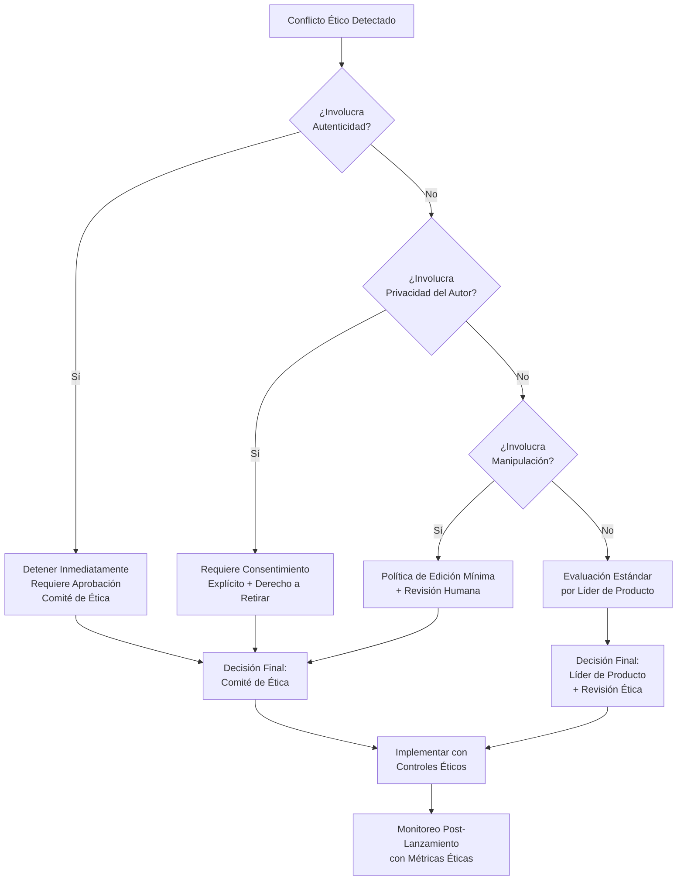
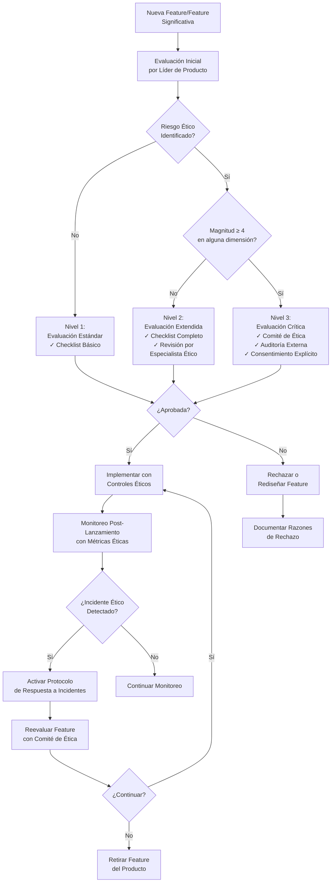

# Marco Ético de Testimonial CMS

## 🎯 Propósito del Documento

Este documento define el **marco ético formal** del proyecto: principios fundamentales, procedimientos de evaluación ética, gobernanza y responsabilidades para garantizar que todas las decisiones técnicas, de producto y de negocio respeten la dignidad, privacidad y derechos de los usuarios que comparten sus historias, así como la confianza de quienes consumen esos testimonios.

> 💡 **Diferencia clave**:
> - **`ethics.md`** (este documento): Define el *marco ético normativo* y *procedimientos de evaluación ética* (gobierno del proyecto)
> - **`code_of_conduct.md`** (`community/`): Define *comportamiento interpersonal* en la comunidad
> - **`privacy_policy.md`** (`governance/`): Define *manejo de datos personales* de autores y visitantes
> - **`content_moderation_guidelines.md`** (`product/`): Define *criterios de moderación* de testimonios

> ✅ **Regla moderna**: La ética no es un "extra" — es un **requisito no funcional obligatorio**. Si una feature no pasa evaluación ética, no debe ser desarrollada, independientemente de su viabilidad técnica o potencial de ingresos.

---

## 📋 Tabla de Contenidos

- [Visión Ética y Principios Fundamentales](#visión-ética-y-principios-fundamentales)
- [Marco de Evaluación Ética](#marco-de-evaluación-ética)
- [Dilemas Éticos Específicos del Dominio](#dilemas-éticos-específicos-del-dominio)
- [Procedimiento de Evaluación Ética para Nuevas Features](#procedimiento-de-evaluación-ética-para-nuevas-features)
- [Gobernanza Ética y Responsabilidades](#gobernanza-ética-y-responsabilidades)
- [Casos de Estudio y Ejemplos Concretos](#casos-de-estudio-y-ejemplos-concretos)
- [Checklist de Evaluación Ética](#checklist-de-evaluación-ética)
- [Recursos y Referencias](#recursos-y-referencias)

---

## Visión Ética y Principios Fundamentales

### Declaración de Visión Ética

> **"Autenticidad con Respeto"**: En Testimonial CMS, creemos que los testimonios son expresiones de confianza entre personas y organizaciones. Nuestro propósito es construir una plataforma que amplifique voces reales sin manipulación, proteja la privacidad de quienes comparten sus historias, y promueva la transparencia para quienes las leen. La eficiencia nunca justifica la deshonestidad; la innovación nunca justifica el engaño.

### Principios Éticos Fundamentales (Orden de Prioridad)

| Principio | Definición Operativa | Aplicación en Testimonial CMS | Prioridad |
|-----------|----------------------|-------------------------------|-----------|
| **1. Autenticidad** | Garantizar que los testimonios reflejen experiencias reales, no fabricadas o coercionadas | Prohibir testimonios falsos o pagados no declarados; requerir verificación de autoría cuando sea posible | 🔴 Crítico |
| **2. Privacidad del Autor** | Respetar el control del autor sobre sus datos personales y su historia | Consentimiento explícito para publicación; derecho a retirar testimonio en cualquier momento | 🔴 Crítico |
| **3. No Manipulación** | Evitar ediciones que alteren el significado o contexto original del testimonio | Política de edición mínima (solo correcciones ortográficas con aprobación); prohibir cambios de sentido | 🔴 Crítico |
| **4. Transparencia Algorítmica** | Explicabilidad de decisiones automatizadas (scoring, recomendación) | "Derecho a una explicación" para autores sobre por qué su testimonio tiene cierto score | 🟠 Alto |
| **5. Equidad en Visibilidad** | Evitar sesgos en la promoción de testimonios (por género, raza, etc.) | Auditorías periódicas del scoring y del orden de visualización | 🟠 Alto |
| **6. Consentimiento Informado** | Asegurar que los autores entiendan cómo y dónde se usarán sus testimonios | Explicación clara de alcance (web, embeds, API) antes de publicar | 🔴 Crítico |
| **7. Derecho al Olvido** | Permitir que los autores eliminen sus testimonios incluso después de publicados | Mecanismo de eliminación accesible; propagación a todos los embeds dentro de 24h | 🟠 Alto |
| **8. Responsabilidad del Cliente** | Los clientes (empresas) son responsables del uso que den a los testimonios | Cláusulas contractuales que prohíben uso engañoso; facultad de Testimonial CMS de retirar contenido abusivo | 🟡 Medio |

### Jerarquía de Conflictos Éticos



---

## Marco de Evaluación Ética

### Matriz de Impacto Ético (EIM - Ethical Impact Matrix)

Para cada feature o cambio técnico significativo, completar esta matriz:

| Dimensión Ética | Impacto Esperado (+/-) | Magnitud (1-5) | Mitigaciones Propuestas | Responsable de Mitigación |
|-----------------|------------------------|----------------|-------------------------|---------------------------|
| **Autenticidad** | | | | |
| **Privacidad del Autor** | | | | |
| **Manipulación** | | | | |
| **Transparencia** | | | | |
| **Equidad en Visibilidad** | | | | |
| **Consentimiento** | | | | |
| **Derecho al Olvido** | | | | |
| **Responsabilidad del Cliente** | | | | |

**Escala de Magnitud**:
- **1**: Impacto mínimo, fácilmente mitigable
- **2**: Impacto leve, requiere monitoreo
- **3**: Impacto moderado, requiere controles específicos
- **4**: Impacto significativo, requiere aprobación de Comité de Ética
- **5**: Impacto crítico, potencialmente prohibido por principios éticos

### Proceso de Evaluación Ética por Nivel de Riesgo



---

## Dilemas Éticos Específicos del Dominio

### 1. Moderación de Testimonios y Libertad de Expresión

#### Dilema
¿Hasta qué punto debe la plataforma (o el cliente) editar o rechazar testimonios sin violar la libertad de expresión del autor? ¿Quién define los límites de lo "aceptable"?

#### Marco de Decisión Ética

```typescript
// ethics/decision-frameworks/content-moderation.ts

interface ModerationDecision {
  action: 'APPROVE' | 'REJECT' | 'REQUEST_CHANGES';
  reason: string;
  ethicalBasis: string;
  appealAvailable: boolean;
}

export function evaluateModeration(
  testimonial: Testimonial,
  clientGuidelines: ModerationGuidelines,
  platformPrinciples: EthicalPrinciple[]
): ModerationDecision {
  // Regla 1: Testimonios falsos o fraudulentos son siempre rechazados
  if (isLikelyFake(testimonial)) {
    return {
      action: 'REJECT',
      reason: 'Testimonio identificado como potencialmente falso o fraudulento',
      ethicalBasis: 'PRINCIPIO_DE_AUTENTICIDAD',
      appealAvailable: true
    };
  }
  
  // Regla 2: Discurso de odio o discriminación es siempre rechazado
  if (containsHateSpeech(testimonial.content)) {
    return {
      action: 'REJECT',
      reason: 'El testimonio contiene lenguaje discriminatorio',
      ethicalBasis: 'PRINCIPIO_DE_EQUIDAD',
      appealAvailable: false // No se permite apelar discurso de odio
    };
  }
  
  // Regla 3: Ediciones solo por claridad, nunca por cambio de sentido
  if (clientGuidelines.allowEditing) {
    const changes = proposeEdits(testimonial);
    if (changes.altersMeaning) {
      return {
        action: 'REQUEST_CHANGES',
        reason: 'Las ediciones propuestas alterarían el significado original',
        ethicalBasis: 'PRINCIPIO_DE_NO_MANIPULACION',
        appealAvailable: true
      };
    }
  }
  
  // Regla 4: Si el cliente tiene políticas más restrictivas que la plataforma,
  // se debe informar al autor antes de rechazar
  if (clientGuidelines.restrictionsExceedPlatform(testimonial)) {
    return {
      action: 'REQUEST_CHANGES',
      reason: 'El testimonio no cumple con las políticas específicas de la empresa',
      ethicalBasis: 'PRINCIPIO_DE_RESPONSABILIDAD_DEL_CLIENTE',
      appealAvailable: true
    };
  }
  
  // Por defecto, aprobar
  return {
    action: 'APPROVE',
    reason: 'Cumple con todos los criterios éticos y de plataforma',
    ethicalBasis: 'PRINCIPIO_DE_AUTENTICIDAD',
    appealAvailable: false
  };
}
```

#### Caso de Estudio: Testimonio Negativo pero Verídico

**Situación**: Un cliente (empresa) solicita eliminar un testimonio negativo pero verídico sobre su servicio, argumentando que daña su reputación.

**Evaluación Ética**:
| Dimensión | Impacto | Magnitud | Mitigación |
|-----------|---------|----------|------------|
| Autenticidad | + (el testimonio es real) | 1 | Mantener el testimonio |
| Privacidad del Autor | + (el autor consintió) | 1 | Confirmar que el autor sigue queriendo que se publique |
| Manipulación | - (presión para eliminar) | 4 | **Prohibir**: no se puede eliminar un testimonio verídico solo por presión comercial |
| Equidad | + (dar voz a experiencias negativas) | 2 | - |
| Responsabilidad del Cliente | - (cliente intenta censurar) | 4 | Recordar al cliente sus obligaciones contractuales |

**Decisión del Comité de Ética**:
> ✅ **Mantener el testimonio**.
> - El cliente debe aceptar que los testimonios negativos también forman parte de la autenticidad.
> - Solo se eliminaría si el autor lo solicita (derecho al olvido) o si se demuestra que es falso.
> - Se ofrece al cliente la posibilidad de responder públicamente al testimonio, pero no de eliminarlo.

---

### 2. Scoring de Testimonios y Posible Sesgo

#### Dilema
El algoritmo de scoring (que ordena testimonios por relevancia) podría favorecer ciertos tipos de testimonios (los más positivos, los de ciertos grupos demográficos) y perjudicar otros, creando una visión distorsionada.

#### Análisis Ético

```typescript
// ethics/prioritization/scoring-bias.ts

export class EthicalScoringValidator {
  /**
   * Valida que el algoritmo de scoring no introduzca sesgos indebidos
   */
  validateScoringAlgorithm(algorithm: ScoringAlgorithm): ValidationResult {
    // Lista BLANCA: Factores permitidos
    const allowedFactors = [
      'RECENCY',          // Actualidad (decaimiento natural)
      'ENGAGEMENT',       // Clics, vistas (interés genuino)
      'RATING',           // Calificación dada por el autor
      'AUTHOR_REPUTATION' // Opcional: reputación previa del autor (con consentimiento)
    ];
    
    // Lista NEGRA: Factores prohibidos
    const prohibitedFactors = [
      'AUTHOR_GENDER',     // Género del autor
      'AUTHOR_AGE',        // Edad
      'AUTHOR_LOCATION',   // Ubicación geográfica
      'SENTIMENT_POSITIVITY', // Favorecer solo lo positivo
      'CLIENT_PAYMENT',    // Priorizar testimonios de clientes que pagan más
      'CONTENT_LENGTH'     // Longitud del texto (irrelevante)
    ];
    
    // Lista GRIS: Factores condicionales
    const conditionalFactors = {
      'AUTHOR_VERIFICATION': {
        allowed: true,
        conditions: [
          'Solo para indicar autenticidad, no para priorizar',
          'Nunca despriorizar autores no verificados'
        ]
      }
    };
    
    // Verificar factores del algoritmo
    for (const factor of algorithm.factors) {
      if (allowedFactors.includes(factor)) continue;
      if (prohibitedFactors.includes(factor)) {
        return {
          valid: false,
          reason: `Factor prohibido: ${factor}`,
          principleViolated: 'EQUIDAD'
        };
      }
      if (factor in conditionalFactors) {
        // Aplicar condiciones
      }
    }
    
    return { valid: true };
  }
  
  /**
   * Auditoría periódica de sesgo en los resultados
   */
  async auditScoringBias(): Promise<BiasReport> {
    const testimonials = await this.getRecentTestimonials();
    const groupedByAuthorDemographics = this.groupByDemographics(testimonials);
    
    const report: BiasReport = {
      timestamp: new Date(),
      metrics: {},
      alerts: []
    };
    
    // Verificar que testimonios de diferentes grupos tengan visibilidad similar
    for (const [demographic, group] of Object.entries(groupedByDemographics)) {
      const averageScore = group.reduce((sum, t) => sum + t.score, 0) / group.length;
      report.metrics[demographic] = averageScore;
      
      // Comparar con el promedio general
      const globalAverage = testimonials.reduce((sum, t) => sum + t.score, 0) / testimonials.length;
      if (Math.abs(averageScore - globalAverage) > 0.2) {
        report.alerts.push({
          demographic,
          averageScore,
          globalAverage,
          deviation: averageScore - globalAverage,
          severity: 'MEDIUM'
        });
      }
    }
    
    return report;
  }
}
```

#### Decisión Ética Formal:
> **Requerido**:
> - El algoritmo de scoring debe basarse únicamente en factores objetivos y no discriminatorios (engagement, recencia, rating).
> - Se debe realizar una auditoría de sesgo trimestral y publicar un resumen público.
> - Los clientes deben poder ver por qué un testimonio tiene cierto score (explicabilidad).

---

### 3. Uso de Datos de Autores para Mejorar el Algoritmo

#### Dilema
¿Es ético utilizar los datos de los autores (como sus clics, tiempo de lectura, etc.) para mejorar el algoritmo de scoring, sin su consentimiento explícito para ese fin?

#### Análisis Ético

| Argumento A Favor | Argumento en Contra | Evaluación |
|-------------------|---------------------|------------|
| "Mejora la experiencia de todos los usuarios" | Viola la autonomía del autor al usar sus datos sin consentimiento específico | ⚠️ El consentimiento para publicar no implica consentimiento para análisis de comportamiento |
| "Los datos están agregados, no se identifican individualmente" | La agregación no elimina la necesidad de consentimiento para nuevos usos | ❌ Violación del principio de consentimiento informado |
| "Es estándar en la industria" | El estándar industrial no es estándar ético | ❌ Falacia de apelación a la normalidad |

**Decisión Ética Formal**:
> **Requerido**:
> - Obtener consentimiento explícito y separado para el uso de datos de comportamiento (clics, vistas) en la mejora de algoritmos.
> - Ofrecer la opción de "no participar" sin penalización (el testimonio se sigue publicando igual).
> - Anonimizar los datos antes de cualquier análisis interno.

---

## Procedimiento de Evaluación Ética para Nuevas Features

### Checklist de Evaluación Ética Obligatoria

Antes de aprobar cualquier feature para desarrollo, el Product Manager debe completar:

#### Nivel 1: Screening Rápido (Todos los Features)

- [ ] **Autenticidad**: ¿La feature podría facilitar la creación de testimonios falsos o engañosos?
- [ ] **Privacidad**: ¿Recopila datos personales adicionales de los autores? ¿Se informa claramente?
- [ ] **Consentimiento**: ¿Requiere un nuevo consentimiento de los autores para su uso?
- [ ] **Manipulación**: ¿Permite ediciones que podrían alterar el significado original?
- [ ] **Transparencia**: ¿Los autores y lectores entenderán cómo funciona?
- [ ] **Equidad**: ¿Podría discriminar o favorecer injustamente ciertos testimonios?
- [ ] **Derecho al olvido**: ¿Dificulta la eliminación de testimonios ya publicados?
- [ ] **Responsabilidad del cliente**: ¿Delega decisiones éticas en el cliente sin supervisión?

#### Nivel 2: Evaluación Extendida (Features con Riesgo ≥ 3)

Además del Nivel 1, completar:

- [ ] **Impacto en Grupos Vulnerables**: ¿Cómo afecta a autores con menos recursos, menor educación digital?
- [ ] **Sesgo Algorítmico**: ¿Se ha auditado el algoritmo con datos diversos?
- [ ] **Explicabilidad**: ¿Se puede explicar a un autor por qué su testimonio tiene cierto tratamiento?
- [ ] **Mecanismo de Apelación**: ¿Los autores pueden cuestionar decisiones automatizadas?
- [ ] **Revisión Humana**: ¿Hay supervisión humana para decisiones críticas?

#### Nivel 3: Evaluación Crítica (Features con Riesgo ≥ 4)

Además del Nivel 2, requerir:

- [ ] **Revisión por Comité de Ética**: Documento formal de evaluación aprobado
- [ ] **Auditoría Externa Independiente**: Informe de terceros
- [ ] **Prueba Piloto Controlada**: Implementación limitada con monitoreo intensivo
- [ ] **Botón de "Apagado"**: Mecanismo para desactivar la feature rápidamente
- [ ] **Transparencia Pública**: Publicación de evaluación ética (con información sensible removida)

### Formulario de Evaluación Ética

```yaml
# ethics/evaluations/feature-evaluation-template.yml

feature:
  id: "FEAT-YYYY-001"
  name: "Scoring Automático de Testimonios"
  description: "Algoritmo que asigna un puntaje a cada testimonio para ordenarlos por relevancia"
  proposer: "ana@testimonialcms.com"
  date_proposed: "YYYY-MM-DD"
  business_priority: "HIGH"

ethical_evaluation:
  level: "LEVEL_2"  # LEVEL_1 | LEVEL_2 | LEVEL_3
  
  screening:
    authenticity_risk: false
    privacy_risk: true  # Usa datos de clics
    explicit_consent_required: true
    manipulation_risk: false
    transparency_provided: true
    equity_risk: true
    right_to_forget_risk: false
    client_responsibility_delegated: false
  
  extended_assessment:
    vulnerable_groups_impact: "MEDIUM"
    bias_audit_completed: true
    bias_audit_report: "https://ethics.testimonialcms.com/audits/bias-YYYY-001.pdf"
    explainability_mechanism: "SHAP values for each score"
    appeal_mechanism_available: true
    human_oversight: true
  
  critical_assessment:  # Solo si level: LEVEL_3
    ethics_committee_approval: false
    ethics_committee_date: null
    external_audit_completed: false
    external_audit_report: null
    pilot_program_planned: false
    emergency_kill_switch: false
    public_transparency_commitment: true
  
  risks_identified:
    - type: "ENGAGEMENT_BIAS"
      description: "El algoritmo podría favorecer testimonios más extremos (muy positivos o muy negativos) porque generan más clics"
      mitigation: "Incluir factor de recencia y rating para balancear"
      severity: "MEDIUM"
      owner: "carlos@testimonialcms.com"
    
    - type: "AUTHOR_DISCOMFORT"
      description: "Autores podrían sentirse presionados si su testimonio tiene bajo score"
      mitigation: "No mostrar score a los autores (solo a clientes); educación sobre qué factores influyen"
      severity: "MEDIUM"
      owner: "ana@testimonialcms.com"
  
  decision:
    status: "APPROVED_WITH_CONDITIONS"  # APPROVED | APPROVED_WITH_CONDITIONS | REJECTED | PENDING
    conditions:
      - "Incluir auditoría trimestral de sesgo"
      - "Publicar documentación explicativa del scoring"
      - "Permitir a los autores solicitar revisión manual si creen que su score es injusto"
    approved_by: "ethics-committee@testimonialcms.com"
    approved_date: "YYYY-MM-DD"
    effective_date: "YYYY-MM-DD"
    review_date: "YYYY-MM-DD"
```

---

## Gobernanza Ética y Responsabilidades

### Estructura de Gobernanza Ética

```mermaid
flowchart TD
    A[Junta Directiva / CEO] --> B[Comité de Ética<br>Independiente]
    
    B --> C[Líder de Ética<br>de Producto]
    B --> D[Líder de Ética<br>Técnica]
    B --> E[Representante de Autores<br>(externo)]
    B --> F[Representante de Clientes<br>(externo)]
    
    C --> G[Product Managers]
    D --> H[Engineering Leads]
    E --> I[Panel de Autores]
    F --> J[Consejo de Clientes]
    
    G --> K[Features Propuestas]
    H --> K
    I --> K
    J --> K
    
    K --> L{Evaluación Ética<br>Nivel 1/2/3}
    L --> M[Decisión Final]
    
    M --> N[Implementación<br>con Controles Éticos]
    N --> O[Monitoreo Continuo<br>con Métricas Éticas]
    O --> P{¿Incidente Ético?}
    
    P -->|Sí| Q[Protocolo de<br>Respuesta a Incidentes]
    Q --> R[Reevaluación<br>por Comité de Ética]
    R --> S{¿Continuar?}
    S -->|Sí| N
    S -->|No| T[Retirar Feature]
    
    P -->|No| O
```

### Roles y Responsabilidades

| Rol | Responsabilidades | Requisitos | Reporta A |
|-----|-------------------|------------|-----------|
| **Comité de Ética** | - Aprobación final de features Nivel 3<br>- Resolución de apelaciones<br>- Revisión anual del marco ético | - Mínimo 5 miembros<br>- Mayoría externa al proyecto<br>- Diversidad de perspectivas | Junta Directiva |
| **Líder de Ética de Producto** | - Integrar evaluación ética en roadmap<br>- Capacitar PMs en ética<br>- Mantener checklist ético | - Formación en ética tecnológica<br>- 3+ años en producto | Comité de Ética |
| **Líder de Ética Técnica** | - Implementar salvaguardas técnicas<br>- Auditorías de sesgo algorítmico<br>- Métricas de monitoreo ético | - Experiencia en IA ética<br>- Conocimiento de fairness/ML | Comité de Ética |
| **Representante de Autores** | - Perspectiva de quienes comparten testimonios<br>- Validar procesos de consentimiento<br>- Reportar preocupaciones de la comunidad | - Experiencia como autor de testimonio<br>- Sin conflicto de interés | Comité de Ética |
| **Representante de Clientes** | - Perspectiva de empresas usuarias<br>- Validar equilibrio entre necesidades comerciales y ética | - Experiencia como cliente de la plataforma | Comité de Ética |
| **Product Manager** | - Completar checklist ético Nivel 1/2<br>- Documentar riesgos éticos<br>- Implementar mitigaciones | - Capacitación anual en ética | Líder de Ética de Producto |
| **Engineering Lead** | - Implementar salvaguardas técnicas<br>- Monitorear métricas éticas<br>- Reportar incidentes | - Capacitación anual en ética | Líder de Ética Técnica |

### Protocolo de Respuesta a Incidentes Éticos

1. **Detección**:
   - Cualquier persona puede reportar incidente ético a `ethics-incident@testimonialcms.com`
   - Sistema de monitoreo automático detecta anomalías (ej. picos de eliminación de testimonios)
   - Revisión trimestral de auditoría externa

2. **Clasificación** (dentro de 24h):
   - **Nivel 1 (Menor)**: Impacto limitado, fácilmente reversible (ej. un testimonio mal moderado)
   - **Nivel 2 (Significativo)**: Impacto en múltiples autores, requiere acción correctiva (ej. sesgo en scoring)
   - **Nivel 3 (Crítico)**: Daño potencial grave, violación de principios fundamentales (ej. filtración masiva de datos)

3. **Respuesta Inmediata** (dentro de plazos):
   - Nivel 1: 72 horas para plan de acción
   - Nivel 2: 24 horas para mitigación inicial + 7 días para plan completo
   - Nivel 3: 1 hora para mitigación de emergencia + 24 horas para plan completo

4. **Investigación**:
   - Formar equipo de investigación (mínimo 3 personas, incluyendo externo)
   - Entrevistar afectados y testigos
   - Analizar logs y datos relevantes
   - Documentar hallazgos en informe confidencial

5. **Remediación**:
   - Implementar acciones correctivas
   - Compensar a afectados si aplica (ej. restaurar testimonios eliminados injustamente)
   - Actualizar salvaguardas para prevenir recurrencia
   - Capacitar equipo relevante

6. **Transparencia**:
   - Publicar resumen público del incidente (sin identificar personas)
   - Compartir lecciones aprendidas con comunidad
   - Actualizar marco ético si necesario

7. **Seguimiento**:
   - Monitoreo intensivo durante 90 días post-incidente
   - Revisión a los 6 meses para evaluar efectividad de remedios

---

## Casos de Estudio y Ejemplos Concretos

### Caso 1: Testimonio Falso Detectado por un Visitante

**Situación**: Un visitante de un sitio web que usa Testimonial CMS reporta que un testimonio parece falso (lenguaje similar a otros, autor sospechoso). El cliente (empresa) no quiere eliminarlo porque es muy positivo.

**Evaluación Ética**:
| Dimensión | Riesgo Identificado | Magnitud |
|-----------|---------------------|----------|
| Autenticidad | Testimonio falso viola principio fundamental | 5 |
| Confianza del Consumidor | Daño a la credibilidad de la plataforma | 4 |
| Relación con el Cliente | Cliente presiona para mantenerlo | 3 |

**Decisión del Comité de Ética**:
> ✅ **Eliminar el testimonio** tras investigación.
> - Se contacta al autor para verificar (no responde).
> - Se informa al cliente que la autenticidad es prioritaria sobre la positividad.
> - Se ofrece al cliente la posibilidad de solicitar a sus autores reales que compartan sus experiencias.
> - Se actualizan los controles de detección de fraudes.

**Lección Aprendida**: La plataforma debe tener mecanismos proactivos de detección de fraudes y no depender solo de reportes.

---

### Caso 2: Autor Solicita Eliminar su Testimonio después de Publicado

**Situación**: Un autor que dejó un testimonio positivo sobre un curso pide eliminarlo porque ya no quiere asociarse con la empresa. El cliente se opone porque el testimonio ya está en múltiples embeds.

**Evaluación Ética**:
| Dimensión | Riesgo Identificado | Magnitud |
|-----------|---------------------|----------|
| Privacidad del Autor | Derecho al olvido es fundamental | 5 |
| Confianza del Cliente | Cliente pierde contenido valioso | 3 |
| Cumplimiento Legal | Ley de protección de datos exige eliminar si se retira consentimiento | 5 |

**Decisión del Comité de Ética**:
> ✅ **Eliminar inmediatamente**.
> - El derecho del autor prevalece sobre el interés comercial.
> - Se notifica al cliente y se le da un plazo de 24h para actualizar sus embeds (la API dejará de servir el testimonio).
> - Se automatiza la propagación de la eliminación a todos los embeds.

**Lección Aprendida**: El sistema debe soportar eliminación en cascada a todos los puntos de publicación.

---

### Caso 3: Cliente Quiere Pagar para que sus Testimonios Aparezcan Primero

**Situación**: Un cliente propone un plan premium que garantice que sus testimonios aparezcan antes que los de otros clientes (en embeds compartidos) o que tengan mayor visibilidad.

**Evaluación Ética**:
| Dimensión | Riesgo Identificado | Magnitud |
|-----------|---------------------|----------|
| Equidad | Favorecer a quien paga distorsiona la autenticidad | 4 |
| Transparencia | Los visitantes no sabrían que el orden es pagado | 4 |
| Confianza del Consumidor | Engaño si no se declara | 5 |

**Decisión del Comité de Ética**:
> ❌ **RECHAZADO** en su forma original.
> - Si se implementa, debe ser con total transparencia: etiquetar como "Patrocinado" y no mezclar con resultados orgánicos.
> - Se recomienda alternativa: planes que permitan personalizar el diseño del embed, pero no alterar el orden algorítmico.
> - El orden debe basarse en el scoring imparcial.

---

## Checklist de Evaluación Ética (Resumen Ejecutivo)

### Para Product Managers (antes de escribir PRD)

```markdown
## Checklist Ética Nivel 1 - Screening Rápido

### ✅ Autenticidad
- [ ] ¿La feature podría usarse para crear testimonios falsos o engañosos?
- [ ] ¿Existen controles para verificar la autenticidad de los testimonios?

### ✅ Privacidad y Consentimiento
- [ ] ¿Se recolectan datos personales adicionales? ¿Se informa claramente?
- [ ] ¿Los autores pueden retirar su consentimiento fácilmente?

### ✅ Manipulación
- [ ] ¿La feature permite editar testimonios? ¿Se preserva el significado original?

### ✅ Transparencia
- [ ] ¿Los autores y visitantes entenderán cómo funciona la feature?
- [ ] ¿Se puede explicar una decisión automatizada (ej. scoring)?

### ✅ Equidad
- [ ] ¿La feature podría discriminar o favorecer injustamente ciertos testimonios?
- [ ] ¿Se ha considerado el impacto en grupos vulnerables?

### ✅ Derecho al Olvido
- [ ] ¿Dificulta la eliminación de testimonios ya publicados?

### ✅ Responsabilidad del Cliente
- [ ] ¿Delega decisiones éticas en el cliente sin supervisión?

### ✅ Accesibilidad
- [ ] ¿Cumple con WCAG 2.1 AA? (para el dashboard)

---
**Si respondiste "SÍ" a cualquier pregunta de riesgo → Requiere Evaluación Nivel 2**
**Si respondiste "SÍ" a 3+ preguntas de riesgo → Requiere Evaluación Nivel 3 (Comité de Ética)**
```

---

## Recursos y Referencias

### Marco Legal y Normativo Argentino

| Normativa | Relevancia Ética | Link |
|-----------|------------------|------|
| **Ley 25.326** (Protección de Datos) | Consentimiento, minimización de datos, derecho al olvido | [Infoleg](http://www.infoleg.gob.ar/infolegInternet/anexos/60000-64999/64795/norma.htm) |
| **Ley 24.240** (Defensa del Consumidor) | Publicidad engañosa, información veraz | [Infoleg](http://www.infoleg.gob.ar/infolegInternet/anexos/0-4999/638/texact.htm) |
| **Código Civil y Comercial** Arts. 26-30 | Derechos personalísimos, intimidad, honor | [Infoleg](http://www.infoleg.gob.ar/infolegInternet/anexos/230000-234999/234096/norma.htm) |

### Estándares Internacionales

| Estándar | Organización | Relevancia | Link |
|----------|--------------|------------|------|
| **ISO/IEC 24027** | ISO | Sesgo en sistemas de IA | [ISO](https://www.iso.org/standard/74255.html) |
| **IEEE 7000** | IEEE | Modelos éticos para sistemas autónomos | [IEEE](https://standards.ieee.org/ieee/7000/6700/) |
| **EU AI Act** | Unión Europea | Clasificación de riesgo de IA | [EUR-Lex](https://eur-lex.europa.eu/eli/reg/2024/1689/oj) |
| **Montreal Declaration for Responsible AI** | Universidad de Montreal | Principios éticos para IA | [Montreal AI Ethics Institute](https://montrealdeclaration-responsibleai.github.io/) |

### Herramientas de Evaluación Ética

| Herramienta | Propósito | Link |
|-------------|-----------|------|
| **IBM AI Fairness 360** | Detección y mitigación de sesgo | [GitHub](https://github.com/Trusted-AI/AIF360) |
| **Google What-If Tool** | Exploración de sesgos en modelos | [TensorFlow](https://pair-code.github.io/what-if-tool/) |
| **Microsoft Fairlearn** | Evaluación de equidad algorítmica | [GitHub](https://github.com/fairlearn/fairlearn) |
| **Ethics Canvas** | Mapeo de stakeholders y riesgos éticos | [Ethics Canvas](https://ethicscanvas.org/) |
| **Algorithmic Impact Assessment** | Evaluación de impacto de algoritmos | [Ada Lovelace Institute](https://www.adalovelaceinstitute.org/project/algorithmic-impact-assessments/) |

---

---

> **Nota Final**: La ética no es un documento estático — es un **compromiso vivo** que requiere revisión continua, humildad para reconocer errores y coraje para tomar decisiones difíciles. Este marco debe evolucionar con la tecnología, la sociedad y nuestro entendimiento colectivo de lo que significa construir una plataforma de testimonios responsable.