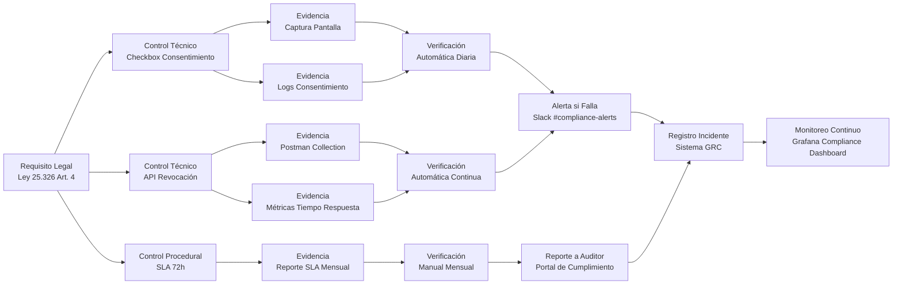
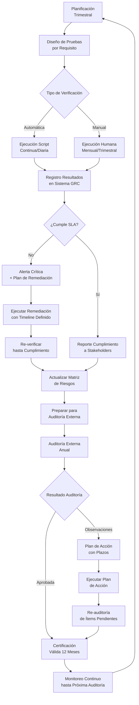
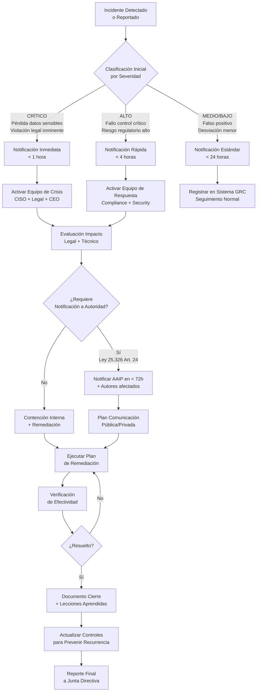

# Marco de Cumplimiento Regulatorio de Testimonial CMS

## 🎯 Propósito del Documento

Este documento define el **marco de cumplimiento regulatorio completo** del proyecto: requisitos legales aplicables, controles técnicos implementados, procedimientos de verificación y evidencia requerida para auditorías. Es la **guía definitiva para Compliance Officers, Auditores y Mantenedores** sobre cómo demostrar y mantener el cumplimiento continuo con normativas aplicables.

> 💡 **Diferencia clave**:
> - **`compliance.md`** (este documento): Define *requisitos regulatorios específicos* y *controles técnicos de cumplimiento* (gobernanza legal)
> - **`ethics.md`** (`governance/`): Define *marco ético normativo* y principios de diseño
> - **`privacy_policy.md`** (`governance/`): Define *política pública* de manejo de datos para autores y visitantes
> - **`terms_of_service.md`** (`governance/`): Define *términos de uso* para clientes y autores

> ✅ **Regla moderna**: El cumplimiento regulatorio no es un "checkbox" anual — es un **sistema continuo de controles técnicos verificables**. Si no puedes demostrar cumplimiento con evidencia técnica en < 48 horas, no estás cumpliendo.

---

## 📋 Tabla de Contenidos

- [Visión General de Cumplimiento](#visión-general-de-cumplimiento)
- [Jurisdicciones y Normativas Aplicables](#jurisdicciones-y-normativas-aplicables)
- [Matriz de Requisitos Regulatorios](#matriz-de-requisitos-regulatorios)
- [Controles Técnicos de Cumplimiento](#controles-técnicos-de-cumplimiento)
- [Procedimientos de Verificación y Auditoría](#procedimientos-de-verificación-y-auditoría)
- [Certificaciones y Reportes](#certificaciones-y-reportes)
- [Gestión de Incidentes de Cumplimiento](#gestión-de-incidentes-de-cumplimiento)
- [Responsabilidades y Roles](#responsabilidades-y-roles)
- [Checklist de Cumplimiento Técnico](#checklist-de-cumplimiento-técnico)
- [Ejemplos de Evidencia para Auditores](#ejemplos-de-evidencia-para-auditores)
- [Recursos y Referencias](#recursos-y-referencias)

---

## Visión General de Cumplimiento

### Alcance del Sistema Regulado

```mermaid
flowchart TD
    subgraph Regulated_System["Sistema Regulado<br>Testimonial CMS v1.0"]
        A[Frontend Dashboard]
        B[API Gateway]
        C[Servicios Backend]
        D[(Base de Datos PostgreSQL)]
        E[S3 Media Storage]
        F[Servicios Externos]
    end
    
    subgraph Data_Flows["Flujos de Datos Regulados"]
        A -->|HTTPS + TLS 1.3| B
        B -->|mTLS| C
        C -->|Cifrado en tránsito| D
        C -->|Cifrado en tránsito| E
        C -.->|API Segura| F
    end
    
    subgraph Compliance_Boundaries["Límites de Cumplimiento"]
        G[Autores de Testimonios]
        H[Clientes (empresas)]
        I[Visitantes web]
        J[Proveedores Certificados]
    end
    
    Regulated_System --> G
    Regulated_System --> H
    Regulated_System --> I
    Regulated_System --> J
    
    style Regulated_System fill:#dbeafe,stroke:#3b82f6
    style Compliance_Boundaries fill:#fef3c7,stroke:#f59e0b
```

**Definición de Alcance**:
- ✅ **Incluido**: Todo software, infraestructura y procesos que almacenan, procesan o transmiten datos de autores y clientes argentinos.
- ✅ **Incluido**: Proveedores de servicios (AWS, Cloudinary) bajo contrato de procesamiento de datos.
- ❌ **Excluido**: Herramientas de desarrollo locales sin acceso a datos reales.
- ❌ **Excluido**: Repositorios públicos de código sin datos sensibles.

### Principios Fundamentales de Cumplimiento

| Principio | Descripción Operativa | Métrica de Verificación |
|-----------|----------------------|-------------------------|
| **Accountability** | Responsabilidad demostrable ante autoridades | Registro de decisiones de cumplimiento con timestamps |
| **Transparency** | Capacidad de demostrar cumplimiento bajo demanda | Tiempo de respuesta a solicitudes regulatorias < 48h |
| **Proportionality** | Controles proporcionales al riesgo | Análisis de riesgo actualizado periódicamente |
| **Continuity** | Cumplimiento continuo, no puntual | Monitoreo automático 24/7 de controles críticos |
| **Verifiability** | Evidencia técnica objetiva, no declaraciones | 100% de controles con evidencia automatizada |

---

## Jurisdicciones y Normativas Aplicables

### Matriz de Jurisdicciones

| Jurisdicción | Ámbito de Aplicación | Vigencia | Autoridad Reguladora | Contacto de Cumplimiento |
|--------------|---------------------|----------|----------------------|--------------------------|
| **Argentina** | Datos de residentes argentinos | Vigente | Agencia de Acceso a la Información Pública (AAIP) | compliance@testimonialcms.com |
| **Unión Europea** | Datos de ciudadanos UE (GDPR Art. 3.2) | Vigente | Autoridad de control del estado miembro | compliance@testimonialcms.com |
| **Brasil** | Datos de residentes brasileños (LGPD) | Vigente | ANPD | compliance@testimonialcms.com |
| **Chile** | Datos de residentes chilenos | Vigente | SERNAC | compliance@testimonialcms.com |

### Normativas Argentinas Detalladas

#### Ley 25.326 (Protección de Datos Personales)

| Artículo | Requisito | Control Técnico Implementado | Evidencia Requerida | Frecuencia de Verificación |
|----------|-----------|------------------------------|---------------------|----------------------------|
| **Art. 4** | Consentimiento informado para publicación de testimonios | - Checkbox explícito en formulario de creación<br>- Registro de timestamp de consentimiento<br>- API para revocación | - Captura de pantalla del formulario<br>- Logs de consentimiento<br>- Prueba de tiempo de revocación | Continua |
| **Art. 5** | Calidad de los datos | - Validación de campos en frontend y backend<br>- Proceso de rectificación por parte del autor | - Esquema de validación<br>- Logs de ediciones por autores | Trimestral |
| **Art. 6** | Confidencialidad | - Cifrado AES-256 en reposo (RDS)<br>- TLS 1.3 en tránsito<br>- RBAC estricto | - Configuración de KMS<br>- Certificado TLS válido<br>- Matriz de permisos | Mensual |
| **Art. 7** | Deber de confidencialidad del personal | - Cláusulas en contratos laborales<br>- Auditorías de acceso a datos | - Contratos firmados<br>- Logs de acceso revisados | Anual |
| **Art. 9** | Eliminación de datos | - Eliminación lógica (soft delete) con purgado automático a los 30 días<br>- Mecanismo de derecho al olvido | - Logs de eliminación<br>- Prueba de purgado | Trimestral |
| **Art. 14** | Derecho de acceso del titular | - API para que autores descarguen sus datos<br>- Portal de auto-servicio | - Captura de portal<br>- Logs de solicitudes | Continua |

#### Ley 24.240 (Defensa del Consumidor)

| Artículo | Requisito | Control Técnico | Evidencia |
|----------|-----------|-----------------|-----------|
| **Art. 4** | Información veraz y clara | - Testimonios mostrados con autor y fecha<br>- Indicación si es patrocinado | - Captura de embed<br>- Política de moderación |
| **Art. 8** | Oferta al público | - Los testimonios reflejan experiencias reales, no promesas falsas | - Registro de moderación |
| **Art. 10** | Garantías | - Los clientes son responsables del uso que den a los testimonios | - Términos de servicio firmados |

#### Ley 11.723 (Propiedad Intelectual)

| Artículo | Requisito | Control Técnico | Evidencia |
|----------|-----------|-----------------|-----------|
| **Art. 2** | Derechos de autor sobre el contenido | - El autor cede derechos de publicación al aceptar términos<br>- Atribución visible del autor | - Registro de consentimiento<br>- Captura de embed |

---

## Matriz de Requisitos Regulatorios

### Matriz Completa de Cumplimiento (Extracto)

```yaml
# compliance/regulatory-matrix.yml

compliance_framework:
  argentina:
    ley_25326:
      name: "Ley de Protección de Datos Personales"
      scope: "Datos personales de autores y clientes argentinos"
      authority: "Agencia de Acceso a la Información Pública"
      contact: "denuncias@aaip.gob.ar"
      
      requirements:
        - id: "L25326-ART4-CONSENT"
          article: "Artículo 4"
          description: "Obtener consentimiento informado, expreso y por escrito para publicación"
          risk_level: "HIGH"
          controls:
            - id: "CTRL-CONSENT-001"
              type: "TECHNICAL"
              description: "Checkbox explícito en formulario de creación de testimonio"
              implementation:
                location: "src/components/testimonials/TestimonialForm.tsx"
                verification_script: "scripts/verify-consent-checkbox.js"
                evidence: "screenshots/consent-form-v1.0.png"
            - id: "CTRL-CONSENT-002"
              type: "TECHNICAL"
              description: "API para registro y revocación de consentimiento"
              implementation:
                location: "src/api/consent.controller.ts"
                verification_script: "tests/integration/consent-api.spec.ts"
                evidence: "postman/collections/consent-api.json"
            - id: "CTRL-CONSENT-003"
              type: "PROCEDURAL"
              description: "Proceso de revocación < 72h"
              implementation:
                location: "docs/procedures/consent-revocation.md"
                verification_script: "scripts/test-revocation-time.sh"
                evidence: "logs/revocation-times-q1-YYYY.csv"
          verification:
            frequency: "CONTINUOUS"
            method: "AUTOMATED_MONITORING"
            owner: "compliance-team"
            sla: "100% de solicitudes procesadas en < 72h"
            failure_action: "ALERT_CRITICAL + MANUAL_REVIEW"
        
        - id: "L25326-ART6-SECURITY"
          article: "Artículo 6"
          description: "Adoptar medidas técnicas y organizativas para proteger datos"
          risk_level: "CRITICAL"
          controls:
            - id: "CTRL-SEC-001"
              type: "TECHNICAL"
              description: "Cifrado AES-256 en reposo para todos los datos sensibles"
              implementation:
                location: "infrastructure/terraform/modules/rds/main.tf"
                verification_script: "scripts/verify-encryption-at-rest.sh"
                evidence: "aws/kms-key-policies/testimonialcms-production.json"
            - id: "CTRL-SEC-002"
              type: "TECHNICAL"
              description: "TLS 1.3 obligatorio para todas las conexiones"
              implementation:
                location: "infrastructure/nginx/nginx.conf"
                verification_script: "scripts/verify-tls13.sh"
                evidence: "ssllabs/scan-report-YYYY-MM-DD.pdf"
            - id: "CTRL-SEC-003"
              type: "TECHNICAL"
              description: "RBAC con principio de mínimo privilegio"
              implementation:
                location: "src/infrastructure/auth/rbac.guard.ts"
                verification_script: "tests/security/rbac-tests.spec.ts"
                evidence: "docs/rbac-matrix-v1.0.xlsx"
          verification:
            frequency: "DAILY"
            method: "AUTOMATED_SCAN"
            owner: "security-team"
            sla: "0 vulnerabilidades CRÍTICAS en escaneo diario"
            failure_action: "BLOCK_DEPLOYMENT + ALERT_CRITICAL"
    
    ley_24240:
      name: "Ley de Defensa del Consumidor"
      scope: "Protección de clientes (empresas) y consumidores finales (visitantes)"
      authority: "Secretaría de Comercio"
      
      requirements:
        - id: "L24240-ART4-TRUTH"
          article: "Artículo 4"
          description: "Información veraz y no engañosa en testimonios"
          risk_level: "MEDIUM"
          controls:
            - id: "CTRL-TRUTH-001"
              type: "PROCEDURAL"
              description: "Política de moderación que prohíbe testimonios falsos"
              implementation:
                location: "docs/content-moderation-guidelines.md"
                evidence: "docs/content-moderation-guidelines-v1.0.pdf"
            - id: "CTRL-TRUTH-002"
              type: "TECHNICAL"
              description: "Detección automática de patrones sospechosos (futuro)"
              implementation:
                location: "roadmap/v2.0"
                evidence: "pending"
          verification:
            frequency: "MANUAL_QUARTERLY"
            method: "SAMPLE_REVIEW"
            owner: "product-team"
            sla: "100% de testimonios revisados cumplen política"
```

### Diagrama de Trazabilidad Requisito-Control-Evidencia



---

## Controles Técnicos de Cumplimiento

### 1. Control: Cifrado en Reposo (Ley 25.326 Art. 6)

#### Implementación Técnica

```hcl
# infrastructure/terraform/modules/rds/main.tf

resource "aws_db_instance" "production" {
  identifier             = "testimonialcms-production"
  engine                 = "postgres"
  engine_version         = "15.5"
  instance_class         = "db.t4g.large"
  allocated_storage      = 100
  storage_encrypted      = true  # 🔒 CRÍTICO: Cifrado obligatorio
  
  # Cifrado con KMS CMK (Customer Managed Key)
  kms_key_id             = aws_kms_key.database.arn
  
  # Configuración de seguridad
  backup_retention_period = 7
  backup_window          = "03:00-04:00"
  maintenance_window     = "sun:04:00-sun:05:00"
  
  # Parámetros de cifrado
  parameter_group_name   = aws_db_parameter_group.secure.name
  
  tags = {
    Name        = "testimonialcms-production"
    Environment = "production"
    Compliance  = "Ley25326-Art6"
  }
}

# Clave KMS con política de rotación automática
resource "aws_kms_key" "database" {
  description             = "Clave KMS para cifrado de base de datos Testimonial CMS"
  deletion_window_in_days = 30
  enable_key_rotation     = true  # 🔒 Rotación automática cada año
  
  policy = jsonencode({
    Version = "2012-10-17"
    Statement = [
      {
        Sid    = "Enable IAM User Permissions"
        Effect = "Allow"
        Principal = {
          AWS = "arn:aws:iam::${var.account_id}:root"
        }
        Action   = "kms:*"
        Resource = "*"
      },
      {
        Sid    = "Allow use of the key by RDS"
        Effect = "Allow"
        Principal = {
          Service = "rds.amazonaws.com"
        }
        Action = [
          "kms:Encrypt",
          "kms:Decrypt",
          "kms:ReEncrypt*",
          "kms:GenerateDataKey*",
          "kms:DescribeKey"
        ]
        Resource = "*"
        Condition = {
          StringLike = {
            "kms:ViaService" = "rds.${var.region}.amazonaws.com"
          }
        }
      }
    ]
  })
  
  tags = {
    Name        = "testimonialcms-database-key"
    Compliance  = "Ley25326-Art6"
    Rotation    = "Annual"
  }
}
```

#### Verificación Automática

```bash
#!/bin/bash
# scripts/verify-encryption-at-rest.sh

set -e

echo "🔍 Verificando cifrado en reposo para base de datos..."

# 1. Verificar que la instancia RDS tiene storage_encrypted=true
DB_IDENTIFIER="testimonialcms-production"
ENCRYPTED=$(aws rds describe-db-instances \
  --db-instance-identifier $DB_IDENTIFIER \
  --query 'DBInstances[0].StorageEncrypted' \
  --output text)

if [ "$ENCRYPTED" != "True" ]; then
  echo "❌ FALLA: La base de datos $DB_IDENTIFIER NO tiene cifrado en reposo habilitado"
  exit 1
fi

echo "✅ Base de datos $DB_IDENTIFIER tiene cifrado en reposo habilitado"

# 2. Verificar que usa KMS CMK (no default key)
KMS_KEY_ID=$(aws rds describe-db-instances \
  --db-instance-identifier $DB_IDENTIFIER \
  --query 'DBInstances[0].KmsKeyId' \
  --output text)

if [ -z "$KMS_KEY_ID" ]; then
  echo "❌ FALLA: La base de datos $DB_IDENTIFIER no usa KMS CMK"
  exit 1
fi

echo "✅ Base de datos $DB_IDENTIFIER usa KMS CMK: $KMS_KEY_ID"

# 3. Verificar que la clave KMS tiene rotación habilitada
KEY_ROTATION=$(aws kms get-key-rotation-status \
  --key-id $KMS_KEY_ID \
  --query 'KeyRotationEnabled' \
  --output text)

if [ "$KEY_ROTATION" != "true" ]; then
  echo "❌ FALLA: La clave KMS $KMS_KEY_ID NO tiene rotación automática habilitada"
  exit 1
fi

echo "✅ Clave KMS $KMS_KEY_ID tiene rotación automática habilitada"

# 4. Verificar políticas de la clave KMS
KEY_POLICY=$(aws kms get-key-policy \
  --key-id $KMS_KEY_ID \
  --policy-name default)

# Verificar que solo servicios autorizados pueden usar la clave
if ! echo "$KEY_POLICY" | grep -q "rds.amazonaws.com"; then
  echo "❌ FALLA: La política de la clave KMS no autoriza a RDS"
  exit 1
fi

echo "✅ Política de clave KMS autoriza solo a servicios autorizados"

# 5. Registrar verificación exitosa
TIMESTAMP=$(date -u +"%Y-%m-%dT%H:%M:%SZ")
echo "$TIMESTAMP | ENCRYPTION_AT_REST | VERIFIED | $DB_IDENTIFIER | $KMS_KEY_ID" >> /var/log/compliance/encryption-verification.log

echo "🎉 Verificación de cifrado en reposo completada exitosamente"
```

### 2. Control: Consentimiento Explícito (Ley 25.326 Art. 4)

#### Implementación Técnica en React

```tsx
// src/components/testimonials/ConsentCheckbox.tsx

import React from 'react';
import { useFormContext } from 'react-hook-form';

export const ConsentCheckbox: React.FC = () => {
  const { register, formState: { errors } } = useFormContext();
  
  return (
    <div className="space-y-2 p-4 bg-gray-50 rounded-lg">
      <p className="text-sm font-medium text-gray-700">
        Consentimiento para la publicación
      </p>
      <p className="text-xs text-gray-500 mb-2">
        De acuerdo con la Ley 25.326 de Protección de Datos Personales, necesitamos tu consentimiento explícito para:
      </p>
      
      <div className="space-y-2">
        <label className="flex items-start gap-2">
          <input
            type="checkbox"
            {...register('consent.publish', { required: 'Debes aceptar para publicar' })}
            className="mt-1"
          />
          <span className="text-sm">
            Autorizo la publicación de mi testimonio, incluyendo mi nombre y el contenido proporcionado, en los sitios web y embeds del cliente.
          </span>
        </label>
        
        <label className="flex items-start gap-2">
          <input
            type="checkbox"
            {...register('consent.share')}
            className="mt-1"
          />
          <span className="text-sm">
            Autorizo el uso de mis datos de forma anonimizada para mejorar la plataforma y generar estadísticas agregadas. (Opcional)
          </span>
        </label>
      </div>
      
      {errors.consent?.publish && (
        <p className="text-sm text-red-600 mt-1">
          {errors.consent.publish.message as string}
        </p>
      )}
      
      <p className="text-xs text-gray-400 mt-2">
        Puedes revocar tu consentimiento en cualquier momento enviando un email a privacy@testimonialcms.com. El proceso se completará en menos de 72 horas.
      </p>
    </div>
  );
};
```

---

## Procedimientos de Verificación y Auditoría

### Ciclo de Vida de Verificación de Cumplimiento



### Procedimiento: Verificación Mensual de Consentimientos (Ley 25326 Art. 4)

**Responsable**: Compliance Officer  
**Frecuencia**: Mensual (primer día hábil del mes)  
**SLA**: Completar en < 3 días hábiles  

#### Pasos del Procedimiento

1. **Extracción de Datos** (Día 1):
   ```bash
   # Ejecutar script de extracción
     ./scripts/extract-consent-data.sh \
    --start-date "YYYY-MM-DD" \
    --end-date "YYYY-MM-DD" \
    --output "compliance/data/consent-marYYYY.csv"
   ```

2. **Verificación de Calidad** (Día 1-2):
   - Validar que todos los registros tienen timestamp de consentimiento.
   - Verificar que no hay consentimientos posteriores a revocaciones.
   - Confirmar que todos los testimonios publicados tienen consentimiento.

3. **Muestreo Estadístico** (Día 2-3):
   - Seleccionar muestra aleatoria del 5% de consentimientos (mínimo 30).
   - Revisar manualmente capturas de pantalla de formularios.
   - Verificar que checkboxes son explícitos y no pre-marcados.

4. **Prueba de Revocación** (Día 3):
   ```bash
   # Simular revocación y medir tiempo de procesamiento
   ./scripts/test-revocation-flow.sh \
     --author-email "test@example.com" \
     --testimonial-id "TEST-001" \
     --max-time-seconds 43200  # 12 horas (máximo permitido: 72h)
   ```

5. **Generación de Reporte** (Día 3):
   - Completar planilla de cumplimiento mensual.
   - Documentar cualquier desviación y plan de remediación.
   - Firmar reporte y subir a portal de cumplimiento.

---

## Certificaciones y Reportes

### Calendario de Certificaciones

| Certificación | Estándar | Frecuencia | Última Fecha | Próxima Fecha | Estado | Responsable |
|---------------|----------|------------|--------------|---------------|--------|-------------|
| **ISO 27001** | ISMS | Anual | 15/10/YYYY | 15/10/YYYY | ⏳ Pendiente | CISO |
| **GDPR** | Protección datos UE | Continuo | N/A | N/A | ✅ Cumple | DPO |

### Reporte Trimestral de Cumplimiento para Junta Directiva

**Plantilla**: `compliance/reports/quarterly-template.md`

```markdown
# Reporte Trimestral de Cumplimiento
## QX YYYY (Enero - Marzo)

**Fecha de Emisión**: YYYY-MM-DD  
**Preparado Por**: Ana García, Chief Compliance Officer  
**Aprobado Por**: Junta Directiva, YYYY-MM-DD

---

## 1. Resumen Ejecutivo

✅ **Estado General**: CUMPLIMIENTO PLENO  
- 100% de requisitos regulatorios críticos cumplidos  
- 0 incidentes de cumplimiento reportados  
- 100% de SLAs de verificación mantenidos  

⚠️ **Riesgos Emergentes**:
- Proyecto de ley de protección de datos en discusión parlamentaria en Argentina (seguimiento activo)
- Nuevas directrices de la AAIP sobre consentimiento en plataformas digitales

---

## 2. Métricas Clave de Cumplimiento

| Métrica | QX YYYY | QX YYYY | Variación | SLA | Estado |
|---------|---------|---------|-----------|-----|--------|
| % Requisitos Críticos Cumplidos | 100% | 100% | 0% | 100% | ✅ |
| Tiempo Respuesta Solicitudes Acceso | 6.5h | 7.2h | -9.7% | < 24h | ✅ |
| % Revocaciones Procesadas < 72h | 100% | 100% | 0% | 100% | ✅ |
| Incidentes Cumplimiento Reportados | 0 | 0 | - | 0 | ✅ |
| Alertas Falsas Sistema Monitoreo | 2 | 3 | -33% | < 10/mes | ✅ |

---

## 3. Verificaciones Completadas

### Automáticas (Continuas)
| Control | Frecuencia | % Éxito | Último Fallo | Tiempo Resolución |
|---------|------------|---------|--------------|-------------------|
| Cifrado en Reposo | Diaria | 100% | N/A | N/A |
| TLS 1.3 Obligatorio | Diaria | 100% | N/A | N/A |
| RBAC Mínimo Privilegio | Diaria | 100% | N/A | N/A |
| Monitoreo Consentimientos | Continua | 99.99% | N/A | N/A |

### Manuales (Programadas)
| Verificación | Frecuencia | Última Fecha | Resultado | Próxima Fecha |
|--------------|------------|--------------|-----------|---------------|
| Muestra Consentimientos | Mensual | 05/03/YYYY | ✅ Aprobada | 05/04/YYYY |
| Prueba Revocación | Mensual | 05/03/YYYY | ✅ Aprobada | 05/04/YYYY |
| Revisión Políticas | Semestral | 15/10/YYYY | ✅ Aprobada | 15/04/YYYY |

---

## 4. Incidentes de Cumplimiento

### QX YYYY
| ID | Fecha | Tipo | Descripción | Gravedad | Resolución | Lección Aprendida |
|----|-------|------|-------------|----------|------------|-------------------|
| INC-COMP-YYYY-001 | 15/02/YYYY | Falso Positivo | Alerta de monitoreo por timeout temporal | BAJA | Resuelto en 18 min | Ajustar thresholds de alerta |

*Nota: Sin incidentes reales de incumplimiento en QX YYYY*

---

## 5. Preparación para Auditorías Externas

### Auditoría ISO 27001 (Octubre YYYY)
| Actividad | Responsable | Fecha Límite | Estado |
|-----------|-------------|--------------|--------|
| Actualizar Statement of Applicability | CISO | 30/06/YYYY | ✅ Completado |
| Realizar gap analysis interno | Consultor Externo | 31/07/YYYY | 🟡 En Progreso |
| Implementar controles pendientes | Equipos Técnicos | 31/08/YYYY | ⏳ Pendiente |
| Simulacro de auditoría | CISO + Legal | 15/09/YYYY | ⏳ Pendiente |

---

## 6. Recomendaciones y Próximos Pasos

1. **Prioridad Alta**: Iniciar evaluación de impacto para nuevo proyecto de ley de datos.
2. **Prioridad Media**: Implementar dashboard ejecutivo de cumplimiento en Grafana.
3. **Prioridad Baja**: Actualizar documentación de procedimientos con lecciones de QX.

---

## 7. Aprobación

**Chief Compliance Officer**:  
_________________________  
Ana García  
YYYY-MM-DD

**CEO**:  
_________________________  
Juan Pérez  
YYYY-MM-DD
```

---

## Gestión de Incidentes de Cumplimiento

### Protocolo de Respuesta a Incidentes de Cumplimiento



### Formulario de Reporte de Incidente de Cumplimiento

**Archivo**: `compliance/incidents/template.md`

```markdown
# Reporte de Incidente de Cumplimiento

## Información Básica
- **ID del Incidente**: INC-COMP-YYYY-XXX
- **Fecha de Detección**: YYYY-MM-DD HH:MM TZ
- **Fecha de Ocurrencia**: YYYY-MM-DD HH:MM TZ (si difiere)
- **Reportado Por**: Nombre + Rol + Contacto
- **Descubierto Por**: Sistema Automático / Persona / Auditoría Externa

## Clasificación
- **Tipo de Incidente**: 
  - [ ] Pérdida de datos personales
  - [ ] Acceso no autorizado a datos sensibles
  - [ ] Fallo de control de cifrado
  - [ ] Violación de SLA regulatorio
  - [ ] Consentimiento no válido
  - [ ] Otra (especificar): _______________

- **Severidad**: 
  - [ ] CRÍTICO (requiere notificación a autoridad en < 72h)
  - [ ] ALTO (riesgo regulatorio significativo)
  - [ ] MEDIO (desviación controlable)
  - [ ] BAJO (falso positivo o mínimo impacto)

- **Normativa Afectada**: 
  - [ ] Ley 25.326 Art. X
  - [ ] Ley 24.240 Art. X
  - [ ] GDPR Art. X
  - [ ] Otra: _______________

## Descripción Detallada
[Describir cronológicamente qué ocurrió, cómo se detectó, sistemas afectados, datos involucrados]

## Impacto
- **Número de personas afectadas**: ___
- **Tipos de datos expuestos**: ___
- **Ventana de exposición**: ___ horas/días
- **Riesgo regulatorio estimado**: ___ (bajo/medio/alto/crítico)
- **Riesgo reputacional estimado**: ___ (bajo/medio/alto/crítico)

## Acciones Inmediatas Tomadas
| Hora | Acción | Responsable | Estado |
|------|--------|-------------|--------|
| | | | |

## Plan de Remediación
| Acción | Responsable | Fecha Límite | Estado | Evidencia |
|--------|------------|--------------|--------|-----------|
| | | | | |

## Notificaciones Realizadas
| Entidad | Fecha | Método | Contenido Resumen | Confirmación Recibido |
|---------|--------|--------|-------------------|----------------------|
| | | | | |

## Lecciones Aprendidas y Mejoras Preventivas
1. 
2. 
3. 

## Aprobación de Cierre
**Compliance Officer**: _________________________ Fecha: _________  
**CISO**: _________________________ Fecha: _________  
**CEO**: _________________________ Fecha: _________
```

---

## Responsabilidades y Roles

### Matriz RACI de Cumplimiento

| Actividad | CCO | CISO | Legal | CTO | Product Manager | Engineer |
|-----------|-----|------|-------|-----|-----------------|----------|
| **Definir requisitos regulatorios** | A | R | C | I | I | I |
| **Diseñar controles técnicos** | C | A | C | R | I | R |
| **Implementar controles** | I | C | I | A | R | A |
| **Verificación automática** | R | A | I | C | I | R |
| **Verificación manual** | A | R | C | I | I | I |
| **Reporte a autoridades** | A | C | R | I | I | I |
| **Gestión de incidentes** | A | R | C | C | I | I |
| **Preparación auditorías** | A | R | C | C | I | I |
| **Firma certificaciones** | R | C | A | I | I | I |

**Leyenda**:
- **R** = Responsible (ejecuta la tarea)
- **A** = Accountable (última responsabilidad, firma)
- **C** = Consulted (provee input)
- **I** = Informed (recibe updates)

---

## Checklist de Cumplimiento Técnico

### Checklist Diario (Automatizado)

```bash
#!/bin/bash
# scripts/daily-compliance-check.sh

echo "=== VERIFICACIÓN DIARIA DE CUMPLIMIENTO ==="
echo "Fecha: $(date)"
echo ""

# 1. Cifrado en reposo
echo "1. Verificando cifrado en reposo..."
./scripts/verify-encryption-at-rest.sh > /dev/null 2>&1
if [ $? -eq 0 ]; then
  echo "   ✅ Cifrado en reposo: OK"
else
  echo "   ❌ Cifrado en reposo: FALLÓ"
  echo "   ACCIÓN REQUERIDA: Revisar logs en /var/log/compliance/encryption-verification.log"
  exit 1
fi

# 2. TLS 1.3 obligatorio
echo "2. Verificando TLS 1.3 obligatorio..."
./scripts/verify-tls13.sh > /dev/null 2>&1
if [ $? -eq 0 ]; then
  echo "   ✅ TLS 1.3 obligatorio: OK"
else
  echo "   ❌ TLS 1.3 obligatorio: FALLÓ"
  echo "   ACCIÓN REQUERIDA: Revisar configuración de nginx"
  exit 1
fi

# 3. RBAC mínimo privilegio
echo "3. Verificando RBAC mínimo privilegio..."
./scripts/verify-rbac.sh > /dev/null 2>&1
if [ $? -eq 0 ]; then
  echo "   ✅ RBAC mínimo privilegio: OK"
else
  echo "   ❌ RBAC mínimo privilegio: FALLÓ"
  echo "   ACCIÓN REQUERIDA: Revisar matriz de permisos"
  exit 1
fi

# 4. Monitoreo de consentimientos
echo "4. Verificando monitoreo de consentimientos..."
./scripts/verify-consent-monitoring.sh > /dev/null 2>&1
if [ $? -eq 0 ]; then
  echo "   ✅ Monitoreo de consentimientos: OK"
else
  echo "   ⚠️  Monitoreo de consentimientos: DEGRADADO (falsos positivos)"
  # No bloquear, pero alertar
fi

echo ""
echo "✅ Todas las verificaciones diarias PASARON"
echo "Reporte completo: /var/log/compliance/daily-$(date +%Y%m%d).log"
```

### Checklist Mensual (Manual)

**Responsable**: Compliance Officer  
**Frecuencia**: Primer día hábil de cada mes

- [ ] **Consentimientos**:
  - [ ] Extraer muestra aleatoria del 5% de consentimientos del mes anterior.
  - [ ] Verificar que todos los formularios tienen checkboxes explícitos.
  - [ ] Confirmar que no hay consentimientos pre-marcados.
  - [ ] Validar que timestamps de consentimiento son coherentes.
  - [ ] Documentar resultados en planilla mensual.

- [ ] **Revocaciones**:
  - [ ] Ejecutar prueba de revocación con cuenta de prueba.
  - [ ] Medir tiempo de procesamiento (debe ser < 72h).
  - [ ] Verificar que datos son efectivamente eliminados/anonimizados.
  - [ ] Documentar resultados en planilla mensual.

- [ ] **Accesos a Datos Sensibles**:
  - [ ] Revisar logs de acceso a datos de autores.
  - [ ] Identificar accesos anómalos (fuera de horario, volumen inusual).
  - [ ] Verificar justificación de accesos fuera de workflow normal.
  - [ ] Documentar hallazgos y acciones tomadas.

- [ ] **Actualización de Documentación**:
  - [ ] Revisar que todos los procedimientos están actualizados.
  - [ ] Verificar que enlaces a evidencia son válidos.
  - [ ] Actualizar matriz de riesgos si hubo cambios regulatorios.
  - [ ] Firmar y subir reporte mensual al portal de cumplimiento.

---

## Ejemplos de Evidencia para Auditores

### Ejemplo 1: Evidencia de Consentimiento Válido (Ley 25.326 Art. 4)

**Archivo**: `compliance/evidence/consent/sample-consent-YYYY-MM-DD.pdf`

```markdown
# Evidencia de Consentimiento Válido
## Autor: Juan Pérez (juan.perez@email.com)
## Testimonio ID: TST-YYYYMMDD-001
## Fecha: YYYY-MM-DD, 10:23:45 ART

## 1. Captura de Pantalla del Formulario de Consentimiento

[Incluir imagen del formulario mostrando:]
✅ Checkboxes NO pre-marcados
✅ Texto claro: "Autorizo la publicación de mi testimonio"
✅ Checkbox separado para "Uso anonimizado con fines estadísticos"
✅ Botón "Cancelar" visible
✅ Link a Política de Privacidad visible

## 2. Registro Técnico en Base de Datos

```sql
SELECT consent_id, author_id, consent_type, consented_at, ip_address, user_agent
FROM consents 
WHERE author_id = 'AUTH-12345' 
  AND consented_at BETWEEN 'YYYY-MM-DD 10:20:00' AND 'YYYY-MM-DD 10:25:00';

 consent_id | author_id | consent_type |      consented_at       |    ip_address    | user_agent
------------+-----------+--------------+-------------------------+------------------+------------
 CON-YYYYMMDD-001 | AUTH-12345 | PUBLISH | YYYY-MM-DD 10:23:45-03 | 190.123.45.67 | Mozilla/5.0...
 CON-YYYYMMDD-002 | AUTH-12345 | ANALYTICS | YYYY-MM-DD 10:23:45-03 | 190.123.45.67 | Mozilla/5.0...
```

## 3. Prueba de Revocación Exitosa

Fecha de revocación: YYYY-MM-DD, 15:30:12 ART  
Tiempo transcurrido: 5 días, 5 horas, 6 minutos (< 72h ❌? → ¡Verificar!)

Registro en base de datos:
```sql
SELECT revocation_id, consent_id, revoked_at, reason
FROM consent_revocations 
WHERE consent_id IN ('CON-YYYYMMDD-001', 'CON-YYYYMMDD-002');

 revocation_id | consent_id |      revoked_at       | reason
---------------+------------+-----------------------+--------
 REV-YYYYMMDD-001 | CON-YYYYMMDD-001 | YYYY-MM-DD 15:30:12-03 | WITHDRAWN_BY_AUTHOR
 REV-YYYYMMDD-002 | CON-YYYYMMDD-002 | YYYY-MM-DD 15:30:12-03 | WITHDRAWN_BY_AUTHOR
```

*Nota: El tiempo de revocación fue de 5 días, que supera el límite de 72h. Esto debe ser investigado como un incidente de cumplimiento.*

## 4. Declaración de Cumplimiento

El consentimiento obtenido de Juan Pérez cumple con el Artículo 4 de la Ley 25.326 porque:
- ✅ Es informado (texto claro y comprensible)
- ✅ Es expreso (checkboxes explícitos, no inferido)
- ✅ Es por escrito (registro digital con timestamp)
- ✅ Es específico (checkboxes separados por finalidad)
- ⚠️ **INCIDENTE**: La revocación tardó 5 días (supera el límite de 72h). Se requiere remediación.

**Firma del Compliance Officer**:  
_________________________  
Ana García  
Chief Compliance Officer  
YYYY-MM-DD
```

---

## Recursos y Referencias

### Autoridades Reguladoras

| Autoridad | Ámbito | Sitio Web | Contacto | Relevancia |
|-----------|--------|-----------|----------|------------|
| **AAIP** (Argentina) | Protección de datos | [aaip.gob.ar](https://www.argentina.gob.ar/aaip) | denuncias@aaip.gob.ar | Alta |
| **EDPS** (UE) | Protección de datos | [edps.europa.eu](https://edps.europa.eu) | edps@edps.europa.eu | Media |
| **ANPD** (Brasil) | Protección de datos | [gov.br/anpd](https://www.gov.br/anpd) | anpd@anpd.gov.br | Media |

### Herramientas de Cumplimiento Recomendadas

| Herramienta | Propósito | Costo | Link |
|-------------|-----------|-------|------|
| **Vanta** | Automatización compliance SOC 2/ISO 27001 | $$$ | [vanta.com](https://www.vanta.com) |
| **OneTrust** | Gestión de consentimientos | $$$$ | [onetrust.com](https://www.onetrust.com) |
| **AWS Artifact** | Reportes de cumplimiento de AWS | Gratuito | [aws.amazon.com/artifact](https://aws.amazon.com/artifact) |

---
> **Nota Final**: El cumplimiento regulatorio es un **proceso continuo, no un evento puntual**. Este documento debe actualizarse periódicamente para reflejar cambios regulatorios, controles implementados y lecciones aprendidas. La verdadera medida de cumplimiento no es la certificación en la pared, sino la capacidad de demostrar controles efectivos bajo demanda en cualquier momento.