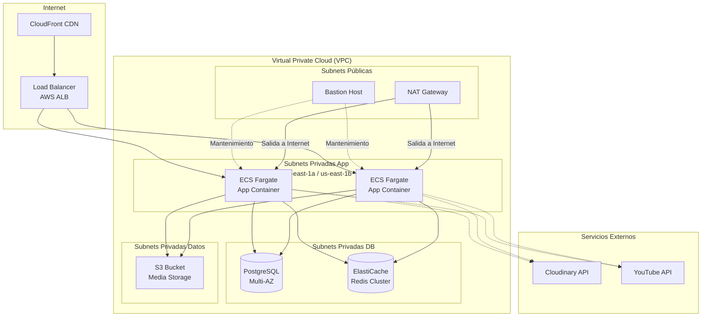
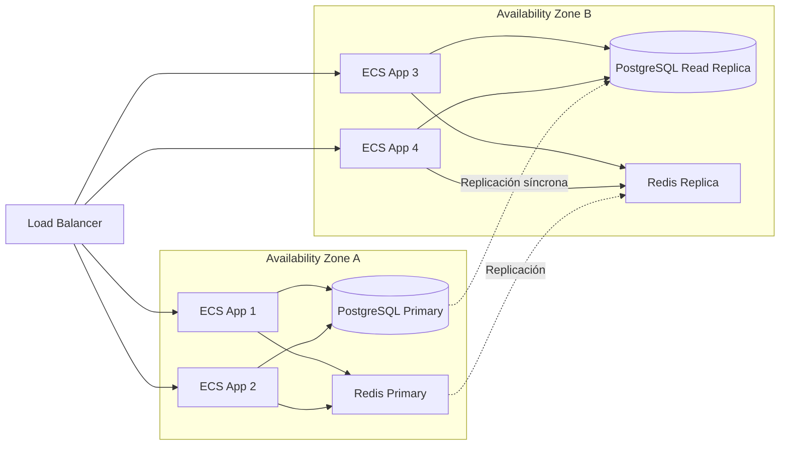

# Infraestructura como Código (IaC)

## 1. Visión General de la Arquitectura

### 1.1. Diagrama de Arquitectura de Alto Nivel



### 1.2. Especificaciones Técnicas

| Atributo | Valor |
|----------|-------|
| **Proveedor de Cloud** | AWS (Amazon Web Services) |
| **Región Principal** | us-east-1 (Norte de Virginia) |
| **Región de DR** | us-west-2 (Oregón) |
| **VPC CIDR** | 10.0.0.0/16 |
| **Subnets Públicas** | 10.0.1.0/24, 10.0.2.0/24 |
| **Subnets Privadas App** | 10.0.10.0/24, 10.0.11.0/24 |
| **Subnets Privadas DB** | 10.0.20.0/24, 10.0.21.0/24 |
| **Subnets Privadas Datos** | 10.0.30.0/24 |
| **Availability Zones** | us-east-1a, us-east-1b |
| **SLA Objetivo** | 99.95% (≤ 4.32h downtime/año) |
| **RTO (Recovery Time Objective)** | < 5 minutos |
| **RPO (Recovery Point Objective)** | < 15 minutos |

---

## 2. Principios de Diseño de Infraestructura

### 2.1. Principios Fundamentales

| Principio | Descripción | Implementación |
|-----------|-------------|----------------|
| **Idempotencia** | Mismo código → mismo estado, sin efectos secundarios | Terraform, Ansible con `--check` mode |
| **Inmutabilidad** | Servidores no modificados después de despliegue | Contenedores Docker (ECS Fargate) |
| **Escalabilidad Horizontal** | Añadir más instancias vs. más potencia | Auto Scaling de servicios ECS |
| **Resiliencia Multi-AZ** | Distribución en múltiples zonas de disponibilidad | RDS Multi-AZ, ECS tasks en 2 AZs |
| **Seguridad por Diseño** | Seguridad integrada desde el inicio | Security Groups, IAM roles mínimos |
| **Costo Optimizado** | Uso eficiente de recursos | Fargate spot, reservas RDS |
| **Observabilidad Nativa** | Métricas, logs, traces desde el inicio | CloudWatch, X-Ray, Prometheus/Grafana |
| **Automatización Total** | Sin intervención manual | CI/CD pipelines, GitOps |

### 2.2. Objetivos Fundamentales del Diseño Resiliente

#### Alta Disponibilidad y Continuidad



**Estrategias**:
- ✅ **Multi-AZ deployment**: ECS tasks distribuidas en al menos 2 AZs
- ✅ **Auto Scaling**: Basado en CPU/Memory o métricas personalizadas (request count)
- ✅ **Health Checks**: Load Balancer verifica salud de cada tarea
- ✅ **RDS Multi-AZ**: Failover automático en caso de fallo

#### Redundancia

| Componente | Estrategia de Redundancia | RTO | RPO |
|------------|---------------------------|-----|-----|
| **App Containers** | ECS Service con tareas en 2 AZs, Auto Scaling | < 30 s | 0 |
| **Base de Datos** | RDS PostgreSQL Multi-AZ | < 60 s | < 1 s |
| **Cache** | ElastiCache Redis Cluster (1 nodo principal + réplica) | < 30 s | < 1 s |
| **Media Storage** | S3 Cross-Region Replication (CRR) a región DR | < 15 min | < 5 min |
| **CDN** | CloudFront con múltiples edge locations | < 1 min | 0 |

#### Recuperación Automática

```typescript
// Ejemplo: Lambda para auto‑recuperación de ECS tasks fallidas
export const handler = async (event: any) => {
  const ecs = new AWS.ECS();
  const sns = new AWS.SNS();
  
  const failedTaskArn = event.detail.taskArn;
  const reason = event.detail.reason;
  
  console.log(`Task ${failedTaskArn} failed: ${reason}`);
  
  try {
    // Forzar reemplazo (ECS ya lo hace, pero podemos notificar)
    await sns.publish({
      TopicArn: process.env.ALERTS_TOPIC_ARN,
      Subject: 'ECS Task Failure Detected',
      Message: JSON.stringify({
        taskArn: failedTaskArn,
        reason,
        action: 'Auto-recovery triggered by ECS',
        timestamp: new Date().toISOString()
      })
    }).promise();
    
    return { statusCode: 200, body: 'Notified' };
  } catch (error) {
    console.error('Notification failed', error);
    throw error;
  }
};
```

#### Aislamiento de Fallos

- **Servicios separados**: Microservicios (si se decide) con sus propias bases de datos.
- **Circuit Breakers** en las llamadas entre servicios (aunque en MVP sea monolito, preparado para futuro).
- **Rate Limiting** en API Gateway o Load Balancer para proteger contra abusos.
- **Timeouts** configurables en las llamadas a dependencias externas.

---

## 3. Infraestructura como Código (IaC)

### 3.1. Stack Tecnológico de IaC

| Herramienta | Propósito | Versión |
|-------------|-----------|---------|
| **Terraform** | Provisionamiento de infraestructura | 1.5+ |
| **AWS CLI** | Interacción con AWS | 2.x |
| **Docker** | Construcción de imágenes de aplicación | 24.x |
| **GitHub Actions** | CI/CD para despliegues | - |

### 3.2. Estructura de Directorios de IaC

```bash
infrastructure/
├── terraform/
│   ├── main.tf                    # Configuración principal
│   ├── variables.tf               # Variables globales
│   ├── outputs.tf                 # Salidas globales
│   ├── providers.tf               # Proveedores (AWS)
│   ├── modules/
│   │   ├── vpc/
│   │   │   ├── main.tf
│   │   │   ├── variables.tf
│   │   │   └── outputs.tf
│   │   ├── ecs/
│   │   │   ├── main.tf
│   │   │   ├── variables.tf
│   │   │   └── outputs.tf
│   │   ├── rds/
│   │   │   ├── main.tf
│   │   │   ├── variables.tf
│   │   │   └── outputs.tf
│   │   ├── redis/
│   │   │   ├── main.tf
│   │   │   ├── variables.tf
│   │   │   └── outputs.tf
│   │   ├── alb/
│   │   │   ├── main.tf
│   │   │   ├── variables.tf
│   │   │   └── outputs.tf
│   │   └── s3/
│   │       ├── main.tf
│   │       ├── variables.tf
│   │       └── outputs.tf
│   └── environments/
│       ├── dev/
│       │   ├── main.tf
│       │   ├── terraform.tfvars
│       │   ├── backend.tf
│       │   └── outputs.tf
│       ├── staging/
│       │   ├── main.tf
│       │   ├── terraform.tfvars
│       │   ├── backend.tf
│       │   └── outputs.tf
│       └── production/
│           ├── main.tf
│           ├── terraform.tfvars
│           ├── backend.tf
│           └── outputs.tf
│
├── docker/
│   ├── Dockerfile.app            # Imagen de la aplicación NestJS
│   └── .dockerignore
│
└── scripts/
    ├── deploy.sh                  # Script de despliegue
    ├── backup-db.sh               # Backup manual
    └── health-check.sh             # Health check de servicios
```

### 3.3. Ejemplo de Terraform: VPC y Subnets

(Similar al template, pero adaptado a los CIDR y AZs definidos. Se puede usar el mismo código con ajustes en variables.)

### 3.4. Ejemplo de Terraform: ECS Fargate Service

```hcl
# infrastructure/terraform/modules/ecs/main.tf

resource "aws_ecs_cluster" "main" {
  name = "${var.environment}-cluster"
  
  setting {
    name  = "containerInsights"
    value = "enabled"
  }
  
  tags = {
    Environment = var.environment
  }
}

resource "aws_ecs_task_definition" "app" {
  family                   = "${var.environment}-app"
  network_mode             = "awsvpc"
  requires_compatibilities = ["FARGATE"]
  cpu                      = var.app_cpu
  memory                   = var.app_memory
  execution_role_arn       = aws_iam_role.ecs_execution.arn
  task_role_arn            = aws_iam_role.ecs_task.arn
  
  container_definitions = jsonencode([
    {
      name  = "app"
      image = var.app_image
      portMappings = [
        {
          containerPort = 3000
          protocol      = "tcp"
        }
      ]
      environment = [
        { name = "NODE_ENV", value = var.environment },
        { name = "DATABASE_URL", value = "postgresql://${var.db_username}:${var.db_password}@${var.db_host}:${var.db_port}/${var.db_name}" },
        { name = "REDIS_URL", value = "redis://${var.redis_host}:6379" }
      ]
      logConfiguration = {
        logDriver = "awslogs"
        options = {
          "awslogs-group"         = "/ecs/${var.environment}-app"
          "awslogs-region"        = var.region
          "awslogs-stream-prefix" = "ecs"
        }
      }
    }
  ])
  
  tags = {
    Environment = var.environment
  }
}

resource "aws_ecs_service" "app" {
  name            = "${var.environment}-app-service"
  cluster         = aws_ecs_cluster.main.id
  task_definition = aws_ecs_task_definition.app.arn
  desired_count   = var.app_count
  launch_type     = "FARGATE"
  
  network_configuration {
    subnets          = var.private_subnet_ids
    security_groups  = [var.app_security_group_id]
    assign_public_ip = false
  }
  
  load_balancer {
    target_group_arn = var.target_group_arn
    container_name   = "app"
    container_port   = 3000
  }
  
  health_check_grace_period_seconds = 60
  
  deployment_minimum_healthy_percent = 100
  deployment_maximum_percent         = 200
  
  tags = {
    Environment = var.environment
  }
}
```

---

## 4. Configuración de Redes y Seguridad

### 4.1. Security Groups

- **LB Security Group**: permite HTTP/HTTPS desde Internet (0.0.0.0/0).
- **App Security Group**: permite tráfico desde el LB en puerto 3000; permite SSH solo desde bastión.
- **DB Security Group**: permite PostgreSQL desde el App SG.
- **Redis Security Group**: permite Redis (6379) desde el App SG.
- **Bastion Security Group**: permite SSH desde IPs de oficina o VPN.

### 4.2. Network ACLs

- **Public subnets**: permiten inbound HTTP/HTTPS, outbound todo.
- **Private subnets**: restringen inbound solo desde el VPC, outbound todo.

---

## 5. Gestión de Secretos y Configuración

### 5.1. AWS Secrets Manager

Almacenar credenciales de base de datos, API keys de Cloudinary/YouTube, y JWT secrets.

```hcl
resource "aws_secretsmanager_secret" "db" {
  name        = "${var.environment}/database"
  description = "Database credentials for ${var.environment}"
}

resource "aws_secretsmanager_secret_version" "db" {
  secret_id     = aws_secretsmanager_secret.db.id
  secret_string = jsonencode({
    username = var.db_username
    password = var.db_password
    host     = var.db_host
    port     = var.db_port
    dbname   = var.db_name
  })
}
```

### 5.2. AWS Systems Manager Parameter Store

Para variables no sensibles como nombres de bucket, URLs de API, etc.

---

## 6. Estrategias de Backup y Recuperación

### 6.1. Backup de Base de Datos

- **Automáticos**: RDS snapshots diarios con retención de 7 días.
- **Manuales**: Script `backup-db.sh` para backups a S3.
- **Point-in-time recovery**: RDS lo habilita automáticamente.

### 6.2. Backup de Archivos (S3)

- **S3 Versioning** activado en bucket de media.
- **Cross-region replication** a región DR.

### 6.3. Plan de Recuperación

Documentar pasos para restaurar desde snapshots, incluido failover a región secundaria.

---

## 7. Monitoreo y Observabilidad de Infraestructura

### 7.1. CloudWatch Dashboards

Métricas: CPU/memoria de ECS, conexiones RDS, latencia ALB, 2xx/5xx, etc.

### 7.2. Alarmas Críticas

- CPU > 80% por 5 minutos
- 5xx errors > 10 en 1 minuto
- Latencia > 2 segundos
- Espacio en RDS < 5GB

### 7.3. Logs Centralizados

- **ECS logs** a CloudWatch Logs.
- **VPC Flow Logs** para análisis de tráfico.
- **X-Ray** para tracing de requests.

---

## 8. Proceso de Despliegue de Infraestructura

### 8.1. Script de Despliegue (deploy.sh)

Se ejecuta desde CI/CD. Realiza `terraform apply` después de validar.

### 8.2. GitHub Actions Workflow

```yaml
name: Infrastructure Deployment

on:
  push:
    branches: [ main, develop ]
    paths:
      - 'infrastructure/**'
  pull_request:
    paths:
      - 'infrastructure/**'

jobs:
  terraform:
    name: Terraform Plan & Apply
    runs-on: ubuntu-latest
    steps:
      - uses: actions/checkout@v3
      - uses: hashicorp/setup-terraform@v2
        with:
          terraform_version: 1.5.7
      - name: Configure AWS credentials
        uses: aws-actions/configure-aws-credentials@v2
        with:
          aws-access-key-id: ${{ secrets.AWS_ACCESS_KEY_ID }}
          aws-secret-access-key: ${{ secrets.AWS_SECRET_ACCESS_KEY }}
          aws-region: us-east-1
      - name: Terraform Init
        run: cd infrastructure/terraform/environments/dev && terraform init
      - name: Terraform Validate
        run: cd infrastructure/terraform/environments/dev && terraform validate
      - name: Terraform Plan
        run: cd infrastructure/terraform/environments/dev && terraform plan -var-file=terraform.tfvars
      - name: Terraform Apply (main only)
        if: github.ref == 'refs/heads/main'
        run: cd infrastructure/terraform/environments/dev && terraform apply -var-file=terraform.tfvars -auto-approve
```

---

## 9. Costos y Optimización

### 9.1. Presupuesto Mensual

- **ECS Fargate**: coste basado en vCPU/memoria por tiempo.
- **RDS**: instancia db.t3.medium multi-AZ.
- **ElastiCache**: cache.t3.micro con réplica.
- **S3**: almacenamiento + transferencia.
- **CloudFront**: salida de datos.

### 9.2. Optimizaciones

- Usar **Fargate Spot** para entornos no productivos.
- Reservar instancias RDS para producción (1 año).
- Configurar **S3 lifecycle** para mover archivos antiguos a Glacier.
- Monitorear con **AWS Cost Explorer** y alertas de budget.

---

## 10. Checklist de Calidad para Infraestructura

### ✅ Diseño y Arquitectura
- [ ] Multi-AZ deployment configurado (2 AZs)
- [ ] Auto Scaling de servicios ECS
- [ ] Load Balancer con health checks
- [ ] Redundancia en RDS y Redis
- [ ] RTO y RPO definidos y verificados

### ✅ Seguridad
- [ ] Security Groups con reglas mínimas
- [ ] Secrets almacenados en Secrets Manager
- [ ] Encryption en reposo (RDS, S3) y tránsito (TLS)
- [ ] IAM roles con permisos mínimos
- [ ] VPC Flow Logs habilitados

### ✅ IaC y Automatización
- [ ] Terraform versionado en Git
- [ ] Variables parametrizadas
- [ ] State management en S3 con DynamoDB locking
- [ ] CI/CD pipeline para infraestructura
- [ ] Plan vs. Apply en PRs

### ✅ Monitoreo y Observabilidad
- [ ] CloudWatch Dashboards
- [ ] Alarmas para métricas críticas
- [ ] Logs centralizados (CloudWatch Logs)
- [ ] Tracing (X-Ray) configurado
- [ ] Notificaciones SNS

### ✅ Backup y Recuperación
- [ ] RDS snapshots automáticos diarios
- [ ] S3 versioning y replicación a DR
- [ ] Pruebas de restauración realizadas
- [ ] Documento de DR actualizado

### ✅ Costos y Optimización
- [ ] Budgets configurados con alertas
- [ ] Uso de instancias reservadas/spot
- [ ] Recursos no utilizados identificados
- [ ] Cost Explorer reports

---

> **Nota final**: La infraestructura es un **documento vivo**. Revisa y actualiza este documento trimestralmente basado en cambios en la arquitectura, nuevas tecnologías y lecciones aprendidas en producción.