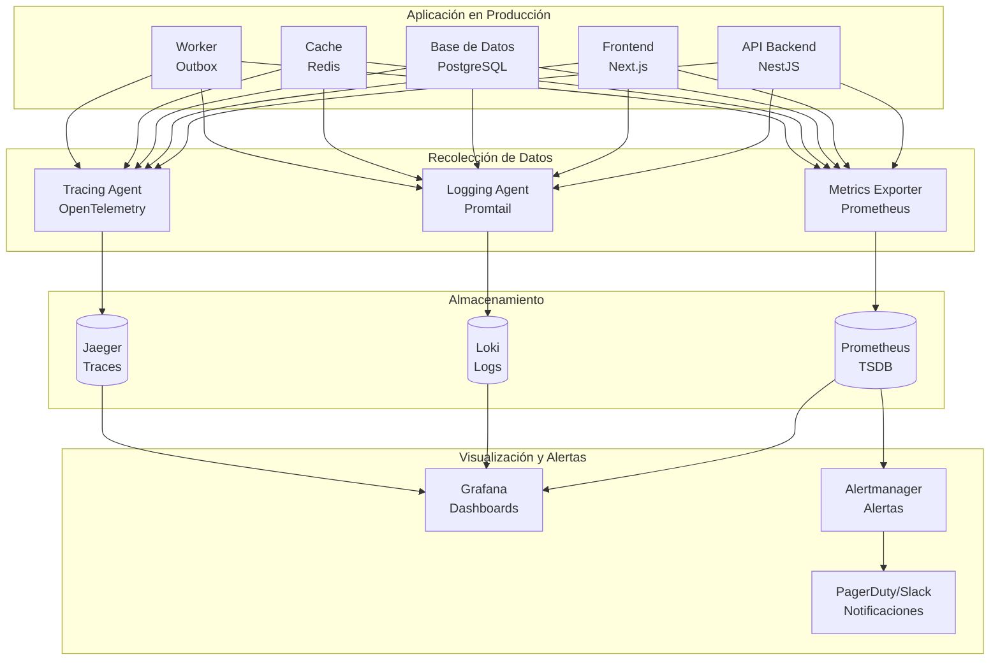
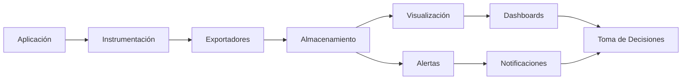

# Observabilidad y Monitoreo

## 1. Visión General y Principios

### 1.1. Los Tres Pilares de la Observabilidad



### 1.2. Principios Fundamentales

| Principio | Descripción | Implementación |
|-----------|-------------|----------------|
| **Golden Signals** | Latencia, Tráfico, Errores, Saturación | Métricas de endpoints, DB, cache |
| **SLO-Driven** | Objetivos basados en SLOs de producto | Definir SLOs para disponibilidad y latencia |
| **Meaningful Alerts** | Alertas accionables, no ruido | Alertar solo cuando se quema error budget |
| **Contextual Tracing** | Traces con contexto de negocio | Incluir tenantId, testimonialId en spans |
| **Structured Logging** | Logs JSON con requestId, correlationId | Winston + Loki |
| **Cost-Aware** | Balance entre detalle y costo | Retención diferenciada por nivel |
| **Proactive Monitoring** | Detectar anomalías antes de que afecten | Alertas de tendencias y forecast |

### 1.3. Framework de Observabilidad



---

## 2. Métricas (Metrics)

### 2.1. Tipos de Métricas

| Tipo | Descripción | Ejemplo | Herramienta |
|------|-------------|---------|-------------|
| **Counter** | Valor monótonamente creciente | `http_requests_total` | Prometheus |
| **Gauge** | Valor que sube y baja | `memory_usage_bytes` | Prometheus |
| **Histogram** | Distribución de valores | `http_request_duration_seconds` | Prometheus |
| **Summary** | Percentiles calculados en cliente | `grpc_server_handling_seconds` | Prometheus |

### 2.2. Métricas de Aplicación (Application Metrics)

```typescript
// src/infrastructure/monitoring/metrics.ts

import { Counter, Gauge, Histogram, Registry } from 'prom-client';

export const register = new Registry();

// ========== HTTP ==========
export const httpRequestTotal = new Counter({
  name: 'http_requests_total',
  help: 'Total HTTP requests',
  labelNames: ['method', 'route', 'status_code', 'tenant_id'],
  registers: [register]
});

export const httpRequestDurationSeconds = new Histogram({
  name: 'http_request_duration_seconds',
  help: 'HTTP request duration in seconds',
  labelNames: ['method', 'route', 'status_code', 'tenant_id'],
  buckets: [0.01, 0.025, 0.05, 0.1, 0.25, 0.5, 1, 2.5, 5, 10],
  registers: [register]
});

export const httpRequestErrorsTotal = new Counter({
  name: 'http_request_errors_total',
  help: 'Total HTTP request errors (5xx)',
  labelNames: ['method', 'route', 'status_code', 'tenant_id'],
  registers: [register]
});

// ========== Base de Datos ==========
export const databaseQueryTotal = new Counter({
  name: 'database_queries_total',
  help: 'Total database queries',
  labelNames: ['operation', 'table', 'status'],
  registers: [register]
});

export const databaseQueryDurationSeconds = new Histogram({
  name: 'database_query_duration_seconds',
  help: 'Database query duration in seconds',
  labelNames: ['operation', 'table'],
  buckets: [0.001, 0.005, 0.01, 0.025, 0.05, 0.1, 0.25, 0.5, 1, 2.5, 5],
  registers: [register]
});

// ========== Cache (Redis) ==========
export const cacheHitsTotal = new Counter({
  name: 'cache_hits_total',
  help: 'Total cache hits',
  labelNames: ['cache_name'],
  registers: [register]
});

export const cacheMissesTotal = new Counter({
  name: 'cache_misses_total',
  help: 'Total cache misses',
  labelNames: ['cache_name'],
  registers: [register]
});

export const cacheLatencySeconds = new Histogram({
  name: 'cache_latency_seconds',
  help: 'Cache operation latency',
  labelNames: ['operation', 'cache_name'],
  buckets: [0.0001, 0.0005, 0.001, 0.0025, 0.005, 0.01],
  registers: [register]
});

// ========== Negocio (Testimonios) ==========
export const testimonialsCreatedTotal = new Counter({
  name: 'testimonials_created_total',
  help: 'Total testimonials created',
  labelNames: ['tenant_id', 'status'],
  registers: [register]
});

export const testimonialsModeratedTotal = new Counter({
  name: 'testimonials_moderated_total',
  help: 'Total testimonials moderated',
  labelNames: ['tenant_id', 'action'], // approve, reject
  registers: [register]
});

export const testimonialScore = new Gauge({
  name: 'testimonial_score',
  help: 'Current score of a testimonial (updated periodically)',
  labelNames: ['testimonial_id', 'tenant_id'],
  registers: [register]
});

export const webhookDeliveriesTotal = new Counter({
  name: 'webhook_deliveries_total',
  help: 'Total webhook delivery attempts',
  labelNames: ['tenant_id', 'event_type', 'status'], // success, failed
  registers: [register]
});

// ========== Outbox ==========
export const outboxEventsTotal = new Counter({
  name: 'outbox_events_total',
  help: 'Total outbox events created',
  labelNames: ['event_type'],
  registers: [register]
});

export const outboxProcessingDurationSeconds = new Histogram({
  name: 'outbox_processing_duration_seconds',
  help: 'Time to process outbox events',
  buckets: [1, 5, 10, 30, 60, 120],
  registers: [register]
});

// ========== Infraestructura ==========
export const activeConnections = new Gauge({
  name: 'active_connections',
  help: 'Number of active HTTP connections',
  labelNames: ['service'],
  registers: [register]
});

export const memoryUsageBytes = new Gauge({
  name: 'memory_usage_bytes',
  help: 'Memory usage in bytes',
  labelNames: ['service'],
  registers: [register]
});
```

#### Middleware de Métricas para NestJS

```typescript
// src/infrastructure/monitoring/metrics.middleware.ts

import { Injectable, NestMiddleware } from '@nestjs/common';
import { Request, Response, NextFunction } from 'express';
import {
  httpRequestTotal,
  httpRequestDurationSeconds,
  httpRequestErrorsTotal,
  activeConnections,
} from './metrics';

@Injectable()
export class MetricsMiddleware implements NestMiddleware {
  use(req: Request, res: Response, next: NextFunction) {
    const start = Date.now();
    const tenantId = req.headers['x-tenant-id'] || 'unknown';

    activeConnections.inc({ service: 'api' });

    res.on('finish', () => {
      const duration = (Date.now() - start) / 1000;
      const { method, route } = req;
      const statusCode = res.statusCode.toString();

      httpRequestTotal.inc({
        method,
        route: route?.path || req.path,
        status_code: statusCode,
        tenant_id: tenantId,
      });

      httpRequestDurationSeconds.observe(
        {
          method,
          route: route?.path || req.path,
          status_code: statusCode,
          tenant_id: tenantId,
        },
        duration
      );

      if (statusCode.startsWith('5')) {
        httpRequestErrorsTotal.inc({
          method,
          route: route?.path || req.path,
          status_code: statusCode,
          tenant_id: tenantId,
        });
      }

      activeConnections.dec({ service: 'api' });
    });

    next();
  }
}
```

### 2.3. Métricas de Infraestructura

Recolectadas por Node Exporter, cAdvisor, Postgres Exporter, Redis Exporter.

| Categoría | Métrica | Descripción | Umbral de Alerta |
|-----------|---------|-------------|------------------|
| **CPU** | `cpu_usage_percent` | Uso de CPU | > 80% por 5 min |
| **Memoria** | `memory_usage_percent` | Uso de RAM | > 90% por 5 min |
| **Disco** | `disk_usage_percent` | Uso de disco en volumen de datos | > 85% |
| **Red** | `network_receive_bytes` | Tráfico entrante | > 100 Mbps sostenido |
| **PostgreSQL** | `pg_stat_database_numbackends` | Conexiones activas | > 100 |
| **PostgreSQL** | `pg_stat_user_tables_n_dead_tup` | Tuplas muertas | > 10000 por tabla |
| **Redis** | `redis_memory_used_bytes` | Memoria usada en Redis | > 80% de maxmemory |
| **Redis** | `redis_keyspace_hits_total` / `redis_keyspace_misses_total` | Hit ratio | < 0.8 |

---

## 3. Logs (Logging)

### 3.1. Estructura de Logs

Usamos Winston con formato JSON y Loki como agregador.

```typescript
// src/infrastructure/logging/logger.ts

import { createLogger, format, transports } from 'winston';
import LokiTransport from 'winston-loki';

const logFormat = format.combine(
  format.timestamp({ format: 'YYYY-MM-DD HH:mm:ss.SSS' }),
  format.errors({ stack: true }),
  format.json()
);

export const logger = createLogger({
  level: process.env.LOG_LEVEL || 'info',
  format: logFormat,
  defaultMeta: {
    service: process.env.SERVICE_NAME || 'api',
    environment: process.env.NODE_ENV || 'development',
    version: process.env.APP_VERSION || '1.0.0',
  },
  transports: [
    // Consola (desarrollo)
    new transports.Console({
      format: format.combine(
        format.colorize(),
        format.printf(({ timestamp, level, message, ...meta }) => {
          return `${timestamp} [${level.toUpperCase()}]: ${message} ${
            Object.keys(meta).length ? JSON.stringify(meta, null, 2) : ''
          }`;
        })
      ),
    }),
    // Archivo local (respaldo)
    new transports.File({ filename: 'logs/app.log' }),
    // Loki (centralizado)
    new LokiTransport({
      host: process.env.LOKI_URL || 'http://localhost:3100',
      labels: {
        service: process.env.SERVICE_NAME || 'api',
        environment: process.env.NODE_ENV || 'development',
      },
      batching: true,
      interval: 5,
    }),
  ],
});

export function logInfo(message: string, context?: Record<string, any>) {
  logger.info(message, context);
}

export function logError(message: string, error?: Error, context?: Record<string, any>) {
  logger.error(message, {
    error: error
      ? {
          message: error.message,
          stack: error.stack,
          name: error.name,
        }
      : undefined,
    ...context,
  });
}
```

### 3.2. Contexto en Logs

Incluir siempre `requestId` y `correlationId` para correlacionar.

```typescript
// src/infrastructure/logging/context.middleware.ts

import { v4 as uuidv4 } from 'uuid';
import { Injectable, NestMiddleware } from '@nestjs/common';

@Injectable()
export class RequestContextMiddleware implements NestMiddleware {
  use(req: any, res: any, next: () => void) {
    req.requestId = req.headers['x-request-id'] || uuidv4();
    req.correlationId = req.headers['x-correlation-id'] || uuidv4();
    // Almacenar en res.locals para acceso en servicios
    res.locals = { requestId: req.requestId, correlationId: req.correlationId };
    next();
  }
}
```

Ejemplo de log con contexto:

```typescript
logInfo('Testimonial created', {
  requestId,
  correlationId,
  testimonialId: newTestimonial.id,
  tenantId,
  authorName,
});
```

### 3.3. Logs de Acceso (Access Logs)

```typescript
// src/infrastructure/logging/access-logger.middleware.ts

import { Injectable, NestMiddleware } from '@nestjs/common';
import { Request, Response, NextFunction } from 'express';
import { logInfo } from './logger';

@Injectable()
export class AccessLoggerMiddleware implements NestMiddleware {
  use(req: Request, res: Response, next: NextFunction) {
    const start = Date.now();
    res.on('finish', () => {
      const duration = Date.now() - start;
      logInfo('HTTP Access', {
        method: req.method,
        url: req.originalUrl,
        status: res.statusCode,
        duration,
        userAgent: req.get('user-agent'),
        ip: req.ip,
        requestId: (req as any).requestId,
        correlationId: (req as any).correlationId,
      });
    });
    next();
  }
}
```

### 3.4. Niveles de Log y Retención

| Nivel | Descripción | Retención | Uso |
|-------|-------------|-----------|-----|
| **DEBUG** | Diagnóstico detallado | 24 h | Desarrollo, troubleshooting bajo demanda |
| **INFO** | Eventos de negocio importantes | 7 d | Creación de testimonios, aprobaciones, etc. |
| **WARN** | Condiciones inusuales pero recuperables | 30 d | Tasa de error elevada, reintentos de webhook |
| **ERROR** | Fallos que afectan funcionalidad | 90 d | Excepciones no manejadas, fallos de DB |
| **FATAL** | El servicio no puede continuar | 1 año | Error al iniciar, fallo catastrófico |

---

## 4. Tracing (Distributed Tracing)

### 4.1. Instrumentación con OpenTelemetry

```typescript
// src/infrastructure/tracing/opentelemetry.ts

import { NodeSDK } from '@opentelemetry/sdk-node';
import { getNodeAutoInstrumentations } from '@opentelemetry/auto-instrumentations-node';
import { OTLPTraceExporter } from '@opentelemetry/exporter-trace-otlp-http';
import { Resource } from '@opentelemetry/resources';
import { SemanticResourceAttributes } from '@opentelemetry/semantic-conventions';
import { BatchSpanProcessor } from '@opentelemetry/sdk-trace-base';
import { W3CTraceContextPropagator } from '@opentelemetry/core';

export const initTracing = () => {
  const sdk = new NodeSDK({
    resource: new Resource({
      [SemanticResourceAttributes.SERVICE_NAME]: process.env.SERVICE_NAME || 'api',
      [SemanticResourceAttributes.SERVICE_VERSION]: process.env.APP_VERSION || '1.0.0',
      [SemanticResourceAttributes.DEPLOYMENT_ENVIRONMENT]: process.env.NODE_ENV || 'development',
    }),
    instrumentations: [
      getNodeAutoInstrumentations({
        '@opentelemetry/instrumentation-http': {
          ignoreIncomingPaths: ['/health', '/metrics'],
        },
        '@opentelemetry/instrumentation-express': {
          ignoreLayersType: ['router'],
        },
        '@opentelemetry/instrumentation-pg': {
          addSqlCommenterCommentToQueries: true,
        },
        '@opentelemetry/instrumentation-redis': {},
      }),
    ],
    traceExporter: new OTLPTraceExporter({
      url: process.env.OTLP_ENDPOINT || 'http://localhost:4318/v1/traces',
    }),
    spanProcessor: new BatchSpanProcessor({
      maxQueueSize: 1000,
      maxExportBatchSize: 100,
      scheduledDelayMillis: 5000,
    }),
    textMapPropagator: new W3CTraceContextPropagator(),
  });

  sdk.start();
  process.on('SIGTERM', () => sdk.shutdown().finally(() => process.exit(0)));
};
```

### 4.2. Trazas Manuales con Contexto de Negocio

```typescript
// src/modules/testimonials/testimonials.service.ts

import { trace } from '@opentelemetry/api';

const tracer = trace.getTracer('testimonials-service');

async createTestimonial(dto: CreateTestimonialDto, tenantId: string) {
  return tracer.startActiveSpan('TestimonialService.create', async (span) => {
    span.setAttribute('tenant.id', tenantId);
    span.setAttribute('testimonial.author', dto.authorName);
    try {
      const result = await this.repository.create({ ...dto, tenantId });
      span.setAttribute('testimonial.id', result.id);
      span.setStatus({ code: SpanStatusCode.OK });
      return result;
    } catch (error) {
      span.recordException(error);
      span.setStatus({ code: SpanStatusCode.ERROR });
      throw error;
    } finally {
      span.end();
    }
  });
}
```

### 4.3. Propagación de Contexto en Llamadas Externas

Para llamadas a Cloudinary, YouTube, webhooks, etc., inyectar headers de trace.

```typescript
import { context, propagation } from '@opentelemetry/api';

function injectTraceHeaders(headers: Record<string, string>) {
  const carrier = {};
  propagation.inject(context.active(), carrier);
  return { ...headers, ...carrier };
}
```

---

## 5. Dashboards y Visualización

### 5.1. Dashboard de Salud General

Paneles:

- **Request Rate**: `sum(rate(http_requests_total[5m])) by (route)`
- **Error Rate**: `sum(rate(http_request_errors_total[5m])) / sum(rate(http_requests_total[5m])) * 100`
- **Latency p95**: `histogram_quantile(0.95, sum(rate(http_request_duration_seconds_bucket[5m])) by (le, route))`
- **Active Connections**: `sum(active_connections)`
- **Memory Usage**: `memory_usage_bytes / 1024 / 1024`

### 5.2. Dashboard de Negocio (Testimonios)

- **Testimonios creados**: `sum(rate(testimonials_created_total[1h])) by (tenant_id)`
- **Distribución por estado**: `sum(testimonials_created_total) by (status)`
- **Score promedio**: `avg(testimonial_score)`
- **Webhook deliveries**: `sum(rate(webhook_deliveries_total[1h])) by (status)`

### 5.3. Dashboard de Infraestructura

- CPU, memoria, disco de cada contenedor
- Conexiones DB, hit ratio de caché, etc.

---

## 6. Alertas y SLOs/SLIs

### 6.1. Definición de SLOs

| SLI | Descripción | SLO | Ventana |
|-----|-------------|-----|---------|
| **Disponibilidad API** | Proporción de requests exitosos (2xx) | 99.9% | 30 días |
| **Latencia API p99** | Percentil 99 de latencia < 500ms | 99% | 7 días |
| **Procesamiento de testimonios** | Testimonios creados sin error | 99.5% | 7 días |
| **Entrega de webhooks** | Webhooks entregados con éxito (primer intento) | 95% | 7 días |

### 6.2. Alertas Basadas en Error Budget

Ejemplo de regla Prometheus para alertar cuando se quema presupuesto rápidamente:

```yaml
- alert: HighErrorRateBurningBudget
  expr: |
    (sum(rate(http_request_errors_total[1h])) / sum(rate(http_requests_total[1h]))) > 0.001
  for: 5m
  labels:
    severity: critical
  annotations:
    summary: "Error rate is burning budget faster than expected"
```

### 6.3. Configuración de Alertmanager

```yaml
route:
  group_by: ['alertname', 'severity']
  group_wait: 30s
  group_interval: 5m
  repeat_interval: 3h
  receiver: 'default'
  routes:
    - match:
        severity: critical
      receiver: pagerduty
    - match:
        severity: warning
      receiver: slack

receivers:
  - name: slack
    slack_configs:
      - channel: '#alerts'
        send_resolved: true
        title: '{{ template "slack.title" . }}'
        text: '{{ template "slack.text" . }}'
  - name: pagerduty
    pagerduty_configs:
      - service_key: <key>
```

---

## 7. KPIs y OKRs de Observabilidad

| KPI | Descripción | Objetivo |
|-----|-------------|----------|
| **MTTR** | Tiempo medio de recuperación | < 30 min |
| **Cobertura de SLOs** | % de servicios con SLO definido y monitorizado | 100% |
| **Alertas significativas** | % de alertas que resultan en acción | > 80% |
| **Tasa de error** | Proporción de 5xx | < 0.1% |

---

## 8. Herramientas y Configuración

| Componente | Herramienta | Versión |
|------------|-------------|---------|
| Métricas | Prometheus | 2.47+ |
| Dashboards | Grafana | 10.1+ |
| Logs | Loki + Promtail | 2.9+ |
| Trazas | Jaeger + OpenTelemetry | 1.48+ |
| Alertas | Alertmanager | 0.27+ |

Ejemplo de `prometheus.yml`:

```yaml
global:
  scrape_interval: 15s

scrape_configs:
  - job_name: 'api'
    static_configs:
      - targets: ['api:3000']
    metrics_path: '/metrics'

  - job_name: 'postgres'
    static_configs:
      - targets: ['postgres-exporter:9187']

  - job_name: 'redis'
    static_configs:
      - targets: ['redis-exporter:9121']

  - job_name: 'node'
    static_configs:
      - targets: ['node-exporter:9100']
```

---

## 9. Checklist de Calidad

- [ ] Métricas de negocio (testimonials_created, etc.) exportadas
- [ ] Middleware de métricas HTTP implementado
- [ ] Logs estructurados con requestId y correlationId
- [ ] OpenTelemetry inicializado y spans de negocio
- [ ] Dashboards en Grafana con paneles clave
- [ ] SLOs definidos y monitorizados
- [ ] Alertas configuradas y probadas
- [ ] Documentación de runbooks para incidentes

---

> **Nota final**: La observabilidad debe evolucionar con el producto. Revisa dashboards y alertas trimestralmente para asegurar que siguen siendo relevantes y accionables.