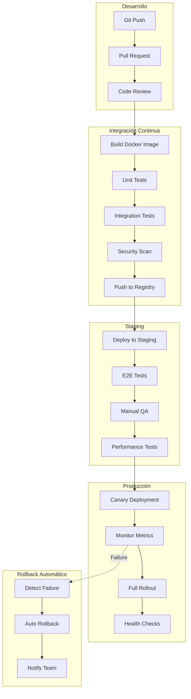

# Estrategia de Despliegue

## 1. Visión General y Principios

### 1.1. Principios Fundamentales

| Principio | Descripción | Implementación |
|-----------|-------------|----------------|
| **Automatización Total** | Sin intervención manual en el proceso | CI/CD pipelines con GitHub Actions |
| **Reproducibilidad** | Mismo código → mismo resultado | Docker imágenes inmutables, versionado semántico |
| **Reversibilidad** | Cualquier cambio puede revertirse | Blue/Green y Canary con rollback automático |
| **Zero Downtime** | Despliegues sin interrupción de servicio | Blue/Green deployments, health checks |
| **Progressive Delivery** | Liberación gradual a usuarios | Canary releases con feature flags |
| **Immutable Artifacts** | Imágenes no modificables tras construir | Docker images etiquetadas con SHA |
| **Environment Parity** | Entornos lo más similares posible | Kubernetes + IaC (Terraform) |
| **Security First** | Seguridad integrada en el pipeline | SAST, DAST, secret scanning en CI/CD |

### 1.2. Diagrama de Flujo de Despliegue



---

## 2. Entornos y Configuración

### 2.1. Matriz de Entornos

| Entorno | Propósito | Acceso | URL | SLA | Backup | Retención |
|---------|-----------|--------|-----|-----|--------|-----------|
| **Development** | Desarrollo local | Devs | localhost:3000 (frontend)<br>localhost:3001 (api) | N/A | No | N/A |
| **CI** | Testing automatizado | CI/CD | efímero | N/A | No | 24h |
| **Staging** | Testing pre‑producción | Devs, QA, PM | https://staging.testimonialcms.com | 95% | Diario | 7 días |
| **Production** | Producción real | Usuarios | https://app.testimonialcms.com | 99.95% | Continuo (WAL) | 30 días |
| **Disaster Recovery** | Recuperación ante desastres | SRE | https://dr.testimonialcms.com | 99.5% | Continuo | 30 días |

### 2.2. Configuración por Entorno

**Ejemplo para Staging (`config/staging.yaml`):**
```yaml
environment: staging
debug: false
log_level: info

database:
  host: staging-db.testimonialcms.com
  port: 5432
  name: testimonial_cms_staging
  username: ${DB_USERNAME}
  password: ${DB_PASSWORD}
  ssl: true
  pool: 20

redis:
  host: staging-redis.testimonialcms.com
  port: 6379
  ssl: true

api:
  base_url: https://staging.testimonialcms.com
  timeout: 15000

frontend:
  base_url: https://staging.testimonialcms.com
  next_public_api_url: https://staging.testimonialcms.com/api/v1

features:
  enable_scoring: true
  enable_webhooks: true
  enable_analytics: true

monitoring:
  enable_tracing: true
  enable_metrics: true
  datadog_api_key: ${DATADOG_API_KEY}
```

**Ejemplo para Producción (`config/production.yaml`):**
```yaml
environment: production
debug: false
log_level: warn

database:
  host: prod-cluster.testimonialcms.com
  port: 5432
  name: testimonial_cms_production
  username: ${DB_USERNAME}
  password: ${DB_PASSWORD}
  ssl: true
  pool: 50
  max_connections: 200

redis:
  host: prod-redis-cluster.testimonialcms.com
  port: 6379
  ssl: true
  cluster_mode: true

api:
  base_url: https://api.testimonialcms.com
  timeout: 10000

frontend:
  base_url: https://app.testimonialcms.com
  next_public_api_url: https://api.testimonialcms.com/api/v1

features:
  enable_scoring: true
  enable_webhooks: true
  enable_analytics: true
  enable_ai_summary: false   # feature flag para lanzamiento gradual

monitoring:
  enable_tracing: true
  enable_metrics: true
  datadog_api_key: ${DATADOG_API_KEY}
  newrelic_license_key: ${NEWRELIC_LICENSE_KEY}

scaling:
  min_instances: 4
  max_instances: 20
  target_cpu: 70
  target_memory: 80
```

### 2.3. Variables de Entorno Sensibles

```bash
# .env.example (nunca commitear .env real)

# Database
DB_HOST=localhost
DB_PORT=5432
DB_NAME=testimonial_cms
DB_USERNAME=postgres
DB_PASSWORD=change_me_in_production

# Redis
REDIS_HOST=localhost
REDIS_PORT=6379
REDIS_PASSWORD=

# JWT
JWT_SECRET=change_this_to_a_secure_random_string
JWT_EXPIRES_IN=15m
REFRESH_TOKEN_EXPIRES_IN=7d

# API Keys
CLOUDINARY_CLOUD_NAME=...
CLOUDINARY_API_KEY=...
CLOUDINARY_API_SECRET=...

YOUTUBE_API_KEY=...

# Third‑party services
SENDGRID_API_KEY=...
SLACK_WEBHOOK_URL=...

# Monitoring
DATADOG_API_KEY=...
NEWRELIC_LICENSE_KEY=...

# Feature Flags
ENABLE_SCORING=true
ENABLE_WEBHOOKS=true
ENABLE_AI_SUMMARY=false
```

---

## 3. Estrategias de Despliegue

### 3.1. Estrategias Disponibles

| Estrategia | Descripción | Tiempo de Despliegue | Riesgo | Uso Recomendado |
|------------|-------------|---------------------|--------|-----------------|
| **Recreate** | Detener viejo, iniciar nuevo | Rápido | Alto | Solo desarrollo |
| **Rolling Update** | Actualizar instancias gradualmente | Medio | Medio | Cambios menores |
| **Blue/Green** | Desplegar nuevo entorno, switch tráfico | Rápido | Bajo | Cambios mayores, migraciones |
| **Canary** | Liberar gradualmente a % de usuarios | Lento | Muy Bajo | Features nuevas, cambios de API |
| **A/B Testing** | Liberar a grupos específicos | Variable | Bajo | Experimentación con feature flags |

### 3.2. Implementación de Blue/Green Deployment

Para Testimonial CMS, usamos Kubernetes con dos deployments (`api-blue`, `api-green`) y un servicio que apunta al activo.

```yaml
# kubernetes/blue-green/api-blue.yaml
apiVersion: apps/v1
kind: Deployment
metadata:
  name: api-blue
  namespace: testimonial-cms
spec:
  replicas: 4
  selector:
    matchLabels:
      app: api
      version: blue
  template:
    metadata:
      labels:
        app: api
        version: blue
    spec:
      containers:
      - name: api
        image: 123456789012.dkr.ecr.us-east-1.amazonaws.com/testimonial-api:1.0.0
        ports:
        - containerPort: 3000
        env:
        - name: NODE_ENV
          value: "production"
        - name: DATABASE_URL
          valueFrom:
            secretKeyRef:
              name: db-secret
              key: url
        resources:
          requests:
            memory: "256Mi"
            cpu: "250m"
          limits:
            memory: "512Mi"
            cpu: "500m"
        livenessProbe:
          httpGet:
            path: /health
            port: 3000
          initialDelaySeconds: 30
          periodSeconds: 10
        readinessProbe:
          httpGet:
            path: /ready
            port: 3000
          initialDelaySeconds: 5
          periodSeconds: 5
---
apiVersion: v1
kind: Service
metadata:
  name: api-service
  namespace: testimonial-cms
spec:
  selector:
    app: api
    version: blue   # cambia a green durante el switch
  ports:
  - port: 80
    targetPort: 3000
  type: LoadBalancer
```

**Script de cambio Blue/Green**:
```bash
#!/bin/bash
# scripts/blue-green-switch.sh

set -e

echo "🚀 Iniciando Blue/Green deployment..."

# 1. Desplegar nueva versión (Green)
echo "📦 Desplegando nueva versión (Green)..."
kubectl apply -f kubernetes/blue-green/api-green.yaml

# 2. Esperar a que Green esté saludable
echo "⏳ Esperando a que Green esté saludable..."
kubectl rollout status deployment/api-green -n testimonial-cms --timeout=300s

# 3. Verificar health checks
GREEN_PODS=$(kubectl get pods -n testimonial-cms -l app=api,version=green -o jsonpath='{.items[*].status.phase}')
if [[ ! "$GREEN_PODS" =~ "Running" ]]; then
  echo "❌ Green deployment fallido"
  kubectl delete deployment api-green -n testimonial-cms
  exit 1
fi

# 4. Ejecutar smoke tests
echo "🧪 Ejecutando smoke tests..."
./scripts/smoke-tests.sh green
if [ $? -ne 0 ]; then
  echo "❌ Smoke tests fallidos"
  kubectl delete deployment api-green -n testimonial-cms
  exit 1
fi

# 5. Switch tráfico a Green
echo "🔄 Cambiando tráfico a Green..."
kubectl patch service api-service -n testimonial-cms -p '{"spec":{"selector":{"version":"green"}}}'

# 6. Verificar que el switch fue exitoso
sleep 10
ACTIVE_VERSION=$(kubectl get service api-service -n testimonial-cms -o jsonpath='{.spec.selector.version}')
if [ "$ACTIVE_VERSION" != "green" ]; then
  echo "❌ Switch fallido, revertiendo..."
  kubectl patch service api-service -n testimonial-cms -p '{"spec":{"selector":{"version":"blue"}}}'
  exit 1
fi

# 7. Escalar down Blue (opcional)
echo "⏸️  Escalando down Blue..."
kubectl scale deployment api-blue -n testimonial-cms --replicas=0

echo "🎉 Blue/Green deployment completado exitosamente!"
```

### 3.3. Implementación de Canary Deployment

Para canary, usamos un segundo deployment con pocas réplicas y monitoreamos métricas antes de escalar.

```yaml
# kubernetes/canary/api-canary.yaml
apiVersion: apps/v1
kind: Deployment
metadata:
  name: api-canary
  namespace: testimonial-cms
spec:
  replicas: 1
  selector:
    matchLabels:
      app: api
      track: canary
  template:
    metadata:
      labels:
        app: api
        track: canary
    spec:
      containers:
      - name: api
        image: 123456789012.dkr.ecr.us-east-1.amazonaws.com/testimonial-api:1.1.0  # nueva versión
        # ... misma configuración que stable
```

**Script de Canary**:
```bash
#!/bin/bash
# scripts/canary-deploy.sh

set -e

STABLE_VERSION="1.0.0"
CANARY_VERSION="1.1.0"
CANARY_PERCENTAGE=10
MAX_CANARY_PERCENTAGE=50
STEP_PERCENTAGE=10
STEP_DELAY=300  # 5 minutos

echo "🚀 Iniciando Canary deployment..."
echo "Stable: $STABLE_VERSION, Canary: $CANARY_VERSION, Inicio: $CANARY_PERCENTAGE%"

# 1. Desplegar canary con 10% del tráfico
kubectl apply -f kubernetes/canary/api-canary.yaml
kubectl rollout status deployment/api-canary -n testimonial-cms --timeout=300s

# 2. Verificar métricas iniciales
./scripts/check-canary-metrics.sh $CANARY_PERCENTAGE || { kubectl delete deployment api-canary -n testimonial-cms; exit 1; }

# 3. Incrementar gradualmente
CURRENT_PERCENTAGE=$CANARY_PERCENTAGE
while [ $CURRENT_PERCENTAGE -lt $MAX_CANARY_PERCENTAGE ]; do
  NEXT_PERCENTAGE=$((CURRENT_PERCENTAGE + STEP_PERCENTAGE))
  echo "📈 Incrementando a $NEXT_PERCENTAGE%..."
  TOTAL_REPLICAS=10
  CANARY_REPLICAS=$((TOTAL_REPLICAS * NEXT_PERCENTAGE / 100))
  STABLE_REPLICAS=$((TOTAL_REPLICAS - CANARY_REPLICAS))
  kubectl scale deployment api-canary -n testimonial-cms --replicas=$CANARY_REPLICAS
  kubectl scale deployment api -n testimonial-cms --replicas=$STABLE_REPLICAS
  sleep $STEP_DELAY
  ./scripts/check-canary-metrics.sh $NEXT_PERCENTAGE || { ./scripts/canary-rollback.sh; exit 1; }
  CURRENT_PERCENTAGE=$NEXT_PERCENTAGE
done

# 4. Full rollout
kubectl set image deployment/api api=123456789012.dkr.ecr.us-east-1.amazonaws.com/testimonial-api:$CANARY_VERSION -n testimonial-cms
kubectl rollout status deployment/api -n testimonial-cms --timeout=600s
kubectl delete deployment api-canary -n testimonial-cms
echo "🎉 Canary completado exitosamente!"
```

**Script de verificación de métricas**:
```bash
#!/bin/bash
# scripts/check-canary-metrics.sh

PERCENTAGE=$1
THRESHOLD_ERROR_RATE=1.0
THRESHOLD_LATENCY_P95=2.0

ERROR_RATE=$(curl -s "http://prometheus:9090/api/v1/query?query=sum(rate(http_request_errors_total{track=\"canary\"}[5m]))/sum(rate(http_requests_total{track=\"canary\"}[5m]))*100" | jq -r '.data.result[0].value[1]')
LATENCY_P95=$(curl -s "http://prometheus:9090/api/v1/query?query=histogram_quantile(0.95,sum(rate(http_request_duration_seconds_bucket{track=\"canary\"}[5m]))by(le))" | jq -r '.data.result[0].value[1]')

echo "Canary metrics at $PERCENTAGE%: error=$ERROR_RATE%, p95=$LATENCY_P95 s"
if (( $(echo "$ERROR_RATE > $THRESHOLD_ERROR_RATE" | bc -l) )); then exit 1; fi
if (( $(echo "$LATENCY_P95 > $THRESHOLD_LATENCY_P95" | bc -l) )); then exit 1; fi
exit 0
```

---

## 4. Pipeline CI/CD

### 4.1. GitHub Actions Workflow

```yaml
# .github/workflows/deploy.yml

name: Deploy

on:
  push:
    branches: [ main, develop ]
    tags:
      - 'v*'
  pull_request:
    branches: [ main ]

env:
  NODE_VERSION: 20
  AWS_REGION: us-east-1
  ECR_REPOSITORY: testimonial-cms

jobs:
  build-test:
    runs-on: ubuntu-latest
    steps:
      - uses: actions/checkout@v3
      - uses: actions/setup-node@v3
        with:
          node-version: ${{ env.NODE_VERSION }}
      - run: npm ci
      - run: npm run lint
      - run: npm run test:unit -- --coverage
      - run: npm run test:integration
      - name: Build Docker image
        run: |
          docker build -t $ECR_REPOSITORY:${{ github.sha }} .
          docker save -o image.tar $ECR_REPOSITORY:${{ github.sha }}
      - uses: actions/upload-artifact@v3
        with:
          name: docker-image
          path: image.tar

  security-scan:
    runs-on: ubuntu-latest
    needs: build-test
    steps:
      - uses: actions/checkout@v3
      - uses: actions/download-artifact@v3
        with:
          name: docker-image
      - run: docker load -i image.tar
      - name: Trivy scan
        uses: aquasecurity/trivy-action@master
        with:
          image-ref: $ECR_REPOSITORY:${{ github.sha }}
          severity: 'CRITICAL,HIGH'
      - name: Snyk scan
        uses: snyk/actions/docker@master
        env:
          SNYK_TOKEN: ${{ secrets.SNYK_TOKEN }}
        with:
          image: $ECR_REPOSITORY:${{ github.sha }}
          args: --file=Dockerfile

  deploy-staging:
    runs-on: ubuntu-latest
    needs: security-scan
    if: github.ref == 'refs/heads/develop'
    environment: staging
    steps:
      - uses: actions/checkout@v3
      - uses: actions/download-artifact@v3
        with:
          name: docker-image
      - run: docker load -i image.tar
      - uses: aws-actions/configure-aws-credentials@v2
        with:
          aws-access-key-id: ${{ secrets.AWS_ACCESS_KEY_ID }}
          aws-secret-access-key: ${{ secrets.AWS_SECRET_ACCESS_KEY }}
          aws-region: ${{ env.AWS_REGION }}
      - run: aws ecr get-login-password | docker login --username AWS --password-stdin ${{ secrets.ECR_REGISTRY }}
      - run: docker tag $ECR_REPOSITORY:${{ github.sha }} ${{ secrets.ECR_REGISTRY }}/$ECR_REPOSITORY:staging-${{ github.sha }}
      - run: docker push ${{ secrets.ECR_REGISTRY }}/$ECR_REPOSITORY:staging-${{ github.sha }}
      - run: |
          kubectl set image deployment/api api=${{ secrets.ECR_REGISTRY }}/$ECR_REPOSITORY:staging-${{ github.sha }} -n staging
          kubectl rollout status deployment/api -n staging --timeout=300s
      - run: npm run test:smoke -- --env=staging

  deploy-production:
    runs-on: ubuntu-latest
    needs: deploy-staging
    if: github.ref == 'refs/heads/main'
    environment:
      name: production
      url: https://app.testimonialcms.com
    concurrency: production
    steps:
      - uses: actions/checkout@v3
      - uses: actions/download-artifact@v3
        with:
          name: docker-image
      - run: docker load -i image.tar
      - uses: aws-actions/configure-aws-credentials@v2
        with:
          aws-access-key-id: ${{ secrets.AWS_ACCESS_KEY_ID_PRODUCTION }}
          aws-secret-access-key: ${{ secrets.AWS_SECRET_ACCESS_KEY_PRODUCTION }}
          aws-region: ${{ env.AWS_REGION }}
      - run: aws ecr get-login-password | docker login --username AWS --password-stdin ${{ secrets.ECR_REGISTRY }}
      - run: docker tag $ECR_REPOSITORY:${{ github.sha }} ${{ secrets.ECR_REGISTRY }}/$ECR_REPOSITORY:prod-${{ github.sha }}
      - run: docker push ${{ secrets.ECR_REGISTRY }}/$ECR_REPOSITORY:prod-${{ github.sha }}
      - run: |
          # Blue/Green deployment
          ./scripts/blue-green-deploy.sh \
            --image ${{ secrets.ECR_REGISTRY }}/$ECR_REPOSITORY:prod-${{ github.sha }}
      - run: npm run test:post-deploy -- --env=production
```

---

## 5. Estrategias de Rollback

### 5.1. Rollback Automático

El sistema monitoriza métricas clave durante 5 minutos tras el despliegue; si el error rate supera el 1%, se activa el rollback automático (script `auto-rollback.sh` similar al del template).

### 5.2. Rollback Manual

**Checklist**:
- [ ] Identificar la versión estable anterior (ej. `prod-abc123`).
- [ ] Comunicar al equipo en #incidentes.
- [ ] Ejecutar `kubectl set image deployment/api api=$PREVIOUS_IMAGE -n production`.
- [ ] Verificar que los pods se recuperen y el error rate vuelva a la normalidad.
- [ ] Notificar la resolución y documentar la causa raíz.

---

## 6. Sincronización de Datos entre Entornos

Para refrescar staging con datos anonimizados de producción usamos un job periódico:

```bash
# scripts/sync-staging-from-prod.sh
#!/bin/bash
set -e

# 1. Backup de producción
pg_dump -Fc -h prod-db -U $DB_USER -d testimonial_cms > prod.dump

# 2. Anonimizar datos sensibles
./scripts/anonymize-db.sh prod.dump anon.dump

# 3. Restaurar en staging
pg_restore -h staging-db -U $DB_USER -d testimonial_cms_staging -c anon.dump

# 4. Limpiar
rm prod.dump anon.dump
```

---

## 7. Checklist de Calidad para Despliegues

### ✅ Pre‑Deployment
- [ ] Código mergeado a main/develop.
- [ ] PRs revisadas y aprobadas.
- [ ] Tests unitarios (>80% cobertura).
- [ ] Tests de integración pasando.
- [ ] Security scans sin críticos.
- [ ] Docker image construida y subida.
- [ ] Migraciones de DB preparadas y probadas en staging.
- [ ] Feature flags configurados.
- [ ] Rollback plan documentado.
- [ ] Equipo notificado.

### ✅ During Deployment
- [ ] Pipeline CI/CD ejecutándose sin errores.
- [ ] Health checks pasando en nuevo deployment.
- [ ] Smoke tests pasando.
- [ ] Métricas monitoreadas (Grafana).
- [ ] Rollback automático configurado.
- [ ] Zero downtime confirmado.

### ✅ Post‑Deployment
- [ ] Todos los pods saludables.
- [ ] Error rate < 0.1%, latencia dentro de SLO.
- [ ] E2E tests pasando en producción.
- [ ] Feature flags activados según plan.
- [ ] Documentación actualizada.
- [ ] Equipo notificado de éxito.

---

## 8. Proceso de Aprobación

| Tipo de Cambio | Entorno | Aprobación Requerida | Ventana |
|----------------|---------|----------------------|---------|
| **Hotfix** | Producción | Tech Lead + SRE | 24/7 |
| **Feature** | Staging | Tech Lead | Lunes‑Vie 9‑18 |
| **Feature** | Producción | PM + Tech Lead | Mar‑Jue 10‑16 |
| **Breaking Change** | Producción | CTO + PM + Tech Lead | Mié 14‑16 |

---

> **Nota final**: La estrategia de despliegue es un **proceso vivo**. Revisa y ajusta trimestralmente basado en métricas de éxito, feedback del equipo y lecciones aprendidas de incidentes.