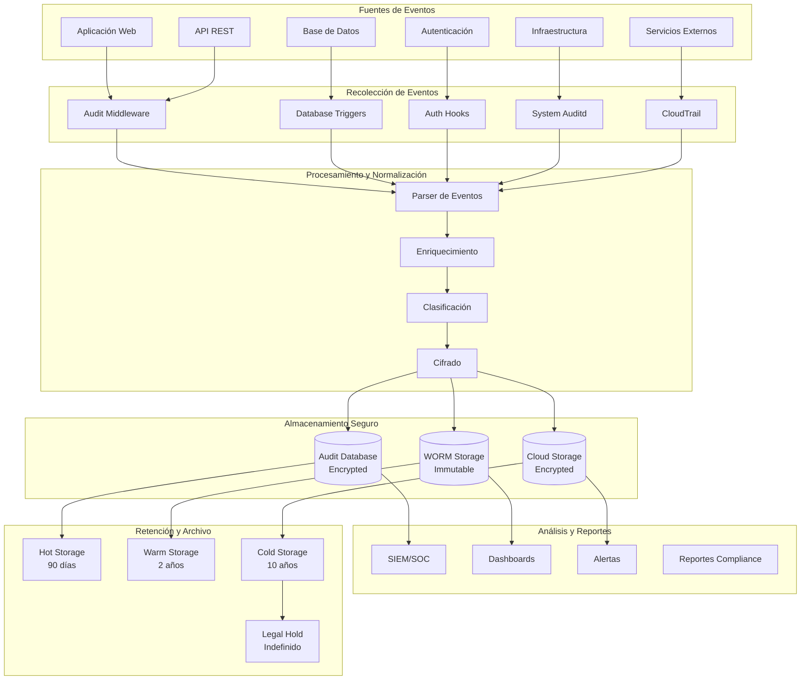

## 🎯 Propósito del Documento

Este documento define la **estrategia completa de auditoría y cumplimiento** del sistema: requisitos legales, logging estructurado, retención de datos, seguridad de registros y procedimientos de auditoría. Es la **guía definitiva para Compliance, Legal, SRE y desarrolladores** sobre cómo garantizar el cumplimiento normativo y mantener registros auditables.

> 💡 **Diferencia clave**:  
> - **`audit.md`** (este documento): Define *requisitos de cumplimiento*, *logging de auditoría* y *procedimientos de auditoría*  
> - **`observability.md`** (`operations/`): Define *monitoreo y alertas* para operaciones  
> - **`infrastructure.md`** (`operations/`): Define la *infraestructura física*  
> - **`security.md`** (`governance/`): Define *seguridad general* del sistema  
>   
> ✅ **Regla moderna**: Todo evento que pueda tener implicaciones legales, regulatorias o de seguridad **debe ser auditado**. Si no está auditado, no existe para fines de cumplimiento.

---

## 📋 Estructura Recomendada

```markdown
# Auditoría y Cumplimiento Normativo

## 1. Visión General y Alcance

### 1.1. Propósito de la Auditoría

> **Declaración de Propósito**: Este documento establece los requisitos, procedimientos y controles para garantizar que todas las operaciones del sistema sean auditables, trazables y cumplan con las normativas aplicables. La auditoría proporciona evidencia objetiva de cumplimiento, detección de actividades no autorizadas y capacidad de investigación forense.

### 1.2. Alcance de la Auditoría

| Componente | Auditado | Frecuencia | Retención | Normativa Aplicable |
|------------|----------|------------|-----------|---------------------|
| **Acceso a Sistema** | ✅ Sí | Continuo | 7 años | Ley 25.326, GDPR |
| **Operaciones de Usuario** | ✅ Sí | Continuo | 7 años | Ley 25.326, HIPAA |
| **Cambios de Configuración** | ✅ Sí | Continuo | 7 años | ISO 27001 |
| **Acceso a Datos Sensibles** | ✅ Sí | Continuo | 10 años | Ley 25.326, HIPAA |
| **Transacciones Financieras** | ✅ Sí | Continuo | 10 años | Ley 23.737 |
| **Modificaciones de Datos** | ✅ Sí | Continuo | 7 años | Ley 25.326 |
| **Logs de Aplicación** | ✅ Sí | Continuo | 90 días | ISO 27001 |
| **Logs de Infraestructura** | ✅ Sí | Continuo | 90 días | ISO 27001 |
| **Backups y Restauraciones** | ✅ Sí | Diario | 7 años | ISO 27001 |
| **Eventos de Seguridad** | ✅ Sí | Continuo | 10 años | Ley 25.326 |

### 1.3. Diagrama de Flujo de Auditoría



---

## 2. Requisitos de Cumplimiento Normativo

### 2.1. Marco Legal Argentino

| Normativa | Requisito | Impacto en Auditoría | Retención Mínima |
|-----------|-----------|---------------------|------------------|
| **Ley 25.326** (Protección de Datos) | Consentimiento, acceso, rectificación, supresión | Logs de acceso a datos personales, consentimientos | 5 años |
| **Ley 23.737** (Narcotráfico) | Prevención de lavado de activos | Logs de transacciones financieras | 10 años |
| **Ley 27.078** (Telecomunicaciones) | Retención de datos de tráfico | Logs de comunicación | 2 años |
| **Res. 1520/2019** (Salud) | Historia clínica digital | Logs de acceso a historias clínicas | Indefinido |
| **RG 3937/2016** (AFIP) | Facturación electrónica | Logs de transacciones | 10 años |

### 2.2. Normativas Internacionales

| Normativa | Requisito | Impacto en Auditoría | Retención Mínima |
|-----------|-----------|---------------------|------------------|
| **GDPR** (UE) | Right to be forgotten, data portability | Logs de borrado, exportación de datos | 5 años |
| **HIPAA** (USA) | Protected Health Information (PHI) | Logs de acceso a datos de salud | 6 años |
| **ISO 27001** | Information Security Management | Logs de seguridad, accesos | 3 años |
| **PCI DSS** | Payment Card Industry | Logs de transacciones con tarjetas | 1 año |
| **SOX** | Sarbanes-Oxley | Logs de controles financieros | 7 años |

### 2.3. Matriz de Cumplimiento

```yaml
# compliance/compliance-matrix.yml

compliance:
  argentina:
    ley_25326:
      name: "Ley de Protección de Datos Personales"
      requirements:
        - consent_tracking
        - access_logs
        - rectification_logs
        - deletion_logs
        - data_breach_notification
      retention: "5 years"
      scope: ["patients", "users", "personal_data"]
    
    ley_23737:
      name: "Ley de Prevención de Lavado de Activos"
      requirements:
        - financial_transaction_logs
        - suspicious_activity_monitoring
        - customer_due_diligence
      retention: "10 years"
      scope: ["payments", "transactions", "financial_data"]
    
    res_1520_2019:
      name: "Resolución 1520/2019 - Historia Clínica Digital"
      requirements:
        - clinical_record_access_logs
        - medical_data_modification_logs
        - audit_trail_clinical_data
      retention: "indefinite"
      scope: ["clinical_analyses", "medical_records", "patient_data"]
  
  international:
    gdpr:
      name: "General Data Protection Regulation"
      requirements:
        - data_subject_access_requests
        - right_to_be_forgotten_logs
        - data_portability_logs
        - consent_management
      retention: "5 years"
      scope: ["eu_citizens", "personal_data"]
    
    hipaa:
      name: "Health Insurance Portability and Accountability Act"
      requirements:
        - phi_access_logs
        - phi_modification_logs
        - phi_deletion_logs
        - security_incident_logs
      retention: "6 years"
      scope: ["protected_health_information", "medical_records"]
    
    iso_27001:
      name: "Information Security Management"
      requirements:
        - security_event_logs
        - access_control_logs
        - change_management_logs
        - incident_response_logs
      retention: "3 years"
      scope: ["all_systems", "security_events"]
```

---

## 3. Estrategia de Logging de Auditoría

### 3.1. Eventos Auditables por Categoría

#### Eventos de Acceso y Autenticación

```typescript
// src/infrastructure/audit/events/access-events.ts

export interface AccessEvent {
  eventId: string;                    // UUID único
  timestamp: string;                  // ISO 8601 timestamp
  eventType: AccessEventType;
  userId?: string;                    // ID del usuario (si autenticado)
  userIp: string;                     // IP del usuario
  userAgent: string;                  // User agent
  sessionId?: string;                 // ID de sesión
  resourceType: ResourceType;         // Tipo de recurso accedido
  resourceId?: string;                // ID del recurso
  action: string;                     // Acción realizada
  status: 'SUCCESS' | 'FAILURE';      // Resultado
  failureReason?: string;             // Razón del fallo (si aplica)
  metadata?: any;                     // Datos adicionales
}

export enum AccessEventType {
  USER_LOGIN = 'USER_LOGIN',
  USER_LOGOUT = 'USER_LOGOUT',
  USER_LOGIN_FAILED = 'USER_LOGIN_FAILED',
  SESSION_CREATED = 'SESSION_CREATED',
  SESSION_EXPIRED = 'SESSION_EXPIRED',
  SESSION_TERMINATED = 'SESSION_TERMINATED',
  PASSWORD_CHANGE = 'PASSWORD_CHANGE',
  PASSWORD_RESET_REQUEST = 'PASSWORD_RESET_REQUEST',
  PASSWORD_RESET_COMPLETE = 'PASSWORD_RESET_COMPLETE',
  MFA_ENABLED = 'MFA_ENABLED',
  MFA_DISABLED = 'MFA_DISABLED',
  MFA_CHALLENGE = 'MFA_CHALLENGE',
  API_KEY_CREATED = 'API_KEY_CREATED',
  API_KEY_REVOKED = 'API_KEY_REVOKED',
  TOKEN_REFRESHED = 'TOKEN_REFRESHED',
  TOKEN_REVOKED = 'TOKEN_REVOKED'
}

export enum ResourceType {
  PATIENT = 'PATIENT',
  ANALYSIS = 'ANALYSIS',
  DOCTOR = 'DOCTOR',
  LABORATORY = 'LABORATORY',
  USER = 'USER',
  PAYMENT = 'PAYMENT',
  REPORT = 'REPORT',
  SYSTEM = 'SYSTEM'
}

// Middleware de auditoría de acceso
export function auditAccessEvent(event: AccessEvent) {
  // Validar evento
  validateAccessEvent(event);
  
  // Enviar a sistema de auditoría
  auditLogger.info('ACCESS_EVENT', event);
  
  // Enviar a SIEM si es evento crítico
  if (isCriticalEvent(event)) {
    sendToSIEM(event);
  }
  
  // Verificar si requiere alerta inmediata
  if (requiresImmediateAlert(event)) {
    triggerAlert(event);
  }
}

function validateAccessEvent(event: AccessEvent) {
  if (!event.eventId) {
    throw new Error('Event ID is required');
  }
  
  if (!event.timestamp) {
    throw new Error('Timestamp is required');
  }
  
  if (!event.eventType) {
    throw new Error('Event type is required');
  }
  
  if (!event.userIp) {
    throw new Error('User IP is required');
  }
}

function isCriticalEvent(event: AccessEvent): boolean {
  const criticalEvents = [
    AccessEventType.USER_LOGIN_FAILED,
    AccessEventType.PASSWORD_RESET_REQUEST,
    AccessEventType.API_KEY_CREATED,
    AccessEventType.TOKEN_REVOKED
  ];
  
  return criticalEvents.includes(event.eventType);
}

function requiresImmediateAlert(event: AccessEvent): boolean {
  // Alerta inmediata para múltiples fallos de login
  if (event.eventType === AccessEventType.USER_LOGIN_FAILED) {
    const recentFailures = getRecentLoginFailures(event.userIp);
    return recentFailures >= 5;
  }
  
  return false;
}
```

#### Eventos de Operaciones de Datos

```typescript
// src/infrastructure/audit/events/data-events.ts

export interface DataOperationEvent {
  eventId: string;
  timestamp: string;
  eventType: DataOperationEventType;
  userId: string;                     // Usuario que realizó la operación
  userRole: string;                   // Rol del usuario
  userIp: string;
  operation: DataOperation;
  resourceType: ResourceType;
  resourceId: string;
  previousState?: any;                // Estado anterior (para updates/deletes)
  newState?: any;                     // Estado nuevo (para creates/updates)
  changes?: DataChange[];             // Lista de cambios específicos
  justification?: string;             // Justificación de la operación
  approvalRequired?: boolean;         // Requiere aprobación
  approvedBy?: string;                // Quién aprobó
  approvalTimestamp?: string;         // Cuándo fue aprobado
  metadata?: {
    transactionId?: string;
    correlationId?: string;
    requestId?: string;
    clientInfo?: any;
  };
}

export enum DataOperationEventType {
  DATA_CREATED = 'DATA_CREATED',
  DATA_READ = 'DATA_READ',
  DATA_UPDATED = 'DATA_UPDATED',
  DATA_DELETED = 'DATA_DELETED',
  DATA_EXPORTED = 'DATA_EXPORTED',
  DATA_IMPORTED = 'DATA_IMPORTED',
  DATA_ARCHIVED = 'DATA_ARCHIVED',
  DATA_RESTORED = 'DATA_RESTORED',
  DATA_ANONYMIZED = 'DATA_ANONYMIZED',
  DATA_PSEUDONYMIZED = 'DATA_PSEUDONYMIZED'
}

export enum DataOperation {
  CREATE = 'CREATE',
  READ = 'READ',
  UPDATE = 'UPDATE',
  DELETE = 'DELETE',
  EXPORT = 'EXPORT',
  IMPORT = 'IMPORT',
  ARCHIVE = 'ARCHIVE',
  RESTORE = 'RESTORE',
  ANONYMIZE = 'ANONYMIZE',
  PSEUDONYMIZE = 'PSEUDONYMIZE'
}

export interface DataChange {
  field: string;                      // Nombre del campo
  oldValue?: any;                     // Valor anterior
  newValue?: any;                     // Valor nuevo
  changeType: 'ADDED' | 'MODIFIED' | 'REMOVED';
}

// Decorador para auditar operaciones de datos
export function auditDataOperation(
  eventType: DataOperationEventType,
  resourceType: ResourceType
) {
  return function (
    target: any,
    propertyKey: string,
    descriptor: PropertyDescriptor
  ) {
    const originalMethod = descriptor.value;
    
    descriptor.value = async function (...args: any[]) {
      const startTime = Date.now();
      const userId = getCurrentUserId();
      const userIp = getCurrentUserIp();
      const requestId = getCurrentRequestId();
      
      try {
        // Ejecutar método original
        const result = await originalMethod.apply(this, args);
        
        // Registrar evento de auditoría
        const event: DataOperationEvent = {
          eventId: generateEventId(),
          timestamp: new Date().toISOString(),
          eventType,
          userId,
          userRole: getCurrentUserRole(),
          userIp,
          operation: getOperationFromEventType(eventType),
          resourceType,
          resourceId: getResourceIdFromArgs(args, result),
          newState: result,
          metadata: {
            requestId,
            executionTime: Date.now() - startTime
          }
        };
        
        auditDataOperationEvent(event);
        
        return result;
      } catch (error) {
        // Registrar evento de fallo
        const failureEvent: DataOperationEvent = {
          eventId: generateEventId(),
          timestamp: new Date().toISOString(),
          eventType: DataOperationEventType.DATA_UPDATED,
          userId,
          userRole: getCurrentUserRole(),
          userIp,
          operation: getOperationFromEventType(eventType),
          resourceType,
          resourceId: getResourceIdFromArgs(args),
          previousState: getPreviousStateFromArgs(args),
          changes: [],
          metadata: {
            requestId,
            executionTime: Date.now() - startTime,
            error: {
              message: error.message,
              stack: error.stack,
              name: error.name
            }
          }
        };
        
        auditDataOperationEvent(failureEvent);
        
        throw error;
      }
    };
    
    return descriptor;
  };
}

// Ejemplo de uso
class AnalysisService {
  @auditDataOperation(DataOperationEventType.DATA_CREATED, ResourceType.ANALYSIS)
  async createAnalysis(data: AnalysisData): Promise<Analysis> {
    // Lógica de creación
    return await this.repository.create(data);
  }
  
  @auditDataOperation(DataOperationEventType.DATA_UPDATED, ResourceType.ANALYSIS)
  async updateAnalysis(id: string, data: Partial<Analysis>): Promise<Analysis> {
    // Lógica de actualización
    return await this.repository.update(id, data);
  }
  
  @auditDataOperation(DataOperationEventType.DATA_DELETED, ResourceType.ANALYSIS)
  async deleteAnalysis(id: string): Promise<void> {
    // Lógica de eliminación
    await this.repository.delete(id);
  }
}
```

#### Eventos de Configuración y Cambios de Sistema

```typescript
// src/infrastructure/audit/events/config-events.ts

export interface ConfigChangeEvent {
  eventId: string;
  timestamp: string;
  eventType: ConfigChangeEventType;
  userId: string;
  userRole: string;
  userIp: string;
  changeType: ConfigChangeType;
  configKey: string;
  previousValue?: any;
  newValue?: any;
  environment: string;
  service: string;
  justification?: string;
  approvalRequired: boolean;
  approvedBy?: string;
  approvalTimestamp?: string;
  rollbackPossible: boolean;
  rollbackInstructions?: string;
  impactAssessment?: string;
  metadata?: {
    deploymentId?: string;
    version?: string;
    changeTicket?: string;
  };
}

export enum ConfigChangeEventType {
  CONFIG_MODIFIED = 'CONFIG_MODIFIED',
  CONFIG_ADDED = 'CONFIG_ADDED',
  CONFIG_REMOVED = 'CONFIG_REMOVED',
  FEATURE_FLAG_ENABLED = 'FEATURE_FLAG_ENABLED',
  FEATURE_FLAG_DISABLED = 'FEATURE_FLAG_DISABLED',
  SYSTEM_PARAMETER_CHANGED = 'SYSTEM_PARAMETER_CHANGED',
  SECURITY_POLICY_UPDATED = 'SECURITY_POLICY_UPDATED',
  ACCESS_CONTROL_MODIFIED = 'ACCESS_CONTROL_MODIFIED',
  INTEGRATION_CONFIGURED = 'INTEGRATION_CONFIGURED',
  INTEGRATION_REMOVED = 'INTEGRATION_REMOVED'
}

export enum ConfigChangeType {
  APPLICATION_CONFIG = 'APPLICATION_CONFIG',
  DATABASE_CONFIG = 'DATABASE_CONFIG',
  SECURITY_CONFIG = 'SECURITY_CONFIG',
  NETWORK_CONFIG = 'NETWORK_CONFIG',
  FEATURE_FLAG = 'FEATURE_FLAG',
  SYSTEM_PARAMETER = 'SYSTEM_PARAMETER',
  ACCESS_CONTROL = 'ACCESS_CONTROL',
  INTEGRATION = 'INTEGRATION'
}

// Logger para cambios de configuración
export class ConfigChangeLogger {
  static log(event: ConfigChangeEvent) {
    // Validar evento
    this.validate(event);
    
    // Registrar en base de datos de auditoría
    this.persistToAuditDB(event);
    
    // Enviar a SIEM
    this.sendToSIEM(event);
    
    // Verificar si requiere aprobación
    if (event.approvalRequired && !event.approvedBy) {
      this.triggerApprovalWorkflow(event);
    }
    
    // Verificar si requiere rollback
    if (event.rollbackPossible) {
      this.createRollbackSnapshot(event);
    }
  }
  
  private static validate(event: ConfigChangeEvent) {
    if (!event.eventId) throw new Error('Event ID is required');
    if (!event.timestamp) throw new Error('Timestamp is required');
    if (!event.userId) throw new Error('User ID is required');
    if (!event.configKey) throw new Error('Config key is required');
  }
  
  private static persistToAuditDB(event: ConfigChangeEvent) {
    // Insertar en base de datos de auditoría (WORM)
    const auditDB = getAuditDatabase();
    auditDB.insert('config_changes', {
      ...event,
      createdAt: new Date(),
      immutable: true
    });
  }
  
  private static sendToSIEM(event: ConfigChangeEvent) {
    // Enviar a SIEM/SOC
    const siemClient = getSIEMClient();
    siemClient.send('CONFIG_CHANGE', event);
  }
  
  private static triggerApprovalWorkflow(event: ConfigChangeEvent) {
    // Notificar al equipo de aprobación
    const approvalService = getApprovalService();
    approvalService.createApprovalRequest({
      eventId: event.eventId,
      configKey: event.configKey,
      requestedBy: event.userId,
      justification: event.justification,
      changeType: event.changeType
    });
  }
  
  private static createRollbackSnapshot(event: ConfigChangeEvent) {
    // Crear snapshot para rollback
    const snapshotService = getSnapshotService();
    snapshotService.createSnapshot({
      configKey: event.configKey,
      value: event.previousValue,
      timestamp: event.timestamp,
      eventId: event.eventId
    });
  }
}
```

---

## 4. Retención de Datos y Políticas

### 4.1. Política de Retención por Tipo de Evento

```yaml
# audit/retention-policy.yml

retention:
  # Logs de acceso y autenticación
  access_logs:
    hot_storage: "90 days"      # Almacenamiento caliente (consulta rápida)
    warm_storage: "2 years"     # Almacenamiento tibio (consulta ocasional)
    cold_storage: "7 years"     # Almacenamiento frío (archivado)
    legal_hold: "indefinite"    # Retención legal (si aplica)
  
  # Logs de operaciones de datos
  data_operation_logs:
    hot_storage: "90 days"
    warm_storage: "2 years"
    cold_storage: "7 years"
    legal_hold: "indefinite"
  
  # Logs de cambios de configuración
  config_change_logs:
    hot_storage: "90 days"
    warm_storage: "3 years"
    cold_storage: "10 years"
    legal_hold: "indefinite"
  
  # Logs de eventos de seguridad
  security_event_logs:
    hot_storage: "90 days"
    warm_storage: "3 years"
    cold_storage: "10 years"
    legal_hold: "indefinite"
  
  # Logs de transacciones financieras
  financial_transaction_logs:
    hot_storage: "90 days"
    warm_storage: "3 years"
    cold_storage: "10 years"
    legal_hold: "indefinite"
  
  # Logs de acceso a datos sensibles (PHI, PII)
  sensitive_data_access_logs:
    hot_storage: "90 days"
    warm_storage: "3 years"
    cold_storage: "10 years"
    legal_hold: "indefinite"
  
  # Logs de auditoría de cumplimiento
  compliance_audit_logs:
    hot_storage: "90 days"
    warm_storage: "3 years"
    cold_storage: "10 years"
    legal_hold: "indefinite"
  
  # Backups y restauraciones
  backup_restore_logs:
    hot_storage: "90 days"
    warm_storage: "2 years"
    cold_storage: "7 years"
    legal_hold: "indefinite"
  
  # Logs de aplicación (no auditables)
  application_logs:
    hot_storage: "30 days"
    warm_storage: "90 days"
    cold_storage: "1 year"
    legal_hold: "none"
  
  # Logs de infraestructura (no auditables)
  infrastructure_logs:
    hot_storage: "30 days"
    warm_storage: "90 days"
    cold_storage: "1 year"
    legal_hold: "none"

storage_tiers:
  hot:
    type: "SSD"
    encryption: "AES-256"
    access: "immediate"
    cost: "high"
  
  warm:
    type: "HDD"
    encryption: "AES-256"
    access: "minutes"
    cost: "medium"
  
  cold:
    type: "Glacier/WORM"
    encryption: "AES-256"
    access: "hours"
    cost: "low"
    immutable: true
  
  legal_hold:
    type: "WORM (Write Once Read Many)"
    encryption: "AES-256"
    access: "restricted"
    cost: "variable"
    immutable: true
    requires_approval: true
```

### 4.2. Script de Gestión de Retención

```bash
#!/bin/bash
# audit/scripts/manage-retention.sh

set -e

# Variables
AUDIT_DB="audit_logs"
HOT_STORAGE_DAYS=90
WARM_STORAGE_DAYS=730  # 2 años
COLD_STORAGE_DAYS=2555  # 7 años
LEGAL_HOLD_DAYS=3650    # 10 años

echo "🔄 Iniciando gestión de retención de logs de auditoría..."

# 1. Mover logs de hot a warm storage (más de 90 días)
echo "📦 Moviendo logs de hot a warm storage..."
psql -d $AUDIT_DB <<EOF
BEGIN;

-- Crear partición warm si no existe
CREATE TABLE IF NOT EXISTS audit_logs_warm PARTITION OF audit_logs
FOR VALUES FROM ('YYYY-MM-DD') TO ('YYYY-MM-DD');

-- Mover logs antiguos a warm storage
INSERT INTO audit_logs_warm
SELECT * FROM audit_logs
WHERE created_at < NOW() - INTERVAL '$HOT_STORAGE_DAYS days'
  AND created_at >= NOW() - INTERVAL '$WARM_STORAGE_DAYS days';

-- Eliminar de hot storage
DELETE FROM audit_logs
WHERE created_at < NOW() - INTERVAL '$HOT_STORAGE_DAYS days'
  AND created_at >= NOW() - INTERVAL '$WARM_STORAGE_DAYS days';

COMMIT;
EOF

# 2. Mover logs de warm a cold storage (más de 2 años)
echo "❄️  Moviendo logs de warm a cold storage..."
psql -d $AUDIT_DB <<EOF
BEGIN;

-- Exportar logs a archivo para cold storage
COPY (
  SELECT * FROM audit_logs_warm
  WHERE created_at < NOW() - INTERVAL '$WARM_STORAGE_DAYS days'
    AND created_at >= NOW() - INTERVAL '$COLD_STORAGE_DAYS days'
) TO '/tmp/audit_logs_cold_$(date +%Y%m%d).csv' WITH CSV HEADER;

-- Subir a S3 Glacier
aws s3 cp /tmp/audit_logs_cold_$(date +%Y%m%d).csv \
  s3://audit-logs-cold-storage/$(date +%Y)/$(date +%m)/audit_logs_$(date +%Y%m%d).csv \
  --storage-class GLACIER

-- Eliminar de warm storage
DELETE FROM audit_logs_warm
WHERE created_at < NOW() - INTERVAL '$WARM_STORAGE_DAYS days'
  AND created_at >= NOW() - INTERVAL '$COLD_STORAGE_DAYS days';

COMMIT;
EOF

# 3. Archivar logs para legal hold (más de 7 años)
echo "⚖️  Archivando logs para legal hold..."
psql -d $AUDIT_DB <<EOF
BEGIN;

-- Exportar logs para legal hold
COPY (
  SELECT * FROM audit_logs_cold
  WHERE created_at < NOW() - INTERVAL '$COLD_STORAGE_DAYS days'
    AND retention_policy = 'LEGAL_HOLD'
) TO '/tmp/audit_logs_legal_$(date +%Y%m%d).csv' WITH CSV HEADER;

-- Subir a S3 con WORM (Object Lock)
aws s3 cp /tmp/audit_logs_legal_$(date +%Y%m%d).csv \
  s3://audit-logs-legal-hold/$(date +%Y)/audit_logs_legal_$(date +%Y%m%d).csv \
  --storage-class GLACIER_IR \
  --object-lock-mode GOVERNANCE \
  --object-lock-retain-until-date $(date -d '+10 years' +%Y-%m-%d)

COMMIT;
EOF

# 4. Eliminar logs expirados (sin legal hold)
echo "🗑️  Eliminando logs expirados..."
psql -d $AUDIT_DB <<EOF
BEGIN;

-- Eliminar logs sin legal hold más antiguos de 10 años
DELETE FROM audit_logs_cold
WHERE created_at < NOW() - INTERVAL '$LEGAL_HOLD_DAYS days'
  AND retention_policy != 'LEGAL_HOLD';

COMMIT;
EOF

# 5. Verificar integridad de logs
echo "✅ Verificando integridad de logs..."
psql -d $AUDIT_DB -c "
SELECT 
  COUNT(*) as total_logs,
  COUNT(CASE WHEN created_at >= NOW() - INTERVAL '90 days' THEN 1 END) as hot_logs,
  COUNT(CASE WHEN created_at < NOW() - INTERVAL '90 days' AND created_at >= NOW() - INTERVAL '730 days' THEN 1 END) as warm_logs,
  COUNT(CASE WHEN created_at < NOW() - INTERVAL '730 days' THEN 1 END) as cold_logs
FROM audit_logs;
"

echo "🎉 Gestión de retención completada exitosamente!"
```

---

## 5. Seguridad y Protección de Datos Auditados

### 5.1. Encriptación de Logs de Auditoría

```typescript
// src/infrastructure/audit/encryption.ts

import { createCipheriv, createDecipheriv, randomBytes } from 'crypto';

export class AuditLogEncryptor {
  private static readonly ALGORITHM = 'aes-256-gcm';
  private static readonly IV_LENGTH = 16;
  private static readonly AUTH_TAG_LENGTH = 16;
  
  /**
   * Encriptar evento de auditoría
   */
  static encrypt(event: any, encryptionKey: string): EncryptedAuditLog {
    // Generar IV aleatorio
    const iv = randomBytes(this.IV_LENGTH);
    
    // Crear cipher
    const cipher = createCipheriv(
      this.ALGORITHM,
      Buffer.from(encryptionKey, 'hex'),
      iv
    );
    
    // Encriptar datos
    const jsonString = JSON.stringify(event);
    const encryptedData = cipher.update(jsonString, 'utf8', 'hex');
    cipher.final();
    
    // Obtener tag de autenticación
    const authTag = cipher.getAuthTag();
    
    return {
      iv: iv.toString('hex'),
      authTag: authTag.toString('hex'),
      encryptedData,
      encryptionTimestamp: new Date().toISOString(),
      encryptionAlgorithm: this.ALGORITHM
    };
  }
  
  /**
   * Desencriptar evento de auditoría
   */
  static decrypt(
    encryptedLog: EncryptedAuditLog,
    encryptionKey: string
  ): any {
    // Crear decipher
    const decipher = createDecipheriv(
      this.ALGORITHM,
      Buffer.from(encryptionKey, 'hex'),
      Buffer.from(encryptedLog.iv, 'hex')
    );
    
    // Establecer tag de autenticación
    decipher.setAuthTag(Buffer.from(encryptedLog.authTag, 'hex'));
    
    // Desencriptar datos
    const decryptedData = decipher.update(
      encryptedLog.encryptedData,
      'hex',
      'utf8'
    );
    decipher.final();
    
    return JSON.parse(decryptedData);
  }
  
  /**
   * Verificar integridad del log
   */
  static verifyIntegrity(
    encryptedLog: EncryptedAuditLog,
    expectedHash: string
  ): boolean {
    const actualHash = this.calculateHash(encryptedLog);
    return actualHash === expectedHash;
  }
  
  private static calculateHash(encryptedLog: EncryptedAuditLog): string {
    const crypto = require('crypto');
    const hash = crypto.createHash('sha256');
    hash.update(JSON.stringify(encryptedLog));
    return hash.digest('hex');
  }
}

export interface EncryptedAuditLog {
  iv: string;                    // Vector de inicialización
  authTag: string;               // Tag de autenticación
  encryptedData: string;         // Datos encriptados (hex)
  encryptionTimestamp: string;   // Cuándo fue encriptado
  encryptionAlgorithm: string;   // Algoritmo usado
  hash?: string;                 // Hash para verificación de integridad
}
```

### 5.2. Acceso Controlado a Logs de Auditoría

```typescript
// src/infrastructure/audit/access-control.ts

export class AuditLogAccessControl {
  private static readonly AUTHORIZED_ROLES = [
    'AUDIT_ADMIN',
    'COMPLIANCE_OFFICER',
    'SECURITY_ANALYST',
    'LEGAL_COUNSEL',
    'SYSTEM_ADMIN'
  ];
  
  private static readonly ACCESS_LEVELS = {
    READ_ONLY: ['COMPLIANCE_OFFICER', 'LEGAL_COUNSEL'],
    READ_WRITE: ['AUDIT_ADMIN', 'SECURITY_ANALYST'],
    FULL_ACCESS: ['SYSTEM_ADMIN']
  };
  
  /**
   * Verificar si usuario tiene permiso para acceder a logs
   */
  static async checkAccess(
    userId: string,
    userRole: string,
    requestedAction: AuditLogAction,
    timeRange?: TimeRange,
    eventType?: string
  ): Promise<AccessCheckResult> {
    // Verificar rol autorizado
    if (!this.AUTHORIZED_ROLES.includes(userRole)) {
      return {
        allowed: false,
        reason: 'UNAUTHORIZED_ROLE',
        requiredRole: this.AUTHORIZED_ROLES
      };
    }
    
    // Verificar nivel de acceso
    const accessLevel = this.ACCESS_LEVELS[userRole];
    if (!accessLevel || !accessLevel.includes(requestedAction)) {
      return {
        allowed: false,
        reason: 'INSUFFICIENT_PERMISSIONS',
        requiredAccess: accessLevel
      };
    }
    
    // Verificar rango de tiempo (máximo 90 días para roles no-admin)
    if (timeRange && userRole !== 'SYSTEM_ADMIN') {
      const daysRequested = this.calculateDays(timeRange);
      if (daysRequested > 90) {
        return {
          allowed: false,
          reason: 'TIME_RANGE_TOO_LARGE',
          maxDays: 90
        };
      }
    }
    
    // Verificar tipo de evento (algunos eventos requieren aprobación adicional)
    if (eventType && this.requiresAdditionalApproval(eventType)) {
      const approvalStatus = await this.checkApprovalStatus(userId, eventType);
      if (!approvalStatus.approved) {
        return {
          allowed: false,
          reason: 'REQUIRES_APPROVAL',
          approvalTicket: approvalStatus.ticketId
        };
      }
    }
    
    // Registrar acceso a logs de auditoría
    await this.logAccessAttempt({
      userId,
      userRole,
      action: requestedAction,
      timeRange,
      eventType,
      accessGranted: true,
      timestamp: new Date().toISOString()
    });
    
    return {
      allowed: true,
      reason: 'ACCESS_GRANTED'
    };
  }
  
  /**
   * Registrar intento de acceso a logs
   */
  private static async logAccessAttempt(attempt: AccessAttempt) {
    const auditEvent: AuditLogAccessEvent = {
      eventId: generateEventId(),
      timestamp: attempt.timestamp,
      eventType: 'AUDIT_LOG_ACCESS',
      userId: attempt.userId,
      userRole: attempt.userRole,
      action: attempt.action,
      timeRange: attempt.timeRange,
      eventType: attempt.eventType,
      accessGranted: attempt.accessGranted,
      ipAddress: getCurrentUserIp(),
      userAgent: getCurrentUserAgent(),
      sessionId: getCurrentSessionId()
    };
    
    // Guardar en base de datos de auditoría (separada)
    await this.persistAccessLog(auditEvent);
  }
  
  private static requiresAdditionalApproval(eventType: string): boolean {
    const sensitiveEventTypes = [
      'DATA_DELETED',
      'USER_LOGIN_FAILED',
      'SECURITY_POLICY_UPDATED',
      'ACCESS_CONTROL_MODIFIED'
    ];
    
    return sensitiveEventTypes.includes(eventType);
  }
  
  private static async checkApprovalStatus(
    userId: string,
    eventType: string
  ): Promise<ApprovalStatus> {
    // Verificar si hay aprobación pendiente o existente
    const approval = await getApprovalService().getApprovalForUserAndEvent(
      userId,
      eventType
    );
    
    return {
      approved: approval?.status === 'APPROVED',
      ticketId: approval?.ticketId,
      expiresAt: approval?.expiresAt
    };
  }
}

export interface AccessCheckResult {
  allowed: boolean;
  reason: string;
  requiredRole?: string[];
  requiredAccess?: string[];
  maxDays?: number;
  approvalTicket?: string;
}

export type AuditLogAction = 'VIEW' | 'EXPORT' | 'DELETE' | 'MODIFY';

export interface TimeRange {
  start: Date;
  end: Date;
}

export interface AccessAttempt {
  userId: string;
  userRole: string;
  action: AuditLogAction;
  timeRange?: TimeRange;
  eventType?: string;
  accessGranted: boolean;
  timestamp: string;
}

export interface AuditLogAccessEvent {
  eventId: string;
  timestamp: string;
  eventType: 'AUDIT_LOG_ACCESS';
  userId: string;
  userRole: string;
  action: AuditLogAction;
  timeRange?: TimeRange;
  eventType?: string;
  accessGranted: boolean;
  ipAddress: string;
  userAgent: string;
  sessionId: string;
}

export interface ApprovalStatus {
  approved: boolean;
  ticketId?: string;
  expiresAt?: Date;
}
```

---

## 6. Procedimientos de Auditoría

### 6.1. Checklist de Auditoría Interna

```markdown
# Checklist de Auditoría Interna Trimestral

## Pre-Auditoría

### Documentación y Políticas
- [ ] Revisar políticas de auditoría actualizadas
- [ ] Verificar que todos los eventos auditables están definidos
- [ ] Confirmar retención de datos según políticas
- [ ] Revisar procedimientos de acceso a logs

### Configuración Técnica
- [ ] Verificar que todos los sistemas generan logs de auditoría
- [ ] Confirmar encriptación de logs en tránsito y reposo
- [ ] Verificar configuración de WORM storage
- [ ] Revisar configuración de SIEM/SOC
- [ ] Confirmar backups de logs de auditoría

## Ejecución de Auditoría

### Revisión de Logs
- [ ] Muestreo aleatorio de logs de acceso (últimos 30 días)
- [ ] Verificación de logs de operaciones de datos críticos
- [ ] Revisión de logs de cambios de configuración
- [ ] Análisis de logs de eventos de seguridad
- [ ] Verificación de logs de transacciones financieras

### Verificación de Integridad
- [ ] Validar hashes de logs (no han sido modificados)
- [ ] Verificar secuencialidad de eventos (no hay gaps)
- [ ] Confirmar timestamps consistentes
- [ ] Verificar firma digital de logs críticos

### Pruebas de Acceso
- [ ] Verificar que solo roles autorizados pueden acceder
- [ ] Probar procedimientos de aprobación para acceso sensible
- [ ] Verificar logs de acceso a logs de auditoría
- [ ] Probar recuperación de logs desde cold storage

### Pruebas de Retención
- [ ] Verificar que logs antiguos están en cold storage
- [ ] Probar recuperación de logs archivados
- [ ] Verificar que logs expirados han sido eliminados
- [ ] Confirmar legal hold para logs requeridos

## Post-Auditoría

### Reporte de Hallazgos
- [ ] Documentar hallazgos no conformes
- [ ] Clasificar hallazgos por severidad
- [ ] Asignar responsables para remediación
- [ ] Establecer timeline para corrección

### Plan de Remediación
- [ ] Crear tickets para cada hallazgo
- [ ] Establecer prioridades basadas en riesgo
- [ ] Definir criterios de aceptación
- [ ] Programar seguimiento

### Mejora Continua
- [ ] Actualizar políticas basadas en hallazgos
- [ ] Mejorar procedimientos de auditoría
- [ ] Capacitar equipo en áreas identificadas
- [ ] Implementar controles preventivos

## Firma y Aprobación

| Rol | Nombre | Fecha | Firma |
|-----|--------|-------|-------|
| **Auditor Interno** | | | |
| **Compliance Officer** | | | |
| **Security Lead** | | | |
| **System Admin** | | | |

---
**Fecha de Auditoría**: _________________________
**Próxima Auditoría**: _________________________
```

### 6.2. Procedimiento de Investigación Forense

```markdown
# Procedimiento de Investigación Forense

## Activación

### Trigger para Investigación
- [ ] Alerta de SIEM/SOC
- [ ] Reporte de usuario
- [ ] Detección automática de anomalías
- [ ] Requerimiento legal/regulatorio
- [ ] Incidente de seguridad confirmado

### Notificación Inicial
1. **Notificar al equipo de respuesta**:
   - Security Lead
   - Compliance Officer
   - Legal Counsel
   - System Admin
   - Incident Response Team

2. **Establecer sala de guerra**:
   - Canal de comunicación dedicado
   - Documento de seguimiento compartido
   - Roles y responsabilidades asignados

3. **Preservar evidencia**:
   - Activar legal hold en logs relevantes
   - Crear snapshot de sistemas afectados
   - Preservar memoria RAM si aplica
   - Documentar estado actual del sistema

## Fase 1: Recolección de Evidencia

### Logs de Auditoría
- [ ] Recuperar logs de acceso del período relevante
- [ ] Extraer logs de operaciones de datos
- [ ] Obtener logs de cambios de configuración
- [ ] Recopilar logs de eventos de seguridad
- [ ] Exportar logs de transacciones financieras

### Datos Adicionales
- [ ] Capturas de pantalla de sistemas afectados
- [ ] Registros de red (packet captures)
- [ ] Configuraciones de sistemas
- [ ] Backups relevantes
- [ ] Comunicaciones relacionadas

### Cadena de Custodia
- [ ] Documentar quién recolectó cada evidencia
- [ ] Registrar fecha y hora de recolección
- [ ] Calcular y registrar hash de cada archivo
- [ ] Establecer custodio responsable
- [ ] Documentar cualquier acceso a evidencia

## Fase 2: Análisis de Evidencia

### Correlación de Eventos
1. **Crear línea de tiempo**:
   - Ordenar eventos cronológicamente
   - Identificar gaps en logs
   - Correlacionar eventos de múltiples fuentes

2. **Identificar patrones**:
   - Actividad anómala
   - Comportamiento de usuario inusual
   - Accesos fuera de horario
   - Múltiples fallos de autenticación

3. **Determinar alcance**:
   - Sistemas afectados
   - Datos comprometidos
   - Usuarios impactados
   - Periodo de tiempo

### Análisis Técnico
- [ ] Revisar logs de aplicación detallados
- [ ] Analizar trazas de red
- [ ] Examinar configuraciones de seguridad
- [ ] Verificar integridad de sistemas
- [ ] Identificar vulnerabilidades explotadas

## Fase 3: Documentación y Reporte

### Reporte de Investigación
**Secciones requeridas**:
1. **Resumen Ejecutivo**
   - Hallazgos principales
   - Impacto del incidente
   - Recomendaciones clave

2. **Metodología**
   - Procedimientos seguidos
   - Herramientas utilizadas
   - Limitaciones del análisis

3. **Hallazgos Detallados**
   - Línea de tiempo completa
   - Evidencia recopilada
   - Análisis técnico detallado

4. **Conclusiones**
   - Causa raíz identificada
   - Actores involucrados (si aplica)
   - Impacto cuantificado

5. **Recomendaciones**
   - Acciones correctivas inmediatas
   - Mejoras de seguridad a largo plazo
   - Cambios en políticas/procedimientos

### Documentación de Soporte
- [ ] Capturas de pantalla
- [ ] Logs completos
- [ ] Análisis forense
- [ ] Comunicaciones relevantes
- [ ] Testimonios (si aplica)

## Fase 4: Remediación y Cierre

### Acciones Correctivas
- [ ] Implementar recomendaciones prioritarias
- [ ] Aplicar parches de seguridad
- [ ] Modificar configuraciones
- [ ] Capacitar personal afectado
- [ ] Actualizar políticas/procedimientos

### Verificación de Cierre
- [ ] Confirmar que causa raíz ha sido abordada
- [ ] Verificar que vulnerabilidades han sido mitigadas
- [ ] Validar que controles preventivos están funcionando
- [ ] Documentar lecciones aprendidas
- [ ] Programar revisión de seguimiento

### Comunicación de Cierre
- [ ] Notificar a stakeholders que investigación ha concluido
- [ ] Compartir resumen de hallazgos (según políticas)
- [ ] Documentar cierre formal
- [ ] Archivar evidencia según retención

## Firma y Aprobación

| Rol | Nombre | Fecha | Firma |
|-----|--------|-------|-------|
| **Investigador Principal** | | | |
| **Security Lead** | | | |
| **Compliance Officer** | | | |
| **Legal Counsel** | | | |

---
**Fecha de Inicio**: _________________________
**Fecha de Cierre**: _________________________
**Número de Caso**: _________________________
```

---

## 7. Reportes y Dashboards de Auditoría

### 7.1. Dashboard de Cumplimiento

```json
{
  "dashboard": {
    "id": null,
    "uid": "compliance-dashboard",
    "title": "Compliance & Audit Dashboard",
    "tags": ["compliance", "audit", "security"],
    "timezone": "browser",
    "schemaVersion": 16,
    "refresh": "5m",
    "panels": [
      {
        "id": 1,
        "title": "Events by Severity",
        "type": "piechart",
        "targets": [
          {
            "expr": "sum(audit_events_total) by (severity)",
            "legendFormat": "{{severity}}"
          }
        ],
        "gridPos": { "h": 8, "w": 12, "x": 0, "y": 0 }
      },
      {
        "id": 2,
        "title": "Events by Type (24h)",
        "type": "barchart",
        "targets": [
          {
            "expr": "sum(increase(audit_events_total[24h])) by (event_type)",
            "legendFormat": "{{event_type}}"
          }
        ],
        "gridPos": { "h": 8, "w": 12, "x": 12, "y": 0 }
      },
      {
        "id": 3,
        "title": "Top Users by Activity",
        "type": "table",
        "targets": [
          {
            "expr": "topk(10, sum(increase(audit_events_total[24h])) by (user_id, user_role))",
            "legendFormat": "{{user_id}} ({{user_role}})"
          }
        ],
        "gridPos": { "h": 8, "w": 12, "x": 0, "y": 8 }
      },
      {
        "id": 4,
        "title": "Failed Login Attempts",
        "type": "graph",
        "targets": [
          {
            "expr": "sum(rate(audit_events_total{event_type=\"USER_LOGIN_FAILED\"}[5m]))",
            "legendFormat": "Failed Logins/min"
          }
        ],
        "gridPos": { "h": 8, "w": 12, "x": 12, "y": 8 }
      },
      {
        "id": 5,
        "title": "Data Access by Sensitivity",
        "type": "piechart",
        "targets": [
          {
            "expr": "sum(increase(audit_events_total{resource_type=~\"PATIENT|MEDICAL_RECORD\"}[24h])) by (resource_type)",
            "legendFormat": "{{resource_type}}"
          }
        ],
        "gridPos": { "h": 8, "w": 12, "x": 0, "y": 16 }
      },
      {
        "id": 6,
        "title": "Compliance Status",
        "type": "stat",
        "targets": [
          {
            "expr": "compliance_checks_passed / (compliance_checks_passed + compliance_checks_failed) * 100",
            "legendFormat": "Compliance %" 
          }
        ],
        "options": {
          "colorMode": "value",
          "thresholds": {
            "mode": "absolute",
            "steps": [
              { "color": "red", "value": 0 },
              { "color": "yellow", "value": 90 },
              { "color": "green", "value": 95 }
            ]
          }
        },
        "gridPos": { "h": 4, "w": 6, "x": 12, "y": 16 }
      },
      {
        "id": 7,
        "title": "Storage Usage by Tier",
        "type": "barchart",
        "targets": [
          {
            "expr": "audit_storage_bytes{tier=\"hot\"}",
            "legendFormat": "Hot Storage"
          },
          {
            "expr": "audit_storage_bytes{tier=\"warm\"}",
            "legendFormat": "Warm Storage"
          },
          {
            "expr": "audit_storage_bytes{tier=\"cold\"}",
            "legendFormat": "Cold Storage"
          }
        ],
        "gridPos": { "h": 8, "w": 12, "x": 12, "y": 20 }
      },
      {
        "id": 8,
        "title": "Recent Security Events",
        "type": "table",
        "targets": [
          {
            "expr": "last_over_time(audit_events{severity=\"CRITICAL\"}[1h])",
            "legendFormat": "{{event_type}} - {{description}}"
          }
        ],
        "gridPos": { "h": 8, "w": 12, "x": 0, "y": 24 }
      }
    ]
  }
}
```

### 7.2. Reporte de Cumplimiento Mensual

```typescript
// scripts/generate-compliance-report.ts

import { writeFileSync } from 'fs';
import { format } from 'date-fns';

interface ComplianceMetrics {
  totalEvents: number;
  eventsByType: Map<string, number>;
  eventsBySeverity: Map<string, number>;
  failedLogins: number;
  dataAccessEvents: number;
  configChangeEvents: number;
  securityEvents: number;
  complianceScore: number;
  storageUsage: {
    hot: number;
    warm: number;
    cold: number;
  };
  retentionCompliance: {
    compliant: number;
    nonCompliant: number;
  };
}

async function generateMonthlyComplianceReport(): Promise<void> {
  const startDate = new Date();
  startDate.setMonth(startDate.getMonth() - 1);
  const endDate = new Date();
  
  const metrics = await calculateComplianceMetrics(startDate, endDate);
  
  const report = `
# Reporte de Cumplimiento Mensual
**Período**: ${format(startDate, 'MMM dd, yyyy')} - ${format(endDate, 'MMM dd, yyyy')}
**Generado**: ${format(new Date(), 'MMM dd, yyyy HH:mm:ss')}

## Resumen Ejecutivo

- **Total de Eventos Auditados**: ${metrics.totalEvents.toLocaleString()}
- **Puntuación de Cumplimiento**: ${metrics.complianceScore}%
- **Eventos de Seguridad Críticos**: ${metrics.securityEvents}
- **Intentos de Login Fallidos**: ${metrics.failedLogins}

## Métricas Detalladas

### Eventos por Tipo
${Array.from(metrics.eventsByType.entries())
  .map(([type, count]) => `- ${type}: ${count.toLocaleString()}`)
  .join('\n')}

### Eventos por Severidad
${Array.from(metrics.eventsBySeverity.entries())
  .map(([severity, count]) => `- ${severity}: ${count.toLocaleString()}`)
  .join('\n')}

### Acceso a Datos
- **Eventos de Acceso a Datos**: ${metrics.dataAccessEvents.toLocaleString()}
- **Datos Sensibles Accedidos**: ${calculateSensitiveDataAccess(metrics)}

### Cambios de Configuración
- **Cambios Totales**: ${metrics.configChangeEvents.toLocaleString()}
- **Cambios sin Aprobación**: ${calculateUnapprovedChanges(metrics)}

### Almacenamiento
- **Hot Storage**: ${formatBytes(metrics.storageUsage.hot)}
- **Warm Storage**: ${formatBytes(metrics.storageUsage.warm)}
- **Cold Storage**: ${formatBytes(metrics.storageUsage.cold)}

### Retención de Datos
- **Registros Compliant**: ${metrics.retentionCompliance.compliant.toLocaleString()}
- **Registros No Compliant**: ${metrics.retentionCompliance.nonCompliant.toLocaleString()}
- **Porcentaje Compliant**: ${(
    (metrics.retentionCompliance.compliant /
      (metrics.retentionCompliance.compliant + metrics.retentionCompliance.nonCompliant)) *
    100
  ).toFixed(2)}%

## Hallazgos y Recomendaciones

### Hallazgos
${generateFindings(metrics)}

### Recomendaciones
${generateRecommendations(metrics)}

## Firma y Aprobación

| Rol | Nombre | Fecha | Firma |
|-----|--------|-------|-------|
| **Compliance Officer** | | | |
| **Security Lead** | | | |
| **System Admin** | | | |

---
**Próximo Reporte**: ${format(new Date(endDate.getTime() + 30 * 24 * 60 * 60 * 1000), 'MMM dd, yyyy')}
`;

  writeFileSync(
    `reports/compliance-${format(endDate, 'yyyy-MM')}.md`,
    report
  );
  
  console.log('✅ Reporte de cumplimiento generado exitosamente');
}

function formatBytes(bytes: number): string {
  if (bytes === 0) return '0 Bytes';
  const k = 1024;
  const sizes = ['Bytes', 'KB', 'MB', 'GB', 'TB'];
  const i = Math.floor(Math.log(bytes) / Math.log(k));
  return Math.round(bytes / Math.pow(k, i) * 100) / 100 + ' ' + sizes[i];
}

// Ejecutar reporte
generateMonthlyComplianceReport().catch(console.error);
```

---

## 8. Checklist de Calidad para Auditoría

Antes de considerar la auditoría completa, verifica:

### ✅ Eventos y Logging
- [ ] Todos los eventos críticos están definidos y documentados
- [ ] Logs de auditoría son inmutables (WORM storage)
- [ ] Logs están encriptados en tránsito y reposo
- [ ] Timestamps son consistentes y confiables
- [ ] Secuencialidad de eventos está garantizada
- [ ] Hashes de integridad están implementados

### ✅ Retención y Almacenamiento
- [ ] Política de retención definida por tipo de evento
- [ ] Mecanismos de retención automática implementados
- [ ] Legal hold puede activarse manualmente
- [ ] Recuperación de logs archivados probada
- [ ] Verificación periódica de integridad implementada

### ✅ Seguridad y Acceso
- [ ] Solo roles autorizados pueden acceder a logs
- [ ] Acceso a logs de auditoría está auditado
- [ ] Aprobaciones adicionales para acceso sensible
- [ ] Separación de duties implementada
- [ ] Alertas para accesos no autorizados

### ✅ Cumplimiento Normativo
- [ ] Requisitos legales argentinos implementados
- [ ] Requisitos internacionales aplicables implementados
- [ ] Reportes de cumplimiento generados periódicamente
- [ ] Auditorías internas realizadas según schedule
- [ ] Procedimientos de investigación forense documentados

### ✅ Herramientas y Procesos
- [ ] SIEM/SOC integrado y funcional
- [ ] Dashboards de auditoría accesibles
- [ ] Alertas configuradas para eventos críticos
- [ ] Procedimientos de respuesta a incidentes documentados
- [ ] Capacitación del equipo realizada

---

## 💡 Consejos para una Auditoría Efectiva

### ❌ Errores Comunes a Evitar
| Error | Consecuencia | Solución |
|-------|--------------|----------|
| **Logs modificables** | Evidencia no confiable | Usar WORM storage |
| **Sin encriptación** | Exposición de datos sensibles | Encriptar siempre |
| **Acceso no controlado** | Violación de privacidad | RBAC estricto |
| **Retención insuficiente** | No cumplimiento legal | Seguir normativas |
| **Sin procedimientos** | Respuesta caótica a incidentes | Documentar todo |

### ✅ Buenas Prácticas Modernas
1. **Immutable Logs**: Nunca permitir modificación de logs de auditoría; usar WORM storage.

2. **Zero Trust Access**: Verificar cada acceso a logs, incluso de administradores.

3. **Automate Retention**: Implementar retención automática basada en políticas.

4. **Regular Audits**: Realizar auditorías internas periódicas (trimestrales como mínimo).

5. **Forensic Readiness**: Mantener evidencia en formato forense listo para análisis.

6. **Legal Hold**: Implementar capacidad de retención legal indefinida cuando sea necesario.

7. **Continuous Monitoring**: Monitorear logs de auditoría en tiempo real para detección temprana.

8. **Documentation**: Documentar todos los procedimientos y mantenerlos actualizados.

---

## 📄 Plantilla Resumida para Evento de Auditoría

```typescript
/**
 * Plantilla para evento de auditoría
 * Todos los eventos deben seguir esta estructura
 */
export interface AuditEvent {
  // Identificación única
  eventId: string;                    // UUID v4
  timestamp: string;                  // ISO 8601 UTC
  
  // Clasificación
  eventType: string;                  // Tipo de evento (enum)
  severity: 'INFO' | 'WARNING' | 'ERROR' | 'CRITICAL';
  category: string;                   // Categoría (access, data, config, security)
  
  // Contexto del usuario
  userId?: string;                    // ID del usuario (si aplica)
  userRole?: string;                  // Rol del usuario
  userIp: string;                     // IP del usuario
  userAgent: string;                  // User agent
  sessionId?: string;                 // ID de sesión
  
  // Contexto del recurso
  resourceType?: string;              // Tipo de recurso afectado
  resourceId?: string;                // ID del recurso afectado
  resourceName?: string;              // Nombre del recurso (para humanos)
  
  // Detalles de la operación
  action: string;                     // Acción realizada
  status: 'SUCCESS' | 'FAILURE';      // Resultado de la operación
  failureReason?: string;             // Razón del fallo (si aplica)
  
  // Datos de la operación
  previousState?: any;                // Estado anterior (para updates/deletes)
  newState?: any;                     // Estado nuevo (para creates/updates)
  changes?: DataChange[];             // Cambios específicos
  
  // Justificación y aprobación
  justification?: string;             // Justificación de la operación
  approvalRequired?: boolean;         // Requiere aprobación
  approvedBy?: string;                // Quién aprobó
  approvalTimestamp?: string;         // Cuándo fue aprobado
  approvalTicket?: string;            // Ticket de aprobación
  
  // Metadatos técnicos
  metadata?: {
    transactionId?: string;           // ID de transacción
    correlationId?: string;           // ID de correlación
    requestId?: string;               // ID de request
    serviceName?: string;             // Nombre del servicio
    version?: string;                 // Versión del servicio
    environment?: string;             // Entorno (dev, staging, prod)
    [key: string]: any;               // Metadatos adicionales
  };
  
  // Seguridad e integridad
  signature?: string;                 // Firma digital del evento
  hash?: string;                      // Hash para verificación de integridad
  encryptionInfo?: {                  // Información de encriptación
    algorithm: string;
    keyVersion: string;
    encryptedAt: string;
  };
}

export interface DataChange {
  field: string;                      // Nombre del campo
  oldValue?: any;                     // Valor anterior
  newValue?: any;                     // Valor nuevo
  changeType: 'ADDED' | 'MODIFIED' | 'REMOVED';
}
```

---

> **Nota final**: La auditoría es un **proceso continuo**, no un evento puntual. Revisa y actualiza tus políticas, procedimientos y configuraciones trimestralmente basado en cambios regulatorios, lecciones aprendidas y mejores prácticas emergentes. La auditoría efectiva es la base de la confianza y el cumplimiento.
```