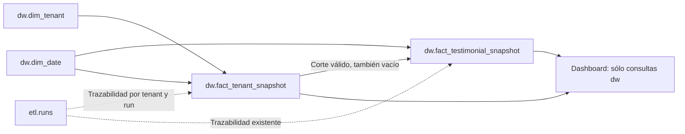

# Plan HITL: tiempo dimensional de los snapshots BI

**Fecha:** 2026-10-08.
**Estado:** tres fases completadas con ACK intermedio; fase 3 terminada el 2026-10-09. Validación local descartable; sin migraciones ni despliegue persistentes.
**Origen:** mejora posterior al [plan de logo y BI](2026-10-08_feat-foto-empresa-bi.md). El pedido «Implementa el plan» autorizó ejecutar la fase 1 conforme al flujo HITL; no autoriza desplegar ni agrupar fases.

## Contexto y Restricciones

- Respetar [AGENTS.md](../../AGENTS.md): ejecutar una fase por vez, entregar evidencia y commit sugerido y esperar ACK intermedio. El ACK «Continua» autorizó sólo la fase 2, ahora terminada; el ACK «Continuar» del 2026-10-09 autoriza la fase 3.
- Aplicar las skills de SQL relacional y buenas prácticas PostgreSQL. Para código, revisar además las de API, TypeScript y observabilidad correspondientes.
- Warehouse PostgreSQL 18 con migraciones propias: no modificar `schema.prisma`, migraciones aplicadas, infraestructura, paquete raíz ni hooks. No ejecutar `prisma migrate deploy` ni `db push`.
- Todo recurso privado se consulta y relaciona con `tenant_id`. Los inventarios globales del migrador son operaciones explícitas de mantenimiento, sin exposición HTTP y con verificaciones por empresa.
- Preservar cambios locales. Al crear este plan, `git status --short` no mostró cambios existentes.
- No se conoce el volumen ni el estado de migraciones de un warehouse persistente. La validación previa al despliegue debe determinarlo; no asumir que está vacío.
- La evolución mantiene contratos HTTP, esquema estrella compartido, horario de cargas y separación OLTP/OLAP. CDC, medallón, SCD tipo 2, retención y minería quedan fuera de alcance.

## 1. Problema y beneficio esperado

En el diagnóstico inicial, el [hecho de testimonios](../../apps/api/warehouse/migrations/0001_initial.sql) almacenaba `run_id`, pero no el instante/fecha de observación. El dashboard consultaba `etl.runs` para seleccionar cortes diarios, obtener el inicio del historial y calcular frescura. Una tabla de control de cargas actuaba así como fuente temporal de negocio. Las fases completadas sustituyen ese acceso por hechos de `dw`.

El objetivo es que **las consultas analíticas del dashboard lean únicamente `dw.*`**, incluido el tiempo observado. `etl.*` continúa administrando intentos, leases, reintentos, pointer y métricas técnicas. `run_id` permanece como trazabilidad y conserva sus referencias: este cambio no autoriza purgar `etl.runs`.

Beneficios: consultas por fecha/mes/trimestre más explícitas, dimensiones temporales directamente relacionadas y distinción clara entre instante observado e instante de publicación. La mejora es de semántica y mantenibilidad; no se promete menor latencia por quitar un JOIN. Duplicar fecha e instante aumenta almacenamiento y escrituras, por lo que debe medirse.

### Caso que exige completar la propuesta original

Agregar sólo `snapshot_at` y una fecha al detalle no representa un corte exitoso con cero testimonios. Si el último corte de un día está vacío, buscar el máximo instante en el detalle escogería incorrectamente un corte anterior no vacío.

Por eso se propone **un hecho agregado por empresa y corte**, además de las dos columnas del detalle. Permite conservar tres estados:

| Situación | Representación | Respuesta diaria |
| --- | --- | --- |
| Corte exitoso con testimonios | Cabecera y N detalles | Total N y rating calculado sobre esos detalles. |
| Corte exitoso vacío | Cabecera con cantidad 0 y ningún detalle | Total 0, instante conocido, rating NULL. |
| Hora/día sin corte exitoso | Sin cabecera para ese corte | Total NULL; no arrastrar el valor anterior. |

La alternativa mínima de dos columnas manteniendo `etl.runs` para cortes vacíos es válida como paso parcial, pero no cumple el objetivo de consultas BI independientes de tablas de control. El alcance recomendado de este plan incluye la cabecera.

## 2. Modelo propuesto

### Detalle: `dw.fact_testimonial_snapshot`

Mantener granularidad y PK `(tenant_id, run_id, testimonial_id)`. Agregar:

| Campo | Tipo final | Regla |
| --- | --- | --- |
| `snapshot_at` | `timestamptz(3) NOT NULL` | Instante real del snapshot de origen, con la precisión vigente de milisegundos. |
| `snapshot_date_key` | `date NOT NULL` | Fecha UTC de `snapshot_at`; FK directa a `dw.dim_date(date_key)`. |

`snapshot_at` no es `slot_at`, `created_at`, `published_at` del testimonio ni la hora del servidor destino. No llevar `DEFAULT now()`: podría convertir un dato ausente en un corte falso.

La fecha se calcula explícitamente como `(snapshot_at AT TIME ZONE 'UTC')::date`, independientemente de la zona de sesión. Usar columna ordinaria y CHECK de igualdad para permitir expansión nullable y backfill por lotes. No añadir una columna generada almacenada sobre todo el historial durante la expansión.

### Cabecera: `dw.fact_tenant_snapshot`

Granularidad: **una empresa en un corte fuente publicado correctamente**, incluso si está vacía.

| Campo | Tipo | Significado |
| --- | --- | --- |
| `tenant_id` | `uuid NOT NULL` | Empresa; FK a `dw.dim_tenant`. |
| `run_id` | `uuid NOT NULL` | Ejecución que publicó el corte; FK compuesta con tenant a `etl.runs`. |
| `snapshot_at` | `timestamptz(3) NOT NULL` | Instante observado en origen. |
| `snapshot_date_key` | `date NOT NULL` | Fecha UTC, FK a `dw.dim_date`. |
| `published_at` | `timestamptz(3) NOT NULL` | Marca de finalización de la publicación, equivalente al `finished_at` exitoso vigente. No es el instante exacto de COMMIT. |
| `testimonial_count` | `bigint NOT NULL` | Cantidad de detalles, incluyendo cero. |

PK `(tenant_id, run_id)`, CHECK de cantidad no negativa y CHECK de fecha UTC. El total representa existencias: **no es aditivo entre cortes temporales**. Para rating/estados/categorías seguir leyendo el detalle del corte elegido; no duplicar esas medidas en la cabecera inicialmente.

Agregar UNIQUE `(tenant_id, run_id, snapshot_at, snapshot_date_key)` en la cabecera y FK del detalle sobre esas cuatro columnas. Así la base rechaza fechas distintas dentro del mismo corte o cruces de empresa. Conservar las FK existentes del detalle; sin cascadas de borrado sobre el historial. La igualdad entre `testimonial_count` y número de detalles se comprueba en la publicación atómica y conciliación: un CHECK de fila no valida otras filas.

Esta tabla adicional es un hecho agregado, no una dimensión de reintentos. No convertir los errores/estados de ejecución en categorías de negocio ni duplicar todo `etl.runs` en `dw`.

## 3. Publicación y consultas

### Publicador

En [WarehouseRepository.publish](../../apps/api/src/modules/business-intelligence/repositories/warehouse.repository.ts), dentro de la transacción/fencing actuales:

1. Verificar que `snapshot.at` coincide con el corte fuente registrado en el run de ese tenant; conservar validaciones de cantidades, vigencia y avance temporal.
2. Actualizar dimensiones y crear la fecha UTC aunque no haya testimonios/eventos.
3. Insertar cabecera con cantidad extraída y los detalles con **el mismo** instante/fecha. Una marca inicial de publicación sólo es interna a la transacción; antes de confirmar se reemplaza por la marca terminal común.
4. Conciliar detalle y cabecera, reconciliar engagement y limpiar staging como hoy.
5. Obtener una sola marca terminal del destino y asignarla tanto a cabecera `published_at` como a run `finished_at`, después de la limpieza. Confirmar éxito/pointer y comprobar fencing/plazo al final.
6. Confirmar todo conjuntamente. Un fallo revierte también la cabecera; los reintentos conservan la política vigente y no duplican cortes exitosos.

Los consumidores nunca ven la cabecera provisional de la transacción. No insertar cabeceras en la extracción ni para intentos fallidos/abandonados. El worker puede seguir usando `etl.runs` y `tenant_load_state` internamente.

### Dashboard

- Seleccionar el último corte global del tenant desde `dw.fact_tenant_snapshot`, independientemente del rango solicitado. Resumen, categorías y estados usan ese `run_id` y `tenant_id`.
- Para cada día del rango, elegir **una sola cabecera**, la de mayor `snapshot_at`, con desempate estable por `run_id`. Luego consultar sus detalles. Usar total de cabecera y rating de los detalles; evitar sumar el total repetido tras un JOIN.
- Obtener `historyStartedAt` desde el mínimo `snapshot_at` de cabecera; `sourceSnapshotAt` y `lastPublishedAt` desde la última cabecera. Mantener `not_loaded/fresh/stale`, UTC y umbral de dos horas.
- Mantener engagement, CTR, series, rangos, permisos y contrato público actuales. La cabecera vacía conserva metadata correcta; no sustituirla por el último detalle no vacío.
- Conservar lectura `REPEATABLE READ READ ONLY`: cabecera, detalles y engagement deben pertenecer a la misma vista consistente.
- Las métricas operativas y el ETL mantienen SELECT sobre `etl.*`. La prueba de independencia usará **otro lector sólo de `dw`** para DashboardRepository; el lector runtime compartido no pierde permisos necesarios para `/internal/bi/metrics`.

### Índices

Evaluar con EXPLAIN (ANALYZE, BUFFERS) un índice de cabecera `(tenant_id, snapshot_at DESC, run_id)` para último corte y rangos de instantes UTC. Filtrar con límites UTC y usar `snapshot_date_key` para agrupar/relacionar calendario.

Evaluar `(tenant_id, snapshot_date_key, snapshot_at, run_id)` en detalle para consultas dimensionales por fecha. La PK actual ya sirve para detalle por tenant/run y como prefijo de la FK a cabecera. Revisar también el acceso inverso de las FK de calendario: un índice tenant-first no cubre por sí solo búsquedas globales por fecha. Añadir índices adicionales sólo con planes/operación que los justifiquen; registrar tamaño y costo de escritura. No retirar índices existentes por inferencia.

## 4. Migración del historial y compatibilidad

Estrategia recomendada: **expandir → completar historial → validar → cambiar consumidores**, con ventana controlada de mantenimiento BI. Mantener captura y moderación OLTP. No prometer despliegue sin interrupción BI con escritor viejo/nuevo mezclados.

### Artefactos previstos

- `apps/api/warehouse/migrations/0002_snapshot_time_expand.sql`: cabecera nueva y dos columnas nullable en detalle. Sin modificación de `0001_initial.sql` ni de su checksum.
- Entrada manual `snapshot-time-backfill.cli.ts` bajo `business-intelligence`, con `--check` de sólo lectura y `--apply` explícito. Usa identidad migradora, nunca se inicia desde HTTP/ETL ni lee OLTP. Sin dependencias nuevas.
- `0003_snapshot_time_constraints.sql`: cierre de nulabilidad, CHECK, FK e índices aprobados; cierre impedido si el historial no está conciliado.
- Extender el CLI migrador con selección validada `--to 0002_snapshot_time_expand.sql`, rechazando versiones desconocidas y conservando checksum/orden/lock de migraciones. En el diagnóstico inicial aplicaba todos los archivos seguidos; la fase 1 incorpora la pausa antes del backfill.

### Procedimiento de datos

1. Verificar backup restaurable, volumen, versiones y privilegios. Detener todos los workers y esperar que terminen sus publicaciones; deshabilitar temporalmente BI antes del backfill. Comprobar esa condición, no inferirla sólo por edad de un lease.
2. Aplicar expansión. Las nuevas columnas no tienen default; el código anterior puede leer el esquema expandido mientras no se cierre nulabilidad. Workers permanecen detenidos durante la conversión.
3. Preflight por empresa: identificar runs exitosos, sus timestamps y cantidades; comprobar correspondencia con detalles y dimensión de tenant. Rechazar hechos asociados a runs no exitosos, fechas ausentes, conteos incoherentes o cabeceras parciales incompatibles. Reportar código/ID técnico y detenerse sin inventar fechas ni eliminar anomalías.
4. Crear fechas y cabeceras desde **todos los runs succeeded**, incluidos los que tienen `snapshot_row_count=0`. Copiar `source_snapshot_at` a `snapshot_at`, fecha UTC derivada y `finished_at` a `published_at`. No usar fecha actual ni reconstruir horas no observadas.
5. Completar detalles mediante join `(tenant_id, run_id)` y páginas por PK, con lotes iniciales de hasta 1 000 filas y transacciones cortas. Seleccionar filas pendientes para reanudar tras interrupciones. Las filas ya completas deben coincidir con el origen; un conflicto no se sobrescribe silenciosamente.
6. Conciliar por tenant/run: misma cantidad, rating/score/estado/categoría/medios intactos, fechas exactas, cobertura de runs exitosos y ausencia de cabeceras para fallos. Comprobar digest/igualdad de columnas originales, no sólo conteos. Backfill repetido no cambia resultados.
7. Ejecutar preflight de cierre desde el migrador **antes de aplicar 0003**, incluida cobertura de cortes vacíos. Implementarlo en TypeScript y SQL parametrizado dentro del control de mantenimiento; no introducir cuerpos DO/triggers que el parser actual no admite. Constraints solas no detectan una cabecera vacía omitida.
8. Validar restricciones y finalmente exigir NOT NULL. PostgreSQL permite agregar CHECK/FK como NOT VALID y validarlas posteriormente; esto no elimina bloqueos ni permite saltarse conciliación. Mantener límites de lock/tiempo explícitos y probar duración. Si no cabe en los límites actuales (SQL 30 s, transacción 35 s), detener y preparar una estrategia de mantenimiento revisada; no aumentarlos indiscriminadamente.
9. Instalar writer/reader nuevos, conceder privilegios explícitos de la tabla nueva, ejecutar un corte y verificar paridad. Rehabilitar BI y scheduler después de aceptar resultados.

No ejecutar CREATE INDEX CONCURRENTLY dentro del migrador actual: usa una transacción. Si el volumen exige creación concurrente, preparar un paso operativo independiente y su evidencia antes del ACK de despliegue.

La primera versión del procedimiento asume mantenimiento BI, no escrituras concurrentes durante backfill. El modo `--check` debe devolver salida no cero ante incompatibilidad sin imprimir datos de negocio/credenciales. La limpieza de metadatos ETL sigue fuera de alcance: sobreviven referencias FK a runs.

### Reversión

Antes de 0003 puede volverse al lector anterior dejando datos/columnas aditivas, con ETL detenido. Tras NOT NULL/FK, **el escritor anterior es incompatible**: no arrancarlo sin una migración correctiva autorizada o restauración verificada. Mantener BI deshabilitado y conservar datos al fallar; no usar DROP/CASCADE como rollback automático. Una restauración antigua puede perder cortes posteriores al backup y debe tener su recuperación aprobada.

## 5. Fases HITL

### `[Completada]` Fase 1: evolución del warehouse e historial

- [x] Preparar 0002/0003, migrador con destino, backfill reanudable/check y preflight de cierre.
- [x] Probar instalación nueva y actualización de fixture 0001 con historial, cortes vacíos y errores controlados.
- [x] Probar repetición, interrupción y reanudación del backfill; checksum de 0001 sin cambios y cierre prematuro rechazado.
- [x] No ejecutar contra bases persistentes. Actualizar evidencia y detenerse.

**Salida:** esquema e historial convertibles de forma verificable en PostgreSQL descartable.
**Commit sugerido:** `feat(bi): incorporá el tiempo dimensional y la migración de snapshots`.

### `[Completada]` Fase 2: publicación y lectura dimensional

- [x] Adaptar publicador para cabecera/detalle/fecha/publicación atómicos; conservar fencing, reintentos y conciliación.
- [x] Adaptar DashboardRepository para consultas sólo `dw.*`; contrato HTTP/UI sin cambios funcionales.
- [x] Actualizar fixtures que simulaban horas cambiando sólo `etl.runs`: preparan cortes coherentes mediante helpers de prueba, sin alterar historia de producción.
- [x] Probar nuevos permisos y separación entre lector de dashboard y métricas técnicas.

**Salida:** misma respuesta funcional, incluyendo último corte vacío y horas ausentes, sin dependencia de SELECT sobre `etl.*` en el dashboard.
**Commit sugerido:** `refactor(bi): consultá los cortes desde el modelo dimensional`.

### `[Completada]` Fase 3: validación integral y preparación operativa

- [x] Ejecutar pruebas integradas de dos PostgreSQL y backup/restauración, HTTP/roles/aislamiento y tipos/build/lint pertinentes.
- [x] Comparar consultas y almacenamiento con historia de varios días/horas, múltiples tenants, cortes vacíos y categorías. Registrar planes, buffers y p95/p99 contra baseline con el mismo dataset/hardware; no afirmar mejora sin evidencia.
- [x] Medir backfill, locks, crecimiento de tablas/índices y duración de publicación. Condicionar la ventana y habilitación productivas a datos representativos y presupuesto acordado.
- [x] Actualizar diccionario, contrato BI, ADR 0004, runbooks 17/18/19/20, contexto y plan con cambios implementados y límites reales.
- [x] Entregar comandos y checklist de mantenimiento con orden/roles/versión; detenerse antes de ejecutar sobre un entorno persistente.

**Salida:** evidencia, operación/reversión revisables y commit sugerido. Despliegue posterior requiere identificar entorno, ventana y ACK específico conforme a AGENTS.md.
**Commit sugerido:** `test(bi): validá la evolución temporal y documentá su operación`.

## 6. Casos de aceptación

1. Snapshot `23:59:59.999Z` y siguiente `00:00:00.000Z`: fechas correctas; mismo resultado con zona de sesión distinta, bisiesto y cambio de año.
2. Cabecera y detalles comparten instante/fecha y tenant; DB rechaza fecha inconsistente, calendario inexistente o referencia cruzada.
3. Empresa siempre vacía, vacía después de tener datos y vacía en el último corte del día: total 0, metadata correcta, sin recuperar el corte anterior.
4. Día sin corte: total NULL. Dos cortes en el mismo día: seleccionar el último, nunca sumar inventarios.
5. Carga fallida/abandonada/lease vencido/commit con respuesta perdida: no cabeceras huérfanas, duplicados ni resultados parciales. Último corte correcto preservado.
6. Backfill desde 0001 preserva todo el historial y datos originales, incluidos cortes vacíos; interrumpir/repetir es seguro. Faltantes o discrepancias bloquean 0003.
7. Comparar JSON del dashboard antes/después: inventario, rating, estados, categorías, eventos, CTR, series e inicio del historial iguales. La edad se compara bajo reloj controlado/tolerancia, no esperando igualdad de segundos entre ejecuciones reales.
8. Ejecutar DashboardRepository con rol SELECT sólo `dw`; métricas siguen funcionando con el rol de operación vigente. Sesión admin/editor y tenant siguen aplicándose.
9. Publicación concurrente durante lectura BI: respuesta consistente sin mezclar cabecera nueva y detalles antiguos.
10. Restauración de warehouse actualizado conserva ambos hechos, fechas, FK, ledger y equivalencia de consultas. No alcanza con restaurar sólo 0001.

## 7. Evidencia de planificación y referencias (previa a implementación)

Revisión estática del DDL, publicador, lector, migrador y tests actuales. Detectados dos puntos que afectan el diseño: snapshots vacíos hoy representados por runs exitosos, y CLI migrador que aplica todos los archivos sin pausa. Este documento no cambia aplicaciones, SQL ejecutable ni bases; no se ejecutaron tests de implementación.

- [PostgreSQL 18: ALTER TABLE, restricciones y validación](https://www.postgresql.org/docs/18/sql-altertable.html).
- [Kimball: granularidad y tipos de tablas de hechos](https://www.kimballgroup.com/2008/11/fact-tables/).
- [Diccionario vigente](../domain/warehouse_diccionario_de_datos.md), [contrato BI](../modules/api-business-intelligence.md), [runbook actual](../operations/18_business_intelligence_rollout.md).

**Commit sugerido de esta entrega documental:** `docs(bi): planificá el tiempo dimensional de los snapshots`.

## 8. Evidencia de fase 1

- Añadidos 0002/0003 sin cambiar 0001: cabecera por corte incluso vacío, instante/fecha UTC en detalle, calendario y relación compuesta con cabecera. No se añadieron índices sin medición.
- Migrador con `--to` validado y preflight del cierre dentro de la transacción DDL/ledger. Backfill manual `--check` o `--apply --maintenance`, sin arranque automático ni acceso OLTP.
- Conversión por lotes de hasta 1 000 filas, verificación de columnas originales, reanudación e idempotencia. Preflight por tenant antes de escribir; bloqueo ante conflictos, actividad ETL y leases incluso vencidos. Locks acotados y revalidación protegen cada lote; se exige detener workers durante toda la ventana.
- **46 pruebas pasaron en cuatro suites**: 15 nuevas de integración temporal, tres unitarias temporales, 10 unitarias ETL y 18 de integración BI existentes. PostgreSQL 18 descartable para source/warehouse; bases aleatorias de integración eliminadas al terminar.
- API typecheck/lint/build aprobados; dos advertencias lint preexistentes en archivos ajenos a esta fase. Sin cambios en Prisma, infraestructura, dependencias, paquete raíz ni hooks; sin migraciones persistentes.
- Procedimiento y límites documentados en [runbook temporal](../operations/19_bi_snapshot_time_migration.md). Al terminar fase 1 se acotaron los comandos anteriores a 0001; fase 2 los actualiza para exigir la transición temporal antes de usar el nuevo código.

**Límite de la entrega de fase 1:** en ese momento publicador/dashboard conservaban el comportamiento previo y 0003 no era compatible con ese escritor. Fase 2 completa lectura/publicación dimensional y prueba permisos; fase 3 todavía debe validar capacidad y restauración integral del warehouse actualizado. No se habilita despliegue persistente.

**Commit sugerido:** `feat(bi): incorporá el tiempo dimensional y la migración de snapshots`.

## 9. Evidencia de fase 2

- ACK de inicio: «Continua», posterior a la revisión de fase 1. El checkout estaba limpio; no se sobrescribieron cambios locales.
- [Publicador](../../apps/api/src/modules/business-intelligence/repositories/warehouse.repository.ts): valida coincidencia con el corte fuente del run, escribe calendario/cabecera/detalle conjuntamente y concilia cantidades. Tras limpiar staging, comparte una marca terminal entre `finished_at` y `published_at`, conservando fencing y plazo al final. Rollback incluye cabecera; no hay cabeceras de intentos fallidos ni duplicación tras respuesta perdida de COMMIT.
- [Dashboard](../../apps/api/src/modules/business-intelligence/repositories/dashboard.repository.ts): consultas exclusivamente `dw`, con filtro por tenant y unión del mismo tenant/run. Último corte global para resumen; último por día UTC para serie, sin sumar existencias. Cabeceras vacías conservan 0/metadata; días ausentes mantienen NULL. Contrato HTTP/UI, engagement/CTR y lectura RR READ ONLY se preservan.
- Fixtures instalan 0001/0002/0003 en bases nuevas y simulan fechas de cortes coherentes respetando FK inmediatas. El benchmark manual se adaptó al esquema actual, **sin ejecutar una nueva medición** ni actualizar su resultado histórico de 0001.
- **57 pruebas aprobadas en seis suites:** 21 de integración ETL/BI con identidades restringidas, 15 de migración temporal, tres unitarias temporales, 10 unitarias ETL, cuatro de contratos/rangos/cálculo y cuatro HTTP/permisos/fallos. Dos PostgreSQL 18 descartables; bases y roles de prueba eliminados al terminar.
- Se verificó el JSON completo con último corte global fuera del rango solicitado; UTC/milisegundos/bisiesto, cortes siempre vacíos y vacíos posteriores, igualdad de marca terminal, reintentos/lease/rollback, aislamiento entre empresas y una publicación concurrente durante lectura consistente.
- Todos los dashboards de integración se ejecutaron con rol SELECT sólo `dw`: acceso a runs/pointer y escritura denegados. Métricas técnicas se probaron con el lector operativo; el lector `dw` no puede renderizarlas. La conexión runtime compartida conserva los permisos técnicos existentes; no se introdujo configuración de roles adicional.
- Typecheck, lint y build API aprobados, con las mismas dos advertencias lint preexistentes fuera de esta fase. `git diff --check` y enlaces locales sin errores. Ambos PostgreSQL descartables detenidos al terminar. Sin cambios en SQL versionado, Prisma, infraestructura, dependencias, raíz ni hooks; sin migraciones persistentes.
- Runbooks 17/18/19 actualizados para impedir usar el código nuevo con sólo 0001 o iniciar el escritor anterior tras 0003. Capacidad, índices medidos, restauración integral y preparación operativa final permanecen en fase 3.

**Commit sugerido:** `refactor(bi): consultá los cortes desde el modelo dimensional`.

**Cierre histórico de fase 2:** se detuvo antes de validar integralmente y preparar la operación; el ACK «Continuar» habilitó la fase 3. Despliegue requiere además entorno, ventana y aprobación específicos.

## 10. Evidencia de fase 3 y cierre del plan

- ACK de inicio: «Continuar» del 2026-10-09. Checkout inicialmente limpio; se ejecutó sólo esta fase. Sin cambios en código de producción, migraciones SQL versionadas, Prisma, infraestructura, dependencias, paquete raíz ni hooks.
- **58 pruebas aprobadas en seis suites** con dos PostgreSQL 18.6 descartables: 21 de integración ETL/BI, 16 de migración temporal, tres unitarias temporales, 10 unitarias ETL, cuatro de dashboard y cuatro HTTP/permisos/fallos. Tras reforzar permisos de restauración se repitieron las 21 de integración, también aprobadas. Typecheck, lint y build API aprobados; permanecen únicamente las dos advertencias lint preexistentes ajenas a esta fase.
- Backup/restauración del warehouse actualizado: cuatro cortes de tres empresas, empresa siempre vacía y vacía posterior, digests de cabecera/detalle/calendario/ledger, constraints y checksums de las tres migraciones intactos. JSON completo equivalente con lector sólo `dw` tras reprovisionar permisos; escritura, staging y ledger denegados. No certifica PITR ni RPO/RTO productivos.
- Nueva prueba de contención: lock ETL incompatible produce `55P03` sin cabeceras parciales; el backfill se reanuda al liberarlo. Se conservan los límites actuales y el mantenimiento obligatorio con workers detenidos.
- [Benchmark dimensional](../operations/20_bi_snapshot_time_benchmark.json): tres empresas, siete días, 160 cortes y 98 000 detalles; expansión 50,27 ms, backfill 30,85 s y cierre 530,85 ms. Paridad del dashboard; p95 antiguo/nuevo 42,14/41,33 ms y p99 50,05/51,79 ms. Latencia similar en esta muestra, sin afirmar una mejora estadística.
- Se midieron planes/buffers, índices candidatos, almacenamiento y publicación. Se conservan los índices actuales: candidatos descartables eliminados, costo de escritura no certificado. Detalle 21,96 → 38,22 MB tras backfill/VACUUM normal, incluida retención de espacio de actualización; cabecera 90 112 bytes. No extrapolar crecimiento o ventana linealmente.
- [Impacto OLTP actual](../operations/20_bi_snapshot_time_oltp_benchmark.json): 12 000 testimonios/60 000 eventos iniciales, 449 → 338 solicitudes sin errores, tres tenants publicados en 69,19 s; mayor run 26,06 s. Aumenta latencia de las cuatro rutas medidas; capacidad productiva pendiente de SLO y datos representativos. BI 503 ante caída OLAP, liveness/readiness/listado 200 con ejecutor sin checker residente; se preserva también el primer ensayo liveness 503 y su limitación en el informe, sin cambiar umbrales.
- [Informe y checklist](../operations/20_bi_snapshot_time_validation.md), [orden de mantenimiento/reversión](../operations/19_bi_snapshot_time_migration.md), diccionario, módulo, ADR 0004, arquitectura, runbooks 17/18 y contexto actualizados. Bases/roles de pruebas eliminados y ambos PostgreSQL descartables detenidos al finalizar.

**Plan completado localmente.** No hay otra fase de implementación pendiente. La habilitación persistente exige entorno, backup restaurable, ventana, presupuesto de rendimiento y ACK específico; si la reconciliación completa no cumple, requiere captura incremental antes de producción.

**Commit sugerido:** `test(bi): validá la evolución temporal y documentá su operación`.
