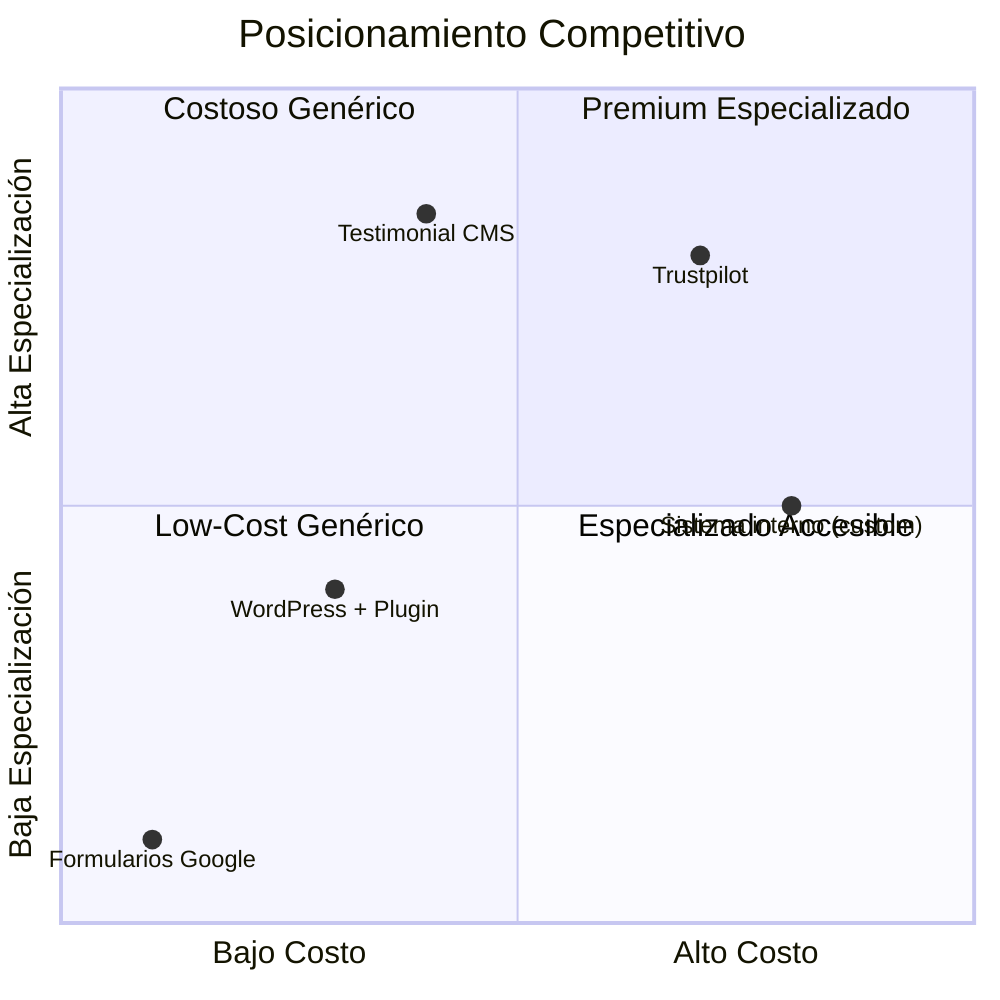

# Definición del Producto

## 1. Resumen Ejecutivo

**Testimonial CMS** es un sistema SaaS especializado en la gestión, moderación y distribución de testimonios y casos de éxito para instituciones educativas (EdTech) y empresas. Resuelve el problema de que las organizaciones no pueden mostrar eficazmente el impacto real de sus programas o productos debido a que los testimonios están dispersos, desorganizados y no se mide su efectividad. Testimonial CMS ofrece una plataforma centralizada con potentes herramientas de curaduría, analítica de engagement y distribución mediante API y widgets embebibles, permitiendo a las empresas convertir las voces de sus clientes en su mejor herramienta de marketing.

### Métricas Clave de Impacto (OKRs de Producto)

| Objetivo | Métrica de Éxito (KPI) | Meta |
|----------|------------------------|------|
| **Adopción inicial** | Clientes (tenants) activos en los primeros 6 meses | 50 |
| **Engagement de testimonios** | CTR (Click Through Rate) promedio en embeds | > 5% |
| **Facilidad de integración** | Tiempo medio de integración del embed | < 5 minutos |
| **Satisfacción del cliente** | NPS (Net Promoter Score) | > 40 |

---

## 2. Descripción General

### 2.1. Problema que Resuelve

**Contexto del mercado/industria:**
Las instituciones educativas y empresas con comunidades activas (cursos, productos SaaS, eventos) necesitan constantemente demostrar su valor a través de pruebas sociales. Sin embargo, la gestión de testimonios suele ser rudimentaria: formularios de Google, archivos sueltos, correos electrónicos y publicaciones en redes sociales. Esta fragmentación impide reutilizar el contenido de forma estratégica y medir su impacto real en la conversión.

**Dolor específico del usuario:**
- **Pérdida de contenido valioso**: Los testimonios se pierden en bandejas de entrada o quedan olvidados en documentos.
- **Falta de control de calidad**: No hay un proceso de moderación antes de publicar, lo que puede llevar a contenido inapropiado o de baja calidad.
- **Distribución ineficiente**: Cada vez que se quiere mostrar un testimonio en una landing page o sitio web, hay que copiar y pegar manualmente, sin posibilidad de actualización centralizada.
- **Medición nula**: No se sabe qué testimonios generan más confianza o conversión; se publican sin criterio.

### 2.2. Solución Propuesta

**¿Qué hace el producto?**
Testimonial CMS es una plataforma multi-tenant donde cada empresa (cliente) puede:
- Recopilar testimonios desde un panel de administración o mediante formularios públicos.
- Moderar el contenido (aprobar/rechazar) antes de su publicación.
- Clasificar testimonios por categorías, productos o etiquetas.
- Enriquecerlos con imágenes, videos (integración con YouTube y Cloudinary).
- Distribuirlos a través de una API REST pública o widgets embebibles (embed) que se insertan en cualquier sitio web con una sola línea de código.
- Medir el engagement (visitas, clics, CTR) y calcular automáticamente un **score** para destacar los testimonios más relevantes.
- Configurar **webhooks** para recibir notificaciones en tiempo real cuando se publica un testimonio (por ejemplo, para enviarlo a Slack o a un CRM).
- Activar/desactivar funcionalidades mediante **feature flags** por cliente, permitiendo despliegues graduales y control de acceso a características premium.

**Alcance inicial (MVP):**
- ✅ Gestión de múltiples inquilinos (multi-tenant) con aislamiento de datos.
- ✅ CRUD completo de testimonios (texto, imagen, video).
- ✅ Sistema de moderación (estados: draft, pending, approved, published, rejected).
- ✅ Categorías y etiquetas por tenant.
- ✅ API REST pública documentada (OpenAPI/Swagger) con autenticación mediante API keys.
- ✅ Widget embed básico para mostrar testimonios en sitios externos.
- ✅ Integración con Cloudinary para subida de imágenes y con YouTube para embebido de videos.
- ✅ Analítica básica de eventos (views, clicks) y cálculo de score.
- ✅ Webhooks configurables por evento (testimonial.published).
- ✅ Feature flags para habilitar funcionalidades por tenant.
- ✅ Panel de administración con login y roles (admin, editor).

**Fuera de alcance (v1.0):**
- ❌ Sistema de reseñas de usuarios finales sin moderación (como Trustpilot). Los testimonios son generados por la empresa o mediante formularios públicos con moderación.
- ❌ Múltiples idiomas en la interfaz (solo español inicialmente).
- ❌ Aplicaciones móviles nativas (solo web responsive).
- ❌ IA para generación automática de resúmenes o detección de sentimiento (se planea para futuras versiones).

---

## 3. Público Objetivo

### 3.1. Personas Clave (Buyer Personas)

```mermaid
flowchart TD
    subgraph Usuarios_Principales
        A[Admin de Marketing / Product Manager]
        B[Editor / Community Manager]
        C[Cliente externo (visitante web)]
    end
    
    subgraph Stakeholders_Secundarios
        D[Desarrollador del cliente]
        E[Equipo de Ventas]
        F[Gerente de producto]
    end
    
    A -->|Gestiona configuración, API keys| Sistema
    B -->|Crea, modera y publica testimonios| Sistema
    C -->|Ve testimonios vía embed| Sistema
    D -->|Integra API/embed| Sistema
    E -->|Solicita casos de éxito| Sistema
    F -->|Analiza métricas de engagement| Sistema
```

### 3.2. Segmentación de Audiencia

| Persona | Rol | Necesidades Principales | Frecuencia de Uso |
|---------|-----|-------------------------|-------------------|
| **Admin** | Marketing / Product Manager | Configurar la plataforma, gestionar API keys, ver analíticas globales, activar features premium | Semanal |
| **Editor** | Community Manager / Content Creator | Crear, moderar y publicar testimonios, asignar etiquetas | Diario |
| **Cliente externo** | Visitante del sitio web de la empresa | Ver testimonios relevantes y confiables | Ocasional |
| **Desarrollador** | Developer del cliente | Integrar el embed o consumir la API, configurar webhooks | Puntual (setup) |
| **Ventas** | Ejecutivo de ventas | Utilizar testimonios destacados en presentaciones y propuestas | Semanal |

### 3.3. Tamaño del Mercado (TAM/SAM/SOM)

| Métrica | Valor Estimado | Fuente |
|---------|----------------|--------|
| **TAM** (Total Addressable Market) | 10.000 instituciones educativas y empresas en Latinoamérica | Datos de cámaras de comercio y ministerios de educación |
| **SAM** (Serviceable Addressable Market) | 2.500 empresas con presencia digital activa y necesidad de marketing | Análisis de competidores y demanda de herramientas de marketing |
| **SOM** (Serviceable Obtainable Market) | 150 clientes en el primer año | Proyección basada en capacidad de ventas y marketing |

---

## 4. Propuesta de Valor Única (USP)

### 4.1. Declaración de Valor

> **"Para** instituciones educativas y empresas que necesitan mostrar el impacto real de sus programas a través de historias de clientes, **Testimonial CMS** es una plataforma SaaS de gestión de testimonios **que** centraliza, modera y distribuye contenido con analítica de engagement y opciones avanzadas de integración. **A diferencia de** soluciones genéricas como WordPress con plugins o simples formularios de Google, **nuestro producto** ofrece un sistema especializado con webhooks, scoring inteligente, multi-tenancy y embeds optimizados que permiten medir y mejorar la conversión basada en pruebas sociales."**

### 4.2. Matriz de Competencia



### 4.3. Diferenciales Competitivos

| Característica | Testimonial CMS | WordPress + Plugin | Trustpilot |
|----------------|-----------------|---------------------|------------|
| **Especialización en testimonios** | ✅ Alto | ⚠️ Medio | ✅ Alto (pero enfocado en reseñas públicas) |
| **Multi‑tenant (SaaS)** | ✅ Nativo | ❌ No aplica | ✅ Sí (para empresas) |
| **Webhooks configurables** | ✅ Sí | ❌ Limitado | ⚠️ Solo planes premium |
| **Analítica de engagement (views, clicks, scoring)** | ✅ Incluido | ❌ Generalmente no | ❌ Solo reseñas |
| **Embed personalizable** | ✅ Sí (con JS) | ✅ Sí (pero limitado) | ✅ Sí |
| **Moderación con estados** | ✅ Completa | ⚠️ Básica | ⚠️ Limitada |
| **Feature flags por cliente** | ✅ Sí | ❌ No | ❌ No |
| **Precio mensual** | 💰 $99 - $299 (según plan) | 💰 $0 - $50 (plugin + hosting) | 💰 $299+ |
| **Tiempo de implementación** | ⏱️ < 1 hora (embed) | ⏱️ Horas a días | ⏱️ Horas |

---

## 5. Características Principales

### 5.1. Funcionalidades Core (v1.0)

| Módulo | Descripción | Valor para el Usuario |
|--------|-------------|-----------------------|
| **Gestión de Tenants (empresas)** | Cada cliente tiene su propio espacio aislado con su propia base de datos (lógica). | Seguridad, personalización, facturación independiente. |
| **CRUD de Testimonios** | Crear, editar, eliminar testimonios con campos: autor, contenido, calificación (1-5), imagen/video, categorías, etiquetas. | Centralización de todo el contenido en un solo lugar. |
| **Moderación** | Flujo de estados: draft → pending → approved → published (o rejected). Los editores pueden aprobar/rechazar. | Control de calidad del contenido publicado. |
| **Categorías y Etiquetas** | Clasificación flexible por producto, evento, industria, etc. | Organización y filtrado para mostrar testimonios relevantes. |
| **API REST Pública** | Endpoints para consultar testimonios publicados, con autenticación mediante API keys. Paginación, filtros, ordenamiento por score. | Integración con cualquier sitio web o aplicación. |
| **Widget Embed** | Script JavaScript que se inserta en el sitio del cliente y renderiza testimonios dinámicamente. Personalizable (estilos, número de elementos). | Publicación instantánea sin necesidad de programación avanzada. |
| **Analítica** | Registro de eventos: view, click, play (video). Dashboard con métricas como testimonios más vistos, CTR, engagement por categoría. | Toma de decisiones basada en datos para mejorar el contenido. |
| **Scoring Inteligente** | Algoritmo que asigna un puntaje a cada testimonio basado en views, clicks, rating y antigüedad. Los testimonios con mayor score se muestran primero. | Destacar automáticamente el contenido más efectivo. |
| **Webhooks** | Configuración de URLs que reciben notificaciones POST cuando ocurren eventos (ej. testimonial.published). Soporte para reintentos con backoff. | Integración en tiempo real con CRMs, Slack, etc. |
| **Feature Flags** | Activación/desactivación de funcionalidades por tenant sin redeploy. Ejemplo: enable_analytics, enable_webhooks. | Despliegues graduales, pruebas A/B, control de acceso a características premium. |
| **Roles de Usuario** | Admin (todo), Editor (moderar, crear) y Visitante (solo lectura en dashboard). | Seguridad y delegación de tareas. |
| **Dashboard Administrativo** | Interfaz web (Next.js) para gestionar todos los aspectos anteriores. | Experiencia de usuario completa para clientes. |

---
## 6. Metas y Objetivos

### 6.1. Objetivos de Negocio (12 meses)

| Objetivo | Métrica | Meta | Ponderación |
|----------|---------|------|-------------|
| **Adquisición** | Número de clientes (tenants) activos | 150 | 30% |
| **Retención** | Churn mensual | < 3% | 25% |
| **Monetización** | MRR (Monthly Recurring Revenue) | $15,000 | 25% |
| **Satisfacción** | CSAT (Customer Satisfaction Score) | > 4.5/5 | 20% |

### 6.2. KPIs Técnicos (Requisitos No Funcionales)

| KPI | Objetivo | Métrica | Herramienta de Medición |
|-----|----------|---------|-------------------------|
| **Rendimiento API** | Tiempo de respuesta < 200ms (p95) | Latencia | Prometheus, Grafana |
| **Disponibilidad** | SLA 99.9% | Uptime mensual | UptimeRobot / Statuspage |
| **Escalabilidad** | Soportar 1000 tenants con 10k testimonios cada uno | Load testing | k6 |
| **Seguridad** | 0 vulnerabilidades críticas en escaneos | SAST/DAST | Snyk, OWASP ZAP |
| **Cobertura de tests** | > 80% en backend, > 70% en frontend | Cobertura | Vitest, Jest |
| **Accesibilidad** | WCAG 2.1 AA en dashboard | Auditoría automática | axe-core, Lighthouse |

---

## 7. Restricciones y Suposiciones

### 7.1. Restricciones Conocidas

| Tipo | Descripción | Impacto | Mitigación |
|------|-------------|---------|------------|
| **Tecnológicas** | El widget embed debe funcionar en sitios que usan frameworks antiguos (jQuery) o sin frameworks. | Medio | Desarrollar el script en vanilla JavaScript puro, sin dependencias. |
| **Regulatorias** | Datos de testimonios pueden contener información personal (nombre, empresa). Requiere cumplir con GDPR/Ley de Protección de Datos. | Alto | Asegurar que el cliente es responsable del consentimiento; incluir cláusulas en términos de servicio. |
| **Presupuestarias** | Equipo inicial: 1 desarrollador full-stack (luego se sumarán más). | Alto | Priorizar características MVP estrictamente; usar herramientas que aceleren el desarrollo (NestJS, Prisma, Tailwind). |
| **Temporales** | Lanzamiento antes de la fecha objetivo para aprovechar ciclo escolar. | Medio | Sprints de 2 semanas con entregas continuas. |

### 7.2. Suposiciones Clave

- [x] Las empresas objetivo están dispuestas a pagar entre $99 y $299 mensuales por una solución especializada.
- [x] La mayoría de los clientes tendrán un desarrollador o alguien con conocimientos técnicos para integrar el embed o la API.
- [x] El mercado de EdTech en Latinoamérica está en crecimiento y valora las pruebas sociales.
- [x] La integración con Cloudinary y YouTube es técnicamente viable y no presenta limitaciones significativas.
- [x] El equipo podrá contar con al menos 2 desarrolladores adicionales después del MVP.

---

## 8. Éxito y Criterios de Validación

### 8.1. Definición de "Listo" (Definition of Done)

Un feature se considera completo cuando:
- ✅ Código revisado y mergeado a la rama principal.
- ✅ Pruebas unitarias (>80% cobertura) y de integración pasan.
- ✅ Documentación actualizada (API docs con Swagger, guía de usuario).
- ✅ Revisión de seguridad básica (dependencias, validación de inputs).
- ✅ Aprobación de QA y Product Owner (en este caso, el mismo desarrollador).
- ✅ Métricas de performance dentro de los objetivos (cuando aplique).

### 8.2. Métricas de Éxito Post-Lanzamiento

| Métrica | Umbral Mínimo | Objetivo | Cómo Medir |
|---------|---------------|----------|------------|
| **Activación** | 50% de los clientes crean al menos 5 testimonios en la primera semana | 70% | Base de datos, eventos de analytics |
| **Engagement** | 3 sesiones/semana promedio en el dashboard | 5 sesiones | Google Analytics / Mixpanel |
| **Retención D30** | > 60% de los clientes siguen activos después de 30 días | > 75% | Cohort analysis |
| **Uso de API/embed** | 80% de los clientes utilizan el embed en su sitio web | 90% | Logs de peticiones a la API |
| **NPS** | > 30 (bueno) | > 50 (excelente) | Encuestas automáticas post-uso |

---

## 9. Anexos

### 9.1. Glosario de Términos

| Término | Definición |
|---------|------------|
| **Tenant** | Cliente (empresa o institución) que utiliza la plataforma de forma aislada. |
| **Testimonio** | Opinión o caso de éxito de un usuario/cliente de la empresa. Puede ser texto, imagen o video. |
| **Moderación** | Proceso de revisión y aprobación de testimonios antes de su publicación. |
| **Embed** | Código JavaScript que se inserta en un sitio web para mostrar testimonios dinámicamente. |
| **Webhook** | Notificación HTTP enviada a una URL externa cuando ocurre un evento (ej. publicación de testimonio). |
| **Feature Flag** | Mecanismo para activar/desactivar funcionalidades sin desplegar nuevo código. |
| **Score** | Puntaje calculado para cada testimonio basado en engagement y otros factores, utilizado para ordenamiento. |
| **CTR** | Click Through Rate: porcentaje de clics sobre el número de visualizaciones. |

### 9.2. Referencias

- [ ] Estudio de mercado: "El poder de los testimonios en la conversión de leads en EdTech" (2025).
- [ ] Análisis de competidores: WordPress + Testimonial Plugins, Trustpilot Business, Yotpo.
- [ ] Entrevistas a potenciales clientes: 10 instituciones educativas y 5 empresas SaaS.
- [ ] Documentación de WCAG 2.1 para accesibilidad web.
- [ ] Guía de buenas prácticas de API REST (Microsoft REST API Guidelines).

---

## 📝 Checklist de Calidad para este Documento

- [x] **Claridad estratégica**: Cualquiera que lea esto entiende el *por qué* del producto.
- [x] **Problema bien definido**: El dolor del usuario está cuantificado y validado con ejemplos concretos.
- [x] **USP diferenciadora**: La propuesta de valor es única y defendible frente a alternativas.
- [x] **Métricas SMART**: Los objetivos son Specific, Measurable, Achievable, Relevant, Time-bound.
- [x] **Alineación con negocio**: Los KPIs reflejan objetivos comerciales reales.
- [x] **Realismo técnico**: Las restricciones y suposiciones están documentadas y son realistas.
- [x] **Validación externa**: Se mencionan estudios de mercado y entrevistas a usuarios.

---

> **Nota final**: Este documento es un **contrato estratégico** entre Producto, Negocio y Técnica. Si no está alineado, el proyecto corre riesgo de construir algo que nadie necesita.