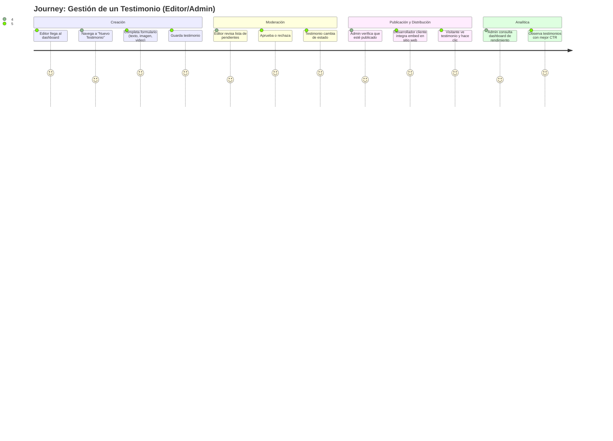

# Catálogo de Historias de Usuario

## 1. Convenciones y Formato

### 1.1. Plantilla Obligatoria por Story

```markdown
### 🔴 **[EPIC-ID]-[STORY-ID]: [Título Accionable]**
> **Como** [rol de usuario]  
> **Quiero** [acción específica]  
> **Para** [beneficio cuantificable]

**Prioridad**: P0 | P1 | P2  
**Esfuerzo estimado**: [XS/S/M/L/XL] (o puntos)  
**Epic/Feature**: [Enlace al epic]  
**PRD Reference**: [Sección del PRD que valida esta story]  

**Definition of Ready (DoR)** ✅  
- [ ] Diseño UI/UX aprobado (Figma link)  
- [ ] API contract definido (OpenAPI spec)  
- [ ] Dependencias técnicas resueltas  
- [ ] Criterios de aceptación claros y testables  

**Acceptance Criteria (Gherkin)** ✅  
```gherkin
Scenario: [Nombre descriptivo]
  Given [estado inicial válido]
  And [condición adicional]
  When [acción del usuario o sistema]
  Then [resultado observable]
  And [efecto secundario verificable]
```

**Consideraciones Técnicas** ⚙️  
- **Accesibilidad**: [WCAG criterio específico]  
- **Seguridad**: [OWASP control requerido]  
- **Performance**: [métrica específica, ej: "carga < 1s"]  
- **Internacionalización**: [requerimientos de i18n]  

**Ejemplos de Datos de Prueba** 🧪  
| Campo | Valor Válido | Valor Inválido | Comportamiento Esperado |
|-------|--------------|----------------|-------------------------|
| | | | |
```

### 1.2. Sistema de Priorización
| Nivel | Significado | Criterio de Selección |
|-------|-------------|------------------------|
| **🔴 P0 (Crítico)** | Bloquea el flujo principal o incumple normativa | Sin esto, el MVP no es usable/legal |
| **🟠 P1 (Alto)** | Flujo secundario pero de alto valor | Impacta > 30% de usuarios o genera ingresos |
| **🟡 P2 (Medio)** | Mejora UX o eficiencia operativa | Nice-to-have; no bloquea lanzamiento |
| **🟢 P3 (Bajo)** | Polish o edge cases | Post-MVP; optimización marginal |

---

## 2. Mapa de Viaje del Usuario (User Journey Map)



> 💡 Cada "paso" del journey se traduce en 1+ user stories.

---

## 3. Catálogo de Historias por Epic

### 3.1. Epic: TEST-01 — Gestión de Testimonios

#### 🔴 **TEST-01-US-101: Crear testimonio de texto**
> **Como** editor  
> **Quiero** crear un testimonio con contenido de texto, autor y calificación  
> **Para** centralizar los testimonios que recibo por otros medios

**Prioridad**: P0  
**Esfuerzo estimado**: S (3 puntos)  
**Epic/Feature**: TEST-01  
**PRD Reference**: Sección 4.2, US-101  

**Definition of Ready (DoR)** ✅  
- [x] Diseño UI aprobado (Figma link)  
- [x] API `POST /testimonials` definida en OpenAPI  
- [x] Validaciones de campos definidas  
- [x] Criterios de aceptación revisados por QA  

**Acceptance Criteria (Gherkin)** ✅  
```gherkin
Scenario: Crear testimonio con datos válidos
  Given que estoy autenticado como editor
  And en la página de creación de testimonios
  When completo los campos:
    | Campo       | Valor                         |
    | Autor       | Juan Pérez                    |
    | Contenido   | Excelente curso, lo recomiendo |
    | Calificación| 5                             |
  And hago clic en "Guardar"
  Then el testimonio se guarda con estado "draft"
  And veo un mensaje de éxito
  And el testimonio aparece en la lista de borradores

Scenario: Validación de campos obligatorios
  When intento guardar sin completar "Autor"
  Then el formulario muestra error "El autor es obligatorio"
  And no se crea el testimonio
```

**Consideraciones Técnicas** ⚙️  
- **Accesibilidad**: WCAG 3.3.2 — Labels o instrucciones claras  
- **Seguridad**: Validación en backend con DTO y class-validator  
- **Performance**: Guardado < 500ms  

**Ejemplos de Datos de Prueba** 🧪  
| Campo | Valor Válido | Valor Inválido | Comportamiento Esperado |
|-------|--------------|----------------|-------------------------|
| Autor | "Juan Pérez" | "" (vacío) | Error "Autor obligatorio" |
| Contenido | "Texto de 10+ caracteres" | "corto" | Error "Mínimo 10 caracteres" |
| Calificación | 3 | 6 | Error "Debe ser entre 1 y 5" |

---

#### 🔴 **TEST-01-US-102: Adjuntar imagen a testimonio**
> **Como** editor  
> **Quiero** subir una imagen junto al testimonio  
> **Para** hacer el contenido más visual y creíble

**Prioridad**: P0  
**Esfuerzo estimado**: M (5 puntos)  
**Epic/Feature**: TEST-01  
**PRD Reference**: Sección 4.2, US-101  

**Acceptance Criteria (Gherkin)** ✅  
```gherkin
Scenario: Subir imagen válida
  Given que estoy creando un testimonio
  When selecciono un archivo de imagen (JPG, PNG, GIF) menor a 5MB
  Then la imagen se sube a Cloudinary y se guarda la URL en el testimonio

Scenario: Subir archivo no soportado
  When selecciono un archivo .exe
  Then el sistema muestra error "Formato no soportado. Use JPG, PNG o GIF"
  And no se sube el archivo
```

**Consideraciones Técnicas** ⚙️  
- **Seguridad**: Validar tipo MIME en backend; escanear virus (opcional)  
- **Performance**: Subida asíncrona con progreso  

---

#### 🔴 **TEST-01-US-103: Adjuntar video de YouTube**
> **Como** editor  
> **Quiero** agregar un enlace de YouTube a un testimonio  
> **Para** incluir testimonios en video sin tener que alojarlos

**Prioridad**: P0  
**Esfuerzo estimado**: M (5 puntos)  

**Acceptance Criteria (Gherkin)** ✅  
```gherkin
Scenario: Enlace válido de YouTube
  Given que estoy creando un testimonio
  When ingreso una URL de YouTube como "https://youtu.be/abc123"
  Then el sistema obtiene el título y miniatura del video usando la API de YouTube
  And guarda la URL y los metadatos en el testimonio

Scenario: Enlace inválido
  When ingreso una URL que no es de YouTube
  Then el sistema muestra error "URL de YouTube inválida"
```

---

### 3.2. Epic: MOD-01 — Moderación

#### 🔴 **MOD-01-US-201: Aprobar testimonio pendiente**
> **Como** editor  
> **Quiero** aprobar un testimonio en estado "pending"  
> **Para** que pase a "approved" y luego pueda publicarse

**Prioridad**: P0  
**Esfuerzo estimado**: XS (1 punto)  

**Acceptance Criteria (Gherkin)** ✅  
```gherkin
Scenario: Aprobar testimonio
  Given que hay un testimonio pendiente con ID "123"
  When hago clic en "Aprobar" en su tarjeta
  Then el estado cambia a "approved"
  And se registra la fecha de aprobación
  And se dispara un evento de outbox para posibles webhooks
```

#### 🔴 **MOD-01-US-202: Rechazar testimonio con motivo**
> **Como** editor  
> **Quiero** rechazar un testimonio y opcionalmente agregar un motivo  
> **Para** que el creador (si lo hubiera) pueda corregirlo

**Prioridad**: P1  
**Esfuerzo estimado**: S  

**Acceptance Criteria (Gherkin)** ✅  
```gherkin
Scenario: Rechazar sin motivo
  Given un testimonio pendiente
  When hago clic en "Rechazar"
  Then se abre un modal preguntando "¿Motivo del rechazo? (opcional)"
  When hago clic en "Confirmar" sin escribir motivo
  Then el testimonio pasa a estado "rejected"

Scenario: Rechazar con motivo
  When ingreso "Contenido inapropiado" en el motivo
  Then el motivo se guarda en el historial del testimonio
```

---

### 3.3. Epic: DIST-01 — Distribución (API y Embed)

#### 🔴 **DIST-01-US-301: Obtener testimonios vía API pública**
> **Como** desarrollador  
> **Quiero** consumir una API REST autenticada con API Key para obtener testimonios publicados  
> **Para** mostrarlos en mi sitio web

**Prioridad**: P0  
**Esfuerzo estimado**: M  

**Acceptance Criteria (Gherkin)** ✅  
```gherkin
Scenario: Petición exitosa con API Key válida
  Given que tengo una API Key activa del tenant "abc123"
  When hago GET a /api/v1/testimonials?status=published&limit=5
  Then recibo un JSON con 5 testimonios publicados
  And la respuesta incluye metadatos de paginación

Scenario: API Key inválida
  When hago GET con una API Key inexistente o revocada
  Then recibo error 401 Unauthorized
```

**Consideraciones Técnicas** ⚙️  
- **Seguridad**: Rate limiting por IP y por API Key  
- **Performance**: Cache Redis para respuestas frecuentes  

---

#### 🔴 **DIST-01-US-302: Embed script para mostrar testimonios**
> **Como** desarrollador  
> **Quiero** insertar un script en mi sitio web que renderice testimonios dinámicamente  
> **Para** no tener que programar la integración manualmente

**Prioridad**: P0  
**Esfuerzo estimado**: L  

**Acceptance Criteria (Gherkin)** ✅  
```gherkin
Scenario: Cargar embed con atributos mínimos
  Given que inserto en mi HTML:
    <script src="https://cms.testimonial.com/embed.js" data-tenant="abc123"></script>
  When se carga la página
  Then el script obtiene testimonios del tenant y los renderiza en un contenedor por defecto
  And los testimonios tienen estilos básicos

Scenario: Personalizar número de testimonios
  When agrego data-limit="3"
  Then solo se muestran 3 testimonios
```

**Consideraciones Técnicas** ⚙️  
- **Accesibilidad**: El embed debe ser navegable por teclado y tener contraste adecuado  
- **Performance**: Carga asíncrona sin bloquear el renderizado  

---

### 3.4. Epic: ANALYTICS-01 — Analítica y Scoring

#### 🔴 **ANALYTICS-01-US-401: Registrar eventos de visualización**
> **Como** admin  
> **Quiero** que cada vez que se vea un testimonio en un embed se registre un evento  
> **Para** poder medir su impacto

**Prioridad**: P0  
**Esfuerzo estimado**: S  

**Acceptance Criteria (Gherkin)** ✅  
```gherkin
Scenario: Registro de view
  Given un embed con testimonios en una página web
  When un visitante carga la página
  Then se envía una petición POST a /analytics/event con tipo "view" y testimonial_id
  And el contador de views del testimonio se incrementa en 1

Scenario: Evitar doble conteo por recarga
  When el visitante recarga la página en menos de 30 segundos
  Then no se registra un nuevo view (throttling)
```

---

#### 🔴 **ANALYTICS-01-US-402: Registrar clics en enlaces**
> **Como** admin  
> **Quiero** saber cuántos usuarios hacen clic en los enlaces dentro de los testimonios  
> **Para** calcular el CTR

**Prioridad**: P0  
**Esfuerzo estimado**: S  

**Acceptance Criteria (Gherkin)** ✅  
```gherkin
Scenario: Clic en enlace
  Given un testimonio con un enlace (ej. "Leer más")
  When el visitante hace clic en el enlace
  Then se registra un evento "click"
  And el usuario es redirigido al destino normalmente
```

---

#### 🔴 **ANALYTICS-01-US-403: Calcular score automáticamente**
> **Como** admin  
> **Quiero** que el sistema calcule un score para cada testimonio basado en engagement, rating y antigüedad  
> **Para** poder ordenar por relevancia

**Prioridad**: P0  
**Esfuerzo estimado**: M  

**Acceptance Criteria (Gherkin)** ✅  
```gherkin
Scenario: Cálculo periódico de score
  Given un testimonio con:
    | views | clicks | rating | published_at |
    | 100   | 10     | 5      | YYYY-MM-DD   |
  When se ejecuta el job de scoring (cada hora)
  Then su score se actualiza según fórmula: views*0.3 + clicks*0.5 + rating*2 + recencyFactor
  And el score queda guardado en la BD

Scenario: Ordenamiento por score en API
  When GET /api/v1/testimonials?sort=top
  Then los resultados vienen ordenados por score DESC
```

---

### 3.5. Epic: WEBHOOK-01 — Webhooks

#### 🔴 **WEBHOOK-01-US-501: Configurar webhook para evento publicado**
> **Como** admin  
> **Quiero** configurar una URL para recibir notificaciones cuando un testimonio se publique  
> **Para** integrarlo con Slack o un CRM

**Prioridad**: P1  
**Esfuerzo estimado**: M  

**Acceptance Criteria (Gherkin)** ✅  
```gherkin
Scenario: Crear webhook
  Given que soy admin
  When en Configuración > Webhooks agrego una URL "https://mi-sistema.com/webhook"
  And selecciono el evento "testimonial.published"
  Then se guarda el webhook con estado activo

Scenario: Probar webhook
  When hago clic en "Probar" junto al webhook
  Then se envía un payload de prueba a la URL
  And se muestra el resultado (éxito/error)
```

---

#### 🔴 **WEBHOOK-01-US-502: Disparo de webhook al publicar**
> **Como** sistema  
> **Quiero** enviar una notificación a todos los webhooks configurados para el evento ocurrido  
> **Para** que los sistemas externos reaccionen

**Prioridad**: P1  
**Esfuerzo estimado**: M  

**Acceptance Criteria (Gherkin)** ✅  
```gherkin
Scenario: Envío exitoso
  Given que existe un webhook activo para "testimonial.published"
  When un testimonio pasa a estado "published"
  Then se envía un POST a la URL configurada con los datos del testimonio en JSON
  And se registra la entrega con estado "success"

Scenario: Reintento en caso de error
  When el endpoint responde con error 5xx
  Then el sistema reintenta con backoff exponencial (hasta 3 intentos)
  And si todos fallan, se marca como "failed" en el log de entregas
```

---

### 3.6. Epic: FEATURE-01 — Feature Flags

#### 🟠 **FEATURE-01-US-601: Activar/desactivar feature por tenant**
> **Como** admin  
> **Quiero** poder activar o desactivar funcionalidades específicas para mi empresa  
> **Para** probar nuevas características gradualmente

**Prioridad**: P1  
**Esfuerzo estimado**: S  

**Acceptance Criteria (Gherkin)** ✅  
```gherkin
Scenario: Activar flag
  Given que soy admin del tenant "abc123"
  When voy a Configuración > Features y activo "enable_analytics"
  Then el dashboard de analítica se vuelve visible
  And el backend retorna los datos de analítica para ese tenant

Scenario: Flag desactivada
  Given que la flag "enable_webhooks" está desactivada
  When intento acceder a la sección de webhooks
  Then veo un mensaje "Esta funcionalidad no está disponible en tu plan actual"
```

---

### 3.7. Epic: ADMIN-01 — Administración de Tenants y Usuarios

#### 🔴 **ADMIN-01-US-701: Crear usuario con rol**
> **Como** admin  
> **Quiero** invitar a un nuevo usuario asignándole un rol (admin/editor)  
> **Para** que pueda colaborar en la gestión de testimonios

**Prioridad**: P0  
**Esfuerzo estimado**: S  

**Acceptance Criteria (Gherkin)** ✅  
```gherkin
Scenario: Invitar usuario
  Given que soy admin
  When en Usuarios > Invitar, ingreso "carlos@empresa.com" y selecciono rol "editor"
  Then se envía un email de invitación
  And el usuario queda en estado "pendiente"
```

---

#### 🔴 **ADMIN-01-US-702: Gestionar API keys**
> **Como** admin  
> **Quiero** generar y revocar API keys para controlar el acceso a la API  
> **Para** mantener la seguridad

**Prioridad**: P0  
**Esfuerzo estimado**: S  

**Acceptance Criteria (Gherkin)** ✅  
```gherkin
Scenario: Generar nueva key
  Given que soy admin
  When en Configuración > API Keys hago clic en "Generar"
  Then se crea una nueva key con un hash almacenado
  And veo la key en texto plano una única vez

Scenario: Revocar key
  When revoco una key existente
  Then ya no puede usarse para autenticación
```

---

### 3.8. Epic: MULTITENANT-01 — Aislamiento de Datos

#### 🔴 **MULTITENANT-01-US-801: Aislamiento por tenant**
> **Como** sistema  
> **Quiero** asegurar que cada tenant solo vea sus propios datos  
> **Para** cumplir con el modelo SaaS multi‑tenant

**Prioridad**: P0  
**Esfuerzo estimado**: M (arquitectura)  

**Acceptance Criteria (Gherkin)** ✅  
```gherkin
Scenario: Consulta de testimonios
  Given un usuario del tenant A
  When hace GET a /testimonials
  Then solo recibe testimonios con tenant_id = A

Scenario: Intento de acceso a recurso de otro tenant
  Given un usuario del tenant A
  When intenta acceder a /testimonials/123 (que pertenece al tenant B)
  Then recibe error 404 (como si no existiera)
```

---

## 4. User Stories Transversales (Cross-Cutting)

### 4.1. Accesibilidad

#### 🟠 **ACC-US-001: Navegación completa por teclado**
> **Como** usuario con discapacidad motriz  
> **Quiero** poder operar todo el dashboard usando solo el teclado  
> **Para** no depender del mouse

**Acceptance Criteria** ✅  
```gherkin
Scenario: Navegar por el menú principal
  Given que estoy en el dashboard
  When presiono Tab repetidamente
  Then todos los elementos interactivos (enlaces, botones, inputs) reciben foco
  And el orden de tabulación es lógico (de izquierda a derecha, de arriba abajo)

Scenario: Abrir un modal y cerrarlo con Escape
  When hago clic en "Aprobar" y se abre un modal de confirmación
  Then el foco se mueve al primer elemento del modal
  When presiono Escape
  Then el modal se cierra y el foco vuelve al botón que lo abrió
```

#### 🟠 **ACC-US-002: Contraste suficiente en todos los componentes**
> **Como** usuario con baja visión  
> **Quiero** que los textos tengan contraste suficiente contra el fondo  
> **Para** poder leerlos fácilmente

**Acceptance Criteria** ✅  
- Todos los textos normales tienen ratio de contraste ≥ 4.5:1 (medido con axe-core)  
- Los textos grandes (≥18pt) tienen contraste ≥ 3:1  

---

### 4.2. Seguridad

#### 🔴 **SEC-US-001: Protección contra fuerza bruta en login**
> **Como** administrador de seguridad  
> **Quiero** limitar los intentos de login fallidos  
> **Para** prevenir ataques de fuerza bruta

**Acceptance Criteria** ✅  
```gherkin
Scenario: Bloqueo tras 5 intentos fallidos
  Given que el usuario "admin@test.com" tiene 4 intentos fallidos
  When intenta login con contraseña incorrecta por 5ta vez
  Then la cuenta se bloquea por 15 minutos
  And se envía un email al usuario alertando del bloqueo
  And se registra el evento en audit log
```

#### 🔴 **SEC-US-002: Validación de permisos por rol**
> **Como** sistema  
> **Quiero** que los editores no puedan acceder a configuraciones de admin  
> **Para** mantener el principio de menor privilegio

**Acceptance Criteria** ✅  
```gherkin
Scenario: Editor intenta acceder a API keys
  Given que soy editor
  When intento GET /admin/api-keys
  Then recibo error 403 Forbidden
```

---

## 5. Checklist de Calidad para User Stories

Antes de considerar una story "lista para desarrollo", verifica:

- [ ] **INVEST Compliance**:  
  - ✅ Independiente  
  - ✅ Negociable  
  - ✅ Valiosa  
  - ✅ Estimable  
  - ✅ Small (≤ 2 días)  
  - ✅ Testable  

- [ ] **Acceptance Criteria**:  
  - ✅ Escritos en Gherkin  
  - ✅ Cubren happy path + edge cases  
  - ✅ Incluyen validación de errores  

- [ ] **Trazabilidad**:  
  - ✅ Enlazada al PRD  
  - ✅ Asignada a un Epic  

- [ ] **Consideraciones no funcionales**:  
  - ✅ Accesibilidad  
  - ✅ Seguridad  
  - ✅ Performance  
  - ✅ i18n (si aplica)  

---

> **Nota final**: Las user stories son **contratos de comportamiento**, no descripciones de UI. Si tu story menciona "botón rojo" o "modal emergente", estás especificando *cómo* en lugar de *qué*. El *cómo* es responsabilidad del diseñador y desarrollador; el *qué* es responsabilidad del producto.