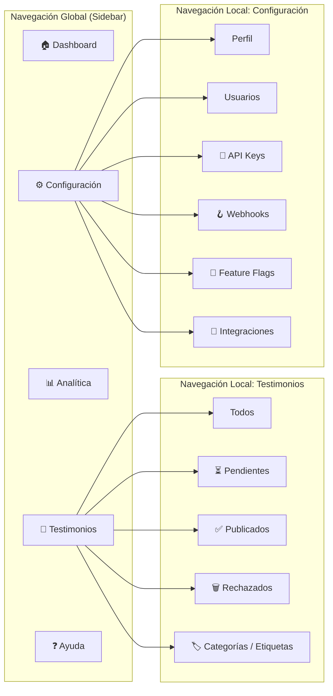
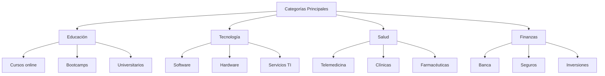

# Arquitectura de Información

## 1. Resumen Ejecutivo

**Testimonial CMS** organiza su contenido bajo el principio de **"máxima visibilidad con mínimo esfuerzo"**, priorizando que los administradores y editores puedan gestionar testimonios de forma intuitiva, y que los visitantes externos encuentren contenido relevante rápidamente. Esta arquitectura soporta múltiples inquilinos (tenants) con aislamiento de datos, y está diseñada para escalar a miles de testimonios por cliente.

### Principios Rectores de Diseño

| Principio | Aplicación en IA | Métrica de Validación |
|-----------|------------------|----------------------|
| **Jerarquía Clara** | Testimonios organizados por estado (borrador, pendiente, publicado) y por categorías/etiquetas. | < 3 clics para moderar un testimonio pendiente |
| **Consistencia Terminológica** | Mismo vocabulario en menús, URLs y contenido (ej. "testimonio", nunca "reseña" o "comentario"). | 95% de usuarios entienden etiquetas sin ayuda (pruebas de usabilidad) |
| **Flexibilidad de Acceso** | Múltiples caminos: búsqueda, filtros por categoría, ordenamiento por fecha/score. | Tasa de abandono < 15% en flujos de búsqueda |
| **Escalabilidad** | Estructura que permite añadir nuevas categorías, etiquetas y funcionalidades sin reorganización completa. | Tiempo de onboarding de nuevo contenido < 2 horas |

---

## 2. Modelo de Organización del Contenido

### 2.1. Estructura General (Taxonomía Principal)

```mermaid
flowchart TD
    subgraph Root["Testimonial CMS (por Tenant)"]
        A[Dashboard / Inicio]
        B[Testimonios]
        C[Analítica]
        D[Configuración]
        E[Soporte y Ayuda]
    end
    
    subgraph B1["Testimonios"]
        B1_1[Todos los testimonios]
        B1_2[Pendientes de moderación]
        B1_3[Publicados]
        B1_4[Rechazados / Borradores]
        B1_5[Categorías / Etiquetas]
    end
    
    subgraph C1["Analítica"]
        C1_1[Panel de métricas]
        C1_2[Top testimonios por score]
        C1_3[Evolución de engagement]
    end
    
    subgraph D1["Configuración"]
        D1_1[Perfil de empresa (tenant)]
        D1_2[Usuarios y roles]
        D1_3[API Keys]
        D1_4[Webhooks]
        D1_5[Feature Flags]
        D1_6[Integraciones (Cloudinary, YouTube)]
    end
    
    subgraph E1["Soporte"]
        E1_1[Documentación / FAQ]
        E1_2[Contacto]
    end
    
    A --> B
    A --> C
    A --> D
    A --> E
    B --> B1
    C --> C1
    D --> D1
    E --> E1
```

### 2.2. Patrón de Organización Seleccionado

| Patrón | ¿Aplica? | Justificación | Ejemplo |
|--------|----------|---------------|---------|
| **Jerárquico (Árbol)** | ✅ Sí | Estructura clara de padres/hijos: Testimonios → Pendientes → Acción de moderar | Menú principal → Submenús |
| **Secuencial (Lineal)** | ⚠️ Parcial | Solo para flujos específicos como la creación de un testimonio paso a paso (si se implementa wizard) | Crear testimonio con imagen y video |
| **Matricial (Grid)** | ❌ No | Complejidad innecesaria para este producto | - |
| **Por Facetas (Taxonomía)** | ✅ Sí | Permite múltiples dimensiones de clasificación: categoría + estado + fecha + etiquetas | Filtros en la lista de testimonios |

---

## 3. Sistemas de Navegación

### 3.1. Tipos de Navegación Implementados

| Tipo | Ubicación | Propósito | Ejemplo de Uso |
|------|-----------|-----------|----------------|
| **Global (Primaria)** | Header / Sidebar principal | Acceso a las secciones principales del dashboard | Menú lateral: Inicio, Testimonios, Analítica, Configuración |
| **Local (Secundaria)** | Dentro de la sección "Testimonios" | Navegación entre pestañas de estado | Pestañas: Todos, Pendientes, Publicados, Rechazados |
| **Contextual** | Dentro de cada testimonio | Acciones relacionadas al ítem actual | Botones "Aprobar", "Rechazar", "Editar" en tarjetas de testimonio |
| **Suplementaria** | Footer / Breadcrumbs | Acceso a información secundaria y ubicación actual | Breadcrumbs: Inicio > Testimonios > Pendientes |
| **De Búsqueda** | Barra de búsqueda en header | Acceso directo a testimonios por autor, contenido o etiqueta | Buscar "Juan Pérez" |

### 3.2. Mapa de Navegación Global



### 3.3. Breadcrumbs (Migas de Pan)

**Patrón de implementación:**
```
Inicio > Testimonios > Pendientes > Testimonio de Juan Pérez
```

| Componente | Regla de Implementación |
|------------|-------------------------|
| **Separador** | `>` (chevron) para jerarquía clara |
| **Enlace clickeable** | Todos excepto la página actual |
| **Longitud máxima** | 4 niveles (si más, usar "..." o reorganizar IA) |
| **Accesibilidad** | `<nav aria-label="breadcrumb">` con `<ol>` y `<li>` |

---

## 4. Sistemas de Etiquetado (Labeling)

### 4.1. Convenciones de Nomenclatura

| Elemento | Convención | Ejemplo Correcto | Ejemplo Incorrecto |
|----------|------------|------------------|---------------------|
| **Menús principales** | Sustantivos en singular, primera letra mayúscula | `Testimonio`, `Configuración` | `Testimonios`, `Mis Testimonios` |
| **Submenús** | Sustantivos en plural o adjetivos | `Pendientes`, `Publicados`, `Categorías` | `Lista de Pendientes`, `Los Publicados` |
| **Botones de acción** | Verbos en infinitivo | `Crear`, `Editar`, `Aprobar`, `Rechazar` | `Creación`, `Botón de Edición` |
| **Títulos de página** | Sustantivo + descriptor (si aplica) | `Testimonios - Pendientes de Moderación` | `Página de Testimonios Pendientes` |
| **Campos de formulario** | Etiqueta clara + placeholder opcional | `Autor` + `Ej: Juan Pérez` | Solo placeholder sin label |

### 4.2. Glosario de Términos (Control de Vocabulario)

| Término | Definición | Contexto de Uso | Sinónimos Evitados |
|---------|------------|-----------------|---------------------|
| **Testimonio** | Opinión de un cliente sobre un producto/servicio, con autor, contenido y calificación. | Toda la plataforma | "Reseña", "Comentario", "Review" |
| **Moderación** | Proceso de revisión y aprobación/rechazo de testimonios antes de publicarlos. | Sección de pendientes | "Revisión", "Control de calidad" |
| **Embed** | Código JavaScript para insertar testimonios en sitios externos. | Documentación para desarrolladores | "Widget", "Script", "Plugin" |
| **Score** | Puntaje calculado automáticamente para ordenar testimonios por relevancia. | Analítica y ordenamiento | "Relevancia", "Puntuación" |
| **Tenant** | Cliente (empresa) que utiliza la plataforma de forma aislada. | Contexto interno (admin) | "Cliente", "Cuenta", "Organización" |
| **Webhook** | Notificación HTTP enviada a una URL externa cuando ocurre un evento. | Configuración de integraciones | "Callback", "Notificación" |
| **Feature Flag** | Mecanismo para activar/desactivar funcionalidades por tenant. | Configuración avanzada | "Toggle", "Switch" |

---

## 5. Sistemas de Búsqueda

### 5.1. Alcance de Indexación

| Tipo de Contenido | ¿Indexado? | Peso de Relevancia | Notas |
|-------------------|------------|-------------------|-------|
| **Autor del testimonio** | ✅ Sí | Alto (3x) | Búsqueda por nombre de cliente |
| **Contenido del testimonio** | ✅ Sí | Medio (1x) | Texto completo indexado |
| **Categorías y etiquetas** | ✅ Sí | Medio-Alto (2x) | Tags y categorías asignadas |
| **Fecha de publicación** | ⚠️ Parcial | Bajo | Para ordenamiento, no para búsqueda textual |
| **Calificación (rating)** | ✅ Sí | Medio | Búsqueda por "testimonios de 5 estrellas" |
| **Testimonios archivados** | ❌ No | - | Excluido de búsqueda principal |

### 5.2. Estrategia de Filtrado y Facetas

```mermaid
flowchart TD
    A[Búsqueda: "curso online"] --> B{Filtros Aplicados?}
    B -->|No| C[Mostrar todos resultados<br>ordenados por relevancia (score)]
    B -->|Sí| D{Tipo de Filtro}
    
    D -->|Categoría| E[Filtrar por: Educación]
    D -->|Estado| F[Filtrar por: Publicado]
    D -->|Calificación| G[Filtrar por: ≥ 4 estrellas]
    D -->|Fecha| H[Filtrar por: Últimos 30 días]
    
    E --> I[Resultados filtrados<br>+ facetas disponibles]
    F --> I
    G --> I
    H --> I
```

### 5.3. Presentación de Resultados

**Estructura de cada resultado:**
```
┌─────────────────────────────────────────┐
│ [⭐] Título del Testimonio (autor)       │ ← Enlace principal
│                                         │
│ [Snippet] "Excelente curso, aprendí..." │ ← 150 caracteres
│   con keywords resaltadas en negrita    │
│                                         │
│ [Metadatos] Categoría • Fecha • Rating  │ ← Información contextual
│                                         │
│ [Tags] #educación #online #recomendado  │ ← Facetas aplicables
└─────────────────────────────────────────┘
```

| Elemento | Requisito | Ejemplo |
|----------|-----------|---------|
| **Título** | Enlace clickeable, ≤ 60 caracteres | `Curso de Marketing Digital - Juan Pérez ⭐5` |
| **Snippet** | Texto relevante con keywords resaltadas | `"Excelente **curso online**, muy práctico y bien estructurado..."` |
| **Metadatos** | Información contextual concisa | `Educación • 15/03/YYYY • 5 estrellas` |
| **Tags** | Facetas aplicables al resultado | `#marketing #digital #online` |

### 5.4. Búsqueda Avanzada

**Campos disponibles:**
| Campo | Tipo | Operadores Soportados | Ejemplo |
|-------|------|----------------------|---------|
| **Palabras clave** | Texto | AND, OR, NOT, "frase exacta" | `"curso online" AND recomendado` |
| **Categoría** | Dropdown | Igual, Diferente | `Educación` |
| **Estado** | Dropdown | Publicado, Pendiente, Rechazado | `Publicado` |
| **Calificación** | Rango | ≥, ≤, = | `≥ 4` |
| **Fecha** | Rango | Antes de, Después de, Entre | `01/03/YYYY - 31/03/YYYY` |
| **Etiquetas** | Autocompletado | Contiene todas, contiene alguna | `online, marketing` |

---

## 6. Taxonomía y Metadatos

### 6.1. Estructura de Categorías (Taxonomía Principal)



### 6.2. Esquema de Metadatos

| Metadato | Tipo | Obligatorio | Ejemplo | Propósito |
|----------|------|-------------|---------|-----------|
| **id** | UUID | ✅ Sí | `550e8400-e29b-41d4-a716-446655440000` | Identificador único |
| **tenant_id** | UUID | ✅ Sí | `tenant-123` | Aislamiento multi‑tenant |
| **author** | String | ✅ Sí | `Juan Pérez` | Nombre del autor del testimonio |
| **content** | Text | ✅ Sí | `Excelente curso, lo recomiendo.` | Contenido principal |
| **rating** | Integer | ✅ Sí | `5` | Calificación de 1 a 5 |
| **media_url** | String | ⚠️ Opcional | `https://cloudinary.com/...` | URL de imagen o video |
| **media_type** | Enum | ⚠️ Opcional | `image`, `video` | Tipo de multimedia |
| **status** | Enum | ✅ Sí | `published`, `pending`, `rejected` | Estado del testimonio |
| **category_id** | UUID | ⚠️ Opcional | `cat-456` | Categoría principal |
| **tags** | Array | ⚠️ Opcional | `["online", "marketing"]` | Etiquetas asociadas |
| **score** | Float | ⚠️ Calculado | `87.5` | Puntaje de relevancia |
| **views** | Integer | ⚠️ Calculado | `1200` | Número de visualizaciones |
| **clicks** | Integer | ⚠️ Calculado | `85` | Número de clics |
| **created_at** | Datetime | ✅ Sí | `YYYY-MM-DDT10:00:00Z` | Fecha de creación |
| **published_at** | Datetime | ⚠️ Opcional | `YYYY-MM-DDT09:00:00Z` | Fecha de publicación |

### 6.3. Ontología de Relaciones

| Relación | Descripción | Ejemplo |
|----------|-------------|---------|
| **isPartOf** | Pertenece a una categoría | `Testimonio 123` → `Categoría: Educación` |
| **hasTag** | Tiene una etiqueta | `Testimonio 123` → `Tag: online` |
| **relatedTo** | Relación temática no jerárquica | `Testimonio A` ↔ `Testimonio B` (misma categoría) |
| **supersedes** | Reemplaza a otro testimonio (si se edita) | `Testimonio v2` → `Testimonio v1` |

---

## 7. Mapa del Sitio (Sitemap)

### 7.1. Estructura Visual Completa

```mermaid
flowchart TD
    Start([Landing Page Pública]) --> Auth{¿Autenticado?}
    
    Auth -->|No| Public
    Auth -->|Sí| Private
    
    subgraph Public["Área Pública"]
        P1[Landing / Home]
        P2[Documentación / API Docs]
        P3[Blog (opcional)]
        P4[Contacto / Soporte]
        P5[Login / Registro]
    end
    
    subgraph Private["Área Privada (Dashboard por Tenant)"]
        D1[Dashboard Principal]
        D2[Testimonios]
        D3[Analítica]
        D4[Configuración]
        D5[Perfil de Usuario]
    end
    
    subgraph D2_1["Testimonios"]
        D2_1_1[Lista completa]
        D2_1_2[Pendientes]
        D2_1_3[Publicados]
        D2_1_4[Rechazados]
        D2_1_5[Crear nuevo]
        D2_1_6[Editar testimonio]
        D2_1_7[Categorías / Etiquetas]
    end
    
    subgraph D3_1["Analítica"]
        D3_1_1[Panel general]
        D3_1_2[Top testimonios]
        D3_1_3[Evolución temporal]
    end
    
    subgraph D4_1["Configuración"]
        D4_1_1[Perfil del tenant]
        D4_1_2[Usuarios y roles]
        D4_1_3[API Keys]
        D4_1_4[Webhooks]
        D4_1_5[Feature Flags]
        D4_1_6[Integraciones]
    end
    
    subgraph D5_1["Perfil Usuario"]
        D5_1_1[Datos personales]
        D5_1_2[Cambiar contraseña]
        D5_1_3[Preferencias]
    end
    
    D2 --> D2_1
    D3 --> D3_1
    D4 --> D4_1
    D5 --> D5_1
```

### 7.2. Jerarquía de URLs (URL Structure)

| Nivel | Patrón | Ejemplo | Notas |
|-------|--------|---------|-------|
| **Raíz pública** | `/` | `https://testimonialcms.com/` | Landing page |
| **Documentación** | `/docs` | `https://testimonialcms.com/docs` | Guías y referencia API |
| **Login** | `/login` | `https://testimonialcms.com/login` | - |
| **Dashboard** | `/dashboard` | `https://app.testimonialcms.com/dashboard` | Subdominio app |
| **Lista de testimonios** | `/dashboard/testimonials` | `https://app.testimonialcms.com/dashboard/testimonials` | - |
| **Filtro por estado** | `/dashboard/testimonials?status=pending` | `https://app.testimonialcms.com/dashboard/testimonials?status=pending` | Query param |
| **Editar testimonio** | `/dashboard/testimonials/:id/edit` | `https://app.testimonialcms.com/dashboard/testimonials/123/edit` | ID del testimonio |
| **Configuración** | `/dashboard/settings/:section` | `/dashboard/settings/api-keys` | Secciones |

**Reglas de URL:**
- ✅ Usar **kebab-case** para rutas: `/api-keys`, no `/apikeys` ni `/api_keys`.
- ✅ Preferir **slugs descriptivos** sobre IDs cuando sea relevante (ej. para categorías).
- ✅ Mantener URLs **≤ 60 caracteres** cuando sea posible.
- ✅ Usar **minúsculas** exclusivamente.
- ✅ Para el área privada, usar subdominio `app.` para separar claramente.

---

## 8. Flujos de Usuario Clave (User Flows)

### 8.1. Flujo: Moderar un Testimonio Pendiente

```mermaid
flowchart TD
    A[Editor recibe notificación<br>o ingresa al dashboard] --> B[Navega a Testimonios > Pendientes]
    B --> C[Ve lista de testimonios pendientes<br>con opciones Aprobar/Rechazar]
    
    C --> D{Decisión}
    D -->|Aprobar| E[Abre modal de confirmación]
    D -->|Rechazar| F[Abre modal con campo opcional<br>para motivo de rechazo]
    
    E --> G[Confirma aprobación]
    G --> H[Testimonio pasa a "approved"<br>y luego a "published" automáticamente]
    H --> I[Se dispara webhook si configurado]
    H --> J[El testimonio aparece en API/embed]
    
    F --> K[Ingresa motivo (opcional) y confirma]
    K --> L[Testimonio pasa a "rejected"]
    L --> M[El motivo queda registrado en historial]
    
    H --> N[✓ Flujo completado]
    M --> N
```

### 8.2. Flujo: Configurar un Webhook

```mermaid
flowchart TD
    A[Admin va a Configuración > Webhooks] --> B[Ve lista de webhooks existentes]
    B --> C[Hace clic en "Agregar webhook"]
    C --> D[Completa formulario:<br>URL, Evento (ej. testimonial.published)]
    D --> E[Guarda configuración]
    E --> F[El webhook aparece en la lista con estado "Activo"]
    
    F --> G[Opcional: Probar webhook]
    G --> H[Envía payload de prueba a la URL]
    H --> I{Respuesta exitosa?}
    I -->|Sí| J[Muestra "Prueba exitosa"]
    I -->|No| K[Muestra error y logs de intento]
    
    J --> L[✓ Flujo completado]
    K --> L
```

---

## 9. Consideraciones de Accesibilidad (a11y)

### 9.1. Navegación por Teclado

| Acción | Tecla | Comportamiento Esperado |
|--------|-------|-------------------------|
| **Mover entre elementos** | `Tab` / `Shift+Tab` | Enfocar siguiente/anterior elemento interactivo (enlaces, botones, inputs) |
| **Abrir menú desplegable** | `Enter` o `Space` | Expandir submenú (ej. acciones en tabla) |
| **Cerrar menú desplegable** | `Esc` | Colapsar menú actual |
| **Navegar dentro de un modal** | `Tab` cíclico | No salir del modal hasta cerrarlo (trap focus) |
| **Saltar a contenido principal** | Primer `Tab` (skip link) | Enfocar enlace "Saltar al contenido principal" |

### 9.2. ARIA Landmarks

| Landmark | Elemento HTML | Propósito |
|----------|---------------|-----------|
| **banner** | `<header role="banner">` | Encabezado global con logo y navegación principal |
| **navigation** | `<nav role="navigation">` | Menú lateral (sidebar) y menú superior |
| **main** | `<main role="main">` | Contenido principal de cada página |
| **complementary** | `<aside role="complementary">` | Widgets de ayuda o métricas laterales (opcional) |
| **contentinfo** | `<footer role="contentinfo">` | Información del sistema (versión, copyright) |
| **search** | `<form role="search">` | Barra de búsqueda global |
| **region** | `<section role="region" aria-labelledby="...">` | Cada sección del dashboard (Testimonios, Analítica, etc.) |

### 9.3. Contraste y Legibilidad

| Elemento | Ratio de Contraste Mínimo | Herramienta de Validación |
|----------|---------------------------|---------------------------|
| **Texto normal** | 4.5:1 | axe-core, Lighthouse |
| **Texto grande (≥18pt)** | 3:1 | axe-core, Lighthouse |
| **Texto de UI (botones)** | 3:1 | axe-core, Lighthouse |
| **Estados de foco** | 3:1 (outline visible) | axe-core, Lighthouse |

---

## 10. Métricas de Éxito y Validación

### 10.1. KPIs de Arquitectura de Información

| Métrica | Objetivo | Cómo Medir | Herramienta |
|---------|----------|------------|-------------|
| **Tasa de Éxito en Búsqueda** | > 85% | % de búsquedas que resultan en clic en al menos un resultado | Google Analytics / Mixpanel |
| **Profundidad de Navegación** | ≤ 3 clics | Número promedio de clics para llegar a un testimonio desde el dashboard | Session recordings, analytics de eventos |
| **Tasa de Re-búsqueda** | < 15% | % de usuarios que ajustan filtros o buscan nuevamente sin hacer clic | Analytics de funnel |
| **Tasa de Abandono en Moderación** | < 20% | % de usuarios que inician moderación y no completan (abandonan la página) | Funnel analysis |
| **Tiempo para Moderar un Testimonio** | < 30 segundos | Tiempo promedio desde que abre la lista de pendientes hasta que aprueba/rechaza | User testing, analytics |
| **Satisfacción con Navegación (CSAT)** | > 4.0/5 | Encuesta post-uso (ej. "¿Fue fácil encontrar lo que buscabas?") | Typeform, encuestas internas |

### 10.2. Métodos de Validación

| Método | Frecuencia | Participantes | Resultado Esperado |
|--------|------------|---------------|---------------------|
| **Card Sorting** | Pre-lanzamiento | 15-20 usuarios (potenciales clientes) | Validar que la categorización de testimonios tenga sentido |
| **Tree Testing** | Pre-lanzamiento | 20-30 usuarios | Validar que la jerarquía (ej. dónde buscar "API Keys") es intuitiva |
| **User Testing** | Post-lanzamiento | 5-10 usuarios/semana | Identificar puntos de fricción en flujos clave (moderación, configuración) |
| **A/B Testing** | Continuo | Tráfico real | Probar diferentes etiquetas (ej. "Pendientes" vs "En revisión") |
| **Heatmaps** | Continuo | Tráfico real | Ver dónde hacen clic los usuarios en el dashboard |

---

## 11. Checklist de Calidad para IA

### ✅ Estructura y Organización
- [x] La jerarquía tiene **≤ 3 niveles de profundidad** para contenido crítico (ej. Testimonios → Pendientes → Acción de moderar).
- [x] Cada categoría principal tiene **entre 5-9 subcategorías** (Configuración tiene 6, Testimonios 5).
- [x] No existen **categorías huérfanas** (todas tienen contenido o propósito claro).
- [x] La estructura permite **escalabilidad** (se pueden añadir nuevas integraciones sin reorganizar).

### ✅ Navegación y Acceso
- [x] Todos los contenidos críticos son accesibles en **≤ 3 clics** desde el dashboard.
- [x] Existen **múltiples caminos**: búsqueda, filtros, navegación por pestañas.
- [x] El sistema de **breadcrumbs** está implementado en páginas de detalle.
- [x] La **búsqueda** cubre testimonios, autores, categorías y etiquetas.

### ✅ Etiquetado y Terminología
- [x] El **vocabulario es consistente** (siempre "testimonio", nunca "reseña").
- [x] Las **etiquetas son claras** para usuarios no técnicos ("Pendientes" vs "En espera").
- [x] Se ha definido un **glosario de términos** con sinónimos evitados.
- [x] Las **URLs son descriptivas** (`/dashboard/settings/api-keys`) y usan kebab-case.

### ✅ Accesibilidad
- [x] Navegación completa **funciona con teclado** (pruebas iniciales).
- [x] Todos los landmarks tienen **roles ARIA** correctos (según diseño).
- [x] El contraste cumple **WCAG 2.1 AA** (paleta de colores definida).
- [x] Los formularios de búsqueda tienen **labels asociados** (visible u oculto con `sr-only`).

### ✅ Métricas y Validación
- [x] Se han definido **KPIs cuantificables** (tasa de éxito, profundidad, etc.).
- [x] Existe plan para **validación con usuarios reales** (card sorting, tree testing).
- [x] Se monitorearán **métricas post-lanzamiento** con herramientas analíticas.
- [x] Hay proceso para **iterar basado en datos** (revisión trimestral).

---

> **Nota final**: La arquitectura de información es un **documento vivo**. Revisa y actualiza este documento trimestralmente basado en crecimiento de contenido, feedback de usuarios y métricas de uso. Una IA estática en un producto que evoluciona es una receta para la fricción del usuario.