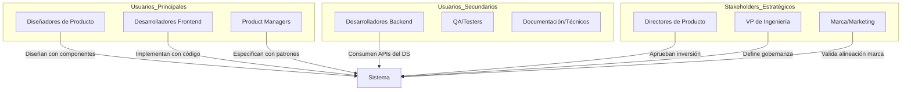

# Estrategia del Sistema de Diseño

## 1. Visión y Propósito

### 1.1. Declaración de Visión

> **"Testimonial Design System"** es el lenguaje visual y funcional unificado de **Testimonial CMS**, diseñado para **acelerar el desarrollo de interfaces consistentes y accesibles** a través de **componentes reutilizables, tokens semánticos y patrones validados**, permitiendo a equipos de producto y desarrollo **entregar experiencias de usuario de alta calidad en la mitad del tiempo, con consistencia de marca garantizada y accesibilidad WCAG 2.1 AA por defecto**.

### 1.2. Propósito Estratégico

| Dimensión | Objetivo | Impacto Esperado |
|-----------|----------|------------------|
| **Eficiencia** | Reducir tiempo de desarrollo de UI | -50% en implementación de nuevas features (de días a horas) |
| **Consistencia** | Garantizar experiencia uniforme en dashboard, embeds y landing | +30% en satisfacción del usuario (CSAT) por previsibilidad |
| **Escalabilidad** | Soportar crecimiento de producto (nuevos módulos, integraciones) | Onboarding de nuevos devs < 4 horas |
| **Accesibilidad** | Cumplir WCAG 2.1 AA por defecto en todos los componentes | 100% de componentes accesibles desde v1.0 |
| **Marca** | Reforzar identidad visual única en todos los puntos de contacto | Reconocimiento de marca +25% en encuestas a clientes |

---

## 2. Principios de Diseño (Design Principles)

### 2.1. Principios Fundamentales

| Principio | Definición | Criterio de Aplicación | Ejemplo de Violación |
|-----------|------------|------------------------|----------------------|
| **Claridad sobre Complejidad** | La información crítica debe ser inmediatamente comprensible; los testimonios deben comunicar confianza sin ruido visual. | ¿Puede un visitante entender el testimonio en menos de 3 segundos? | Demasiados adornos, texto pequeño, fondo distractivo. |
| **Accesibilidad por Defecto** | Todo componente debe ser usable por personas con diversas capacidades sin configuración adicional. | ¿Funciona con teclado, screen reader y tiene contraste suficiente? | Botones sin labels ARIA, colores de bajo contraste. |
| **Consistencia Contextual** | Patrones repetidos generan predictibilidad; variaciones deben tener justificación de negocio. | ¿Este botón de acción tiene la misma apariencia en todas las partes? | Diferentes estilos de botón primario en el dashboard vs. el embed. |
| **Eficiencia Operativa** | Reducir clicks, tiempo y esfuerzo cognitivo en flujos críticos (moderación, configuración). | ¿Un editor puede aprobar un testimonio en 2 clics? | Flujo de moderación que requiere múltiples pasos innecesarios. |
| **Confianza Visual** | El diseño debe transmitir credibilidad mediante espaciado adecuado, jerarquía tipográfica y uso coherente del color. | ¿El testimonio se percibe como auténtico y profesional? | Uso excesivo de colores llamativos que restan seriedad. |

### 2.2. Manifesto de Diseño

```markdown
**Creemos que...**
- El buen diseño es invisible; el usuario se enfoca en el testimonio, no en la interfaz.
- La consistencia genera confianza; la inconsistencia genera duda.
- La accesibilidad no es un feature; es un derecho humano básico.
- La velocidad percibida es tan importante como la velocidad real.
- Los datos > las opiniones; validamos decisiones con usuarios reales.

**No creemos que...**
- "Bonito" justifique complejidad innecesaria.
- Cada equipo deba reinventar patrones ya validados.
- El diseño deba adaptarse al código sin cuestionarlo.
- Los usuarios deban aprender nuestra terminología interna (ej. "tenant").
```

---

## 3. Objetivos de Negocio y KPIs

### 3.1. OKRs de Diseño (Objectives & Key Results)

| Objetivo (O) | Key Result (KR) | Meta | Ponderación |
|--------------|-----------------|------|-------------|
| **Acelerar tiempo de desarrollo** | Reducción de tiempo de implementación de UI | -50% vs baseline (medido en horas por feature) | 30% |
| **Mejorar consistencia de marca** | % de componentes usando DS vs custom | > 90% (medido con ESLint plugin) | 25% |
| **Incrementar satisfacción del usuario** | CSAT en flujos críticos (moderación, configuración) | +20% (4.0 → 4.5/5) | 25% |
| **Garantizar accesibilidad** | WCAG 2.1 AA compliance en todos los componentes | 100% (auditoría automática) | 20% |

### 3.2. Métricas Técnicas de Adopción

| Métrica | Fórmula | Objetivo | Herramienta de Medición |
|---------|---------|----------|-------------------------|
| **Tasa de Adopción** | `(Componentes DS usados / Total componentes en codebase) × 100` | > 85% | ESLint plugin + bundle analyzer |
| **Tiempo de Onboarding** | `Tiempo desde git clone hasta primer PR con DS` | < 4 horas | GitHub Insights / encuestas |
| **Reducción de Bugs UI** | `(Bugs UI post-DS / Bugs UI pre-DS) × 100` | -50% | Jira/Linear analytics |
| **Reutilización de Componentes** | `Número de instancias por componente` | Top 10 componentes > 50 usos | Bundle analyzer (detectar duplicación) |

### 3.3. Métricas de Experiencia de Usuario

| Métrica | Definición | Objetivo | Cómo Medir |
|---------|------------|----------|------------|
| **Task Success Rate** | % de editores que completan moderación sin ayuda | > 95% | Session recordings (Hotjar) |
| **Time on Task** | Tiempo promedio para aprobar un testimonio | < 20 segundos | Analytics de eventos |
| **Error Rate** | % de clics en elementos no interactivos o errores de formulario | < 2% | Heatmaps + console logs |
| **SUS (System Usability Scale)** | Puntuación estandarizada de usabilidad post‑uso | > 80/100 | Encuesta automática en dashboard |

---

## 4. Audiencia y Stakeholders

### 4.1. Usuarios Primarios del Sistema de Diseño



### 4.2. Necesidades por Rol

| Rol | Necesidad Principal | Dolor Actual | Éxito con DS |
|-----|---------------------|--------------|--------------|
| **Diseñador** | Prototipar rápido con componentes reales | "Diseño en Figma pero devs implementan distinto" | Library de componentes Figma ↔ Código 1:1 |
| **Frontend Dev** | Reutilizar código sin reinventar la rueda | "Cada feature tiene su propio botón custom" | Paquete NPM con componentes testeados y documentados |
| **Product Manager** | Predecir esfuerzo de UI | "No sé cuánto tardará este flujo visualmente" | Estimaciones basadas en componentes existentes |
| **QA** | Testear patrones conocidos | "Cada implementación tiene bugs distintos" | Suite de tests compartida por componente |
| **Marca** | Consistencia visual global | "El embed se ve diferente en cada sitio" | Tokens de diseño centralizados + estilos base |

---

## 6. Arquitectura de Tokens de Diseño

## 6. Arquitectura de Tokens de Diseño

### 6.1. Sistema de Tokens Escalable

```mermaid
flowchart TD
    subgraph Foundation["Nivel 1: Tokens Fundamentales"]
        F1[Color Primitives (HSL)]
        F2[Spacing Scale (4px base)]
        F3[Typography Scale (1.25 ratio)]
        F4[Border Radius Scale]
        F5[Elevation/Shadow (rem)]
    end
    
    subgraph Semantic["Nivel 2: Tokens Semánticos"]
        S1[Color: Primary/Secondary/Success/Error]
        S2[Spacing: Component/Content/Page]
        S3[Typography: Heading/Body/Label]
        S4[Border: Card/Input/Divider]
        S5[Shadow: Surface/Floating/Dialog]
    end
    
    subgraph Components["Nivel 3: Componentes"]
        C1[Button]
        C2[Input]
        C3[Card]
        C4[Table]
        C5[Modal]
    end
    
    F1 --> S1
    F2 --> S2
    F3 --> S3
    F4 --> S4
    F5 --> S5
    
    S1 --> C1
    S2 --> C2
    S3 --> C3
    S4 --> C4
    S5 --> C5
```

### 6.2. Escala de Espaciado (Spacing Scale)

| Token | Valor (rem) | px (base 16px) | Uso Recomendado | Ejemplo |
|-------|-------------|----------------|-----------------|---------|
| `space-0` | `0` | 0px | Sin margen/padding | Divisores |
| `space-1` | `0.25rem` | 4px | Espacio mínimo entre elementos | Iconos pequeños |
| `space-2` | `0.5rem` | 8px | Padding interno de componentes | Botones, badges |
| `space-3` | `0.75rem` | 12px | Margen entre secciones pequeñas | Cards compactos |
| `space-4` | `1rem` | 16px | Padding estándar | Contenedores |
| `space-5` | `1.5rem` | 24px | Margen entre secciones | Layout sections |
| `space-6` | `2rem` | 32px | Espacio entre páginas | Page margins |
| `space-7` | `3rem` | 48px | Espacio grande | Hero sections |
| `space-8` | `4rem` | 64px | Espacio máximo | Section dividers |

**Regla**: Solo usar estos valores. No inventar espaciados intermedios (ej: 10px, 18px). En Tailwind se mapean a `p-1`, `p-2`, etc.

### 6.3. Paleta de Colores Semántica

| Token | Light Mode (HSL) | Dark Mode (HSL) | Uso | Accesibilidad |
|-------|------------------|-----------------|-----|---------------|
| `color-primary-500` | `hsl(217, 88%, 50%)` | `hsl(217, 88%, 60%)` | Acciones principales, branding | 4.5:1 sobre blanco/negro |
| `color-secondary-500` | `hsl(203, 30%, 40%)` | `hsl(203, 30%, 60%)` | Acciones secundarias | 4.5:1 |
| `color-success-500` | `hsl(158, 64%, 40%)` | `hsl(158, 64%, 50%)` | Estados positivos | 4.5:1 |
| `color-warning-500` | `hsl(44, 100%, 45%)` | `hsl(44, 100%, 60%)` | Advertencias | 4.5:1 |
| `color-error-500` | `hsl(354, 82%, 45%)` | `hsl(354, 82%, 60%)` | Errores, acciones destructivas | 4.5:1 |
| `color-info-500` | `hsl(204, 100%, 45%)` | `hsl(204, 100%, 60%)` | Información neutral | 4.5:1 |
| `color-surface-100` | `hsl(0, 0%, 100%)` | `hsl(0, 0%, 10%)` | Background principal | - |
| `color-surface-200` | `hsl(0, 0%, 98%)` | `hsl(0, 0%, 15%)` | Background secundario | - |
| `color-text-primary` | `hsl(0, 0%, 13%)` | `hsl(0, 0%, 95%)` | Texto principal | 7:1 (AAA) |
| `color-text-secondary` | `hsl(0, 0%, 40%)` | `hsl(0, 0%, 70%)` | Texto secundario | 4.5:1 (AA) |

**Regla**: Nunca usar colores hexadecimales directamente en el código. Siempre referenciar tokens semánticos vía clases de Tailwind (`bg-primary-500`).

### 6.4. Escala Tipográfica (Typography Scale)

| Token | Font Size (rem) | Line Height | Weight | Uso |
|-------|-----------------|-------------|--------|-----|
| `text-display-xl` | `3rem` | `1.2` | `700` | Títulos hero (landing) |
| `text-display-lg` | `2.25rem` | `1.3` | `700` | Títulos principales (dashboard) |
| `text-heading-xl` | `1.875rem` | `1.3` | `600` | Section headings |
| `text-heading-lg` | `1.5rem` | `1.4` | `600` | Subsection headings |
| `text-heading-md` | `1.25rem` | `1.5` | `600` | Card titles |
| `text-heading-sm` | `1.125rem` | `1.5` | `600` | Small headings |
| `text-body-lg` | `1.125rem` | `1.6` | `400` | Body text largo (descripciones) |
| `text-body-md` | `1rem` | `1.6` | `400` | Body text estándar |
| `text-body-sm` | `0.875rem` | `1.6` | `400` | Texto secundario (fechas) |
| `text-label-lg` | `1rem` | `1.4` | `500` | Labels de formulario |
| `text-label-md` | `0.875rem` | `1.4` | `500` | Labels pequeños |
| `text-label-sm` | `0.75rem` | `1.4` | `500` | Microcopy, hints |

**Regla**: Mantener ratio de escala consistente (≈1.25 entre tamaños adyacentes). En Tailwind se mapean a clases como `text-display-xl`, etc.

---

## 7. Gobernanza y Proceso de Adopción

### 7.1. Modelo de Gobernanza

```mermaid
flowchart TD
    A[Nuevo Requerimiento] --> B{¿Existe en DS?}
    
    B -->|Sí| C[Usar componente existente]
    B -->|No| D[Propuesta de Nuevo Componente]
    
    D --> E[Comité de Diseño<br>Revisión semanal]
    
    E --> F{Aprobado?}
    
    F -->|No| G[Feedback y Revisión]
    G --> D
    
    F -->|Sí| H[Diseño en Figma]
    H --> I[Implementación Dev]
    I --> J[Tests + Documentación]
    J --> K[Publicación en NPM (semver)]
    K --> L[Anuncio en Slack + Docs]
    L --> M[Adopción Gradual]
```

### 7.2. Roles y Responsabilidades

| Rol | Responsabilidad | Frecuencia |
|-----|-----------------|------------|
| **Design System Lead** | Estrategia, roadmap, priorización, calidad | Full-time |
| **Comité de Diseño** | Aprobación de nuevos componentes, revisión de propuestas | Semanal |
| **Core Contributors** | Implementación de componentes (diseñadores + devs) | Sprint-based |
| **Advocates por Equipo** | Promover adopción en sus equipos, dar feedback | Continuo |
| **Todos los Diseñadores** | Usar DS en prototipos; reportar discrepancias | Diario |
| **Todos los Devs** | Usar DS en implementación; contribuir con fixes | Diario |

### 7.3. Proceso de Contribución

**Flujo para proponer un nuevo componente:**

1. **Identificar necesidad**: Documentar el caso de uso real en el producto (ej. "necesitamos un selector de calificación con estrellas").
2. **Buscar existente**: Revisar si ya existe un componente similar o si se puede extender uno actual.
3. **Crear RFC (Request for Comments)**: Usar template en GitHub que incluya:
   - Caso de uso
   - Variaciones necesarias (tamaños, estados)
   - Requisitos de accesibilidad
   - Mockups en Figma (baja fidelidad)
   - Impacto en otros componentes
4. **Revisión del comité**: Feedback en ≤ 3 días hábiles.
5. **Diseño en Figma**: Crear variantes, estados, y documentar en la librería compartida.
6. **Implementación**: Código en React + Tailwind, tests unitarios (Vitest), stories de Storybook.
7. **Publicación**: Versionado semántico (minor) + changelog.
8. **Comunicación**: Anunciar en Slack #design-system y actualizar docs.

### 7.4. Versionado y Breaking Changes

| Tipo de Cambio | Versionado | Comunicación | Migration Path |
|----------------|------------|--------------|----------------|
| **Patch** (fixes) | `1.0.x` → `1.0.x+1` | Changelog | No requiere acción |
| **Minor** (features) | `1.x.y` → `1.x+1.0` | Changelog + Slack #general | Opcional adoptar |
| **Major** (breaking) | `x.y.z` → `x+1.0.0` | Email + Docs + Migration Guide | Plan de migración con 2 versiones de deprecation |

**Regla de breaking changes**: Nunca eliminar un componente sin 2 versiones de deprecation warning y guía de migración.

---

## 8. Diferenciales Competitivos

### 8.1. Matriz de Posicionamiento

| Característica | Testimonial DS | Competidor A (Material UI) | Competidor B (Tailwind UI) | Ventaja |
|----------------|----------------|----------------------------|----------------------------|---------|
| **Accesibilidad Built-in** | ✅ WCAG 2.1 AA por defecto | ⚠️ Requiere configuración | ⚠️ No garantizado | Alta |
| **Tokens Semánticos** | ✅ 3 niveles (foundation → semantic → component) | ⚠️ Solo foundation | ❌ No tiene | Alta |
| **Figma ↔ Código Sync** | ✅ Variables de Figma exportadas a JSON | ❌ Manual | ❌ Manual | Media |
| **Dark Mode** | ✅ Soporte nativo con Tailwind | ⚠️ Plugin externo | ✅ Sí | Media |
| **RTL Support** | ✅ Preparado para futuro (aunque no necesario ahora) | ⚠️ Limitado | ❌ No | Alta |
| **Bundle Size** | ✅ Tree-shakable (< 50KB) | ⚠️ 100KB+ | ✅ Pequeño | Media |
| **Documentación** | ✅ Ejemplos + código + tests interactivos (Storybook) | ⚠️ Buena pero genérica | ⚠️ Buena pero de pago | Alta |

### 8.2. Propuesta de Valor Única (USP)

> **"Testimonial Design System es el único sistema de diseño para plataformas de testimonios que combina accesibilidad WCAG 2.1 AA por defecto, tokens semánticos escalables y sincronización automática Figma‑código, permitiendo a equipos de producto entregar experiencias consistentes, confiables y optimizadas para conversión en la mitad del tiempo tradicional."**

---

## 9. Integración con Arquitectura de Información

### 9.1. Mapeo Componente → Patrón de IA

| Patrón de IA | Componentes del DS | Ejemplo de Uso |
|--------------|-------------------|----------------|
| **Navegación Global** | `NavBar`, `Sidebar`, `NavMenu` | Header con logo y menú principal |
| **Navegación Local** | `Tabs`, `Pagination`, `Breadcrumbs` | Pestañas entre "Todos", "Pendientes", "Publicados" |
| **Búsqueda** | `SearchBar`, `SearchResults`, `SearchFilters` | Barra de búsqueda en dashboard |
| **Filtros y Facetas** | `FilterPanel`, `Tag`, `Badge` | Filtros por categoría, etiqueta, estado |
| **Listados** | `Card`, `Table`, `ListItem` | Lista de testimonios en dashboard y embed |
| **Formularios** | `Form`, `FormField`, `Input`, `Select`, `Rating` | Creación/edición de testimonios |
| **Modales y Drawers** | `Modal`, `Dialog`, `Drawer` | Confirmación de moderación |
| **Notificaciones** | `Toast`, `Alert` | Feedback al aprobar/rechazar |

### 9.2. Consistencia entre IA y DS

**Regla**: Cada patrón de navegación definido en `04_information_architecture.md` debe tener al menos un componente correspondiente en el DS.

**Ejemplo de alineación:**

| IA Pattern | DS Component | Propósito |
|------------|--------------|-----------|
| **Breadcrumbs** | `Breadcrumb` | Mostrar jerarquía en páginas de detalle |
| **Pagination** | `Pagination` | Navegar entre páginas de testimonios |
| **Tabs** | `Tabs` | Alternar entre estados (pendientes/publicados) |
| **Accordion** | `Accordion` | Mostrar/ocultar secciones en configuración |

---

## 10. Documentación y Onboarding

### 10.1. Estructura de Documentación

```bash
docs/design-system/
├── README.md                  # Visión general y links rápidos
├── getting-started.md         # Cómo empezar (5 min) con Next.js
├── foundations/
│   ├── colors.md             # Paleta completa + accesibilidad
│   ├── typography.md         # Escala tipográfica
│   ├── spacing.md            # Sistema de espaciado
│   ├── elevation.md          # Sombras y profundidad
│   └── breakpoints.md        # Responsive breakpoints
├── components/
│   ├── button.md              # Button con ejemplos + API
│   ├── text-field.md          # Input con estados + validación
│   ├── card.md                # Card con variantes
│   ├── table.md               # Table con sorting y paginación
│   └── ...
├── patterns/
│   ├── forms.md               # Patrones de formularios
│   ├── navigation.md          # Patrones de navegación
│   └── layouts.md             # Patrones de layout (grid, contenedores)
├── accessibility/
│   ├── guidelines.md          # Guía de accesibilidad
│   ├── testing.md             # Cómo testear a11y (axe-core)
│   └── compliance.md          # WCAG checklist
└── contributing.md            # Cómo contribuir al DS
```

### 10.2. Checklist de Onboarding (Nuevo Dev)

**Semana 1:**
- [ ] Leer `docs/design-system/getting-started.md`
- [ ] Instalar DS en proyecto local (`npm install @testimonial/design-system`)
- [ ] Crear primer componente usando DS (ej: botón primario en una página de prueba)
- [ ] Revisar Storybook local (`npm run storybook`)

**Semana 2:**
- [ ] Implementar feature pequeña usando solo componentes del DS (ej: formulario de creación)
- [ ] Solicitar code review con foco en uso correcto del DS
- [ ] Participar en meeting del comité de diseño (observador)

**Semana 3:**
- [ ] Contribuir fix menor al DS (ej: documentación, typo en Storybook)
- [ ] Proponer mejora basada en experiencia de uso
- [ ] Mentorizar a siguiente nuevo dev

---

## 11. Checklist de Calidad para Estrategia de DS

### ✅ Visión y Propósito
- [x] La visión es clara, memorable y compartida por todos los stakeholders.
- [x] Los objetivos de negocio están alineados con OKRs de la empresa.
- [x] El propósito resuelve un dolor real identificado con usuarios.

### ✅ Principios de Diseño
- [x] Los principios son ≤ 7 y fácilmente memorizables.
- [x] Cada principio tiene criterio de aplicación concreto.
- [x] Existen ejemplos de violación para cada principio.

### ✅ Métricas y Validación
- [x] Se han definido KPIs cuantificables para cada objetivo.
- [x] Existe plan para medir métricas pre/post implementación.
- [x] Las métricas son accionables (no solo vanity metrics).

### ✅ Gobernanza
- [x] Los roles y responsabilidades están claramente definidos.
- [x] El proceso de contribución es accesible para todos.
- [x] Existe mecanismo para feedback continuo (canal de Slack, reuniones).

### ✅ Diferenciales
- [x] La propuesta de valor única está validada con usuarios potenciales.
- [x] Los diferenciales competitivos son sostenibles (accesibilidad y tokens).
- [x] El DS resuelve problemas que competidores no abordan (especialización en testimonios).

---

> **Nota final**: La estrategia de un sistema de diseño no es un documento estático. Revisa y actualiza este documento trimestralmente basado en métricas de adopción, feedback de usuarios y evolución de las necesidades del negocio. Un DS sin evolución estratégica se convierte en legacy antes de tiempo.