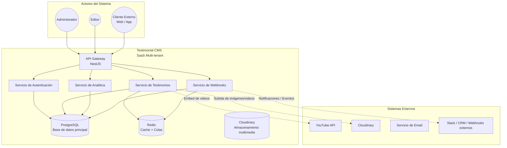
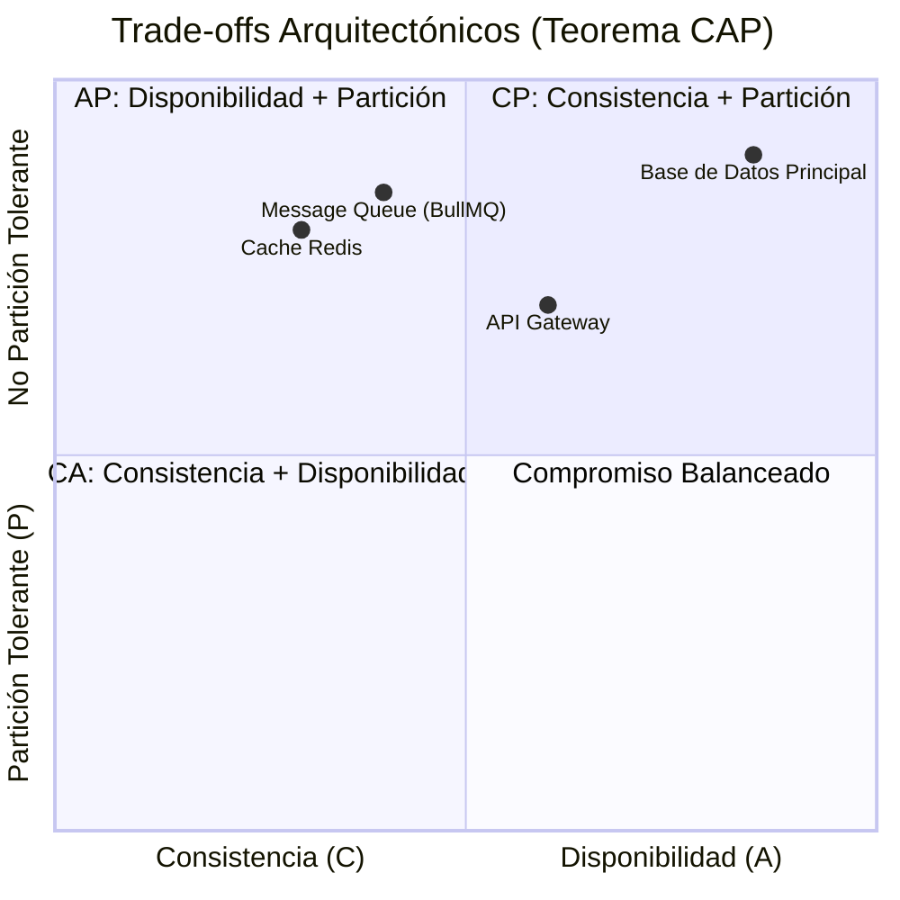
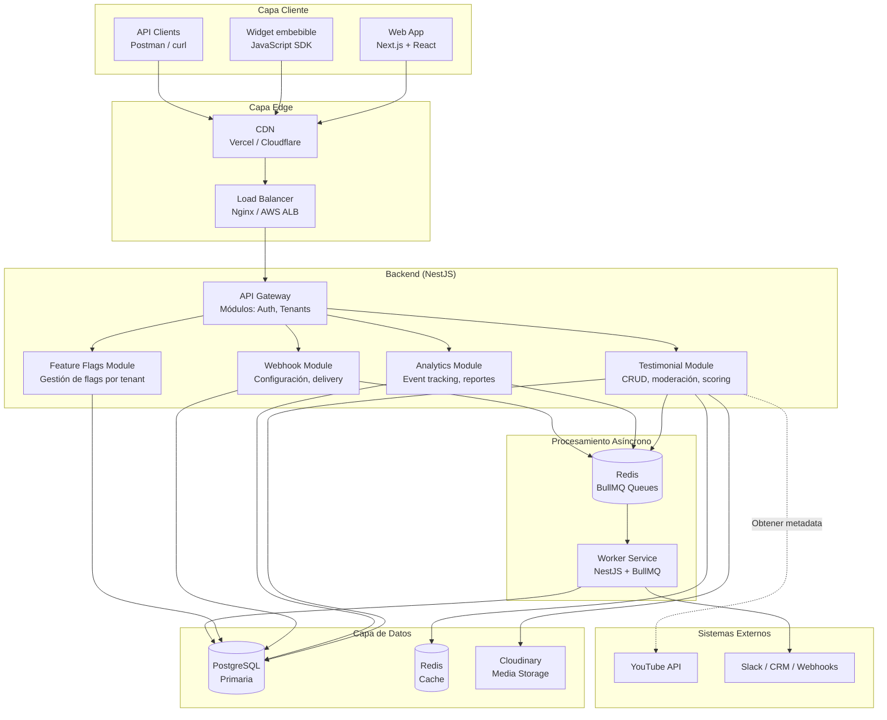
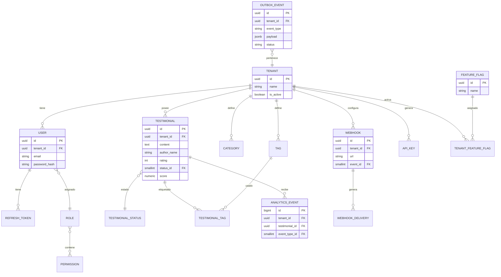

# Arquitectura Técnica

## 1. Visión General (C4 Model - Level 1)

### 1.1. Diagrama de Contexto del Sistema



### 1.2. Propósito y Alcance del Sistema

| Atributo | Valor |
|----------|-------|
| **Nombre del Sistema** | Testimonial CMS |
| **Tipo de Arquitectura** | Modular monolito con clara separación de capas (Clean Architecture) desplegado como servicios independientes (preparado para microservicios futuros) |
| **Patrón de Comunicación** | REST síncrono + eventos asíncronos mediante outbox pattern y colas (BullMQ + Redis) |
| **Usuarios Concurrentes Esperados** | 200+ (pico) / 50+ (promedio) por tenant |
| **Transacciones por Segundo (TPS)** | 50+ lectura / 10+ escritura |
| **Disponibilidad Objetivo (SLA)** | 99.9% (≤ 8.76h downtime/año) |
| **RTO (Recovery Time Objective)** | < 15 minutos |
| **RPO (Recovery Point Objective)** | < 5 minutos |

---

## 2. Decisiones Arquitectónicas Clave (ADR Summary)

### 2.1. Matriz de Decisiones

| Decisión | Alternativas Consideradas | Opción Seleccionada | Justificación | Impacto |
|----------|--------------------------|---------------------|---------------|---------|
| **Estilo Arquitectónico** | Monolito / Microservicios / Serverless | Modular monolito (NestJS) con capas claras y posible desacople futuro | Simplicidad inicial, pero con separación de dominios que permite escalar servicios de forma independiente si es necesario. | Menor complejidad operativa ahora, preparado para crecimiento. |
| **Framework Backend** | Express.js / Fastify / NestJS | NestJS | Provee arquitectura por defecto (módulos, controladores, servicios), inyección de dependencias y soporte nativo para los patrones que necesitamos (guards, interceptores, etc.). | Curva de aprendizaje, pero mejora mantenibilidad en equipo. |
| **Base de Datos** | PostgreSQL / MySQL / MongoDB | PostgreSQL 16 | Requerimos ACID, relaciones y consistencia fuerte para testimonios, analítica y eventos. Soporte JSONB para flexibilidad. | Integridad referencial garantizada. |
| **Cache** | Redis / Memcached / in‑memory | Redis 7 | Estructuras de datos avanzadas, soporte para colas (BullMQ), persistencia opcional y alta disponibilidad. | Complejidad de operación adicional, pero necesaria para escalar. |
| **Message Queue / Colas** | RabbitMQ / Kafka / AWS SQS / BullMQ | BullMQ (sobre Redis) | Suficiente para volumen proyectado, se integra naturalmente con Redis y Node.js. Soporte para retry, backoff, etc. | Escala hasta cierto punto, pero para MVP es ideal. |
| **API Design** | REST / GraphQL / gRPC | REST con OpenAPI | Simplicidad, madurez, herramientas de documentación y consumo universal. | Versionado y evolución controlada. |
| **Autenticación** | OAuth2 / JWT / Sesiones | JWT + Refresh Tokens (rotación y hashing) | Stateless, fácil de escalar, compatible con frontends modernos. Refresh tokens almacenados con hash para seguridad adicional. | Necesidad de revocación y rotación. |
| **Multi‑tenancy** | Base de datos separada / Schema por tenant / Fila por tenant | Fila por tenant (tenant_id en cada tabla) | Simplifica la administración y permite compartir recursos. Aislamiento lógico a nivel de aplicación. | Requiere cuidado en queries para no filtrar datos entre tenants. |
| **Event‑driven** | Polling / Event Sourcing / Outbox | Outbox pattern con tabla `outbox_events` y worker | Garantiza que los eventos (webhooks, analítica, etc.) se entreguen incluso si falla el sistema externo. Consistencia transaccional. | Mayor complejidad, pero necesario para confiabilidad. |
| **Feature Flags** | Configuración hardcodeada / DB / LaunchDarkly | Tabla `feature_flags` y `tenant_feature_flags` en DB | Control dinámico por tenant sin redeploy, preparado para A/B testing y despliegues graduales. | Impacto mínimo en complejidad. |
| **Analítica** | Almacenamiento en el mismo servicio / Servicio separado / Eventos en DB | Eventos en tabla `analytics_events` + procesamiento asíncrono | Simplicidad para MVP, permite reportes y cálculo de scoring con consultas SQL. | Puede convertirse en cuello de botella con muchos eventos; se migrará a sistema dedicado en el futuro. |

### 2.2. Trade-offs Explícitos (Análisis CAP)



**Análisis detallado:**

| Componente | Elección CAP | Razonamiento | Consecuencia |
|------------|--------------|--------------|--------------|
| **Base de Datos (PostgreSQL)** | **CP** (Consistencia + Partición) | Los testimonios y su estado deben ser consistentes; no podemos tener duplicados o estados contradictorios. | En caso de partición de red, la base puede volverse no disponible para escrituras en algunas réplicas, pero priorizamos consistencia. |
| **Cache (Redis)** | **AP** (Disponibilidad + Partición) | Usado para mejorar rendimiento; si falla, podemos servir datos de la BD (aunque más lento). Toleramos inconsistencia temporal. | Lecturas pueden devolver datos desactualizados (stale) hasta que se invalide la caché. |
| **Message Queue (BullMQ + Redis)** | **AP** (Disponibilidad + Partición) | Las colas deben aceptar mensajes aunque haya fallos en los consumidores. Priorizamos disponibilidad sobre consistencia. | Mensajes pueden duplicarse; requerimos idempotencia en los handlers. |
| **API Gateway (NestJS)** | **CA** (Consistencia + Disponibilidad) | No mantiene estado crítico; podemos escalarlo horizontalmente. Sacrificamos tolerancia a particiones porque si el gateway se cae, todo el sistema es inaccesible (mitigado con múltiples instancias). | Alta disponibilidad mediante balanceo y replicación. |

---

## 3. Arquitectura de Alto Nivel (C4 Model - Level 2)

### 3.1. Diagrama de Contenedores



### 3.2. Responsabilidades por Módulo/Servicio

| Módulo/Servicio | Responsabilidad Principal | Endpoints Clave | Escalabilidad | Persistencia |
|-----------------|---------------------------|-----------------|---------------|--------------|
| **Auth Module** | Registro, login, refresh tokens, gestión de roles y permisos | `/auth/login`, `/auth/refresh`, `/auth/logout`, `/users` | Horizontal (stateless) | PostgreSQL (users, refresh_tokens, roles, permissions) |
| **Testimonial Module** | CRUD de testimonios, moderación, asignación de tags/categorías, cálculo de scoring | `/testimonials`, `/testimonials/:id/moderate`, `/testimonials?sort=top` | Horizontal | PostgreSQL + Redis (caching de listas públicas) |
| **Analytics Module** | Recepción de eventos (views, clicks, plays), consulta de métricas, alimentación del scoring | `/analytics/event`, `/analytics/dashboard` | Horizontal, con colas para escritura | PostgreSQL (tabla de eventos), Redis para agregados rápidos |
| **Webhook Module** | Registro de webhooks por tenant, disparo de eventos, reintentos | `/webhooks`, `/webhooks/:id/deliveries` | Horizontal, worker asíncrono | PostgreSQL (webhooks, deliveries), Redis (cola de reintentos) |
| **Feature Flags Module** | Consulta y actualización de feature flags por tenant | `/flags`, `/flags/:name` | Horizontal | PostgreSQL (feature_flags, tenant_feature_flags) |
| **Worker Service** | Procesa eventos de outbox, envía webhooks, actualiza scoring, invalida caché | (no expone API) | Horizontal (varios workers) | PostgreSQL, Redis |

---

## 4. Patrones Arquitectónicos Aplicados

### 4.1. Patrón: Clean Architecture / Capas

**Propósito**: Separar la lógica de negocio de los detalles de infraestructura (frameworks, bases de datos, APIs externas) para lograr mantenibilidad, testabilidad y evolución independiente.

**Implementación** (NestJS con módulos):

```typescript
// Estructura de un módulo
modules/
 └── testimonials/
      ├── domain/               // Entidades, value objects, interfaces de repositorio
      │    ├── testimonial.entity.ts
      │    └── testimonial.repository.interface.ts
      ├── application/          // Casos de uso, DTOs, servicios de aplicación
      │    ├── create-testimonial.use-case.ts
      │    └── publish-testimonial.use-case.ts
      ├── infrastructure/       // Implementaciones concretas (repositorios, servicios externos)
      │    ├── prisma-testimonial.repository.ts
      │    └── cloudinary.service.ts
      └── presentation/         // Controladores, DTOs de entrada/salida
           └── testimonial.controller.ts
```

**Beneficios**:
- ✅ La lógica de negocio no depende de NestJS, Express, Prisma, etc.
- ✅ Los casos de uso pueden testearse fácilmente con mocks.
- ✅ Cambiar de ORM o base de datos solo afecta la capa de infraestructura.

**Trade-offs**:
- ⚠️ Mayor número de archivos y boilerplate inicial.
- ⚠️ Curva de aprendizaje para el equipo.

### 4.2. Patrón: Repository

**Propósito**: Abstraer el acceso a datos, permitiendo cambiar la fuente de datos sin afectar la lógica de negocio.

```typescript
// Interfaz en dominio
export interface ITestimonialRepository {
  findById(id: string): Promise<Testimonial | null>;
  save(testimonial: Testimonial): Promise<void>;
  findByTenant(tenantId: string, filters: any): Promise<Testimonial[]>;
}

// Implementación con Prisma en infraestructura
@Injectable()
export class PrismaTestimonialRepository implements ITestimonialRepository {
  constructor(private prisma: PrismaService) {}

  async findById(id: string): Promise<Testimonial | null> {
    const data = await this.prisma.testimonial.findUnique({ where: { id } });
    return data ? this.toDomain(data) : null;
  }

  // ... otros métodos
}
```

**Beneficios**:
- ✅ Desacoplamiento.
- ✅ Fácil de mockear en pruebas.
- ✅ Permite cambiar la implementación (por ejemplo, a MongoDB) sin modificar casos de uso.

### 4.3. Patrón: Outbox (Transactional Outbox)

**Propósito**: Garantizar la publicación confiable de eventos (webhooks, actualización de scoring, analítica) sin perder datos, incluso si falla el envío.

**Implementación** (dentro de la misma transacción):

```typescript
async publishTestimonial(id: string): Promise<void> {
  await this.prisma.$transaction(async (tx) => {
    // 1. Actualizar el testimonio
    await tx.testimonial.update({
      where: { id },
      data: { status: 'published', publishedAt: new Date() }
    });

    // 2. Guardar evento en outbox
    await tx.outboxEvent.create({
      data: {
        tenantId: testimonial.tenantId,
        eventType: 'testimonial.published',
        payload: { id, author: testimonial.authorName }
      }
    });
  });

  // El worker recogerá este evento y lo enviará a los webhooks
}
```

**Worker**:

```typescript
@Processor('outbox')
export class OutboxProcessor {
  @Process()
  async processEvent(job: Job<{ eventId: string }>) {
    const event = await prisma.outboxEvent.findUnique({ where: { id: job.data.eventId } });
    // Enviar a webhooks configurados, reintentar si falla...
    // Marcar como procesado cuando tenga éxito
  }
}
```

**Beneficios**:
- ✅ Consistencia transaccional: evento y cambio de estado se guardan juntos o no se guarda ninguno.
- ✅ Tolerancia a fallos: los eventos fallidos se reintentan.
- ✅ Permite desacoplar el envío de la respuesta al usuario.

**Trade-offs**:
- ⚠️ Complejidad adicional (worker, tabla outbox, reintentos).
- ⚠️ Latencia entre la acción y el evento (puede ser de segundos, aceptable).

### 4.4. Patrón: Circuit Breaker (para llamadas externas)

**Propósito**: Evitar que fallos en servicios externos (Cloudinary, YouTube, webhooks) degraden el sistema principal.

**Implementación** (usando una librería o manual):

```typescript
@Injectable()
export class CloudinaryService {
  private circuitBreaker = new CircuitBreaker({
    failureThreshold: 3,
    resetTimeout: 30000
  });

  async uploadImage(file: Buffer): Promise<string> {
    return this.circuitBreaker.call(async () => {
      // Llamada a Cloudinary
    });
  }
}
```

**Beneficios**:
- ✅ Fallo rápido si el servicio externo está caído.
- ✅ Evita timeouts largos y agotamiento de recursos.
- ✅ Se recupera automáticamente cuando el servicio vuelve.

### 4.5. Patrón: Idempotency (para webhooks y API)

**Propósito**: Evitar duplicados en endpoints que pueden ser llamados múltiples veces (por ejemplo, webhooks con reintentos).

**Implementación**:

```typescript
@Post()
async createTestimonial(@Body() dto: CreateTestimonialDto, @Headers('Idempotency-Key') key: string) {
  if (key) {
    const existing = await this.idempotencyService.get(key);
    if (existing) return existing.response;
  }

  const result = await this.testimonialUseCase.create(dto);

  if (key) {
    await this.idempotencyService.save(key, result);
  }

  return result;
}
```

**Beneficios**:
- ✅ Seguridad en reintentos.
- ✅ Compatible con webhooks y API pública.

---

## 5. Stack Tecnológico

### 5.1. Matriz de Tecnologías

| Capa/Componente | Tecnología | Versión | Justificación | Alternativas Descartadas |
|-----------------|------------|---------|---------------|--------------------------|
| **Runtime** | Node.js | 20.x LTS | Amplia adopción, ecosistema maduro, async/await nativo | Python, Go, Java |
| **Framework Backend** | NestJS | 10.x | Arquitectura por defecto, DI, modularidad, soporte para microservicios y colas | Express (más libertad pero menos estructura), Fastify |
| **Base de Datos** | PostgreSQL | 16 | ACID, JSONB, robustez, comunidad | MySQL (menor soporte JSON), MongoDB (sin ACID fuerte) |
| **ORM** | Prisma | 5.x | Type‑safe, auto‑generadas queries, migraciones fáciles | TypeORM, Sequelize (menor type safety) |
| **Cache + Colas** | Redis | 7.x | Velocidad, estructuras de datos, BullMQ se integra perfectamente | Memcached (solo cache), RabbitMQ (más pesado para MVP) |
| **Queue / Worker** | BullMQ | 4.x | Basado en Redis, soporte nativo para reintentos, backoff, eventos | Agenda, Bee-Queue (menos funcionalidades) |
| **API Specification** | OpenAPI 3.1 (Swagger) | - | Generación automática con NestJS, UI interactiva | GraphQL (sobre‐ingeniería para MVP) |
| **Frontend Framework** | Next.js + React | 14.x | SSR/CSR según necesidad, routing automático, buen rendimiento | React puro (más configuración), Vue (menor ecosistema) |
| **Frontend Language** | TypeScript | 5.x | Type safety, mejor mantenimiento, compartir tipos con backend | JavaScript |
| **Styling** | Tailwind CSS | 3.x | Utility‑first, consistencia, rápido desarrollo | CSS Modules, SASS (más manual) |
| **Testing Backend** | Jest | 29.x | Estándar, integración con NestJS | Mocha, Vitest (compatible pero menos soporte) |
| **Testing Frontend** | React Testing Library + Playwright | - | Unitarias + E2E | Cypress, Selenium |
| **CI/CD** | GitHub Actions | - | Integrado con GitHub, YAML simple, matrix builds | GitLab CI, CircleCI |
| **Containerization** | Docker | 24.x | Portabilidad, desarrollo y producción consistentes | Podman, containerd |
| **Orchestration** | Docker Compose (dev) / Kubernetes (futuro) | - | Para desarrollo local; producción planeada con K8s | AWS ECS (dependencia de nube) |
| **Monitoring** | Prometheus + Grafana | - | Open source, comunidad activa, dashboards potentes | ELK, Datadog |
| **Logging** | Winston + Loki | - | Logging estructurado, integración con Grafana | Bunyan, Pino |

---

## 6. Modelo de Datos Conceptual

El modelo de datos detallado se encuentra en el archivo `diccionario_de_datos.md` y en el script `init.sql`. A continuación se muestra un diagrama resumido de las entidades principales y sus relaciones.

### 6.1. Diagrama Entidad-Relación (ERD)



### 6.2. Principales Políticas de Integridad

| Relación | Política ON DELETE | Justificación |
|----------|-------------------|---------------|
| `users.tenant_id -> tenants.id` | RESTRICT | No se puede eliminar un tenant con usuarios activos. |
| `testimonials.tenant_id -> tenants.id` | RESTRICT | Los testimonios deben conservarse aunque el tenant se desactive (soft delete). |
| `testimonials.status_id -> testimonial_status.id` | RESTRICT | Los estados son catálogos fijos. |
| `analytics_events.testimonial_id -> testimonials.id` | CASCADE | Si se elimina un testimonio, sus eventos ya no son necesarios. |
| `webhook_deliveries.webhook_id -> webhooks.id` | CASCADE | Las entregas dependen del webhook. |
| `user_roles.user_id -> users.id` | CASCADE | Al eliminar usuario, se eliminan sus asignaciones de roles. |

---

## 7. Principios de Diseño y Buenas Prácticas

### 7.1. Principios SOLID

| Principio | Aplicación en el Proyecto | Ejemplo de Código |
|-----------|--------------------------|-------------------|
| **S**RP (Single Responsibility) | Cada módulo tiene una responsabilidad única (testimonios, auth, analytics, webhooks). | `TestimonialController` solo maneja peticiones HTTP de testimonios, no de usuarios. |
| **O**CP (Open/Closed) | Las entidades de dominio están abiertas a extensión (nuevos estados, tipos de evento) pero cerradas a modificación. | Se pueden añadir nuevos `event_type` sin cambiar código existente, solo insertando en catálogo. |
| **L**SP (Liskov Substitution) | Las implementaciones concretas de repositorios pueden sustituir a sus interfaces sin alterar el programa. | `PrismaTestimonialRepository` puede reemplazarse por `InMemoryTestimonialRepository` en pruebas. |
| **I**SP (Interface Segregation) | Interfaces específicas para cada necesidad: `ITestimonialRepository`, `IAnalyticsEventRepository`, no una interfaz gigante. | Los casos de uso solo dependen de las interfaces que realmente necesitan. |
| **D**IP (Dependency Inversion) | Las capas superiores (casos de uso) dependen de abstracciones, no de implementaciones concretas. | `PublishTestimonialUseCase` recibe `ITestimonialRepository` en su constructor, no una instancia de Prisma. |

### 7.2. Otros Principios

- **DRY (Don’t Repeat Yourself)**: La lógica de validación, transformación y reglas de negocio se centraliza en la capa de dominio o en casos de uso compartidos.
- **KISS (Keep It Simple, Stupid)**: Se prioriza la simplicidad sobre patrones innecesarios; se aplican solo donde aportan valor.
- **Fail Fast**: Las validaciones de entrada se realizan en el controlador mediante DTOs y ValidationPipe, antes de invocar casos de uso.
- **Defense in Depth**: Múltiples capas de seguridad: autenticación JWT, guards por roles, validación de tenant en cada query, rate limiting.
- **Observability First**: Logging estructurado, métricas de negocio y técnicas desde el inicio.

---

## 8. Estrategia de Seguridad

### 8.1. Capas de Seguridad

```mermaid
flowchart TD
    subgraph Perimeter["Perímetro"]
        P1[Rate Limiting<br/>por IP / API Key]
        P2[DDoS Protection<br/>Cloudflare]
    end

    subgraph Application["Aplicación"]
        A1[Autenticación JWT<br/> + Refresh Tokens]
        A2[Guards por Roles<br/>(RBAC)]
        A3[Validación de tenant<br/> en cada query]
        A4[Input Validation<br/>class-validator + DTOs]
        A5[SQL Injection Protection<br/>Prisma ORM]
        A6[XSS Protection<br/>Helmet + sanitización]
    end

    subgraph Data["Datos"]
        D1[Encryption at Rest<br/>PostgreSQL TDE]
        D2[Encryption in Transit<br/>TLS 1.3]
        D3[Hashing de passwords<br/>bcrypt]
        D4[Hashing de refresh tokens<br/> y API keys]
    end

    P1 --> A1
    A1 --> A2
    A2 --> A3
    A3 --> A4
    A4 --> D1
```

### 8.2. OWASP Top 10 Mitigaciones

| Vulnerabilidad | Mitigación Implementada |
|----------------|-------------------------|
| **A01: Broken Access Control** | RBAC estricto + middleware que verifica tenant_id en cada operación. |
| **A02: Cryptographic Failures** | TLS 1.3, bcrypt para contraseñas, SHA-256 para hashes de tokens. |
| **A03: Injection** | Prisma usa queries parametrizadas; validación de entrada con DTOs. |
| **A04: Insecure Design** | Threat modeling ligero al diseñar features; revisiones de código. |
| **A05: Security Misconfiguration** | Configuración centralizada con validación de variables de entorno. |
| **A06: Vulnerable Components** | Dependabot + Snyk en CI; actualizaciones regulares. |
| **A07: Identification & Auth Failures** | JWT con expiración corta (15 min), refresh tokens con rotación y revocación. |
| **A08: Software/Data Integrity** | Firma de webhooks con HMAC; idempotencia en endpoints clave. |
| **A09: Security Logging** | Logs estructurados de eventos de autenticación y errores, enviados a Loki. |
| **A10: SSRF** | Validación estricta de URLs en webhooks (whitelist de dominios permitidos). |

---

## 9. Estrategia de Rendimiento

### 9.1. Optimizaciones por Capa

| Capa | Técnica | Beneficio Esperado | Métrica Objetivo |
|------|---------|-------------------|------------------|
| **CDN** | Caching de assets estáticos y embed script | -80% tiempo de carga inicial | LCP < 1.5s |
| **API Gateway** | Compresión gzip, caché de respuestas públicas | -50% latencia en lecturas frecuentes | p95 < 150ms |
| **Aplicación** | Caching en Redis de listas de testimonios públicos | -90% hits a base de datos | Cache hit rate > 80% |
| **Base de Datos** | Índices adecuados (tenant_id, status, score) | -95% tiempo de queries complejas | Query time < 50ms |
| **Worker** | Procesamiento asíncrono de tareas pesadas (webhooks, scoring) | UI no bloqueada, mejor experiencia | Tiempo de respuesta API < 200ms |

### 9.2. Patrón: Caching en Multi‑nivel

```typescript
// Ejemplo de cache con Redis y local memory (opcional)
@Injectable()
export class TestimonialCache {
  constructor(@Inject(CACHE_MANAGER) private cache: Cache) {}

  async getPublished(tenantId: string, filters: any): Promise<Testimonial[]> {
    const key = `testimonials:${tenantId}:published:${hash(filters)}`;
    let cached = await this.cache.get(key);
    if (cached) return JSON.parse(cached);

    const data = await this.fetchFromDb(tenantId, filters);
    await this.cache.set(key, JSON.stringify(data), 300); // TTL 5 min
    return data;
  }

  async invalidate(tenantId: string): Promise<void> {
    // Invalida por patrón usando Redis SCAN o keys versionadas
  }
}
```

---

## 10. Estrategia de Escalabilidad

| Componente | Estrategia | Métrica de Trigger | Herramienta |
|------------|------------|-------------------|-------------|
| **API (NestJS)** | Horizontal (múltiples instancias) | CPU > 70% o requests/segundo > 500 | Kubernetes HPA / Docker Swarm |
| **Base de Datos** | Vertical + read replicas para consultas de analítica | CPU > 80% o conexiones > 100 | RDS / PostgreSQL streaming replication |
| **Redis** | Redis Cluster (sharding) | Memoria > 85% o evictions > 0 | Redis Cluster nativo |
| **Worker (BullMQ)** | Horizontal, múltiples workers consumiendo la misma cola | Longitud de cola > 1000 | Kubernetes HPA basado en métricas de cola |

---

## 11. Consideraciones de Resiliencia

### 11.1. Patrones de Resiliencia Implementados

| Patrón | Propósito | Implementación |
|--------|-----------|----------------|
| **Retry con Exponential Backoff** | Reintentar operaciones fallidas (webhooks, llamadas externas) | BullMQ retries automáticos; backoff configurable |
| **Circuit Breaker** | Evitar cascadas de fallos en llamadas a Cloudinary/YouTube | Implementación manual con `cockatiel` o similar |
| **Bulkhead** | Aislar recursos por tenant (opcional, futuro) | Pools de conexión separados por tenant en base de datos (si se requiere) |
| **Timeout** | Evitar bloqueos indefinidos | Timeout de 5s en llamadas a servicios externos |
| **Fallback** | Respuestas degradadas en caso de error | Cache stale‑while‑revalidate; si falla, servir datos de caché aunque estén expirados |
| **Health Checks** | Detectar fallos proactivamente | Endpoint `/health` en cada servicio, verifica DB, Redis |
| **Graceful Degradation** | Mantener funcionalidad crítica bajo fallos | Si el módulo de analytics falla, el dashboard muestra un mensaje pero el CRUD de testimonios sigue funcionando |

### 11.2. Estrategia de Backup y Recovery

| Componente | Frecuencia | Retención | Método | RTO | RPO |
|------------|------------|-----------|--------|-----|-----|
| **Base de Datos** | Diario + WAL continuo | 30 días | pg_dump + archivo WAL (Point‑in‑time recovery) | < 15 min | < 5 min |
| **Archivos (Cloudinary)** | No aplica (gestión externa) | - | Depende de Cloudinary | - | - |
| **Configuración** | Con cada cambio | Indefinido | Git + Terraform | < 30 min | 0 |

---

## 12. Estructura del Proyecto

```bash
testimonial-cms/
├── apps/                                 # Aplicaciones desplegables
│   ├── api/                              # Backend principal (NestJS)
│   │   ├── src/
│   │   │   ├── modules/                  # Módulos funcionales
│   │   │   │   ├── auth/
│   │   │   │   ├── tenants/
│   │   │   │   ├── testimonials/
│   │   │   │   ├── analytics/
│   │   │   │   ├── webhooks/
│   │   │   │   ├── feature-flags/
│   │   │   │   └── shared/                # Módulos compartidos
│   │   │   ├── common/                     # Utilidades, guards, interceptores
│   │   │   ├── config/                      # Configuración (env, etc.)
│   │   │   └── main.ts
│   │   ├── test/
│   │   └── package.json
│   └── worker/                            # Worker de procesamiento asíncrono
│       ├── src/
│       └── package.json
├── packages/                              # Código compartido entre backend y worker
│   ├── domain/                            # Entidades, interfaces de repositorio
│   ├── application/                        # Casos de uso (si se reutilizan)
│   └── infrastructure/                      # Implementaciones de servicios externos
├── frontend/                               # Aplicación Next.js
│   ├── app/
│   ├── components/
│   ├── lib/
│   └── package.json
├── docs/                                   # Documentación técnica
│   ├── 01_architecture.md                   # Este documento
│   ├── diccionario_de_datos.md
│   └── adr/                                 # Architecture Decision Records
├── infra/                                   # Infraestructura como código
│   ├── terraform/
│   └── kubernetes/
├── scripts/                                 # Scripts de utilidad
├── docker-compose.yml                       # Desarrollo local
├── .env.example
└── README.md
```

---

## 13. API Design Guidelines

### 13.1. Convenciones de Nomenclatura

| Elemento | Convención | Ejemplo |
|----------|------------|---------|
| **Endpoints** | Plural, kebab‑case, versionado en URL | `/api/v1/testimonials` |
| **Query Parameters** | camelCase | `?page=1&pageSize=20&sortBy=score` |
| **Path Parameters** | snake_case | `/testimonials/{testimonial_id}` |
| **Request Body** | camelCase | `{ "authorName": "Juan", "content": "..." }` |
| **Response Body** | camelCase | `{ "testimonialId": "uuid", "createdAt": "..." }` |
| **HTTP Methods** | RESTful | GET (read), POST (create), PATCH (update parcial), DELETE |
| **HTTP Status Codes** | Semánticos | 200, 201, 400, 401, 403, 404, 409, 422, 500 |

### 13.2. Versionado de API

**Estrategia**: Versionado en URL path (`/api/v1/...`). Se mantendrá la versión anterior durante al menos 6 meses después de lanzar una nueva versión.

### 13.3. Manejo de Errores

```typescript
// Estructura estándar de error
interface ErrorResponse {
  error: {
    code: string;          // Código único (ej: "TESTIMONIAL_NOT_FOUND")
    message: string;       // Mensaje técnico
    userMessage?: string;  // Mensaje amigable (opcional)
    details?: any;         // Detalles adicionales (validación, etc.)
    timestamp: string;     // ISO 8601
    path: string;
  };
}

// Ejemplo
{
  "error": {
    "code": "VALIDATION_ERROR",
    "message": "Rating must be between 1 and 5",
    "details": { "field": "rating", "value": 6 },
    "timestamp": "YYYY-MM-DDT12:00:00Z",
    "path": "/api/v1/testimonials"
  }
}
```

---

## 14. Checklist de Calidad para Arquitectura

### ✅ Decisiones y Trade-offs
- [x] Cada decisión arquitectónica tiene alternativas consideradas documentadas.
- [x] Los trade-offs están explícitos y justificados (sección 2).
- [x] El análisis CAP está documentado para componentes críticos.

### ✅ Patrones y Principios
- [x] Los patrones aplicados (Clean Architecture, Repository, Outbox, Circuit Breaker, Idempotency) resuelven problemas reales del dominio.
- [x] Los principios SOLID, DRY, KISS están aplicados consistentemente.
- [x] La arquitectura es extensible sin cambios disruptivos.

### ✅ Escalabilidad y Rendimiento
- [x] La estrategia de escalado horizontal está definida.
- [x] El caching strategy está documentado (multi‑nivel con Redis).
- [x] Las métricas de rendimiento objetivo están definidas.

### ✅ Resiliencia y Seguridad
- [x] Patrones de resiliencia (retry, circuit breaker, outbox) implementados.
- [x] La estrategia de backup y recovery cumple RTO/RPO definidos.
- [x] Mitigaciones OWASP Top 10 documentadas.
- [x] Defensa en profundidad en múltiples capas.

### ✅ Observabilidad
- [x] Métricas clave definidas (tiempo de respuesta, tasa de error, hits de caché).
- [x] Logging estructurado implementado (Winston).
- [x] Trazabilidad distribuida (futuro con OpenTelemetry).

### ✅ Documentación y Código
- [x] Diagramas de arquitectura actualizados (C4).
- [x] Estructura del proyecto sigue los principios documentados.
- [x] APIs especificadas en OpenAPI (se generará automáticamente con NestJS Swagger).

---

> **Nota final**: Este documento es un artefacto vivo. Se revisará trimestralmente y se actualizará cuando se tomen nuevas decisiones arquitectónicas significativas. Los cambios se registrarán como ADRs en la carpeta `docs/adr/`.