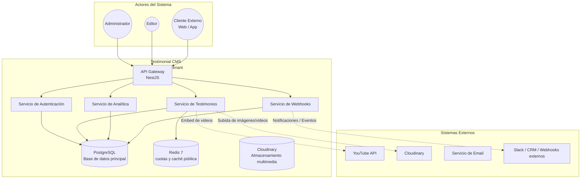
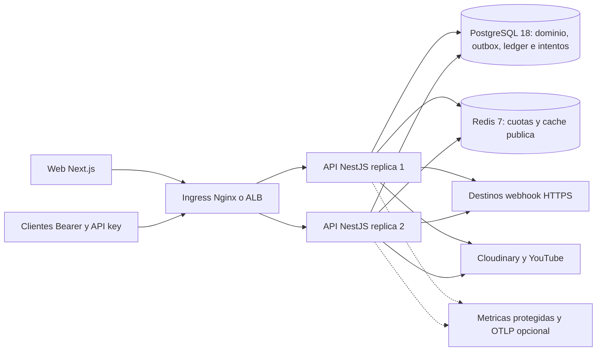
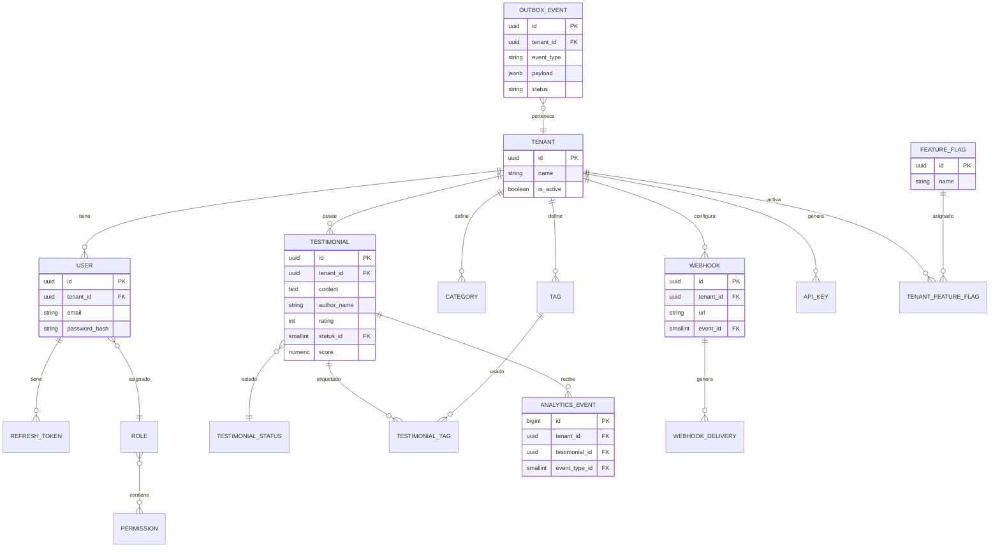

# Arquitectura Técnica

**Estado del código (2026-10-02):** La API usa PostgreSQL para el outbox, el ledger de entregas, los leases y los intentos. Cada réplica NestJS procesa por polling cada 3 s; Redis 7 se usa para cuotas atómicas y caché pública compartida. No hay BullMQ ni servicio worker separado. Hay instrumentación RED, métricas de outbox y trazas OTLP opcionales en el código; la infraestructura de alertas, staging y producción requiere verificación de despliegue. Los diagramas y ejemplos marcados como objetivo/histórico no representan el runtime actual.

## 1. Visión General (C4 Model - Level 1)

### 1.1. Diagrama de Contexto del Sistema


```mermaid
flowchart TD
    subgraph External_Systems["Sistemas Externos"]
        E1[YouTube API]
        E2[Cloudinary]
        E3[Servicio de Email]
        E4[Slack / CRM / Webhooks externos]
    end

    subgraph Users["Actores del Sistema"]
        U1((Administrador))
        U2((Editor))
        U3((Cliente Externo<br/>Web / App))
    end

    subgraph System["Testimonial CMS<br/>SaaS Multi‑tenant"]
        S1[API Gateway<br/>NestJS]
        S2[Servicio de Autenticación]
        S3[Servicio de Testimonios]
        S4[Servicio de Analítica]
        S5[Servicio de Webhooks]
        S6[(PostgreSQL<br/>Base de datos principal)]
        S7[(Redis 7<br/>cuotas y caché pública)]
        S8[(Cloudinary<br/>Almacenamiento multimedia)]
    end

    U1 --> S1
    U2 --> S1
    U3 --> S1

    S1 --> S2
    S1 --> S3
    S1 --> S4
    S1 --> S5

    S2 --> S6
    S3 --> S6
    S3 --> S7
    S4 --> S6
    S5 --> S6

    S3 -.->|Subida de imágenes/videos| E2
    S3 -.->|Embed de videos| E1
    S5 -.->|Notificaciones / Eventos| E4
```

### 1.2. Propósito y Alcance del Sistema

| Atributo | Valor |
|----------|-------|
| **Nombre del Sistema** | Testimonial CMS |
| **Tipo de Arquitectura** | Modular monolito con Arquitectura N-Tier (Capas estándar de NestJS) enfocada en simplicidad pragmática asíncrona, preparado para microservicios futuros |
| **Patrón de Comunicación** | REST síncrono + outbox transaccional procesado mediante polling PostgreSQL |
| **Usuarios Concurrentes Esperados** | 200+ (pico) / 50+ (promedio) por tenant |
| **Transacciones por Segundo (TPS)** | 50+ lectura / 10+ escritura |
| **Disponibilidad Objetivo (SLA)** | 99.9% (≤ 8.76h downtime/año) |
| **RTO (Recovery Time Objective)** | < 15 minutos |
| **RPO (Recovery Point Objective)** | < 5 minutos |

---

## 2. Decisiones Arquitectónicas Clave (ADR Summary)

### 2.1. Matriz de Decisiones

| Decisión | Alternativas Consideradas | Opción Seleccionada | Justificación | Impacto |
|----------|--------------------------|---------------------|---------------|---------|
| **Estilo Arquitectónico** | Monolito / Microservicios / Serverless | Modular monolito (NestJS) con capas claras y posible desacople futuro | Simplicidad inicial, pero con separación de dominios que permite escalar servicios de forma independiente si es necesario. | Menor complejidad operativa ahora, preparado para crecimiento. |
| **Framework Backend** | Express.js / Fastify / NestJS | NestJS | Provee arquitectura por defecto (módulos, controladores, servicios), inyección de dependencias y soporte nativo para los patrones que necesitamos (guards, interceptores, etc.). | Curva de aprendizaje, pero mejora mantenibilidad en equipo. |
| **Base de Datos** | PostgreSQL / MySQL / MongoDB | PostgreSQL 18 | Requerimos ACID, relaciones y consistencia fuerte para testimonios, analítica y eventos. Soporte JSONB para flexibilidad. | Integridad referencial garantizada. |
| **Cache y cuotas** | Redis / Memcached / in‑memory | Redis 7 compartido, TTL y claves versionadas por tenant | Comparte límites e invalidación entre réplicas. | Una mutación protegida responde 503 si no puede verificarse su cuota. |
| **Procesamiento asíncrono** | RabbitMQ / Kafka / AWS SQS / BullMQ / polling | Ledger y polling PostgreSQL dentro de la API | Mantiene evento, entregas e intentos durables en PostgreSQL. | El procesador comparte ciclo de vida con la API. |
| **API Design** | REST / GraphQL / gRPC | REST con OpenAPI | Simplicidad, madurez, herramientas de documentación y consumo universal. | Versionado y evolución controlada. |
| **Autenticación** | OAuth2 / JWT / Sesiones | JWT + Refresh Tokens (rotación y hashing) | Stateless, fácil de escalar, compatible con frontends modernos. Refresh tokens almacenados con hash para seguridad adicional. | Necesidad de revocación y rotación. |
| **Multi‑tenancy** | Base de datos separada / Schema por tenant / Fila por tenant | Fila por tenant (tenant_id en cada tabla) | Simplifica la administración y permite compartir recursos. Aislamiento lógico a nivel de aplicación. | Requiere cuidado en queries para no filtrar datos entre tenants. |
| **Event‑driven** | Polling / Event Sourcing / Outbox | Outbox transaccional y ledger con procesador en la API | Garantiza persistencia del evento y registra el resultado de cada destino. | Requiere leases, reintentos y operación de entregas `dead`. |
| **Feature Flags** | Configuración hardcodeada / DB / LaunchDarkly | Tabla `feature_flags` y `tenant_feature_flags` en DB | Control dinámico por tenant sin redeploy, preparado para A/B testing y despliegues graduales. | Impacto mínimo en complejidad. |
| **Analítica** | Almacenamiento en el mismo servicio / Servicio separado / Eventos en DB | Eventos en tabla `analytics_events` + procesamiento asíncrono | Simplicidad para MVP, permite reportes y cálculo de scoring con consultas SQL. | Puede convertirse en cuello de botella con muchos eventos; se migrará a sistema dedicado en el futuro. |

### 2.2. Trade-offs de la implementación actual

| Componente | Decisión | Consecuencia |
| --- | --- | --- |
| PostgreSQL | Estado de testimonios y outbox comparten transacción. | Si la base no está disponible, no se aceptan nuevas escrituras y readiness falla. |
| Redis | `CacheService` guarda respuestas públicas con TTL de 60 s y versión por tenant; cuotas usan contadores Lua con TTL. | Redis es necesario para verificar cuotas de mutaciones protegidas; una lectura puede volver a PostgreSQL si falla la caché. |
| Outbox por polling | `OutboxProcessor` reclama entregas con `SKIP LOCKED` y lease cada 3 s; la API guarda intentos y resultados terminales. | No requiere Redis para entregar webhooks; la concurrencia entre dos procesadores está cubierta por pruebas PostgreSQL descartables. |
| API NestJS | Controladores y procesador viven en el mismo servicio. | Su disponibilidad y la entrega de webhooks comparten ciclo de vida. |

---

## 3. Arquitectura de Alto Nivel (C4 Model - Level 2)

### 3.1. Diagrama de Contenedores

Este diagrama representa los componentes del código. Compose los ejecuta localmente; la topología AWS preparada aún requiere despliegue y verificación.


```mermaid
flowchart LR
    W[Web Next.js] --> E[Ingress Nginx o ALB]
    C[Clientes Bearer y API key] --> E
    E --> A[API NestJS replica 1]
    E --> B[API NestJS replica 2]
    A --> P[(PostgreSQL 18: dominio, outbox, ledger e intentos)]
    B --> P
    A --> R[(Redis 7: cuotas y cache publica)]
    B --> R
    A --> H[Destinos webhook HTTPS]
    B --> H
    A --> X[Cloudinary y YouTube]
    B --> X
    A -.-> O[Metricas protegidas y OTLP opcional]
    B -.-> O
```

### 3.2. Responsabilidades por Módulo/Servicio

| Módulo/Servicio | Responsabilidad Principal | Endpoints Clave | Escalabilidad | Persistencia |
|-----------------|---------------------------|-----------------|---------------|--------------|
| **Auth Module** | Registro, login, refresh tokens, gestión de roles y permisos | `/auth/login`, `/auth/refresh`, `/auth/logout`, `/users` | Horizontal (stateless) | PostgreSQL (users, refresh_tokens, roles, permissions) |
| **Testimonial Module** | CRUD de testimonios, moderación, asignación de tags/categorías, cálculo de scoring | `/testimonials`, `/testimonials/:id/moderate`, `/testimonials?sort=top` | Horizontal | PostgreSQL + Redis (caching de listas públicas) |
| **Analytics Module** | Recepción de vistas/clicks y reportes | `/analytics/events`, `/analytics/dashboard` | Horizontal | PostgreSQL (eventos), Redis para cuotas de ruta |
| **Webhook Module** | Registro de destinos, outbox, entregas e intentos | `/webhooks`, `/webhooks/:id/deliveries` | Poller dentro de cada réplica API | PostgreSQL (outbox, ledger, intentos); sin cola Redis |
| **Feature Flags Module** | Consulta y actualización de feature flags por tenant | `/flags`, `/flags/:name` | Horizontal | PostgreSQL (feature_flags, tenant_feature_flags) |
| **OutboxProcessor** | Reclama entregas con lease y las envía con concurrencia acotada | (no expone API propia) | Una instancia dentro de cada réplica API | PostgreSQL |

---

## 4. Patrones Arquitectónicos Aplicados

### 4.1. Arquitectura por Capas (N-Tier) de NestJS

**Propósito**: Organizar el código pragmáticamente reduciendo abstracciones teóricas innecesarias. Todas las divisiones giran en base a dominios (Módulos de NestJS) que contienen el flujo transversal: `Controllers -> Services -> Repositories`.

**Implementación** (NestJS en `apps/api/src/modules/`):

```typescript
// Estructura de un módulo (Ej. testimonials)
modules/
 └── testimonials/
      ├── controllers/         // Expone la capa HTTP hacia el exterior (REST)
      │    └── testimonials.controller.ts
      ├── services/            // Contiene la lógica de negocio pura
      │    └── testimonials.service.ts
      ├── repositories/        // Concentra las interacciones con la base de datos (Prisma)
      │    └── testimonial.repository.ts
      ├── dto/                 // Data Transfer Objects de entrada y salida
      │    └── testimonial.dto.ts
      └── entities/            // Declaración de Tipados anémicos y Vistas
           └── testimonial.model.ts
```

**Beneficios**:
- ✅ Flujo estándar y altamente asimilado por cualquier profesional de la comunidad NestJS.
- ✅ Elimina la disonancia cognitiva limitando los archivos excesivos y las sobre-capas sin función.
- ✅ Rapidez en el desarrollo para mantener al equipo focalizado en entregar valor de negocio.

**Trade-offs**:
- ⚠️ Cierto acoplamiento sutil permitido intencionalmente a herramientas nativas o a librerías principales de persistencia (como Prisma). No existe una coraza radical entre modelos.

### 4.2. Patrón: Repository Concreto

**Propósito**: Abstraer el acceso a la base de datos limitando la repetitividad de consultas y unificando el esquema Prisma de forma predecible sin interfaces genéricas tipo OOP (`IRepository`).

```typescript
// Implementación directa en módulo
@Injectable()
export class TestimonialsRepository {
  constructor(private readonly prisma: PrismaService) {}

  async findById(tenantId: string, id: string): Promise<TestimonialView | null> {
    return this.prisma.testimonial.findFirst({ where: { id, tenantId } });
  }

  async create(data: Prisma.TestimonialCreateInput): Promise<TestimonialView> {
    return this.prisma.testimonial.create({ data });
  }

  // ... otros métodos específicos al negocio
}
```

**Beneficios**:
- ✅ Velocidad al desarrollar funciones nativas inyectando directamente PrismaService.
- ✅ Simplifica la instrumentación del "Inversion Of Control (IoC)".
- ✅ Provee una capa clara en donde aglomerar "Queries complejas" aislandolas de los controladores y del negocio puro.

### 4.3. Patrón: Outbox (Transactional Outbox)

**Propósito**: Garantizar la publicación confiable de eventos de dominio y entregas HTTP sin perder datos aunque falle un destinatario.

**Implementación real**: `TestimonialRepository` y `OutboxService` escriben dominio, evento y entregas lógicas en una transacción PostgreSQL. `OutboxProcessor` consulta trabajos vencidos cada tres segundos, los reclama con `FOR UPDATE SKIP LOCKED` y lease, y registra cada intento antes de enviar. Ver [ADR 0002](../adr/0002-patron-outbox-para-eventos-y-webhooks.md) y [módulo de webhooks](../modules/api-webhooks.md).

**Beneficios**:
- ✅ Consistencia transaccional: evento y cambio de estado se guardan juntos o no se guarda ninguno.
- ✅ Tolerancia a fallos: los eventos fallidos se reintentan.
- ✅ Permite desacoplar el envío de la respuesta al usuario.

**Trade-offs**:
- ⚠️ Complejidad adicional (ledger, leases, tabla outbox y reintentos).
- ⚠️ Latencia entre la acción y el evento (puede ser de segundos, aceptable).

### 4.4. Patrón: Circuit Breaker (para llamadas externas)

**Propósito**: Evitar que fallos en servicios externos (Cloudinary, YouTube, webhooks) degraden el sistema principal.

**Implementación** (usando una librería o manual):

```typescript
@Injectable()
export class CloudinaryService {
  private circuitBreaker = new CircuitBreaker({
    failureThreshold: 3,
    resetTimeout: 30000
  });

  async uploadImage(file: Buffer): Promise<string> {
    return this.circuitBreaker.call(async () => {
      // Llamada a Cloudinary
    });
  }
}
```

**Beneficios**:
- ✅ Fallo rápido si el servicio externo está caído.
- ✅ Evita timeouts largos y agotamiento de recursos.
- ✅ Se recupera automáticamente cuando el servicio vuelve.

### 4.5. Patrón: Idempotency (para webhooks y API)

**Propósito**: Evitar duplicados en endpoints que pueden ser llamados múltiples veces (por ejemplo, webhooks con reintentos).

**Implementación**:

```typescript
@Post()
async createTestimonial(@Body() dto: CreateTestimonialDto, @Headers('Idempotency-Key') key: string) {
  if (key) {
    const existing = await this.idempotencyService.get(key);
    if (existing) return existing.response;
  }

  const result = await this.testimonialsService.create(dto);

  if (key) {
    await this.idempotencyService.save(key, result);
  }

  return result;
}
```

**Beneficios**:
- ✅ Seguridad en reintentos.
- ✅ Compatible con webhooks y API pública.

---

## 5. Stack Tecnológico

### 5.1. Matriz de Tecnologías

La matriz siguiente separa el software implementado de las topologías históricas/objetivo con BullMQ o Kubernetes que aparecen en otras secciones.

| Capa/Componente | Tecnología | Versión | Justificación | Alternativas Descartadas |
|-----------------|------------|---------|---------------|--------------------------|
| **Runtime** | Node.js | 24.21.0 LTS | Amplia adopción, ecosistema maduro, async/await nativo | Python, Go, Java |
| **Framework Backend** | NestJS | 11.2.x | DI y módulos por dominio | Express, Fastify |
| **Base de Datos** | PostgreSQL | 18 | ACID, JSONB y outbox transaccional | MySQL, MongoDB |
| **ORM** | Prisma | 6.5.0 | Acceso tipado y migraciones | TypeORM, Sequelize |
| **Caché y cuotas** | Redis 7 | TTL de 60 s para caché | Datos públicos y límites compartidos entre réplicas | Caché local descartada |
| **Outbox** | `OutboxProcessor` en NestJS + ledger PostgreSQL | polling de 3 s | Leases, intentos y reintentos durables | BullMQ fuera del flujo actual |
| **API Specification** | Swagger/OpenAPI | `@nestjs/swagger` 11.4.x | Documentación de endpoints | GraphQL |
| **Frontend Framework** | Next.js 15 (App Router) + React 18 | 15.5.x / 18.3.x | SSR/CSR según necesidad, routing automático, buen rendimiento | React puro (más configuración), Vue (menor ecosistema) |
| **Frontend Language** | TypeScript | 5.x | Type safety, mejor mantenimiento, compartir tipos con backend | JavaScript |
| **Styling** | Tailwind CSS | 3.x | Utility‑first, consistencia, rápido desarrollo | CSS Modules, SASS (más manual) |
| **Testing Backend** | Jest | 30.2.0 | Pruebas unitarias e integración PostgreSQL | Mocha, Vitest |
| **Testing Frontend** | Vitest + React Testing Library | 3.2.7 | Pruebas de componentes y adaptadores | Playwright aún no implementado |
| **CI/CD** | GitHub Actions | - | Suite completa para ambas apps | GitLab CI, CircleCI |
| **Containerization** | Docker | 24.x | Portabilidad, desarrollo y producción consistentes | Podman, containerd |
| **Orchestration** | Docker Compose local / Terraform AWS ECS preparado | - | Despliegue gradual pendiente de evidencia de staging y producción | Kubernetes fuera del flujo actual |
| **Monitoring** | Exposición Prometheus protegida, OTLP opcional | - | Instrumentación RED, lag y outbox en API; backend de recolección pendiente de despliegue | ELK, Datadog |
| **Logging** | Pino JSON estructurado | - | Correlación por request y trace ID | Winston histórico |

---

## 6. Modelo de Datos Conceptual

El modelo de datos detallado se encuentra en el archivo `diccionario_de_datos.md` y en el script `init.sql`. A continuación se muestra un diagrama resumido de las entidades principales y sus relaciones.

### 6.1. Diagrama Entidad-Relación (ERD)


```mermaid
erDiagram
    TENANT ||--o{ USER : "tiene"
    TENANT ||--o{ TESTIMONIAL : "posee"
    TENANT ||--o{ CATEGORY : "define"
    TENANT ||--o{ TAG : "define"
    TENANT ||--o{ WEBHOOK : "configura"
    TENANT ||--o{ API_KEY : "genera"
    TENANT ||--o{ TENANT_FEATURE_FLAG : "activa"

    USER ||--o{ REFRESH_TOKEN : "tiene"
    USER }o--|| ROLE : "asignado"
    ROLE }o--o{ PERMISSION : "contiene"

    TESTIMONIAL }o--|| TESTIMONIAL_STATUS : "estado"
    TESTIMONIAL ||--o{ TESTIMONIAL_TAG : "etiquetado"
    TESTIMONIAL ||--o{ ANALYTICS_EVENT : "recibe"

    TAG ||--o{ TESTIMONIAL_TAG : "usado"

    WEBHOOK ||--o{ WEBHOOK_DELIVERY : "genera"

    OUTBOX_EVENT }o--|| TENANT : "pertenece"

    FEATURE_FLAG ||--o{ TENANT_FEATURE_FLAG : "asignado"

    TENANT {
        uuid id PK
        string name
        boolean is_active
    }

    USER {
        uuid id PK
        uuid tenant_id FK
        string email
        string password_hash
    }

    TESTIMONIAL {
        uuid id PK
        uuid tenant_id FK
        text content
        string author_name
        int rating
        smallint status_id FK
        numeric score
    }

    ANALYTICS_EVENT {
        bigint id PK
        uuid tenant_id FK
        uuid testimonial_id FK
        smallint event_type_id FK
    }

    WEBHOOK {
        uuid id PK
        uuid tenant_id FK
        string url
        smallint event_id FK
    }

    FEATURE_FLAG {
        uuid id PK
        string name
    }

    OUTBOX_EVENT {
        uuid id PK
        uuid tenant_id FK
        string event_type
        jsonb payload
        string status
    }
```

### 6.2. Principales Políticas de Integridad

| Relación | Política ON DELETE | Justificación |
|----------|-------------------|---------------|
| `users.tenant_id -> tenants.id` | RESTRICT | No se puede eliminar un tenant con usuarios activos. |
| `testimonials.tenant_id -> tenants.id` | RESTRICT | Los testimonios deben conservarse aunque el tenant se desactive (soft delete). |
| `testimonials.status_id -> testimonial_status.id` | RESTRICT | Los estados son catálogos fijos. |
| `analytics_events.testimonial_id -> testimonials.id` | CASCADE | Si se elimina un testimonio, sus eventos ya no son necesarios. |
| `webhook_deliveries.webhook_id -> webhooks.id` | CASCADE | Las entregas dependen del webhook. |
| `user_roles.user_id -> users.id` | CASCADE | Al eliminar usuario, se eliminan sus asignaciones de roles. |

---

## 7. Principios de Diseño y Buenas Prácticas

### 7.1. Principios SOLID

| Principio | Aplicación en el Proyecto | Ejemplo de Código |
|-----------|--------------------------|-------------------|
| **S**RP (Single Responsibility) | Cada módulo tiene una responsabilidad única (testimonios, auth, analytics, webhooks). | `TestimonialController` solo maneja peticiones HTTP de testimonios, no de usuarios. |
| **O**CP (Open/Closed) | Las entidades de dominio están abiertas a extensión (nuevos estados, tipos de evento) pero cerradas a modificación. | Se pueden añadir nuevos `event_type` sin cambiar código existente, solo insertando en catálogo. |
| **L**SP (Liskov Substitution) | Las implementaciones concretas de repositorios pueden sustituir a sus interfaces sin alterar el programa. | `PrismaTestimonialRepository` puede reemplazarse por `InMemoryTestimonialRepository` en pruebas. |
| **I**SP (Interface Segregation) | Interfaces específicas para cada necesidad: `ITestimonialRepository`, `IAnalyticsEventRepository`, no una interfaz gigante. | Los casos de uso solo dependen de las interfaces que realmente necesitan. |
| **D**IP (Dependency Inversion) | Las capas superiores (casos de uso) dependen de abstracciones, no de implementaciones concretas. | `PublishTestimonialUseCase` recibe `ITestimonialRepository` en su constructor, no una instancia de Prisma. |

### 7.2. Otros Principios

- **DRY (Don’t Repeat Yourself)**: La lógica de validación, transformación y reglas de negocio se centraliza en la capa de dominio o en casos de uso compartidos.
- **KISS (Keep It Simple, Stupid)**: Se prioriza la simplicidad sobre patrones innecesarios; se aplican solo donde aportan valor.
- **Fail Fast**: Las validaciones de entrada se realizan en el controlador mediante DTOs y ValidationPipe, antes de invocar casos de uso.
- **Defense in Depth**: Múltiples capas de seguridad: autenticación JWT, guards por roles, validación de tenant en cada query, rate limiting.
- **Observability First**: Logging estructurado, métricas de negocio y técnicas desde el inicio.

---

## 8. Estrategia de Seguridad

### 8.1. Capas de Seguridad

```mermaid
flowchart TD
    subgraph Perimeter["Perímetro"]
        P1[Rate Limiting<br/>por IP / API Key]
        P2[DDoS Protection<br/>Cloudflare]
    end

    subgraph Application["Aplicación"]
        A1[Autenticación JWT<br/> + Refresh Tokens]
        A2[Guards por Roles<br/>(RBAC)]
        A3[Validación de tenant<br/> en cada query]
        A4[Input Validation<br/>class-validator + DTOs]
        A5[SQL Injection Protection<br/>Prisma ORM]
        A6[XSS Protection<br/>Helmet + sanitización]
    end

    subgraph Data["Datos"]
        D1[Encryption at Rest<br/>PostgreSQL TDE]
        D2[Encryption in Transit<br/>TLS 1.3]
        D3[Hashing de passwords<br/>bcrypt]
        D4[Hashing de refresh tokens<br/> y API keys]
    end

    P1 --> A1
    A1 --> A2
    A2 --> A3
    A3 --> A4
    A4 --> D1
```

### 8.2. OWASP Top 10 Mitigaciones

| Vulnerabilidad | Mitigación Implementada |
|----------------|-------------------------|
| **A01: Broken Access Control** | RBAC estricto + middleware que verifica tenant_id en cada operación. |
| **A02: Cryptographic Failures** | Argon2id para contraseñas nuevas; verificación transitoria de scrypt; HMAC con pepper para claves nuevas y secretos de webhook cifrados. |
| **A03: Injection** | Prisma usa queries parametrizadas; validación de entrada con DTOs. |
| **A04: Insecure Design** | Threat modeling ligero al diseñar features; revisiones de código. |
| **A05: Security Misconfiguration** | Configuración centralizada con validación de variables de entorno. |
| **A06: Vulnerable Components** | `npm audit`, Dependency Review y escaneo de secretos en CI. |
| **A07: Identification & Auth Failures** | JWT con expiración corta (15 min), refresh tokens con rotación y revocación. |
| **A08: Software/Data Integrity** | Firma de webhooks con HMAC; idempotencia en endpoints clave. |
| **A09: Security Logging** | Pino estructurado con redacción de credenciales; retención en CloudWatch preparada en Terraform. |
| **A10: SSRF** | HTTPS para destinos nuevos, DNS A/AAAA validado en cada conexión, IP fijada, sin redirecciones ni proxies implícitos y ACL de egreso preparada. |

---

## 9. Estrategia de Rendimiento

### 9.1. Optimizaciones por Capa

| Capa | Técnica | Beneficio Esperado | Métrica Objetivo |
|------|---------|-------------------|------------------|
| **CDN** | Caching de assets estáticos y embed script | -80% tiempo de carga inicial | LCP < 1.5s |
| **API Gateway** | Compresión gzip, caché de respuestas públicas | -50% latencia en lecturas frecuentes | p95 < 150ms |
| **Aplicación** | Caching en Redis de listas de testimonios públicos | -90% hits a base de datos | Cache hit rate > 80% |
| **Base de Datos** | Índices adecuados (tenant_id, status, score) | -95% tiempo de queries complejas | Query time < 50ms |
| **OutboxProcessor** | Entrega HTTP fuera de la petición y con concurrencia acotada | La respuesta de publicación no espera al destinatario | Antigüedad de pendiente < 300 s |

### 9.2. Caché pública implementada

`CacheService` guarda respuestas públicas en Redis durante 60 s, con límite de 256 KiB por valor. La clave incluye una versión del tenant que se incrementa al publicar. Un lock evita el recálculo simultáneo entre réplicas. Si Redis falla en una lectura, la API consulta PostgreSQL; las mutaciones con cuota protegida fallan cerradas si el contador no puede verificarse. Ver [operación de Redis](../operations/10_redis_quotas_cache.md).

---

## 10. Estrategia de Escalabilidad

| Componente | Estrategia | Métrica de Trigger | Herramienta |
|------------|------------|-------------------|-------------|
| **API (NestJS)** | Horizontal con varias tareas ECS preparadas | CPU/latencia y antigüedad del outbox observadas | ECS autoscaling en Terraform |
| **Base de Datos** | Vertical + read replicas para consultas de analítica | CPU > 80% o conexiones > 100 | RDS / PostgreSQL streaming replication |
| **Redis** | ElastiCache privado preparado, con réplica en producción | Memoria/evictions y disponibilidad | ElastiCache Redis OSS 7 |
| **Entrega webhook** | Poller en cada réplica API, reclamación `SKIP LOCKED` | Pendiente > 300 s, `dead` > 0 | PostgreSQL y alarmas CloudWatch preparadas |

---

## 11. Consideraciones de Resiliencia

### 11.1. Patrones de Resiliencia Implementados

| Patrón | Propósito | Implementación |
|--------|-----------|----------------|
| **Retry con Exponential Backoff** | Reintentar fallos transitorios de webhooks y proveedores externos | Ledger PostgreSQL con full jitter para webhooks; transporte HTTP acotado para proveedores |
| **Circuit Breaker** | Evitar cascadas de fallos en Cloudinary/YouTube | Circuito simple en `HttpResilienceService` |
| **Concurrencia acotada** | Evitar saturación por destinos lentos | Máximo cinco entregas simultáneas por réplica API |
| **Timeout** | Evitar bloqueos indefinidos | Timeout de 5s en llamadas a servicios externos |
| **Fallback** | Mantener lecturas públicas si Redis no está disponible | Consultar PostgreSQL; no servir datos expirados tras una mutación crítica |
| **Health Checks** | Detectar fallos proactivamente | Liveness sin base y readiness con Prisma |
| **Graceful Degradation** | Mantener funcionalidad crítica bajo fallos | Si el módulo de analytics falla, el dashboard muestra un mensaje pero el CRUD de testimonios sigue funcionando |

### 11.2. Estrategia de Backup y Recovery

| Componente | Frecuencia | Retención | Método | RTO | RPO |
|------------|------------|-----------|--------|-----|-----|
| **Base de Datos** | Diario + WAL continuo | 30 días | pg_dump + archivo WAL (Point‑in‑time recovery) | < 15 min | < 5 min |
| **Archivos (Cloudinary)** | No aplica (gestión externa) | - | Depende de Cloudinary | - | - |
| **Configuración** | Con cada cambio | Indefinido | Git + Terraform | < 30 min | 0 |

---

## 12. Estructura del Proyecto

```bash
testimonial-cms/
├── apps/
│   ├── api/src/modules/                 # NestJS: módulos y APIs públicas index.ts
│   └── web/src/
│       ├── app/                         # Next.js: routing y composición
│       └── features/                    # Pantallas activas y adaptadores API por feature
├── docs/
├── infra/
├── scripts/
├── docker-compose.yml
├── package-lock.json
└── README.md
```

Los módulos de API que comparten proveedores publican solo los necesarios mediante `index.ts`; sus repositorios y servicios internos no se importan desde otros módulos. `AnalyticsService` expone métricas al módulo de testimonios y comprueba la publicación de un testimonio dentro de su propio repositorio. ESLint rechaza imports a implementaciones privadas y entre `apps/api` y `apps/web`.

En la API, repositorios y lógica de aplicación usan errores internos tipados; `ApiExceptionFilter` los traduce a Problem Details. Prisma queda en repositorios, salvo el indicador de salud que consulta la base para readiness. Los guards verifican credenciales mediante `CredentialRepository` y la idempotencia se persiste mediante `IdempotencyRepository`. Los casos de uso de creación y transición de testimonios coordinan reglas, escritura condicional y outbox; el repositorio ejecuta la transacción. `RequestContextMiddleware` inicia un contexto `AsyncLocalStorage` con identificadores de solicitud y correlación; los guards asignan el tenant al contexto únicamente tras verificar JWT o API key. ESLint impide excepciones HTTP en lógica y repositorios, acceso directo a Prisma desde aplicación y guards, y dependencias de NestJS o Prisma en entidades de dominio.

En web, `app/` compone las rutas activas de administración, autenticación y captura/listado público. Sus pantallas y lógica viven en `features/`. Cada feature mantiene un adaptador que invoca el cliente HTTP o `useSession().fetchApi` y valida la carga útil con Zod antes de entregarla a la UI. Las rutas preparatorias sin lógica siguen siendo páginas simples de `app/`. El lint impide llamadas `fetch` directas desde páginas y pantallas.

---

## 13. API Design Guidelines

### 13.1. Convenciones de Nomenclatura

| Elemento | Convención | Ejemplo |
|----------|------------|---------|
| **Endpoints** | Plural, kebab‑case, versionado en URL | `/api/v1/testimonials` |
| **Query Parameters** | camelCase | `?page=1&pageSize=20&sortBy=score` |
| **Path Parameters** | snake_case | `/testimonials/{testimonial_id}` |
| **Request Body** | camelCase | `{ "authorName": "Juan", "content": "..." }` |
| **Response Body** | camelCase | `{ "testimonialId": "uuid", "createdAt": "..." }` |
| **HTTP Methods** | RESTful | GET (read), POST (create), PATCH (update parcial), DELETE |
| **HTTP Status Codes** | Semánticos | 200, 201, 400, 401, 403, 404, 409, 422, 500 |

### 13.2. Versionado de API

**Estrategia**: Versionado en URL path (`/api/v1/...`). Se mantendrá la versión anterior durante al menos 6 meses después de lanzar una nueva versión.

### 13.3. Manejo de Errores

```typescript
// Estructura estándar de error
interface ErrorResponse {
  error: {
    code: string;          // Código único (ej: "TESTIMONIAL_NOT_FOUND")
    message: string;       // Mensaje técnico
    userMessage?: string;  // Mensaje amigable (opcional)
    details?: any;         // Detalles adicionales (validación, etc.)
    timestamp: string;     // ISO 8601
    path: string;
  };
}

// Ejemplo
{
  "error": {
    "code": "VALIDATION_ERROR",
    "message": "Rating must be between 1 and 5",
    "details": { "field": "rating", "value": 6 },
    "timestamp": "YYYY-MM-DDT12:00:00Z",
    "path": "/api/v1/testimonials"
  }
}
```

---

## 14. Checklist de Calidad para Arquitectura

### ✅ Decisiones y Trade-offs
- [x] Cada decisión arquitectónica tiene alternativas consideradas documentadas.
- [x] Los trade-offs están explícitos y justificados (sección 2).
- [x] El análisis CAP está documentado para componentes críticos.

### ✅ Patrones y Principios
- [x] Los patrones aplicados (Clean Architecture, Repository, Outbox, Circuit Breaker, Idempotency) resuelven problemas reales del dominio.
- [x] Los principios SOLID, DRY, KISS están aplicados consistentemente.
- [x] La arquitectura es extensible sin cambios disruptivos.

### ✅ Escalabilidad y Rendimiento
- [x] La estrategia de escalado horizontal está definida.
- [x] La caché pública compartida con TTL y versión por tenant está documentada.
- [x] Las métricas de rendimiento objetivo están definidas.

### ✅ Resiliencia y Seguridad
- [x] Patrones de resiliencia (retry, circuit breaker, outbox) implementados.
- [ ] RTO/RPO requieren simulacro y evidencia del entorno desplegado.
- [x] Mitigaciones OWASP Top 10 documentadas.
- [x] Defensa en profundidad en múltiples capas.

### ✅ Observabilidad
- [x] Métricas RED, lag y estado del outbox instrumentadas en la API.
- [x] Logging estructurado con Pino y correlación de solicitud/trace ID.
- [ ] Exportación OTLP y alertas requieren prueba en staging/producción.

### ✅ Documentación y Código
- [x] El diagrama de contenedores refleja PostgreSQL para entregas y Redis para cuotas/caché.
- [x] Estructura del proyecto sigue los principios documentados.
- [x] APIs especificadas en OpenAPI (se generará automáticamente con NestJS Swagger).

---

> **Nota final**: Este documento es un artefacto vivo. Se revisará trimestralmente y se actualizará cuando se tomen nuevas decisiones arquitectónicas significativas. Los cambios se registrarán como ADRs en la carpeta `docs/adr/`.
