# Catálogo de Patrones de Diseño

## 1. Convenciones del Documento

### 1.1. Formato de Cada Patrón

Cada patrón sigue esta estructura:

- **Propósito**: Una oración clara.
- **Diagrama**: Diagrama de clases en Mermaid.
- **Implementación**: Código real del proyecto (TypeScript, NestJS).
- **Cuándo usar**: Casos de uso donde el patrón es aplicable.
- **Cuándo evitar**: Situaciones donde no conviene aplicarlo.
- **Enlace al código**: Ruta al archivo fuente (placeholder).

### 1.2. Categorías de Patrones

| Categoría | Propósito | Patrones Comunes |
|-----------|-----------|------------------|
| **Creacionales** | Cómo crear objetos | Factory, Builder, Singleton |
| **Estructurales** | Cómo componer objetos | Adapter, Decorator, Repository |
| **Comportamiento** | Cómo delegar responsabilidad | Observer, Strategy, Idempotency |
| **Arquitectónicos** | Estructura de alto nivel | Outbox, Feature Flag, Unit of Work |

---

## 2. Patrones Creacionales

### 🔴 **Creacional - Factory Method**

**Propósito**: Definir una interfaz para crear objetos, pero dejar que las subclases decidan qué clase instanciar. Permite a una clase delegar la instanciación a subclases.

**Diagrama**:

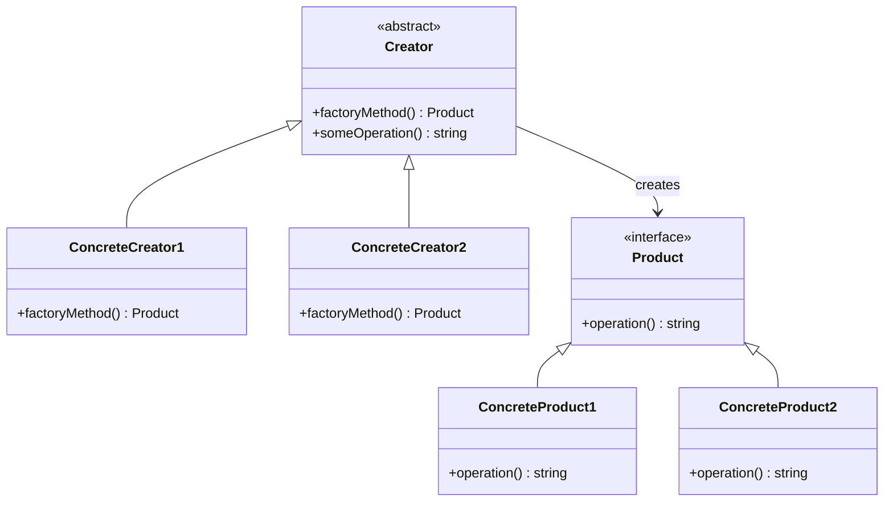

**Implementación en Testimonial CMS**:

```typescript
// src/domain/testimonials/factories/testimonial.factory.ts

export interface Testimonial {
  id: string;
  tenantId: string;
  content: string;
  authorName: string;
  rating: number;
  mediaUrl?: string;
  mediaType?: 'image' | 'video';
  status: 'draft' | 'pending' | 'approved' | 'published' | 'rejected';
  createdAt: Date;
}

export interface TestimonialCreationData {
  tenantId: string;
  content: string;
  authorName: string;
  rating: number;
  mediaUrl?: string;
  mediaType?: 'image' | 'video';
}

export interface TestimonialFactory {
  create(data: TestimonialCreationData): Testimonial;
  validate(data: TestimonialCreationData): boolean;
}

export class TextTestimonialFactory implements TestimonialFactory {
  create(data: TestimonialCreationData): Testimonial {
    return {
      id: this.generateId(),
      tenantId: data.tenantId,
      content: data.content,
      authorName: data.authorName,
      rating: data.rating,
      status: 'draft',
      createdAt: new Date()
    };
  }

  validate(data: TestimonialCreationData): boolean {
    return data.content.length >= 10 && data.rating >= 1 && data.rating <= 5;
  }

  private generateId(): string {
    return `txt_${Date.now()}_${Math.random().toString(36).substr(2, 9)}`;
  }
}

export class VideoTestimonialFactory implements TestimonialFactory {
  create(data: TestimonialCreationData): Testimonial {
    return {
      id: this.generateId(),
      tenantId: data.tenantId,
      content: data.content,
      authorName: data.authorName,
      rating: data.rating,
      mediaUrl: data.mediaUrl,
      mediaType: 'video',
      status: 'pending', // videos require moderation
      createdAt: new Date()
    };
  }

  validate(data: TestimonialCreationData): boolean {
    return !!data.mediaUrl && data.content.length >= 5;
  }

  private generateId(): string {
    return `vid_${Date.now()}_${Math.random().toString(36).substr(2, 9)}`;
  }
}

export class TestimonialFactoryRegistry {
  private factories = new Map<string, TestimonialFactory>();

  constructor() {
    this.factories.set('text', new TextTestimonialFactory());
    this.factories.set('video', new VideoTestimonialFactory());
  }

  getFactory(type: 'text' | 'video'): TestimonialFactory {
    const factory = this.factories.get(type);
    if (!factory) throw new Error(`No factory for type: ${type}`);
    return factory;
  }

  createTestimonial(type: 'text' | 'video', data: TestimonialCreationData): Testimonial {
    const factory = this.getFactory(type);
    if (!factory.validate(data)) {
      throw new Error('Invalid testimonial data');
    }
    return factory.create(data);
  }
}

// Uso en el servicio
@Injectable()
export class TestimonialService {
  private factoryRegistry = new TestimonialFactoryRegistry();

  async createTestimonial(
    type: 'text' | 'video',
    data: TestimonialCreationData
  ): Promise<Testimonial> {
    const testimonial = this.factoryRegistry.createTestimonial(type, data);
    return await this.repository.save(testimonial);
  }
}
```

**Cuándo usar**:
- ✅ Cuando el sistema necesita crear diferentes variantes de un objeto (testimonios de texto vs. video).
- ✅ Cuando la lógica de creación varía según el tipo.
- ✅ Para añadir nuevos tipos sin modificar el código existente.

**Cuándo evitar**:
- ❌ Si solo hay un tipo de testimonio.
- ❌ Cuando la creación es trivial.

**Enlace al código**: [`src/domain/testimonials/factories/testimonial.factory.ts`](../../src/domain/testimonials/factories/testimonial.factory.ts)

---

### 🔴 **Creacional - Builder**

**Propósito**: Separar la construcción de un objeto complejo de su representación, permitiendo que el mismo proceso construya diferentes representaciones.

**Diagrama**:

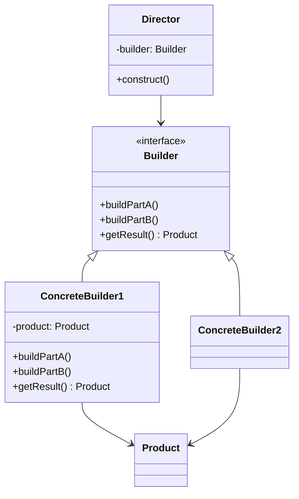

**Implementación en Testimonial CMS**:

```typescript
// src/domain/testimonials/builders/testimonial-report.builder.ts

export interface TestimonialReport {
  header: {
    tenantName: string;
    generatedAt: Date;
    period: string;
  };
  summary: {
    total: number;
    averageRating: number;
    publishedCount: number;
  };
  topTestimonials: Array<{
    content: string;
    author: string;
    rating: number;
    score: number;
  }>;
  chartData?: any;
  footer?: string;
}

export interface ReportBuilder {
  setHeader(tenantName: string, period: string): this;
  setSummary(stats: any): this;
  addTopTestimonials(list: any[]): this;
  addChart(chart: any): this;
  setFooter(text: string): this;
  build(): TestimonialReport;
}

export class PdfReportBuilder implements ReportBuilder {
  private report: Partial<TestimonialReport> = {};

  setHeader(tenantName: string, period: string): this {
    this.report.header = {
      tenantName,
      generatedAt: new Date(),
      period
    };
    return this;
  }

  setSummary(stats: any): this {
    this.report.summary = stats;
    return this;
  }

  addTopTestimonials(list: any[]): this {
    this.report.topTestimonials = list;
    return this;
  }

  addChart(chart: any): this {
    this.report.chartData = chart;
    return this;
  }

  setFooter(text: string): this {
    this.report.footer = text;
    return this;
  }

  build(): TestimonialReport {
    if (!this.report.header || !this.report.summary) {
      throw new Error('Header and summary are required');
    }
    return this.report as TestimonialReport;
  }
}

export class JsonReportBuilder implements ReportBuilder {
  private report: Partial<TestimonialReport> = {};

  setHeader(tenantName: string, period: string): this {
    this.report.header = { tenantName, generatedAt: new Date(), period };
    return this;
  }

  setSummary(stats: any): this {
    this.report.summary = stats;
    return this;
  }

  addTopTestimonials(list: any[]): this {
    this.report.topTestimonials = list;
    return this;
  }

  addChart(chart: any): this {
    this.report.chartData = chart;
    return this;
  }

  setFooter(text: string): this {
    this.report.footer = text;
    return this;
  }

  build(): TestimonialReport {
    return this.report as TestimonialReport;
  }
}

export class ReportDirector {
  constructor(private builder: ReportBuilder) {}

  buildFullReport(tenantName: string, period: string, stats: any, topList: any[]): TestimonialReport {
    return this.builder
      .setHeader(tenantName, period)
      .setSummary(stats)
      .addTopTestimonials(topList)
      .addChart({ type: 'bar', data: [/* ... */] })
      .setFooter('Confidential')
      .build();
  }

  buildMinimalReport(tenantName: string, period: string, stats: any): TestimonialReport {
    return this.builder
      .setHeader(tenantName, period)
      .setSummary(stats)
      .build();
  }
}

// Uso
const builder = new PdfReportBuilder();
const director = new ReportDirector(builder);
const report = director.buildFullReport('Acme Inc', 'March YYYY', stats, topTestimonials);
```

**Cuándo usar**:
- ✅ Para construir objetos con muchas partes opcionales (reportes).
- ✅ Cuando se desea construir diferentes representaciones del mismo proceso.

**Cuándo evitar**:
- ❌ Para objetos simples con pocos campos.

**Enlace al código**: [`src/domain/testimonials/builders/testimonial-report.builder.ts`](../../src/domain/testimonials/builders/testimonial-report.builder.ts)

---

### 🔴 **Creacional - Singleton**

**Propósito**: Garantizar que una clase tenga una única instancia y proporcionar un punto de acceso global a ella.

**Diagrama**:

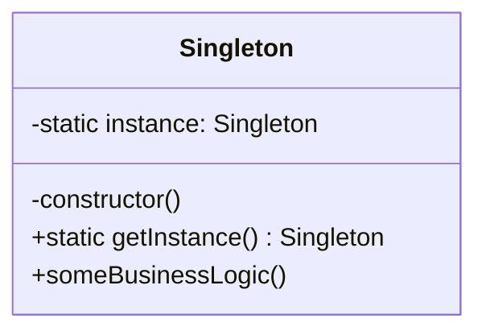

**Implementación en Testimonial CMS** (Logger):

```typescript
// src/infrastructure/logging/logger.ts

export enum LogLevel {
  DEBUG = 0,
  INFO = 1,
  WARN = 2,
  ERROR = 3
}

export class Logger {
  private static instance: Logger;
  private level: LogLevel = LogLevel.INFO;

  private constructor() {}

  static getInstance(): Logger {
    if (!Logger.instance) {
      Logger.instance = new Logger();
    }
    return Logger.instance;
  }

  setLevel(level: LogLevel): void {
    this.level = level;
  }

  debug(message: string, context?: any): void {
    if (this.level <= LogLevel.DEBUG) {
      console.log(`[DEBUG] ${message}`, context);
    }
  }

  info(message: string, context?: any): void {
    if (this.level <= LogLevel.INFO) {
      console.log(`[INFO] ${message}`, context);
    }
  }

  warn(message: string, context?: any): void {
    if (this.level <= LogLevel.WARN) {
      console.warn(`[WARN] ${message}`, context);
    }
  }

  error(message: string, error?: Error, context?: any): void {
    if (this.level <= LogLevel.ERROR) {
      console.error(`[ERROR] ${message}`, error, context);
    }
  }
}

// Uso en cualquier parte
const logger = Logger.getInstance();
logger.info('Testimonial created', { id: '123' });
```

**Cuándo usar**:
- ✅ Para servicios que deben tener una única instancia global (logger, configuración, pool de conexiones).
- ✅ Cuando el objeto es costoso de crear y debe reutilizarse.

**Cuándo evitar**:
- ❌ Para objetos con estado mutable compartido (puede causar efectos laterales no deseados).
- ❌ En aplicaciones que requieren alta testabilidad (preferir inyección de dependencias).

**Enlace al código**: [`src/infrastructure/logging/logger.ts`](../../src/infrastructure/logging/logger.ts)

---

## 3. Patrones Estructurales

### 🔴 **Estructural - Adapter**

**Propósito**: Convertir la interfaz de una clase en otra interfaz que los clientes esperan. Permite que clases con interfaces incompatibles trabajen juntas.

**Diagrama**:

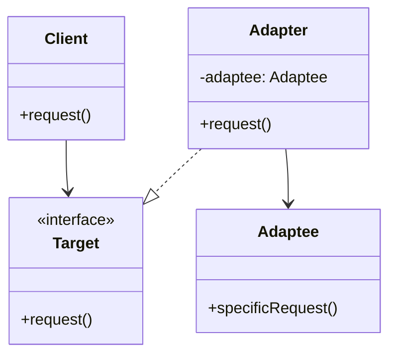

**Implementación en Testimonial CMS** (Integración con YouTube):

```typescript
// src/infrastructure/external/adapters/youtube.adapter.ts

// Target interface (lo que espera nuestro sistema)
export interface VideoProvider {
  getVideoMetadata(url: string): Promise<{ title: string; thumbnail: string; duration: number }>;
  embedUrl(videoId: string): string;
}

// Adaptee (API de YouTube)
export class YouTubeAPI {
  async fetchVideoInfo(videoId: string): Promise<any> {
    const response = await fetch(`https://www.googleapis.com/youtube/v3/videos?id=${videoId}&key=${process.env.YOUTUBE_API_KEY}`);
    return response.json();
  }

  getEmbedUrl(videoId: string): string {
    return `https://www.youtube.com/embed/${videoId}`;
  }
}

// Adapter
export class YouTubeAdapter implements VideoProvider {
  constructor(private youtube: YouTubeAPI) {}

  async getVideoMetadata(url: string): Promise<{ title: string; thumbnail: string; duration: number }> {
    const videoId = this.extractVideoId(url);
    const data = await this.youtube.fetchVideoInfo(videoId);
    const item = data.items[0];
    return {
      title: item.snippet.title,
      thumbnail: item.snippet.thumbnails.high.url,
      duration: parseInt(item.contentDetails.duration.replace(/[^0-9]/g, ''))
    };
  }

  embedUrl(videoId: string): string {
    return this.youtube.getEmbedUrl(videoId);
  }

  private extractVideoId(url: string): string {
    const regex = /(?:youtube\.com\/(?:[^\/]+\/.+\/|(?:v|e(?:mbed)?)\/|.*[?&]v=)|youtu\.be\/)([^"&?\/\s]{11})/;
    const match = url.match(regex);
    if (!match) throw new Error('Invalid YouTube URL');
    return match[1];
  }
}

// Uso en el servicio de testimonios
@Injectable()
export class TestimonialService {
  constructor(private videoProvider: VideoProvider) {}

  async addVideoTestimonial(url: string, author: string): Promise<Testimonial> {
    const metadata = await this.videoProvider.getVideoMetadata(url);
    // ... crear testimonio con metadata
  }
}
```

**Cuándo usar**:
- ✅ Para integrar servicios externos con APIs diferentes (YouTube, Cloudinary, etc.).
- ✅ Para crear una interfaz uniforme sobre múltiples implementaciones.

**Cuándo evitar**:
- ❌ Cuando la API externa ya coincide con la interfaz esperada.
- ❌ Si solo se usa un proveedor y no se anticipan cambios.

**Enlace al código**: [`src/infrastructure/external/adapters/youtube.adapter.ts`](../../src/infrastructure/external/adapters/youtube.adapter.ts)

---

### 🔴 **Estructural - Decorator**

**Propósito**: Añadir responsabilidades adicionales a un objeto dinámicamente. Proporciona una alternativa flexible a la herencia para extender funcionalidad.

**Diagrama**:

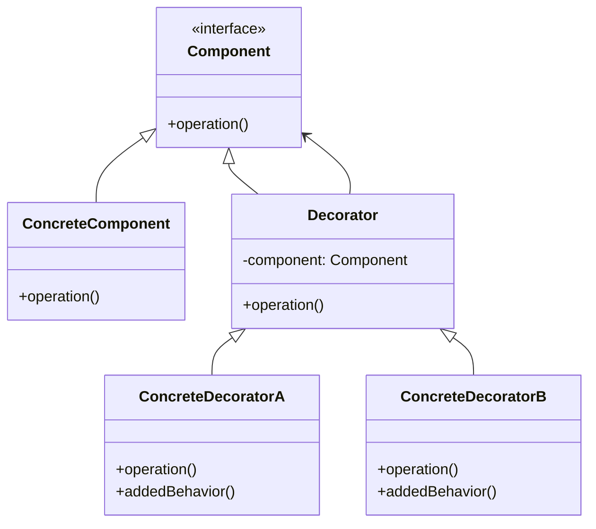

**Implementación en Testimonial CMS** (Caché y Logging sobre el servicio de testimonios):

```typescript
// src/domain/testimonials/services/testimonial.service.ts (interfaz)

export interface TestimonialService {
  getTestimonials(tenantId: string, filters: any): Promise<Testimonial[]>;
  getTestimonial(id: string): Promise<Testimonial>;
  createTestimonial(data: TestimonialCreationData): Promise<Testimonial>;
  updateTestimonial(id: string, data: Partial<Testimonial>): Promise<Testimonial>;
  deleteTestimonial(id: string): Promise<void>;
}

// Implementación concreta
export class TestimonialServiceImpl implements TestimonialService {
  constructor(private repository: TestimonialRepository) {}

  async getTestimonials(tenantId: string, filters: any): Promise<Testimonial[]> {
    return this.repository.findByTenant(tenantId, filters);
  }

  async getTestimonial(id: string): Promise<Testimonial> {
    return this.repository.findById(id);
  }

  // ... otros métodos
}

// Decorador base
export abstract class TestimonialServiceDecorator implements TestimonialService {
  constructor(protected readonly wrapped: TestimonialService) {}

  async getTestimonials(tenantId: string, filters: any): Promise<Testimonial[]> {
    return this.wrapped.getTestimonials(tenantId, filters);
  }

  async getTestimonial(id: string): Promise<Testimonial> {
    return this.wrapped.getTestimonial(id);
  }

  async createTestimonial(data: TestimonialCreationData): Promise<Testimonial> {
    return this.wrapped.createTestimonial(data);
  }

  async updateTestimonial(id: string, data: Partial<Testimonial>): Promise<Testimonial> {
    return this.wrapped.updateTestimonial(id, data);
  }

  async deleteTestimonial(id: string): Promise<void> {
    return this.wrapped.deleteTestimonial(id);
  }
}

// Decorador concreto: Caché
export class CachedTestimonialService extends TestimonialServiceDecorator {
  constructor(wrapped: TestimonialService, private cache: CacheService) {
    super(wrapped);
  }

  async getTestimonials(tenantId: string, filters: any): Promise<Testimonial[]> {
    const cacheKey = `testimonials:${tenantId}:${JSON.stringify(filters)}`;
    const cached = await this.cache.get(cacheKey);
    if (cached) return JSON.parse(cached);

    const result = await super.getTestimonials(tenantId, filters);
    await this.cache.set(cacheKey, JSON.stringify(result), 300); // 5 min TTL
    return result;
  }

  async getTestimonial(id: string): Promise<Testimonial> {
    const cacheKey = `testimonial:${id}`;
    const cached = await this.cache.get(cacheKey);
    if (cached) return JSON.parse(cached);

    const result = await super.getTestimonial(id);
    await this.cache.set(cacheKey, JSON.stringify(result), 300);
    return result;
  }

  async createTestimonial(data: TestimonialCreationData): Promise<Testimonial> {
    const result = await super.createTestimonial(data);
    // invalidar listas (podría hacerse con patrón de invalidation)
    await this.cache.delPattern(`testimonials:${data.tenantId}:*`);
    return result;
  }

  async updateTestimonial(id: string, data: Partial<Testimonial>): Promise<Testimonial> {
    const result = await super.updateTestimonial(id, data);
    await this.cache.del(`testimonial:${id}`);
    if (data.tenantId) {
      await this.cache.delPattern(`testimonials:${data.tenantId}:*`);
    }
    return result;
  }
}

// Decorador concreto: Logging
export class LoggingTestimonialService extends TestimonialServiceDecorator {
  private logger = Logger.getInstance();

  async getTestimonials(tenantId: string, filters: any): Promise<Testimonial[]> {
    this.logger.debug('getTestimonials called', { tenantId, filters });
    const start = Date.now();
    const result = await super.getTestimonials(tenantId, filters);
    const duration = Date.now() - start;
    this.logger.info('getTestimonials completed', { tenantId, duration, count: result.length });
    return result;
  }

  async createTestimonial(data: TestimonialCreationData): Promise<Testimonial> {
    this.logger.info('createTestimonial started', { tenantId: data.tenantId, author: data.authorName });
    const result = await super.createTestimonial(data);
    this.logger.info('createTestimonial succeeded', { id: result.id });
    return result;
  }

  // ... otros métodos
}

// Composición
const baseService = new TestimonialServiceImpl(repository);
const cachedService = new CachedTestimonialService(baseService, redisCache);
const loggedService = new LoggingTestimonialService(cachedService);

export const testimonialService = loggedService;
```

**Cuándo usar**:
- ✅ Para añadir funcionalidades transversales (caché, logging, validación) sin modificar la clase base.
- ✅ Cuando se necesita combinar múltiples responsabilidades dinámicamente.

**Cuándo evitar**:
- ❌ Si la funcionalidad puede ser heredada limpiamente.
- ❌ Cuando el número de decoradores crece demasiado y complica la lectura.

**Enlace al código**: [`src/domain/testimonials/decorators/testimonial-service.decorator.ts`](../../src/domain/testimonials/decorators/testimonial-service.decorator.ts)

---

### 🔴 **Estructural - Repository**

**Propósito**: Mediar entre el dominio y la capa de mapeo de datos usando una interfaz similar a una colección. Permite un mapeo más limpio entre objetos del dominio y la base de datos.

**Diagrama**:

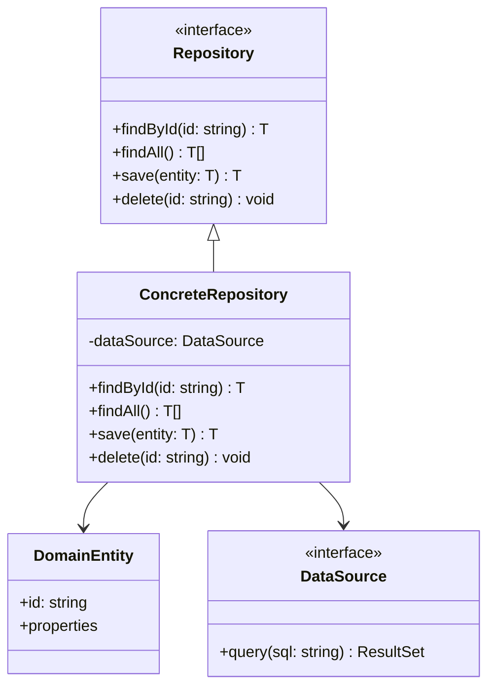

**Implementación en Testimonial CMS** (Prisma):

```typescript
// src/infrastructure/repositories/testimonial.repository.ts

import { Injectable } from '@nestjs/common';
import { PrismaService } from '../prisma/prisma.service';
import { Testimonial } from '../../domain/testimonials/entities/testimonial.entity';
import { TestimonialMapper } from './mappers/testimonial.mapper';

export interface TestimonialRepository {
  findById(id: string): Promise<Testimonial | null>;
  findByTenant(tenantId: string, filters?: any): Promise<Testimonial[]>;
  save(testimonial: Testimonial): Promise<Testimonial>;
  update(id: string, data: Partial<Testimonial>): Promise<Testimonial>;
  delete(id: string): Promise<void>;
  countByStatus(tenantId: string, status: string): Promise<number>;
}

@Injectable()
export class PrismaTestimonialRepository implements TestimonialRepository {
  constructor(private prisma: PrismaService) {}

  async findById(id: string): Promise<Testimonial | null> {
    const record = await this.prisma.testimonial.findUnique({
      where: { id },
      include: { tags: true, categories: true }
    });
    return record ? TestimonialMapper.toDomain(record) : null;
  }

  async findByTenant(tenantId: string, filters?: any): Promise<Testimonial[]> {
    const where: any = { tenantId };
    if (filters?.status) where.status = filters.status;
    if (filters?.tagIds) where.tags = { some: { id: { in: filters.tagIds } } };

    const records = await this.prisma.testimonial.findMany({
      where,
      include: { tags: true, categories: true },
      orderBy: { createdAt: 'desc' }
    });
    return records.map(TestimonialMapper.toDomain);
  }

  async save(testimonial: Testimonial): Promise<Testimonial> {
    const data = TestimonialMapper.toPersistence(testimonial);
    const created = await this.prisma.testimonial.create({ data });
    return TestimonialMapper.toDomain(created);
  }

  async update(id: string, data: Partial<Testimonial>): Promise<Testimonial> {
    const updateData = TestimonialMapper.toPersistencePartial(data);
    const updated = await this.prisma.testimonial.update({
      where: { id },
      data: updateData
    });
    return TestimonialMapper.toDomain(updated);
  }

  async delete(id: string): Promise<void> {
    await this.prisma.testimonial.delete({ where: { id } });
  }

  async countByStatus(tenantId: string, status: string): Promise<number> {
    return this.prisma.testimonial.count({
      where: { tenantId, status }
    });
  }
}

// Mapper (separado)
export class TestimonialMapper {
  static toDomain(record: any): Testimonial {
    return {
      id: record.id,
      tenantId: record.tenantId,
      content: record.content,
      authorName: record.authorName,
      rating: record.rating,
      status: record.status,
      score: record.score,
      createdAt: record.createdAt,
      publishedAt: record.publishedAt,
      tags: record.tags?.map(t => t.name) || [],
      categories: record.categories?.map(c => c.name) || []
    };
  }

  static toPersistence(domain: Testimonial): any {
    return {
      id: domain.id,
      tenantId: domain.tenantId,
      content: domain.content,
      authorName: domain.authorName,
      rating: domain.rating,
      status: domain.status,
      score: domain.score,
      createdAt: domain.createdAt,
      publishedAt: domain.publishedAt
      // Nota: las relaciones many-to-many se manejan aparte
    };
  }

  static toPersistencePartial(data: Partial<Testimonial>): any {
    const result: any = {};
    if (data.content !== undefined) result.content = data.content;
    if (data.authorName !== undefined) result.authorName = data.authorName;
    if (data.rating !== undefined) result.rating = data.rating;
    if (data.status !== undefined) result.status = data.status;
    if (data.score !== undefined) result.score = data.score;
    if (data.publishedAt !== undefined) result.publishedAt = data.publishedAt;
    return result;
  }
}
```

**Cuándo usar**:
- ✅ Para aislar el dominio de los detalles de persistencia.
- ✅ Para facilitar el testing (mock repositories).
- ✅ Cuando se usa un ORM y se quiere una capa de abstracción adicional.

**Cuándo evitar**:
- ❌ Si el ORM ya proporciona una interfaz limpia y no se necesita abstracción adicional.
- ❌ En proyectos muy simples con pocas entidades.

**Enlace al código**: [`src/infrastructure/repositories/testimonial.repository.ts`](../../src/infrastructure/repositories/testimonial.repository.ts)

---

## 4. Patrones de Comportamiento

### 🔴 **Comportamiento - Observer**

**Propósito**: Definir una dependencia uno-a-muchos entre objetos, de modo que cuando un objeto cambia de estado, todos sus dependientes son notificados y actualizados automáticamente.

**Diagrama**:

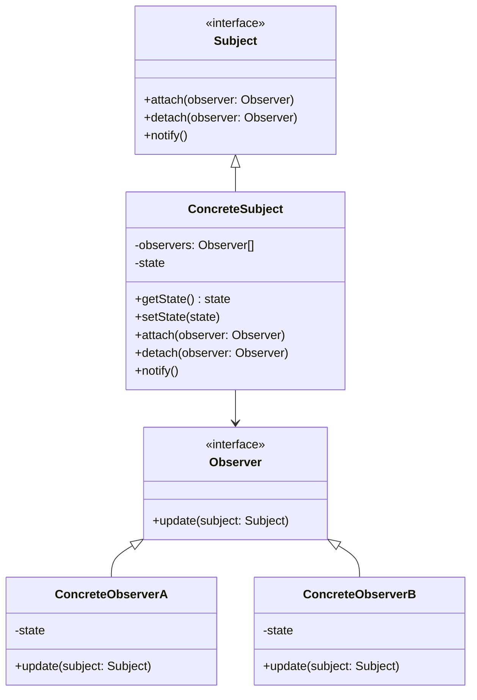

**Implementación en Testimonial CMS** (Eventos de testimonio):

```typescript
// src/domain/testimonials/events/testimonial-events.ts

export interface TestimonialEvent {
  type: string;
  testimonial: Testimonial;
  timestamp: Date;
}

export interface TestimonialObserver {
  onTestimonialCreated(event: TestimonialEvent): Promise<void>;
  onTestimonialPublished(event: TestimonialEvent): Promise<void>;
  onTestimonialUpdated(event: TestimonialEvent): Promise<void>;
  onTestimonialDeleted(event: TestimonialEvent): Promise<void>;
}

// Sujeto observable
export class TestimonialSubject {
  private observers: TestimonialObserver[] = [];

  attach(observer: TestimonialObserver): void {
    this.observers.push(observer);
  }

  detach(observer: TestimonialObserver): void {
    this.observers = this.observers.filter(o => o !== observer);
  }

  async notifyCreated(testimonial: Testimonial): Promise<void> {
    const event = { type: 'created', testimonial, timestamp: new Date() };
    await Promise.all(this.observers.map(o => o.onTestimonialCreated(event).catch(e => logger.error(e))));
  }

  async notifyPublished(testimonial: Testimonial): Promise<void> {
    const event = { type: 'published', testimonial, timestamp: new Date() };
    await Promise.all(this.observers.map(o => o.onTestimonialPublished(event).catch(e => logger.error(e))));
  }

  async notifyUpdated(testimonial: Testimonial): Promise<void> {
    const event = { type: 'updated', testimonial, timestamp: new Date() };
    await Promise.all(this.observers.map(o => o.onTestimonialUpdated(event).catch(e => logger.error(e))));
  }

  async notifyDeleted(testimonial: Testimonial): Promise<void> {
    const event = { type: 'deleted', testimonial, timestamp: new Date() };
    await Promise.all(this.observers.map(o => o.onTestimonialDeleted(event).catch(e => logger.error(e))));
  }
}

// Observador concreto: WebhookNotifier
export class WebhookNotifier implements TestimonialObserver {
  constructor(private webhookService: WebhookService) {}

  async onTestimonialPublished(event: TestimonialEvent): Promise<void> {
    await this.webhookService.trigger('testimonial.published', event.testimonial);
  }

  // implementaciones vacías para otros eventos
  async onTestimonialCreated(event: TestimonialEvent): Promise<void> {}
  async onTestimonialUpdated(event: TestimonialEvent): Promise<void> {}
  async onTestimonialDeleted(event: TestimonialEvent): Promise<void> {}
}

// Observador concreto: AnalyticsTracker
export class AnalyticsTracker implements TestimonialObserver {
  constructor(private analyticsService: AnalyticsService) {}

  async onTestimonialPublished(event: TestimonialEvent): Promise<void> {
    await this.analyticsService.recordEvent('testimonial_published', event.testimonial.id);
  }

  async onTestimonialUpdated(event: TestimonialEvent): Promise<void> {
    await this.analyticsService.recordEvent('testimonial_updated', event.testimonial.id);
  }

  async onTestimonialDeleted(event: TestimonialEvent): Promise<void> {
    await this.analyticsService.recordEvent('testimonial_deleted', event.testimonial.id);
  }

  async onTestimonialCreated(event: TestimonialEvent): Promise<void> {
    await this.analyticsService.recordEvent('testimonial_created', event.testimonial.id);
  }
}

// Uso en el servicio
@Injectable()
export class TestimonialService {
  private subject = new TestimonialSubject();

  constructor(
    private repository: TestimonialRepository,
    webhookService: WebhookService,
    analyticsService: AnalyticsService
  ) {
    this.subject.attach(new WebhookNotifier(webhookService));
    this.subject.attach(new AnalyticsTracker(analyticsService));
  }

  async createTestimonial(data: TestimonialCreationData): Promise<Testimonial> {
    const testimonial = await this.repository.save({ ...data, status: 'draft' });
    await this.subject.notifyCreated(testimonial);
    return testimonial;
  }

  async publishTestimonial(id: string): Promise<Testimonial> {
    const testimonial = await this.repository.update(id, { status: 'published', publishedAt: new Date() });
    await this.subject.notifyPublished(testimonial);
    return testimonial;
  }

  // ... otros métodos
}
```

**Cuándo usar**:
- ✅ Cuando un cambio en un objeto requiere cambios en otros objetos (notificaciones, actualización de caché, disparo de webhooks).
- ✅ Para desacoplar el objeto que notifica de los que reciben la notificación.

**Cuándo evitar**:
- ❌ Si solo hay un observador y la relación es simple.
- ❌ Cuando la notificación debe ser síncrona y crítica (el observador podría fallar y bloquear la operación).

**Enlace al código**: [`src/domain/testimonials/events/testimonial-events.ts`](../../src/domain/testimonials/events/testimonial-events.ts)

---

### 🔴 **Comportamiento - Strategy**

**Propósito**: Definir una familia de algoritmos, encapsular cada uno y hacerlos intercambiables. Strategy permite que el algoritmo varíe independientemente de los clientes que lo usan.

**Diagrama**:

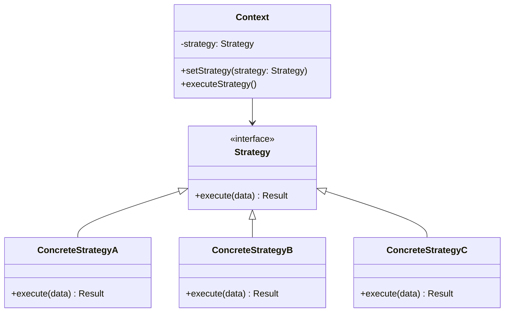

**Implementación en Testimonial CMS** (Scoring de testimonios):

```typescript
// src/domain/testimonials/strategies/scoring.strategy.ts

export interface ScoringStrategy {
  calculate(testimonial: Testimonial, events: AnalyticsEvent[]): number;
}

export class SimpleScoringStrategy implements ScoringStrategy {
  calculate(testimonial: Testimonial, events: AnalyticsEvent[]): number {
    const views = events.filter(e => e.type === 'view').length;
    const clicks = events.filter(e => e.type === 'click').length;
    return views * 0.3 + clicks * 0.7 + testimonial.rating * 2;
  }
}

export class WeightedScoringStrategy implements ScoringStrategy {
  calculate(testimonial: Testimonial, events: AnalyticsEvent[]): number {
    const views = events.filter(e => e.type === 'view').length;
    const clicks = events.filter(e => e.type === 'click').length;
    const recency = this.calculateRecency(testimonial.publishedAt);
    return views * 0.2 + clicks * 0.5 + testimonial.rating * 1.5 + recency * 0.3;
  }

  private calculateRecency(publishedAt: Date): number {
    const daysSince = (Date.now() - publishedAt.getTime()) / (1000 * 60 * 60 * 24);
    return Math.exp(-daysSince / 30); // decaimiento exponencial
  }
}

export class MachineLearningScoringStrategy implements ScoringStrategy {
  async calculate(testimonial: Testimonial, events: AnalyticsEvent[]): Promise<number> {
    // llamada a un servicio de ML
    const features = this.extractFeatures(testimonial, events);
    const response = await fetch('https://ml-service/predict', {
      method: 'POST',
      body: JSON.stringify({ features })
    });
    const { score } = await response.json();
    return score;
  }

  private extractFeatures(testimonial: Testimonial, events: AnalyticsEvent[]): number[] {
    // ... convertir a vector
    return [];
  }
}

// Contexto
export class ScoringContext {
  constructor(private strategy: ScoringStrategy) {}

  setStrategy(strategy: ScoringStrategy): void {
    this.strategy = strategy;
  }

  async calculateScore(testimonial: Testimonial, events: AnalyticsEvent[]): Promise<number> {
    return this.strategy.calculate(testimonial, events);
  }
}

// Uso en el servicio de scoring
@Injectable()
export class ScoringService {
  private context: ScoringContext;

  constructor(private analyticsService: AnalyticsService) {
    // Estrategia por defecto
    this.context = new ScoringContext(new WeightedScoringStrategy());
  }

  async recalculateScore(testimonial: Testimonial): Promise<number> {
    const events = await this.analyticsService.getEventsForTestimonial(testimonial.id);
    const score = await this.context.calculateScore(testimonial, events);
    // guardar en DB
    return score;
  }

  // Permitir cambiar estrategia dinámicamente (por tenant, feature flag)
  setStrategyForTenant(tenantId: string): void {
    // lógica de decisión basada en feature flags
    if (tenantHasML(tenantId)) {
      this.context.setStrategy(new MachineLearningScoringStrategy());
    } else {
      this.context.setStrategy(new WeightedScoringStrategy());
    }
  }
}
```

**Cuándo usar**:
- ✅ Cuando se tienen múltiples algoritmos para la misma tarea (scoring, cálculo de relevancia).
- ✅ Para seleccionar el algoritmo en tiempo de ejecución (por tenant, feature flag).
- ✅ Para evitar condicionales complejos.

**Cuándo evitar**:
- ❌ Si solo hay un algoritmo.
- ❌ Cuando los algoritmos son muy simples y no justifican la abstracción.

**Enlace al código**: [`src/domain/testimonials/strategies/scoring.strategy.ts`](../../src/domain/testimonials/strategies/scoring.strategy.ts)

---

### 🔴 **Comportamiento - Idempotency (para webhooks y API)**

**Propósito**: Garantizar que una operación pueda ser ejecutada múltiples veces sin efectos secundarios adicionales. Esencial para manejar reintentos en sistemas distribuidos.

**Diagrama**:

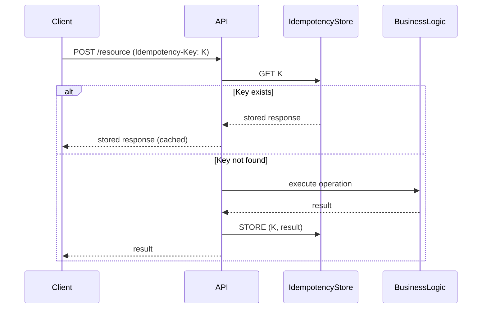

**Implementación en Testimonial CMS**:

```typescript
// src/infrastructure/idempotency/idempotency.middleware.ts

import { Injectable, NestMiddleware } from '@nestjs/common';
import { Request, Response, NextFunction } from 'express';
import { IdempotencyService } from './idempotency.service';

@Injectable()
export class IdempotencyMiddleware implements NestMiddleware {
  constructor(private idempotencyService: IdempotencyService) {}

  async use(req: Request, res: Response, next: NextFunction) {
    if (req.method !== 'POST' && req.method !== 'PATCH') {
      return next();
    }

    const key = req.headers['idempotency-key'] as string;
    if (!key) {
      return next();
    }

    const cached = await this.idempotencyService.get(key);
    if (cached) {
      return res.status(cached.statusCode).json(cached.body);
    }

    // Guardar referencia para interceptar la respuesta
    const originalSend = res.send;
    res.send = (body) => {
      this.idempotencyService.save(key, {
        statusCode: res.statusCode,
        body: body
      }, 86400); // TTL 24h
      return originalSend.call(res, body);
    };

    next();
  }
}

// Servicio de idempotencia (Redis)
@Injectable()
export class IdempotencyService {
  constructor(@Inject('REDIS_CLIENT') private redis: Redis) {}

  async get(key: string): Promise<{ statusCode: number; body: any } | null> {
    const data = await this.redis.get(`idempotency:${key}`);
    return data ? JSON.parse(data) : null;
  }

  async save(key: string, value: any, ttl: number): Promise<void> {
    await this.redis.setex(`idempotency:${key}`, ttl, JSON.stringify(value));
  }
}

// Aplicar en el módulo
export class AppModule {
  configure(consumer: MiddlewareConsumer) {
    consumer
      .apply(IdempotencyMiddleware)
      .forRoutes('testimonials');
  }
}
```

**Cuándo usar**:
- ✅ En endpoints que pueden ser reintentados (webhooks, creación de recursos).
- ✅ Para garantizar que un testimonio no se cree duplicado por reintentos del cliente.

**Cuándo evitar**:
- ❌ En operaciones de solo lectura.
- ❌ Cuando la idempotencia ya está garantizada por el diseño (ej. PUT).

**Enlace al código**: [`src/infrastructure/idempotency/idempotency.middleware.ts`](../../src/infrastructure/idempotency/idempotency.middleware.ts)

---

## 5. Patrones Arquitectónicos

### 🔴 **Arquitectónico - Outbox Pattern**

**Propósito**: Garantizar que los eventos se publiquen de manera confiable, almacenándolos en la misma transacción que la operación de negocio, y procesándolos posteriormente de forma asíncrona.

**Diagrama**:

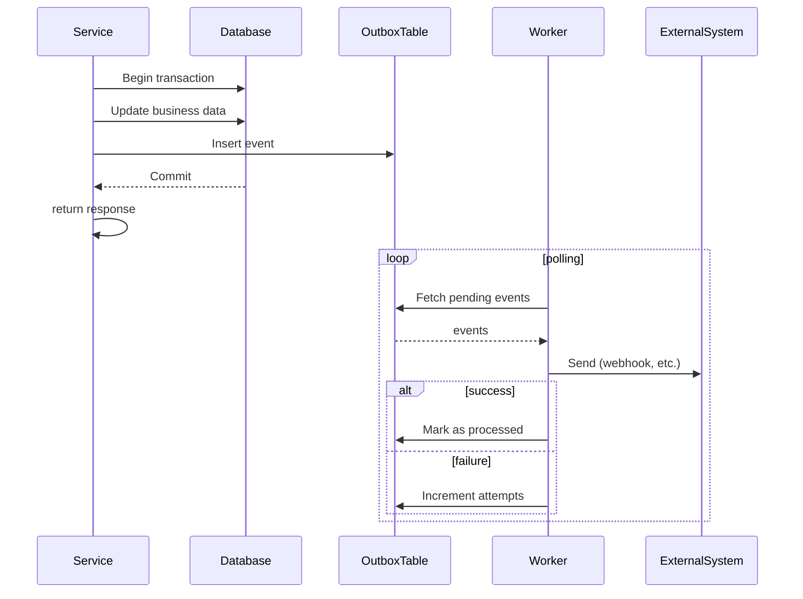

**Implementación en Testimonial CMS**:

```typescript
// src/infrastructure/outbox/outbox.service.ts

import { Injectable } from '@nestjs/common';
import { PrismaService } from '../prisma/prisma.service';
import { EventEmitter2 } from '@nestjs/event-emitter';

export interface OutboxEvent {
  id?: string;
  tenantId: string;
  eventType: string;
  payload: any;
  status?: 'pending' | 'processed' | 'failed';
  attempts?: number;
  createdAt?: Date;
  processedAt?: Date;
}

@Injectable()
export class OutboxService {
  constructor(private prisma: PrismaService) {}

  async createEvent(event: Omit<OutboxEvent, 'id' | 'status' | 'attempts' | 'createdAt'>): Promise<void> {
    await this.prisma.outboxEvent.create({
      data: {
        tenantId: event.tenantId,
        eventType: event.eventType,
        payload: event.payload,
        status: 'pending',
        attempts: 0
      }
    });
  }

  async processPendingEvents(batchSize = 10): Promise<void> {
    const events = await this.prisma.outboxEvent.findMany({
      where: { status: 'pending' },
      take: batchSize,
      orderBy: { createdAt: 'asc' }
    });

    for (const event of events) {
      try {
        // Disparar evento interno para que los handlers lo procesen
        await this.emitEvent(event);
        await this.markAsProcessed(event.id);
      } catch (error) {
        await this.incrementAttempts(event.id, error.message);
      }
    }
  }

  private async emitEvent(event: any): Promise<void> {
    // Usar EventEmitter de NestJS para desacoplar
    // Los listeners se encargarán de enviar webhooks, actualizar scoring, etc.
    const result = await this.eventEmitter.emitAsync(event.eventType, event.payload);
    if (result.includes(false)) {
      throw new Error('Event handler failed');
    }
  }

  private async markAsProcessed(id: string): Promise<void> {
    await this.prisma.outboxEvent.update({
      where: { id },
      data: { status: 'processed', processedAt: new Date() }
    });
  }

  private async incrementAttempts(id: string, error?: string): Promise<void> {
    await this.prisma.outboxEvent.update({
      where: { id },
      data: {
        attempts: { increment: 1 },
        status: { set: 'failed' } // o mantener 'pending' si se quiere reintentar
      }
    });
  }
}

// Worker (puede ejecutarse como un job programado)
@Injectable()
export class OutboxWorker {
  constructor(private outboxService: OutboxService) {}

  @Cron('*/5 * * * * *') // cada 5 segundos
  async handlePendingEvents() {
    await this.outboxService.processPendingEvents();
  }
}

// Uso en el servicio de testimonios
@Injectable()
export class TestimonialService {
  constructor(
    private repository: TestimonialRepository,
    private outbox: OutboxService
  ) {}

  async publishTestimonial(id: string): Promise<Testimonial> {
    return await this.prisma.$transaction(async (tx) => {
      const testimonial = await tx.testimonial.update({
        where: { id },
        data: { status: 'published', publishedAt: new Date() }
      });

      await this.outbox.createEvent({
        tenantId: testimonial.tenantId,
        eventType: 'testimonial.published',
        payload: { id: testimonial.id, author: testimonial.authorName }
      });

      return testimonial;
    });
  }
}
```

**Cuándo usar**:
- ✅ Para operaciones que requieren enviar eventos a sistemas externos (webhooks) sin perder datos si falla el envío.
- ✅ Para mantener consistencia transaccional entre la base de datos y la publicación de eventos.

**Cuándo evitar**:
- ❌ Si no se necesita fiabilidad en la publicación de eventos.
- ❌ Para eventos internos que pueden ser síncronos.

**Enlace al código**: [`src/infrastructure/outbox/outbox.service.ts`](../../src/infrastructure/outbox/outbox.service.ts)

---

### 🔴 **Arquitectónico - Feature Flag**

**Propósito**: Permitir activar o desactivar funcionalidades sin desplegar nuevo código. Útil para despliegues graduales, pruebas A/B y control por tenant.

**Diagrama**:

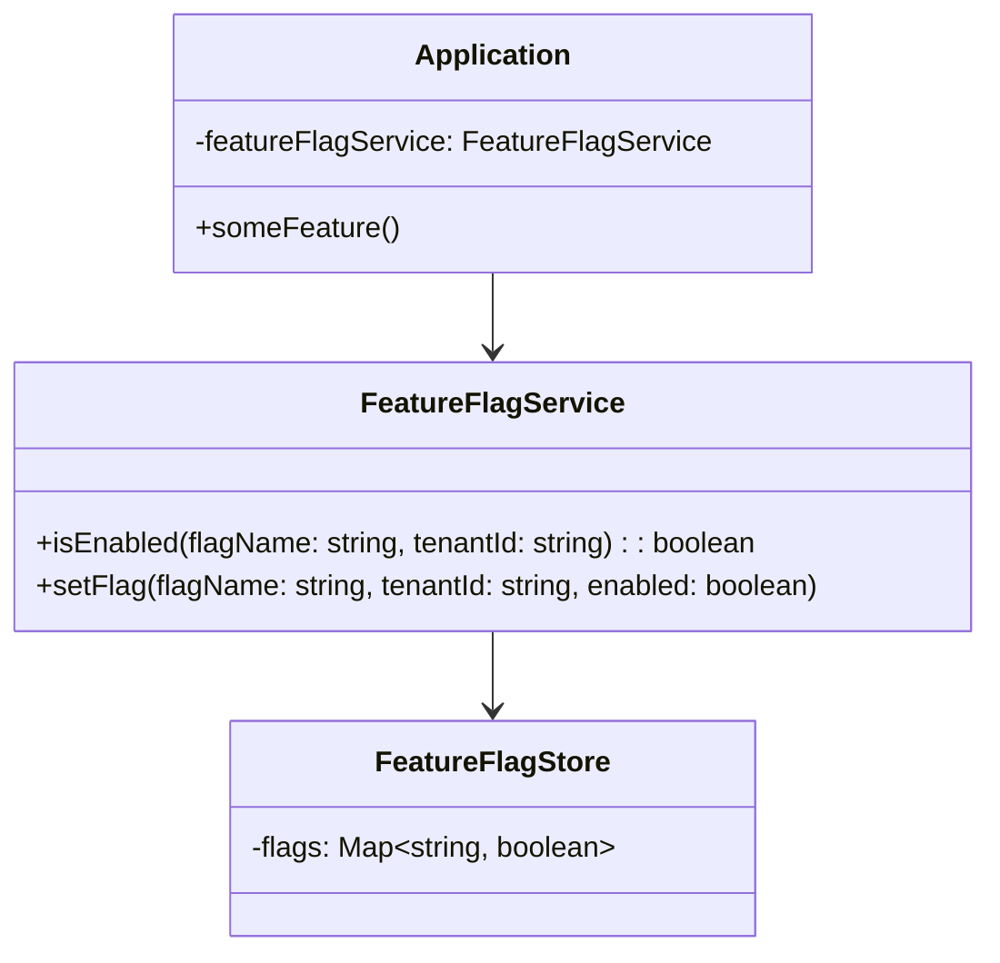

**Implementación en Testimonial CMS**:

```typescript
// src/infrastructure/feature-flags/feature-flag.service.ts

import { Injectable } from '@nestjs/common';
import { PrismaService } from '../prisma/prisma.service';

@Injectable()
export class FeatureFlagService {
  constructor(private prisma: PrismaService) {}

  async isEnabled(flagName: string, tenantId: string): Promise<boolean> {
    // Podría cachearse en Redis
    const flag = await this.prisma.featureFlag.findUnique({
      where: { name: flagName }
    });
    if (!flag) return false;

    const tenantFlag = await this.prisma.tenantFeatureFlag.findUnique({
      where: {
        tenantId_featureFlagId: {
          tenantId,
          featureFlagId: flag.id
        }
      }
    });
    return tenantFlag?.enabled ?? false;
  }

  async setFlag(flagName: string, tenantId: string, enabled: boolean): Promise<void> {
    const flag = await this.prisma.featureFlag.findUnique({
      where: { name: flagName }
    });
    if (!flag) throw new Error(`Flag ${flagName} not found`);

    await this.prisma.tenantFeatureFlag.upsert({
      where: {
        tenantId_featureFlagId: {
          tenantId,
          featureFlagId: flag.id
        }
      },
      update: { enabled },
      create: {
        tenantId,
        featureFlagId: flag.id,
        enabled
      }
    });
  }
}

// Uso en un servicio
@Injectable()
export class TestimonialService {
  constructor(private featureFlags: FeatureFlagService) {}

  async getTestimonials(tenantId: string, filters: any): Promise<Testimonial[]> {
    if (await this.featureFlags.isEnabled('new_scoring_algorithm', tenantId)) {
      // usar nuevo scoring
    } else {
      // usar scoring antiguo
    }
    // ...
  }
}

// Controlador para administrar flags
@Controller('admin/feature-flags')
export class FeatureFlagController {
  constructor(private featureFlags: FeatureFlagService) {}

  @Post(':flagName/tenants/:tenantId')
  async setFlag(
    @Param('flagName') flagName: string,
    @Param('tenantId') tenantId: string,
    @Body('enabled') enabled: boolean
  ) {
    await this.featureFlags.setFlag(flagName, tenantId, enabled);
    return { success: true };
  }
}
```

**Cuándo usar**:
- ✅ Para activar nuevas funcionalidades progresivamente.
- ✅ Para habilitar características premium solo para ciertos tenants.
- ✅ Para realizar pruebas A/B.

**Cuándo evitar**:
- ❌ Si las funcionalidades son estáticas y no necesitan control en tiempo de ejecución.
- ❌ Cuando el overhead de consultar flags afecta el rendimiento (mitigar con caché).

**Enlace al código**: [`src/infrastructure/feature-flags/feature-flag.service.ts`](../../src/infrastructure/feature-flags/feature-flag.service.ts)

---

### 🔴 **Arquitectónico - Unit of Work**

**Propósito**: Mantener un registro de los objetos afectados por una transacción de negocio y coordinar la escritura de cambios y la resolución de problemas de concurrencia.

**Diagrama**:

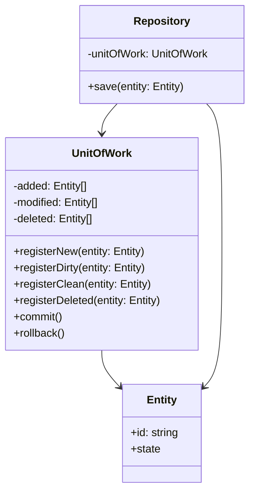

**Implementación en Testimonial CMS** (simplificada, usando transacciones de Prisma):

```typescript
// src/infrastructure/unit-of-work/unit-of-work.ts

import { PrismaService } from '../prisma/prisma.service';

export class UnitOfWork {
  private prisma: PrismaService;
  private operations: (() => Promise<any>)[] = [];

  constructor(prisma: PrismaService) {
    this.prisma = prisma;
  }

  registerOperation(operation: () => Promise<any>): void {
    this.operations.push(operation);
  }

  async commit(): Promise<void> {
    await this.prisma.$transaction(async (tx) => {
      for (const op of this.operations) {
        await op();
      }
    });
    this.operations = [];
  }

  rollback(): void {
    this.operations = [];
  }
}

// Uso en un servicio
@Injectable()
export class TestimonialService {
  constructor(private prisma: PrismaService) {}

  async createTestimonialWithTags(data: TestimonialCreationData, tagIds: string[]): Promise<Testimonial> {
    const uow = new UnitOfWork(this.prisma);

    let testimonialId: string;

    uow.registerOperation(async () => {
      const testimonial = await this.prisma.testimonial.create({
        data: {
          tenantId: data.tenantId,
          content: data.content,
          authorName: data.authorName,
          rating: data.rating,
          status: 'draft'
        }
      });
      testimonialId = testimonial.id;
    });

    uow.registerOperation(async () => {
      // asociar tags
      for (const tagId of tagIds) {
        await this.prisma.testimonialTag.create({
          data: {
            testimonialId,
            tagId
          }
        });
      }
    });

    await uow.commit();
    return this.prisma.testimonial.findUnique({ where: { id: testimonialId } });
  }
}
```

**Nota**: En la práctica, con Prisma se puede usar `$transaction` directamente, pero el patrón Unit of Work encapsula la lógica de registro de operaciones.

**Cuándo usar**:
- ✅ Para operaciones que involucran múltiples entidades en una transacción.
- ✅ Para garantizar atomicidad en operaciones complejas.

**Cuándo evitar**:
- ❌ Si el ORM ya proporciona transacciones simples y no se necesita una capa adicional.

**Enlace al código**: [`src/infrastructure/unit-of-work/unit-of-work.ts`](../../src/infrastructure/unit-of-work/unit-of-work.ts)

---

## 6. Checklist de Calidad para Patrones de Diseño

- [x] Cada patrón tiene un propósito claro.
- [x] Incluye diagrama de clases (Mermaid).
- [x] La implementación es código real del proyecto (aunque sea representativo).
- [x] Explica cuándo usar y cuándo evitar.
- [x] Incluye enlace al código fuente (placeholder).

---

> **Nota final**: Este catálogo debe mantenerse actualizado a medida que el sistema evoluciona. Si se implementa un nuevo patrón, se debe agregar aquí; si un patrón deja de usarse, se debe archivar.