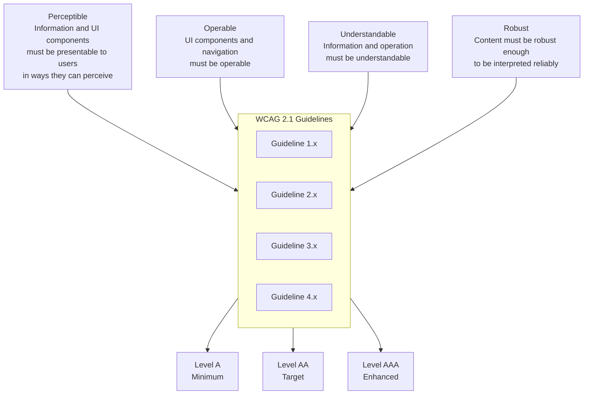

# Accesibilidad (WCAG 2.1 AA)

## 🎯 Propósito del Documento

Este documento define la **estrategia de accesibilidad completa** del sistema: estándares, requisitos técnicos, patrones de implementación y procesos de validación. Es la **guía definitiva para desarrolladores, diseñadores y QA** sobre cómo construir una experiencia accesible para todos los usuarios.

> 💡 **Diferencia clave**:  
> - **`accessibility.md`** (este documento): Define los *requisitos técnicos*, patrones y procesos de validación  
> - **WCAG Guidelines**: Estándares externos de referencia (W3C)  
> - **Tests de Accesibilidad**: Código específico que valida cumplimiento  
> - **Design System**: Componentes accesibles pre-construidos  
>   
> ✅ **Regla moderna**: La accesibilidad no es un "feature" opcional — es un **requisito no funcional obligatorio**. Todo código que no cumple WCAG 2.1 AA no debe ser mergeado.

---

## 1. Visión General y Compromiso

### 1.1. Declaración de Compromiso

> **Compromiso de Accesibilidad**: Nos comprometemos a garantizar que nuestro sistema sea accesible para todas las personas, independientemente de sus capacidades físicas, sensoriales, cognitivas o tecnológicas. Cumplimos con el estándar WCAG 2.1 AA como mínimo, y aspiramos a WCAG 2.1 AAA donde sea posible.

### 1.2. Alcance y Aplicabilidad

| Componente | Nivel de Accesibilidad | Fecha de Última Auditoría |
|------------|------------------------|---------------------------|
| **Dashboard de Administración** | WCAG 2.1 AA | YYYY-MM-DD |
| **Página Pública de Testimonios** | WCAG 2.1 AA | YYYY-MM-DD |
| **Widget Embebible** | WCAG 2.1 A | YYYY-MM-DD |
| **Formularios de Creación/Edición** | WCAG 2.1 AA | YYYY-MM-DD |
| **API Pública** | WCAG 2.1 A | YYYY-MM-DD |

### 1.3. Marco Legal y Normativo

| Normativa | Jurisdicción | Requisito | Impacto |
|-----------|--------------|-----------|---------|
| **Ley 26.653** | Argentina | Accesibilidad web para sector público | Relevante si clientes son entidades públicas |
| **Ley 25.326** | Argentina | Protección de datos personales | Afecta diseño de formularios (privacidad) |
| **Section 508** | USA | Accesibilidad para gobierno federal | Relevante para exportación |
| **EN 301 549** | Europa | Norma europea de accesibilidad | Relevante para mercado EU |
| **ADA Title III** | USA | Accesibilidad lugares públicos | Afecta aplicaciones comerciales |

---

## 2. Estándares y Niveles de Conformidad

### 2.1. WCAG 2.1 Principios POUR



### 2.2. Niveles de Conformidad

| Nivel | Descripción | Requisitos | Nuestro Objetivo |
|-------|-------------|------------|------------------|
| **A** | Accesibilidad básica | 30 Success Criteria | ✅ Mínimo absoluto |
| **AA** | Accesibilidad estándar | 50 Success Criteria | ✅ **Objetivo principal** |
| **AAA** | Accesibilidad avanzada | 70+ Success Criteria | 🎯 Donde sea posible |

### 2.3. Success Criteria por Principio (WCAG 2.1 AA)

> **Nota**: A continuación se listan los criterios más relevantes para nuestro sistema. Para la lista completa, consultar [WCAG 2.1](https://www.w3.org/TR/WCAG21/).

#### Principio 1: Perceptible

| Criterio | Nivel | Descripción | Impacto en Desarrollo |
|----------|-------|-------------|----------------------|
| **1.1.1 Non-text Content** | A | Texto alternativo para imágenes (avatares, iconos) | `alt` attributes en `` y SVG |
| **1.2.2 Captions (Prerecorded)** | A | Subtítulos para videos testimoniales | Incluir tracks de subtítulos |
| **1.3.1 Info and Relationships** | A | Estructura semántica correcta | HTML semántico, headings, listas |
| **1.3.2 Meaningful Sequence** | A | Orden lógico de contenido | DOM order = visual order |
| **1.3.3 Sensory Characteristics** | A | No solo color/forma/sonido | Usar iconos + texto para estados |
| **1.3.4 Orientation** | AA | No forzar orientación | Diseño responsivo (portrait/landscape) |
| **1.3.5 Identify Input Purpose** | AA | Autocompletado semántico | `autocomplete` en formularios |
| **1.4.1 Use of Color** | A | No solo color para información | Añadir etiquetas o patrones |
| **1.4.3 Contrast (Minimum)** | AA | Ratio 4.5:1 texto normal | Verificar con herramientas |
| **1.4.4 Resize Text** | AA | Zoom hasta 200% sin pérdida | Usar unidades relativas (rem) |
| **1.4.5 Images of Text** | AA | Evitar texto en imágenes | Usar CSS para estilos de texto |
| **1.4.10 Reflow** | AA | Sin scroll horizontal al 400% | Responsive con contenedores flexibles |
| **1.4.11 Non-text Contrast** | AA | Contraste de componentes UI (botones, bordes) | Mínimo 3:1 |
| **1.4.12 Text Spacing** | AA | Soporte para espaciado personalizado | Usar CSS que permita override |
| **1.4.13 Content on Hover/Focus** | AA | Contenido emergente controlable | Tooltips que se cierren con ESC |

#### Principio 2: Operable

| Criterio | Nivel | Descripción | Impacto en Desarrollo |
|----------|-------|-------------|----------------------|
| **2.1.1 Keyboard** | A | Todas las funciones operables con teclado | Navegación por Tab, Enter, Space |
| **2.1.2 No Keyboard Trap** | A | No quedar atrapado en modales | Gestión de foco al abrir/cerrar |
| **2.1.4 Character Key Shortcuts** | A | Shortcuts modificables o desactivables | Evitar o permitir reasignación |
| **2.2.1 Timing Adjustable** | A | Tiempo de sesión ajustable | Notificar y permitir extender |
| **2.2.2 Pause, Stop, Hide** | A | Control de contenido en movimiento | Botón pausa para carruseles |
| **2.3.1 Three Flashes or Below** | A | Evitar contenido que parpadee | Revisar animaciones |
| **2.4.1 Bypass Blocks** | A | Saltar bloques repetitivos | Skip link al inicio |
| **2.4.2 Page Titled** | A | Títulos de página descriptivos | `<title>` y `h1` coherentes |
| **2.4.3 Focus Order** | A | Orden lógico de foco | DOM order natural, tabindex controlado |
| **2.4.4 Link Purpose** | A | Propósito claro de links | Texto descriptivo (no "click aquí") |
| **2.4.5 Multiple Ways** | AA | Múltiples formas de navegar | Búsqueda + menú + mapa del sitio |
| **2.4.6 Headings and Labels** | AA | Títulos y labels descriptivos | Coherentes con el contenido |
| **2.4.7 Focus Visible** | AA | Indicador de foco visible | Estilos `:focus-visible` |
| **2.5.1 Pointer Gestures** | A | No gestos complejos | Acciones con un solo clic/tap |
| **2.5.2 Pointer Cancellation** | A | Cancelación antes de acción | Eventos en `up`, no en `down` |
| **2.5.3 Label in Name** | A | Label visible coincide con nombre accesible | Ej: botón "Guardar" con ese texto |
| **2.5.4 Motion Actuation** | A | Alternativas a movimiento por sensor | Botones alternativos |
| **2.5.5 Target Size** | AAA | Tamaño mínimo 44x44px | Botones y enlaces accesibles |

#### Principio 3: Comprensible

| Criterio | Nivel | Descripción | Impacto en Desarrollo |
|----------|-------|-------------|----------------------|
| **3.1.1 Language of Page** | A | Idioma de página declarado | `<html lang="es">` |
| **3.1.2 Language of Parts** | AA | Declarar cambios de idioma | `lang` en fragmentos específicos |
| **3.2.1 On Focus** | A | No cambios inesperados al enfocar | Evitar redirecciones automáticas |
| **3.2.2 On Input** | A | No cambios inesperados al escribir | Solo cambiar con acción explícita |
| **3.2.3 Consistent Navigation** | AA | Navegación consistente en todo el sitio | Menú igual en todas páginas |
| **3.2.4 Consistent Identification** | AA | Identificación consistente | Mismo icono para misma acción |
| **3.3.1 Error Identification** | A | Identificar errores claramente | Mensajes específicos |
| **3.3.2 Labels or Instructions** | A | Labels e instrucciones claras | Ejemplo: "Campo requerido" |
| **3.3.3 Error Suggestion** | AA | Sugerencias de corrección | "Formato incorrecto. Use 5 estrellas." |
| **3.3.4 Error Prevention** | AA | Prevenir errores en acciones legales/financieras | Confirmación antes de publicar |
| **3.3.5 Help** | AAA | Ayuda contextual | Tooltips, enlaces a ayuda |

#### Principio 4: Robusto

| Criterio | Nivel | Descripción | Impacto en Desarrollo |
|----------|-------|-------------|----------------------|
| **4.1.1 Parsing** | A | HTML bien formado | Validar con W3C validator |
| **4.1.2 Name, Role, Value** | A | ARIA correcto | Componentes personalizados con roles |
| **4.1.3 Status Messages** | AA | Mensajes de estado con ARIA live | Notificaciones, alertas |

---

## 3. Checklist de Accesibilidad por Componente

### 3.1. Formulario de Creación/Edición de Testimonios

```tsx
// ✅ EJEMPLO: Formulario Accesible para Testimonios
import React from 'react';
import { useForm } from 'react-hook-form';

interface TestimonialFormProps {
  onSubmit: (data: any) => void;
  isSubmitting?: boolean;
  error?: string;
  success?: string;
}

export const TestimonialForm: React.FC<TestimonialFormProps> = ({
  onSubmit,
  isSubmitting,
  error,
  success
}) => {
  const { register, handleSubmit, formState: { errors } } = useForm();

  return (
    <form
      onSubmit={handleSubmit(onSubmit)}
      aria-labelledby="form-title"
      className="space-y-6 max-w-lg mx-auto p-6 bg-surface rounded-lg shadow-md"
    >
      <h1 id="form-title" className="text-2xl font-bold text-text-primary">
        Nuevo Testimonio
      </h1>

      {/* Campo: Nombre del autor */}
      <div className="space-y-1">
        <label htmlFor="authorName" className="block text-label-md text-text-primary">
          Nombre del autor <span aria-hidden="true" className="text-error-500">*</span>
        </label>
        <input
          id="authorName"
          type="text"
          {...register('authorName', { required: 'El nombre es obligatorio' })}
          aria-required="true"
          aria-invalid={!!errors.authorName}
          aria-describedby={errors.authorName ? 'authorName-error' : undefined}
          className="w-full px-3 py-2 border border-border rounded-md focus:outline-none focus:ring-2 focus:ring-primary-500"
          placeholder="Ej: Juan Pérez"
        />
        {errors.authorName && (
          <p id="authorName-error" role="alert" className="text-sm text-error-500">
            {errors.authorName.message as string}
          </p>
        )}
      </div>

      {/* Campo: Contenido del testimonio */}
      <div className="space-y-1">
        <label htmlFor="content" className="block text-label-md text-text-primary">
          Testimonio <span aria-hidden="true" className="text-error-500">*</span>
        </label>
        <textarea
          id="content"
          rows={4}
          {...register('content', {
            required: 'El testimonio es obligatorio',
            minLength: { value: 10, message: 'Mínimo 10 caracteres' }
          })}
          aria-required="true"
          aria-invalid={!!errors.content}
          aria-describedby={errors.content ? 'content-error' : undefined}
          className="w-full px-3 py-2 border border-border rounded-md focus:outline-none focus:ring-2 focus:ring-primary-500"
          placeholder="Escribe tu experiencia..."
        />
        {errors.content && (
          <p id="content-error" role="alert" className="text-sm text-error-500">
            {errors.content.message as string}
          </p>
        )}
      </div>

      {/* Campo: Calificación (estrellas) - versión accesible con radio buttons */}
      <fieldset className="space-y-2">
        <legend className="text-label-md text-text-primary">
          Calificación <span aria-hidden="true" className="text-error-500">*</span>
        </legend>
        <div className="flex gap-4">
          {[1, 2, 3, 4, 5].map((value) => (
            <label key={value} className="flex items-center gap-1 cursor-pointer">
              <input
                type="radio"
                value={value}
                {...register('rating', { required: 'Selecciona una calificación' })}
                aria-label={`${value} estrella${value > 1 ? 's' : ''}`}
                className="w-4 h-4 text-primary-500"
              />
              <span aria-hidden="true">{value}★</span>
            </label>
          ))}
        </div>
        {errors.rating && (
          <p role="alert" className="text-sm text-error-500">
            {errors.rating.message as string}
          </p>
        )}
      </fieldset>

      {/* Campo: Subir imagen/video (opcional) */}
      <div className="space-y-1">
        <label htmlFor="media" className="block text-label-md text-text-primary">
          Adjuntar imagen o video (opcional)
        </label>
        <input
          id="media"
          type="file"
          accept="image/*,video/*"
          {...register('media')}
          className="block w-full text-sm text-text-secondary
            file:mr-4 file:py-2 file:px-4 file:rounded-md file:border-0
            file:text-label-md file:bg-primary-50 file:text-primary-700
            hover:file:bg-primary-100"
        />
        <p className="text-xs text-text-tertiary">
          Formatos soportados: JPG, PNG, GIF, MP4 (máx. 10MB)
        </p>
      </div>

      {/* Botones de acción */}
      <div className="flex gap-4 pt-4">
        <button
          type="submit"
          disabled={isSubmitting}
          aria-busy={isSubmitting}
          className="flex-1 bg-primary-500 text-white py-2 px-4 rounded-md hover:bg-primary-600 focus:outline-none focus:ring-2 focus:ring-primary-500 focus:ring-offset-2 disabled:opacity-50"
        >
          {isSubmitting ? (
            <>
              <span className="inline-block animate-spin mr-2">⏳</span>
              <span>Guardando...</span>
            </>
          ) : (
            'Guardar testimonio'
          )}
        </button>
        <button
          type="button"
          onClick={() => window.history.back()}
          className="flex-1 bg-surface text-text-primary border border-border py-2 px-4 rounded-md hover:bg-surface-subtle focus:outline-none focus:ring-2 focus:ring-primary-500 focus:ring-offset-2"
        >
          Cancelar
        </button>
      </div>

      {/* Mensajes de estado con ARIA live */}
      {error && (
        <div
          role="alert"
          aria-live="assertive"
          className="p-3 bg-error-50 text-error-700 rounded-md"
        >
          <strong className="font-bold">Error:</strong> {error}
        </div>
      )}
      {success && (
        <div
          role="status"
          aria-live="polite"
          className="p-3 bg-success-50 text-success-700 rounded-md"
        >
          <strong className="font-bold">¡Éxito!</strong> {success}
        </div>
      )}
    </form>
  );
};
```

**Checklist para Formularios**:

| Requisito | Implementación | Herramienta de Validación |
|-----------|----------------|---------------------------|
| **Labels asociados** | `<label htmlFor="id">` | axe-core, Lighthouse |
| **Campos requeridos** | `required` + `aria-required` | axe-core |
| **Mensajes de error** | `role="alert"`, asociados con `aria-describedby` | axe-core, screen reader |
| **Validación en tiempo real** | `aria-invalid` | axe-core |
| **Grupos de opciones** | `<fieldset>` + `<legend>` | axe-core |
| **Contraste suficiente** | Clases de Tailwind (text-text-primary, etc.) | Color contrast analyzer |
| **Enfoque visible** | `focus:ring-2` personalizado | Manual testing |
| **Botón con estado de carga** | `aria-busy`, texto alternativo | Screen reader testing |

---

### 3.2. Tabla de Listado de Testimonios (Dashboard)

```tsx
// ✅ EJEMPLO: Tabla Accesible de Testimonios
import React from 'react';
import { Badge } from '@/components/ui/Badge';

interface Testimonial {
  id: string;
  author: string;
  content: string;
  rating: number;
  status: 'published' | 'pending' | 'rejected';
  createdAt: string;
}

interface TestimonialsTableProps {
  testimonials: Testimonial[];
}

export const TestimonialsTable: React.FC<TestimonialsTableProps> = ({ testimonials }) => {
  return (
    <div className="overflow-x-auto">
      <table
        aria-label="Lista de testimonios"
        className="min-w-full divide-y divide-border"
      >
        <caption className="sr-only">
          Tabla con todos los testimonios, incluyendo autor, contenido, calificación, estado y fecha.
        </caption>
        <thead className="bg-surface-subtle">
          <tr>
            <th scope="col" className="px-4 py-3 text-left text-label-md font-medium text-text-primary">
              Autor
            </th>
            <th scope="col" className="px-4 py-3 text-left text-label-md font-medium text-text-primary">
              Contenido
            </th>
            <th scope="col" className="px-4 py-3 text-left text-label-md font-medium text-text-primary">
              Calificación
            </th>
            <th scope="col" className="px-4 py-3 text-left text-label-md font-medium text-text-primary">
              Estado
            </th>
            <th scope="col" className="px-4 py-3 text-left text-label-md font-medium text-text-primary">
              Fecha
            </th>
            <th scope="col" className="px-4 py-3 text-left text-label-md font-medium text-text-primary">
              Acciones
            </th>
          </tr>
        </thead>
        <tbody className="divide-y divide-border bg-surface">
          {testimonials.map((testimonial) => (
            <tr key={testimonial.id} className="hover:bg-surface-subtle">
              <td className="px-4 py-3 text-body-md text-text-primary">{testimonial.author}</td>
              <td className="px-4 py-3 text-body-md text-text-primary max-w-xs truncate">
                {testimonial.content}
              </td>
              <td className="px-4 py-3">
                <span aria-label={`Calificación: ${testimonial.rating} de 5 estrellas`}>
                  {testimonial.rating} ★
                </span>
              </td>
              <td className="px-4 py-3">
                <Badge
                  variant={
                    testimonial.status === 'published'
                      ? 'success'
                      : testimonial.status === 'pending'
                      ? 'warning'
                      : 'error'
                  }
                >
                  {testimonial.status === 'published' && 'Publicado'}
                  {testimonial.status === 'pending' && 'Pendiente'}
                  {testimonial.status === 'rejected' && 'Rechazado'}
                </Badge>
              </td>
              <td className="px-4 py-3 text-body-md text-text-secondary">
                {new Date(testimonial.createdAt).toLocaleDateString()}
              </td>
              <td className="px-4 py-3">
                <div className="flex gap-2">
                  <a
                    href={`/testimonials/${testimonial.id}/edit`}
                    className="text-primary-600 hover:text-primary-800 focus:outline-none focus:ring-2 focus:ring-primary-500 rounded"
                    aria-label={`Editar testimonio de ${testimonial.author}`}
                  >
                    Editar
                  </a>
                  {testimonial.status === 'pending' && (
                    <>
                      <button
                        onClick={() => handleApprove(testimonial.id)}
                        className="text-success-600 hover:text-success-800 focus:outline-none focus:ring-2 focus:ring-success-500 rounded"
                        aria-label={`Aprobar testimonio de ${testimonial.author}`}
                      >
                        Aprobar
                      </button>
                      <button
                        onClick={() => handleReject(testimonial.id)}
                        className="text-error-600 hover:text-error-800 focus:outline-none focus:ring-2 focus:ring-error-500 rounded"
                        aria-label={`Rechazar testimonio de ${testimonial.author}`}
                      >
                        Rechazar
                      </button>
                    </>
                  )}
                </div>
              </td>
            </tr>
          ))}
        </tbody>
        <tfoot>
          <tr>
            <td colSpan={6} className="px-4 py-2 text-body-sm text-text-secondary">
              Total de testimonios: {testimonials.length}
            </td>
          </tr>
        </tfoot>
      </table>
    </div>
  );
};
```

**Checklist para Tablas**:

| Requisito | Implementación | Herramienta de Validación |
|-----------|----------------|---------------------------|
| **Caption descriptivo** | `<caption>` con clase `sr-only` (Tailwind) | axe-core |
| **Encabezados con scope** | `scope="col"` | axe-core |
| **Estructura semántica** | `<thead>`, `<tbody>`, `<tfoot>` | axe-core |
| **Responsive** | `overflow-x-auto` en contenedor | Manual testing |
| **Contraste suficiente** | Clases de Tailwind | Color contrast analyzer |
| **Botones accesibles** | `aria-label` descriptivo | axe-core |
| **Navegación por teclado** | Tab entre enlaces y botones | Keyboard testing |

---

### 3.3. Navegación del Dashboard

```tsx
// ✅ EJEMPLO: Navegación Accesible del Dashboard
import React, { useState, useEffect, useRef } from 'react';
import Link from 'next/link';
import { useRouter } from 'next/router';

export const DashboardNavigation = () => {
  const [isMenuOpen, setIsMenuOpen] = useState(false);
  const router = useRouter();
  const menuRef = useRef<HTMLDivElement>(null);
  const menuButtonRef = useRef<HTMLButtonElement>(null);

  // Cerrar menú con Escape
  useEffect(() => {
    const handleEscape = (e: KeyboardEvent) => {
      if (e.key === 'Escape') {
        setIsMenuOpen(false);
        menuButtonRef.current?.focus();
      }
    };

    if (isMenuOpen) {
      document.addEventListener('keydown', handleEscape);
    }

    return () => document.removeEventListener('keydown', handleEscape);
  }, [isMenuOpen]);

  // Enfocar primer elemento al abrir
  useEffect(() => {
    if (isMenuOpen && menuRef.current) {
      const firstFocusable = menuRef.current.querySelector('a, button') as HTMLElement;
      firstFocusable?.focus();
    }
  }, [isMenuOpen]);

  return (
    <nav aria-label="Dashboard" className="bg-surface shadow-md">
      <a
        href="#main-content"
        className="sr-only focus:not-sr-only focus:absolute focus:top-4 focus:left-4 bg-primary-500 text-white p-2 rounded z-50"
      >
        Saltar al contenido principal
      </a>

      <div className="container mx-auto px-4 py-3 flex items-center justify-between">
        {/* Logo */}
        <Link href="/dashboard" className="text-2xl font-bold text-primary-600">
          Testimonial<span className="text-text-primary">CMS</span>
        </Link>

        {/* Botón menú móvil */}
        <button
          ref={menuButtonRef}
          type="button"
          className="md:hidden p-2 text-text-primary hover:bg-surface-subtle rounded"
          aria-expanded={isMenuOpen}
          aria-controls="mobile-menu"
          aria-label={isMenuOpen ? "Cerrar menú" : "Abrir menú"}
          onClick={() => setIsMenuOpen(!isMenuOpen)}
        >
          <span aria-hidden="true" className="text-2xl">
            {isMenuOpen ? '✕' : '☰'}
          </span>
        </button>

        {/* Menú desktop */}
        <ul className="hidden md:flex gap-6" role="menubar" aria-label="Menú principal">
          <li role="none">
            <Link
              href="/dashboard"
              role="menuitem"
              aria-current={router.pathname === '/dashboard' ? 'page' : undefined}
              className={`text-label-md ${router.pathname === '/dashboard' ? 'text-primary-600 font-medium' : 'text-text-secondary hover:text-text-primary'}`}
            >
              Dashboard
            </Link>
          </li>
          <li role="none">
            <Link
              href="/testimonials"
              role="menuitem"
              aria-current={router.pathname.startsWith('/testimonials') ? 'page' : undefined}
              className={`text-label-md ${router.pathname.startsWith('/testimonials') ? 'text-primary-600 font-medium' : 'text-text-secondary hover:text-text-primary'}`}
            >
              Testimonios
            </Link>
          </li>
          <li role="none">
            <Link
              href="/analytics"
              role="menuitem"
              aria-current={router.pathname.startsWith('/analytics') ? 'page' : undefined}
              className={`text-label-md ${router.pathname.startsWith('/analytics') ? 'text-primary-600 font-medium' : 'text-text-secondary hover:text-text-primary'}`}
            >
              Analíticas
            </Link>
          </li>
          <li role="none">
            <Link
              href="/settings"
              role="menuitem"
              aria-current={router.pathname === '/settings' ? 'page' : undefined}
              className={`text-label-md ${router.pathname === '/settings' ? 'text-primary-600 font-medium' : 'text-text-secondary hover:text-text-primary'}`}
            >
              Configuración
            </Link>
          </li>
        </ul>

        {/* Menú móvil desplegable */}
        <div
          id="mobile-menu"
          ref={menuRef}
          className={`absolute top-full left-0 right-0 bg-surface shadow-lg p-4 md:hidden ${isMenuOpen ? 'block' : 'hidden'}`}
          role="menu"
          aria-label="Menú móvil"
        >
          <ul className="space-y-2">
            <li role="none">
              <Link
                href="/dashboard"
                role="menuitem"
                onClick={() => setIsMenuOpen(false)}
                className={`block px-4 py-2 rounded ${router.pathname === '/dashboard' ? 'bg-primary-50 text-primary-600' : 'hover:bg-surface-subtle'}`}
              >
                Dashboard
              </Link>
            </li>
            <li role="none">
              <Link
                href="/testimonials"
                role="menuitem"
                onClick={() => setIsMenuOpen(false)}
                className={`block px-4 py-2 rounded ${router.pathname.startsWith('/testimonials') ? 'bg-primary-50 text-primary-600' : 'hover:bg-surface-subtle'}`}
              >
                Testimonios
              </Link>
            </li>
            <li role="none">
              <Link
                href="/analytics"
                role="menuitem"
                onClick={() => setIsMenuOpen(false)}
                className={`block px-4 py-2 rounded ${router.pathname.startsWith('/analytics') ? 'bg-primary-50 text-primary-600' : 'hover:bg-surface-subtle'}`}
              >
                Analíticas
              </Link>
            </li>
            <li role="none">
              <Link
                href="/settings"
                role="menuitem"
                onClick={() => setIsMenuOpen(false)}
                className={`block px-4 py-2 rounded ${router.pathname === '/settings' ? 'bg-primary-50 text-primary-600' : 'hover:bg-surface-subtle'}`}
              >
                Configuración
              </Link>
            </li>
          </ul>
        </div>
      </div>
    </nav>
  );
};
```

**Checklist para Navegación**:

| Requisito | Implementación | Herramienta de Validación |
|-----------|----------------|---------------------------|
| **Skip link** | Primer elemento, visible al enfocar | Keyboard testing |
| **Estructura semántica** | `<nav>`, `<ul>`, `<li>`, `role="menubar"` | axe-core |
| **ARIA labels** | `aria-label` en nav, `aria-current` en links activos | axe-core |
| **Menú desplegable móvil** | `aria-expanded`, `aria-controls`, cierre con Escape | Keyboard testing |
| **Indicador de foco** | `focus:ring` en botones | Manual testing |
| **Contraste suficiente** | Clases de Tailwind | Color contrast analyzer |

---

### 3.4. Modal de Moderación (Aprobar/Rechazar)

```tsx
// ✅ EJEMPLO: Modal Accesible para Moderación
import React, { useEffect, useRef } from 'react';

interface ModerationModalProps {
  isOpen: boolean;
  onClose: () => void;
  onConfirm: () => void;
  testimonialAuthor: string;
  action: 'approve' | 'reject';
}

export const ModerationModal: React.FC<ModerationModalProps> = ({
  isOpen,
  onClose,
  onConfirm,
  testimonialAuthor,
  action
}) => {
  const modalRef = useRef<HTMLDivElement>(null);
  const cancelButtonRef = useRef<HTMLButtonElement>(null);
  const confirmButtonRef = useRef<HTMLButtonElement>(null);
  const previouslyFocused = useRef<HTMLElement | null>(null);

  useEffect(() => {
    if (isOpen) {
      // Guardar elemento enfocado antes de abrir
      previouslyFocused.current = document.activeElement as HTMLElement;

      // Enfocar el botón de cancelar (o el primero enfocable)
      cancelButtonRef.current?.focus();

      // Prevenir scroll del body
      document.body.style.overflow = 'hidden';
    } else {
      // Restaurar scroll y foco
      document.body.style.overflow = '';
      previouslyFocused.current?.focus();
    }

    return () => {
      document.body.style.overflow = '';
    };
  }, [isOpen]);

  // Manejar teclas: Escape y Trap focus
  const handleKeyDown = (e: React.KeyboardEvent) => {
    if (e.key === 'Escape') {
      onClose();
    }

    // Trap focus: al llegar al último elemento, volver al primero
    if (e.key === 'Tab') {
      const focusable = modalRef.current?.querySelectorAll(
        'button, [href], input, select, textarea, [tabindex]:not([tabindex="-1"])'
      ) as NodeListOf<HTMLElement>;

      if (focusable.length === 0) return;

      const first = focusable[0];
      const last = focusable[focusable.length - 1];

      if (e.shiftKey && document.activeElement === first) {
        e.preventDefault();
        last.focus();
      } else if (!e.shiftKey && document.activeElement === last) {
        e.preventDefault();
        first.focus();
      }
    }
  };

  if (!isOpen) return null;

  const title = action === 'approve' ? 'Aprobar testimonio' : 'Rechazar testimonio';
  const description =
    action === 'approve'
      ? `¿Estás seguro de que deseas aprobar el testimonio de ${testimonialAuthor}? Será visible públicamente.`
      : `¿Estás seguro de que deseas rechazar el testimonio de ${testimonialAuthor}? No será publicado.`;

  return (
    <div
      className="fixed inset-0 z-50 flex items-center justify-center p-4 bg-black/50"
      role="dialog"
      aria-modal="true"
      aria-labelledby="modal-title"
      aria-describedby="modal-description"
      onKeyDown={handleKeyDown}
    >
      <div
        ref={modalRef}
        className="bg-surface rounded-lg shadow-xl max-w-md w-full p-6"
        tabIndex={-1}
      >
        <h2 id="modal-title" className="text-xl font-bold text-text-primary mb-2">
          {title}
        </h2>
        <p id="modal-description" className="text-body-md text-text-secondary mb-6">
          {description}
        </p>

        <div className="flex gap-4 justify-end">
          <button
            ref={cancelButtonRef}
            type="button"
            onClick={onClose}
            className="px-4 py-2 border border-border rounded-md text-text-primary hover:bg-surface-subtle focus:outline-none focus:ring-2 focus:ring-primary-500"
          >
            Cancelar
          </button>
          <button
            ref={confirmButtonRef}
            type="button"
            onClick={onConfirm}
            className={`px-4 py-2 rounded-md text-white focus:outline-none focus:ring-2 focus:ring-offset-2 ${
              action === 'approve'
                ? 'bg-success-500 hover:bg-success-600 focus:ring-success-500'
                : 'bg-error-500 hover:bg-error-600 focus:ring-error-500'
            }`}
          >
            {action === 'approve' ? 'Aprobar' : 'Rechazar'}
          </button>
        </div>

        <button
          type="button"
          onClick={onClose}
          aria-label="Cerrar"
          className="absolute top-4 right-4 text-text-secondary hover:text-text-primary"
        >
          <span aria-hidden="true" className="text-2xl">×</span>
        </button>
      </div>
    </div>
  );
};
```

**Checklist para Modales**:

| Requisito | Implementación | Herramienta de Validación |
|-----------|----------------|---------------------------|
| **ARIA roles** | `role="dialog"`, `aria-modal="true"` | axe-core |
| **Título y descripción** | `aria-labelledby`, `aria-describedby` | axe-core |
| **Trap focus** | Gestión de Tab con detección de elementos | Keyboard testing |
| **Cerrar con Escape** | Evento keydown | Keyboard testing |
| **Restaurar foco** | Al cerrar, vuelve al elemento anterior | Keyboard testing |
| **Botón cerrar** | Con `aria-label` | axe-core |
| **Sin scroll de fondo** | `overflow: hidden` en body | Manual testing |
| **Contraste suficiente** | Clases de Tailwind | Color contrast analyzer |

---

### 3.5. Sistema de Notificaciones Accesible

```tsx
// ✅ EJEMPLO: Notificaciones Toast Accesibles
import React, { useEffect } from 'react';

export type NotificationType = 'success' | 'error' | 'info' | 'warning';

interface Notification {
  id: string;
  type: NotificationType;
  message: string;
  title?: string;
}

interface NotificationsContainerProps {
  notifications: Notification[];
  onDismiss: (id: string) => void;
}

const notificationStyles = {
  success: 'bg-success-50 text-success-800 border-success-200',
  error: 'bg-error-50 text-error-800 border-error-200',
  info: 'bg-info-50 text-info-800 border-info-200',
  warning: 'bg-warning-50 text-warning-800 border-warning-200',
};

const notificationIcons = {
  success: '✓',
  error: '✗',
  info: 'ℹ',
  warning: '⚠',
};

export const NotificationsContainer: React.FC<NotificationsContainerProps> = ({
  notifications,
  onDismiss
}) => {
  return (
    <div
      className="fixed top-4 right-4 z-50 space-y-2 w-80"
      aria-live="assertive"
      aria-atomic="true"
    >
      {notifications.map((notification) => (
        <NotificationToast
          key={notification.id}
          notification={notification}
          onDismiss={onDismiss}
        />
      ))}
    </div>
  );
};

const NotificationToast: React.FC<{
  notification: Notification;
  onDismiss: (id: string) => void;
}> = ({ notification, onDismiss }) => {
  useEffect(() => {
    const timer = setTimeout(() => {
      onDismiss(notification.id);
    }, 5000);

    return () => clearTimeout(timer);
  }, [notification.id, onDismiss]);

  return (
    <div
      role={notification.type === 'error' ? 'alert' : 'status'}
      aria-live={notification.type === 'error' ? 'assertive' : 'polite'}
      className={`p-4 rounded-md border shadow-lg ${notificationStyles[notification.type]}`}
    >
      <div className="flex items-start gap-3">
        <span aria-hidden="true" className="text-lg">
          {notificationIcons[notification.type]}
        </span>
        <div className="flex-1">
          {notification.title && (
            <p className="font-semibold">{notification.title}</p>
          )}
          <p className="text-sm">{notification.message}</p>
        </div>
        <button
          type="button"
          onClick={() => onDismiss(notification.id)}
          aria-label="Cerrar notificación"
          className="text-inherit opacity-70 hover:opacity-100"
        >
          <span aria-hidden="true">×</span>
        </button>
      </div>
    </div>
  );
};
```

**Checklist para Alertas**:

| Requisito | Implementación | Herramienta de Validación |
|-----------|----------------|---------------------------|
| **ARIA live region** | `aria-live="assertive"` en contenedor | axe-core |
| **Role correcto** | `role="alert"` para errores | axe-core |
| **Título descriptivo** | Opcional, pero claro | Screen reader testing |
| **Botón cerrar** | Con `aria-label` | axe-core |
| **Auto-cierre** | Después de 5s, pero sin ocultar errores críticos | Manual testing |
| **Contraste suficiente** | Clases de Tailwind | Color contrast analyzer |

---

## 4. Herramientas de Testing y Validación

### 4.1. Herramientas Automáticas

| Herramienta | Tipo | Integración | Comando |
|-------------|------|-------------|---------|
| **axe-core** | Linter | Extensión navegador, CI | `npx axe http://localhost:3000` |
| **Lighthouse** | Auditoría | Chrome DevTools, CI | `lighthouse http://localhost:3000 --view` |
| **eslint-plugin-jsx-a11y** | Linter | ESLint | `npm run lint` |
| **Pa11y** | CLI | CI/CD | `pa11y http://localhost:3000` |
| **WAVE** | Browser | Extensión | Manual |
| **react-axe** | DevTool | React (dev mode) | `import axe from '@axe-core/react'` |

### 4.2. Configuración de ESLint

```javascript
// .eslintrc.js
module.exports = {
  extends: [
    'next/core-web-vitals',
    'plugin:jsx-a11y/recommended',
    'plugin:jsx-a11y/strict'
  ],
  plugins: ['jsx-a11y'],
  rules: {
    'jsx-a11y/alt-text': 'error',
    'jsx-a11y/anchor-has-content': 'error',
    'jsx-a11y/anchor-is-valid': 'error',
    'jsx-a11y/aria-props': 'error',
    'jsx-a11y/aria-proptypes': 'error',
    'jsx-a11y/aria-unsupported-elements': 'error',
    'jsx-a11y/heading-has-content': 'error',
    'jsx-a11y/html-has-lang': 'error',
    'jsx-a11y/iframe-has-title': 'error',
    'jsx-a11y/img-redundant-alt': 'error',
    'jsx-a11y/lang': 'error',
    'jsx-a11y/media-has-caption': 'error',
    'jsx-a11y/mouse-events-have-key-events': 'error',
    'jsx-a11y/no-access-key': 'error',
    'jsx-a11y/no-distracting-elements': 'error',
    'jsx-a11y/no-redundant-roles': 'error',
    'jsx-a11y/role-has-required-aria-props': 'error',
    'jsx-a11y/role-supports-aria-props': 'error',
    'jsx-a11y/tabindex-no-positive': 'error',
    'jsx-a11y/click-events-have-key-events': 'warn',
    'jsx-a11y/control-has-associated-label': 'warn',
    'jsx-a11y/label-has-associated-control': 'warn',
    'jsx-a11y/no-autofocus': 'warn',
    'jsx-a11y/no-noninteractive-element-interactions': 'warn',
    'jsx-a11y/interactive-supports-focus': 'warn'
  }
};
```

### 4.3. Scripts de Testing

```json
// package.json
{
  "scripts": {
    "accessibility:audit": "lighthouse http://localhost:3000 --only-categories=accessibility --view",
    "accessibility:axe": "npx axe http://localhost:3000 --exit",
    "accessibility:pa11y": "pa11y http://localhost:3000 --reporter cli",
    "accessibility:test": "vitest run --dir tests/accessibility",
    "accessibility:all": "npm run accessibility:axe && npm run accessibility:pa11y && npm run accessibility:test"
  }
}
```

### 4.4. Pruebas Automatizadas con Playwright

```typescript
// tests/accessibility/dashboard.spec.ts
import { test, expect } from '@playwright/test';
import AxeBuilder from '@axe-core/playwright';

test.describe('Dashboard accesibilidad', () => {
  test('no debería tener violaciones WCAG', async ({ page }) => {
    await page.goto('/dashboard');
    await page.waitForSelector('table');

    const accessibilityScanResults = await new AxeBuilder({ page })
      .withTags(['wcag2a', 'wcag2aa', 'wcag21a', 'wcag21aa'])
      .analyze();

    expect(accessibilityScanResults.violations).toEqual([]);
  });

  test('el skip link debe estar presente y funcionar', async ({ page }) => {
    await page.goto('/dashboard');
    const skipLink = page.locator('a:has-text("Saltar al contenido principal")');
    await expect(skipLink).toBeVisible();

    await skipLink.focus();
    await page.keyboard.press('Enter');
    await expect(page.locator('#main-content')).toBeFocused();
  });

  test('la tabla debe tener encabezados correctos', async ({ page }) => {
    await page.goto('/testimonials');
    const headers = await page.$$eval('th[scope="col"]', els => els.length);
    expect(headers).toBeGreaterThan(0);
  });
});
```

---

## 5. Checklist de Calidad para Accesibilidad

Antes de considerar una feature accesible, verifica:

### ✅ Navegación y Estructura
- [ ] Skip link presente y funcional (primer elemento enfocable)
- [ ] Estructura HTML5 semántica correcta (`<header>`, `<nav>`, `<main>`, `<footer>`)
- [ ] Encabezados jerárquicos (h1 único, sin saltos de nivel)
- [ ] Landmarks ARIA donde sea necesario (`role="banner"`, `role="navigation"`)
- [ ] Orden de tabulación lógico y predecible
- [ ] Sin keyboard traps

### ✅ Contenido y Texto
- [ ] Idioma de página declarado (`<html lang="es">`)
- [ ] Cambios de idioma declarados si aplica
- [ ] Texto alternativo para imágenes informativas (avatares, iconos con significado)
- [ ] Imágenes decorativas con `alt=""` o `aria-hidden="true"`
- [ ] No usar solo color para transmitir información (estados con iconos + texto)
- [ ] Contraste mínimo 4.5:1 para texto normal, 3:1 para texto grande y componentes UI

### ✅ Formularios e Inputs
- [ ] Todos los inputs tienen label asociado (`<label htmlFor="id">` o `aria-label`)
- [ ] Campos requeridos marcados (`required` + `aria-required`)
- [ ] Mensajes de error asociados (`aria-describedby`), con `role="alert"`
- [ ] Grupos de opciones (`<fieldset>` + `<legend>`)
- [ ] Autocompletado semántico (`autocomplete`)

### ✅ Interactividad y Componentes
- [ ] Todos los componentes operables con teclado (Tab, Enter, Space, flechas)
- [ ] Indicador de foco visible y consistente (`focus:ring` personalizado)
- [ ] Modales con trap focus, cierre con Escape y restauración de foco
- [ ] Alertas con ARIA live regions (`aria-live="assertive"` para errores)
- [ ] Menús desplegables con `aria-expanded`, `aria-controls`
- [ ] Tooltips/dropdowns que se cierren con Escape

### ✅ Media y Gráficos
- [ ] Videos testimoniales con subtítulos (si se usan)
- [ ] SVG con títulos y descripciones accesibles (`<title>`, `<desc>`)
- [ ] No hay contenido que parpadee más de 3 veces por segundo

### ✅ Testing y Validación
- [ ] axe-core no reporta errores críticos
- [ ] Lighthouse accessibility score ≥ 90
- [ ] ESLint jsx-a11y sin errores
- [ ] Testing manual con teclado (Tab, Enter, Space, Esc)
- [ ] Testing con screen reader (NVDA, VoiceOver, JAWS) al menos una vez por release
- [ ] Testing con zoom 200% sin pérdida de contenido
- [ ] Testing en modo high contrast (Windows)

---

## 6. Proceso de Auditoría y Validación

### 6.1. Proceso de Validación Manual

**Paso 1: Testing con Teclado**
```
1. Navegar con Tab/Shift+Tab
   - ✅ Todos los elementos interactivos son alcanzables
   - ✅ Orden de tabulación es lógico
   - ✅ Indicador de foco es visible
   - ✅ No hay keyboard traps

2. Operar con Enter/Space
   - ✅ Botones funcionan con Enter
   - ✅ Checkboxes/radios funcionan con Space
   - ✅ Links funcionan con Enter

3. Navegar con teclas de dirección
   - ✅ Menús desplegables funcionan con flechas
   - ✅ Listas de opciones funcionan con flechas
```

**Paso 2: Testing con Screen Reader (ejemplo con VoiceOver)**
```
1. VoiceOver (macOS)
   - ✅ Estructura del documento es clara (navegar por encabezados)
   - ✅ Todos los elementos tienen nombres accesibles
   - ✅ Estados y roles son anunciados correctamente (publicado/pendiente)
   - ✅ Mensajes de error son leídos

2. NVDA (Windows)
   - ✅ Formularios son navegables y comprensibles
   - ✅ Tablas de testimonios se leen correctamente
   - ✅ Alertas son anunciadas
```

**Paso 3: Testing Visual**
```
1. Zoom 200%
   - ✅ No hay scroll horizontal
   - ✅ Texto no se superpone
   - ✅ Funcionalidad completa (botones visibles)

2. Modo High Contrast (Windows)
   - ✅ Todos los elementos son visibles
   - ✅ Estados son distinguibles
   - ✅ Contraste es suficiente

3. Reduced Motion (prefers-reduced-motion)
   - ✅ Animaciones desactivadas o reducidas
   - ✅ No hay movimientos distractores
```

---

## 💡 Consejos para una Accesibilidad Efectiva

### ❌ Errores Comunes a Evitar
| Error | Consecuencia | Solución |
|-------|--------------|----------|
| **Solo color para estados** | Usuarios con daltonismo no distinguen | Añadir iconos, texto, patrones |
| **Labels ausentes en formularios** | Screen readers no identifican campos | Siempre asociar label o usar `aria-label` |
| **Contraste insuficiente** | Texto ilegible para baja visión | Usar herramientas de contraste |
| **Sin skip link** | Usuarios de teclado navegan todo el menú cada vez | Incluir skip link visible al enfocar |
| **ARIA incorrecto** | Screen readers se confunden | Usar HTML semántico primero, ARIA solo si necesario |

### ✅ Buenas Prácticas Modernas
1. **HTML semántico primero**: Usa elementos HTML5 nativos antes de ARIA.
2. **Progressive enhancement**: Construye funcionalidad básica accesible, luego mejora.
3. **Testear temprano y frecuente**: No esperes al final del desarrollo.
4. **Involucrar usuarios reales**: Siempre que sea posible, testear con personas con discapacidades.
5. **Automatizar lo posible**: Integra herramientas en CI/CD.
6. **Documentar decisiones**: Anota por qué se eligió un patrón accesible específico.

---

## 📄 Plantilla Resumida para Componente Accesible

```typescript
/**
 * [NombreComponente] Accesible
 * 
 * WCAG Criteria:
 * - 1.3.1 Info and Relationships (A)
 * - 2.1.1 Keyboard (A)
 * - 2.4.7 Focus Visible (AA)
 * - 4.1.2 Name, Role, Value (A)
 * 
 * Features:
 * ✅ Keyboard navigation
 * ✅ Screen reader support
 * ✅ High contrast compatible
 * ✅ Reduced motion support
 */

export const AccessibleComponent = () => {
  // Implementación accesible aquí
};
```

---

> **Nota final**: La accesibilidad es un **compromiso continuo**, no un checkbox. Revisa y actualiza este documento trimestralmente basado en feedback de usuarios, cambios en WCAG y nuevas tecnologías de asistencia.