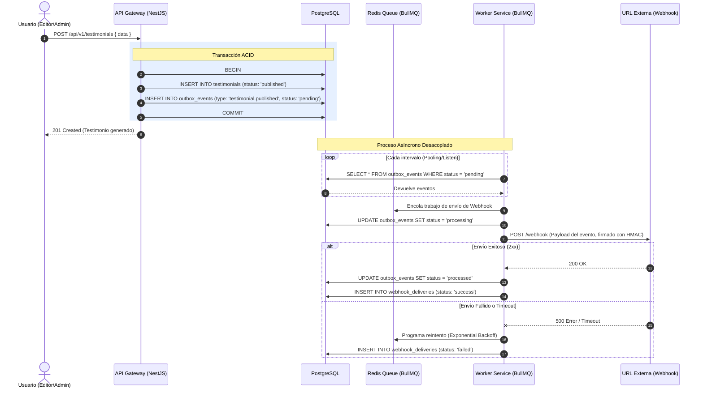
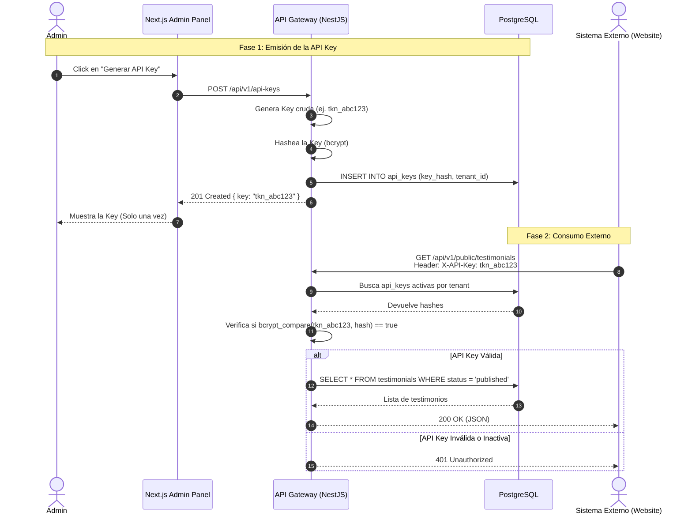
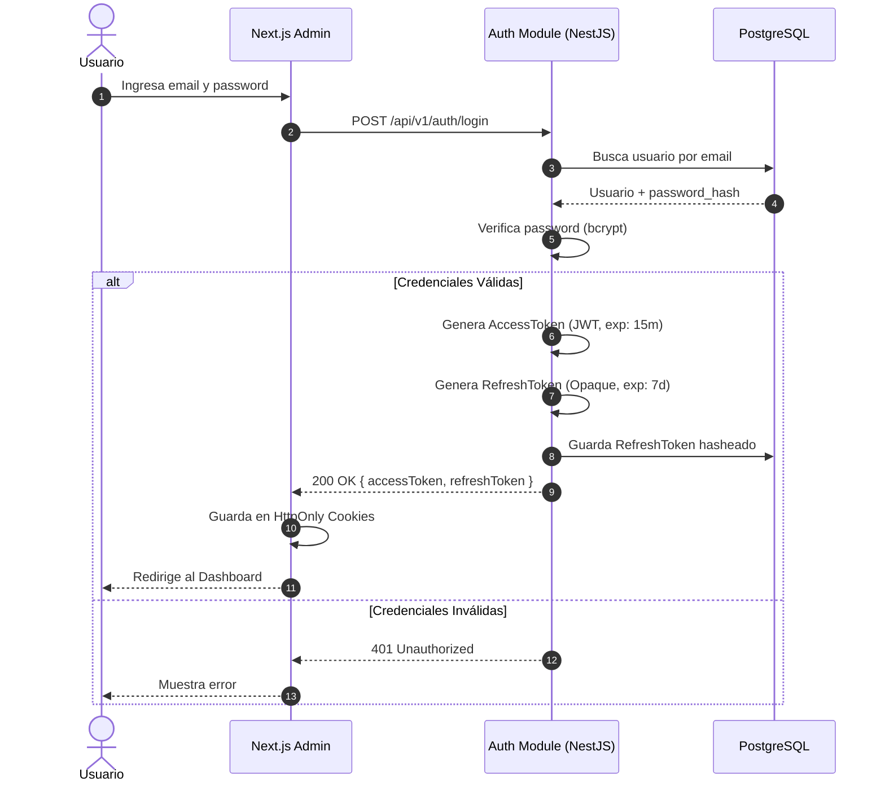

# Flujos del Sistema y Despliegue (C4 - Secuencia e Infraestructura)

Este documento detalla los flujos de interacción críticos (Perspectiva Funcional) y la topología de la infraestructura (Perspectiva de Despliegue).

## 1. Perspectiva Funcional (Diagramas de Secuencia)

### 1.1. Creación de Testimonio y Disparo de Webhook (Patrón Outbox)

Este flujo demuestra cómo el sistema maneja de forma asíncrona y tolerante a fallos la notificación a sistemas externos (Webhooks) cuando un testimonio cambia de estado (ej. de pendiente a publicado).



### 1.2. Generación y Consumo con API Keys

Para que sitios web externos o clientes consuman los testimonios de forma segura (sin exponer un usuario/contraseña de administrador), se emiten API Keys que viajan en el header HTTP.



### 1.3. Flujo de Autenticación y Autorización (JWT)

El sistema admin utiliza un patrón de sesión corta con `access_token` y rotación de `refresh_token` para mitigar ataques y permitir revocación.



---

## 2. Perspectiva de Despliegue (Infraestructura)

El siguiente diagrama muestra la arquitectura de despliegue objetivo (Cloud/Kubernetes o Docker Swarm) y las redes involucradas, cumpliendo el Nivel de "Deployment" del modelo C4.

```mermaid
flowchart TB
    subgraph Internet["Internet Público"]
        C[Cliente Web / Móvil]
        E[Servicios Externos<br/>Slack / CRM]
    end

    subgraph Cloud["Entorno Cloud (AWS / Vercel)"]
        
        subgraph CDN["Edge Network"]
            CF[Cloudflare / Vercel Edge<br/>(WAF, DDoS, Caching Estático)]
        end

        subgraph VPC["Red Privada Virtual (VPC)"]
            
            LB[Load Balancer / Nginx Reverse Proxy]
            
            subgraph K8s["Clúster de Contenedores (Docker / K8s)"]
                
                subgraph NextPods["Frontend Layer"]
                    Next1[Next.js App 1]
                    Next2[Next.js App 2]
                end

                subgraph APIPods["API Layer"]
                    API1[NestJS API 1]
                    API2[NestJS API 2]
                end

                subgraph WorkerPods["Async Processing"]
                    W1[BullMQ Worker 1]
                    W2[BullMQ Worker 2]
                end
            end
            
            subgraph DataStores["Bases de Datos Administradas"]
                PG[(PostgreSQL 16<br/>Primaria / Multi-AZ)]
                REDIS[(Redis 7<br/>Cache & BullMQ)]
            end
        end
    end

    C -- "HTTPS" --> CF
    CF -- "Trafico Limpio" --> LB
    
    LB -- "/admin, /" --> Next1 & Next2
    LB -- "/api" --> API1 & API2

    Next1 & Next2 -- "Llamadas API Internas" --> API1 & API2
    
    API1 & API2 -- "Consultas DML/DDL" --> PG
    API1 & API2 -- "Pub/Sub, Cache" --> REDIS
    
    W1 & W2 -- "Procesa Trabajos" --> REDIS
    W1 & W2 -- "Actualiza Estados" --> PG
    
    W1 & W2 -- "Notificaciones HTTPS" --> E
```
