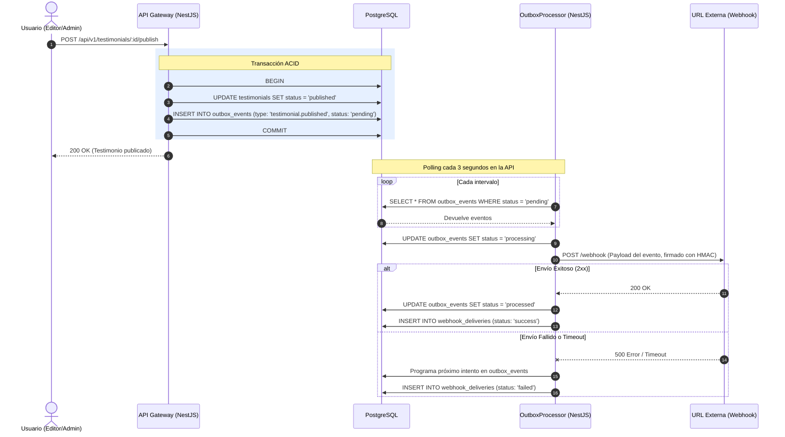
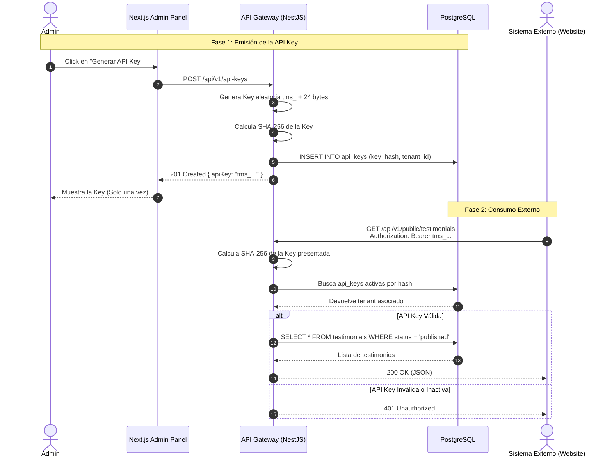
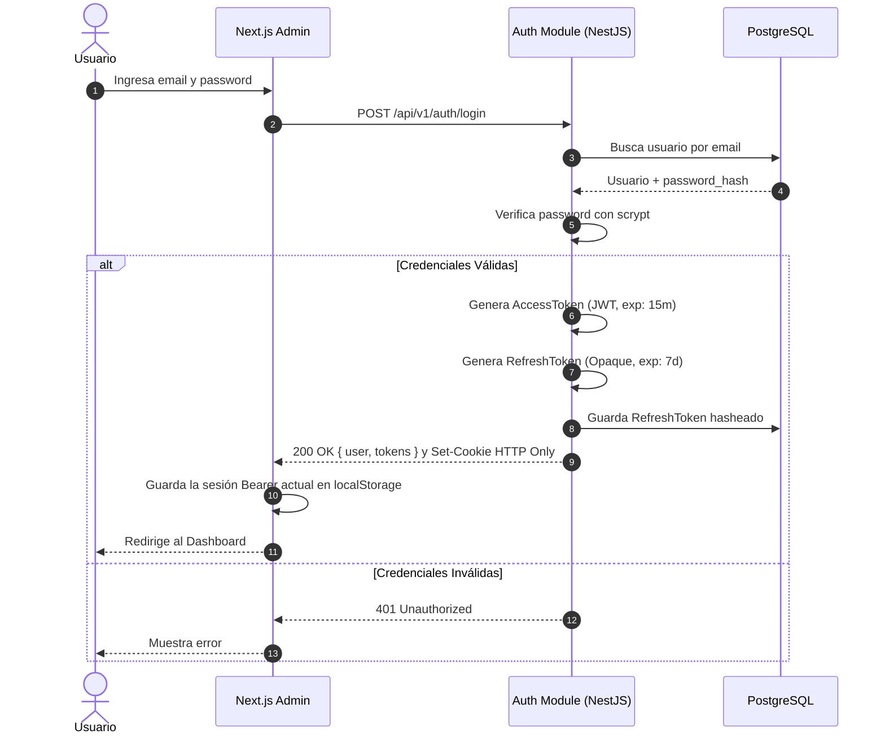

# Flujos del Sistema y Despliegue (C4 - Secuencia e Infraestructura)

Este documento detalla los flujos de interacción críticos (Perspectiva Funcional) y la topología de la infraestructura (Perspectiva de Despliegue).

## 1. Perspectiva Funcional (Diagramas de Secuencia)

### 1.1. Creación de Testimonio y Disparo de Webhook (Patrón Outbox)

Este flujo demuestra cómo el sistema maneja de forma asíncrona y tolerante a fallos la notificación a sistemas externos (Webhooks) cuando un testimonio cambia de estado (ej. de pendiente a publicado).

```mermaid
sequenceDiagram
    autonumber
    actor U as Usuario (Editor/Admin)
    participant API as API Gateway (NestJS)
    participant DB as PostgreSQL
    participant Worker as OutboxProcessor (NestJS)
    participant Ext as URL Externa (Webhook)

    U->>API: POST /api/v1/testimonials/:id/publish
    
    rect rgb(230, 240, 255)
    Note over API,DB: Transacción ACID
    API->>DB: BEGIN
    API->>DB: UPDATE testimonials SET status = 'published'
    API->>DB: INSERT INTO outbox_events (type: 'testimonial.published', status: 'pending')
    API->>DB: COMMIT
    end

    API-->>U: 200 OK (Testimonio publicado)

    Note over Worker,DB: Polling cada 3 segundos en la API
    loop Cada intervalo
        Worker->>DB: SELECT * FROM outbox_events WHERE status = 'pending'
        DB-->>Worker: Devuelve eventos
    end

    Worker->>DB: UPDATE outbox_events SET status = 'processing'
    
    Worker->>Ext: POST /webhook (Payload del evento, firmado con HMAC)
    
    alt Envío Exitoso (2xx)
        Ext-->>Worker: 200 OK
        Worker->>DB: UPDATE outbox_events SET status = 'processed'
        Worker->>DB: INSERT INTO webhook_deliveries (status: 'success')
    else Envío Fallido o Timeout
        Ext--xWorker: 500 Error / Timeout
        Worker->>DB: Programa próximo intento en outbox_events
        Worker->>DB: INSERT INTO webhook_deliveries (status: 'failed')
    end
```

### 1.2. Generación y Consumo con API Keys

Para que sitios web externos o clientes consuman los testimonios de forma segura (sin exponer un usuario/contraseña de administrador), se emiten API Keys que viajan en el header HTTP.

```mermaid
sequenceDiagram
    autonumber
    actor Admin
    participant AdminApp as Next.js Admin Panel
    participant API as API Gateway (NestJS)
    participant DB as PostgreSQL
    actor Client as Sistema Externo (Website)

    Note over Admin,DB: Fase 1: Emisión de la API Key
    Admin->>AdminApp: Click en "Generar API Key"
    AdminApp->>API: POST /api/v1/api-keys
    API->>API: Genera Key aleatoria tms_ + 24 bytes
    API->>API: Calcula SHA-256 de la Key
    API->>DB: INSERT INTO api_keys (key_hash, tenant_id)
    API-->>AdminApp: 201 Created { apiKey: "tms_..." }
    AdminApp-->>Admin: Muestra la Key (Solo una vez)

    Note over Client,DB: Fase 2: Consumo Externo
    Client->>API: GET /api/v1/public/testimonials<br/>Authorization: Bearer tms_...
    API->>API: Calcula SHA-256 de la Key presentada
    API->>DB: Busca api_keys activas por hash
    DB-->>API: Devuelve tenant asociado
    
    alt API Key Válida
        API->>DB: SELECT * FROM testimonials WHERE status = 'published'
        DB-->>API: Lista de testimonios
        API-->>Client: 200 OK (JSON)
    else API Key Inválida o Inactiva
        API-->>Client: 401 Unauthorized
    end
```

### 1.3. Flujo de Autenticación y Autorización (JWT)

El sistema admin utiliza un patrón de sesión corta con `access_token` y rotación de `refresh_token` para mitigar ataques y permitir revocación.

```mermaid
sequenceDiagram
    autonumber
    actor U as Usuario
    participant Next as Next.js Admin
    participant API as Auth Module (NestJS)
    participant DB as PostgreSQL

    U->>Next: Ingresa email y password
    Next->>API: POST /api/v1/auth/login
    API->>DB: Busca usuario por email
    DB-->>API: Usuario + password_hash
    API->>API: Verifica password con scrypt
    
    alt Credenciales Válidas
        API->>API: Genera AccessToken (JWT, exp: 15m)
        API->>API: Genera RefreshToken (Opaque, exp: 7d)
        API->>DB: Guarda RefreshToken hasheado
        API-->>Next: 200 OK { user, tokens } y Set-Cookie HTTP Only
        Next->>Next: Guarda la sesión Bearer actual en localStorage
        Next-->>U: Redirige al Dashboard
    else Credenciales Inválidas
        API-->>Next: 401 Unauthorized
        Next-->>U: Muestra error
    end
```

---

## 2. Perspectiva de ejecución actual

Compose ejecuta la web, la API, PostgreSQL 18 y Redis 7 en desarrollo local. La CI levanta PostgreSQL y Redis descartables y comprueba ambas imágenes. No existe un despliegue cloud verificado.

~~~mermaid
flowchart LR
    U[Usuario web] --> W[Web Next.js]
    W --> A[API NestJS]
    C[Cliente API] --> A
    A --> P[(PostgreSQL 18)]
    A --> R[(Redis 7)]
    A --> H[Webhooks HTTPS]
    A --> X[Cloudinary y YouTube]
    A -.-> O[Métricas protegidas y OTLP opcional]
~~~

El procesador de outbox corre dentro de la API y reclama entregas en PostgreSQL cada tres segundos. Redis atiende cuotas y caché pública, sin intervenir en la entrega durable. El alojamiento de la demostración se definirá en un plan posterior; ver [infraestructura](../operations/01_infrastructure.md).
